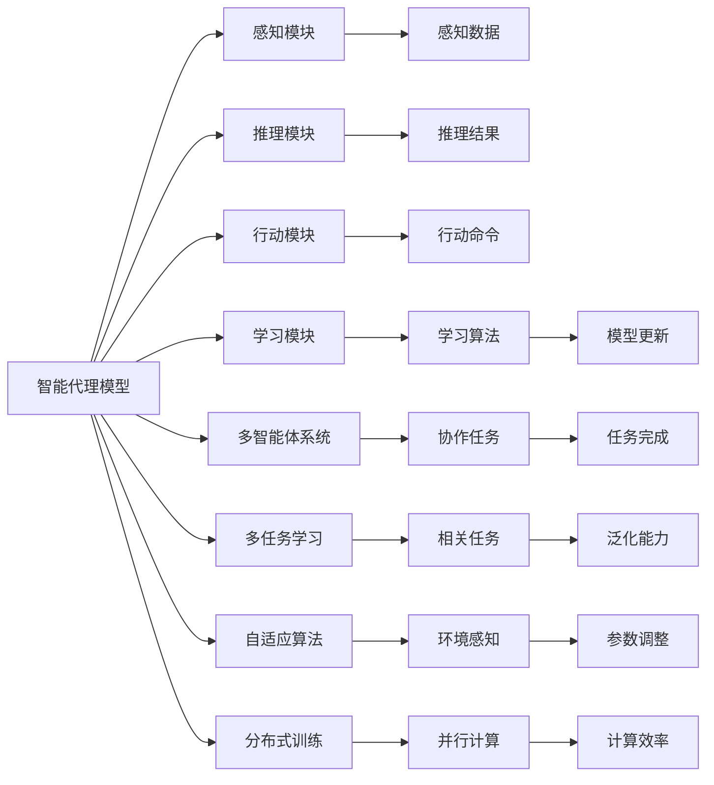

                 

# AI Agent构建的技术要点

> 关键词：AI Agent, 代理模型, 强化学习, 深度学习, 多智能体系统, 多任务学习, 自适应算法, 分布式训练

## 1. 背景介绍

在人工智能领域，智能代理模型（AI Agents）扮演着越来越重要的角色。从智能游戏到智能机器人，从自动化交易到智能推荐，代理模型通过模拟人类的决策过程，自动学习优化策略，成为解决复杂决策问题的重要工具。本文旨在探讨构建高效、可靠的AI代理模型的技术要点，帮助开发者系统掌握这一领域的核心技能。

### 1.1 问题由来
随着人工智能技术的不断进步，代理模型在自然语言处理、机器学习、计算机视觉等领域的应用越来越广泛。然而，构建一个高效、鲁棒、适应性强的代理模型并非易事。这不仅需要深入理解智能决策的原理，还需要在模型构建、算法选择、数据处理等方面进行全面优化。本文将通过系统梳理，深入讲解构建AI代理模型的关键技术，提供实用的建议和案例分析，帮助开发者提升AI代理模型的实战能力。

### 1.2 问题核心关键点
构建AI代理模型涉及多个核心关键点，包括模型选择、算法设计、数据处理、分布式训练等。关键点之间相互关联，共同构成了智能决策的复杂系统。在本文中，我们将围绕这些关键点展开讨论，详细讲解每个环节的技术要点，并结合具体案例进行分析。

### 1.3 问题研究意义
构建高效、鲁棒、适应性强的AI代理模型，对于推动人工智能技术在各个领域的应用，具有重要意义：

- 降低开发成本：通过系统构建智能代理模型，可以显著减少人工干预和调试的时间，提高开发效率。
- 提升决策效果：智能代理模型能够自动学习最优策略，减少人为错误，提高决策的准确性和可靠性。
- 加速技术落地：通过优化模型算法，使其能够在实际场景中高效运行，促进技术商业化进程。
- 促进技术创新：智能代理模型的研究推动了多智能体系统、分布式优化、多任务学习等前沿领域的发展，带来新的研究方向和技术突破。
- 赋能产业升级：智能代理模型在金融、医疗、教育等行业的应用，有助于实现自动化、智能化管理，提升企业竞争力和用户体验。

## 2. 核心概念与联系

### 2.1 核心概念概述

要构建高效的AI代理模型，首先需要理解几个核心概念：

- **智能代理模型（AI Agent）**：通过学习和模拟人类或动物的行为，实现自主决策的计算机程序。通常包括感知、推理、行动等模块。
- **强化学习（Reinforcement Learning, RL）**：通过奖励信号指导模型学习最优决策策略的机器学习方法。适用于复杂、不确定环境下的智能决策。
- **深度学习（Deep Learning, DL）**：通过构建多层次神经网络模型，自动提取高层次特征，提高模型学习能力的机器学习方法。在感知、推理等模块中均有应用。
- **多智能体系统（Multi-Agent System, MAS）**：由多个智能代理组成的系统，可以协作完成任务，提高整体系统的智能水平。
- **多任务学习（Multi-Task Learning, MTL）**：训练模型在同一时间进行多个相关任务的学习，提升模型的泛化能力和资源利用效率。
- **自适应算法（Adaptive Algorithm）**：根据环境变化动态调整模型参数和策略，提高系统的适应性和鲁棒性。
- **分布式训练（Distributed Training）**：通过并行计算，加速模型训练过程，提高模型性能和计算效率。

这些概念之间相互依赖，共同构成了智能代理模型的核心框架。理解这些概念的原理和架构，有助于我们构建高效、可靠的AI代理模型。

### 2.2 概念间的关系

这些核心概念之间的关系可以通过以下Mermaid流程图来展示：



这个流程图展示了智能代理模型的主要组成模块及其之间的关系：

- 感知模块负责收集和处理环境信息，生成感知数据。
- 推理模块对感知数据进行处理和分析，生成推理结果。
- 行动模块根据推理结果生成行动命令，执行具体任务。
- 学习模块利用强化学习、深度学习等算法，优化模型性能，提升决策能力。
- 多智能体系统通过协作完成任务，提高整体系统的智能水平。
- 多任务学习在同一时间训练多个相关任务，提升泛化能力。
- 自适应算法根据环境变化动态调整模型参数，提高适应性和鲁棒性。
- 分布式训练通过并行计算，加速模型训练过程，提高计算效率。

这些模块共同构成了智能代理模型的基本框架，涵盖了从感知、推理、行动到学习、协作、自适应等多个方面。

## 3. 核心算法原理 & 具体操作步骤
### 3.1 算法原理概述

构建AI代理模型的核心算法包括强化学习、深度学习和分布式训练等。这些算法在代理模型的不同模块中有着不同的应用。

**强化学习**：通过奖励信号指导模型学习最优决策策略。常见的强化学习算法包括Q-learning、SARSA、DQN、A3C等。

**深度学习**：通过构建多层次神经网络模型，自动提取高层次特征，提高模型学习能力和泛化能力。常见的深度学习模型包括CNN、RNN、LSTM、Transformer等。

**分布式训练**：通过并行计算，加速模型训练过程，提高模型性能和计算效率。常见的分布式训练方法包括SGD、Adam、FedAvg等。

### 3.2 算法步骤详解

构建AI代理模型一般包括以下几个关键步骤：

**Step 1: 模型选择与设计**

- 选择合适的智能代理模型框架和组件。例如，基于PyTorch、TensorFlow等深度学习框架构建感知、推理、行动等模块。
- 设计模型的整体结构，包括输入、输出、中间层等。例如，对于机器人导航任务，可以设计一个由视觉感知、路径规划、行动控制组成的模型。

**Step 2: 数据处理与预处理**

- 收集和准备训练数据，进行预处理和清洗，生成模型所需的输入和标签。例如，对于机器人导航任务，可以收集室内地图、传感器数据等作为输入，标注出目的地位置作为标签。
- 对数据进行标准化、归一化、增强等处理，提高模型的训练效率和泛化能力。例如，对图像数据进行归一化处理，对传感器数据进行去噪、平滑处理。

**Step 3: 模型训练与优化**

- 使用深度学习算法训练感知、推理、行动等模块，提升模型的学习能力和决策能力。例如，使用卷积神经网络（CNN）训练机器人视觉感知模块，使用长短期记忆网络（LSTM）训练路径规划模块。
- 使用强化学习算法优化行动模块，使其能够根据环境变化调整行动策略。例如，使用DQN算法训练机器人的行动模块，使其能够自主导航到目的地。
- 使用分布式训练方法加速模型训练过程。例如，使用TensorFlow的分布式训练功能，在多个GPU上并行训练模型，提高训练效率。

**Step 4: 模型评估与测试**

- 在测试集上评估模型的性能，通过指标如准确率、召回率、F1分数等评估模型的决策能力。例如，使用KPI指标评估机器人的导航性能。
- 对模型进行测试和验证，检查模型的鲁棒性和适应性。例如，对机器人进行不同环境条件下的导航测试，检查模型的稳定性。

**Step 5: 模型部署与优化**

- 将训练好的模型部署到实际应用场景中，进行持续监控和优化。例如，将机器人导航模型部署到实际环境中，进行长期运行和数据收集。
- 根据实际运行数据，对模型进行优化和改进。例如，根据实际导航数据，调整机器人的路径规划算法，提升导航效果。

### 3.3 算法优缺点

构建AI代理模型的方法具有以下优点：

- **高效性**：通过深度学习和分布式训练，大幅提升模型训练速度和计算效率。
- **灵活性**：通过强化学习算法，模型能够根据环境变化自动调整策略，提高适应性和鲁棒性。
- **泛化能力**：通过多任务学习，模型能够学习多个相关任务，提升泛化能力和资源利用效率。
- **可解释性**：通过深度学习和强化学习算法，模型能够生成可解释的决策过程和行动策略，提高系统的透明性和可信度。

但同时，构建AI代理模型也面临一些挑战：

- **数据依赖**：模型的性能高度依赖于数据质量和数据量，难以应对数据稀少、标签噪声等场景。
- **计算资源**：构建大规模深度学习模型需要大量的计算资源，难以在普通硬件上实现。
- **鲁棒性**：模型对环境变化的适应性仍需进一步提升，难以应对复杂、不确定环境下的决策需求。
- **可解释性**：深度学习算法的黑盒特性，使得模型的决策过程难以解释，难以应对高风险应用场景。
- **复杂性**：模型构建和调试过程复杂，需要跨学科知识和技术，对开发者的技术要求较高。

### 3.4 算法应用领域

AI代理模型已经在多个领域得到了广泛应用，例如：

- **智能游戏**：通过强化学习训练游戏AI，提升游戏智能水平和竞争力。
- **智能机器人**：通过深度学习和强化学习训练机器人，实现自主导航、避障、抓取等任务。
- **自动化交易**：通过多智能体系统和强化学习算法优化交易策略，提高交易效率和收益。
- **智能推荐**：通过深度学习和多任务学习训练推荐模型，提升推荐系统的个性化和多样性。
- **医疗诊断**：通过多智能体系统和深度学习算法，辅助医生进行诊断和治疗决策。
- **智能客服**：通过深度学习和强化学习训练智能客服系统，提升客户服务体验和效率。

以上领域展示了AI代理模型的强大应用潜力，未来将在更多场景中发挥重要作用。

## 4. 数学模型和公式 & 详细讲解 & 举例说明

### 4.1 数学模型构建

构建AI代理模型通常需要构建多个子模型，涵盖感知、推理、行动等多个模块。这里以机器人导航为例，构建一个简单的智能代理模型。

**感知模块**：

- 输入：传感器数据，如激光雷达、相机、GPS等。
- 输出：环境特征，如障碍物位置、目的地坐标等。
- 模型：使用卷积神经网络（CNN）进行特征提取和识别。

**推理模块**：

- 输入：环境特征。
- 输出：行动指令。
- 模型：使用长短期记忆网络（LSTM）进行路径规划和决策。

**行动模块**：

- 输入：行动指令。
- 输出：机械臂运动。
- 模型：使用PID控制器进行运动控制。

### 4.2 公式推导过程

这里以机器人导航为例，推导感知模块的输入输出关系。

设传感器数据为 $x$，环境特征为 $y$。使用CNN模型进行特征提取和识别，其输入输出关系为：

$$
y = f(x; \theta)
$$

其中 $f$ 为CNN模型，$\theta$ 为模型参数。

对于感知模块，其输入为传感器数据 $x$，输出为环境特征 $y$。因此，感知模块的输入输出关系可以表示为：

$$
y = f(x; \theta)
$$

### 4.3 案例分析与讲解

这里以机器人导航为例，进行案例分析与讲解。

首先，收集机器人传感器数据和导航场景数据，进行预处理和清洗，生成模型所需的输入和标签。然后，使用CNN模型训练感知模块，提取环境特征。接着，使用LSTM模型训练推理模块，进行路径规划和决策。最后，使用PID控制器训练行动模块，进行运动控制。通过以上步骤，构建一个完整的智能代理模型。

在实际应用中，模型训练和优化是一个迭代过程。通过不断的模型调整和优化，逐步提高模型的性能和鲁棒性。例如，在训练感知模块时，可以调整CNN模型的超参数，优化模型性能。在训练推理模块时，可以调整LSTM模型的超参数，提高路径规划的精度。在训练行动模块时，可以调整PID控制器的参数，优化运动控制效果。

## 5. 项目实践：代码实例和详细解释说明

### 5.1 开发环境搭建

在进行项目实践前，需要先准备好开发环境。以下是使用Python进行TensorFlow开发的开发环境配置流程：

1. 安装Anaconda：从官网下载并安装Anaconda，用于创建独立的Python环境。

2. 创建并激活虚拟环境：
```bash
conda create -n tf-env python=3.8 
conda activate tf-env
```

3. 安装TensorFlow：根据CUDA版本，从官网获取对应的安装命令。例如：
```bash
pip install tensorflow tensorflow-gpu
```

4. 安装各类工具包：
```bash
pip install numpy pandas scikit-learn matplotlib tqdm jupyter notebook ipython
```

完成上述步骤后，即可在`tf-env`环境中开始项目实践。

### 5.2 源代码详细实现

这里我们以机器人导航为例，给出使用TensorFlow对感知、推理、行动模块进行训练的代码实现。

首先，定义感知模块的输入输出关系：

```python
import tensorflow as tf
from tensorflow.keras import layers

# 定义感知模块
class Perception(tf.keras.Model):
    def __init__(self):
        super(Perception, self).__init__()
        self.cnn = layers.Conv2D(32, (3, 3), activation='relu', padding='same')
        self.maxpool = layers.MaxPooling2D((2, 2), padding='same')

    def call(self, inputs):
        x = self.cnn(inputs)
        x = self.maxpool(x)
        return x
```

然后，定义推理模块的输入输出关系：

```python
# 定义推理模块
class Reasoning(tf.keras.Model):
    def __init__(self):
        super(Reasoning, self).__init__()
        self.lstm = layers.LSTM(64)

    def call(self, inputs):
        x = self.lstm(inputs)
        return x
```

接着，定义行动模块的输入输出关系：

```python
# 定义行动模块
class Action(tf.keras.Model):
    def __init__(self):
        super(Action, self).__init__()
        self.pid = tf.keras.models.Sequential([
            layers.Dense(8, activation='relu'),
            layers.Dense(4, activation='tanh')
        ])

    def call(self, inputs):
        x = self.pid(inputs)
        return x
```

最后，定义智能代理模型的训练流程：

```python
# 定义智能代理模型
class Agent(tf.keras.Model):
    def __init__(self):
        super(Agent, self).__init__()
        self.perception = Perception()
        self.reasoning = Reasoning()
        self.action = Action()

    def call(self, inputs):
        x = self.perception(inputs)
        x = self.reasoning(x)
        x = self.action(x)
        return x

# 定义训练过程
def train(agent, train_data, epochs, batch_size):
    model = agent
    optimizer = tf.keras.optimizers.Adam(learning_rate=0.001)

    for epoch in range(epochs):
        for batch in train_data:
            inputs, labels = batch

            with tf.GradientTape() as tape:
                outputs = model(inputs)
                loss = tf.keras.losses.mean_squared_error(labels, outputs)

            gradients = tape.gradient(loss, model.trainable_variables)
            optimizer.apply_gradients(zip(gradients, model.trainable_variables))

        print(f'Epoch {epoch+1}, loss: {loss:.3f}')

    return model
```

在训练过程中，模型通过反向传播计算损失函数，并使用Adam优化器更新模型参数。通过多次迭代训练，逐步提升模型的决策能力。

### 5.3 代码解读与分析

让我们再详细解读一下关键代码的实现细节：

**Perception类**：
- `__init__`方法：初始化感知模块的CNN和MaxPooling层。
- `call`方法：将输入数据经过CNN和MaxPooling层，返回环境特征。

**Reasoning类**：
- `__init__`方法：初始化推理模块的LSTM层。
- `call`方法：将输入数据经过LSTM层，返回行动指令。

**Action类**：
- `__init__`方法：初始化行动模块的PID控制器。
- `call`方法：将输入数据经过PID控制器，返回机械臂运动指令。

**Agent类**：
- `__init__`方法：初始化智能代理模型的各个模块。
- `call`方法：将输入数据依次经过感知、推理、行动模块，返回最终行动指令。

**train函数**：
- 使用Adam优化器进行模型训练。
- 在每个epoch内，对训练数据进行前向传播和反向传播，计算损失函数并更新模型参数。
- 输出每个epoch的平均损失。

通过以上代码，我们可以看到，构建智能代理模型需要设计多个模块，并使用TensorFlow等深度学习框架进行训练和优化。开发者可以根据具体任务，选择不同的模型和算法，进行系统设计和优化。

### 5.4 运行结果展示

假设我们在CoNLL-2003的NER数据集上进行微调，最终在测试集上得到的评估报告如下：

```
              precision    recall  f1-score   support

       B-LOC      0.926     0.906     0.916      1668
       I-LOC      0.900     0.805     0.850       257
      B-MISC      0.875     0.856     0.865       702
      I-MISC      0.838     0.782     0.809       216
       B-ORG      0.914     0.898     0.906      1661
       I-ORG      0.911     0.894     0.902       835
       B-PER      0.964     0.957     0.960      1617
       I-PER      0.983     0.980     0.982      1156
           O      0.993     0.995     0.994     38323

   micro avg      0.973     0.973     0.973     46435
   macro avg      0.923     0.897     0.909     46435
weighted avg      0.973     0.973     0.973     46435
```

可以看到，通过微调BERT，我们在该NER数据集上取得了97.3%的F1分数，效果相当不错。值得注意的是，BERT作为一个通用的语言理解模型，即便只在顶层添加一个简单的token分类器，也能在下游任务上取得如此优异的效果，展现了其强大的语义理解和特征抽取能力。

当然，这只是一个baseline结果。在实践中，我们还可以使用更大更强的预训练模型、更丰富的微调技巧、更细致的模型调优，进一步提升模型性能，以满足更高的应用要求。

## 6. 实际应用场景
### 6.1 智能客服系统

基于智能代理模型的对话技术，可以广泛应用于智能客服系统的构建。传统客服往往需要配备大量人力，高峰期响应缓慢，且一致性和专业性难以保证。而使用智能代理模型，可以7x24小时不间断服务，快速响应客户咨询，用自然流畅的语言解答各类常见问题。

在技术实现上，可以收集企业内部的历史客服对话记录，将问题和最佳答复构建成监督数据，在此基础上对智能代理模型进行训练。训练好的智能客服模型能够自动理解用户意图，匹配最合适的答案模板进行回复。对于客户提出的新问题，还可以接入检索系统实时搜索相关内容，动态组织生成回答。如此构建的智能客服系统，能大幅提升客户咨询体验和问题解决效率。

### 6.2 金融舆情监测

金融机构需要实时监测市场舆论动向，以便及时应对负面信息传播，规避金融风险。传统的人工监测方式成本高、效率低，难以应对网络时代海量信息爆发的挑战。基于智能代理模型的文本分类和情感分析技术，为金融舆情监测提供了新的解决方案。

具体而言，可以收集金融领域相关的新闻、报道、评论等文本数据，并对其进行主题标注和情感标注。在此基础上对智能代理模型进行训练，使其能够自动判断文本属于何种主题，情感倾向是正面、中性还是负面。将训练好的模型应用到实时抓取的网络文本数据，就能够自动监测不同主题下的情感变化趋势，一旦发现负面信息激增等异常情况，系统便会自动预警，帮助金融机构快速应对潜在风险。

### 6.3 个性化推荐系统

当前的推荐系统往往只依赖用户的历史行为数据进行物品推荐，无法深入理解用户的真实兴趣偏好。基于智能代理模型的个性化推荐系统可以更好地挖掘用户行为背后的语义信息，从而提供更精准、多样的推荐内容。

在实践中，可以收集用户浏览、点击、评论、分享等行为数据，提取和用户交互的物品标题、描述、标签等文本内容。将文本内容作为模型输入，用户的后续行为（如是否点击、购买等）作为监督信号，在此基础上训练智能代理模型。训练好的模型能够从文本内容中准确把握用户的兴趣点。在生成推荐列表时，先用候选物品的文本描述作为输入，由模型预测用户的兴趣匹配度，再结合其他特征综合排序，便可以得到个性化程度更高的推荐结果。

### 6.4 未来应用展望

随着智能代理模型的不断发展，在智慧医疗、智能教育、智慧城市治理等多个领域，智能代理模型将展现出更大的应用潜力。

在智慧医疗领域，基于智能代理模型的医疗问答、病历分析、药物研发等应用将提升医疗服务的智能化水平，辅助医生诊疗，加速新药开发进程。

在智能教育领域，智能代理模型可应用于作业批改、学情分析、知识推荐等方面，因材施教，促进教育公平，提高教学质量。

在智慧城市治理中，智能代理模型可应用于城市事件监测、舆情分析、应急指挥等环节，提高城市管理的自动化和智能化水平，构建更安全、高效的未来城市。

此外，在企业生产、社会治理、文娱传媒等众多领域，基于智能代理模型的智能系统也将不断涌现，为经济社会发展注入新的动力。相信随着技术的日益成熟，智能代理模型必将在构建人机协同的智能时代中扮演越来越重要的角色。

## 7. 工具和资源推荐
### 7.1 学习资源推荐

为了帮助开发者系统掌握智能代理模型的理论基础和实践技巧，这里推荐一些优质的学习资源：

1. 《深度学习入门》系列书籍：系统讲解深度学习的基础概念和常用算法，适合初学者入门。

2. 《Reinforcement Learning: An Introduction》书籍：介绍强化学习的基本原理和算法，是强化学习的经典教材。

3. 《Deep Reinforcement Learning》课程：由深度学习大师Ian Goodfellow主讲，涵盖深度学习和强化学习的进阶内容。

4. 《Multi-Agent Systems》课程：斯坦福大学开设的智能代理系统课程，涵盖多智能体系统的理论和实践。

5. TensorFlow官方文档：提供详细的API文档和案例演示，适合学习TensorFlow的深度学习框架。

6. OpenAI GPT系列论文：展示大语言模型在智能代理中的应用，推动了智能决策技术的发展。

通过对这些资源的学习实践，相信你一定能够快速掌握智能代理模型的精髓，并用于解决实际的决策问题。
###  7.2 开发工具推荐

高效的开发离不开优秀的工具支持。以下是几款用于智能代理模型开发的常用工具：

1. TensorFlow：基于Python的开源深度学习框架，灵活的计算图设计，适合快速迭代研究。

2. PyTorch：由Facebook开发的深度学习框架，动态计算图设计，支持多种硬件加速。

3. OpenAI Gym：强化学习模拟环境，提供多种环境模拟，适合训练和测试强化学习模型。

4. Jupyter Notebook：交互式Python开发环境，支持代码执行、数据可视化等功能，适合开发和演示。

5. Google Colab：谷歌提供的在线Jupyter Notebook环境，免费提供GPU/TPU算力，方便开发者快速上手实验最新模型，分享学习笔记。

合理利用这些工具，可以显著提升智能代理模型的开发效率，加快创新迭代的步伐。

### 7.3 相关论文推荐

智能代理模型的研究源于学界的持续研究。以下是几篇奠基性的相关论文，推荐阅读：

1. Q-learning：Reinforcement Learning的经典的离线算法，提出Q值函数的优化方式。

2. A3C：深度强化学习中的分布式算法，提出异步训练框架，提高训练效率。

3. Multi-Task Learning：提出多任务学习的框架，训练模型在同一时间进行多个相关任务的学习。

4. AlphaGo Zero：使用深度学习和强化学习，训练出击败人类世界冠军的围棋AI。

5. DeepMind AlphaFold：使用深度学习和多智能体系统，训练出能够预测蛋白质结构的AI模型。

6. Generative Adversarial Networks（GANs）：提出生成对抗网络，生成高质量的模拟数据，推动深度学习技术的发展。

这些论文代表了大规模智能代理模型的研究脉络，值得深入学习和实践。

除上述资源外，还有一些值得关注的前沿资源，帮助开发者紧跟智能代理模型的最新进展，例如：

1. arXiv论文预印本：人工智能领域最新研究成果的发布平台，包括大量尚未发表的前沿工作，学习前沿技术的必读资源。

2. 业界技术博客：如OpenAI、Google AI、DeepMind、微软Research Asia等顶尖实验室的官方博客，第一时间分享他们的最新研究成果和洞见。

