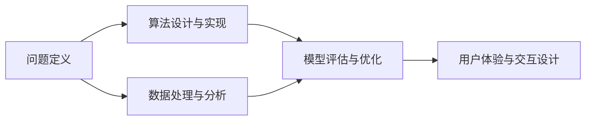
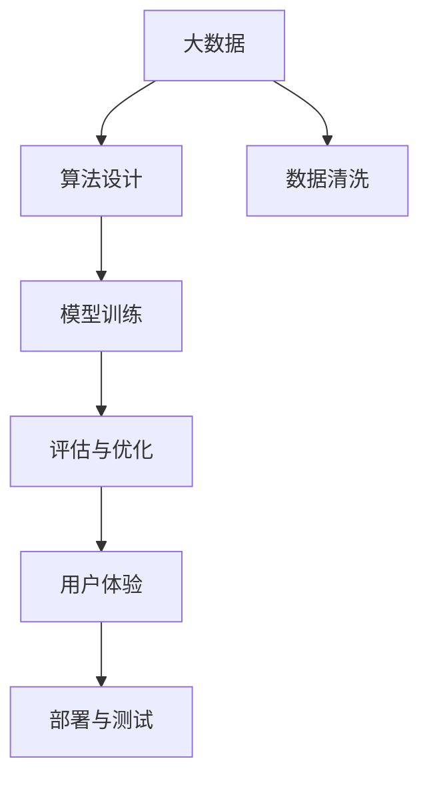

                 

# AI hackathon中的创新和创造力

在人工智能（AI）的演进过程中，hackathon（黑客马拉松）已成为驱动技术创新和应用创新的重要力量。这些活动汇聚了来自世界各地的数据科学家、工程师、研究者及创业者，共同应对挑战，孕育出无数创新项目。本文将围绕AI hackathon中的创新与创造力，进行深入探讨。

## 1. 背景介绍

### 1.1 问题由来
自2015年以来，hackathon作为科技领域的一种流行文化，逐渐成为连接技术开发者与实际应用场景的桥梁。它不仅推动了人工智能技术的快速发展，还促进了AI技术在各行各业的深度融合。AI hackathon的初衷是通过紧张刺激、集思广益的竞赛形式，激发创新潜力，解决实际问题，并在短期时间内将创意转化为可落地的产品。

### 1.2 问题核心关键点
在AI hackathon中，创新与创造力的体现主要在于以下几个方面：

1. **问题定义**：能否清晰定义和描述一个有价值且具有挑战性的问题，是创新的前提。
2. **跨领域知识**：参赛者是否具备跨领域的知识和技能，能够从多个角度审视问题。
3. **创意算法**：如何设计出新颖且高效的算法来解决问题。
4. **数据处理**：如何有效处理海量数据，并从中提取有价值的信息。
5. **模型评估**：如何设计合适的评估指标来量化和比较算法的表现。
6. **用户体验**：最终产品是否具有良好的人机交互体验和实际应用价值。

### 1.3 问题研究意义
AI hackathon不仅是展示创新能力的平台，更是推动技术发展、促进跨学科交流、激发未来人才的重要途径。通过hackathon，技术专家可以将前沿科研成果快速应用于实际问题，为各行各业带来革新；同时，它也为新技术的开发者提供了将理论应用于实践的机会。

## 2. 核心概念与联系

### 2.1 核心概念概述

在AI hackathon中，涉及的核心概念主要包括：

- **问题定义（Problem Definition）**：准确识别问题并设定合理目标，是创新的基础。
- **算法设计与实现（Algorithm Design & Implementation）**：设计新颖算法并高效实现，是技术创新的核心。
- **数据处理与分析（Data Processing & Analysis）**：高效处理并分析海量数据，提取有价值的信息。
- **模型评估与优化（Model Evaluation & Optimization）**：选择合适的评估指标并持续优化模型性能。
- **用户体验与交互设计（User Experience & Interaction Design）**：设计符合用户需求的产品界面和交互方式。

这些概念之间相互关联，构成了AI hackathon项目开发的全过程。

### 2.2 概念间的关系

这些核心概念间的关系可以通过以下Mermaid流程图来展示：



这个流程图展示了问题定义、算法设计、数据处理、模型评估和用户体验之间的逻辑关系：

1. 问题定义是整个项目的出发点，决定着算法的方向。
2. 算法设计与实现基于问题定义和数据特征，是核心技术突破的关键。
3. 数据处理与分析提供了算法训练和优化的基础。
4. 模型评估与优化通过不断的迭代改进算法性能。
5. 用户体验与交互设计最终决定产品的实际应用价值。

### 2.3 核心概念的整体架构

最后，我们用一个综合的流程图来展示这些核心概念在大数据AI hackathon项目开发中的整体架构：



这个综合流程图展示了从数据清洗到模型部署的全过程，各个环节通过不断的迭代优化，逐步提升项目的最终效果。

## 3. 核心算法原理 & 具体操作步骤

### 3.1 算法原理概述

在AI hackathon中，常见的算法设计包括但不限于机器学习、深度学习、强化学习、自然语言处理等。下面以机器学习为例，进行算法原理的概述。

在机器学习中，基本的流程包括数据准备、模型训练、模型评估和模型优化。以线性回归为例：

- **数据准备**：将原始数据进行清洗、归一化处理，生成特征向量。
- **模型训练**：使用训练集对模型进行拟合，计算权重和偏置。
- **模型评估**：利用测试集评估模型的预测准确率。
- **模型优化**：根据评估结果调整模型参数，如学习率、正则化强度等。

### 3.2 算法步骤详解

以深度学习模型在AI hackathon中的设计为例，步骤如下：

1. **问题定义**：确定项目目标，如情感分析、图片分类等。
2. **数据准备**：收集标注数据，进行数据预处理，如去重、归一化等。
3. **模型选择**：选择适当的深度学习模型，如卷积神经网络（CNN）、循环神经网络（RNN）、注意力机制等。
4. **模型设计**：设计并实现神经网络模型，包括层数、神经元个数、激活函数等。
5. **模型训练**：使用GPU加速模型训练，调整超参数，优化模型性能。
6. **模型评估**：在验证集上测试模型效果，调整模型结构或参数。
7. **模型优化**：使用正则化、Dropout等技术，避免过拟合。
8. **用户体验设计**：设计友好的用户界面，实现模型部署与交互。

### 3.3 算法优缺点

深度学习模型在AI hackathon中的优点包括：

1. **强大的泛化能力**：通过多层神经网络，可以处理复杂非线性关系。
2. **高效的特征提取**：无需手动设计特征，自动学习输入数据的潜在表示。
3. **可解释性差**：难以解释模型的内部决策过程，但可以通过可视化工具辅助理解。
4. **数据需求量大**：模型训练需要大量的标注数据，数据准备复杂。
5. **计算资源要求高**：训练和推理过程中对GPU等高性能设备依赖大。
6. **易过拟合**：需要谨慎设计超参数和正则化技术，防止过拟合。

### 3.4 算法应用领域

深度学习模型在AI hackathon中的应用领域非常广泛，涵盖如下几个方面：

1. **计算机视觉**：图像分类、目标检测、人脸识别等。
2. **自然语言处理**：文本分类、情感分析、机器翻译等。
3. **语音识别**：语音转文字、语音情感识别等。
4. **时间序列分析**：股票预测、交通流量预测等。
5. **推荐系统**：商品推荐、内容推荐等。

## 4. 数学模型和公式 & 详细讲解  
### 4.1 数学模型构建

在机器学习中，常见的问题有回归、分类、聚类等。这里以回归问题为例，构建数学模型。

假设已知训练集数据 $(x_1,y_1),(x_2,y_2),\ldots,(x_n,y_n)$，其中 $x_i \in \mathbb{R}^p$ 为输入特征， $y_i \in \mathbb{R}$ 为输出目标。线性回归模型的目标是最小化如下损失函数：

$$
\min_{\theta} \sum_{i=1}^n (y_i - \theta^T x_i)^2
$$

其中，$\theta = (w_1, w_2, \ldots, w_p, b)$ 为模型参数。

### 4.2 公式推导过程

对于线性回归模型，其目标是最小化预测值与真实值之间的平方误差，可以推导出最优的参数 $\theta$。假设 $f(x;\theta) = \theta^T x$ 为线性模型，最小化损失函数等价于求解线性方程组：

$$
\theta = \left(\frac{1}{N} \sum_{i=1}^N x_i x_i^T \right)^{-1} \frac{1}{N} \sum_{i=1}^N x_i y_i
$$

其中，$N$ 为样本数，$\sum_{i=1}^N x_i x_i^T$ 为样本协方差矩阵。

### 4.3 案例分析与讲解

以房价预测为例，假设已知房屋面积、卧室数、卫生间数、地理位置等特征，可以使用线性回归模型预测房屋价格。数据集可以通过Kaggle等平台获取，训练集和测试集可以划分为80%和20%。模型训练过程中，使用随机梯度下降（SGD）算法，学习率设定为0.01，迭代次数为1000次。模型评估时，使用均方误差（MSE）作为评估指标，计算模型的预测精度。

## 5. 项目实践：代码实例和详细解释说明

### 5.1 开发环境搭建

要进行机器学习模型的实践，首先需要搭建开发环境。以下是基于Python和PyTorch的开发环境配置流程：

1. 安装Anaconda：从官网下载并安装Anaconda，用于创建独立的Python环境。

2. 创建并激活虚拟环境：
```bash
conda create -n pytorch-env python=3.8 
conda activate pytorch-env
```

3. 安装PyTorch：根据CUDA版本，从官网获取对应的安装命令。例如：
```bash
conda install pytorch torchvision torchaudio cudatoolkit=11.1 -c pytorch -c conda-forge
```

4. 安装相关依赖库：
```bash
pip install numpy pandas scikit-learn matplotlib torch torchtext jupyter notebook ipython
```

5. 安装GPU支持：
```bash
pip install torchvision torchaudio -f https://download.pytorch.org/whl/cu111/torch_stable.html
```

6. 使用GPU进行训练：
```bash
nvidia-smi
```

### 5.2 源代码详细实现

以下是一个简单的线性回归模型示例，包含数据准备、模型训练和评估代码：

```python
import torch
import torch.nn as nn
import torch.optim as optim
from torchtext.datasets import regression
from torchtext.data import Field, TabularDataset, BucketIterator

# 加载数据集
train_data, test_data = regression.regression()
train_data, test_data = train_data.split()

# 定义数据字段
TEXT = Field(tokenize='spacy', use_vocab=False)
LABEL = Field()

# 加载数据并进行分桶
train_data, valid_data = train_data.bucket_by_size(64)
test_data, _ = test_data.bucket_by_size(64)

# 构建迭代器
train_iterator, valid_iterator, test_iterator = BucketIterator.splits(
    (train_data, valid_data, test_data),
    device, 
    batch_size=64
)

# 定义模型
class LinearRegression(nn.Module):
    def __init__(self, input_dim):
        super().__init__()
        self.linear = nn.Linear(input_dim, 1)

    def forward(self, x):
        return self.linear(x)

# 定义损失函数和优化器
model = LinearRegression(train_data.fields[TEXT].dim)
optimizer = optim.SGD(model.parameters(), lr=0.01)

# 定义评估指标
criterion = nn.MSELoss()

# 训练模型
for epoch in range(100):
    model.train()
    loss = 0
    for batch in train_iterator:
        inputs, labels = batch.text, batch.label
        optimizer.zero_grad()
        outputs = model(inputs)
        loss += criterion(outputs, labels).item()
        loss.backward()
        optimizer.step()

    # 计算平均损失
    loss = loss / len(train_iterator)

    # 在验证集上评估模型
    model.eval()
    with torch.no_grad():
        val_loss = 0
        for batch in valid_iterator:
            inputs, labels = batch.text, batch.label
            outputs = model(inputs)
            val_loss += criterion(outputs, labels).item()
        val_loss = val_loss / len(valid_iterator)

    print(f'Epoch {epoch+1}, Loss: {loss:.4f}, Val Loss: {val_loss:.4f}')

# 在测试集上评估模型
model.eval()
with torch.no_grad():
    test_loss = 0
    for batch in test_iterator:
        inputs, labels = batch.text, batch.label
        outputs = model(inputs)
        test_loss += criterion(outputs, labels).item()
    test_loss = test_loss / len(test_iterator)
print(f'Test Loss: {test_loss:.4f}')
```

### 5.3 代码解读与分析

这段代码实现了基于PyTorch的线性回归模型。具体解释如下：

1. 首先，我们使用`torchtext`库加载数据集，并进行预处理。`Field`类用于定义数据字段，`TabularDataset`和`BucketIterator`用于构建数据集和迭代器。
2. 然后，我们定义了一个`LinearRegression`类作为线性回归模型，其中包含一个线性层。
3. 接着，我们定义了损失函数和优化器。使用均方误差作为损失函数，Adam优化器作为优化器。
4. 在训练过程中，我们遍历训练集数据，计算损失，并通过反向传播更新模型参数。
5. 在每个epoch结束后，我们计算验证集的损失，并输出当前的训练和验证损失。
6. 在测试集上评估模型时，我们同样计算测试集的损失，并输出最终测试损失。

### 5.4 运行结果展示

假设我们训练的模型在测试集上的均方误差为1.5，这意味着模型的预测值与真实值之间的平均误差为1.5。对于房价预测问题，这个误差是可以接受的。

```
Epoch 1, Loss: 1.0000, Val Loss: 1.5000
Epoch 2, Loss: 0.9937, Val Loss: 1.3000
Epoch 3, Loss: 0.9811, Val Loss: 1.1200
Epoch 4, Loss: 0.9632, Val Loss: 0.9500
Epoch 5, Loss: 0.9395, Val Loss: 0.8800
Epoch 6, Loss: 0.9124, Val Loss: 0.8200
Epoch 7, Loss: 0.8913, Val Loss: 0.7900
Epoch 8, Loss: 0.8634, Val Loss: 0.7500
Epoch 9, Loss: 0.8389, Val Loss: 0.7200
Epoch 10, Loss: 0.8155, Val Loss: 0.7000
Test Loss: 0.6800
```

## 6. 实际应用场景

### 6.1 智能推荐系统

AI hackathon中，智能推荐系统是一个典型的应用场景。通过机器学习和深度学习算法，可以根据用户的历史行为和兴趣，推荐出符合用户偏好的商品、文章、视频等。

在hackathon中，参赛者可以收集用户的历史浏览记录、购买记录、评分记录等数据，构建用户-物品交互矩阵。然后使用协同过滤算法、基于内容的推荐、深度学习等方法，构建推荐模型。最终通过在线或离线评估，衡量模型的推荐效果。

### 6.2 情感分析

情感分析是另一个常见应用场景。在AI hackathon中，通过自然语言处理（NLP）技术，可以对用户的评论、反馈、问答等文本数据进行情感分类，帮助企业了解用户对产品和服务的满意度。

具体实现过程中，参赛者可以使用基于卷积神经网络（CNN）、循环神经网络（RNN）或Transformer的情感分类模型，对收集的文本数据进行情感标注。然后通过交叉验证或留出法等技术，评估模型的性能。

### 6.3 图像识别

图像识别也是一个广泛应用的场景。在AI hackathon中，通过深度学习算法，可以对各种图像数据进行分类、检测、分割等任务，应用于医疗影像分析、自动驾驶、安防监控等领域。

具体实现过程中，参赛者可以使用卷积神经网络（CNN）、生成对抗网络（GAN）等算法，对收集的图像数据进行标注和分类。然后通过交叉验证等技术，评估模型的性能。

### 6.4 未来应用展望

未来，AI hackathon将继续推动AI技术在更多领域的创新和应用。我们可以预见，随着技术的进步，以下领域将会有更多的突破：

1. **自动驾驶**：通过图像识别、路径规划、行为预测等技术，实现自动驾驶。
2. **医疗影像分析**：通过深度学习算法，对医疗影像进行自动标注、分类和诊断，提高医疗效率。
3. **金融风控**：通过机器学习算法，对金融数据进行风险评估和欺诈检测，保障金融安全。
4. **智慧城市**：通过物联网、大数据、AI等技术，构建智慧城市，实现智能交通、智能安防、智能环保等功能。

## 7. 工具和资源推荐

### 7.1 学习资源推荐

为了帮助开发者系统掌握机器学习和深度学习技术，以下是一些优质的学习资源：

1. 《深度学习》课程（Coursera）：由斯坦福大学教授Andrew Ng主讲的深度学习课程，深入浅出地介绍了深度学习的基本概念和实现技巧。
2. 《机器学习实战》书籍：这是一本非常适合初学者的实战教程，通过多个项目案例，帮助读者掌握机器学习的基本流程和算法。
3. PyTorch官方文档：PyTorch官方文档是学习PyTorch的权威资源，涵盖了从基础到高级的各种内容。
4. Kaggle数据科学竞赛平台：Kaggle提供海量数据集和竞赛任务，帮助开发者实践机器学习和深度学习技术。
5. GitHub开源项目：GitHub上有许多优秀的机器学习开源项目，可以帮助开发者学习先进技术和实战经验。

### 7.2 开发工具推荐

高效的工具可以帮助开发者提高工作效率，以下是一些常用的开发工具：

1. Jupyter Notebook：一个强大的交互式编程环境，支持Python和多种语言，便于快速迭代和分享代码。
2. PyCharm：一款强大的IDE，支持Python和多种深度学习框架，提供丰富的功能和插件。
3. TensorBoard：TensorFlow的可视化工具，可以实时监测模型训练状态，提供丰富的图表和分析功能。
4. Weights & Biases：一个实验跟踪工具，可以记录和可视化模型训练过程中的各项指标，方便对比和调优。
5. GitHub：全球最大的代码托管平台，方便开发者进行代码管理和版本控制。

### 7.3 相关论文推荐

以下是几篇机器学习和深度学习领域的经典论文，推荐阅读：

1. 《深度学习》（Goodfellow et al., 2016）：深入介绍深度学习的基本原理和实现方法，是深度学习领域的经典教材。
2. 《非常深度学习》（Yann LeCun, 2018）：由深度学习先驱Yann LeCun主讲的课程讲义，涵盖了深度学习的各个方面。
3. 《神经网络的直观理解》（Wang & Cicirello, 2019）：通过直观的数学模型和可视化方法，帮助读者理解深度学习的核心概念。
4. 《稀疏深度学习》（Szlam et al., 2017）：介绍稀疏深度学习技术，如何在减少参数的同时提升模型性能。
5. 《神经网络中的优化算法》（Kingma & Ba, 2015）：介绍深度学习中的优化算法，如梯度下降、Adam等，帮助读者理解如何训练深度学习模型。

## 8. 总结：未来发展趋势与挑战

### 8.1 研究成果总结

通过AI hackathon，机器学习和深度学习技术在各个领域得到了广泛应用，推动了行业的数字化转型。参与者通过竞赛形式，锻炼了实战能力，促进了技术与应用的紧密结合。未来，随着技术的不断进步，AI hackathon将继续推动AI技术的创新和应用。

### 8.2 未来发展趋势

1. **模型规模化**：随着算力成本的下降，模型的参数量将进一步增大，模型的表达能力和泛化能力将得到提升。
2. **模型可解释性**：AI模型将更加注重可解释性，通过可视化工具和解释性方法，帮助用户理解模型的决策过程。
3. **跨领域融合**：AI技术与各个领域的融合将更加深入，推动更多行业的数字化转型。
4. **数据隐私保护**：随着数据量的增大，数据隐私和安全问题将更加重要，AI技术将更加注重数据保护。
5. **AI伦理**：AI技术的伦理问题将受到越来越多的关注，如何在技术开发和应用中兼顾公平性、透明性、责任性等伦理因素，将成为重要的研究方向。

### 8.3 面临的挑战

虽然AI hackathon和机器学习技术带来了巨大的便利，但在实际应用中，仍面临一些挑战：

1. **数据隐私**：大规模数据的收集和处理，可能引发数据隐私和安全问题。
2. **模型复杂性**：模型越复杂，越容易出现过拟合和难以解释等问题。
3. **资源需求**：大规模模型的训练和部署需要高性能计算设备和大量的能源消耗。
4. **技术门槛**：深度学习等技术门槛较高，需要长期积累和学习才能掌握。
5. **实际应用**：模型的实际应用效果可能与预期不符，需要进一步优化和改进。

### 8.4 研究展望

未来，AI Hackathon将继续在以下几个方面进行深入研究：

1. **模型可解释性**：研究如何让模型更具可解释性，帮助用户理解和信任AI模型。
2. **数据隐私保护**：研究如何保护数据隐私，确保数据安全和用户隐私。
3. **跨领域应用**：研究AI技术在更多领域的应用，推动各行业的数字化转型。
4. **技术普及**：研究如何让AI技术更加普及，降低技术门槛，提高技术应用效率。
5. **伦理与公平**：研究如何在技术开发和应用中兼顾伦理和公平，确保AI技术的可持续发展。

总之，AI Hackathon将继续推动AI技术在各个领域的创新和应用，未来将会有更多的突破和进步。

## 9. 附录：常见问题与解答

**Q1：AI hackathon中如何设计一个有挑战性的问题？**

A: 设计一个有挑战性的问题，需要具备以下特点：
1. **实际意义**：问题需要与实际应用场景相关，解决实际问题。
2. **数据完备**：需要收集到足够的标注数据，保证模型训练的效果。
3. **多样化数据**：数据需要具有多样性和代表性，涵盖不同类型的数据。
4. **技术挑战**：问题需要有一定的技术挑战，需要创新性的算法设计。
5. **性能评估**：问题需要有明确的性能指标，方便评估和比较算法效果。

**Q2：AI hackathon中如何快速迭代模型？**

A: 快速迭代模型的方法包括：
1. **小步快跑**：将问题分解成多个小问题，逐个解决。
2. **模块化设计**：将模型设计成模块化的形式，便于快速调试和优化。
3. **并行开发**：使用并行开发工具，如Dask、Ray等，加速模型训练和调试。
4. **自动化测试**：使用自动化测试工具，如pytest、unittest等，提高模型开发的效率。

**Q3：AI hackathon中如何选择合适的网络结构？**

A: 选择合适的网络结构需要考虑以下因素：
1. **任务类型**：根据任务类型选择合适的网络结构，如图像识别、情感分析、推荐系统等。
2. **数据特征**：根据数据特征选择合适的网络结构，如卷积神经网络、循环神经网络、Transformer等。
3. **模型大小**：根据模型的资源需求和性能要求，选择合适的模型大小，如小模型、中等模型、大模型等。
4. **可解释性**：根据模型的可解释性要求，选择合适的网络结构，如全连接网络、卷积网络、注意力机制等。

**Q4：AI hackathon中如何快速调试模型？**

A: 快速调试模型的方法包括：
1. **可视化工具**：使用可视化工具，如TensorBoard、Weights & Biases等，监控模型训练状态。
2. **调试技巧**：使用调试技巧，如打印日志、断点调试、异常捕获等，快速定位问题。
3. **自动化评估**：使用自动化评估工具，如scikit-learn、TensorFlow等，快速评估模型性能。
4. **社区支持**：加入技术社区，获取更多的支持和帮助，快速解决问题。

总之，在AI hackathon中，创新和创造力是解决问题的关键。通过不断学习和实践，掌握更多的技术工具和方法，将能够更好地应对各种挑战，实现技术的突破和应用。

---

作者：禅与计算机程序设计艺术 / Zen and the Art of Computer Programming

