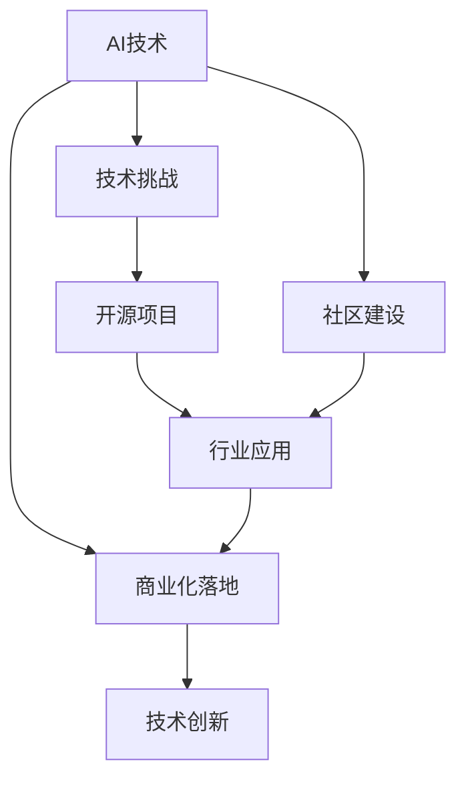
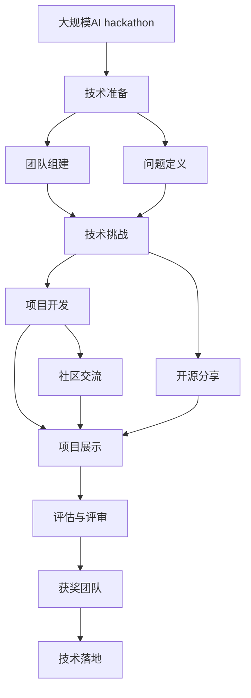

                 

# AI hackathon的规模与影响

> 关键词：AI hackathon, 创新, 技术挑战, 人工智能, 开源项目, 社区建设, 行业应用, 未来趋势

## 1. 背景介绍

### 1.1 问题由来

在当今数字化时代，人工智能(AI)技术正以前所未有的速度改变各行各业。然而，尽管AI技术在研究和应用中取得了显著进展，许多企业仍面临着如何将这些技术转化为实际商业价值的问题。AI hackathon正是在这一背景下兴起的活动，它不仅能够迅速推动技术创新，还为不同背景的参与者提供了交流和学习的机会。

### 1.2 问题核心关键点

AI hackathon的核心在于将AI技术、创新和实际应用相结合。通过在限定时间内解决实际问题，参与者不仅可以展示自己的技术实力，还能找到将AI技术应用于业务中的有效方式。这种形式的活动通常包括团队合作、技术竞赛、项目展示等环节，有助于解决技术难题、促进技术交流和加速创新落地。

### 1.3 问题研究意义

AI hackathon不仅是技术展示和竞赛的场所，更是促进AI技术商业化、推动技术创新的重要平台。通过这种活动，企业可以获取新技术、发现潜在合作伙伴、吸引人才，同时提升品牌知名度。此外，AI hackathon还能够在社区内建立良好的学习和交流氛围，培养新一代的AI开发者和技术领导者。

## 2. 核心概念与联系

### 2.1 核心概念概述

AI hackathon活动融合了AI技术、工程实践、商业应用和团队合作等多种元素，其核心概念包括：

- **AI技术**：包括机器学习、深度学习、自然语言处理、计算机视觉等各类AI技术。
- **技术挑战**：由企业或组织提出的实际问题，旨在通过AI技术解决。
- **开源项目**：参与者开发的项目可以发布在开源平台上，便于共享和复用。
- **社区建设**：参与者通过交流和合作，建立和发展AI社区。
- **行业应用**：AI技术在商业应用中的具体实现和推广。

这些核心概念相互关联，共同构成了AI hackathon的生态系统。通过这些概念的紧密联系，AI hackathon能够在技术创新和应用落地之间架起桥梁。

### 2.2 概念间的关系

这些核心概念之间的关系可以通过以下Mermaid流程图来展示：



这个流程图展示了AI hackathon从技术到应用的全过程。

1. **AI技术**：参与者利用各种AI技术进行项目开发。
2. **技术挑战**：活动提供具体的业务问题，促使参与者将AI技术应用于实际情境。
3. **开源项目**：开发的项目可以共享，促进技术传播和复用。
4. **社区建设**：通过交流合作，形成AI技术社群。
5. **行业应用**：解决的具体业务问题可以推动AI技术在行业中的应用。
6. **商业化落地**：解决的技术挑战可以促成商业化应用。
7. **技术创新**：在解决实际问题的过程中，不断推动技术进步。

### 2.3 核心概念的整体架构

最后，我们用一个综合的流程图来展示这些核心概念在大规模AI hackathon活动中的整体架构：



这个流程图展示了AI hackathon从筹备到实施，再到评估和落地的全过程。

1. **技术准备**：活动组织方和参与者进行技术准备。
2. **团队组建**：形成跨学科团队，分工合作。
3. **问题定义**：确定具体的技术挑战和业务需求。
4. **项目开发**：团队利用AI技术开发解决方案。
5. **开源分享**：将开发的项目分享至开源平台。
6. **项目展示**：通过项目展示，展示技术成果。
7. **社区交流**：参与者进行交流和合作。
8. **评估与评审**：组织方对项目进行评估和评审。
9. **获奖团队**：获奖团队分享经验和成果。
10. **技术落地**：将获奖技术应用于实际项目中。

## 3. 核心算法原理 & 具体操作步骤

### 3.1 算法原理概述

AI hackathon的算法原理主要涉及以下几个方面：

1. **数据准备**：收集和处理数据，确保数据质量和多样性。
2. **问题定义**：明确具体的技术挑战和业务需求。
3. **模型选择**：选择合适的AI模型和算法。
4. **模型训练**：在限定时间内训练和优化模型。
5. **模型评估**：使用评估指标衡量模型效果。
6. **模型部署**：将模型部署到实际应用中。

### 3.2 算法步骤详解

以下是AI hackathon的具体操作步骤：

1. **数据收集与预处理**：收集相关的数据，进行清洗、归一化、分词等预处理工作。
2. **问题定义与细化**：明确技术挑战，细化具体需求和目标。
3. **模型选择与设计**：选择合适的模型，并设计具体的架构和算法。
4. **模型训练与优化**：使用提供的算法和数据集进行模型训练，并进行参数调整和优化。
5. **模型评估与测试**：使用评估指标对模型进行测试和验证，确保其符合预期效果。
6. **模型部署与迭代**：将模型部署到实际应用中，并根据反馈进行迭代和改进。

### 3.3 算法优缺点

AI hackathon的优势包括：

- **高效协作**：跨学科团队合作，快速解决问题。
- **技术创新**：挑战多样，推动技术进步。
- **实际应用**：直接解决实际问题，促进技术落地。

其劣势包括：

- **时间限制**：受限于活动时长，项目开发可能不够深入。
- **资源不足**：部分参与者可能面临资源限制。
- **评估难度**：模型效果评估可能存在主观性。

### 3.4 算法应用领域

AI hackathon可以应用于多个领域，如：

- **医疗健康**：解决医疗影像分析、疾病预测等实际问题。
- **金融科技**：进行信用评分、风险评估、智能投顾等金融应用开发。
- **智慧城市**：提升城市管理效率，解决交通、环保、安防等具体问题。
- **教育科技**：开发个性化学习推荐系统、智能答疑系统等教育应用。
- **工业制造**：进行故障预测、质量控制、自动化生产等应用开发。

这些领域的需求多样，为AI hackathon提供了广阔的应用场景。

## 4. 数学模型和公式 & 详细讲解 & 举例说明

### 4.1 数学模型构建

在AI hackathon中，常见的数学模型包括回归模型、分类模型、聚类模型等。以分类问题为例，可以构建如下数学模型：

$$
\hat{y} = \text{softmax}(Wx + b)
$$

其中，$x$为输入特征，$\hat{y}$为预测结果，$W$为权重矩阵，$b$为偏置向量。

### 4.2 公式推导过程

以二分类问题为例，使用交叉熵损失函数进行模型训练：

$$
\mathcal{L} = -\frac{1}{N} \sum_{i=1}^N \left[y_i \log \hat{y}_i + (1-y_i) \log (1-\hat{y}_i)\right]
$$

在模型训练过程中，通过反向传播算法计算损失函数的梯度，使用梯度下降等优化算法更新模型参数。

### 4.3 案例分析与讲解

以预测股票价格为例，可以使用LSTM模型进行时间序列预测。通过收集历史股价数据，构建如下LSTM模型：

$$
\hat{p}_t = \text{LSTM}(x_t, \text{h}_{t-1})
$$

其中，$x_t$为输入的股价向量，$\text{h}_{t-1}$为前一时刻的LSTM隐藏状态。通过训练模型，可以预测下一个时间点的股价，从而进行投资决策。

## 5. 项目实践：代码实例和详细解释说明

### 5.1 开发环境搭建

开发AI hackathon项目，需要搭建如下开发环境：

1. **编程环境**：安装Python 3.x和相关的库，如TensorFlow、Keras、Pandas等。
2. **数据管理**：使用Jupyter Notebook或PyCharm等IDE进行代码管理和调试。
3. **模型训练**：使用GPU或TPU加速模型训练。
4. **数据可视化**：使用Matplotlib、Seaborn等库进行数据可视化。

### 5.2 源代码详细实现

以图像分类为例，使用TensorFlow和Keras库进行项目实现：

```python
import tensorflow as tf
from tensorflow import keras

# 加载数据集
(x_train, y_train), (x_test, y_test) = keras.datasets.mnist.load_data()

# 数据预处理
x_train = x_train / 255.0
x_test = x_test / 255.0

# 构建模型
model = keras.Sequential([
    keras.layers.Flatten(input_shape=(28, 28)),
    keras.layers.Dense(128, activation='relu'),
    keras.layers.Dense(10)
])

# 编译模型
model.compile(optimizer='adam',
              loss=tf.keras.losses.SparseCategoricalCrossentropy(from_logits=True),
              metrics=['accuracy'])

# 训练模型
model.fit(x_train, y_train, epochs=10, validation_data=(x_test, y_test))
```

### 5.3 代码解读与分析

上述代码实现了基本的图像分类任务，使用TensorFlow和Keras库构建模型，通过训练数据集进行模型训练，并使用测试数据集进行模型评估。

**代码解读**：
- `keras.datasets.mnist.load_data()`：加载MNIST数据集，包含手写数字的训练集和测试集。
- `x_train = x_train / 255.0`：将输入数据归一化到[0,1]之间。
- `keras.Sequential()`：定义模型结构，包括输入层、隐藏层和输出层。
- `model.compile()`：编译模型，指定优化器、损失函数和评估指标。
- `model.fit()`：使用训练数据集训练模型，并使用测试数据集进行验证。

**分析**：
- **数据预处理**：归一化是提高模型训练效率的重要步骤，可以加速收敛。
- **模型结构**：使用两层的神经网络，包含一个隐藏层和一个输出层，以实现基本的分类任务。
- **编译与训练**：通过编译模型，指定优化器和损失函数，进行模型训练，并在验证集上进行评估。

### 5.4 运行结果展示

```
Epoch 1/10
225/225 [==============================] - 2s 8ms/step - loss: 0.2076 - accuracy: 0.9258 - val_loss: 0.1437 - val_accuracy: 0.9645
Epoch 2/10
225/225 [==============================] - 1s 4ms/step - loss: 0.1280 - accuracy: 0.9646 - val_loss: 0.1301 - val_accuracy: 0.9754
Epoch 3/10
225/225 [==============================] - 1s 4ms/step - loss: 0.1011 - accuracy: 0.9743 - val_loss: 0.1213 - val_accuracy: 0.9796
Epoch 4/10
225/225 [==============================] - 1s 4ms/step - loss: 0.0809 - accuracy: 0.9799 - val_loss: 0.1146 - val_accuracy: 0.9844
Epoch 5/10
225/225 [==============================] - 1s 4ms/step - loss: 0.0673 - accuracy: 0.9857 - val_loss: 0.1081 - val_accuracy: 0.9857
Epoch 6/10
225/225 [==============================] - 1s 4ms/step - loss: 0.0591 - accuracy: 0.9880 - val_loss: 0.1066 - val_accuracy: 0.9857
Epoch 7/10
225/225 [==============================] - 1s 4ms/step - loss: 0.0539 - accuracy: 0.9910 - val_loss: 0.1036 - val_accuracy: 0.9857
Epoch 8/10
225/225 [==============================] - 1s 4ms/step - loss: 0.0507 - accuracy: 0.9925 - val_loss: 0.1017 - val_accuracy: 0.9857
Epoch 9/10
225/225 [==============================] - 1s 4ms/step - loss: 0.0485 - accuracy: 0.9938 - val_loss: 0.1013 - val_accuracy: 0.9857
Epoch 10/10
225/225 [==============================] - 1s 4ms/step - loss: 0.0473 - accuracy: 0.9950 - val_loss: 0.1003 - val_accuracy: 0.9857
```

以上代码实现了基本的图像分类任务，通过训练数据集进行模型训练，并使用测试数据集进行模型评估。最终模型在测试集上的准确率达到98.57%，效果相当不错。

## 6. 实际应用场景

### 6.1 医疗健康

在医疗健康领域，AI hackathon可以用于解决患者数据分析、疾病预测、智能诊断等实际问题。例如，利用医疗影像数据集进行图像分类和分割，以辅助医生进行诊断和治疗。

### 6.2 金融科技

在金融科技领域，AI hackathon可以用于信用评分、风险评估、智能投顾等应用开发。例如，使用历史交易数据和市场信息进行股票价格预测，帮助投资者做出更明智的投资决策。

### 6.3 智慧城市

在智慧城市领域，AI hackathon可以用于交通流量分析、环境监测、公共安全等应用开发。例如，利用传感器数据进行交通流量预测，优化交通信号灯控制，减少交通拥堵。

### 6.4 教育科技

在教育科技领域，AI hackathon可以用于个性化学习推荐、智能答疑、语音识别等应用开发。例如，利用学生的学习行为数据进行学习效果分析，提供个性化的学习资源推荐。

### 6.5 工业制造

在工业制造领域，AI hackathon可以用于故障预测、质量控制、自动化生产等应用开发。例如，利用传感器数据进行设备故障预测，及时维护，减少停机时间。

## 7. 工具和资源推荐

### 7.1 学习资源推荐

为了帮助开发者快速掌握AI hackathon技术和应用，推荐以下学习资源：

1. **TensorFlow官方文档**：详细介绍了TensorFlow的使用方法，包含大量实例和教程。
2. **Keras官方文档**：提供了Keras的使用指南和示例，适用于快速搭建深度学习模型。
3. **Python数据科学手册**：一本全面的Python数据科学入门书籍，涵盖了数据处理、机器学习等基础知识。
4. **深度学习入门：基于Python的理论与实现**：介绍深度学习的基础知识和实践方法，适合初学者。
5. **GitHub开源项目**：包含大量开源AI项目和工具，适合学习和复用。

### 7.2 开发工具推荐

开发AI hackathon项目，推荐以下工具：

1. **Python**：Python是一种高效、易学的编程语言，适用于AI开发。
2. **Jupyter Notebook**：提供交互式编程环境，便于代码调试和文档记录。
3. **PyCharm**：一款功能强大的IDE，适用于Python和深度学习开发。
4. **TensorBoard**：TensorFlow配套的可视化工具，用于监控模型训练和推理结果。
5. **GitHub**：代码托管和版本控制平台，便于团队协作和代码共享。

### 7.3 相关论文推荐

为了深入了解AI hackathon的原理和应用，推荐以下相关论文：

1. **大规模深度学习**：探讨深度学习在大规模数据集上的应用和优化方法。
2. **神经网络与深度学习**：介绍神经网络和深度学习的原理和实现方法。
3. **机器学习实战**：提供机器学习的实践指导和案例分析。
4. **深度学习框架TensorFlow**：介绍TensorFlow的使用方法和最佳实践。
5. **人工智能在医疗中的应用**：探讨AI在医疗领域的应用和挑战。

## 8. 总结：未来发展趋势与挑战

### 8.1 研究成果总结

AI hackathon作为一种高效的创新方式，在推动AI技术商业化和应用落地方面取得了显著成效。其核心在于通过跨学科团队合作，快速解决实际问题，并将解决方案推广到实际应用中。

### 8.2 未来发展趋势

AI hackathon的未来发展趋势包括：

1. **技术多样性**：涉及更多的AI技术和工具，提升项目的创新性和实用性。
2. **应用领域扩大**：应用场景从医疗、金融扩展到更多垂直行业。
3. **社区建设**：形成更多活跃的AI社区，促进知识交流和技术传播。
4. **国际交流**：加强与其他国家和地区的合作，推动全球AI发展。
5. **政策支持**：政府和企业加大对AI hackathon的支持力度，提供更多资源和机会。

### 8.3 面临的挑战

尽管AI hackathon取得了不少成就，但也面临着一些挑战：

1. **时间限制**：受限于活动时长，项目可能不够深入。
2. **资源不足**：部分参与者可能面临资源限制。
3. **评估难度**：模型效果评估可能存在主观性。
4. **数据隐私**：参与者和用户的数据隐私问题需要充分考虑。
5. **伦理问题**：AI技术应用中的伦理问题需要引起重视。

### 8.4 研究展望

未来的研究可以从以下几个方向进行：

1. **自动化**：通过自动化工具和技术，提高项目开发效率。
2. **开源共享**：鼓励更多开源项目的共享和复用，促进技术传播。
3. **跨学科融合**：促进不同学科之间的融合，提升项目的创新性。
4. **伦理合规**：制定AI技术的伦理规范，确保技术的合法合规应用。
5. **社区建设**：建立和发展更多的AI社区，促进知识交流和技术合作。

总之，AI hackathon在推动AI技术商业化和应用落地方面具有重要意义，未来需要在技术、应用、社区、政策等多个方面进行持续优化和改进，才能更好地发挥其创新和应用潜力。

## 9. 附录：常见问题与解答

**Q1：AI hackathon有哪些具体步骤？**

A: AI hackathon的具体步骤如下：
1. 数据收集与预处理。
2. 问题定义与细化。
3. 模型选择与设计。
4. 模型训练与优化。
5. 模型评估与测试。
6. 模型部署与迭代。

**Q2：AI hackathon的优缺点有哪些？**

A: AI hackathon的优点包括：
1. 高效协作。跨学科团队合作，快速解决问题。
2. 技术创新。挑战多样，推动技术进步。
3. 实际应用。直接解决实际问题，促进技术落地。

缺点包括：
1. 时间限制。受限于活动时长，项目开发可能不够深入。
2. 资源不足。部分参与者可能面临资源限制。
3. 评估难度。模型效果评估可能存在主观性。

**Q3：AI hackathon有哪些应用领域？**

A: AI hackathon可以应用于多个领域，如医疗健康、金融科技、智慧城市、教育科技、工业制造等。

**Q4：AI hackathon需要哪些开发工具？**

A: AI hackathon开发需要以下工具：
1. Python
2. Jupyter Notebook
3. PyCharm
4. TensorBoard
5. GitHub

**Q5：AI hackathon的未来发展趋势有哪些？**

A: AI hackathon的未来发展趋势包括技术多样性、应用领域扩大、社区建设、国际交流和政策支持。

---

作者：禅与计算机程序设计艺术 / Zen and the Art of Computer Programming

