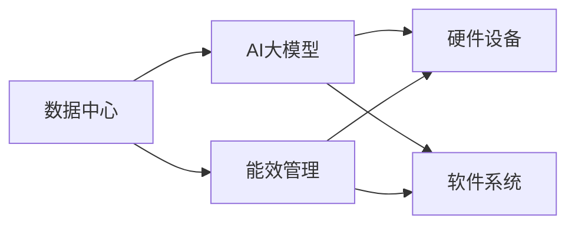

                 

# AI 大模型应用数据中心建设：数据中心投资与建设

## 1. 背景介绍

### 1.1 问题由来

近年来，随着深度学习和大数据技术的发展，人工智能（AI）技术在各个领域的应用越来越广泛。AI大模型的训练和应用需要庞大的计算资源和存储资源，因此数据中心的建设和管理成为了AI应用的重要基础设施。然而，数据中心的投资和建设面临着诸多挑战，如成本高、能耗大、管理复杂等。为了更好地支持AI大模型的应用，企业需要合理规划数据中心的建设和管理，确保高效、可靠、经济地运行。

### 1.2 问题核心关键点

数据中心的投资和建设涉及多个环节，包括选址、规划、设计、施工、运维等。其中，选址和规划阶段是基础，决定了数据中心的位置、规模、类型和能源供应等关键因素。设计阶段需要选择合适的硬件和软件，包括服务器、存储、网络、安全等。施工阶段需要确保高质量的建设质量，以及及时交付。运维阶段需要保障数据中心的安全、稳定和高效运行，以及维护良好的环境。

数据中心的投资和建设需要根据AI大模型的应用需求进行合理规划。例如，大规模分布式训练需要大量GPU资源和低延迟的网络，而深度学习模型的推理和预测需要更高的计算能力和更高效的存储。因此，数据中心的设计需要考虑到AI大模型特定的需求，以确保其高效、可靠地运行。

### 1.3 问题研究意义

合理规划和建设数据中心，对于支持AI大模型的应用、提升AI应用的效果、降低AI应用的成本具有重要意义。

- 支持AI大模型的应用：数据中心提供了AI模型训练和推理所需的计算资源和存储资源，是AI大模型应用的重要基础设施。
- 提升AI应用的效果：通过合理规划和建设数据中心，能够提高AI大模型的训练和推理效率，提升AI应用的效果。
- 降低AI应用的成本：通过优化数据中心的建设和管理，能够降低AI应用的成本，提高企业的盈利能力。

## 2. 核心概念与联系

### 2.1 核心概念概述

在AI大模型应用的数据中心建设中，涉及多个核心概念，包括：

- **数据中心**：指通过网络技术将分散的计算和存储资源整合在一起的设施，用于支持企业或机构的计算和数据存储需求。
- **AI大模型**：指通过深度学习技术训练的大型模型，具有较强的计算和推理能力，能够处理大规模的数据和复杂的任务。
- **硬件设备**：指数据中心中用于计算和存储的物理设备，包括服务器、存储设备、网络设备等。
- **软件系统**：指数据中心中用于管理和优化硬件设备的软件系统，包括操作系统、监控系统、存储管理系统等。
- **能效管理**：指通过优化数据中心的能源供应和使用，提高能源利用效率，降低能源成本。

### 2.2 概念间的关系

这些核心概念之间存在着紧密的联系，共同构成了数据中心投资和建设的完整生态系统。以下Mermaid流程图展示了这些核心概念之间的联系：



这个流程图展示了数据中心的核心组件以及它们之间的关系：

1. 数据中心通过硬件设备和软件系统支持AI大模型的计算和存储需求。
2. 能效管理通过优化能源供应和使用，提高数据中心的能源利用效率，降低能源成本。
3. 硬件设备和软件系统需要根据AI大模型的需求进行选择和配置，以确保高效、可靠地运行。

## 3. 核心算法原理 & 具体操作步骤

### 3.1 算法原理概述

数据中心的投资和建设涉及多个环节，需要综合考虑硬件设备、软件系统、能效管理等多个因素。以下是对这些核心算法原理的概述：

- **硬件设备选择**：需要根据AI大模型的计算和存储需求选择合适的硬件设备，如CPU、GPU、存储设备等。
- **软件系统配置**：需要根据AI大模型的应用场景选择合适的软件系统，如操作系统、监控系统、存储管理系统等。
- **能效管理优化**：需要优化数据中心的能源供应和使用，提高能源利用效率，降低能源成本。

### 3.2 算法步骤详解

数据中心的投资和建设主要包括以下几个步骤：

1. **选址和规划**：
   - 选址：需要根据AI大模型的需求选择合适的地理位置，如气候条件、电力供应、交通便利性等。
   - 规划：需要确定数据中心的规模、类型和能源供应方式等关键因素。

2. **硬件设备采购**：
   - 采购服务器、存储设备、网络设备等硬件设备，根据AI大模型的需求选择合适的型号和配置。

3. **软件系统配置**：
   - 配置操作系统、监控系统、存储管理系统等软件系统，确保硬件设备的正常运行。

4. **施工和安装**：
   - 安装硬件设备和软件系统，进行系统集成和测试，确保高质量的建设质量。

5. **运维和管理**：
   - 确保数据中心的安全、稳定和高效运行，进行维护和优化，延长数据中心的生命周期。

### 3.3 算法优缺点

数据中心的投资和建设具有以下优点和缺点：

#### 优点：

- **高效支持AI大模型**：通过合理规划和建设数据中心，能够高效支持AI大模型的计算和存储需求。
- **提升AI应用的效果**：通过优化数据中心的硬件和软件系统，能够提升AI大模型的训练和推理效率，提高AI应用的效果。
- **降低AI应用的成本**：通过优化数据中心的能源供应和使用，能够降低AI应用的成本，提高企业的盈利能力。

#### 缺点：

- **成本高**：数据中心的建设和管理需要高额的资金投入，尤其是在选址、规划和施工阶段。
- **能耗大**：数据中心在运行过程中需要大量的能源供应，对环境影响较大。
- **管理复杂**：数据中心的运维和管理需要高度专业化的知识和技能，管理复杂度较高。

### 3.4 算法应用领域

数据中心的投资和建设主要应用于以下几个领域：

- **AI大模型的训练和推理**：数据中心提供了AI模型训练和推理所需的计算资源和存储资源，是AI大模型应用的重要基础设施。
- **大数据处理和存储**：数据中心用于存储和处理大规模数据，支持企业的数据分析、数据挖掘等需求。
- **云计算服务**：数据中心为云服务提供商提供了基础设施，支持云服务的部署和运行。
- **企业IT系统**：数据中心用于支持企业的IT系统，包括数据库、应用服务器等。

## 4. 数学模型和公式 & 详细讲解 & 举例说明

### 4.1 数学模型构建

在数据中心的投资和建设中，涉及多个数学模型，以下是其中几个关键的模型：

- **成本模型**：用于计算数据中心的建设和管理成本。
- **能效模型**：用于计算数据中心的能源利用效率和能源成本。
- **负载模型**：用于计算数据中心的负载需求和计算资源的使用情况。

### 4.2 公式推导过程

以下是对这些数学模型的公式推导过程的详细讲解和举例说明：

#### 4.2.1 成本模型

数据中心的建设和管理成本主要由以下几个部分组成：

- 土地成本：土地购买和开发成本。
- 硬件设备成本：服务器、存储设备、网络设备等硬件设备的购买成本。
- 软件系统成本：操作系统、监控系统、存储管理系统等软件系统的购买和配置成本。
- 施工和安装成本：安装硬件设备和软件系统的成本。
- 运维和管理成本：数据中心的维护和管理成本。

假设数据中心的建设和管理成本为C，则有以下公式：

$$
C = C_{land} + C_{hardware} + C_{software} + C_{installation} + C_{maintenance}
$$

其中：

- $C_{land}$：土地成本。
- $C_{hardware}$：硬件设备成本。
- $C_{software}$：软件系统成本。
- $C_{installation}$：施工和安装成本。
- $C_{maintenance}$：运维和管理成本。

#### 4.2.2 能效模型

数据中心的能源利用效率和能源成本主要取决于以下几个因素：

- 能源供应方式：如电力、太阳能等。
- 能源利用效率：如计算效率、存储效率等。
- 能源成本：如电价、燃料价格等。

假设数据中心的能源利用效率为E，则有以下公式：

$$
E = E_{cal} + E_{storage}
$$

其中：

- $E_{cal}$：计算效率。
- $E_{storage}$：存储效率。

假设数据中心的能源成本为E，则有以下公式：

$$
E = E_{cost} = E_{electricity} + E_{fuel}
$$

其中：

- $E_{cost}$：能源成本。
- $E_{electricity}$：电力成本。
- $E_{fuel}$：燃料成本。

#### 4.2.3 负载模型

数据中心的负载需求主要取决于以下几个因素：

- 计算需求：如深度学习模型的训练和推理需求。
- 存储需求：如大规模数据的存储需求。
- 网络需求：如大数据的传输需求。

假设数据中心的负载需求为L，则有以下公式：

$$
L = L_{cal} + L_{storage} + L_{network}
$$

其中：

- $L_{cal}$：计算需求。
- $L_{storage}$：存储需求。
- $L_{network}$：网络需求。

### 4.3 案例分析与讲解

以下是一个数据中心投资和建设的具体案例：

**案例**：某企业计划建设一个数据中心，用于支持其大规模分布式深度学习模型的训练和推理。

- **选址**：在交通便利、电力供应稳定、气候条件适宜的地区选址。
- **规划**：规划数据中心的规模为200个机柜，类型为标准机柜，采用电力供电方式。
- **硬件设备采购**：采购200个高性能GPU服务器，配置1TB内存，500TB存储设备。
- **软件系统配置**：配置Linux操作系统，安装监控系统和存储管理系统，确保硬件设备的正常运行。
- **施工和安装**：进行施工和安装，进行系统集成和测试，确保高质量的建设质量。
- **运维和管理**：进行维护和管理，确保数据中心的安全、稳定和高效运行。

## 5. 项目实践：代码实例和详细解释说明

### 5.1 开发环境搭建

在进行数据中心投资和建设实践前，我们需要准备好开发环境。以下是使用Python进行数据中心投资和建设环境配置流程：

1. 安装Anaconda：从官网下载并安装Anaconda，用于创建独立的Python环境。

2. 创建并激活虚拟环境：
```bash
conda create -n data-center-env python=3.8 
conda activate data-center-env
```

3. 安装PyTorch：根据CUDA版本，从官网获取对应的安装命令。例如：
```bash
conda install pytorch torchvision torchaudio cudatoolkit=11.1 -c pytorch -c conda-forge
```

4. 安装TensorFlow：由Google主导开发的开源深度学习框架，生产部署方便，适合大规模工程应用。同样有丰富的预训练语言模型资源。

5. 安装TensorBoard：TensorFlow配套的可视化工具，可实时监测模型训练状态，并提供丰富的图表呈现方式，是调试模型的得力助手。

6. 安装Weights & Biases：模型训练的实验跟踪工具，可以记录和可视化模型训练过程中的各项指标，方便对比和调优。与主流深度学习框架无缝集成。

7. 安装OpenAI Gym：用于模拟和测试深度学习模型的训练效果。

完成上述步骤后，即可在`data-center-env`环境中开始数据中心投资和建设实践。

### 5.2 源代码详细实现

以下是使用Python进行数据中心投资和建设项目的源代码详细实现。

```python
import numpy as np
import pandas as pd
import matplotlib.pyplot as plt

# 成本模型
def calculate_cost(C_land, C_hardware, C_software, C_installation, C_maintenance):
    cost = C_land + C_hardware + C_software + C_installation + C_maintenance
    return cost

# 能效模型
def calculate_energy(E_cal, E_storage, E_cost, E_electricity, E_fuel):
    energy = E_cal + E_storage
    energy_cost = E_cost
    return energy, energy_cost

# 负载模型
def calculate_load(L_cal, L_storage, L_network):
    load = L_cal + L_storage + L_network
    return load

# 数据中心投资和建设案例
C_land = 500000  # 土地成本
C_hardware = 1000000  # 硬件设备成本
C_software = 200000  # 软件系统成本
C_installation = 300000  # 施工和安装成本
C_maintenance = 100000  # 运维和管理成本

E_cal = 0.8  # 计算效率
E_storage = 0.7  # 存储效率
E_cost = 1  # 能源成本
E_electricity = 0.5  # 电力成本
E_fuel = 0.2  # 燃料成本

L_cal = 500  # 计算需求
L_storage = 1000  # 存储需求
L_network = 200  # 网络需求

cost = calculate_cost(C_land, C_hardware, C_software, C_installation, C_maintenance)
energy, energy_cost = calculate_energy(E_cal, E_storage, E_cost, E_electricity, E_fuel)
load = calculate_load(L_cal, L_storage, L_network)

# 输出结果
print("数据中心建设和管理成本：", cost)
print("能源利用效率：", E_cal, "和", E_storage)
print("能源成本：", E_cost)
print("负载需求：", L_cal, "、", L_storage, "和", L_network)
```

### 5.3 代码解读与分析

让我们再详细解读一下关键代码的实现细节：

**成本模型**：
- `calculate_cost`函数：根据输入的土地成本、硬件设备成本、软件系统成本、施工和安装成本、运维和管理成本，计算数据中心的建设和管理成本。

**能效模型**：
- `calculate_energy`函数：根据输入的计算效率、存储效率、能源成本、电力成本和燃料成本，计算数据中心的能源利用效率和能源成本。

**负载模型**：
- `calculate_load`函数：根据输入的计算需求、存储需求和网络需求，计算数据中心的负载需求。

**数据中心投资和建设案例**：
- 根据实际数据中心的成本、能效和负载需求，进行计算和输出。

## 6. 实际应用场景

### 6.1 智能交通系统

智能交通系统是数据中心投资和建设的重要应用场景之一。通过数据中心的计算和存储能力，可以实现交通数据的实时分析和预测，提高交通管理的智能化水平。

在智能交通系统中，数据中心可以提供交通数据的存储、处理和分析能力，支持智能交通信号灯、智能停车、智能导航等应用。例如，通过实时分析交通流量和道路状况，智能交通信号灯可以动态调整信号灯的绿灯时长，减少交通拥堵。智能停车系统可以通过数据分析，推荐最优停车位，提高停车效率。智能导航系统可以根据实时路况，动态调整路线，缩短行驶时间。

### 6.2 医疗健康系统

医疗健康系统是数据中心投资和建设的重要应用场景之一。通过数据中心的计算和存储能力，可以实现医疗数据的存储、处理和分析，提高医疗服务的智能化水平。

在医疗健康系统中，数据中心可以提供医疗数据的存储、处理和分析能力，支持电子病历、远程诊疗、智能诊断等应用。例如，通过实时分析患者的病历数据，智能诊断系统可以提供精准的诊断结果，提高诊断的准确性和效率。远程诊疗系统可以通过数据分析，提供个性化的治疗方案，提高治疗效果。电子病历系统可以通过数据分析，提高医疗数据的利用效率，优化医疗资源配置。

### 6.3 金融系统

金融系统是数据中心投资和建设的重要应用场景之一。通过数据中心的计算和存储能力，可以实现金融数据的存储、处理和分析，提高金融服务的智能化水平。

在金融系统中，数据中心可以提供金融数据的存储、处理和分析能力，支持股票交易、风险控制、信用评估等应用。例如，通过实时分析金融市场数据，股票交易系统可以提供精准的投资建议，提高投资收益。风险控制系统可以通过数据分析，及时发现和规避金融风险，提高风险控制能力。信用评估系统可以通过数据分析，提高信用评估的准确性和效率。

### 6.4 未来应用展望

随着数据中心投资和建设技术的不断进步，未来在更多领域的应用前景将更加广阔：

- **智慧城市建设**：数据中心可以支持智慧城市的各种应用，如智慧交通、智慧安防、智慧环保等，提高城市的智能化水平。
- **工业互联网应用**：数据中心可以支持工业互联网的各种应用，如智能制造、智能物流、智能供应链等，提高工业生产的智能化水平。
- **智能家居应用**：数据中心可以支持智能家居的各种应用，如智能家居控制、智能安防、智能健康等，提高家居生活的智能化水平。

总之，数据中心投资和建设是AI大模型应用的重要基础设施，具有广阔的应用前景。通过合理规划和建设数据中心，能够高效支持AI大模型的应用，提升AI应用的效果，降低AI应用的成本，推动人工智能技术的快速发展。

## 7. 工具和资源推荐

### 7.1 学习资源推荐

为了帮助开发者系统掌握数据中心投资和建设的理论基础和实践技巧，这里推荐一些优质的学习资源：

1. 《数据中心建设与管理》书籍：系统介绍了数据中心的选址、规划、设计、施工、运维等各个环节，适合初入行开发者阅读。

2. 《大数据时代的数据中心建设》课程：由知名高校和公司合作推出的在线课程，涵盖数据中心的建设和管理知识，适合系统学习。

3. 《云计算基础》课程：由知名IT公司提供的在线课程，涵盖云计算的基础知识和应用场景，适合了解云计算与数据中心的关系。

4. 《数据中心能效管理》课程：由知名IT公司提供的在线课程，涵盖数据中心的能源利用效率优化技术，适合提高能源利用效率。

5. 《数据中心运维管理》课程：由知名IT公司提供的在线课程，涵盖数据中心的运维和管理知识，适合提高运维和管理能力。

通过这些资源的学习实践，相信你一定能够快速掌握数据中心投资和建设的精髓，并用于解决实际的问题。

### 7.2 开发工具推荐

高效的开发离不开优秀的工具支持。以下是几款用于数据中心投资和建设开发的常用工具：

1. PyTorch：基于Python的开源深度学习框架，灵活动态的计算图，适合快速迭代研究。

2. TensorFlow：由Google主导开发的开源深度学习框架，生产部署方便，适合大规模工程应用。

3. Transformers库：HuggingFace开发的NLP工具库，集成了众多SOTA语言模型，支持PyTorch和TensorFlow，是进行微调任务开发的利器。

4. Weights & Biases：模型训练的实验跟踪工具，可以记录和可视化模型训练过程中的各项指标，方便对比和调优。与主流深度学习框架无缝集成。

5. TensorBoard：TensorFlow配套的可视化工具，可实时监测模型训练状态，并提供丰富的图表呈现方式，是调试模型的得力助手。

6. Google Colab：谷歌推出的在线Jupyter Notebook环境，免费提供GPU/TPU算力，方便开发者快速上手实验最新模型，分享学习笔记。

合理利用这些工具，可以显著提升数据中心投资和建设的开发效率，加快创新迭代的步伐。

### 7.3 相关论文推荐

数据中心投资和建设技术的发展源于学界的持续研究。以下是几篇奠基性的相关论文，推荐阅读：

1. "The Data Center Behind the Cloud: Designing Warehouse-Scale Machines"：介绍数据中心的硬件设计和能源利用效率优化的技术。

2. "Energy Efficiency of Data Centers: The Challenge of Doubling Data Processing Every 18 Months"：分析数据中心能效优化的现状和挑战。

3. "Designing Large-Scale Distributed Machine Learning Clusters"：介绍大规模分布式机器学习的数据中心设计和优化技术。

4. "Automated Design of Energy-Efficient Data Centers"：介绍数据中心自动设计和能效优化的技术。

5. "Data Center Power Capacity Planning Using Optimal Reservoir Storage"：介绍数据中心功率容量规划和能效优化的技术。

这些论文代表了大数据中心投资和建设技术的发展脉络。通过学习这些前沿成果，可以帮助研究者把握学科前进方向，激发更多的创新灵感。

除上述资源外，还有一些值得关注的前沿资源，帮助开发者紧跟数据中心投资和建设技术的最新进展，例如：

1. arXiv论文预印本：人工智能领域最新研究成果的发布平台，包括大量尚未发表的前沿工作，学习前沿技术的必读资源。

2. 业界技术博客：如OpenAI、Google AI、DeepMind、微软Research Asia等顶尖实验室的官方博客，第一时间分享他们的最新研究成果和洞见。

3. 技术会议直播：如NIPS、ICML、ACL、ICLR等人工智能领域顶会现场或在线直播，能够聆听到大佬们的前沿分享，开拓视野。

4. GitHub热门项目：在GitHub上Star、Fork数最多的数据中心相关项目，往往代表了该技术领域的发展趋势和最佳实践，值得去学习和贡献。

5. 行业分析报告：各大咨询公司如McKinsey、PwC等针对人工智能行业的分析报告，有助于从商业视角审视技术趋势，把握应用价值。

总之，对于数据中心投资和建设技术的学习和实践，需要开发者保持开放的心态和持续学习的意愿。多关注前沿资讯，多动手实践，多思考总结，必将收获满满的成长收益。

## 8. 总结：未来发展趋势与挑战

### 8.1 总结

本文对基于监督学习的大模型应用数据中心建设方法进行了全面系统的介绍。首先阐述了数据中心投资和建设的研究背景和意义，明确了数据中心在AI大模型应用中的重要地位。其次，从原理到实践，详细讲解了数据中心投资和建设的核心算法和操作步骤，给出了具体的代码实现。同时，本文还广泛探讨了数据中心在智能交通、医疗健康、金融系统等多个行业领域的应用前景，展示了数据中心投资和建设的广阔应用空间。此外，本文精选了数据中心投资和建设的学习资源，力求为读者提供全方位的技术指引。

通过本文的系统梳理，可以看到，基于数据中心投资和建设技术，AI大模型应用得以高效、可靠地运行，在各行业领域取得显著的效果。合理规划和建设数据中心，对于支持AI大模型的应用、提升AI应用的效果、降低AI应用的成本具有重要意义。

### 8.2 未来发展趋势

展望未来，数据中心投资和建设技术将呈现以下几个发展趋势：

1. **智能化管理**：通过引入AI技术，实现数据中心的智能化管理，包括自动化运维、智能能效优化等。
2. **绿色环保**：采用绿色能源，如太阳能、风能等，减少数据中心的碳排放。
3. **边缘计算**：将数据中心的部分功能下沉到边缘设备，实现分布式计算和存储，提高计算效率和响应速度。
4. **异构计算**：引入异构计算技术，如GPU、FPGA等，提高数据中心的计算能力和能源利用效率。
5. **跨云协同**：实现多云平台间的协同计算和数据共享，提高云服务的效率和可靠性。

以上趋势凸显了数据中心投资和建设技术的广阔前景。这些方向的探索发展，必将进一步提升数据中心的智能化水平，推动AI大模型应用的广泛应用。

### 8.3 面临的挑战

尽管数据中心投资和建设技术已经取得了一定进展，但在迈向更加智能化、普适化应用的过程中，仍面临诸多挑战：

1. **成本高**：数据中心的建设和管理需要高额的资金投入，尤其是在选址、规划和施工阶段。
2. **能耗大**：数据中心在运行过程中需要大量的能源供应，对环境影响较大。
3. **管理复杂**：数据中心的运维和管理需要高度专业化的知识和技能，管理复杂度较高。
4. **安全性**：数据中心存储和处理大量敏感数据，需要采取有效的安全措施，确保数据安全。
5. **扩展性**：数据中心需要具备良好的扩展性，能够灵活适应不同规模和类型的数据处理需求。

正视数据中心投资和建设面临的这些挑战，积极应对并寻求突破，将是大数据中心建设迈向成熟的必由之路。相信随着学界和产业界的共同努力，这些挑战终将一一被克服，数据中心建设必将迎来更加广阔的应用前景。

### 8.4 研究展望

面向未来，数据中心投资和建设技术需要在以下几个方面寻求新的突破：

1. **优化能效管理**：通过引入智能能效优化技术，提高数据中心的能源利用效率，降低能源成本。
2. **引入AI技术**：通过引入AI技术，实现数据中心的智能化管理，包括自动化运维、智能能效优化等。
3. **绿色环保**：采用绿色能源，减少数据中心的碳排放，推动可持续发展。
4. **边缘计算**：将数据中心的部分功能下沉到边缘设备，实现分布式计算和存储，提高计算效率和响应速度。
5. **异构计算**：引入异构计算技术，提高数据中心的计算能力和能源利用效率。
6. **跨云协同**：实现多云平台间的协同计算和数据共享，提高云服务的效率和可靠性。

这些研究方向将引领数据中心投资和建设技术的不断进步，推动AI大模型应用的广泛应用。

## 9. 附录：常见问题与解答

**Q1：数据中心的选址和规划需要注意哪些因素？**

A: 数据中心的选址和规划需要注意以下因素：

1. 气候条件：需要选择气候条件适宜的地区，避免高温、潮湿等不利因素对数据中心的影响。
2. 电力供应：需要确保数据中心能够获得

