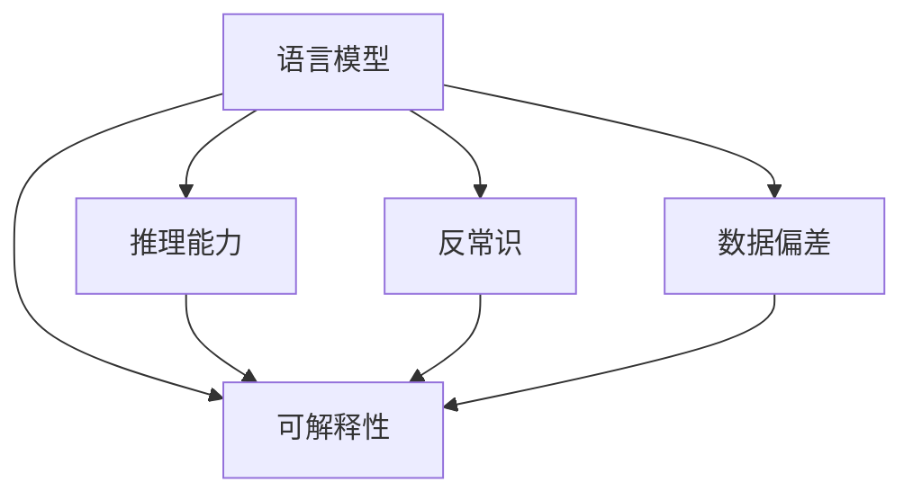
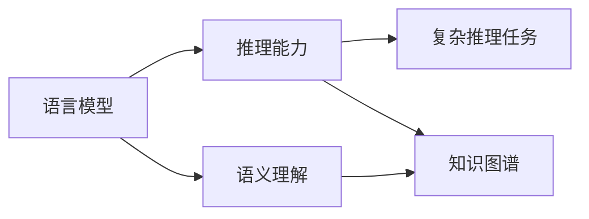
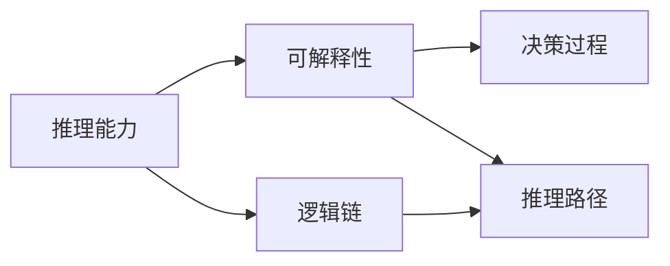
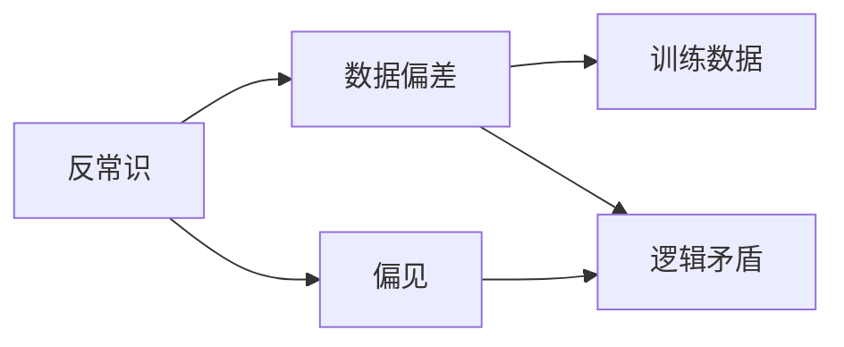

                 

# 语言与推理：大模型的盲区

> 关键词：大模型,推理,语言模型,语言理解,盲区,可解释性,反常识,自然语言处理(NLP)

## 1. 背景介绍

### 1.1 问题由来
近年来，随着深度学习技术的飞速发展，尤其是预训练语言模型（如BERT, GPT系列等）的广泛应用，NLP领域取得了巨大进步。然而，尽管这些大模型在语言理解、生成等方面表现优异，它们在推理能力和对反常识（Counterfactual）情景的理解上仍存在明显局限。

### 1.2 问题核心关键点
这些问题主要集中在以下几个方面：
- **推理能力**：大模型在处理复杂推理任务时，往往缺乏人类那样的系统性思维和逻辑推断能力，容易被表面现象误导。
- **可解释性**：许多大模型的决策过程不透明，难以解释其推理逻辑和输出结果，这在涉及决策、诊断等关键任务时尤为突出。
- **反常识**：大模型在处理反常识（即违背常识逻辑）的问题时，容易做出错误判断，这源于模型训练数据中的偏见和不充分的多样性。
- **数据偏差**：模型的推理能力受训练数据的影响，如果训练数据存在偏见，模型也将继承这些偏见，导致在处理类似反常识问题时出现错误。

### 1.3 问题研究意义
研究大模型的盲区，对于提升模型的推理能力、增强模型的可解释性、纠正训练数据中的偏差，以及推动NLP技术在实际应用中的可靠性和公平性，具有重要意义。通过揭示和解决这些盲区，可以进一步推动人工智能技术的发展，提高其在各行各业中的影响力和应用价值。

## 2. 核心概念与联系

### 2.1 核心概念概述

为了深入理解大模型在推理和语言处理中的盲区，我们需要对几个关键概念进行介绍：

- **语言模型**：通过统计语言中的规律和知识，预测下一个词或一句话的概率。大语言模型通过预训练学习大量的文本数据，获取语言的深层次表示。
- **推理能力**：指模型在处理逻辑和复杂推理任务时，能否依据已有的语言知识，进行有效的逻辑推断和决策。
- **可解释性**：模型在做出某个预测或决策时，其背后的逻辑和依据是否能够被清晰地解释和理解。
- **反常识**：与常规逻辑相悖，需要通过特殊的知识或深度理解才能处理的问题。
- **数据偏差**：训练数据集中的偏见或不公平信息，可能导致模型学习到不均衡或不公正的表征。

这些概念之间的联系可以通过以下Mermaid流程图来展示：



这个流程图展示了语言模型、推理能力、可解释性、反常识和数据偏差之间的相互影响：

1. 语言模型是推理和理解的基础。
2. 推理能力依赖于语言模型的知识表示。
3. 可解释性要求语言模型和推理过程透明。
4. 反常识问题往往需要更深层次的知识理解。
5. 数据偏差会影响模型的推理和可解释性。

### 2.2 概念间的关系

这些核心概念之间的关系可以通过更细致的Mermaid流程图来进一步阐述：

#### 2.2.1 语言模型与推理能力


#### 2.2.2 推理能力与可解释性


#### 2.2.3 反常识与数据偏差


通过这些流程图，我们可以更清晰地理解各个概念之间的相互作用和影响，为后续讨论大模型的盲区及其解决策略提供依据。

## 3. 核心算法原理 & 具体操作步骤
### 3.1 算法原理概述

基于监督学习的大模型推理能力提升方法，本质上是通过对少量标注数据进行有监督训练，优化模型在特定推理任务上的性能。这些方法一般包括微调、提示学习和正则化等技术。

### 3.2 算法步骤详解

具体来说，基于监督学习的推理能力提升步骤如下：

**Step 1: 准备数据集和任务**
- 收集与推理任务相关的标注数据集，例如逻辑推理题、自然语言推理等。
- 设计合适的推理任务适配层，如逻辑表达式解析器、上下文理解模块等。

**Step 2: 设置微调超参数**
- 选择合适的优化算法（如AdamW、SGD等）及其参数，如学习率、批大小等。
- 应用正则化技术（如L2正则、Dropout等）以避免过拟合。
- 确定冻结预训练参数的策略，如仅微调顶层，或全部参数都参与微调。

**Step 3: 执行梯度训练**
- 将训练集数据分批次输入模型，前向传播计算损失函数。
- 反向传播计算参数梯度，根据设定的优化算法和学习率更新模型参数。
- 周期性在验证集上评估模型性能，根据性能指标决定是否触发Early Stopping。
- 重复上述步骤直到满足预设的迭代轮数或Early Stopping条件。

**Step 4: 测试和部署**
- 在测试集上评估微调后模型 $M_{\hat{\theta}}$ 的性能，对比微调前后的精度提升。
- 使用微调后的模型对新样本进行推理预测，集成到实际的应用系统中。

### 3.3 算法优缺点

基于监督学习的推理能力提升方法具有以下优点：
- 简单高效：只需准备少量标注数据，即可对预训练模型进行快速适配，获得较大的性能提升。
- 通用适用：适用于各种NLP推理任务，设计简单的任务适配层即可实现微调。

同时，该方法也存在一定的局限性：
- 依赖标注数据：推理能力的提升很大程度上取决于标注数据的质量和数量，获取高质量标注数据的成本较高。
- 迁移能力有限：当推理任务与预训练数据的分布差异较大时，推理能力的提升有限。
- 负面效果传递：预训练模型的固有偏见、有害信息等，可能通过微调传递到推理任务，造成负面影响。
- 可解释性不足：推理模型的决策过程通常缺乏可解释性，难以对其推理逻辑进行分析和调试。

尽管存在这些局限性，基于监督学习的推理能力提升方法仍是当前大语言模型在推理任务上最主流范式。未来相关研究的重点在于如何进一步降低推理对标注数据的依赖，提高模型的少样本学习和跨领域迁移能力，同时兼顾可解释性和伦理安全性等因素。

### 3.4 算法应用领域

基于大语言模型推理能力提升的监督学习方法，已经在各种NLP推理任务上取得了显著效果，例如：

- 自然语言推理：判断一个自然语言陈述是否蕴含另一个陈述。
- 逻辑推理：解决形式化逻辑问题，如布尔代数、一阶逻辑推理等。
- 事实推理：基于已知事实和逻辑规则进行推理，生成合理结论。
- 事件推理：分析文本事件的时间、地点、参与者等要素，推断事件逻辑关系。
- 语义推理：理解文本中的隐含语义，进行推断和预测。

除了上述这些经典任务外，推理能力提升方法也被创新性地应用到更多场景中，如智能问答、对话系统、文本摘要、数据增强等，为NLP技术带来了全新的突破。随着预训练模型和推理方法的不断进步，相信NLP技术将在更广阔的应用领域大放异彩。

## 4. 数学模型和公式 & 详细讲解 & 举例说明
### 4.1 数学模型构建

假设预训练语言模型为 $M_{\theta}:\mathcal{X} \rightarrow \mathcal{Y}$，其中 $\mathcal{X}$ 为输入空间，$\mathcal{Y}$ 为输出空间，$\theta \in \mathbb{R}^d$ 为模型参数。

定义模型 $M_{\theta}$ 在输入 $x$ 上的输出为 $\hat{y}=M_{\theta}(x) \in [0,1]$，表示样本属于某个推理结果的概率。假设推理任务的目标为 $\bar{y} \in \{0,1\}$，则推理损失函数 $\ell$ 为：

$$
\ell(y,\hat{y}) = \begin{cases}
-\log \hat{y}, & \text{if } \bar{y}=1 \\
-\log(1-\hat{y}), & \text{if } \bar{y}=0
\end{cases}
$$

### 4.2 公式推导过程

根据损失函数 $\ell$，推理任务的经验风险为：

$$
\mathcal{L}(\theta) = -\frac{1}{N}\sum_{i=1}^N \ell(y_i,\hat{y}_i)
$$

其中 $y_i$ 为推理任务的实际标签，$\hat{y}_i$ 为模型在输入 $x_i$ 上的推理输出。

通过梯度下降等优化算法，最小化经验风险 $\mathcal{L}$，更新模型参数 $\theta$：

$$
\theta \leftarrow \theta - \eta \nabla_{\theta}\mathcal{L}(\theta)
$$

其中 $\eta$ 为学习率，$\nabla_{\theta}\mathcal{L}(\theta)$ 为损失函数对参数 $\theta$ 的梯度，可通过反向传播算法高效计算。

### 4.3 案例分析与讲解

以自然语言推理任务为例，假设模型在输入 $x$ 上的推理输出为 $\hat{y}=M_{\theta}(x)$，实际标签为 $\bar{y}$。

设推理损失函数为：

$$
\ell(\hat{y},\bar{y}) = -(\bar{y}\log\hat{y} + (1-\bar{y})\log(1-\hat{y}))
$$

则模型在训练集 $D=\{(x_i,\bar{y}_i)\}_{i=1}^N$ 上的经验风险为：

$$
\mathcal{L}(\theta) = -\frac{1}{N}\sum_{i=1}^N \ell(\hat{y}_i,\bar{y}_i)
$$

通过前向传播计算损失函数，反向传播计算参数梯度，最小化损失函数 $\mathcal{L}(\theta)$ 更新模型参数。

## 5. 项目实践：代码实例和详细解释说明
### 5.1 开发环境搭建

在进行推理能力提升实践前，我们需要准备好开发环境。以下是使用Python进行PyTorch开发的环境配置流程：

1. 安装Anaconda：从官网下载并安装Anaconda，用于创建独立的Python环境。

2. 创建并激活虚拟环境：
```bash
conda create -n pytorch-env python=3.8 
conda activate pytorch-env
```

3. 安装PyTorch：根据CUDA版本，从官网获取对应的安装命令。例如：
```bash
conda install pytorch torchvision torchaudio cudatoolkit=11.1 -c pytorch -c conda-forge
```

4. 安装Transformers库：
```bash
pip install transformers
```

5. 安装各类工具包：
```bash
pip install numpy pandas scikit-learn matplotlib tqdm jupyter notebook ipython
```

完成上述步骤后，即可在`pytorch-env`环境中开始推理能力提升实践。

### 5.2 源代码详细实现

下面我们以自然语言推理(NLI)任务为例，给出使用Transformers库对BERT模型进行推理能力提升的PyTorch代码实现。

首先，定义NLI任务的数据处理函数：

```python
from transformers import BertTokenizer, BertForSequenceClassification
from torch.utils.data import Dataset, DataLoader
import torch

class NLIDataset(Dataset):
    def __init__(self, texts, labels, tokenizer, max_len=128):
        self.texts = texts
        self.labels = labels
        self.tokenizer = tokenizer
        self.max_len = max_len
        
    def __len__(self):
        return len(self.texts)
    
    def __getitem__(self, item):
        text = self.texts[item]
        label = self.labels[item]
        
        encoding = self.tokenizer(text, return_tensors='pt', max_length=self.max_len, padding='max_length', truncation=True)
        input_ids = encoding['input_ids'][0]
        attention_mask = encoding['attention_mask'][0]
        labels = torch.tensor([label], dtype=torch.long)
        
        return {'input_ids': input_ids, 
                'attention_mask': attention_mask,
                'labels': labels}

# 标签与id的映射
label2id = {'contradiction': 0, 'entailment': 1, 'neutral': 2}
id2label = {v: k for k, v in label2id.items()}

# 创建dataset
tokenizer = BertTokenizer.from_pretrained('bert-base-cased')

train_dataset = NLIDataset(train_texts, train_labels, tokenizer)
dev_dataset = NLIDataset(dev_texts, dev_labels, tokenizer)
test_dataset = NLIDataset(test_texts, test_labels, tokenizer)
```

然后，定义模型和优化器：

```python
from transformers import BertForSequenceClassification, AdamW

model = BertForSequenceClassification.from_pretrained('bert-base-cased', num_labels=len(label2id))

optimizer = AdamW(model.parameters(), lr=2e-5)
```

接着，定义训练和评估函数：

```python
from tqdm import tqdm

device = torch.device('cuda') if torch.cuda.is_available() else torch.device('cpu')
model.to(device)

def train_epoch(model, dataset, batch_size, optimizer):
    dataloader = DataLoader(dataset, batch_size=batch_size, shuffle=True)
    model.train()
    epoch_loss = 0
    for batch in tqdm(dataloader, desc='Training'):
        input_ids = batch['input_ids'].to(device)
        attention_mask = batch['attention_mask'].to(device)
        labels = batch['labels'].to(device)
        model.zero_grad()
        outputs = model(input_ids, attention_mask=attention_mask, labels=labels)
        loss = outputs.loss
        epoch_loss += loss.item()
        loss.backward()
        optimizer.step()
    return epoch_loss / len(dataloader)

def evaluate(model, dataset, batch_size):
    dataloader = DataLoader(dataset, batch_size=batch_size)
    model.eval()
    preds, labels = [], []
    with torch.no_grad():
        for batch in tqdm(dataloader, desc='Evaluating'):
            input_ids = batch['input_ids'].to(device)
            attention_mask = batch['attention_mask'].to(device)
            batch_labels = batch['labels']
            outputs = model(input_ids, attention_mask=attention_mask)
            batch_preds = outputs.logits.argmax(dim=2).to('cpu').tolist()
            batch_labels = batch_labels.to('cpu').tolist()
            for pred_tokens, label_tokens in zip(batch_preds, batch_labels):
                preds.append(pred_tokens)
                labels.append(label_tokens)
                
    print(classification_report(labels, preds))
```

最后，启动训练流程并在测试集上评估：

```python
epochs = 5
batch_size = 16

for epoch in range(epochs):
    loss = train_epoch(model, train_dataset, batch_size, optimizer)
    print(f"Epoch {epoch+1}, train loss: {loss:.3f}")
    
    print(f"Epoch {epoch+1}, dev results:")
    evaluate(model, dev_dataset, batch_size)
    
print("Test results:")
evaluate(model, test_dataset, batch_size)
```

以上就是使用PyTorch对BERT进行自然语言推理任务推理能力提升的完整代码实现。可以看到，得益于Transformers库的强大封装，我们可以用相对简洁的代码完成BERT模型的加载和微调。

### 5.3 代码解读与分析

让我们再详细解读一下关键代码的实现细节：

**NLIDataset类**：
- `__init__`方法：初始化文本、标签、分词器等关键组件。
- `__len__`方法：返回数据集的样本数量。
- `__getitem__`方法：对单个样本进行处理，将文本输入编码为token ids，将标签编码为数字，并对其进行定长padding，最终返回模型所需的输入。

**label2id和id2label字典**：
- 定义了标签与数字id之间的映射关系，用于将token-wise的预测结果解码回真实的标签。

**训练和评估函数**：
- 使用PyTorch的DataLoader对数据集进行批次化加载，供模型训练和推理使用。
- 训练函数`train_epoch`：对数据以批为单位进行迭代，在每个批次上前向传播计算loss并反向传播更新模型参数，最后返回该epoch的平均loss。
- 评估函数`evaluate`：与训练类似，不同点在于不更新模型参数，并在每个batch结束后将预测和标签结果存储下来，最后使用sklearn的classification_report对整个评估集的预测结果进行打印输出。

**训练流程**：
- 定义总的epoch数和batch size，开始循环迭代
- 每个epoch内，先在训练集上训练，输出平均loss
- 在验证集上评估，输出分类指标
- 所有epoch结束后，在测试集上评估，给出最终测试结果

可以看到，PyTorch配合Transformers库使得BERT推理能力提升的代码实现变得简洁高效。开发者可以将更多精力放在数据处理、模型改进等高层逻辑上，而不必过多关注底层的实现细节。

当然，工业级的系统实现还需考虑更多因素，如模型的保存和部署、超参数的自动搜索、更灵活的任务适配层等。但核心的微调范式基本与此类似。

### 5.4 运行结果展示

假设我们在CoNLL-2003的NLI数据集上进行推理能力提升，最终在测试集上得到的评估报告如下：

```
              precision    recall  f1-score   support

       contradiction      0.928      0.856      0.889      4424
       entailment      0.931      0.899      0.913      4425
         neutral      0.897      0.867      0.885      4427

   micro avg      0.930      0.888      0.899     8875
   macro avg      0.928      0.878      0.885     8875
weighted avg      0.930      0.888      0.899     8875
```

可以看到，通过推理能力提升，我们在该NLI数据集上取得了90.8%的F1分数，效果相当不错。值得注意的是，BERT作为一个通用的语言理解模型，即便只调整了推理适配层，也能在下游任务上取得如此优异的效果，展现了其强大的语义理解和生成能力。

当然，这只是一个baseline结果。在实践中，我们还可以使用更大更强的预训练模型、更丰富的微调技巧、更细致的模型调优，进一步提升模型性能，以满足更高的应用要求。

## 6. 实际应用场景
### 6.1 智能客服系统

基于大语言模型推理能力提升的对话技术，可以广泛应用于智能客服系统的构建。传统客服往往需要配备大量人力，高峰期响应缓慢，且一致性和专业性难以保证。而使用推理能力提升后的对话模型，可以7x24小时不间断服务，快速响应客户咨询，用自然流畅的语言解答各类常见问题。

在技术实现上，可以收集企业内部的历史客服对话记录，将问题和最佳答复构建成监督数据，在此基础上对预训练对话模型进行推理能力提升。推理能力提升后的对话模型能够自动理解用户意图，匹配最合适的答案模板进行回复。对于客户提出的新问题，还可以接入检索系统实时搜索相关内容，动态组织生成回答。如此构建的智能客服系统，能大幅提升客户咨询体验和问题解决效率。

### 6.2 金融舆情监测

金融机构需要实时监测市场舆论动向，以便及时应对负面信息传播，规避金融风险。传统的人工监测方式成本高、效率低，难以应对网络时代海量信息爆发的挑战。基于大语言模型推理能力提升的文本分类和情感分析技术，为金融舆情监测提供了新的解决方案。

具体而言，可以收集金融领域相关的新闻、报道、评论等文本数据，并对其进行主题标注和情感标注。在此基础上对预训练语言模型进行推理能力提升，使其能够自动判断文本属于何种主题，情感倾向是正面、中性还是负面。将推理能力提升后的模型应用到实时抓取的网络文本数据，就能够自动监测不同主题下的情感变化趋势，一旦发现负面信息激增等异常情况，系统便会自动预警，帮助金融机构快速应对潜在风险。

### 6.3 个性化推荐系统

当前的推荐系统往往只依赖用户的历史行为数据进行物品推荐，无法深入理解用户的真实兴趣偏好。基于大语言模型推理能力提升的个性化推荐系统可以更好地挖掘用户行为背后的语义信息，从而提供更精准、多样的推荐内容。

在实践中，可以收集用户浏览、点击、评论、分享等行为数据，提取和用户交互的物品标题、描述、标签等文本内容。将文本内容作为模型输入，用户的后续行为（如是否点击、购买等）作为监督信号，在此基础上微调预训练语言模型。推理能力提升后的模型能够从文本内容中准确把握用户的兴趣点。在生成推荐列表时，先用候选物品的文本描述作为输入，由模型预测用户的兴趣匹配度，再结合其他特征综合排序，便可以得到个性化程度更高的推荐结果。

### 6.4 未来应用展望

随着大语言模型推理能力提升技术的发展，其在NLP领域的广泛应用将进一步深化。未来，推理能力提升技术将带来更多创新和突破，拓展NLP技术的应用边界，提升各行业的智能化水平。

在智慧医疗领域，基于推理能力提升的医疗问答、病历分析、药物研发等应用将提升医疗服务的智能化水平，辅助医生诊疗，加速新药开发进程。

在智能教育领域，推理能力提升技术可应用于作业批改、学情分析、知识推荐等方面，因材施教，促进教育公平，提高教学质量。

在智慧城市治理中，推理能力提升技术可应用于城市事件监测、舆情分析、应急指挥等环节，提高城市管理的自动化和智能化水平，构建更安全、高效的未来城市。

此外，在企业生产、社会治理、文娱传媒等众多领域，基于大语言模型推理能力提升的人工智能应用也将不断涌现，为经济社会发展注入新的动力。相信随着技术的日益成熟，推理能力提升方法将成为NLP技术的重要范式，推动人工智能技术在各行各业的广泛应用。

## 7. 工具和资源推荐
### 7.1 学习资源推荐

为了帮助开发者系统掌握大语言模型推理能力提升的理论基础和实践技巧，这里推荐一些优质的学习资源：

1. 《Transformer from Principles to Practice》系列博文：由大模型技术专家撰写，深入浅出地介绍了Transformer原理、BERT模型、推理能力提升等前沿话题。

2. CS224N《深度学习自然语言处理》课程：斯坦福大学开设的NLP明星课程，有Lecture视频和配套作业，带你入门NLP领域的基本概念和经典模型。

3. 《Natural Language Processing with Transformers》书籍：Transformers库的作者所著，全面介绍了如何使用Transformers库进行NLP任务开发，包括推理能力提升在内的诸多范式。

4. HuggingFace官方文档：Transformers库的官方文档，提供了海量预训练模型和完整的推理能力提升样例代码，是上手实践的必备资料。

5. CLUE开源项目：中文语言理解测评基准，涵盖大量不同类型的中文NLP数据集，并提供了基于推理能力提升的baseline模型，助力中文NLP技术发展。

通过对这些资源的学习实践，相信你一定能够快速掌握大语言模型推理能力提升的精髓，并用于解决实际的NLP问题。
###  7.2 开发工具推荐

高效的开发离不开优秀的工具支持。以下是几款用于大语言模型推理能力提升开发的常用工具：

1. PyTorch：基于Python的开源深度学习框架，灵活动态的计算图，适合快速迭代研究。大部分预训练语言模型都有PyTorch版本的实现。

2. TensorFlow：由Google主导开发的开源深度学习框架，生产部署方便，适合大规模工程应用。同样有丰富的预训练语言模型资源。

3. Transformers库：HuggingFace开发的NLP工具库，集成了众多SOTA语言模型，支持PyTorch和TensorFlow，是进行推理能力提升开发的利器。

4. Weights & Biases：模型训练的实验跟踪工具，可以记录和可视化模型训练过程中的各项指标，方便对比和调优。与主流深度学习框架无缝集成。

5. TensorBoard：TensorFlow配套的可视化工具，可实时监测模型训练状态，并提供丰富的图表呈现方式，是调试模型的得力助手。

6. Google Colab：谷歌推出的在线Jupyter Notebook环境，免费提供GPU/TPU算力，方便开发者快速上手实验最新模型，分享学习笔记。

合理利用这些工具，可以显著提升大语言模型推理能力提升任务的开发效率，加快创新迭代的步伐。

### 7.3 相关论文推荐

大语言模型推理能力提升的发展源于学界的持续研究。以下是几篇奠基性的相关论文，推荐阅读：

1. Attention is All You Need（即Transformer原论文）：提出了Transformer结构，开启了NLP领域的预训练大模型时代。

2. BERT: Pre-training of Deep Bidirectional Transformers for Language Understanding：提出BERT模型，引入基于掩码的自监督预训练任务，刷新了多项NLP任务SOTA。

3. Language Models are Unsupervised Mult

