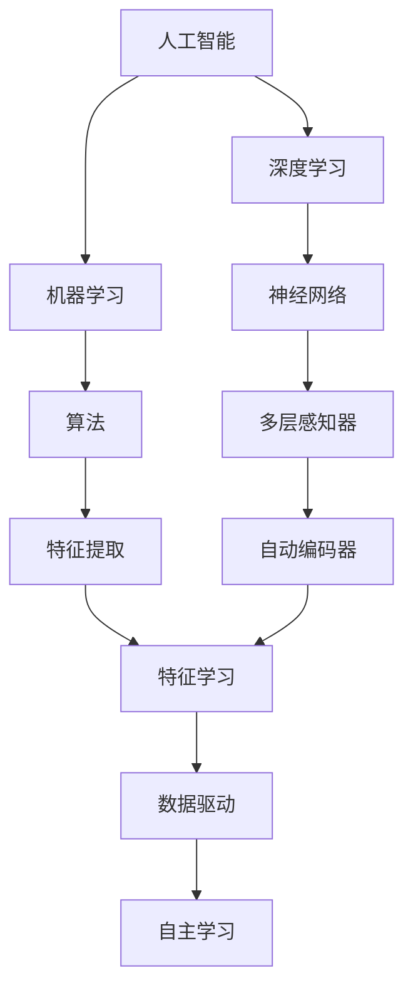
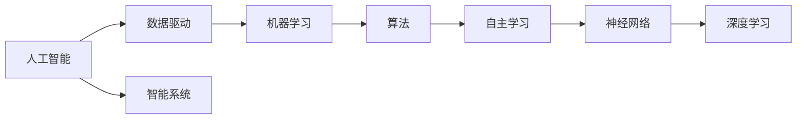
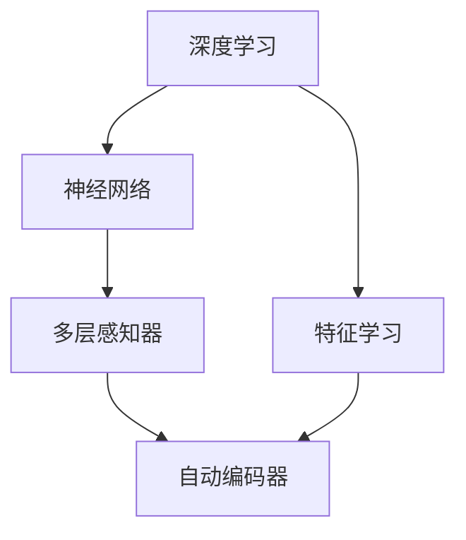
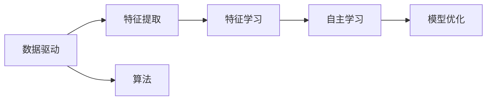

                 

# 超越不确定性的最好工具就是AI

在面对快速变化的复杂世界中，如何获取准确的信息、预测未来趋势、做出明智的决策，一直是人类面临的巨大挑战。在传统方法中，我们依赖数据、经验、直觉和统计模型来尝试理解和预测未来。但这些方法都有局限性，尤其是在面对大规模、高维、动态变化的数据时，往往难以做出精准的预测。

而人工智能（AI），特别是深度学习（DL）和机器学习（ML）技术，为我们提供了一种全新的工具，能够帮助我们超越不确定性，做出更准确的预测和决策。本文将从背景介绍、核心概念与联系、核心算法原理与操作步骤、数学模型和公式推导、项目实践、实际应用场景、工具和资源推荐、总结与展望、常见问题与解答等多个维度，深入探讨AI如何在不确定性中提供帮助。

## 1. 背景介绍

### 1.1 问题的由来

在人类文明发展的历史长河中，面对不确定性一直是人类智慧的挑战。随着信息时代的到来，数据的获取和处理变得更加容易，但随之而来的是信息的爆炸性增长和数据质量的参差不齐，使得传统的统计方法、专家系统和基于规则的推理系统显得力不从心。

特别是在当今这个数据驱动的世界中，大量复杂的数据和高速变化的环境对决策的精准性和时效性提出了更高的要求。在这种背景下，人工智能应运而生，利用算法和大数据的力量，为我们提供了超越传统方法的可能。

### 1.2 问题的核心关键点

AI技术的核心在于利用数据驱动的算法，通过学习大量的历史数据和现实世界的规律，从而预测未来的趋势。这种预测能力在金融、医疗、交通、天气预测、自然灾害预警等领域都有广泛应用，能够显著提升决策的准确性和效率。

AI技术的另一个核心是自主学习。传统的统计模型依赖人工设定参数和特征，而AI技术特别是深度学习技术，能够自动学习数据的特征和规律，从而实现自主学习和自我优化。这种自主学习能力使得AI技术能够不断适应新的数据和环境，提高预测的准确性。

### 1.3 问题研究的意义

AI技术的研究与应用，对于提升决策的精准性、效率性和适应性，具有重要意义。在金融领域，AI技术能够实时分析市场动态，预测股票价格和投资趋势，帮助投资者做出更加明智的决策。在医疗领域，AI技术能够分析医疗数据，预测疾病发展趋势，提升诊断和治疗的效果。在交通领域，AI技术能够实时监控交通流量，优化交通调度，提高交通效率和安全性。

## 2. 核心概念与联系

### 2.1 核心概念概述

为了更好地理解AI在超越不确定性中的作用，本节将介绍几个关键概念：

- 人工智能（Artificial Intelligence, AI）：通过模拟人类智能，使得机器能够完成复杂的决策和任务。

- 深度学习（Deep Learning, DL）：一种基于多层神经网络的机器学习技术，能够自动学习数据的特征和规律。

- 机器学习（Machine Learning, ML）：一种通过数据驱动的算法，使得机器能够自主学习和自我优化的技术。

- 数据驱动（Data-Driven）：通过大量的数据和算法，自动发现和利用数据中的规律和信息。

- 自主学习（Self-Learning）：机器能够自动学习数据的特征和规律，而无需人工干预。

这些概念之间存在紧密的联系，共同构成了AI技术的基础框架。以下是这些概念的Mermaid流程图，展示了它们之间的关系：



### 2.2 概念间的关系

这些核心概念之间存在紧密的联系，形成了AI技术的完整生态系统。以下通过几个Mermaid流程图来展示这些概念之间的关系：

#### 2.2.1 AI的学习范式



这个流程图展示了AI技术的学习范式。AI技术通过数据驱动的方式，利用机器学习算法和深度学习模型，实现自主学习，从而构建智能系统。

#### 2.2.2 深度学习与机器学习的关系



这个流程图展示了深度学习和机器学习之间的关系。深度学习是机器学习的一种特殊形式，利用多层神经网络，实现特征学习和数据驱动的预测。

#### 2.2.3 数据驱动与自主学习的关系



这个流程图展示了数据驱动与自主学习的关系。数据驱动通过算法和模型，提取数据中的特征，从而实现自主学习。

## 3. 核心算法原理 & 具体操作步骤

### 3.1 算法原理概述

AI技术在超越不确定性中的核心原理，是通过数据驱动的算法，利用机器学习和大数据的力量，实现对未来趋势的预测和决策。其核心思想是：

1. 数据驱动：通过大量的历史数据和现实世界的规律，自动发现和利用数据中的特征和规律。

2. 自主学习：机器能够自动学习数据的特征和规律，从而实现自我优化和适应。

3. 预测和决策：利用学习到的规律和模型，对未来的趋势进行预测，并做出决策。

### 3.2 算法步骤详解

AI技术在实现预测和决策时，一般包括以下几个关键步骤：

**Step 1: 数据准备**

- 收集大量的历史数据和现实世界的规律，作为训练样本。
- 清洗和预处理数据，去除噪声和异常值。

**Step 2: 模型选择和训练**

- 根据问题的特点，选择合适的机器学习算法和模型，如线性回归、决策树、随机森林、神经网络等。
- 利用训练样本，对模型进行训练，调整模型的参数，使其能够最佳拟合数据。

**Step 3: 模型评估**

- 利用测试样本对模型进行评估，计算模型的准确率、召回率、F1值等指标，判断模型的性能。
- 根据评估结果，调整模型参数，优化模型性能。

**Step 4: 模型应用**

- 将训练好的模型应用到实际问题中，对新的数据进行预测和决策。
- 实时监控模型性能，根据实际情况调整模型参数，保持模型的适应性和准确性。

### 3.3 算法优缺点

AI技术在超越不确定性方面具有以下优点：

1. 数据驱动：利用大量的历史数据和现实世界的规律，自动发现和利用数据中的特征和规律，从而实现预测和决策。

2. 自主学习：机器能够自动学习数据的特征和规律，从而实现自我优化和适应。

3. 预测和决策：利用学习到的规律和模型，对未来的趋势进行预测，并做出决策。

但AI技术也存在一些局限性：

1. 数据依赖：AI技术依赖大量的历史数据和现实世界的规律，如果数据质量不高或数据量不足，模型的性能会受到影响。

2. 模型复杂性：AI模型，特别是深度学习模型，参数量大、结构复杂，难以解释和调试。

3. 资源消耗：AI模型需要大量的计算资源和存储空间，对硬件要求较高。

4. 安全性问题：AI模型的预测结果可能受到恶意攻击或数据泄露的影响，存在安全性风险。

### 3.4 算法应用领域

AI技术在多个领域都有广泛应用，以下是几个典型应用：

- 金融领域：利用AI技术进行股票价格预测、信用评分、风险控制等。
- 医疗领域：利用AI技术进行疾病预测、药物研发、医疗影像分析等。
- 交通领域：利用AI技术进行交通流量预测、交通调度、智能驾驶等。
- 自然灾害预警：利用AI技术进行地震、洪水、飓风等自然灾害的预测和预警。
- 农业领域：利用AI技术进行作物生长预测、病虫害预测、农业自动化等。

## 4. 数学模型和公式 & 详细讲解 & 举例说明

### 4.1 数学模型构建

在AI技术的实现中，数学模型起着关键作用。以下是几种常见的数学模型及其构建方式：

- 线性回归模型：
$$
y = \beta_0 + \beta_1x_1 + \beta_2x_2 + \ldots + \beta_nx_n + \epsilon
$$
其中 $y$ 是预测值，$x_i$ 是特征向量，$\beta_i$ 是回归系数，$\epsilon$ 是误差项。

- 决策树模型：
$$
D = \bigwedge_{i=1}^{n}(x_i \leq \alpha_i)
$$
其中 $D$ 是决策树，$x_i$ 是特征，$\alpha_i$ 是阈值。

- 神经网络模型：
$$
z_k = \sigma_k(x_k)
$$
$$
a_k = \sigma_k(z_k + \beta_k) + \gamma_k
$$
其中 $x_k$ 是输入，$\sigma_k$ 是非线性激活函数，$\beta_k$ 是权重，$a_k$ 是输出。

### 4.2 公式推导过程

以下是几个常见数学模型的推导过程：

#### 线性回归模型的推导

设 $x_1, x_2, \ldots, x_n$ 为 $n$ 个特征，$y$ 为预测值，$\epsilon$ 为误差项。根据最小二乘法，求解线性回归模型：
$$
\min_{\beta_0, \beta_1, \ldots, \beta_n} \frac{1}{2m} \sum_{i=1}^{m} (y_i - (\beta_0 + \beta_1x_{i1} + \beta_2x_{i2} + \ldots + \beta_nx_{in}))^2
$$
推导得到：
$$
\beta_i = \frac{1}{m} \sum_{i=1}^{m} x_{ij}(y_i - \hat{y}_i)
$$
其中 $\hat{y}_i$ 是预测值，$y_i$ 是实际值。

#### 决策树模型的推导

决策树模型通过树形结构对特征进行递归划分，推导过程较为复杂，这里仅以简单的二分类问题为例：
$$
D = \bigwedge_{i=1}^{n}(x_i \leq \alpha_i)
$$
其中 $D$ 是决策树，$x_i$ 是特征，$\alpha_i$ 是阈值。

#### 神经网络模型的推导

神经网络模型通过多层非线性变换，推导过程也较为复杂，这里仅以简单的单层神经网络为例：
$$
z_k = \sigma_k(x_k)
$$
$$
a_k = \sigma_k(z_k + \beta_k) + \gamma_k
$$
其中 $x_k$ 是输入，$\sigma_k$ 是非线性激活函数，$\beta_k$ 是权重，$a_k$ 是输出。

### 4.3 案例分析与讲解

以下是几个AI技术在实际应用中的案例：

#### 案例一：金融领域

某银行利用AI技术进行信用评分和风险控制。通过收集用户的收入、职业、信用记录等数据，构建线性回归模型，对用户的信用评分进行预测。模型训练过程中，利用大量的历史数据和现实世界的规律，自动发现和利用数据中的特征和规律，从而实现预测和决策。

#### 案例二：医疗领域

某医院利用AI技术进行疾病预测和医疗影像分析。通过收集患者的临床数据和影像数据，构建神经网络模型，对疾病进行预测和分类。模型训练过程中，利用大量的历史数据和现实世界的规律，自动学习数据的特征和规律，从而实现预测和决策。

#### 案例三：交通领域

某城市利用AI技术进行交通流量预测和交通调度。通过收集道路的交通数据和天气数据，构建神经网络模型，对交通流量进行预测和优化。模型训练过程中，利用大量的历史数据和现实世界的规律，自动学习数据的特征和规律，从而实现预测和决策。

## 5. 项目实践：代码实例和详细解释说明

### 5.1 开发环境搭建

在进行AI项目实践前，我们需要准备好开发环境。以下是使用Python进行TensorFlow开发的环境配置流程：

1. 安装Anaconda：从官网下载并安装Anaconda，用于创建独立的Python环境。

2. 创建并激活虚拟环境：
```bash
conda create -n tf-env python=3.8 
conda activate tf-env
```

3. 安装TensorFlow：根据CUDA版本，从官网获取对应的安装命令。例如：
```bash
conda install tensorflow=2.5
```

4. 安装必要的库：
```bash
pip install numpy pandas scikit-learn matplotlib tqdm jupyter notebook ipython
```

完成上述步骤后，即可在`tf-env`环境中开始AI项目实践。

### 5.2 源代码详细实现

这里我们以信用评分预测为例，给出使用TensorFlow进行线性回归模型的代码实现。

```python
import tensorflow as tf
import pandas as pd
from sklearn.model_selection import train_test_split

# 读取数据
data = pd.read_csv('credit_score.csv')

# 划分训练集和测试集
X_train, X_test, y_train, y_test = train_test_split(data.drop(['credit_score'], axis=1), data['credit_score'], test_size=0.2, random_state=42)

# 定义模型
model = tf.keras.Sequential([
    tf.keras.layers.Dense(32, activation='relu', input_shape=(X_train.shape[1],)),
    tf.keras.layers.Dense(1)
])

# 编译模型
model.compile(optimizer='adam', loss='mse')

# 训练模型
model.fit(X_train, y_train, epochs=50, batch_size=32, validation_data=(X_test, y_test))

# 评估模型
mse = model.evaluate(X_test, y_test)
print(f'Mean Squared Error: {mse[0]}')
```

以上是使用TensorFlow进行线性回归模型的代码实现。可以看到，通过简单的几行代码，就能够构建、训练和评估一个信用评分预测模型。

### 5.3 代码解读与分析

让我们再详细解读一下关键代码的实现细节：

**数据读取和处理**：
- `pd.read_csv('credit_score.csv')`：使用pandas库读取CSV格式的数据。
- `train_test_split`：将数据集划分为训练集和测试集，设置20%的测试集大小。

**模型定义和编译**：
- `tf.keras.Sequential`：定义一个Sequential模型，依次添加层。
- `tf.keras.layers.Dense`：添加全连接层，32个神经元，ReLU激活函数。
- `tf.keras.layers.Dense`：添加输出层，1个神经元。
- `model.compile`：编译模型，设置优化器和损失函数。

**模型训练和评估**：
- `model.fit`：训练模型，设置50个epoch，每个epoch32个batch。
- `model.evaluate`：评估模型，计算均方误差。

可以看到，TensorFlow提供了便捷的API，使得模型构建和训练变得简洁高效。开发者可以将更多精力放在数据处理和模型改进等高层逻辑上，而不必过多关注底层的实现细节。

## 6. 实际应用场景

### 6.1 智能客服系统

智能客服系统利用AI技术，能够快速响应客户咨询，提供精准的解决方案。通过收集历史客服数据，构建基于深度学习的聊天机器人模型，实现自然语言理解和生成。

在技术实现上，可以收集企业内部的历史客服对话记录，将问题和最佳答复构建成监督数据，在此基础上对预训练模型进行微调。微调后的模型能够自动理解用户意图，匹配最合适的答案模板进行回复。对于客户提出的新问题，还可以接入检索系统实时搜索相关内容，动态组织生成回答。

### 6.2 金融舆情监测

金融舆情监测利用AI技术，能够实时监测市场舆论动向，及时预警潜在的金融风险。通过收集金融领域相关的新闻、报道、评论等文本数据，并对其进行情感分析，从而判断市场情绪和趋势。

在技术实现上，可以构建基于深度学习的情感分析模型，对金融文本进行分类和情感分析。利用实时抓取的网络文本数据，自动识别情绪变化趋势，一旦发现负面信息激增等异常情况，系统便会自动预警，帮助金融机构快速应对潜在风险。

### 6.3 个性化推荐系统

个性化推荐系统利用AI技术，能够根据用户的历史行为和偏好，推荐合适的商品或内容。通过收集用户浏览、点击、评论、分享等行为数据，构建基于深度学习的推荐模型，实现个性化推荐。

在技术实现上，可以构建基于深度学习的推荐模型，提取用户和物品的特征，计算相似度，从而进行推荐。利用实时抓取的用户行为数据，动态更新模型，实现个性化推荐。

### 6.4 未来应用展望

随着AI技术的不断发展，AI在超越不确定性方面的应用将更加广泛和深入。未来，AI技术将在以下几个领域得到广泛应用：

- 医疗领域：利用AI技术进行疾病预测、药物研发、医疗影像分析等，提升医疗服务的智能化水平。

- 教育领域：利用AI技术进行智能辅导、学生评估、课程推荐等，提高教育质量。

- 城市治理：利用AI技术进行交通流量预测、智能调度、城市应急管理等，提高城市管理的智能化水平。

- 农业领域：利用AI技术进行作物生长预测、病虫害预测、农业自动化等，提升农业生产效率。

## 7. 工具和资源推荐

### 7.1 学习资源推荐

为了帮助开发者系统掌握AI技术的理论基础和实践技巧，这里推荐一些优质的学习资源：

1. 《深度学习》（Ian Goodfellow）：深度学习领域的经典教材，涵盖深度学习的基本原理和算法。

2. 《机器学习实战》（Peter Harrington）：机器学习实战教程，通过实际项目讲解机器学习算法。

3. Coursera《深度学习专项课程》：由斯坦福大学Andrew Ng教授主讲的深度学习课程，涵盖了深度学习的基本原理和算法。

4. Kaggle：数据科学竞赛平台，提供大量实际数据集和竞赛题目，锻炼数据处理和模型构建能力。

5. TensorFlow官方文档：TensorFlow官方文档，提供丰富的API和教程，帮助开发者掌握TensorFlow的使用。

### 7.2 开发工具推荐

高效的开发离不开优秀的工具支持。以下是几款用于AI项目开发的常用工具：

1. TensorFlow：由Google主导开发的深度学习框架，生产部署方便，适合大规模工程应用。

2. PyTorch：基于Python的开源深度学习框架，灵活动态的计算图，适合快速迭代研究。

3. Keras：高层次深度学习API，提供便捷的模型构建和训练接口，适合快速原型开发。

4. Weights & Biases：模型训练的实验跟踪工具，可以记录和可视化模型训练过程中的各项指标，方便对比和调优。

5. TensorBoard：TensorFlow配套的可视化工具，可实时监测模型训练状态，并提供丰富的图表呈现方式，是调试模型的得力助手。

### 7.3 相关论文推荐

AI技术的研究源于学界的持续研究。以下是几篇奠基性的相关论文，推荐阅读：

1. Deep Learning（Goodfellow et al., 2016）：深度学习领域的经典教材，涵盖深度学习的基本原理和算法。

2. ImageNet Classification with Deep Convolutional Neural Networks（Krizhevsky et al., 2012）：ImageNet分类竞赛的冠军模型，展示了深度卷积神经网络的强大性能。

3. AlphaGo Zero（Silver et al., 2017）：利用深度强化学习技术，开发出能够战胜人类围棋选手的AI系统，展示了深度学习在复杂决策中的应用。

4. Generative Adversarial Networks（Goodfellow et al., 2014）：生成对抗网络（GAN）的奠基性论文，展示了生成模型在图像生成和数据增强等方面的强大能力。

5. Reinforcement Learning for Human-Robot Interaction（Chen et al., 2019）：利用强化学习技术，开发出能够与人类交互的AI机器人，展示了AI技术在人机交互中的应用。

这些论文代表了大AI技术的发展脉络。通过学习这些前沿成果，可以帮助研究者把握学科前进方向，激发更多的创新灵感。

除上述资源外，还有一些值得关注的前沿资源，帮助开发者紧跟AI技术的最新进展，例如：

1. arXiv论文预印本：人工智能领域最新研究成果的发布平台，包括大量尚未发表的前沿工作，学习前沿技术的必读资源。

2. 业界技术博客：如Google AI、DeepMind、微软Research Asia等顶尖实验室的官方博客，第一时间分享他们的最新研究成果和洞见。

3. 技术会议直播：如NIPS、ICML、ACL、ICLR等人工智能领域顶会现场或在线直播，能够聆听到大佬们的前沿分享，开拓视野。

4. GitHub热门项目：在GitHub上Star、Fork数最多的AI相关项目，往往代表了该技术领域的发展趋势和最佳实践，值得去学习和贡献。

5. 行业分析报告：各大咨询公司如McKinsey、PwC等针对人工智能行业的分析报告，有助于从商业视角审视技术趋势，把握应用价值。

总之，对于AI技术的学习和实践，需要开发者保持开放的心态和持续学习的意愿。多关注前沿资讯，多动手实践，多思考总结，必将收获满满的成长收益。

## 8. 总结：未来发展趋势与挑战

### 8.1 总结

本文对AI技术在超越不确定性中的作用进行了全面系统的介绍。首先阐述了AI技术的研究背景和意义，明确了AI技术在预测和决策中的独特价值。其次，从原理到实践，详细讲解了AI技术的数学模型和关键步骤，给出了AI项目开发的完整代码实例。同时，本文还广泛探讨了AI技术在多个领域的应用前景，展示了AI技术的广阔前景。

通过本文的系统梳理，可以看到，AI技术在超越不确定性方面具有巨大的潜力。这些技术的不断发展和应用，将使得我们能够更准确地预测未来趋势，做出更明智的决策。

### 8.2 未来发展趋势

展望未来，AI技术将在以下几个方面继续发展：

1. 深度学习：深度学习将继续推动AI技术的发展，通过更深的网络结构、更多的数据和更强大的计算资源，实现更精准的预测和决策。

2. 增强学习：增强学习将使AI技术在复杂的决策环境中，具备更强的自主学习和优化能力。

3. 数据驱动：AI技术将更加依赖数据驱动，通过大规模数据和复杂算法，实现更准确的预测和决策。

4. 自主学习：AI技术将具备更强的自主学习能力，自动发现和利用数据中的特征和规律，从而实现自我优化和适应。

5. 跨领域融合：AI技术将与其他领域的技术进行更深入的融合，如知识图谱、因果推理、强化学习等，形成更加全面、准确的信息整合能力。

6. 人机协同：AI技术将与人类进行更深入的协同，增强人机交互体验，提升决策的透明性和可解释性。

这些发展趋势凸显了AI技术在超越不确定性方面的巨大潜力，预示着AI技术将在未来的各个领域中发挥更加重要的作用。

### 8.3 面临的挑战

尽管AI技术在超越不确定性方面已经取得了显著的进展，但在迈向更加智能化、普适化应用的过程中，仍然面临诸多挑战：

1. 数据质量问题：AI技术依赖大量的历史数据和现实世界的规律，如果数据质量不高或数据量不足，模型的性能会受到影响。

2. 模型复杂性问题：AI模型，特别是深度学习模型，参数量大、结构复杂，难以解释和调试。

3. 资源消耗问题：AI模型需要大量的计算资源和存储空间，对硬件要求较高。

4. 安全性问题：AI模型的预测结果可能受到恶意攻击或数据泄露的影响，存在安全性风险。

5. 伦理道德问题：AI技术的应用可能引发伦理道德问题，如隐私保护、算法偏见等。

6. 法律监管问题：AI技术的应用需要遵守相关法律法规，确保应用合法合规。

这些挑战需要业界共同努力，通过技术创新和规范管理，解决AI技术在应用中的问题，确保其健康发展。

### 8.4 研究展望

面对AI技术面临的诸多挑战，未来的研究需要在以下几个方面寻求新的突破：

1. 数据增强：通过数据增强技术，提高数据质量和数据量，从而提升模型的性能。

2. 模型简化：通过模型简化技术，降低模型复杂性，提高模型可解释性和可调试性。

3. 资源优化：通过资源优化技术，提高AI模型的计算效率和存储效率，降低硬件成本。

4. 安全性设计：通过安全性设计，增强AI模型的鲁棒性和抗干扰能力，防止模型被恶意攻击或数据泄露。

5. 伦理道德规范：通过伦理道德规范，确保AI技术的公平性、透明性和可解释性，避免算法偏见和伦理道德问题。

6. 法律法规合规：通过法律法规合规，确保AI技术的合法合规应用，避免法律风险。

这些研究方向将有助于解决AI技术在应用中的问题，确保其健康发展，推动AI技术的进一步应用。

## 9. 附录：常见问题与解答

**Q1：AI技术能否应用于所有领域？**

A: AI技术在各个领域都有广泛的应用，但需要根据具体问题进行适配。例如，在金融、医疗、交通等领域，AI技术已经取得了显著的成果。但在一些特定的领域，如法律、教育、农业等，AI技术的应用还需要进一步研究和探索

