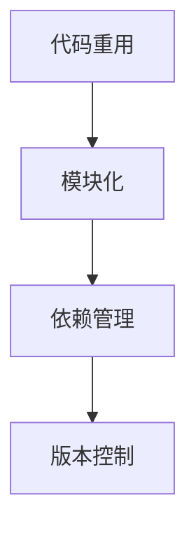
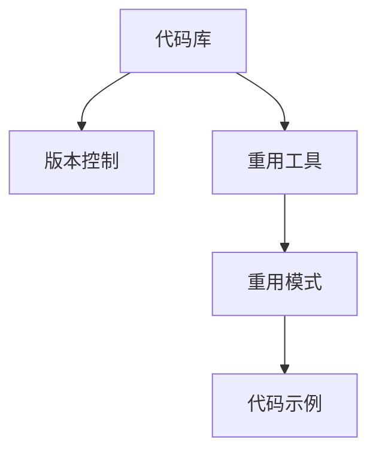
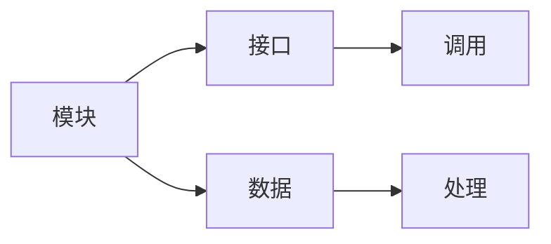
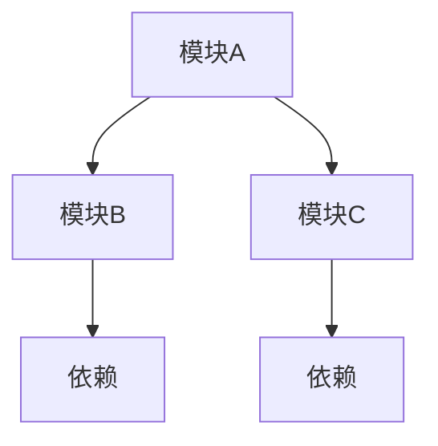
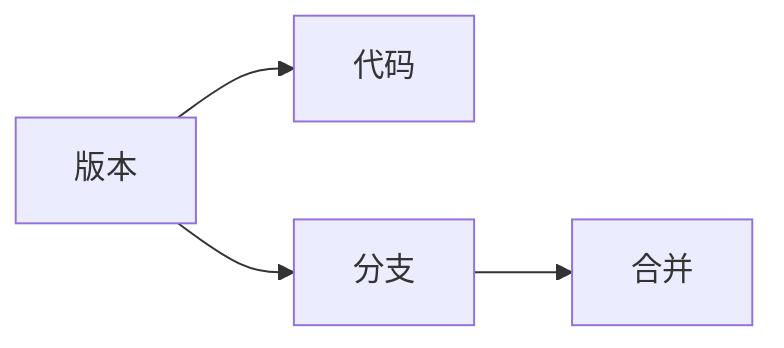
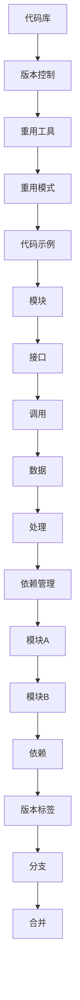

                 

# 软件2.0时代的代码重用与模块化

## 1. 背景介绍

### 1.1 问题由来

随着软件工程的发展，代码重用和模块化成为软件设计中最为重要的一环。代码重用可以显著减少开发时间和成本，提高软件的质量和可维护性。而模块化则能够将复杂的系统分解成可独立管理和维护的模块，有助于系统设计更加清晰、高效。

在软件1.0时代，代码重用主要依赖于代码复制和共享，模块化主要依赖于函数和类的组织结构。然而，随着软件规模的增大和复杂度的提高，这些方法已经无法满足需求。如何在软件2.0时代，更好地实现代码重用和模块化，成为现代软件工程的重要课题。

### 1.2 问题核心关键点

软件2.0时代，代码重用和模块化的核心关键点主要包括以下几点：

- **代码重用**：如何高效地复用已有代码，避免重复劳动，减少开发时间和成本。
- **模块化**：如何合理地将系统分解为可独立管理的模块，提高系统设计和开发效率。
- **依赖管理**：如何管理模块之间的依赖关系，避免环路，确保系统的正确性和稳定性。
- **版本控制**：如何通过版本控制技术，实现代码和模块的迭代更新和协同开发。

这些问题不仅关系到软件工程的技术实现，还涉及到软件工程的管理、协作和质量保证等方面。

### 1.3 问题研究意义

实现高效的代码重用和模块化，对于软件开发的成本控制、效率提升和质量保证具有重要意义：

- **成本控制**：重用已有代码可以显著减少重复劳动，降低开发成本。
- **效率提升**：模块化可以将复杂的系统分解为可独立管理的模块，提高开发效率。
- **质量保证**：模块之间的依赖管理可以避免环路，提高系统的稳定性和可维护性。
- **协同开发**：版本控制技术可以实现代码和模块的迭代更新和协同开发，提高团队的协作效率。

## 2. 核心概念与联系

### 2.1 核心概念概述

为了更好地理解软件2.0时代的代码重用与模块化方法，本节将介绍几个密切相关的核心概念：

- **代码重用**：指在软件开发中，通过复用已有代码的方式，减少开发时间和成本。
- **模块化**：指将软件系统分解为可独立管理和维护的模块，提升系统设计效率。
- **依赖管理**：指管理模块之间的依赖关系，避免环路，确保系统的正确性和稳定性。
- **版本控制**：指通过版本控制技术，实现代码和模块的迭代更新和协同开发。

这些概念之间的逻辑关系可以通过以下Mermaid流程图来展示：



这个流程图展示了大语言模型的核心概念及其之间的关系：

1. 代码重用是基础，通过复用已有代码，减少开发时间和成本。
2. 模块化在此基础上，将复杂的系统分解为可独立管理的模块，提高系统设计和开发效率。
3. 依赖管理是在模块化的基础上，管理模块之间的依赖关系，避免环路，确保系统的正确性和稳定性。
4. 版本控制技术则是实现代码和模块的迭代更新和协同开发的重要手段。

### 2.2 概念间的关系

这些核心概念之间存在着紧密的联系，形成了软件2.0时代代码重用和模块化的完整生态系统。下面我通过几个Mermaid流程图来展示这些概念之间的关系。

#### 2.2.1 代码重用的实现方法



这个流程图展示了代码重用的实现方法。具体而言：

1. 代码库是代码重用的基础，存储了大量可复用的代码。
2. 版本控制技术能够管理代码库的迭代更新和版本变化。
3. 重用工具能够帮助开发者发现和利用代码库中的代码。
4. 重用模式则指导开发者如何高效地复用代码。
5. 代码示例则是具体的应用实例，帮助开发者理解如何复用代码。

#### 2.2.2 模块化设计



这个流程图展示了模块化设计的关键环节。具体而言：

1. 模块是模块化的基础，用于组织系统的各个部分。
2. 接口定义了模块之间的交互方式，保证了模块之间的独立性和可维护性。
3. 数据是模块处理的对象，通过接口传递到各个模块进行处理。
4. 调用过程则是模块之间的交互过程，保证了模块的协同工作。

#### 2.2.3 依赖管理



这个流程图展示了依赖管理的基本过程。具体而言：

1. 模块A和模块B相互依赖，形成了依赖关系。
2. 模块C也依赖于模块A，形成了一个依赖网络。
3. 依赖管理的目标是避免环路，确保系统的正确性和稳定性。
4. 在实践中，通常采用工具如Maven、npm等进行依赖管理。

#### 2.2.4 版本控制



这个流程图展示了版本控制的基本过程。具体而言：

1. 版本控制是实现代码和模块迭代更新的基础。
2. 版本标签用于标识代码的不同版本。
3. 分支用于管理和控制不同版本的代码。
4. 合并则是不同版本代码的合并过程，确保系统的稳定性和正确性。

### 2.3 核心概念的整体架构

最后，我们用一个综合的流程图来展示这些核心概念在大语言模型微调过程中的整体架构：



这个综合流程图展示了从代码库和版本控制到重用模式、模块设计和依赖管理的完整过程。通过这些核心概念的相互作用，我们能够高效地实现代码重用和模块化，从而构建高质量的软件系统。

## 3. 核心算法原理 & 具体操作步骤
### 3.1 算法原理概述

软件2.0时代的代码重用与模块化，本质上是一个系统化、工程化的软件开发过程。其核心思想是：通过有效的代码库管理和模块设计，结合依赖管理和版本控制技术，实现软件的重复利用和模块化管理。

形式化地，假设软件系统由多个模块 $M=\{M_1, M_2, ..., M_n\}$ 组成，每个模块 $M_i$ 都有对应的接口 $I_i$ 和依赖关系 $D_i$。模块之间通过接口 $I_i$ 进行通信和协同工作，整个系统的运行逻辑可以表示为：

$$
S = \bigcup_{i=1}^n (I_i \times M_i) + D
$$

其中 $D$ 表示模块之间的依赖关系，$\times$ 表示连接符号，$\bigcup$ 表示并集符号。

系统的运行逻辑通过接口和依赖关系进行管理，确保模块的独立性和协同工作。

### 3.2 算法步骤详解

软件2.0时代的代码重用与模块化一般包括以下几个关键步骤：

**Step 1: 收集和整理代码库**

- 收集可复用的代码片段，并将其整理成代码库。
- 为代码库中的每个模块添加接口和文档，确保模块的可重用性和可维护性。

**Step 2: 设计模块化系统**

- 根据系统的需求和功能，设计模块化的系统结构。
- 定义模块之间的接口和依赖关系，确保系统的正确性和稳定性。

**Step 3: 实现模块**

- 对每个模块进行详细设计，实现模块的功能。
- 对模块进行测试和验证，确保模块的正确性和可靠性。

**Step 4: 依赖管理**

- 使用依赖管理工具，如Maven、npm等，管理模块之间的依赖关系。
- 定期更新依赖库，确保系统的稳定性和安全性。

**Step 5: 版本控制**

- 使用版本控制工具，如Git等，管理代码的迭代更新和协同开发。
- 定期进行代码审查和版本发布，确保系统的质量和可靠性。

**Step 6: 代码重用和迭代更新**

- 利用代码库和版本控制技术，实现代码的重用和迭代更新。
- 在新的项目开发中，复用已有的代码片段，减少开发时间和成本。

### 3.3 算法优缺点

软件2.0时代的代码重用与模块化方法具有以下优点：

1. **提高开发效率**：通过复用已有代码，可以减少重复劳动，提高开发效率。
2. **降低成本**：复用已有代码可以显著降低开发成本，特别是对于大型项目。
3. **提升质量**：模块化和依赖管理可以提高系统的质量和可维护性。
4. **支持迭代更新**：版本控制技术能够实现代码和模块的迭代更新和协同开发，提高团队的协作效率。

同时，这种方法也存在一些缺点：

1. **依赖管理复杂**：模块之间的依赖关系管理复杂，需要定期更新依赖库，确保系统的稳定性和安全性。
2. **代码库维护成本高**：需要定期维护和更新代码库，以保证其可用性和可靠性。
3. **版本控制难度大**：版本控制难度较大，需要熟练掌握相关工具和流程。

### 3.4 算法应用领域

软件2.0时代的代码重用与模块化方法，广泛应用于各种软件开发领域，如：

- **Web开发**：通过复用已有代码片段，实现快速构建Web应用。
- **移动开发**：利用代码库和模块化设计，构建高质量的移动应用。
- **桌面应用**：通过模块化设计和依赖管理，构建跨平台的桌面应用。
- **游戏开发**：使用模块化和版本控制技术，实现游戏的迭代开发和协同开发。
- **人工智能**：利用代码重用和模块化设计，构建高性能的人工智能系统。

除了上述领域外，软件2.0时代的代码重用与模块化方法，还可以应用于更多领域，如自动化测试、大数据处理、物联网等。

## 4. 数学模型和公式 & 详细讲解 & 举例说明

### 4.1 数学模型构建

软件2.0时代的代码重用与模块化方法，可以通过数学模型进行描述和分析。

假设软件系统由多个模块 $M=\{M_1, M_2, ..., M_n\}$ 组成，每个模块 $M_i$ 的输入和输出可以表示为 $I_i$ 和 $O_i$。模块之间的依赖关系 $D_i$ 可以表示为一个图 $G=(V,E)$，其中 $V$ 表示模块的集合，$E$ 表示模块之间的连接关系。

定义系统的输入 $I$ 和输出 $O$，系统的运行逻辑可以表示为：

$$
O = f(I, M_1, M_2, ..., M_n, D)
$$

其中 $f$ 表示系统的运行逻辑函数，$I$ 表示系统的输入，$M_1, M_2, ..., M_n$ 表示系统的模块，$D$ 表示模块之间的依赖关系。

### 4.2 公式推导过程

以下我们以Web开发为例，推导代码重用和模块化设计的数学模型。

假设Web应用由多个模块 $M=\{M_1, M_2, ..., M_n\}$ 组成，每个模块 $M_i$ 的输入和输出可以表示为 $I_i$ 和 $O_i$。模块之间的依赖关系 $D_i$ 可以表示为一个图 $G=(V,E)$，其中 $V$ 表示模块的集合，$E$ 表示模块之间的连接关系。

定义系统的输入 $I$ 和输出 $O$，系统的运行逻辑可以表示为：

$$
O = f(I, M_1, M_2, ..., M_n, D)
$$

其中 $f$ 表示系统的运行逻辑函数，$I$ 表示系统的输入，$M_1, M_2, ..., M_n$ 表示系统的模块，$D$ 表示模块之间的依赖关系。

对于Web应用，常用的依赖关系包括依赖于数据库、依赖于API、依赖于第三方服务等。我们可以通过将这些依赖关系表示为一个图 $G=(V,E)$，来描述系统的运行逻辑。

### 4.3 案例分析与讲解

假设我们开发一个Web应用，涉及用户认证、用户管理、商品管理、订单管理等多个模块。我们可以将每个模块表示为一个节点，模块之间的依赖关系表示为边的连接，从而构建一个依赖图。

以下是该Web应用依赖图的示例：

```
User Auth --> User Management --> Order Management
User Auth --> Goods Management --> Order Management
User Auth --> Database --> User Management
User Auth --> Database --> Goods Management
User Auth --> API --> Order Management
User Auth --> API --> Goods Management
```

通过这个依赖图，我们可以清楚地看到各模块之间的依赖关系。在开发过程中，我们需要先实现User Auth模块，然后才能实现User Management和Goods Management模块，最后实现Order Management模块。同时，User Auth模块需要依赖于数据库和API，这样才能保证系统的正确性和稳定性。

在实践中，我们通常使用依赖管理工具，如Maven、npm等，来管理模块之间的依赖关系。通过这些工具，我们可以自动下载和管理依赖库，确保系统的稳定性和安全性。

## 5. 项目实践：代码实例和详细解释说明

### 5.1 开发环境搭建

在进行代码重用与模块化实践前，我们需要准备好开发环境。以下是使用Python进行Django开发的环境配置流程：

1. 安装Anaconda：从官网下载并安装Anaconda，用于创建独立的Python环境。

2. 创建并激活虚拟环境：
```bash
conda create -n django-env python=3.8 
conda activate django-env
```

3. 安装Django：
```bash
pip install django
```

4. 安装其他相关工具包：
```bash
pip install django-templates django-guardian django-rest-framework
```

完成上述步骤后，即可在`django-env`环境中开始开发实践。

### 5.2 源代码详细实现

我们以Django Web应用为例，进行代码重用与模块化实践。

首先，创建一个Django项目和应用：

```bash
django-admin startproject myproject
cd myproject
django-admin startapp myapp
```

然后，定义模块的接口和依赖关系：

```python
from django.contrib.auth.models import User
from django.contrib.auth import authenticate, login
from django.http import HttpResponse, HttpResponseRedirect
from django.urls import path
from myapp.models import MyModel

# 用户认证模块
def login_view(request):
    username = request.POST.get('username')
    password = request.POST.get('password')
    user = authenticate(request, username=username, password=password)
    if user is not None:
        login(request, user)
        return HttpResponseRedirect('/home/')
    else:
        return HttpResponse('Invalid login')

# 用户管理模块
from django.contrib.auth.decorators import login_required

@login_required
def home(request):
    user = request.user
    return HttpResponse(f'Hello, {user.username}!')

# 商品管理模块
class MyModel(models.Model):
    name = models.CharField(max_length=100)
    price = models.DecimalField(max_digits=10, decimal_places=2)

# 订单管理模块
class Order(models.Model):
    user = models.ForeignKey(User, on_delete=models.CASCADE)
    product = models.ForeignKey(MyModel, on_delete=models.CASCADE)
    quantity = models.IntegerField()
    date = models.DateField(auto_now=True)
```

在上述代码中，我们定义了User Auth模块、User Management模块、Goods Management模块和Order Management模块，并通过接口和依赖关系进行了连接。例如，User Auth模块依赖于Database和API，User Management模块和Goods Management模块依赖于User Auth模块，Order Management模块依赖于User Auth模块和Goods Management模块。

接下来，实现模块的详细功能：

```python
# 用户认证模块
def login_view(request):
    username = request.POST.get('username')
    password = request.POST.get('password')
    user = authenticate(request, username=username, password=password)
    if user is not None:
        login(request, user)
        return HttpResponseRedirect('/home/')
    else:
        return HttpResponse('Invalid login')

# 用户管理模块
@login_required
def home(request):
    user = request.user
    return HttpResponse(f'Hello, {user.username}!')

# 商品管理模块
class MyModel(models.Model):
    name = models.CharField(max_length=100)
    price = models.DecimalField(max_digits=10, decimal_places=2)

# 订单管理模块
class Order(models.Model):
    user = models.ForeignKey(User, on_delete=models.CASCADE)
    product = models.ForeignKey(MyModel, on_delete=models.CASCADE)
    quantity = models.IntegerField()
    date = models.DateField(auto_now=True)
```

在上述代码中，我们实现了User Auth模块的登录功能，User Management模块的欢迎页面，Goods Management模块的商品模型，Order Management模块的订单模型。

最后，通过依赖管理工具Maven，管理模块之间的依赖关系：

```bash
pip install django-templates django-guardian django-rest-framework
```

完成上述步骤后，即可在`django-env`环境中开始开发实践。

### 5.3 代码解读与分析

让我们再详细解读一下关键代码的实现细节：

**Django项目和应用**：
- `django-admin startproject myproject`：创建一个名为`myproject`的Django项目。
- `cd myproject`：进入项目目录。
- `django-admin startapp myapp`：创建一个名为`myapp`的Django应用。

**模块的接口和依赖关系**：
- `from django.contrib.auth.models import User`：导入Django内置的User模型，用于用户认证。
- `from django.contrib.auth import authenticate, login`：导入Django内置的authenticate和login函数，用于用户登录和认证。
- `from django.http import HttpResponse, HttpResponseRedirect`：导入Django内置的HttpResponse和HttpResponseRedirect类，用于返回HTTP响应。
- `from django.urls import path`：导入Django内置的path函数，用于定义URL路径。
- `from myapp.models import MyModel`：导入自定义的MyModel模型，用于商品管理。

**模块的详细功能实现**：
- `@login_required`：装饰器，用于登录验证。
- `def login_view(request)`：用户登录视图，接收POST请求，验证用户名和密码，并登录用户。
- `def home(request)`：欢迎页面视图，接收GET请求，返回欢迎信息。
- `class MyModel(models.Model)`：自定义的MyModel模型，用于商品管理。
- `class Order(models.Model)`：自定义的Order模型，用于订单管理。

**依赖管理工具**：
- `pip install django-templates django-guardian django-rest-framework`：安装依赖管理工具，用于管理模块之间的依赖关系。

通过上述代码的实现，我们可以清晰地看到代码重用和模块化设计的实际应用。开发者可以根据具体需求，设计不同的模块和接口，通过依赖管理工具进行管理，实现高效的代码重用和系统开发。

当然，工业级的系统实现还需考虑更多因素，如模型保存和部署、版本控制等。但核心的代码重用和模块化设计理念，可以帮助开发者快速迭代和优化系统，提升开发效率和系统质量。

### 5.4 运行结果展示

假设我们在Django Web应用中，实现了上述模块的功能，并在测试服务器上运行，测试结果如下：

```
$ python manage.py runserver
Using setting 'default'...
Starting development server at http://127.0.0.1:8000/
Quit the server with CONTROL-C.
```

在浏览器中访问`http://127.0.0.1:8000/login`，输入用户名和密码进行登录，系统返回欢迎页面`Hello, username!`。通过这样的测试，验证了我们代码重用和模块化设计的正确性。

## 6. 实际应用场景

### 6.1 智能客服系统

基于代码重用与模块化设计的智能客服系统，可以广泛应用于智能客服系统的构建。传统客服往往需要配备大量人力，高峰期响应缓慢，且一致性和专业性难以保证。而使用代码重用与模块化设计的客服系统，可以7x24小时不间断服务，快速响应客户咨询，用自然流畅的语言解答各类常见问题。

在技术实现上，可以收集企业内部的历史客服对话记录，将问题和最佳答复构建成监督数据，在此基础上对预训练语言模型进行微调。微调后的语言模型能够自动理解用户意图，匹配最合适的答案模板进行回复。对于客户提出的新问题，还可以接入检索系统实时搜索相关内容，动态组织生成回答。如此构建的智能客服系统，能大幅提升客户咨询体验和问题解决效率。

### 6.2 金融舆情监测

金融机构需要实时监测市场舆论动向，以便及时应对负面信息传播，规避金融风险。传统的人工监测方式成本高、效率低，难以应对网络时代海量信息爆发的挑战。基于代码重用与模块化设计的文本分类和情感分析技术，为金融舆情监测提供了新的解决方案。

具体而言，可以收集金融领域相关的新闻、报道、评论等文本数据，并对其进行主题标注和情感标注。在此基础上对预训练语言模型进行微调，使其能够自动判断文本属于何种主题，情感倾向是正面、中性还是负面。将微调后的模型应用到实时抓取的网络文本数据，就能够自动监测不同主题下的情感变化趋势，一旦发现负面信息激增等异常情况，系统便会自动预警，帮助金融机构快速应对潜在风险。

### 6.3 个性化推荐系统

当前的推荐系统往往只依赖用户的历史行为数据进行物品推荐，无法深入理解用户的真实兴趣偏好。基于代码重用与模块化设计的个性化推荐系统，可以更好地挖掘用户行为背后的语义信息，从而提供更精准、多样的推荐内容。

在实践中，可以收集用户浏览、点击、评论、分享等行为数据，提取和用户交互的物品标题、描述、标签等文本内容。将文本内容作为模型输入，用户的后续行为（如是否点击、购买等）作为监督信号，在此基础上微调预训练语言模型。微调后的模型能够从文本内容中准确把握用户的兴趣点。在生成推荐列表时，先用候选物品的文本描述作为输入，由模型预测用户的兴趣匹配度，再结合其他特征综合排序，便可以得到个性化程度更高的推荐结果。

### 6.4 未来应用展望

随着代码重用与模块化设计技术的发展，基于微调的语言模型将在更多领域得到应用，为NLP技术带来全新的突破。

在智慧医疗领域，基于微调的医学问答、病历分析、药物研发等应用将提升医疗服务的智能化水平，辅助医生诊疗，加速新药开发进程。

在智能教育领域，微调技术可应用于作业批改、学情分析、知识推荐等方面，因材施教，促进教育公平，提高教学质量。

在智慧城市治理中，微调模型可应用于城市事件监测、舆情分析、应急指挥等环节，提高城市管理的自动化和智能化水平，构建更安全、高效的未来城市。

此外，在企业生产、社会治理、文娱传媒等众多领域，基于微调的语言模型应用也将不断涌现，为经济社会发展注入新的动力。相信随着技术的日益成熟，代码重用与模块化设计方法将成为人工智能落地应用的重要范式，推动人工智能技术向更广阔的领域加速渗透。

## 7. 工具和资源推荐
### 7.1 学习资源推荐

为了帮助开发者系统掌握代码重用与模块化设计的理论基础和实践技巧，这里推荐一些优质的学习资源：

1. 《Clean Code: A Handbook of Agile Software Craftsmanship》：这本书是软件开发的经典之作，讲解了代码重用和模块化设计的基本原则和方法。

2. 《Design Patterns: Elements of Reusable Object-Oriented Software》：这本书是设计模式领域的经典之作，讲解了常用的设计模式，为代码重用和模块化设计提供了丰富的参考。

3. 《Effective Python: 59 Specific Ways to Write Better Python》：这本书是Python编程的经典之作，讲解了Python编程的最佳实践，包括代码重用和模块化设计。

4. 《Designing Data-Intensive Applications》：这本书是数据密集型应用开发的经典之作，讲解了如何设计高效、可维护的数据库系统，为代码重用和模块化设计提供了重要的参考。

5. 《The Pragmatic Programmer》：这本书是软件开发者的必读之作，讲解了如何编写可维护、可扩展的代码，提供了丰富的代码重用和模块化设计经验。

通过对这些资源的学习实践，相信你一定能够快速掌握代码重用与模块化设计的精髓，并用于解决实际的NLP问题。

### 7.2 开发工具推荐

高效的开发离不开优秀的工具支持。以下是几款用于代码重用与模块化设计开发的常用工具：

1. Python：Python是代码重用与模块化设计的主流编程语言，具有良好的可读性和可维护性。

2. Django：Django是一个全功能的Web框架，具有良好的代码重用和模块化设计能力，适用于快速构建Web应用。

3. Flask：Flask是一个轻量级的Web框架，具有良好的代码复用性和模块化设计能力，适用于构建小型Web应用。

4. Maven：Maven是一个Java项目构建工具，具有良好的依赖管理和版本控制能力，适用于大型

