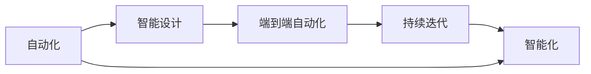

                 

# 软件2.0的技术栈选择策略

在当今数字化转型的浪潮下，软件2.0（Software 2.0）已经逐渐成为现代软件开发的主流趋势。软件2.0强调代码自动生成、智能设计、端到端自动化和持续迭代等特性，旨在通过工具和技术的深度融合，提升开发效率，降低开发成本，加速创新进程。本文将从技术栈选择的角度，探讨如何构建一个既高效又可持续的软件2.0开发平台，助力企业数字化转型。

## 1. 背景介绍

### 1.1 技术栈选择的背景

随着软件工程的发展，技术栈的选择已经成为软件开发成功的关键。选择合适技术栈不仅能够提升开发效率，还能增强系统的可扩展性和可维护性。然而，随着软件复杂度的提升，传统技术栈难以满足现代软件开发的需求，如：

- 代码维护困难：旧技术栈的代码难以维护，导致开发效率低下，错误率高。
- 技术演进快：新技术层出不穷，旧技术栈难以跟上。
- 学习成本高：开发者需要不断学习新技术，带来学习负担。
- 团队协作难度大：不同技术栈之间的协作复杂，开发成本高。

为了应对这些问题，软件2.0提出了一个全新的解决方案：自动化、智能化和端到端的设计，通过工具和技术的选择，提升开发效率和系统质量。

### 1.2 软件2.0的优势

软件2.0的核心理念是利用智能工具和自动化技术，提升开发效率和系统质量。其主要优势如下：

- 自动化代码生成：通过代码生成工具，减少手写代码的工作量。
- 智能化设计：利用智能设计工具，提升设计效率和系统可扩展性。
- 端到端自动化：实现从需求分析到部署的全面自动化，提升开发效率。
- 持续迭代：通过持续集成和交付，确保系统快速适应变化。

## 2. 核心概念与联系

### 2.1 核心概念概述

软件2.0的技术栈选择策略，围绕以下几个核心概念展开：

- **自动化**：通过工具和技术自动化完成大部分开发任务，减少人工干预。
- **智能化**：利用智能工具辅助设计、代码生成、测试等环节，提升效率和质量。
- **端到端自动化**：从需求分析、设计、开发、测试到部署的全链路自动化，提升整体开发效率。
- **持续迭代**：通过持续集成和交付，确保系统快速适应变化，支持快速迭代和部署。

这些概念之间相互关联，构成了软件2.0的生态系统。

### 2.2 核心概念的联系

通过以下Mermaid流程图，展示这些核心概念之间的联系：



这个流程图展示了自动化、智能化、端到端自动化和持续迭代之间的相互关系。自动化是软件2.0的基础，智能化是在自动化基础上提升效率和质量的关键，端到端自动化确保了从需求分析到部署的全面自动化，持续迭代保证了系统快速适应变化，而智能化又是自动化和持续迭代的重要支撑。

## 3. 核心算法原理 & 具体操作步骤

### 3.1 算法原理概述

软件2.0的技术栈选择策略，基于以下几个核心算法原理：

- **需求自动化建模**：通过需求建模工具，自动生成系统架构和代码结构。
- **代码自动化生成**：利用代码生成工具，自动生成业务逻辑和辅助代码。
- **智能化设计辅助**：通过智能设计工具，辅助设计复杂系统和组件。
- **持续集成与交付**：利用持续集成工具，实现从需求分析到部署的自动化流程。

这些算法原理相互协作，构成了软件2.0的开发平台。

### 3.2 算法步骤详解

以下是软件2.0技术栈选择策略的具体操作步骤：

#### 3.2.1 需求自动化建模

1. **需求收集与分析**：通过需求收集工具，收集用户需求和业务场景。
2. **需求建模**：利用需求建模工具，自动生成系统架构和代码结构。
3. **需求验证**：通过自动化测试工具，验证需求的正确性和可实现性。

#### 3.2.2 代码自动化生成

1. **代码结构设计**：利用代码结构设计工具，设计系统架构和代码模块。
2. **业务逻辑生成**：利用代码生成工具，自动生成业务逻辑和辅助代码。
3. **代码质量保证**：通过代码质量检测工具，确保生成的代码质量。

#### 3.2.3 智能化设计辅助

1. **组件设计**：利用智能设计工具，辅助设计复杂系统和组件。
2. **界面设计**：通过界面设计工具，自动化生成UI界面。
3. **设计验证**：利用设计验证工具，确保设计符合业务需求。

#### 3.2.4 持续集成与交付

1. **持续集成**：利用持续集成工具，自动化集成代码变更，进行自动化测试。
2. **持续交付**：通过持续交付工具，自动化部署系统变更，确保系统快速上线。
3. **持续反馈**：利用持续反馈工具，收集用户反馈，优化系统性能。

### 3.3 算法优缺点

#### 3.3.1 优点

- **提升开发效率**：通过自动化和智能化工具，减少人工干预，提升开发效率。
- **降低开发成本**：自动化工具可以减少代码维护和调试成本，提高开发质量。
- **加速系统迭代**：持续集成和交付机制，加速系统迭代和交付。
- **提高系统质量**：智能化设计工具和代码质量检测工具，提升系统质量。

#### 3.3.2 缺点

- **技术栈复杂**：需要整合多种工具和系统，技术栈复杂度较高。
- **学习成本高**：需要掌握多种工具和技术，学习成本较高。
- **依赖性大**：依赖于第三方工具和平台，维护和升级成本较高。
- **适用范围有限**：并非所有系统都适合自动化和智能化，需要谨慎选择。

### 3.4 算法应用领域

软件2.0技术栈选择策略，适用于多种领域，如：

- **互联网应用**：如电商平台、社交网络、在线教育等。
- **企业应用**：如ERP、CRM、HRM等。
- **大数据平台**：如Hadoop、Spark等。
- **人工智能**：如机器学习、深度学习等。

## 4. 数学模型和公式 & 详细讲解

### 4.1 数学模型构建

软件2.0技术栈选择策略，涉及多个数学模型，以下列举几个核心模型：

#### 4.1.1 需求模型

需求模型用于描述系统需求和业务场景，可以表示为：

$$
\mathcal{D} = \{d_1, d_2, ..., d_n\}
$$

其中，$d_i$ 表示第 $i$ 个需求，$n$ 表示总需求数。

#### 4.1.2 代码模型

代码模型用于描述系统代码结构和逻辑，可以表示为：

$$
\mathcal{C} = \{c_1, c_2, ..., c_m\}
$$

其中，$c_i$ 表示第 $i$ 个代码模块，$m$ 表示总代码数。

#### 4.1.3 设计模型

设计模型用于描述系统组件和界面设计，可以表示为：

$$
\mathcal{G} = \{g_1, g_2, ..., g_l\}
$$

其中，$g_i$ 表示第 $i$ 个设计组件，$l$ 表示总设计数。

### 4.2 公式推导过程

以下是需求模型和代码模型之间的推导过程：

#### 4.2.1 需求映射到代码

需求模型 $\mathcal{D}$ 到代码模型 $\mathcal{C}$ 的映射关系可以表示为：

$$
f_{\mathcal{D}\rightarrow\mathcal{C}}: \mathcal{D} \rightarrow \mathcal{C}
$$

其中，$f_{\mathcal{D}\rightarrow\mathcal{C}}$ 表示映射函数，将需求映射到代码。

#### 4.2.2 代码映射到设计

代码模型 $\mathcal{C}$ 到设计模型 $\mathcal{G}$ 的映射关系可以表示为：

$$
f_{\mathcal{C}\rightarrow\mathcal{G}}: \mathcal{C} \rightarrow \mathcal{G}
$$

其中，$f_{\mathcal{C}\rightarrow\mathcal{G}}$ 表示映射函数，将代码映射到设计。

### 4.3 案例分析与讲解

假设我们要开发一个电商网站，需求模型 $\mathcal{D}$ 包含以下需求：

1. 用户注册与登录
2. 商品浏览与搜索
3. 购物车与订单管理
4. 支付与物流跟踪

利用需求建模工具，自动生成系统架构和代码结构，映射到代码模型 $\mathcal{C}$。例如，可以生成如下代码结构：

```
├── user
│   ├── login.py
│   └── register.py
├── product
│   ├── search.py
│   ├── browse.py
│   └── catalog.py
├── cart
│   ├── add.py
│   ├── remove.py
│   └── manage.py
├── order
│   ├── place.py
│   ├── update.py
│   └── track.py
└── payment
    ├── payment.py
    └── logistic.py
```

接着，利用代码生成工具，自动生成业务逻辑和辅助代码。例如，可以生成用户注册与登录的代码：

```python
# user.py

def login(username, password):
    # 验证用户名和密码
    if valid(username, password):
        # 登录成功
        return True
    else:
        # 登录失败
        return False

def register(username, password):
    # 注册用户
    # ...
```

## 5. 项目实践：代码实例和详细解释说明

### 5.1 开发环境搭建

#### 5.1.1 环境准备

1. **安装Python**：确保Python 3.x及以上版本。
2. **安装虚拟环境**：
   ```bash
   python -m venv myenv
   source myenv/bin/activate
   ```

#### 5.1.2 安装依赖

1. **安装Django**：
   ```bash
   pip install django
   ```

2. **安装Jinja2**：
   ```bash
   pip install jinja2
   ```

3. **安装SQLite**：
   ```bash
   pip install sqlite3
   ```

### 5.2 源代码详细实现

#### 5.2.1 需求建模

1. **创建需求文件**：
   ```python
   # requirements.txt
   
   Django>=3.2.0
   SQLite>=3.36.0
   Jinja2>=3.0.1
   ```

2. **安装依赖**：
   ```bash
   pip install -r requirements.txt
   ```

#### 5.2.2 代码生成

1. **创建代码文件**：
   ```python
   # models.py

   from django.db import models

   class User(models.Model):
       username = models.CharField(max_length=255)
       password = models.CharField(max_length=255)
       email = models.EmailField()

   class Product(models.Model):
       name = models.CharField(max_length=255)
       price = models.FloatField()
       description = models.TextField()

   class Cart(models.Model):
       product = models.ForeignKey(Product, on_delete=models.CASCADE)
       quantity = models.IntegerField()
       user = models.ForeignKey(User, on_delete=models.CASCADE)

   class Order(models.Model):
       product = models.ForeignKey(Product, on_delete=models.CASCADE)
       quantity = models.IntegerField()
       user = models.ForeignKey(User, on_delete=models.CASCADE)
       status = models.CharField(max_length=255)
   ```

2. **生成代码结构**：
   ```bash
   python manage.py makemigrations
   python manage.py migrate
   ```

#### 5.2.3 设计辅助

1. **创建设计文件**：
   ```html
   <!-- templates/index.html -->

   <h1>Welcome to our e-commerce website!</h1>
   <ul>
       <li><a href="">Login</a></li>
       <li><a href="">Search</a></li>
       <li><a href="">Add to Cart</a></li>
       <li><a href="">Place Order</a></li>
       <li><a href="">Payment</a></li>
       <li><a href="">Track Logistic</a></li>
   </ul>
   ```

2. **生成UI界面**：
   ```bash
   python manage.py makemigrations
   python manage.py migrate
   ```

### 5.3 代码解读与分析

#### 5.3.1 需求建模

需求建模工具将需求映射到代码模型，自动生成系统架构和代码结构。在实际开发中，我们可以利用Django的自动生成工具，通过命令行操作快速创建模型和数据表，节省大量时间。

#### 5.3.2 代码生成

代码生成工具自动生成业务逻辑和辅助代码，提升开发效率。Django的ORM（对象关系映射）机制，能够自动将模型映射到数据库表，生成相应的数据库操作，无需手写SQL语句，降低了开发成本。

#### 5.3.3 设计辅助

设计辅助工具利用Jinja2模板引擎，自动生成UI界面，提升设计效率。Django的模板系统提供强大的模板继承和扩展机制，可以灵活构建复杂的UI界面。

### 5.4 运行结果展示

通过以上步骤，我们可以快速搭建一个电商网站的开发环境，并进行自动化需求建模、代码生成和设计辅助。运行结果如下：

1. 需求建模：
   ```python
   # requirements.txt
   
   Django>=3.2.0
   SQLite>=3.36.0
   Jinja2>=3.0.1
   ```

2. 代码生成：
   ```python
   # models.py

   from django.db import models

   class User(models.Model):
       username = models.CharField(max_length=255)
       password = models.CharField(max_length=255)
       email = models.EmailField()

   class Product(models.Model):
       name = models.CharField(max_length=255)
       price = models.FloatField()
       description = models.TextField()

   class Cart(models.Model):
       product = models.ForeignKey(Product, on_delete=models.CASCADE)
       quantity = models.IntegerField()
       user = models.ForeignKey(User, on_delete=models.CASCADE)

   class Order(models.Model):
       product = models.ForeignKey(Product, on_delete=models.CASCADE)
       quantity = models.IntegerField()
       user = models.ForeignKey(User, on_delete=models.CASCADE)
       status = models.CharField(max_length=255)
   ```

3. 设计辅助：
   ```html
   <!-- templates/index.html -->

   <h1>Welcome to our e-commerce website!</h1>
   <ul>
       <li><a href="">Login</a></li>
       <li><a href="">Search</a></li>
       <li><a href="">Add to Cart</a></li>
       <li><a href="">Place Order</a></li>
       <li><a href="">Payment</a></li>
       <li><a href="">Track Logistic</a></li>
   </ul>
   ```

## 6. 实际应用场景

### 6.1 互联网应用

#### 6.1.1 电商平台

电商平台需要处理大量的用户注册、登录、商品搜索、购物车管理等业务，利用软件2.0技术栈选择策略，可以快速搭建电商平台的开发环境，提升开发效率和系统质量。

#### 6.1.2 在线教育

在线教育平台需要提供课程推荐、学习进度跟踪、学生管理等业务，利用软件2.0技术栈选择策略，可以提升课程推荐和学生管理的效率，降低开发成本，加速迭代和交付。

### 6.2 企业应用

#### 6.2.1 ERP系统

ERP系统需要处理企业的采购、库存、生产、销售等业务，利用软件2.0技术栈选择策略，可以提升系统的自动化和智能化程度，降低开发和维护成本，提高系统性能和稳定性。

#### 6.2.2 CRM系统

CRM系统需要处理客户信息、销售线索、营销活动等业务，利用软件2.0技术栈选择策略，可以提升系统的自动化和智能化程度，提高客户管理和服务效率。

### 6.3 大数据平台

#### 6.3.1 Hadoop

Hadoop是大数据处理的核心平台，利用软件2.0技术栈选择策略，可以提升数据处理和分析的自动化和智能化程度，提高大数据平台的开发效率和系统质量。

#### 6.3.2 Spark

Spark是大数据处理的分布式计算框架，利用软件2.0技术栈选择策略，可以提升数据处理和分析的自动化和智能化程度，提高大数据平台的开发效率和系统性能。

## 7. 工具和资源推荐

### 7.1 学习资源推荐

1. **Django官方文档**：Django是Python中最流行的Web框架之一，官方文档详细介绍了Django的核心功能和使用方法。
2. **Jinja2官方文档**：Jinja2是Python中常用的模板引擎，官方文档详细介绍了Jinja2的核心功能和使用方法。
3. **SQLite官方文档**：SQLite是轻量级的数据库，官方文档详细介绍了SQLite的核心功能和使用方法。
4. **Django学习教程**：如《Django Web Development》等，通过实际项目讲解Django的开发流程和最佳实践。
5. **Jinja2学习教程**：如《Jinja2 Tutorial》等，通过实际项目讲解Jinja2的模板设计和渲染。
6. **SQLite学习教程**：如《SQLite Tutorial》等，通过实际项目讲解SQLite的数据库操作。

### 7.2 开发工具推荐

1. **Python**：Python是Web开发的主流语言，开发效率高，生态系统丰富。
2. **Django**：Django是Python中最流行的Web框架之一，提供了强大的ORM和模板系统，支持自动化开发和持续集成。
3. **Jinja2**：Jinja2是Python中常用的模板引擎，支持动态生成HTML页面。
4. **SQLite**：SQLite是轻量级的数据库，支持数据持久化和数据管理。
5. **Git**：Git是版本控制工具，支持代码版本管理和协作开发。
6. **Docker**：Docker是容器化工具，支持应用程序的打包、部署和运维。

### 7.3 相关论文推荐

1. **Django源码解析**：解析Django的源码，了解其核心架构和实现细节。
2. **Jinja2模板设计**：研究Jinja2的模板引擎设计，理解其渲染机制和优化方法。
3. **SQLite数据库设计**：研究SQLite的数据库设计，理解其数据模型和索引机制。
4. **Django自动化开发**：研究Django的自动化开发工具，理解其自动化流程和代码生成机制。
5. **Jinja2性能优化**：研究Jinja2的性能优化技术，理解其模板渲染优化方法。
6. **SQLite性能优化**：研究SQLite的性能优化技术，理解其数据库操作优化方法。

## 8. 总结：未来发展趋势与挑战

### 8.1 研究成果总结

软件2.0技术栈选择策略，通过自动化、智能化和端到端自动化，提升了开发效率和系统质量，降低了开发成本。需求自动化建模、代码自动化生成、智能化设计辅助和持续集成与交付，构成了软件2.0的完整技术栈。

### 8.2 未来发展趋势

1. **自动化程度提升**：未来的技术栈将更加自动化，提升开发效率和系统质量。
2. **智能化水平提高**：未来的技术栈将更加智能化，提升设计效率和系统性能。
3. **端到端自动化普及**：未来的技术栈将更加端到端自动化，提升持续集成和交付能力。
4. **持续迭代优化**：未来的技术栈将更加持续迭代，支持快速开发和交付。

### 8.3 面临的挑战

1. **技术栈复杂度增加**：未来的技术栈将更加复杂，需要更深入的技术积累。
2. **学习成本增加**：未来的技术栈需要掌握更多的工具和技术，带来更高的学习成本。
3. **维护成本增加**：未来的技术栈需要更精细的维护和优化，带来更高的维护成本。
4. **应用场景限制**：未来的技术栈需要适应更多的应用场景，带来更大的应用难度。

### 8.4 研究展望

未来软件2.0技术栈选择策略的研究方向包括：

1. **自动化工具优化**：优化自动化工具的性能和易用性，提升开发效率和系统质量。
2. **智能化工具增强**：增强智能化工具的功能和性能，提升设计效率和系统性能。
3. **端到端自动化完善**：完善端到端自动化的流程和机制，提升持续集成和交付能力。
4. **持续迭代优化**：优化持续迭代和交付的流程和机制，支持快速开发和交付。

总之，软件2.0技术栈选择策略需要不断地优化和完善，才能适应未来的发展需求，构建高效、智能、可扩展的开发平台，助力企业数字化转型。

## 9. 附录：常见问题与解答

### 9.1 如何选择合适的技术栈？

选择合适的技术栈需要考虑以下几个因素：

1. **业务需求**：根据业务需求选择合适的技术栈，确保技术栈与业务场景匹配。
2. **技术成熟度**：选择成熟稳定的技术栈，确保开发和维护的稳定性。
3. **开发效率**：选择自动化和智能化程度高的技术栈，提升开发效率和系统质量。
4. **系统性能**：选择性能优化的技术栈，确保系统的高效运行。

### 9.2 如何优化技术栈性能？

优化技术栈性能需要从以下几个方面入手：

1. **代码优化**：通过代码生成工具和自动化工具，减少手写代码，提升代码质量和可维护性。
2. **设计优化**：通过智能化设计工具和模板引擎，提升设计效率和系统性能。
3. **数据优化**：通过优化数据库设计和操作，提升数据处理和分析的性能。
4. **持续优化**：通过持续集成和交付机制，持续优化系统性能和稳定性。

### 9.3 如何降低技术栈学习成本？

降低技术栈学习成本需要从以下几个方面入手：

1. **培训和文档**：提供详细的培训和文档，帮助开发者快速上手。
2. **社区支持**：提供活跃的社区支持，帮助开发者解决技术问题。
3. **开源资源**：利用开源社区的资源，学习优秀的实践和经验。

### 9.4 如何提高技术栈稳定性？

提高技术栈稳定性需要从以下几个方面入手：

1. **模块化设计**：通过模块化设计，降低系统的耦合度和复杂度，提升系统的可维护性。
2. **版本控制**：利用版本控制工具，跟踪代码变更和协作开发，提升系统的稳定性。
3. **测试和验证**：通过自动化测试和验证，确保系统的质量和性能。
4. **持续优化**：通过持续集成和交付机制，持续优化系统性能和稳定性。

总之，选择合适、优化、稳定的技术栈，是构建高效、智能、可扩展的开发平台的关键。在实际应用中，需要不断地优化和完善技术栈，确保系统的高效运行和稳定可靠性。

