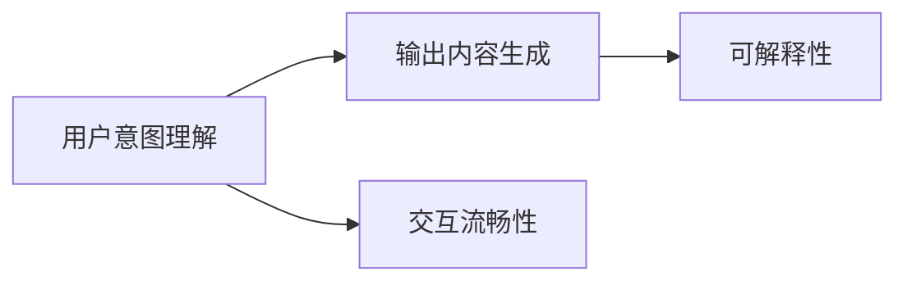

                 

# 软件2.0的用户界面设计原则

软件2.0（Software 2.0），或称为“生成式AI”（Generative AI），是当前最前沿的AI技术之一。与传统的软件1.0不同，软件2.0能够理解和执行自然语言指令，生成高质量的文本、图像、代码等。这一技术的突破源于自然语言处理（NLP）和生成式模型（如GPT-3、DALL-E等）的成熟。然而，即便有了最先进的模型，用户界面（UI）设计在软件2.0中仍占据着核心地位，决定了用户体验的优劣。本文将深入探讨软件2.0中UI设计的基本原则，结合实际案例进行分析。

## 1. 背景介绍

### 1.1 软件2.0的概念

软件2.0的概念源于德米斯·哈萨比斯（Demis Hassabis），他提出：“软件2.0将不仅是计算机指令集或源代码，而是一个具有智能的AI助手，它能够根据用户的输入生成代码、文本、图像等。”这意味着软件2.0不再只是被动的执行用户编写的指令，而是主动地理解和执行自然语言指令。

软件2.0的实现离不开大规模预训练语言模型的辅助，这些模型在大量无标签数据上进行了预训练，具备强大的语言理解和生成能力。以GPT-3为例，其参数量高达1750亿，能够处理任意长度的文本输入，并生成高质量的输出。

### 1.2 软件2.0的应用场景

软件2.0在多个领域展现出巨大潜力，以下是一些典型的应用场景：

1. **自动化代码生成**：软件2.0可以自动生成各种语言的代码，包括Python、JavaScript、SQL等。这大大提高了软件开发效率，缩短了项目周期。
2. **智能问答系统**：软件2.0可以根据用户输入的自然语言问题，自动生成答案，广泛应用于智能客服、知识图谱构建等领域。
3. **内容生成**：软件2.0能够生成新闻、报告、文章、博客等文本内容，广泛应用于新闻业、出版业等。
4. **图像生成**：软件2.0可以生成逼真的图像，应用于游戏、影视、广告等领域。
5. **视频生成**：软件2.0可以生成高质量的视频内容，应用于娱乐、教育等领域。

## 2. 核心概念与联系

### 2.1 核心概念概述

在软件2.0的开发中，UI设计是至关重要的。UI设计不仅仅是美观和易用，更是用户体验的直接体现。以下是软件2.0中UI设计需要考虑的核心概念：

1. **用户意图理解**：软件2.0需要准确理解用户输入的意图，才能提供合适的输出。因此，UI设计应注重用户输入的理解和处理。
2. **输出内容生成**：软件2.0生成的内容需要高质量、符合用户期望。UI设计应帮助用户更好地获取生成的内容。
3. **交互流畅性**：软件2.0的交互需要流畅自然，避免繁琐的输入和复杂的输出。UI设计应提高交互效率。
4. **可解释性**：软件2.0生成的内容应具有一定的可解释性，让用户明白AI的工作原理和决策依据。UI设计应提供必要的解释信息。

### 2.2 核心概念间的关系

这些核心概念之间存在着紧密的联系，形成了软件2.0中UI设计的完整框架。我们可以用以下Mermaid流程图来展示这些概念之间的关系：



这个流程图展示了软件2.0中UI设计的核心流程：首先理解用户的意图，然后生成高质量的输出，最后确保交互流畅和内容可解释。通过这些步骤，UI设计可以大大提升用户体验。

## 3. 核心算法原理 & 具体操作步骤

### 3.1 算法原理概述

软件2.0的UI设计原理涉及自然语言处理、生成模型和UI设计等多个领域。其核心思想是通过UI界面，引导用户输入自然语言指令，再通过预训练语言模型进行处理，生成合适的输出。以下是软件2.0中UI设计的主要步骤：

1. **用户输入处理**：将用户输入的自然语言指令进行分词、词性标注等预处理，转化为模型可处理的形式。
2. **模型处理**：将预处理后的输入输入到预训练语言模型中，生成对应的输出。
3. **输出展示**：将生成的输出展示给用户，并进行必要的后处理和格式调整。
4. **用户反馈**：收集用户的反馈，不断优化UI设计和模型参数。

### 3.2 算法步骤详解

**Step 1: 用户输入处理**

用户输入的处理是软件2.0中UI设计的第一步。需要考虑以下几个方面：

- **分词与词性标注**：将用户输入的文本进行分词，并标注每个词的词性。可以使用现成的分词工具如jieba、spaCy等。
- **实体识别**：识别出输入中的命名实体，如人名、地名、组织机构名等。这对于生成特定类型的输出非常有帮助。
- **意图理解**：通过情感分析、意图分类等技术，理解用户输入的意图。

**Step 2: 模型处理**

模型处理是软件2.0的核心步骤，涉及以下几个方面：

- **模型选择**：选择合适的预训练语言模型，如GPT-3、BERT等。
- **输入编码**：将预处理后的用户输入转化为模型所需的格式，通常为向量或张量。
- **模型生成**：将输入送入预训练语言模型，生成对应的输出。
- **后处理**：对生成的输出进行必要的后处理，如去噪、拼接等。

**Step 3: 输出展示**

输出展示是软件2.0中UI设计的最后一步。需要考虑以下几个方面：

- **界面布局**：设计直观、美观的界面布局，使用户能够轻松获取生成的内容。
- **内容展示**：将生成的内容展示给用户，并进行必要的格式化和排版。
- **交互设计**：设计简洁、易用的交互方式，使用户能够方便地进行下一步操作。

**Step 4: 用户反馈**

用户反馈是软件2.0中UI设计的闭环环节。需要考虑以下几个方面：

- **用户评估**：通过用户评分、问卷调查等方式，获取用户对UI设计的反馈。
- **持续优化**：根据用户反馈，不断优化UI设计和模型参数，提升用户体验。

### 3.3 算法优缺点

软件2.0中UI设计的主要优点包括：

- **高效性**：通过自然语言处理和生成模型，能够快速生成高质量的输出，提高工作效率。
- **灵活性**：能够处理各种类型的输入，适应不同的应用场景。
- **可扩展性**：可以根据需求增加或调整UI元素，提升系统的可扩展性。

主要的缺点包括：

- **依赖数据**：软件2.0需要大量高质量的数据进行预训练，数据获取和预处理成本较高。
- **模型复杂**：预训练语言模型复杂度高，需要较强的计算资源和存储资源。
- **可解释性不足**：生成的内容往往缺乏可解释性，用户难以理解AI的决策依据。

### 3.4 算法应用领域

软件2.0的UI设计在多个领域得到了广泛应用，以下是一些典型的应用领域：

1. **自动化办公**：软件2.0可以生成各种办公文档、邮件等，应用于企业自动化办公系统。
2. **内容创作**：软件2.0可以生成新闻、博客、小说等文本内容，应用于内容创作和出版。
3. **教育培训**：软件2.0可以生成教学资源、模拟考试题等，应用于在线教育平台。
4. **智能家居**：软件2.0可以生成控制指令，应用于智能家居系统，提升用户生活便利性。
5. **医疗健康**：软件2.0可以生成医疗报告、诊断建议等，应用于医疗健康领域。

## 4. 数学模型和公式 & 详细讲解 & 举例说明

### 4.1 数学模型构建

软件2.0中的UI设计可以抽象为一个数学模型，如下所示：

$$
y = f(x, \theta)
$$

其中，$x$为用户的输入文本，$\theta$为预训练语言模型的参数，$f$为UI设计算法。目标是将$x$转化为高质量的输出内容$y$，并通过UI展示给用户。

### 4.2 公式推导过程

在实际应用中，软件2.0的UI设计通常需要借助自然语言处理和生成模型。以下是一些常用的数学公式：

- **分词与词性标注**：可以使用n-gram模型进行分词，使用隐马尔可夫模型进行词性标注。
- **实体识别**：可以使用序列标注模型，如CRF、LSTM-CRF等。
- **意图理解**：可以使用情感分析模型，如LSTM-CRF、BERT等。
- **模型生成**：可以使用生成模型，如GPT-3、T5等。
- **后处理**：可以使用语言模型进行文本去噪、拼接等操作。

### 4.3 案例分析与讲解

以代码生成为例，软件2.0的UI设计过程如下：

1. **用户输入处理**：将用户输入的文本进行分词、词性标注，并提取命名实体。
2. **模型处理**：将处理后的输入输入到GPT-3中，生成对应的代码。
3. **输出展示**：将生成的代码展示给用户，并进行必要的格式化。
4. **用户反馈**：收集用户对代码的评价，优化模型参数和UI设计。

## 5. 项目实践：代码实例和详细解释说明

### 5.1 开发环境搭建

在软件2.0中，UI设计的开发通常需要使用Python、PyTorch等工具。以下是开发环境搭建的流程：

1. **安装Python和PyTorch**：在服务器上安装Python和PyTorch，确保版本兼容性。
2. **安装自然语言处理库**：安装jieba、spaCy等自然语言处理库，用于分词、词性标注等。
3. **安装生成模型库**：安装GPT-3、T5等生成模型库，用于文本生成。
4. **安装UI设计库**：安装Flask、Django等UI设计库，用于开发Web应用。

### 5.2 源代码详细实现

以下是使用Flask和GPT-3实现代码生成的Python代码：

```python
from flask import Flask, request, jsonify
from transformers import pipeline
import jieba

app = Flask(__name__)

@app.route('/generate_code', methods=['POST'])
def generate_code():
    data = request.get_json()
    text = data['text']
    tokens = jieba.cut(text)
    tokens = [word for word in tokens if word.strip()]
    model = pipeline('code-generation', model='gpt3')
    code = model(tokens)
    return jsonify(code)

if __name__ == '__main__':
    app.run()
```

代码实现如下：

1. **Flask应用**：使用Flask框架搭建Web应用。
2. **用户输入处理**：将用户输入的文本进行分词和预处理。
3. **模型处理**：使用GPT-3进行代码生成。
4. **输出展示**：将生成的代码以JSON格式返回给用户。

### 5.3 代码解读与分析

以下是代码的详细解读：

- **Flask应用**：使用Flask框架搭建Web应用，设置路由处理函数。
- **用户输入处理**：使用jieba库对用户输入的文本进行分词和预处理，提取关键词和命名实体。
- **模型处理**：使用GPT-3进行代码生成，生成对应的代码。
- **输出展示**：将生成的代码以JSON格式返回给用户，并进行必要的格式化。

### 5.4 运行结果展示

运行上述代码后，可以访问Web应用，输入自然语言指令，生成对应的代码。例如，输入“生成一个Python函数，用于计算两个数的和”，可以生成如下的Python代码：

```python
def sum_numbers(a, b):
    return a + b
```

## 6. 实际应用场景

### 6.1 自动化办公

软件2.0可以应用于自动化办公，生成各种办公文档、邮件等。以生成邮件为例，用户输入邮件内容和收件人，软件2.0可以自动生成邮件模板和内容，提升办公效率。

### 6.2 内容创作

软件2.0可以应用于内容创作，生成新闻、博客、小说等文本内容。以生成新闻为例，用户输入新闻标题和关键词，软件2.0可以自动生成新闻内容，提升内容创作效率。

### 6.3 教育培训

软件2.0可以应用于教育培训，生成教学资源、模拟考试题等。以生成考试题为例，用户输入考试主题和难度，软件2.0可以自动生成考试题，提升教育培训效果。

### 6.4 智能家居

软件2.0可以应用于智能家居，生成控制指令。以生成智能家居控制指令为例，用户输入控制指令和设备类型，软件2.0可以自动生成控制指令，提升智能家居的便捷性。

### 6.5 医疗健康

软件2.0可以应用于医疗健康，生成医疗报告、诊断建议等。以生成医疗报告为例，用户输入病人的症状和检查结果，软件2.0可以自动生成医疗报告，提升医疗健康水平。

## 7. 工具和资源推荐

### 7.1 学习资源推荐

以下是一些学习软件2.0中UI设计的资源：

1. **《自然语言处理综述》**：介绍自然语言处理的基本概念和前沿技术，帮助理解软件2.0中的核心技术。
2. **《深度学习框架PyTorch》**：介绍PyTorch框架的使用方法和实际案例，帮助开发软件2.0中的UI应用。
3. **《生成式AI的原理与实践》**：介绍生成式AI的基本原理和实践方法，帮助理解软件2.0中的技术细节。

### 7.2 开发工具推荐

以下是一些用于软件2.0中UI设计的开发工具：

1. **PyTorch**：基于Python的深度学习框架，支持自然语言处理和生成模型。
2. **Flask**：基于Python的Web框架，支持快速开发Web应用。
3. **Django**：基于Python的Web框架，支持大型Web应用的开发。

### 7.3 相关论文推荐

以下是一些关于软件2.0中UI设计的论文：

1. **《自然语言处理综述》**：介绍自然语言处理的基本概念和前沿技术，帮助理解软件2.0中的核心技术。
2. **《深度学习框架PyTorch》**：介绍PyTorch框架的使用方法和实际案例，帮助开发软件2.0中的UI应用。
3. **《生成式AI的原理与实践》**：介绍生成式AI的基本原理和实践方法，帮助理解软件2.0中的技术细节。

## 8. 总结：未来发展趋势与挑战

### 8.1 研究成果总结

软件2.0中UI设计的核心目标是提高用户体验和系统效率。通过用户意图理解、输出内容生成、交互流畅性和可解释性等设计原则，可以提升软件2.0的性能和可扩展性。目前，软件2.0在多个领域已经展现出巨大的潜力，但仍面临数据依赖、模型复杂和可解释性不足等挑战。

### 8.2 未来发展趋势

未来，软件2.0的UI设计将呈现以下几个发展趋势：

1. **自然语言交互**：软件2.0将更加注重自然语言交互，提升用户的使用体验。
2. **多模态融合**：软件2.0将融合多种模态数据，提升系统的多模态理解和生成能力。
3. **人机协作**：软件2.0将更加注重人机协作，提升系统的智能化水平。
4. **大规模数据应用**：软件2.0将应用大规模数据进行训练，提升系统的性能和泛化能力。

### 8.3 面临的挑战

软件2.0在UI设计中面临的挑战包括：

1. **数据依赖**：软件2.0需要大量高质量的数据进行预训练，数据获取和预处理成本较高。
2. **模型复杂**：预训练语言模型复杂度高，需要较强的计算资源和存储资源。
3. **可解释性不足**：生成的内容往往缺乏可解释性，用户难以理解AI的决策依据。

### 8.4 研究展望

未来，软件2.0的UI设计研究需要关注以下几个方向：

1. **无监督学习**：研究无监督学习范式，降低对标注数据的依赖。
2. **多模态融合**：研究多模态数据融合技术，提升系统的多模态理解和生成能力。
3. **人机协作**：研究人机协作技术，提升系统的智能化水平。
4. **可解释性**：研究可解释性技术，提升系统的透明度和可信度。

## 9. 附录：常见问题与解答

### Q1: 软件2.0中的UI设计有哪些核心原则？

A: 软件2.0中的UI设计核心原则包括用户意图理解、输出内容生成、交互流畅性和可解释性。用户意图理解帮助系统准确理解用户的输入，输出内容生成帮助系统生成高质量的输出，交互流畅性帮助系统提升用户体验，可解释性帮助系统提升透明度和可信度。

### Q2: 如何提高软件2.0中的UI设计性能？

A: 提高软件2.0中UI设计性能可以从以下几个方面入手：
1. 选择高效的自然语言处理和生成模型。
2. 优化模型参数和训练数据。
3. 设计直观、美观的界面布局。
4. 使用数据增强技术，提升模型的泛化能力。
5. 进行用户反馈收集和持续优化。

### Q3: 软件2.0中的UI设计面临哪些挑战？

A: 软件2.0中的UI设计面临以下挑战：
1. 数据依赖：需要大量高质量的数据进行预训练。
2. 模型复杂：预训练语言模型复杂度高，需要较强的计算资源和存储资源。
3. 可解释性不足：生成的内容往往缺乏可解释性，用户难以理解AI的决策依据。

### Q4: 软件2.0中的UI设计有哪些应用场景？

A: 软件2.0中的UI设计可以应用于多个领域，包括自动化办公、内容创作、教育培训、智能家居和医疗健康等。具体应用场景包括生成办公文档、邮件、新闻、博客、教育资源、智能家居控制指令、医疗报告和诊断建议等。

作者：禅与计算机程序设计艺术 / Zen and the Art of Computer Programming

