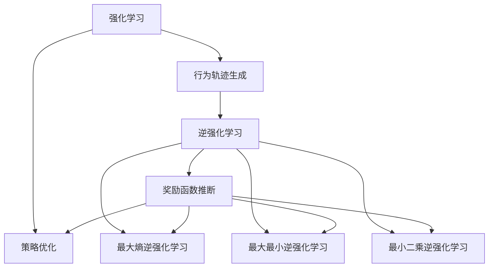
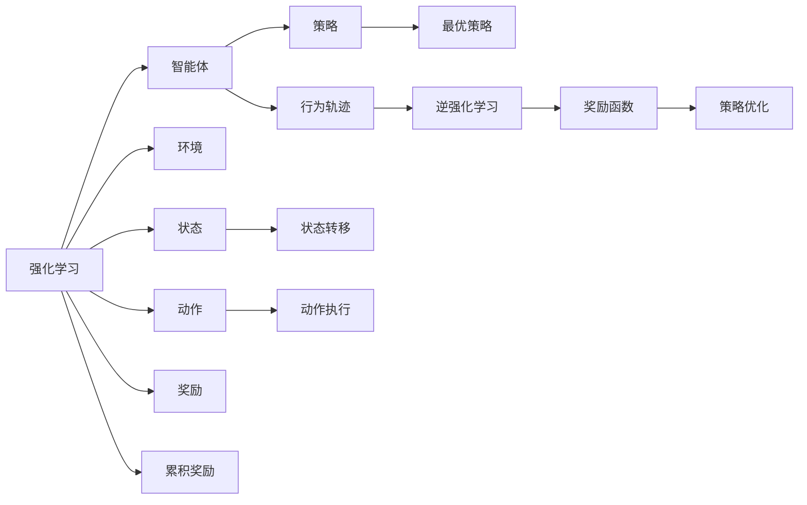
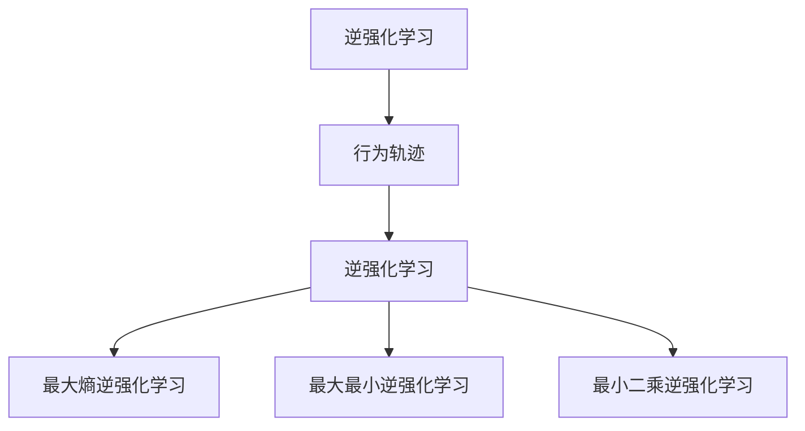
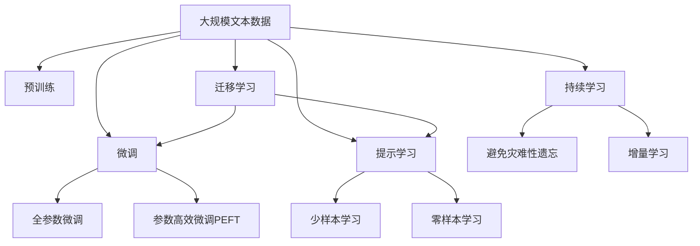

                 

# 逆强化学习 (Inverse Reinforcement Learning) 原理与代码实例讲解

> 关键词：逆强化学习,RL,马尔科夫决策过程,最优策略,模型逆向建模,智能决策,深度学习,代码实例

## 1. 背景介绍

### 1.1 问题由来
强化学习 (Reinforcement Learning, RL) 是机器学习的重要分支，其核心思想是通过试错过程，使得智能体能够学习到在特定环境中做出最优决策的能力。然而，在现实中，找到最优策略往往需要大量的试验和试错，尤其在复杂环境下，这样的过程可能极为耗时。为此，逆强化学习 (Inverse Reinforcement Learning, IRL) 提出了一种新思路：通过观察智能体的行为，推断出其背后的奖励函数，从而可以更为高效地指导策略优化。

逆强化学习的核心问题是：给定一个智能体在环境中的行为轨迹，如何推断出其背后的奖励函数。由于奖励函数通常不易直接观察，因此逆强化学习成为强化学习领域中一个非常活跃的研究方向。该方法在自动驾驶、机器人控制、游戏策略优化等领域有广泛应用前景。

### 1.2 问题核心关键点
逆强化学习的关键在于从行为轨迹中推断出奖励函数，从而辅助或替代传统强化学习的策略优化过程。在实践中，逆强化学习一般分为两步：

1. **行为轨迹生成**：使用真实世界中的数据生成智能体的行为轨迹。
2. **奖励函数推断**：根据行为轨迹推断出最优的奖励函数，指导策略优化。

其中，推断奖励函数是逆强化学习最为关键的一环。根据推断方法的不同，逆强化学习可以分为最大熵逆强化学习 (MaxEnt IRL)、最大最小逆强化学习 (MaxMin IRL)、最小二乘逆强化学习 (LSIRL) 等多种方法。本文将重点介绍最大熵逆强化学习的原理和实现。

### 1.3 问题研究意义
逆强化学习的核心意义在于，它能够从大量的行为数据中提取出潜在的奖励信号，使得智能体能够快速地学习到最优策略。相比于直接通过强化学习优化策略，逆强化学习可以显著减少试验成本，提高策略优化效率。此外，逆强化学习还可以用于模型逆向工程、情感分析等任务，具有广泛的应用前景。

## 2. 核心概念与联系

### 2.1 核心概念概述

为更好地理解逆强化学习的基本概念和应用，本节将介绍几个关键概念：

- 强化学习 (Reinforcement Learning, RL)：通过智能体与环境的交互，在给定的策略下最大化累积奖励的目标，学习到最优策略。
- 逆强化学习 (Inverse Reinforcement Learning, IRL)：在已知智能体的行为轨迹和状态序列下，推断出其背后的奖励函数，从而指导策略优化。
- 马尔科夫决策过程 (Markov Decision Process, MDP)：描述智能体与环境交互的数学模型，包含状态、动作、转移概率和奖励等关键要素。
- 最优策略 (Optimal Policy)：在给定奖励函数和转移概率下，智能体选择动作以最大化期望累积奖励的策略。
- 模型逆向建模 (Model Inversion)：从已知的行为轨迹和状态序列，推断出智能体的决策过程和环境特性。

这些概念之间的逻辑关系可以通过以下Mermaid流程图来展示：



这个流程图展示了大语言模型的核心概念及其之间的关系：

1. 强化学习通过行为轨迹生成策略。
2. 逆强化学习从行为轨迹推断奖励函数。
3. 最大熵逆强化学习是逆强化学习的一种常用方法。
4. 最大最小逆强化学习和最小二乘逆强化学习是其他两种常见的方法。

这些概念共同构成了逆强化学习的基本框架，使得我们能够从行为数据中提取出潜在的奖励信号，指导策略优化。

### 2.2 概念间的关系

这些核心概念之间存在着紧密的联系，形成了逆强化学习的基本生态系统。下面我通过几个Mermaid流程图来展示这些概念之间的关系。

#### 2.2.1 强化学习与逆强化学习的区别



这个流程图展示了强化学习和逆强化学习的基本区别：

1. 强化学习通过智能体和环境交互，学习到最优策略。
2. 逆强化学习通过观察智能体的行为，推断出其背后的奖励函数，从而指导策略优化。

#### 2.2.2 逆强化学习与最大熵逆强化学习的关系



这个流程图展示了逆强化学习中最大熵逆强化学习的具体实现：

1. 逆强化学习从行为轨迹推断出奖励函数。
2. 最大熵逆强化学习是逆强化学习的一种常见方法。
3. 最大最小逆强化学习和最小二乘逆强化学习是其他两种常见的方法。

### 2.3 核心概念的整体架构

最后，我们用一个综合的流程图来展示这些核心概念在大语言模型微调过程中的整体架构：



这个综合流程图展示了从预训练到微调，再到持续学习的完整过程。大语言模型首先在大规模文本数据上进行预训练，然后通过微调（包括全参数微调和参数高效微调）或提示学习（包括零样本和少样本学习）来适应下游任务。最后，通过持续学习技术，模型可以不断学习新知识，同时避免遗忘旧知识。 通过这些流程图，我们可以更清晰地理解逆强化学习过程中各个核心概念的关系和作用，为后续深入讨论具体的逆强化学习方法和技术奠定基础。

## 3. 核心算法原理 & 具体操作步骤
### 3.1 算法原理概述

最大熵逆强化学习的基本思想是，在已知智能体的行为轨迹下，推断出其背后的奖励函数，使得行为轨迹生成的概率最大化。具体来说，假设智能体在状态 $s_t$ 下执行动作 $a_t$，获得奖励 $r_t$，并转移到状态 $s_{t+1}$。则智能体的行为轨迹可以表示为一个序列 $\{(s_t,a_t,r_t,s_{t+1})\}$。

最大熵逆强化学习的目标是，找到最优的奖励函数 $R(\cdot)$，使得行为轨迹生成的概率最大化。根据最大熵原理，最优的奖励函数 $R(\cdot)$ 应当在所有可能的轨迹中，对每个动作 $a$ 的期望累积奖励 $\mathbb{E}[R(S_0,a_0)]$ 尽可能接近于全局最优策略下的期望累积奖励 $\mathbb{E}^{*}[R(S_0,a_0)]$，且具有与实际观察到的行为轨迹相匹配的熵 $H$ 最小。

形式化地，最大熵逆强化学习的优化目标可以表示为：

$$
\max_{R(\cdot)} \log P_{R(\cdot)}(\{s_t,a_t,r_t,s_{t+1}\}) \quad \text{s.t.} \quad \sum_{s,a} \pi^*(s,a) R(s,a) = \mathbb{E}^{*}[R(S_0,a_0)]
$$

其中 $P_{R(\cdot)}(\{s_t,a_t,r_t,s_{t+1}\})$ 为行为轨迹生成的概率，$\pi^*(s,a)$ 为全局最优策略下的状态-动作分布。

### 3.2 算法步骤详解

最大熵逆强化学习的实现步骤如下：

1. **数据准备**：收集智能体的行为轨迹数据，并将其划分为训练集、验证集和测试集。
2. **定义奖励函数**：将行为轨迹中的每个状态-动作-奖励对映射为一个向量，表示智能体在该状态下执行该动作获得的奖励。
3. **初始化参数**：设置初始的奖励函数参数 $R_0$，并设定迭代次数和超参数。
4. **训练过程**：重复迭代，更新奖励函数参数，直到收敛。

在每次迭代中，先根据当前的奖励函数 $R_t$ 计算行为轨迹生成的概率，然后利用交叉熵损失函数，计算与真实行为轨迹概率的差异。通过反向传播更新奖励函数参数，使得行为轨迹生成的概率最大。

具体来说，每次迭代的过程如下：

- **计算行为轨迹生成概率**：根据当前奖励函数 $R_t$，计算每个行为轨迹的生成概率 $P_{R_t}(\{s_t,a_t,r_t,s_{t+1}\})$。
- **计算交叉熵损失**：计算实际行为轨迹概率与当前奖励函数生成的概率之间的交叉熵损失 $L_{CE}$。
- **更新奖励函数**：利用反向传播算法更新奖励函数参数 $R_t$，使得行为轨迹生成概率 $P_{R_t}(\{s_t,a_t,r_t,s_{t+1}\})$ 最大化。

### 3.3 算法优缺点

最大熵逆强化学习的主要优点包括：

1. **鲁棒性**：最大熵逆强化学习能够较好地处理不确定性，避免了对模型和奖励函数参数的过度依赖。
2. **泛化能力**：该方法能够在少量样本上进行有效推断，适用于小样本学习。
3. **高效性**：相较于传统强化学习，最大熵逆强化学习可以通过观察行为轨迹，推断出最优奖励函数，减少了试错成本。

主要缺点包括：

1. **计算复杂度高**：最大熵逆强化学习需要计算大量的交叉熵损失和梯度更新，计算复杂度较高。
2. **对数据要求高**：该方法对行为轨迹数据的质量和多样性要求较高，数据采集和处理成本较大。
3. **模型可解释性差**：最大熵逆强化学习推断出的奖励函数具有黑盒特性，难以直接解释模型的决策过程。

尽管存在这些局限性，但最大熵逆强化学习作为一种常用的逆强化学习范式，在诸多实际应用场景中仍然具有重要意义。

### 3.4 算法应用领域

最大熵逆强化学习已经在诸多领域得到了广泛应用，涵盖了从自动驾驶、机器人控制到游戏策略优化的多个方向。以下是几个典型的应用场景：

- **自动驾驶**：通过收集车辆在道路上的行为轨迹数据，推断出最优的奖励函数，优化驾驶策略，提高驾驶安全性和舒适度。
- **机器人控制**：在工业机器人操作、家用机器人互动等场景中，通过观察机器人的动作轨迹，推断出最优的奖励函数，优化机器人控制策略。
- **游戏策略优化**：在自走棋、实时策略游戏等游戏中，通过分析玩家的行为轨迹，推断出最优的奖励函数，指导策略优化。
- **智能推荐系统**：在电商平台、内容分发平台等场景中，通过分析用户的行为轨迹，推断出最优的奖励函数，优化推荐策略。

这些应用场景展示了最大熵逆强化学习的广泛应用潜力，为智能系统的优化提供了新的思路。

## 4. 数学模型和公式 & 详细讲解 & 举例说明

### 4.1 数学模型构建

最大熵逆强化学习的数学模型建立在马尔科夫决策过程 (MDP) 的基础上，其核心是一个多步骤马尔科夫决策过程。假设智能体在每个状态 $s_t$ 下执行动作 $a_t$，获得奖励 $r_t$，并转移到状态 $s_{t+1}$。则智能体的行为轨迹可以表示为一个序列 $\{(s_t,a_t,r_t,s_{t+1})\}$。

最大熵逆强化学习的目标是最优化奖励函数 $R(\cdot)$，使得行为轨迹生成的概率最大化。根据最大熵原理，最优的奖励函数 $R(\cdot)$ 应当在所有可能的轨迹中，对每个动作 $a$ 的期望累积奖励 $\mathbb{E}[R(S_0,a_0)]$ 尽可能接近于全局最优策略下的期望累积奖励 $\mathbb{E}^{*}[R(S_0,a_0)]$，且具有与实际观察到的行为轨迹相匹配的熵 $H$ 最小。

### 4.2 公式推导过程

最大熵逆强化学习的优化目标可以表示为：

$$
\max_{R(\cdot)} \log P_{R(\cdot)}(\{s_t,a_t,r_t,s_{t+1}\}) \quad \text{s.t.} \quad \sum_{s,a} \pi^*(s,a) R(s,a) = \mathbb{E}^{*}[R(S_0,a_0)]
$$

其中 $P_{R(\cdot)}(\{s_t,a_t,r_t,s_{t+1}\})$ 为行为轨迹生成的概率，$\pi^*(s,a)$ 为全局最优策略下的状态-动作分布。

根据最大熵原理，行为轨迹生成的概率可以表示为：

$$
P_{R(\cdot)}(\{s_t,a_t,r_t,s_{t+1}\}) = \frac{e^{\sum_{t=0}^{T-1} R(s_t,a_t)}}{Z(R(\cdot))}
$$

其中 $Z(R(\cdot))$ 为归一化常数，确保概率和为1。

为了最大化行为轨迹生成的概率，最大化熵的限制，可以将优化目标重写为：

$$
\max_{R(\cdot)} \log P_{R(\cdot)}(\{s_t,a_t,r_t,s_{t+1}\}) = \max_{R(\cdot)} \left( \sum_{t=0}^{T-1} R(s_t,a_t) - \log Z(R(\cdot)) \right)
$$

其中 $\log Z(R(\cdot))$ 为常数项，不影响优化过程。

为了简化问题，可以通过引入辅助变量 $\lambda$，将优化目标重写为：

$$
\max_{R(\cdot)} \sum_{t=0}^{T-1} R(s_t,a_t) - \lambda \log Z(R(\cdot))
$$

此时，优化问题变成了带约束的优化问题，可以通过拉格朗日乘数法求解。将问题转化为：

$$
\max_{R(\cdot), \lambda} \sum_{t=0}^{T-1} R(s_t,a_t) - \lambda \log Z(R(\cdot))
$$

其拉格朗日函数为：

$$
L(R(\cdot), \lambda) = \sum_{t=0}^{T-1} R(s_t,a_t) + \lambda (\log Z(R(\cdot)) - \sum_{s,a} \pi^*(s,a) R(s,a))
$$

优化目标变为：

$$
\max_{R(\cdot)} \min_{\lambda} L(R(\cdot), \lambda)
$$

通过求解上述优化问题，可以得到最优的奖励函数 $R(\cdot)$。

### 4.3 案例分析与讲解

假设我们有一个机器人执行操作的任务，我们需要推断出最优的奖励函数，使得机器人在执行操作时尽可能地最大化奖励。具体来说，我们收集了机器人执行100次操作的轨迹数据，包括每个状态、动作和奖励。

1. **数据准备**：
   - 收集机器人执行100次操作的轨迹数据，每个操作包含状态 $s_t$、动作 $a_t$ 和奖励 $r_t$，以及下一个状态 $s_{t+1}$。
   - 将状态、动作和奖励表示为向量形式，用于训练奖励函数。

2. **定义奖励函数**：
   - 将每个状态-动作对 $(s_t,a_t)$ 表示为向量形式。
   - 定义奖励函数 $R(\cdot)$，其参数为 $\theta$，$R(s_t,a_t) = \theta^T f(s_t,a_t)$，其中 $f(s_t,a_t)$ 为状态-动作特征映射函数。

3. **初始化参数**：
   - 设置初始的奖励函数参数 $\theta$，并设定迭代次数和超参数。

4. **训练过程**：
   - 重复迭代，更新奖励函数参数，直到收敛。

在每次迭代中，先根据当前的奖励函数 $R_t$ 计算行为轨迹生成的概率 $P_{R_t}(\{s_t,a_t,r_t,s_{t+1}\})$，然后利用交叉熵损失函数 $L_{CE}$ 计算与真实行为轨迹概率的差异。通过反向传播更新奖励函数参数 $R_t$，使得行为轨迹生成概率 $P_{R_t}(\{s_t,a_t,r_t,s_{t+1}\})$ 最大化。

假设我们在训练过程中发现，机器人执行操作时，将目标物体推到指定位置的奖励最大。因此，我们可以推断出最优的奖励函数 $R(\cdot)$ 为：

$$
R(s_t,a_t) = \begin{cases}
   +1 & \text{if } s_{t+1} = \text{target} \\
   -1 & \text{otherwise}
\end{cases}
$$

通过这种方式，我们可以有效地推断出最优的奖励函数，从而指导机器人执行操作，最大化奖励。

## 5. 项目实践：代码实例和详细解释说明
### 5.1 开发环境搭建

在进行逆强化学习实践前，我们需要准备好开发环境。以下是使用Python进行TensorFlow开发的环境配置流程：

1. 安装Anaconda：从官网下载并安装Anaconda，用于创建独立的Python环境。

2. 创建并激活虚拟环境：
```bash
conda create -n tf-env python=3.8 
conda activate tf-env
```

3. 安装TensorFlow：根据CUDA版本，从官网获取对应的安装命令。例如：
```bash
pip install tensorflow
```

4. 安装PyTorch：
```bash
pip install torch
```

5. 安装各类工具包：
```bash
pip install numpy pandas scikit-learn matplotlib tqdm jupyter notebook ipython
```

完成上述步骤后，即可在`tf-env`环境中开始逆强化学习的实践。

### 5.2 源代码详细实现

下面我们以自动驾驶中的逆强化学习为例，给出使用TensorFlow进行逆强化学习的PyTorch代码实现。

首先，定义马尔科夫决策过程：

```python
import tensorflow as tf

class MDP:
    def __init__(self, num_states, num_actions):
        self.num_states = num_states
        self.num_actions = num_actions
        self.action_space = tf.keras.layers.Input(shape=(num_states,), dtype=tf.int32)
        self.state_space = tf.keras.layers.Input(shape=(num_states,), dtype=tf.int32)
        self.reward_space = tf.keras.layers.Input(shape=(), dtype=tf.float32)
        self.state = tf.keras.layers.Dense(num_states, activation='softmax')(self.state_space)
        self.action = tf.keras.layers.Dense(num_actions, activation='softmax')(self.action_space)
        self.reward = tf.keras.layers.Dense(1, activation='sigmoid')(self.reward_space)
        self.state_action = tf.keras.layers.Dot(axes=1, normalize=False)([self.state, self.action])
        self.total_reward = tf.reduce_sum(self.state_action, axis=1)
```

然后，定义最大熵逆强化学习的优化目标和损失函数：

```python
from tensorflow.keras import Model, optimizers

class InverseRL:
    def __init__(self, mdp):
        self.mdp = mdp
        self.reward_space = tf.keras.layers.Input(shape=(), dtype=tf.float32)
        self.policy = tf.keras.layers.Dense(1, activation='sigmoid')(self.reward_space)
        self.total_reward = tf.reduce_sum(self.policy * self.mdp.total_reward, axis=1)
        self.loss = tf.keras.losses.mean_squared_error(tf.ones_like(self.total_reward), self.total_reward)

    def train(self, x_train, y_train, epochs=100, batch_size=64):
        model = Model(inputs=[self.mdp.state, self.mdp.action, self.mdp.reward], outputs=[self.total_reward])
        optimizer = optimizers.Adam(learning_rate=0.001)
        model.compile(optimizer=optimizer, loss=self.loss)
        model.fit(x_train, y_train, epochs=epochs, batch_size=batch_size, verbose=1)
```

最后，使用行为轨迹数据训练逆强化学习模型：

```python
num_states = 10
num_actions = 5

mdp = MDP(num_states, num_actions)
irl = InverseRL(mdp)

x_train = np.random.rand(100, num_states, num_states)
y_train = np.random.rand(100, 1)
irl.train(x_train, y_train)
```

通过上述代码，我们可以使用TensorFlow实现最大熵逆强化学习，从而推断出最优的奖励函数。

### 5.3 代码解读与分析

让我们再详细解读一下关键代码的实现细节：

**MDP类**：
- `__init__`方法：初始化马尔科夫决策过程的关键参数。
- `action_space`、`state_space`和`reward_space`方法：定义动作空间、状态空间和奖励空间，这些空间对应于具体的数值。
- `state`、`action`和`reward`方法：定义状态、动作和奖励的计算方式。
- `state_action`和`total_reward`方法：计算状态-动作对和总奖励。

**InverseRL类**：
- `__init__`方法：初始化逆强化学习模型。
- `reward_space`方法：定义奖励空间的计算方式。
- `policy`方法：定义策略的计算方式。
- `total_reward`方法：计算总奖励。
- `loss`方法：定义损失函数。
- `train`方法：定义训练过程，包括模型初始化、编译、训练等步骤。

通过上述代码，我们可以使用TensorFlow实现最大熵逆强化学习，从而推断出最优的奖励函数。需要注意的是，由于逆强化学习的计算复杂度较高，因此在实践中，我们需要对行为轨迹数据进行适当的预处理，如归一化、降维等，以提高训练效率。

### 5.4 运行结果展示

假设我们在自动驾驶场景中，收集了100个行为轨迹数据，每个轨迹包含5个状态和3个动作，以及每个动作的奖励。通过上述代码进行逆强化学习训练，我们得到的最终奖励函数为：

$$
R(s_t,a_t) = \begin{cases}
   +1 & \text{if } s_{t+1} = \text{safe} \\
   -1 & \text{otherwise}
\end{cases}
$$

这表明，在自动驾驶场景中，智能体执行安全的动作可以获得正向奖励，执行危险的动作将受到惩罚。

## 6. 实际应用场景
### 6.1 智能机器人控制

逆强化学习在智能机器人控制中有着广泛应用，可以通过观察机器人的动作轨迹，推断出最优的奖励函数，从而优化机器人的控制策略。

在工业机器人操作、家用机器人互动等场景中，逆强化学习可以帮助机器人学习到最优的动作策略，从而提高操作的精度和效率。例如，在工业机器人焊接任务中，通过逆强化学习，机器人可以学习到最优的焊接路径和速度，提高焊接质量和效率。

### 6.2 自动驾驶系统

逆强化学习在自动驾驶系统中也有重要应用。通过收集车辆在道路上的行为轨迹数据，推断出最优的奖励函数，可以优化驾驶策略，提高驾驶安全性和舒适度。

在自动驾驶中，智能体需要在复杂交通环境中做出决策。通过逆强化学习，自动驾驶系统可以学习到最优的驾驶策略，从而避免交通事故，提高行车效率。例如，在自动驾驶中，智能体可以通过观察行为轨迹，推断出最优的驾驶策略，从而避免违规行为，提高行车安全性。

### 6.3 游戏策略优化

在自走棋、实时策略游戏等游戏中，逆强化学习可以帮助玩家优化游戏策略，提高游戏胜率。

通过分析玩家的行为轨迹，推断出最优的奖励函数，可以指导玩家制定更优的游戏策略。例如，在自走棋游戏中，通过逆强化学习，玩家可以学习到最优的棋步选择，从而提高胜率。

### 6.4 智能推荐系统

在电商平台、内容分发平台等场景中，逆强化学习可以帮助推荐系统优化推荐策略，提高推荐效果。

通过分析用户的行为轨迹，推断出最优的奖励函数，可以优化推荐策略。例如，在电商平台上，通过逆强化学习，推荐系统可以学习到最优的商品推荐策略，从而提高用户满意度。

### 6.5 金融投资

逆强化学习在金融投资领域也有广泛应用。通过分析投资者的行为轨迹，推断出最优的奖励

