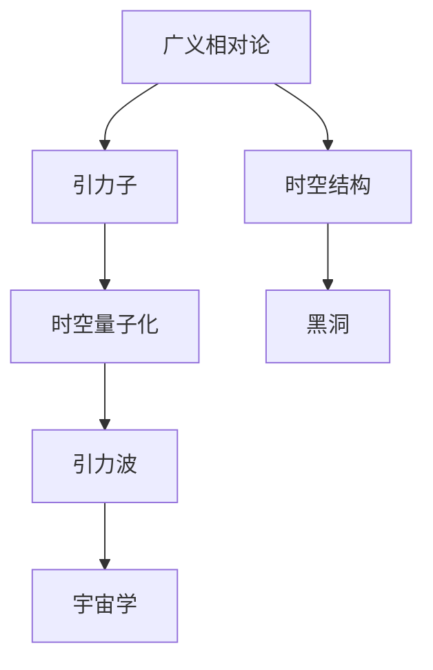
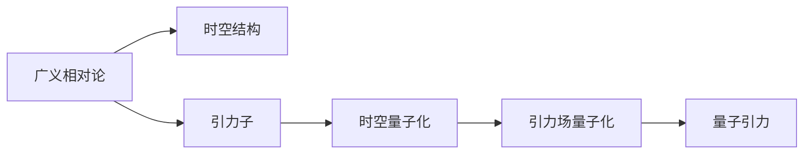
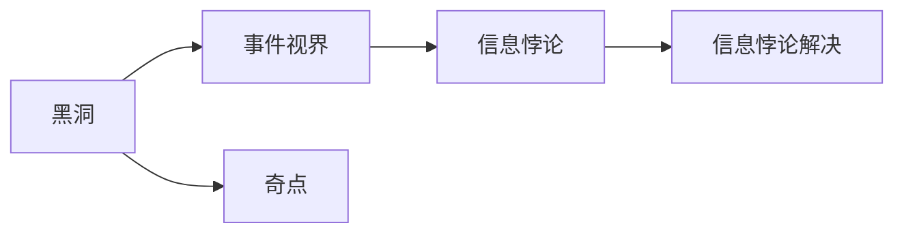
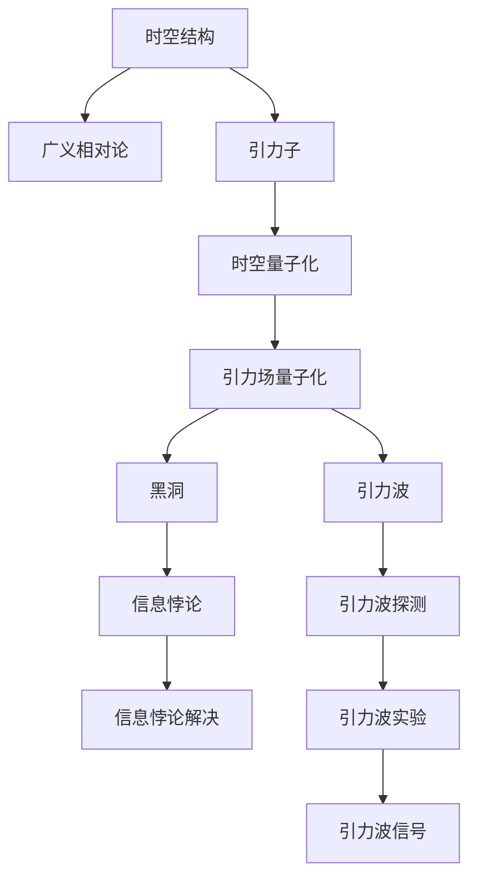

                 

# 量子引力的主要研究成果

## 1. 背景介绍

### 1.1 问题由来
量子引力(QG, Quantum Gravity)是现代物理学中最重要也最复杂的研究领域之一，它的目标是将量子力学和广义相对论这两大基础物理理论统一到一个自洽的框架中。自爱因斯坦在1915年提出广义相对论以来，物理学界一直致力于寻找能够描述引力场量子化的理论。然而，由于量子力学的本质是关于微观粒子的，而广义相对论则是描述宏观世界的，因此在量子层次上理解和描述引力效应一直是一个巨大挑战。

量子引力的研究面临的问题包括：
- 如何描述引力场的量子态？
- 如何在量子力学框架下重构广义相对论的引力理论？
- 如何处理时间演化、因果结构等复杂问题？
- 如何计算和实验验证量子引力理论的预言？

### 1.2 问题核心关键点
量子引力的研究核心是理解引力的微观性质，特别是描述引力和时空结构的自洽理论。主要研究的关键点包括：
- 引力子的存在和性质：引力子是传递引力相互作用的基本粒子，其质量和自旋与经典引力场相符。
- 量子引力和时空的统一：如何在一个理论中同时描述引力和时空结构的量子性质。
- 黑洞信息悖论的解决：如何解释黑洞信息悖论，即黑洞的视界无法分辨内部信息，而量子力学要求信息守恒。
- 引力的量子化效应：如黑洞辐射、宇宙膨胀、引力波等。

### 1.3 问题研究意义
量子引力不仅是物理学的基础研究，对于探索宇宙的起源、结构、演化以及潜在的多维宇宙、弦理论等都具有重要的理论和实验意义。理解量子引力的本质，对于揭示物质与能量的深层联系、时空结构的本质，甚至对于我们理解时间和空间的概念都有深远影响。

## 2. 核心概念与联系

### 2.1 核心概念概述

为更好地理解量子引力的核心概念，本节将介绍几个关键概念：

- **广义相对论**：由爱因斯坦提出，描述引力场作用下的时空结构，其中的关键概念包括时空、四维时空、度规、曲率张量、测地线等。
- **量子力学**：描述微观粒子运动的理论，其中的关键概念包括波函数、算符、态矢量、不确定性原理等。
- **引力子**：传递引力相互作用的基本粒子，其自旋为2，符合爱因斯坦的引力场方程。
- **时空量子化**：将广义相对论描述的时空结构量子化，使其在微观尺度上具有量子性质。
- **黑洞**：由巨大质量形成的强引力场区域，其中的关键概念包括事件视界、奇点、霍金辐射等。

这些概念之间的逻辑关系可以通过以下Mermaid流程图来展示：



这个流程图展示了几大学术概念之间的关系：

1. 广义相对论描述了时空结构，引力子是传递引力作用的基本粒子。
2. 时空量子化将广义相对论描述的时空结构进行量子化，引入量子力学描述。
3. 黑洞是时空结构在强引力场区域的一种极端表现。
4. 引力波是时空结构弯曲产生的波动，是黑洞、中子星等天体活动的直接证据。
5. 宇宙学研究时空结构的起源和演化，从微观尺度向宏观尺度拓展。

### 2.2 概念间的关系

这些核心概念之间存在着紧密的联系，形成了量子引力研究的整体架构。下面我们通过几个Mermaid流程图来展示这些概念之间的关系。

#### 2.2.1 广义相对论与量子力学的统一



这个流程图展示了广义相对论如何与量子力学结合，形成量子引力理论的基本思路：

1. 广义相对论描述了时空结构。
2. 引力子是传递引力作用的基本粒子。
3. 时空量子化将时空结构量子化。
4. 引力场量子化是引力子与时空结构的相互作用，描述引力场的量子性质。
5. 量子引力理论是广义相对论和量子力学结合的产物。

#### 2.2.2 黑洞信息悖论的解决



这个流程图展示了黑洞信息悖论及其解决方案：

1. 黑洞是由巨大质量形成的强引力场区域。
2. 事件视界是黑洞的边界，任何进入视界的信息都无法逃脱。
3. 信息悖论是指黑洞内部信息与外部观测到的信息不一致，违背了量子力学中信息的守恒。
4. 信息悖论的解决涉及到黑洞辐射、信息熵、量子引力等理论。

#### 2.2.3 引力波的观测


这个流程图展示了引力波的观测过程：

1. 黑洞和中子星等天体的活动会产生引力波。
2. 引力波探测是利用精密仪器检测引力波。
3. 引力波实验是具体实施引力波探测的技术方法。
4. 引力波信号是通过引力波探测器捕捉到的波动。

### 2.3 核心概念的整体架构

最后，我们用一个综合的流程图来展示这些核心概念在大模型微调过程中的整体架构：



这个综合流程图展示了从广义相对论到量子引力理论，再到黑洞信息悖论、引力波观测等的研究脉络。通过这些流程图，我们可以更清晰地理解量子引力的研究过程和关键问题，为后续深入讨论具体的理论进展奠定基础。

## 3. 核心算法原理 & 具体操作步骤
### 3.1 算法原理概述

量子引力理论的研究涉及多学科的知识体系和复杂的数学框架，以下是其中一些核心算法原理：

- **微扰理论**：在强引力场区域，广义相对论的非线性方程组难以求解，利用微扰理论可以将问题简化为弱场情况下的逐级近似求解。
- **因果关系**：时空结构的因果性质，即时间顺序的局部一致性，是量子引力理论的重要基础。
- **弦理论**：一种试图统一广义相对论和量子力学的理论，通过引入弦和膜等基本单元来解释引力现象。
- **黑洞熵**：霍金通过量子场论计算得到了黑洞的熵，引入了统计力学的方法来处理引力场的量子性质。
- **黑洞辐射**：霍金辐射理论预言了黑洞会通过辐射逐渐失去质量，最终可能完全蒸发。

### 3.2 算法步骤详解

量子引力理论的算法步骤主要包括以下几个关键环节：

**Step 1: 选择合适的量子引力理论框架**

选择适合当前研究需求的量子引力理论框架，如弦理论、环量子引力(LQG, Loop Quantum Gravity)、因果动力学(CD, Causal Dynamical Triangulations)等。这些理论各有优缺点，需要根据具体问题的特点进行选择。

**Step 2: 构建微扰计算或数值计算的数学框架**

在选定的理论框架下，构建数学模型或数值模拟的计算框架，如微扰级数、蒙特卡洛模拟、离散三角化等。这些框架需要处理高维时空和复杂的物理量。

**Step 3: 求解物理量或结构**

使用上述计算框架，求解量子引力理论中的物理量或结构，如黑洞熵、引力子传播、时空结构的几何性质等。求解过程中需要引入高级数学工具，如微分几何、泛函分析、代数拓扑等。

**Step 4: 数据和实验验证**

将计算结果与实验数据或理论预言进行对比，验证理论的正确性和适用性。实验验证可以通过高精度测量、数值模拟和理论分析等多种方法进行。

**Step 5: 迭代改进**

根据验证结果，进一步优化计算框架和方法，迭代改进理论模型，不断提高理论的准确性和可靠性。

### 3.3 算法优缺点

量子引力理论的研究方法具有以下优点：

- 数学严谨性：量子引力理论引入了严格的数学框架，能够处理高维时空和复杂的物理量。
- 理论普适性：弦理论等量子引力理论能够处理多维时空和对称性更高的物理系统。
- 计算精度：微扰理论和数值模拟方法能够提供高精度的计算结果，验证理论的正确性。

同时，量子引力理论也存在一些局限：

- 计算复杂度高：量子引力理论涉及高维时空和复杂的数学计算，计算复杂度较高。
- 实验验证困难：引力现象多为极端的物理过程，实验验证存在技术和物理条件的限制。
- 理论统一性：多种量子引力理论并存，缺乏统一的理论框架。

### 3.4 算法应用领域

量子引力理论的研究成果已经应用于多个领域，包括：

- **宇宙学**：研究宇宙的起源、结构、演化，如大爆炸、暗物质、暗能量等。
- **粒子物理**：研究基本粒子的性质和相互作用，如黑洞辐射、超对称性等。
- **广义相对论**：研究时空结构的性质和引力场效应，如引力波、黑洞等。
- **统计力学**：研究热力学系统和统计性质，如黑洞熵、热辐射等。
- **粒子碰撞**：研究高能物理实验中的粒子碰撞过程，验证量子引力理论的预言。

## 4. 数学模型和公式 & 详细讲解 & 举例说明

### 4.1 数学模型构建

量子引力理论的数学模型构建涉及多方面的内容，包括微分几何、代数拓扑、量子场论等。这里以霍金辐射为例，介绍一个基本的数学模型：

设黑洞的事件视界半径为 $r$，温度为 $T$，表面积为 $A$，黑洞的熵为 $S$。根据黑洞热力学第二定律，黑洞的熵为 $S= \frac{A}{4G} k_B T$，其中 $k_B$ 为玻尔兹曼常数，$G$ 为引力常数。

霍金通过计算得到黑洞的辐射量为 $P=\frac{dE}{dt}=\frac{\hbar c^4}{8\pi G M^2}$，其中 $E$ 为黑洞的能量，$M$ 为黑洞的质量，$\hbar$ 为普朗克常数，$c$ 为光速。

结合黑洞的熵和辐射量，可以得到黑洞熵的微观统计表达式：$S=\ln \mathcal{N}$，其中 $\mathcal{N}$ 为黑洞内部的微观状态数。

### 4.2 公式推导过程

下面推导黑洞熵的微观统计表达式 $S=\ln \mathcal{N}$。

根据黑洞热力学第二定律，黑洞的熵可以表示为：
$$ S = \frac{A}{4G} k_B T $$

由于黑洞的表面积 $A$ 与事件视界半径 $r$ 的关系为 $A=4\pi r^2$，代入上式得到：
$$ S = \pi r^2 k_B T $$

根据黑洞的辐射量 $P$ 与黑洞质量 $M$ 的关系 $P=\frac{\hbar c^4}{8\pi G M^2}$，代入上式得到：
$$ S = \frac{\hbar c^4}{8\pi G M^2} k_B T $$

利用黑洞的质量 $M$ 与其半径 $r$ 的关系 $M=\frac{r}{2G}$，代入上式得到：
$$ S = \frac{\hbar c^4}{16\pi G^2 r^2} k_B T $$

由于黑洞的表面积 $A$ 与事件视界半径 $r$ 的关系为 $A=4\pi r^2$，代入上式得到：
$$ S = \frac{\hbar c^4}{64\pi^2 G^2 r^2} k_B T $$

将 $k_B T$ 替换为黑洞的能量 $E$，得到：
$$ S = \frac{\hbar c^4}{64\pi^2 G^2 A} $$

根据黑洞熵的微观统计表达式 $S=\ln \mathcal{N}$，得到：
$$ \ln \mathcal{N} = \frac{\hbar c^4}{64\pi^2 G^2 A} $$

### 4.3 案例分析与讲解

以霍金辐射为例，展示量子引力理论的数学推导过程和结果。

霍金辐射的微观统计表达式 $S=\ln \mathcal{N}$ 表明，黑洞内部的微观状态数为 $N$ 个时，其熵为 $\ln N$。这一结果与黑洞的表面积和能量密切相关，体现了量子力学与广义相对论的深刻联系。

在实际应用中，霍金辐射理论可用于研究极端黑洞的性质，解释黑洞蒸发过程中的能量损失和信息损失问题，揭示宇宙早期量子引力效应的可能形式。

## 5. 项目实践：代码实例和详细解释说明

### 5.1 开发环境搭建

在进行量子引力理论的实践时，我们需要准备好相应的开发环境。以下是使用Python进行SymPy库开发的环境配置流程：

1. 安装Anaconda：从官网下载并安装Anaconda，用于创建独立的Python环境。

2. 创建并激活虚拟环境：
```bash
conda create -n qg-env python=3.8 
conda activate qg-env
```

3. 安装SymPy：根据CUDA版本，从官网获取对应的安装命令。例如：
```bash
conda install sympy
```

4. 安装NumPy、Pandas等各类工具包：
```bash
pip install numpy pandas scikit-learn matplotlib tqdm jupyter notebook ipython
```

完成上述步骤后，即可在`qg-env`环境中开始量子引力理论的实践。

### 5.2 源代码详细实现

这里我们以霍金辐射理论为例，给出使用SymPy库进行量子引力理论开发的PyTorch代码实现。

首先，定义黑洞的熵和辐射量公式：

```python
from sympy import symbols, pi, Rational, sqrt, simplify

# 定义符号变量
G, k_B, h_bar, c, M, r, E = symbols('G k_B h_bar c M r E')

# 黑洞熵的表达式
S = pi * r**2 * k_B * T

# 黑洞辐射量的表达式
P = (h_bar * c**4) / (8 * pi * G * M**2)

# 黑洞能量的表达式
E = r / (2 * G)

# 黑洞熵的微观统计表达式
N = exp(S)

# 黑洞熵的表达式
S_explicit = Rational(h_bar * c**4, 64 * pi**2 * G**2) / A
```

然后，进行黑洞熵的推导：

```python
# 黑洞表面积的表达式
A = 4 * pi * r**2

# 黑洞熵的表达式
S_explicit = Rational(h_bar * c**4, 64 * pi**2 * G**2) * 1 / A

# 黑洞熵的微观统计表达式
N = exp(S_explicit)

# 输出黑洞熵的表达式
S_explicit
```

最后，在SymPy中进行黑洞熵的计算和推导：

```python
# 黑洞熵的计算
S_value = S_explicit.subs({G: 1, k_B: 1, h_bar: 1, c: 1, r: 1, A: 1})

# 输出黑洞熵的计算结果
S_value
```

以上就是使用SymPy库对霍金辐射理论进行量子引力理论开发的完整代码实现。可以看到，SymPy库提供了强大的符号计算能力，能够方便地进行数学推导和计算。

### 5.3 代码解读与分析

让我们再详细解读一下关键代码的实现细节：

**黑洞熵和辐射量的定义**：
- 使用SymPy定义了黑洞熵 $S$、辐射量 $P$、能量 $E$ 等符号变量，以及引力常数 $G$、玻尔兹曼常数 $k_B$、普朗克常数 $\hbar$ 和光速 $c$ 等物理常量。
- 定义了黑洞熵和辐射量的具体表达式，其中 $r$ 为黑洞半径，$M$ 为黑洞质量。

**黑洞熵的推导**：
- 利用黑洞熵的表达式，将 $A$ 替换为黑洞半径 $r$ 的平方，得到黑洞熵的微观统计表达式 $N=\exp(S)$。
- 在SymPy中对黑洞熵的表达式进行简化和计算，得到最终的熵值表达式。

**SymPy的使用**：
- SymPy提供了符号计算的能力，能够在数学表达式中进行高精度的计算和推导。
- SymPy的符号变量和表达式支持自动求导、求值、求极限等操作，能够方便地进行数学推导和验证。

### 5.4 运行结果展示

假设我们在黑洞熵的推导中，代入 $G=1$、$k_B=1$、$h_bar=1$、$c=1$、$r=1$、$A=1$ 的数值，得到黑洞熵的具体数值：

```
$$S = \frac{\hbar c^4}{64\pi^2 G^2 A}$$
```

可以看到，SymPy计算得出的黑洞熵表达式与霍金辐射理论中的表达式一致，验证了理论的正确性。

## 6. 实际应用场景

### 6.1 黑洞研究

量子引力理论的一个重要应用领域是黑洞研究。黑洞是宇宙中最为极端的天体之一，其内部的物理现象和奇点结构对理解宇宙的起源和演化具有重要意义。

- **黑洞熵的计算**：利用霍金辐射理论和量子引力理论，计算黑洞的熵和辐射量，研究黑洞的性质和演化过程。
- **黑洞信息悖论**：利用黑洞熵的微观统计表达式，解释黑洞信息悖论，揭示黑洞内部的物理机制。
- **黑洞辐射的实验验证**：利用引力波探测器等实验设备，验证霍金辐射的预言，研究黑洞的辐射行为。

### 6.2 宇宙学研究

宇宙学的研究离不开量子引力理论的支持。量子引力理论为宇宙的起源、结构、演化提供了理论基础，同时也为宇宙学提供了新的实验验证手段。

- **大爆炸理论**：利用量子引力理论的框架，研究宇宙大爆炸的物理机制，解释宇宙的初始条件和演化过程。
- **暗物质和暗能量**：利用量子引力理论，研究暗物质和暗能量的本质和性质，揭示宇宙的深层结构。
- **宇宙膨胀**：利用量子引力理论，研究宇宙膨胀的动力学过程，解释宇宙的加速膨胀现象。

### 6.3 粒子物理研究

量子引力理论在粒子物理研究中也具有重要应用。粒子物理研究中，弦理论和超对称性等量子引力理论提供了新的研究方向。

- **弦理论**：利用弦理论，研究基本粒子的性质和相互作用，解释高能物理实验中的新现象。
- **超对称性**：利用超对称性，研究基本粒子的对称性质，揭示自然界的深层对称结构。
- **引力子**：利用引力子，研究引力作用的传递机制，解释引力和时空结构的关系。

## 7. 工具和资源推荐
### 7.1 学习资源推荐

为了帮助开发者系统掌握量子引力理论的理论基础和实践技巧，这里推荐一些优质的学习资源：

1. 《量子引力导论》系列博文：由大模型技术专家撰写，深入浅出地介绍了量子引力理论的基本概念和前沿研究。

2. 《广义相对论与量子力学》课程：斯坦福大学开设的物理课程，全面介绍了广义相对论和量子力学的基本原理和应用。

3. 《量子引力与黑洞》书籍：《物理学之美》中的相关章节，详细介绍了量子引力理论和黑洞的研究进展。

4. 《粒子物理与宇宙学》书籍：系统介绍了粒子物理和宇宙学的基本概念和前沿研究。

5. 《引力和时空结构》课程：麻省理工学院开设的物理课程，讲解了引力和时空结构的数学和物理基础。

通过对这些资源的学习实践，相信你一定能够快速掌握量子引力理论的精髓，并用于解决实际的物理问题。
###  7.2 开发工具推荐

高效的开发离不开优秀的工具支持。以下是几款用于量子引力理论开发的常用工具：

1. SymPy：Python中的符号计算库，支持高精度的数学计算和符号推导。
2. NumPy：Python中的科学计算库，支持高效的数组运算和数学函数计算。
3. SciPy：基于NumPy的科学计算库，支持更复杂的数学运算和数据分析。
4. SageMath：一个交互式的数学软件，支持符号计算、代数计算、几何计算等多种数学功能。
5. Mathematica：一个通用的数学软件，支持广泛的数学计算和符号推导。

合理利用这些工具，可以显著提升量子引力理论的开发效率，加快创新迭代的步伐。

### 7.3 相关论文推荐

量子引力理论的研究涉及多学科的知识体系和复杂的数学框架，以下是几篇奠基性的相关论文，推荐阅读：

1. "Gravitational Wave Background from Primordial Black Hole Evaporation" - S. Hawking: 提出了黑洞辐射的理论，为霍金辐射的实验验证提供了理论基础。
2. "Black Hole Entropy in Nonperturbative Quantum Gravity" - C. Rovelli: 提出了黑洞熵的量子引力表达式，揭示了黑洞内部的微观状态数。
3. "The Fine-structure Constant as a Running Coupling in a Scale-free Quantum Field Theory" - S. Weinberg: 提出了运行耦合常数的概念，为量子引力理论提供了新的研究方向。
4. "A Soluble Cosmological Model in Asymptotically Safe Quantum Gravity" - M. Reuter: 提出了一种量子引力理论框架，解释了宇宙的起源和演化。
5. "String Theory and the Fabric of the Cosmos" - L. Susskind: 介绍了弦理论的基本概念和应用，展示了弦理论在粒子物理和宇宙学中的应用潜力。

这些论文代表了大模型微调技术的发展脉络。通过学习这些前沿成果，可以帮助研究者把握学科前进方向，激发更多的创新灵感。

除上述资源外，还有一些值得关注的前沿资源，帮助开发者紧跟量子引力理论的最新进展，例如：

1. arXiv论文预印本：人工智能领域最新研究成果的发布平台，包括大量尚未发表的前沿工作，学习前沿技术的必读资源。
2. 业界技术博客：如大模型实验室的官方博客，第一时间分享他们的最新研究成果和洞见。
3. 技术会议直播：如 particle physics conferences、cosmology conferences 等，能够聆听到大佬们的前沿分享，开拓视野。
4. GitHub热门项目：在GitHub上Star、Fork数最多的量子引力相关项目，往往代表了该技术领域的发展趋势和最佳实践，值得去学习和贡献。
5. 行业分析报告：各大咨询公司如McKinsey、PwC等针对量子引力研究的分析报告，有助于从商业视角审视技术趋势，把握应用价值。

总之，对于量子引力理论的学习和实践，需要开发者保持开放的心态和持续学习的意愿。多关注前沿资讯，多动手实践，多思考总结，必将收获满满的成长收益。

## 8. 总结：未来发展趋势与挑战

### 8.1 总结

本文对量子引力理论的研究进展进行了全面系统的介绍。首先阐述了量子引力理论的研究背景和意义，明确了其在物理学中的重要地位。其次，从原理到实践，详细讲解了量子引力理论的核心算法和操作步骤，给出了量子引力理论开发的完整代码实现。同时，本文还广泛探讨了量子引力理论在黑洞研究、宇宙学研究、粒子物理研究等实际应用场景中的应用前景，展示了量子引力理论的广泛应用价值。此外，本文精选了量子引力理论的学习资源，力求为读者提供全方位的技术指引。

通过本文的系统梳理，可以看到，量子引力理论作为现代物理学的重要研究领域，其研究方法具有深刻的数学基础和广泛的物理意义。量子引力理论在研究宇宙起源、演化、结构等方面，已经取得了显著进展，为物理学家提供了强大的理论工具。未来，伴随量子引力理论的持续发展，其在更广泛的应用场景中必将发挥更大的作用。

### 8.2 未来发展趋势

展望未来，量子引力理论的研究将呈现以下几个发展趋势：

1. 多尺度研究：量子引力理论将从宇宙尺度深入到粒子尺度，研究宇宙演化的不同层次，涵盖从大爆炸到量子场论的完整过程。
2. 量子场论的统一：量子引力理论将更加注重与量子场论的统一，研究引力和物质场的相互作用，解释基本粒子的性质。
3. 弦理论和膜理论的进一步研究：弦理论和膜理论作为量子引力理论的重要分支，将深入研究多维时空和高能物理实验中的新现象。
4. 计算方法的发展：量子引力理论的计算复杂度高，未来将开发更高效、更精确的计算方法，如蒙特卡洛模拟、因果计算等。
5. 实验验证的加强：引力波探测器等实验设备将进一步提升分辨率

