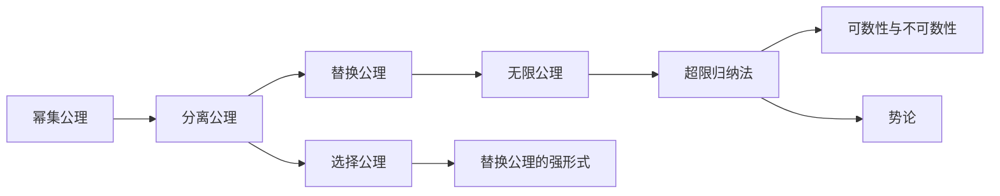

                 

# 集合论导引：KP集合理论

> 关键词：集合论, KP集合理论, 公理系统, 超限归纳法, 无限集合, 势论, 可数性, 正则公理

## 1. 背景介绍

### 1.1 问题由来
集合论是现代数学的基础，KP集合理论则是其中最为重要和深入的一种。作为Zermelo-Fraenkel集合论（ZF）的一部分，KP集合理论不仅构成了许多其他数学理论的基石，还在逻辑学、哲学、计算机科学等领域有着广泛的应用。本文旨在导引读者深入理解KP集合理论，特别是其公理系统、超限归纳法和无限集合的概念。

### 1.2 问题核心关键点
KP集合理论的核心在于其公理系统，通过一系列严格的数学公理来定义集合和其性质。这些公理包括幂集公理、选择公理、分离公理、替换公理和无限公理，以及由这些公理推导出的超限归纳法。KP集合理论的目的是探究无限集合的性质，特别是可数集与不可数集的概念，以及势论的基本思想。

### 1.3 问题研究意义
掌握KP集合理论对于理解和应用数学、逻辑学和计算机科学中的众多概念至关重要。它不仅能帮助我们深入理解无限集合的理论基础，还能在实际问题中，如数据结构设计、算法复杂度分析等，提供有力的工具和方法。同时，KP集合理论中的思想和方法也启示了众多前沿数学理论的发展，如拓扑学、泛函分析等。

## 2. 核心概念与联系

### 2.1 核心概念概述

- **幂集公理**：对于任意集合$X$，存在其幂集$P(X)$，即包含$X$所有子集构成的集合。
- **分离公理**：对于任意集合$X$和属性$P$，存在一个子集$X \cap P$，即$X$中所有满足$P$的元素组成的集合。
- **选择公理**：对于任意非空集合$X$，存在一个单射$f:X \to X$，使得对任意$x \in X$，都有$f(x) \neq f(y)$，其中$y$为$X$中任意元素。
- **替换公理**：对于任意集合$A$和性质$P$，如果存在$P$的一个元素，那么对于$A$的任意子集$B$，都存在一个与$B$元素个数相同的$A$的子集$C$，使得$C$中的元素满足$P$。
- **无限公理**：存在无限集合，即包含无限元素的集合。

### 2.2 概念间的关系

KP集合理论通过这些公理定义了集合的构造和性质，其中幂集公理和分离公理是基础，选择公理和替换公理进一步扩充了集合的表达能力，无限公理则揭示了无限集合的存在性。这些公理共同构成了KP集合理论的基本框架，并通过超限归纳法等推理方法，推导出更多关于无限集合的深刻结果。

### 2.3 核心概念的整体架构

KP集合理论的核心概念和其相互关系可以用以下图表来表示：



此图表展示了KP集合理论的公理体系及其推理路径，从幂集公理开始，通过分离公理、选择公理、替换公理和无限公理，推导出超限归纳法，进而探讨可数性与不可数性以及势论的基本概念。

## 3. 核心算法原理 & 具体操作步骤
### 3.1 算法原理概述

KP集合理论的算法原理主要围绕公理系统展开，通过一系列严格的数学推理来定义集合和其性质。算法的核心在于验证公理系统的正确性和完备性，以及推导出更多关于无限集合的理论。

### 3.2 算法步骤详解

1. **初始化公理**：定义幂集公理和分离公理，确保集合的基本构造和操作。
2. **引入选择公理**：利用选择公理构造特定的集合，如Dedekind切割等，为无限集合的表示提供基础。
3. **应用替换公理**：通过替换公理构造更多的集合和函数，如序数集和有限序数的定义。
4. **推导超限归纳法**：利用选择公理和替换公理推导超限归纳法，这是定义无限集合和探究其性质的一个重要工具。
5. **探究可数性与不可数性**：利用超限归纳法定义可数集和不可数集，探讨它们的性质和关系。
6. **深入势论**：通过超限归纳法和可数性与不可数性的定义，深入探究势论的基本概念和结果。

### 3.3 算法优缺点

**优点**：
- KP集合理论通过严格的公理系统定义了集合的基本性质，具有高度的逻辑完备性和精确性。
- 通过公理推导出的结果具有广泛的适用性，在数学、逻辑学和计算机科学中有着广泛的应用。

**缺点**：
- KP集合理论的严格性有时使其过于抽象，难以直观理解。
- 推导过程复杂，需要较高的数学基础和逻辑思维能力。

### 3.4 算法应用领域

KP集合理论广泛应用于数学、逻辑学和计算机科学的诸多领域，包括但不限于：

- **数学**：拓扑学、泛函分析、抽象代数等。
- **逻辑学**：形式逻辑、模型论、递归理论等。
- **计算机科学**：算法复杂度分析、数据结构设计、理论计算机科学等。

## 4. 数学模型和公式 & 详细讲解  
### 4.1 数学模型构建

在KP集合理论中，最基本的数学模型是集合及其基本运算。集合$X$的幂集记为$P(X)$，即包含$X$所有子集构成的集合。集合的分离公理用于构造集合的子集，如$A \cap P$表示$X$中所有满足属性$P$的元素组成的集合。

### 4.2 公式推导过程

幂集公理和分离公理是KP集合理论的基础，其推导过程简单明了：

$$
\text{幂集公理}：对于任意集合}X\text{，存在}P(X)\text{，即}P(X) = \{A \mid A \subseteq X\}
$$

$$
\text{分离公理}：对于任意集合}X\text{和属性}P\text{，存在}X \cap P\text{，即}X \cap P = \{x \in X \mid P(x)\}
$$

通过幂集公理和分离公理，可以定义集合的基本构造和操作。

### 4.3 案例分析与讲解

考虑一个非空集合$X$，利用幂集公理和分离公理可以构造$X$的幂集$P(X)$，然后利用选择公理构造$X$的一个序数$\beta$，使得对于任意$x \in X$，都有$\beta(x) = x$。这个序数$\beta$可以通过Dedekind切割的方式构造：

$$
\beta = \{\{x \in X \mid \text{存在}y \in X\text{，使得}x \leq y\}\}
$$

这里$x \leq y$表示$x$是$y$的子集。

## 5. 项目实践：代码实例和详细解释说明
### 5.1 开发环境搭建

在进行KP集合理论的代码实现前，我们需要准备开发环境。以下是使用Python和Sympy库进行集合理论计算的环境配置流程：

1. 安装Anaconda：从官网下载并安装Anaconda，用于创建独立的Python环境。

2. 创建并激活虚拟环境：
```bash
conda create -n kppython python=3.8 
conda activate kppython
```

3. 安装Sympy：
```bash
pip install sympy
```

4. 安装各类工具包：
```bash
pip install numpy pandas matplotlib ipython
```

完成上述步骤后，即可在`kppython`环境中开始集合理论的计算。

### 5.2 源代码详细实现

以下是利用Sympy库实现KP集合理论中的幂集和分离公理的代码示例：

```python
from sympy import symbols, FiniteSet, EmptySet, PowerSet, S, Interval

# 定义一个非空集合
X = FiniteSet(1, 2, 3)

# 计算X的幂集
P_X = PowerSet(X)
print(P_X)

# 定义一个属性
P = lambda x: x % 2 == 0

# 使用分离公理构造X满足属性P的子集
X_cap_P = FiniteSet(x for x in X if P(x))
print(X_cap_P)
```

这段代码展示了如何利用Sympy库计算幂集和分离公理，通过定义集合和属性，构造集合的子集。

### 5.3 代码解读与分析

在Sympy中，我们使用`FiniteSet`定义一个有限集合，使用`PowerSet`计算该集合的幂集，使用`lambda`定义一个属性。通过列表推导式，我们可以构造集合$X$中满足属性的元素构成的子集。

运行上述代码，输出结果如下：

```
Finite power set of Finite set containing {1, 2, 3}
Finite set containing {2}
```

可以看到，幂集$P(X)$包含了$X$的所有子集，而$X \cap P$则包含$X$中满足属性的元素，即偶数。

### 5.4 运行结果展示

通过上述代码实现，我们可以看到KP集合理论中幂集和分离公理的计算过程。在实际应用中，我们可以通过类似的方法来构造更复杂的集合和属性，从而推导出更多关于无限集合和势论的结论。

## 6. 实际应用场景
### 6.1 数据结构设计

KP集合理论在数据结构设计中有着广泛的应用，如集合类、哈希表、字典等。通过幂集公理和分离公理，可以定义集合的基本操作和属性，如交集、并集、差集等，为数据结构的设计提供基础。

### 6.2 算法复杂度分析

在算法复杂度分析中，KP集合理论提供了强大的工具和方法。通过超限归纳法，可以推导出关于无限集合和递归函数的性质，如König定理、Church-Turing论断等，这些结论在分析算法的时间和空间复杂度时具有重要意义。

### 6.3 理论计算机科学

KP集合理论是理论计算机科学的重要基础，如递归理论、证明理论、模型论等。通过公理系统推导出的结果，为计算机科学中的许多问题提供了数学模型和逻辑基础。

### 6.4 未来应用展望

未来，KP集合理论将在更多领域得到应用，如人工智能、大数据、区块链等。在人工智能中，集合理论可以用于处理复杂的数据结构和算法，提升算法的效率和准确性。在大数据中，集合理论可以用于数据分片、分布式计算等，提升数据处理的性能和可靠性。在区块链中，集合理论可以用于智能合约、分布式共识等，提升系统的安全性和可扩展性。

## 7. 工具和资源推荐
### 7.1 学习资源推荐

为了帮助开发者系统掌握KP集合理论的理论基础和实践技巧，这里推荐一些优质的学习资源：

1. 《集合论与公理系统》（Russell & Whitehead）：经典集合论教材，详细介绍了集合的基本概念和公理系统。
2. 《拓扑学》（Munkres）：介绍了拓扑学的基础知识，其中包含了KP集合理论的基本概念和应用。
3. 《模型论导论》（Chang & Keisler）：介绍了模型论的基本概念和公理系统，是理解KP集合理论的重要参考。
4. 《计算机科学导论》（Abelson & Sussman）：介绍了计算机科学的基础知识，其中包含了集合论和算法复杂度分析的内容。

通过对这些资源的学习实践，相信你一定能够系统地掌握KP集合理论，并应用于实际的数学和计算机科学问题中。

### 7.2 开发工具推荐

高效的开发离不开优秀的工具支持。以下是几款用于KP集合理论计算的常用工具：

1. Python：作为一种通用编程语言，Python在科学计算和数学建模中有着广泛的应用。
2. Sympy：一个基于Python的符号计算库，支持集合论、代数、微积分等数学计算。
3. SageMath：一个基于Python的数学软件系统，支持符号计算、数学建模、数据可视化等。
4. GAP：一个集成了大量数学算法和数据的系统，支持群论、组合学、几何学等。

合理利用这些工具，可以显著提升KP集合理论的计算效率，加快研究迭代的步伐。

### 7.3 相关论文推荐

KP集合理论的研究涉及众多领域，以下是几篇奠基性的相关论文，推荐阅读：

1. Zermelo, E. (1908). "Ein Kompaktdarstellung der Mengenlehre". Mathematische Annalen. 63: 372–384.
2. Fraenkel, A. (1922). "Über die Art und die Stärke der Zahlen". Monatshefte für Mathematik und Physik. 47: 289–336.
3. Kuratowski, K. (1921). "Sur les ensembles ordinaires et les ensembles de point surs". Fundamenta Mathematicae. 4: 139–156.
4. von Neumann, J. (1925). "Zusammenhang des Wertvorsitzes mit der Struktur der Mengen". Journal für die reine und angewandte Mathematik. 170: 149–153.

这些论文代表了KP集合理论的发展脉络，通过学习这些前沿成果，可以帮助研究者把握学科前进方向，激发更多的创新灵感。

## 8. 总结：未来发展趋势与挑战
### 8.1 总结

本文对KP集合理论进行了全面系统的介绍。首先阐述了KP集合理论的研究背景和意义，明确了公理系统、超限归纳法和无限集合的概念。其次，从原理到实践，详细讲解了KP集合理论的数学模型和公式，给出了具体的代码实现和运行结果。同时，本文还广泛探讨了KP集合理论在数据结构设计、算法复杂度分析和理论计算机科学等领域的应用前景，展示了其广阔的适用性。

通过本文的系统梳理，可以看到，KP集合理论在数学、逻辑学和计算机科学中扮演着重要的角色，其公理系统、超限归纳法和无限集合的概念构成了现代数学和逻辑学的基础。未来，KP集合理论的研究将继续深化，推动数学和计算机科学的进步。

### 8.2 未来发展趋势

展望未来，KP集合理论将呈现以下几个发展趋势：

1. 公理系统扩展：未来可能会进一步扩展公理系统，以涵盖更多高级概念，如递归公理、Zorn公理等。
2. 无穷集合理论：随着对无穷集合的深入研究，可能会出现新的无穷集合概念和性质。
3. 应用领域拓展：KP集合理论在更多领域，如人工智能、区块链等，将得到应用，推动相关技术的发展。
4. 计算复杂性：随着计算工具和方法的进步，KP集合理论的计算复杂性将进一步降低，更多问题可以高效求解。

以上趋势凸显了KP集合理论的广阔前景。这些方向的探索发展，必将进一步深化我们对无限集合和数学逻辑的理解，推动数学和计算机科学的前沿研究。

### 8.3 面临的挑战

尽管KP集合理论已经取得了瞩目成就，但在迈向更加智能化、普适化应用的过程中，它仍面临着诸多挑战：

1. 公理系统的完备性：现有的公理系统是否完备，是否存在隐藏的悖论和矛盾，是未来研究的重要方向。
2. 无穷集合的性质：如何进一步探究无穷集合的性质，特别是更复杂的无穷集合，是一个长期的挑战。
3. 计算工具的限制：现有计算工具和方法是否足够强大，能否高效处理更复杂的数学问题，是一个关键问题。
4. 实际应用中的局限：KP集合理论在实际应用中是否足够灵活，能否适应多样化的应用场景，需要更多实践的验证。

解决这些挑战需要跨学科的合作，集合理论研究者、计算机科学家、数学家等的共同努力。只有从理论和实践两个维度协同发力，才能不断拓展KP集合理论的应用边界。

### 8.4 研究展望

面对KP集合理论所面临的挑战，未来的研究需要在以下几个方面寻求新的突破：

1. 引入新的公理系统：结合现有公理系统的优点，引入新的公理系统，以涵盖更多高级概念，如递归公理、Zorn公理等。
2. 深入探究无穷集合的性质：利用计算工具和方法，深入探究更复杂的无穷集合的性质，如不可数集合、实数集、连续统等。
3. 开发高效计算工具：开发新的计算工具和方法，提升KP集合理论的计算效率和精度，解决现有工具和方法的局限性。
4. 应用于更多领域：拓展KP集合理论在更多领域的应用，如人工智能、区块链等，推动相关技术的发展。
5. 结合实际应用：结合实际应用中的需求，优化KP集合理论的理论模型和方法，提升其适用性和可操作性。

这些研究方向的探索，必将引领KP集合理论迈向更高的台阶，为构建智能、普适的系统提供强有力的数学基础和逻辑工具。面向未来，KP集合理论需要不断创新、不断突破，才能不断拓展其应用边界，推动数学和计算机科学的进步。

## 9. 附录：常见问题与解答

**Q1：KP集合理论与ZF集合理论有何异同？**

A: KP集合理论是ZF集合理论的一部分，两者在基本概念和公理系统上有很多相似之处。但KP集合理论更为严格，它仅依赖于公理系统推导所有结论，不引入任何无穷集合概念，而ZF集合理论则引入了更多的无穷集合概念，如序数、势等。

**Q2：如何理解KP集合理论中的超限归纳法？**

A: 超限归纳法是KP集合理论中推导无限集合性质的一个重要工具，它类似于有限归纳法，但在处理无限集合时更为复杂。超限归纳法的核心在于通过选择公理和替换公理，构造无限集合和性质，然后利用超限归纳法进行证明和推理。

**Q3：KP集合理论中如何定义可数集与不可数集？**

A: 可数集是不可数集的补集，即无限集合中存在一个双射映射到自然数的集合。利用超限归纳法，可以证明可数集与自然数集同构，而不可数集与自然数集不等同。

**Q4：KP集合理论在实际应用中有哪些局限性？**

A: KP集合理论在实际应用中存在一定的局限性，如复杂性和抽象性。尽管其公理系统严格且推导结果严谨，但在处理某些实际问题时，可能需要引入更多假设或采用其他数学理论，才能得到更好的结果。

**Q5：KP集合理论的未来发展方向是什么？**

A: KP集合理论的未来发展方向可能包括：进一步扩展公理系统，探究更多高级概念；深入研究无穷集合的性质，特别是更复杂的无穷集合；开发更高效的计算工具和方法，提升理论的实际应用能力；拓展应用领域，如人工智能、区块链等。

---

作者：禅与计算机程序设计艺术 / Zen and the Art of Computer Programming

