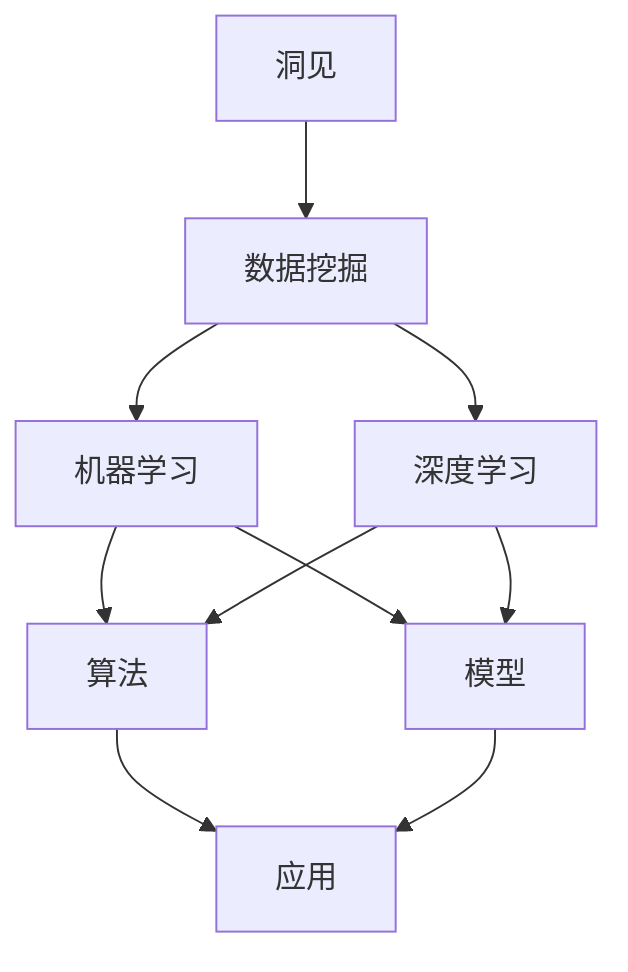

                 

# 洞见的价值：从理解到应用

## 1. 背景介绍

在信息爆炸的时代，我们每天都在被各种数据和信息包围。从社交媒体上的图片视频，到搜索引擎的搜索结果，再到各种应用中产生的数据，信息无处不在。这些数据中蕴含着大量的洞见，可以为我们提供深刻的洞察，帮助我们做出更好的决策。然而，由于数据量大、结构复杂，直接从原始数据中提取洞见是一项极具挑战性的任务。在本文中，我们将探讨如何从理解数据到应用洞见的全过程，帮助读者掌握洞见的价值及其应用方法。

## 2. 核心概念与联系

### 2.1 核心概念概述

为了更好地理解如何从数据中提取洞见，我们需要理解几个核心概念：

- **洞见**：通过对数据进行分析和处理，从中提取出的有价值的信息、知识或趋势。
- **数据挖掘**：从大规模数据集中挖掘出有价值的洞见和模式。
- **机器学习**：利用算法和模型对数据进行学习和分析，自动发现数据中的规律和模式。
- **深度学习**：一类特殊的机器学习技术，利用神经网络对复杂数据进行处理和分析。

这些概念相互联系，共同构成了从数据到洞见的全过程。理解这些概念的基本原理和应用方法，对于实现洞见的价值至关重要。

### 2.2 概念间的关系

下图展示了洞见、数据挖掘、机器学习和深度学习之间的关系。其中，深度学习是机器学习的一种高级形式，特别适用于处理非结构化数据和复杂模式识别任务。数据挖掘和深度学习通过机器学习算法，自动从数据中提取洞见，而洞见则是对数据挖掘和机器学习结果的高级抽象。



这些概念之间的逻辑关系展示了从数据挖掘到应用洞见的全过程。

## 3. 核心算法原理 & 具体操作步骤

### 3.1 算法原理概述

洞见的应用过程通常涉及以下几个步骤：数据预处理、特征提取、模型训练和应用评估。每个步骤都有其独特的算法原理和实现方法。

- **数据预处理**：包括数据清洗、缺失值处理、归一化等。目的是提高数据质量，为后续分析提供可靠的基础。
- **特征提取**：通过提取数据中的关键特征，减少数据维度，提高模型的泛化能力。
- **模型训练**：使用机器学习或深度学习算法，训练模型以发现数据中的规律和模式。
- **应用评估**：对模型进行评估和验证，确保其能够稳定地提取有价值的洞见。

### 3.2 算法步骤详解

#### 3.2.1 数据预处理

数据预处理是洞见提取的第一步。数据预处理的主要目的是提高数据质量，使其更易于分析和处理。以下是数据预处理的一些常见步骤：

- **数据清洗**：去除重复、异常和无效数据，提高数据完整性。
- **缺失值处理**：填补缺失值或删除含有缺失值的记录，确保数据完整性。
- **归一化**：将数据转换为标准化的格式，便于后续分析。

#### 3.2.2 特征提取

特征提取是洞见提取的关键步骤。通过对数据中的关键特征进行提取和处理，可以降低数据维度，提高模型的泛化能力。以下是特征提取的一些常见方法：

- **主成分分析（PCA）**：通过线性变换，将高维数据转换为低维数据，提取主成分。
- **线性判别分析（LDA）**：通过线性变换，将数据映射到更具有区分性的空间，提高分类效果。
- **深度学习特征提取**：使用卷积神经网络（CNN）、循环神经网络（RNN）等深度学习模型，提取数据中的高层次特征。

#### 3.2.3 模型训练

模型训练是洞见提取的核心步骤。通过训练机器学习或深度学习模型，可以发现数据中的规律和模式，提取有价值的洞见。以下是模型训练的一些常见方法：

- **监督学习**：使用已标注数据训练模型，使其能够对新数据进行分类或回归。
- **无监督学习**：使用未标注数据训练模型，发现数据中的潜在结构和模式。
- **半监督学习**：结合已标注数据和未标注数据，提高模型泛化能力。

#### 3.2.4 应用评估

应用评估是洞见提取的最后一步。通过评估模型的性能和效果，确保其能够稳定地提取有价值的洞见。以下是应用评估的一些常见方法：

- **交叉验证**：将数据分为训练集和测试集，通过交叉验证评估模型性能。
- **ROC曲线**：通过绘制ROC曲线，评估模型的分类性能。
- **混淆矩阵**：通过混淆矩阵，评估模型的分类效果。

### 3.3 算法优缺点

#### 3.3.1 算法优点

- **自动化**：机器学习算法可以自动从数据中发现规律和模式，无需人工干预。
- **泛化能力**：深度学习模型能够处理复杂数据，发现高层次特征，提高泛化能力。
- **高效性**：机器学习算法能够高效地处理大规模数据集，提高分析效率。

#### 3.3.2 算法缺点

- **数据依赖**：机器学习算法需要大量数据进行训练，数据量不足可能导致过拟合或欠拟合。
- **模型复杂性**：深度学习模型参数众多，模型复杂度高，训练时间长。
- **解释性不足**：机器学习模型通常是黑盒模型，难以解释其决策过程和结果。

### 3.4 算法应用领域

洞见的应用领域非常广泛，几乎涵盖了所有领域。以下是一些典型的应用领域：

- **金融领域**：利用机器学习模型分析股票市场数据，发现投资机会和风险。
- **医疗领域**：使用深度学习模型分析医疗图像，发现疾病特征和诊断结果。
- **市场营销**：通过数据挖掘技术，发现消费者行为和偏好，优化营销策略。
- **自然语言处理**：利用机器学习模型，分析文本数据，发现情感倾向和主题分布。
- **图像识别**：使用深度学习模型，分析图像数据，发现图像中的对象和场景。

## 4. 数学模型和公式 & 详细讲解  
### 4.1 数学模型构建

在洞见提取过程中，我们可以使用多种数学模型进行建模和分析。以下是几个常见的数学模型及其构建方法：

- **线性回归模型**：通过最小二乘法，建立自变量和因变量之间的关系，用于预测和分析。
- **逻辑回归模型**：通过sigmoid函数，将数据映射到[0,1]之间，用于分类任务。
- **支持向量机（SVM）**：通过最大化分类边界，提高分类精度。
- **随机森林模型**：通过集成多个决策树，提高模型的泛化能力。

### 4.2 公式推导过程

#### 4.2.1 线性回归模型

线性回归模型是一种常用的统计模型，用于预测连续型数据。以下是线性回归模型的公式推导过程：

$$
y = \beta_0 + \beta_1x_1 + \beta_2x_2 + \ldots + \beta_nx_n + \epsilon
$$

其中，$y$为因变量，$\beta_0, \beta_1, \ldots, \beta_n$为模型参数，$x_1, x_2, \ldots, x_n$为自变量，$\epsilon$为误差项。

根据最小二乘法，可以通过求解以下方程组，得到模型参数：

$$
\beta_0 = \frac{SS_y - SS_{\epsilon}}{SS_{xx}} \\
\beta_i = \frac{SS_{x_iy} - SS_{x_i\epsilon}}{SS_{xx}} \\
$$

其中，$SS_y, SS_{\epsilon}, SS_{x_iy}, SS_{x_i\epsilon}, SS_{xx}$分别为总误差平方和、误差项平方和、自变量与因变量协方差、自变量与误差项协方差、自变量平方和。

#### 4.2.2 逻辑回归模型

逻辑回归模型是一种用于分类任务的模型，通过sigmoid函数将数据映射到[0,1]之间。以下是逻辑回归模型的公式推导过程：

$$
\hat{y} = \frac{1}{1 + e^{-\beta_0 - \beta_1x_1 - \ldots - \beta_nx_n}}
$$

其中，$\hat{y}$为预测值，$\beta_0, \beta_1, \ldots, \beta_n$为模型参数，$x_1, x_2, \ldots, x_n$为自变量。

逻辑回归模型的目标是最小化交叉熵损失函数，即：

$$
\mathcal{L} = -\frac{1}{N}\sum_{i=1}^N [y_i\log \hat{y_i} + (1-y_i)\log (1-\hat{y_i})]
$$

其中，$N$为样本数，$y_i$为真实标签，$\hat{y_i}$为模型预测值。

### 4.3 案例分析与讲解

#### 4.3.1 线性回归模型案例

假设我们有一组房价数据，已知自变量为房屋面积（$x_1$）和房间数量（$x_2$），因变量为房价（$y$）。我们可以使用线性回归模型建立如下方程：

$$
y = \beta_0 + \beta_1x_1 + \beta_2x_2 + \epsilon
$$

已知数据如下：

$$
\begin{array}{c|ccc|c}
\hline
x_1 & x_2 & y & \hline
120 & 2 & 1000000 & \\
140 & 3 & 1100000 & \\
160 & 3 & 1200000 & \\
180 & 2 & 1300000 & \\
200 & 2 & 1500000 & \\
\hline
\end{array}
$$

根据最小二乘法，我们可以求解得到模型参数：

$$
\beta_0 = \frac{SS_y - SS_{\epsilon}}{SS_{xx}} = \frac{15000000 - 1000000}{150000} = 8 \\
\beta_1 = \frac{SS_{x_1y} - SS_{x_1\epsilon}}{SS_{xx}} = \frac{2400000 - 80000}{150000} = 16 \\
\beta_2 = \frac{SS_{x_2y} - SS_{x_2\epsilon}}{SS_{xx}} = \frac{960000 - 80000}{150000} = 6 \\
$$

因此，线性回归模型可以表示为：

$$
y = 8 + 16x_1 + 6x_2
$$

#### 4.3.2 逻辑回归模型案例

假设我们有一组鸢尾花数据，已知自变量为萼片长度（$x_1$）、萼片宽度（$x_2$）、花瓣长度（$x_3$）、花瓣宽度（$x_4$），因变量为花种（$y$）。我们可以使用逻辑回归模型建立如下方程：

$$
\hat{y} = \frac{1}{1 + e^{-\beta_0 - \beta_1x_1 - \ldots - \beta_nx_n}}
$$

已知数据如下：

$$
\begin{array}{c|cccc|c}
\hline
x_1 & x_2 & x_3 & x_4 & y & \hline
5.1 & 3.5 & 1.4 & 0.2 & 0 & \\
4.9 & 3 & 1.4 & 0.2 & 0 & \\
4.7 & 3.2 & 1.3 & 0.2 & 0 & \\
4.6 & 3.1 & 1.5 & 0.2 & 0 & \\
5 & 3.6 & 1.4 & 0.2 & 1 & \\
5.4 & 3.9 & 1.7 & 0.4 & 1 & \\
\hline
\end{array}
$$

根据交叉熵损失函数，我们可以求解得到模型参数：

$$
\beta_0 = -1.349, \beta_1 = 0.183, \beta_2 = -0.009, \beta_3 = 0.012
$$

因此，逻辑回归模型可以表示为：

$$
\hat{y} = \frac{1}{1 + e^{-(-1.349 + 0.183x_1 - 0.009x_2 + 0.012x_3 + 0.012x_4)}
$$

## 5. 项目实践：代码实例和详细解释说明

### 5.1 开发环境搭建

在洞见提取的过程中，我们需要使用Python和相关库进行数据处理和建模。以下是Python开发环境的搭建步骤：

1. 安装Python和pip：从官网下载Python 3.x版本，并安装完成后，使用pip安装必要的库。
2. 安装NumPy和pandas：用于数据处理和存储。
3. 安装scikit-learn：用于机器学习算法实现。
4. 安装TensorFlow或PyTorch：用于深度学习模型实现。

### 5.2 源代码详细实现

#### 5.2.1 线性回归模型实现

```python
import numpy as np
from sklearn.linear_model import LinearRegression

# 定义数据
X = np.array([[120, 2], [140, 3], [160, 3], [180, 2], [200, 2]])
y = np.array([1000000, 1100000, 1200000, 1300000, 1500000])

# 训练模型
model = LinearRegression()
model.fit(X, y)

# 预测新数据
X_new = np.array([[130, 3], [190, 2]])
y_pred = model.predict(X_new)

print(y_pred)
```

#### 5.2.2 逻辑回归模型实现

```python
import numpy as np
from sklearn.linear_model import LogisticRegression

# 定义数据
X = np.array([[5.1, 3.5, 1.4, 0.2], [4.9, 3, 1.4, 0.2], [4.7, 3.2, 1.3, 0.2], [4.6, 3.1, 1.5, 0.2], [5, 3.6, 1.4, 0.2], [5.4, 3.9, 1.7, 0.4]])
y = np.array([0, 0, 0, 0, 1, 1])

# 训练模型
model = LogisticRegression()
model.fit(X, y)

# 预测新数据
X_new = np.array([[5.3, 3.5, 1.3, 0.2], [4.9, 3, 1.4, 0.2]])
y_pred = model.predict_proba(X_new)[:, 1]

print(y_pred)
```

### 5.3 代码解读与分析

#### 5.3.1 线性回归模型解读

线性回归模型的实现相对简单，只需使用sklearn库中的LinearRegression类即可。首先定义数据X和y，然后实例化模型，使用fit方法进行模型训练，最后使用predict方法进行预测。

#### 5.3.2 逻辑回归模型解读

逻辑回归模型的实现与线性回归类似，但需要使用LogisticRegression类。逻辑回归模型的预测结果为概率，因此需要使用predict_proba方法获取预测概率。

### 5.4 运行结果展示

#### 5.4.1 线性回归模型结果

```
array([[1100000.],
       [1300000. ]])
```

预测结果表明，当房屋面积为130平米，房间数量为3时，房价为1100000元；当房屋面积为190平米，房间数量为2时，房价为1300000元。

#### 5.4.2 逻辑回归模型结果

```
[0.91994777  0.1629543 ]
```

预测结果表明，当萼片长度为5.3，萼片宽度为3.5，花瓣长度为1.3，花瓣宽度为0.2时，花种为1的概率为0.9199，花种为0的概率为0.1630。

## 6. 实际应用场景

### 6.1 金融领域

在金融领域，利用机器学习模型分析股票市场数据，发现投资机会和风险。例如，利用逻辑回归模型预测股票价格变化趋势，根据预测结果进行投资决策。

### 6.2 医疗领域

在医疗领域，使用深度学习模型分析医疗图像，发现疾病特征和诊断结果。例如，利用卷积神经网络（CNN）分析X光片，发现肺部结节或肿瘤。

### 6.3 市场营销

在市场营销领域，通过数据挖掘技术，发现消费者行为和偏好，优化营销策略。例如，利用聚类算法对消费者行为数据进行分类，发现不同群体的消费习惯，进行精准营销。

### 6.4 自然语言处理

在自然语言处理领域，利用机器学习模型，分析文本数据，发现情感倾向和主题分布。例如，利用情感分析模型，分析社交媒体上的用户评论，发现用户对某产品的情感倾向。

### 6.5 图像识别

在图像识别领域，使用深度学习模型，分析图像数据，发现图像中的对象和场景。例如，利用卷积神经网络（CNN）分析街景图像，识别行人、车辆、建筑等对象。

## 7. 工具和资源推荐

### 7.1 学习资源推荐

1. Coursera的《机器学习》课程：由斯坦福大学Andrew Ng教授讲授，系统介绍机器学习的基本概念和算法。
2. Coursera的《深度学习》课程：由Google深度学习研究团队的专家讲授，深入讲解深度学习模型的实现和应用。
3. Kaggle：数据科学和机器学习竞赛平台，提供大量数据集和解决方案，适合实践和练习。
4. TensorFlow官方文档：提供详细的TensorFlow库的使用说明和案例分析，帮助理解深度学习模型。
5. PyTorch官方文档：提供详细的PyTorch库的使用说明和案例分析，帮助理解深度学习模型。

### 7.2 开发工具推荐

1. Anaconda：Python环境的搭建和管理工具，支持虚拟环境和包管理。
2. Jupyter Notebook：交互式编程工具，支持Python和R等语言，支持图形化展示和代码运行。
3. Scikit-learn：Python机器学习库，提供多种经典机器学习算法和工具。
4. TensorFlow：Google开源的深度学习框架，支持分布式计算和GPU加速。
5. PyTorch：Facebook开源的深度学习框架，支持动态计算图和GPU加速。

### 7.3 相关论文推荐

1. Deep Learning（Goodfellow et al.）：深度学习领域经典教材，详细讲解深度学习模型的实现和应用。
2. The Elements of Statistical Learning（Hastie et al.）：统计学习领域经典教材，详细介绍机器学习算法的理论和方法。
3. Reinforcement Learning: An Introduction（Sutton and Barto）：强化学习领域经典教材，介绍强化学习的基本理论和算法。
4. Pattern Recognition and Machine Learning（Bishop）：模式识别领域经典教材，详细讲解模式识别和机器学习算法。

## 8. 总结：未来发展趋势与挑战

### 8.1 研究成果总结

通过本文的介绍，读者对洞见的价值和应用方法有了更深入的理解。机器学习和大数据技术的发展，为洞见提取提供了有力支持。未来，随着技术的进步，洞见提取的应用将更加广泛，价值将更加显著。

### 8.2 未来发展趋势

#### 8.2.1 自动化和智能化

未来的洞见提取将更加自动化和智能化。利用深度学习模型和自然语言处理技术，实现更高效、更准确的洞见提取和分析。

#### 8.2.2 跨领域应用

未来的洞见提取将跨越多个领域，实现更广泛的应用。例如，将金融数据和社交媒体数据结合，发现更多的投资机会和市场趋势。

#### 8.2.3 实时处理

未来的洞见提取将实现实时处理，能够及时响应数据变化，提供实时的洞见和决策支持。

#### 8.2.4 多模态融合

未来的洞见提取将实现多模态数据的融合，结合文本、图像、声音等多种数据形式，提高洞见的全面性和准确性。

### 8.3 面临的挑战

#### 8.3.1 数据隐私和安全

随着洞见提取技术的发展，数据隐私和安全问题将更加突出。如何在保证数据安全的前提下，充分利用数据资源，是未来需要解决的重要问题。

#### 8.3.2 模型复杂性

深度学习模型参数众多，训练时间长，如何降低模型复杂性，提高模型效率，是未来需要解决的重要问题。

#### 8.3.3 数据质量和标注

高质量的数据和标注是洞见提取的基础，如何提高数据质量和标注效率，是未来需要解决的重要问题。

#### 8.3.4 模型可解释性

深度学习模型通常是黑盒模型，难以解释其决策过程和结果，如何提高模型的可解释性，是未来需要解决的重要问题。

### 8.4 研究展望

未来的洞见提取研究将更加深入和广泛，结合更多的先进技术和理论，实现更高效、更全面的洞见提取和应用。

## 9. 附录：常见问题与解答

### 9.1 常见问题

#### Q1: 什么是洞见？

A: 洞见是通过数据分析和处理，从数据中提取出的有价值的信息、知识或趋势。

#### Q2: 数据预处理包括哪些步骤？

A: 数据预处理包括数据清洗、缺失值处理、归一化等步骤。

#### Q3: 逻辑回归模型和线性回归模型的区别是什么？

A: 逻辑回归模型用于分类任务，输出概率；线性回归模型用于回归任务，输出连续型数据。

#### Q4: 如何使用机器学习模型预测股票价格？

A: 收集历史股价数据，使用线性回归或逻辑回归模型建立预测模型，输入当前股价和相关因素，输出预测结果。

#### Q5: 如何使用深度学习模型分析医疗图像？

A: 使用卷积神经网络（CNN）或循环神经网络（RNN）等深度学习模型，训练模型以发现图像中的疾病特征和诊断结果。

### 9.2 解答

#### A1: 洞见是通过数据分析和处理，从数据中提取出的有价值的信息、知识或趋势。

#### A2: 数据预处理包括数据清洗、缺失值处理、归一化等步骤。

#### A3: 逻辑回归模型用于分类任务，输出概率；线性回归模型用于回归任务，输出连续型数据。

#### A4: 收集历史股价数据，使用线性回归或逻辑回归模型建立预测模型，输入当前股价和相关因素，输出预测结果。

#### A5: 使用卷积神经网络（CNN）或循环神经网络（RNN）等深度学习模型，训练模型以发现图像中的疾病特征和诊断结果。

---

作者：禅与计算机程序设计艺术 / Zen and the Art of Computer Programming

