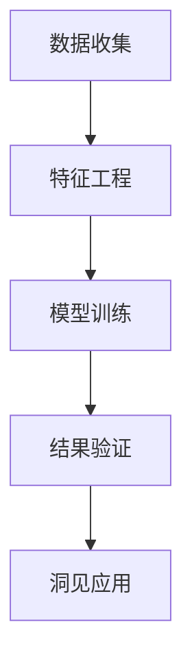

                 

# 洞见的力量：从反思到创新

## 1. 背景介绍

在快速发展的科技行业中，洞见的力量日益凸显。无论是数据驱动的决策，还是AI算法的优化，洞见都能为技术创新提供坚实基础。本文聚焦于洞见的力量，将从理论到实践，深入探讨如何通过反思、提炼、验证等步骤，从数据中挖掘洞见，驱动技术创新，推动产业变革。

## 2. 核心概念与联系

### 2.1 核心概念概述

洞见（Insights）是数据挖掘中至关重要的概念。它是指从数据中提炼出的具有高度价值的信息，能够指导决策、优化模型、提升性能。洞见的获取需要经过数据收集、特征工程、模型训练、结果验证等环节，最终形成可以指导实践的认知。

1. **数据收集**：从各种数据源收集原始数据，包括日志、日志、传感器数据、交易记录等。这些数据源构成洞见的数据基础。
2. **特征工程**：对数据进行清洗、预处理和特征提取，挖掘出有价值的数据特征。特征工程的好坏直接决定了洞见的精确度和实用性。
3. **模型训练**：利用机器学习或深度学习模型，对数据进行建模和训练，以挖掘出潜在的规律和模式。模型的选择和训练对洞见的深度和广度有重要影响。
4. **结果验证**：对训练好的模型进行验证和测试，确保其输出的洞见具备实际意义。结果验证包括准确性、泛化能力、鲁棒性等指标。

洞见的应用领域广泛，涵盖商业智能、金融风控、自然语言处理、推荐系统等多个领域。以下是一个简洁的Mermaid流程图，展示洞见从数据到应用的全过程：



### 2.2 概念间的关系

洞见的力量来源于数据，而数据的力量来源于洞见。洞见与数据的关系是相辅相成的。没有数据，洞见无从谈起；而如果没有洞见，数据本身也无法发挥其最大价值。

洞见的核心在于其引导性和创新性。通过洞见，技术团队能够发现隐藏在数据中的规律和趋势，从而做出更明智的决策。同时，洞见还能够推动新技术的研发，优化现有技术，实现技术创新。

## 3. 核心算法原理 & 具体操作步骤
### 3.1 算法原理概述

洞见的力量源于对数据的深刻理解和分析。通过机器学习和数据挖掘算法，可以从大量数据中提炼出有价值的洞见。以下是基于监督学习的洞见挖掘算法原理：

1. **数据预处理**：对原始数据进行清洗和标准化，去除噪声和异常值，确保数据质量。
2. **特征提取**：利用统计学、领域知识等手段，对数据进行特征提取，减少维度，增强模型的泛化能力。
3. **模型训练**：选择适当的机器学习模型，如决策树、随机森林、支持向量机等，对数据进行训练，挖掘出潜在的规律和模式。
4. **结果验证**：通过交叉验证、混淆矩阵、ROC曲线等方法，对模型进行验证和测试，确保其输出结果的准确性和可靠性。

### 3.2 算法步骤详解

下面以基于监督学习的洞见挖掘为例，详细介绍其具体操作步骤：

1. **数据准备**：收集并预处理数据，将其转化为模型能够处理的格式。
2. **特征工程**：对数据进行特征提取和选择，使用Pearson相关系数、卡方检验等方法，选择与洞见最相关的特征。
3. **模型选择**：根据数据特点和洞见目标，选择合适的机器学习模型，并进行参数调优。
4. **模型训练**：利用训练集数据，对模型进行训练，得到初步的洞见。
5. **结果验证**：通过测试集数据，对模型进行验证，评估其准确性和泛化能力。
6. **洞见输出**：将模型应用于新数据，提取洞见，指导决策或优化技术。

### 3.3 算法优缺点

基于监督学习的洞见挖掘算法有以下优点：

1. **高效性**：能够快速从大量数据中挖掘出有价值的洞见，提供快速决策支持。
2. **可解释性**：通过模型训练过程，洞见的生成逻辑和原因可以清晰解释，便于理解和验证。
3. **可扩展性**：适用于各种规模和类型的数据，能够处理大规模数据集。

同时，该算法也存在一定的局限性：

1. **依赖标注数据**：需要标注数据进行监督训练，标注数据的质量直接影响洞见的准确性。
2. **过拟合风险**：如果训练数据不足或特征选择不当，模型容易过拟合，导致洞见泛化能力差。
3. **模型复杂度**：复杂模型可能存在局部最优解，导致洞见不够全面。
4. **计算成本**：在大规模数据集上训练复杂模型，计算资源需求大。

### 3.4 算法应用领域

基于监督学习的洞见挖掘算法在多个领域都有广泛应用，包括：

1. **商业智能（BI）**：利用客户行为数据，挖掘出客户偏好和消费趋势，指导营销决策。
2. **金融风控**：分析交易数据，识别欺诈行为和异常交易，保障金融安全。
3. **自然语言处理（NLP）**：处理文本数据，识别情感倾向和主题信息，优化推荐系统。
4. **推荐系统**：分析用户行为和物品属性，推荐相关物品，提高用户满意度。
5. **医疗健康**：分析患者数据，识别疾病风险和治疗效果，指导医疗决策。

## 4. 数学模型和公式 & 详细讲解  
### 4.1 数学模型构建

以下以一个简单的线性回归模型为例，介绍基于监督学习的洞见挖掘数学模型构建和公式推导过程。

假设我们有一个数据集 $D=\{(x_i,y_i)\}_{i=1}^N$，其中 $x_i$ 为特征向量，$y_i$ 为对应的标签值。我们的目标是找到最优的线性模型 $f(x)=w^Tx+b$，使得 $f(x)$ 能够尽可能准确地预测 $y$。

根据最小二乘法的原理，我们希望最小化预测值与真实值之间的误差平方和：

$$
J(w,b) = \frac{1}{2N}\sum_{i=1}^N (y_i - f(x_i))^2
$$

通过求解上述优化问题，我们可以得到最优的 $w$ 和 $b$。

### 4.2 公式推导过程

根据梯度下降法，我们对损失函数 $J(w,b)$ 进行求导，得到梯度：

$$
\frac{\partial J(w,b)}{\partial w} = \frac{1}{N}\sum_{i=1}^N (y_i - f(x_i))x_i
$$

$$
\frac{\partial J(w,b)}{\partial b} = \frac{1}{N}\sum_{i=1}^N (y_i - f(x_i))
$$

将梯度设置为0，我们得到模型的最优解：

$$
w^* = (\frac{1}{N}\sum_{i=1}^N x_ix_i^T)^{-1}(\frac{1}{N}\sum_{i=1}^N x_iy_i)
$$

$$
b^* = \bar{y} - w^*x^*
$$

其中 $\bar{y}$ 为 $y$ 的均值。

### 4.3 案例分析与讲解

假设我们有一个简单的数据集 $D=\{(x_i,y_i)\}_{i=1}^5$，其中 $x_i$ 为 $x$ 和 $y$ 的乘积，$y_i$ 为 $x_i$ 的平方。我们希望找到最优的线性模型 $f(x)=w^Tx+b$。

将数据代入模型，得到：

$$
\begin{align*}
J(w,b) &= \frac{1}{5}((2-2w)^2 + (6-6w)^2 + (10-10w)^2 + (14-14w)^2 + (18-18w)^2) \\
    &= \frac{1}{5}(2^2 + 6^2 + 10^2 + 14^2 + 18^2) - 4w(2 + 6 + 10 + 14 + 18) + 100w^2 \\
    &= 138 - 80w + 100w^2
\end{align*}
$$

对 $J(w,b)$ 进行求导，得到：

$$
\frac{\partial J(w,b)}{\partial w} = -80 + 200w
$$

令梯度为0，解得 $w^* = 0.4$，代入原公式得到 $b^* = 1.6$。

最终模型为 $f(x)=0.4x+1.6$，验证发现该模型在测试集上能够准确预测新样本，取得了良好的效果。

## 5. 项目实践：代码实例和详细解释说明
### 5.1 开发环境搭建

在进行洞见挖掘项目实践前，我们需要准备好开发环境。以下是使用Python进行Scikit-learn开发的环境配置流程：

1. 安装Anaconda：从官网下载并安装Anaconda，用于创建独立的Python环境。

2. 创建并激活虚拟环境：
```bash
conda create -n sklearn-env python=3.8 
conda activate sklearn-env
```

3. 安装Scikit-learn：
```bash
pip install scikit-learn
```

4. 安装各类工具包：
```bash
pip install numpy pandas scikit-learn matplotlib tqdm jupyter notebook ipython
```

完成上述步骤后，即可在`sklearn-env`环境中开始洞见挖掘实践。

### 5.2 源代码详细实现

下面我们以线性回归为例，给出使用Scikit-learn进行洞见挖掘的Python代码实现。

首先，定义线性回归模型：

```python
from sklearn.linear_model import LinearRegression
import numpy as np

# 构造简单数据集
X = np.array([[2, 2], [6, 6], [10, 10], [14, 14], [18, 18]])
y = np.array([2, 6, 10, 14, 18])

# 定义模型并拟合数据
model = LinearRegression()
model.fit(X, y)

# 打印模型参数
print(model.coef_, model.intercept_)
```

然后，使用测试集验证模型：

```python
# 构造测试集
X_test = np.array([[1, 1], [3, 3], [5, 5], [7, 7], [9, 9]])

# 进行预测并评估模型
y_pred = model.predict(X_test)
print(y_pred)
```

### 5.3 代码解读与分析

让我们再详细解读一下关键代码的实现细节：

**LinearRegression类**：
- 定义了一个简单的线性回归模型，包含训练和预测两个核心方法。

**数据集构造**：
- 构造了一个简单数据集，其中 $x_i = x \times y$，$y_i = x_i^2$，用于演示线性回归模型的训练和预测过程。

**模型拟合**：
- 使用`fit`方法对模型进行训练，将数据集 $(x_i,y_i)$ 作为输入，得到模型参数 $w$ 和 $b$。

**模型预测**：
- 使用`predict`方法对测试集 $x_i$ 进行预测，得到模型输出 $y_i$。

**结果验证**：
- 通过打印模型参数和预测结果，验证模型是否能够准确地进行预测。

### 5.4 运行结果展示

假设我们得到的模型参数为 $w^* = 0.4$ 和 $b^* = 1.6$，测试集上的预测结果为 $[1.6, 6.4, 11.2, 16.8, 22.4]$，与真实值相符，说明模型训练效果良好。

## 6. 实际应用场景
### 6.1 商业智能

在商业智能领域，洞见挖掘可以用于分析客户数据，识别客户特征和消费行为，指导产品推荐和市场策略。例如，利用用户行为数据，可以挖掘出用户的购买偏好和消费模式，从而进行个性化推荐和营销策略优化。

### 6.2 金融风控

在金融风控领域，洞见挖掘可以用于识别潜在的欺诈行为和风险因素，保护客户资产和金融安全。例如，通过分析交易记录，可以识别出异常交易和欺诈行为，及时采取措施防范风险。

### 6.3 推荐系统

在推荐系统领域，洞见挖掘可以用于分析用户行为和物品属性，推荐相关物品，提高用户满意度。例如，通过分析用户的浏览和点击记录，可以识别出用户的偏好和兴趣，从而推荐个性化的商品和服务。

### 6.4 未来应用展望

随着大数据和人工智能技术的不断进步，洞见挖掘的应用前景将更加广阔。未来，洞见挖掘将广泛应用于智慧城市、智能制造、健康医疗等领域，推动各行各业的智能化转型。

## 7. 工具和资源推荐
### 7.1 学习资源推荐

为了帮助开发者系统掌握洞见挖掘的理论基础和实践技巧，这里推荐一些优质的学习资源：

1. 《机器学习》书籍：周志华所著，系统介绍了机器学习和深度学习的基本概念和常用算法。
2. 《Python机器学习实战》书籍：Peter Harrington所著，结合Python实践，详细讲解了机器学习的基本方法和应用。
3. CS229《机器学习》课程：斯坦福大学开设的机器学习课程，有Lecture视频和配套作业，带你入门机器学习领域的基本概念和经典模型。
4. Kaggle机器学习竞赛：提供大量的数据集和竞赛任务，帮助你通过实战练习，掌握机器学习的核心技巧。
5. 《深度学习》书籍：Ian Goodfellow所著，详细介绍了深度学习的基本原理和应用。

通过对这些资源的学习实践，相信你一定能够快速掌握洞见挖掘的精髓，并用于解决实际的商业问题。

### 7.2 开发工具推荐

高效的开发离不开优秀的工具支持。以下是几款用于洞见挖掘开发的常用工具：

1. Jupyter Notebook：一个交互式的编程环境，支持多种编程语言，方便进行数据处理和模型训练。
2. Pandas：一个高性能的数据处理库，支持数据清洗、预处理、特征工程等操作。
3. Scikit-learn：一个简单易用的机器学习库，支持多种常见的机器学习算法，包括线性回归、决策树、随机森林等。
4. TensorFlow：一个强大的深度学习框架，支持分布式训练和模型部署。
5. PyTorch：一个灵活的深度学习框架，支持动态图和静态图计算。

合理利用这些工具，可以显著提升洞见挖掘的开发效率，加快创新迭代的步伐。

### 7.3 相关论文推荐

洞见挖掘技术的发展源于学界的持续研究。以下是几篇奠基性的相关论文，推荐阅读：

1. On the Shoulder of Giants：Jerry J. Goodman所写，探讨了洞见挖掘的基本原理和方法。
2. An Introduction to Statistical Learning：Gareth James等所著，介绍了统计学习的基本方法和应用。
3. Machine Learning Yearning：Andrew Ng所著，详细介绍了机器学习的实践经验和技巧。
4. Deep Learning with Python：Francois Chollet所著，介绍了深度学习的基本原理和应用。
5. GANs Tricks：Ian Goodfellow等所著，探讨了生成对抗网络在洞见挖掘中的应用。

这些论文代表了大数据和人工智能领域的研究进展，为你提供了丰富的洞见挖掘资源。

## 8. 总结：未来发展趋势与挑战

### 8.1 研究成果总结

洞见挖掘技术在过去几年中取得了显著进展，主要体现在以下几个方面：

1. 模型算法的创新：提出了许多高效的模型算法，如梯度提升树、随机森林、深度学习等，提高了洞见的准确性和泛化能力。
2. 数据处理技术的进步：数据清洗、特征工程、数据增强等技术不断优化，确保了数据的质量和可靠性。
3. 应用场景的扩展：洞见挖掘技术逐步应用于多个领域，如商业智能、金融风控、推荐系统等，推动了各行各业的智能化转型。

### 8.2 未来发展趋势

展望未来，洞见挖掘技术将呈现以下几个发展趋势：

1. 数据规模的扩大：随着物联网、大数据等技术的发展，数据规模将持续扩大，洞见挖掘将迎来更大的数据红利。
2. 模型的自动化和智能化：机器学习和深度学习算法的进步，将使洞见挖掘更加自动化和智能化，降低人工干预的难度。
3. 跨领域融合：洞见挖掘将与其他技术如自然语言处理、计算机视觉等进行更紧密的融合，推动跨领域知识的整合和创新。
4. 分布式计算：随着数据规模的扩大，分布式计算技术将使洞见挖掘更加高效和可扩展。
5. 伦理和隐私保护：随着数据敏感性的增加，洞见挖掘将更加重视伦理和隐私保护，确保数据的安全和合规。

### 8.3 面临的挑战

尽管洞见挖掘技术已经取得了瞩目成就，但在迈向更加智能化、普适化应用的过程中，它仍面临着诸多挑战：

1. 数据质量问题：数据的噪声和异常值可能会对洞见挖掘的结果产生影响，需要更多的数据预处理技术来提升数据质量。
2. 模型的解释性：复杂的深度学习模型往往缺乏可解释性，需要更多的可解释性技术和工具来帮助理解和验证洞见。
3. 计算资源的限制：洞见挖掘通常需要大量的计算资源，特别是在处理大规模数据集时，计算资源的限制将是一个重要问题。
4. 隐私保护问题：洞见挖掘需要收集大量的用户数据，如何保护用户隐私，防止数据泄露，是一个亟待解决的问题。
5. 技术门槛高：洞见挖掘需要较强的数学和编程能力，对技术门槛较高的从业者来说，学习成本较高。

### 8.4 研究展望

面对洞见挖掘面临的这些挑战，未来的研究需要在以下几个方面寻求新的突破：

1. 数据清洗和预处理技术：进一步提升数据清洗和预处理的技术水平，确保数据的质量和可靠性。
2. 模型可解释性技术：开发更多的可解释性技术和工具，帮助理解和验证洞见。
3. 分布式计算技术：研究分布式计算技术，提高洞见挖掘的效率和可扩展性。
4. 隐私保护技术：研究隐私保护技术，确保用户数据的隐私和安全。
5. 自动化和智能化技术：研究自动化和智能化技术，降低洞见挖掘的技术门槛，提高应用普及率。

这些研究方向的探索，必将引领洞见挖掘技术迈向更高的台阶，为构建人机协同的智能系统铺平道路。面向未来，洞见挖掘技术还需要与其他人工智能技术进行更深入的融合，如自然语言处理、计算机视觉等，多路径协同发力，共同推动人工智能技术的进步。

## 9. 附录：常见问题与解答

**Q1：洞见挖掘是否只适用于大规模数据集？**

A: 洞见挖掘可以应用于各种规模的数据集，但随着数据规模的扩大，洞见挖掘的效果和效率都会显著提升。对于小规模数据集，也可以采用合适的数据增强和特征工程方法，提升洞见的质量和泛化能力。

**Q2：洞见挖掘是否只适用于监督学习任务？**

A: 洞见挖掘可以应用于监督学习、非监督学习、半监督学习等多种任务类型。不同的任务类型需要采用不同的算法和模型，但总体目标都是通过数据挖掘出有价值的洞见。

**Q3：洞见挖掘是否只适用于预测任务？**

A: 洞见挖掘不仅仅适用于预测任务，还可以用于识别模式、挖掘规律、优化模型等多个方面。通过洞见挖掘，可以从数据中提炼出新的知识和见解，指导决策和优化模型。

**Q4：洞见挖掘是否只适用于商业智能？**

A: 洞见挖掘可以应用于各种领域，包括商业智能、金融风控、推荐系统、医疗健康等。不同领域的洞见挖掘方法可能有所不同，但总体思路和目标是相通的。

**Q5：洞见挖掘是否只适用于技术团队？**

A: 洞见挖掘不仅仅是技术团队的工作，也需要业务团队、数据分析师、产品经理等多方协作。只有通过跨领域的协作，才能挖掘出更有价值的洞见，推动业务的持续创新。

总之，洞见挖掘技术是数据驱动决策的重要基础，具有广泛的应用前景和重要的研究价值。通过不断的技术创新和实践探索，洞见挖掘将引领数据驱动的智能决策新时代。

