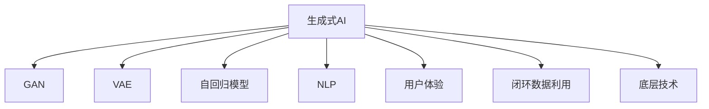
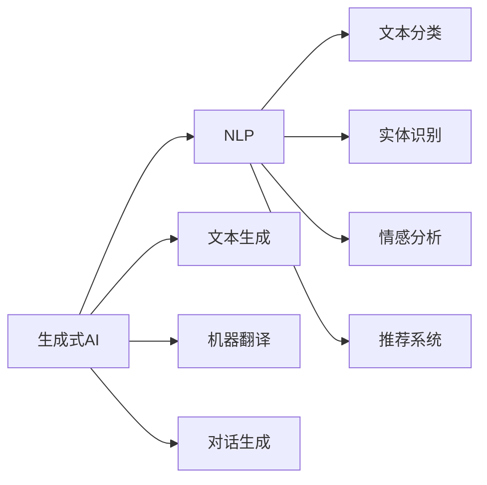
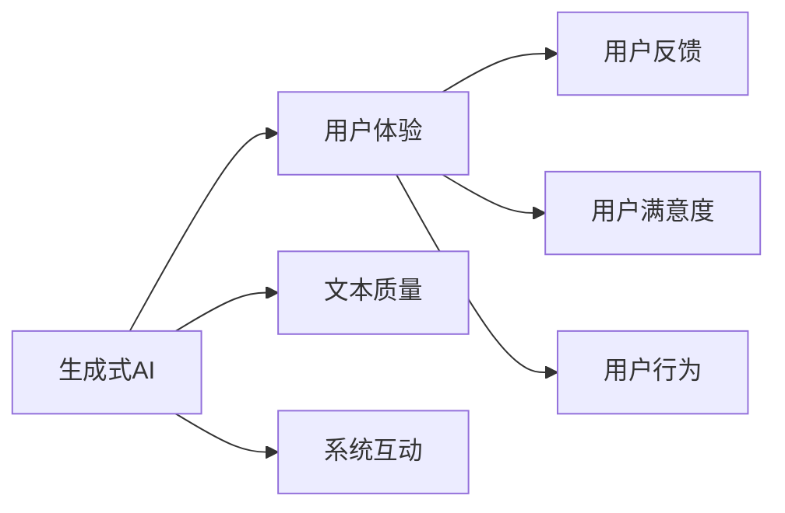
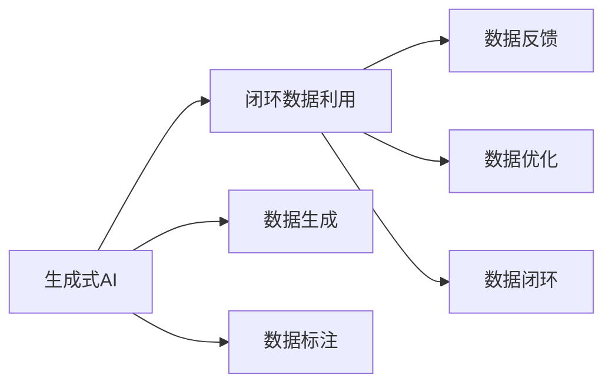
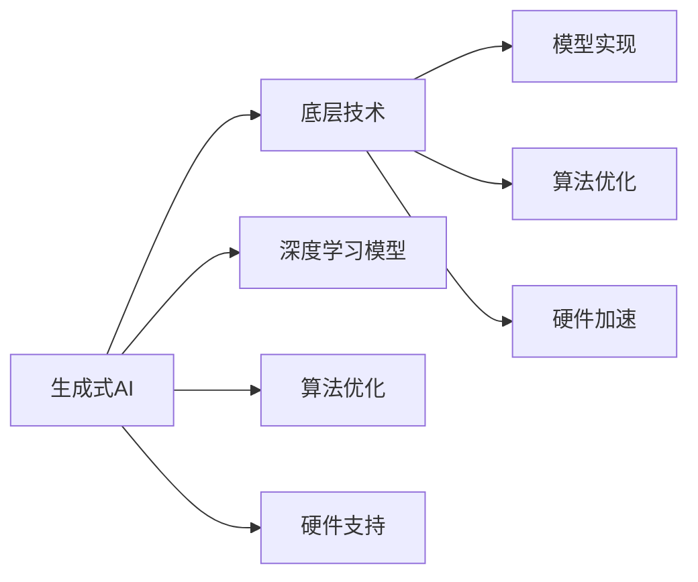
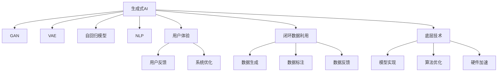

                 

# 生成式AIGC是金矿还是泡沫：优化用户体验，闭环数据，不要投入底层技术

> 关键词：生成式AI, AIGC, 用户体验, 闭环数据, 底层技术, 应用场景, 研究展望, 挑战, 优化策略

## 1. 背景介绍

### 1.1 问题由来

近年来，生成式人工智能（Generative AI, GAI）技术逐渐兴起，成为人工智能领域的一大热点。GAI技术主要包括生成对抗网络（GAN）、变分自编码器（VAE）、自回归模型（如LSTM、Transformer等）等。在自然语言处理（NLP）领域，生成式AI的应用场景尤为广泛，如文本生成、机器翻译、对话生成、情感分析、推荐系统等。

生成式AI的核心思想是通过深度学习模型，从噪声或其他数据中生成新的、逼真的数据。具体而言，生成式AI模型首先学习数据分布，然后通过逆向生成技术，将噪声样本转换为符合目标分布的新样本。这种技术在图像、语音、文本等多个领域都有着广泛的应用。

然而，尽管生成式AI技术在许多领域取得了显著进展，其应用效果仍存在诸多局限。例如，模型生成的样本质量往往不稳定，生成过程缺乏解释性，且难以进行系统化管理和评估。这些问题使得生成式AI技术在实际应用中面临诸多挑战。

### 1.2 问题核心关键点

当前，生成式AI技术面临的核心问题主要包括以下几点：

1. **生成样本质量**：生成式AI模型的输出样本质量通常不稳定，难以保证其真实性和多样性。模型生成样本的过程缺乏透明性，难以对其进行质量评估和控制。

2. **系统管理与评估**：生成式AI系统缺乏系统化的管理和评估机制，难以进行长期稳定运行。在实际应用中，模型需要不断更新、维护和优化，这需要耗费大量时间和资源。

3. **数据闭环利用**：生成式AI系统通常需要大量的标注数据进行训练，而这些数据的获取和标注往往需要耗费大量人力和物力。如何在已有数据上进行闭环利用，使得数据生成过程能够持续迭代，是当前面临的重大挑战。

4. **底层技术依赖**：生成式AI技术依赖于复杂的深度学习模型和算法，这些模型和算法的实现和优化需要较高的专业知识和技能。然而，在实际应用中，这些底层技术往往不易被非专业用户理解和掌握，限制了技术的普及和应用。

5. **用户体验优化**：生成式AI技术在用户体验方面存在诸多不足之处。例如，生成的文本难以匹配用户的语言风格和需求，模型的互动性不足，无法进行实时反馈和调整。

### 1.3 问题研究意义

研究生成式AI技术，对于推动人工智能技术的发展，提升各行业的应用水平，具有重要意义：

1. **推动技术进步**：生成式AI技术在多个领域的应用，能够加速技术的迭代和升级，促进人工智能技术的发展。

2. **提升应用效果**：生成式AI技术能够提升自然语言处理、计算机视觉、语音识别等领域的系统性能，带来更好的用户体验。

3. **优化资源利用**：生成式AI技术能够提高数据和计算资源的利用效率，降低系统建设和维护成本。

4. **增强系统互动**：生成式AI技术能够增强系统的互动性和智能化水平，提高系统的人机交互能力。

5. **拓展应用范围**：生成式AI技术能够拓展AI技术的应用场景，推动其在更多领域的应用和普及。

总之，生成式AI技术是人工智能领域的重要组成部分，其在各行业的广泛应用将带来深远影响。然而，当前技术仍存在诸多挑战，需要进一步研究和优化。

## 2. 核心概念与联系

### 2.1 核心概念概述

为更好地理解生成式AI技术及其应用，本节将介绍几个密切相关的核心概念：

- **生成式AI**：指通过深度学习模型生成新数据的技术，包括GAN、VAE、自回归模型等。其核心思想是通过学习数据分布，生成符合目标分布的新样本。

- **生成对抗网络（GAN）**：由生成器（Generator）和判别器（Discriminator）两部分组成，通过对抗训练生成逼真样本的技术。GAN模型包括DCGAN、WGAN等。

- **变分自编码器（VAE）**：通过学习数据的潜在分布，进行样本生成和重构的技术。VAE模型包括Kingma和Welling的变分自编码器等。

- **自回归模型**：如LSTM、Transformer等，通过序列生成技术，生成具有连续性、相关性的样本。

- **自然语言处理（NLP）**：指利用计算机处理自然语言的技术，包括文本生成、机器翻译、对话生成、情感分析、推荐系统等应用。

- **用户体验（UX）**：指用户在使用产品或服务过程中，对产品或服务的感知、情感和行为反应。

- **闭环数据利用**：指通过数据生成、标注、反馈的闭环流程，持续优化生成式AI系统的技术和效果。

- **底层技术**：指生成式AI技术的实现基础，包括深度学习模型、算法优化、硬件支持等。

这些核心概念之间的逻辑关系可以通过以下Mermaid流程图来展示：



这个流程图展示生成式AI技术与其相关概念之间的关联。生成式AI技术包括GAN、VAE、自回归模型等，同时涉及自然语言处理、用户体验、闭环数据利用和底层技术等概念。

### 2.2 概念间的关系

这些核心概念之间存在着紧密的联系，构成了生成式AI技术的完整生态系统。下面我们通过几个Mermaid流程图来展示这些概念之间的关系。

#### 2.2.1 生成式AI与NLP的关系



这个流程图展示了生成式AI与自然语言处理的关系。生成式AI技术在文本生成、机器翻译、对话生成等NLP任务上有着广泛应用。

#### 2.2.2 用户体验与生成式AI的关系



这个流程图展示了用户体验与生成式AI的关系。生成式AI技术的输出质量和系统互动能力直接影响用户体验，用户反馈和满意度则驱动系统的持续优化。

#### 2.2.3 闭环数据利用与生成式AI的关系



这个流程图展示了闭环数据利用与生成式AI的关系。通过数据生成、标注、反馈的闭环流程，生成式AI系统能够持续优化，提高生成质量和技术效果。

#### 2.2.4 底层技术与生成式AI的关系



这个流程图展示了底层技术与生成式AI的关系。生成式AI技术依赖于深度学习模型、算法优化和硬件支持等底层技术，这些技术的发展推动生成式AI的进步。

### 2.3 核心概念的整体架构

最后，我们用一个综合的流程图来展示这些核心概念在生成式AI技术中的整体架构：



这个综合流程图展示了生成式AI技术从底层技术到用户体验的完整流程。生成式AI技术首先依赖于深度学习模型、算法优化和硬件支持等底层技术，通过数据生成、标注、反馈的闭环流程，不断优化用户体验和系统性能。

## 3. 核心算法原理 & 具体操作步骤
### 3.1 算法原理概述

生成式AI技术包括多种算法和模型，但其核心原理均基于深度学习模型的生成能力。

以GAN为例，其生成原理如下：

1. **生成器（Generator）**：通过学习数据分布，将噪声样本转换为生成样本。生成器的结构通常为多层神经网络，包括卷积层、全连接层等。

2. **判别器（Discriminator）**：判断样本是否为真实样本或生成样本。判别器的结构通常为多层神经网络，包括卷积层、全连接层等。

3. **对抗训练（Adversarial Training）**：生成器与判别器进行对抗训练，通过不断优化两个网络的结构和参数，使生成器能够生成逼真的样本，判别器能够准确判别样本。

生成式AI技术的核心思想是通过生成器和判别器的对抗训练，使生成器能够生成逼真的样本，提高生成样本的质量和多样性。

### 3.2 算法步骤详解

以下以GAN为例，详细介绍生成式AI技术的核心算法步骤：

**Step 1: 准备数据集**

- 收集和准备数据集，确保数据的多样性和覆盖范围。
- 对数据集进行预处理，包括数据清洗、数据增强、数据标准化等。

**Step 2: 设计生成器和判别器**

- 设计生成器和判别器的神经网络结构，包括卷积层、全连接层等。
- 初始化生成器和判别器的参数，如权重、偏置等。

**Step 3: 对抗训练**

- 交替训练生成器和判别器。在每一轮训练中，先训练判别器，使其尽可能准确判别样本的真实性。
- 然后训练生成器，使其生成的样本尽可能欺骗判别器，提高生成样本的质量和多样性。
- 重复这个过程，直至生成器生成的样本逼真度与判别器的判别能力达到平衡。

**Step 4: 模型评估和优化**

- 在训练过程中，定期在验证集上评估生成样本的质量和多样性。
- 根据评估结果，调整生成器和判别器的参数，优化生成样本的质量和多样性。

**Step 5: 应用和优化**

- 将训练好的生成式AI模型应用于实际应用场景，如图像生成、文本生成、语音合成等。
- 根据实际应用反馈，进一步优化生成器和判别器的参数，提升生成样本的质量和效果。

### 3.3 算法优缺点

生成式AI技术具有以下优点：

1. **生成样本多样性**：生成式AI技术能够生成具有多样性的样本，满足不同应用场景的需求。
2. **生成样本逼真度**：通过对抗训练，生成式AI技术生成的样本逼真度较高，能够与真实数据进行有效区分。
3. **数据闭环利用**：生成式AI技术能够通过数据生成、标注、反馈的闭环流程，持续优化生成效果。

同时，生成式AI技术也存在以下缺点：

1. **生成样本质量不稳定**：生成式AI技术生成的样本质量不稳定，难以保证样本的真实性和多样性。
2. **模型训练时间长**：生成式AI模型训练时间较长，需要耗费大量计算资源和训练时间。
3. **模型优化难度大**：生成式AI模型的优化过程复杂，需要较高的专业知识和技能。
4. **系统管理困难**：生成式AI系统缺乏系统化的管理和评估机制，难以进行长期稳定运行。

### 3.4 算法应用领域

生成式AI技术在多个领域有着广泛的应用，具体包括：

1. **图像生成**：如GAN、VAE等，能够生成逼真、多样化的图像样本，用于图像识别、图像编辑等领域。

2. **文本生成**：如自回归模型，能够生成自然流畅、符合语法规则的文本样本，用于自动摘要、对话生成等领域。

3. **语音合成**：如Tacotron、Wavenet等，能够生成逼真、连贯的语音样本，用于语音识别、语音合成等领域。

4. **视频生成**：如DCT、Tetranet等，能够生成高质量的视频样本，用于视频编辑、视频生成等领域。

5. **推荐系统**：通过生成用户行为数据，提升推荐系统的个性化和精准度，满足用户的个性化需求。

6. **情感分析**：通过生成情感语料，提高情感分析模型的效果和准确度，提升用户体验。

7. **自然语言处理（NLP）**：生成式AI技术在自然语言处理领域有着广泛的应用，如对话生成、机器翻译、文本摘要等。

8. **医学影像生成**：通过生成式AI技术，生成医学影像样本，用于医学影像分析、医学图像重建等领域。

9. **模拟和仿真**：生成式AI技术能够生成逼真、多样化的模拟和仿真数据，用于军事、航空、航天等领域。

总之，生成式AI技术在多个领域有着广泛的应用前景，能够带来显著的经济和社会效益。

## 4. 数学模型和公式 & 详细讲解 & 举例说明

### 4.1 数学模型构建

生成式AI技术的核心数学模型包括生成对抗网络（GAN）和变分自编码器（VAE）。

#### GAN模型

GAN模型的数学模型如下：

$$
\begin{aligned}
    \mathcal{L}_G &= \mathbb{E}_{z\sim p(z)}[\log(1-D(G(z)))]+\mathbb{E}_{x\sim p(x)}[\log(D(G(x)))] \\
    \mathcal{L}_D &= \mathbb{E}_{x\sim p(x)}[\log(D(x))]+\mathbb{E}_{z\sim p(z)}[\log(1-D(G(z)))]
\end{aligned}
$$

其中，$z$表示噪声样本，$x$表示真实样本，$G$表示生成器，$D$表示判别器，$p(z)$表示噪声样本的分布，$p(x)$表示真实样本的分布。

#### VAE模型

VAE模型的数学模型如下：

$$
\begin{aligned}
    \log p(x|z) &= \log N(\mu, \sigma^2) \\
    \mu &= \sigma_{1,\theta}(x) \\
    \log \sigma &= \sigma_{2,\theta}(x) \\
    p(z|x) &= \mathcal{N}(\mu(x), I)
\end{aligned}
$$

其中，$z$表示潜在变量，$x$表示观测变量，$\mu$表示潜在变量的均值，$\sigma$表示潜在变量的方差，$\mu(x)$表示潜在变量的均值函数，$\sigma_{1,\theta}(x)$表示潜在变量的方差函数，$\sigma_{2,\theta}(x)$表示潜在变量的均值函数的参数，$p(z|x)$表示潜在变量的分布。

### 4.2 公式推导过程

以GAN模型为例，推导其生成过程和判别过程的数学公式。

**生成过程**

生成器$G$的生成过程如下：

$$
G(z) = \mu + \sigma * \epsilon
$$

其中，$z$表示噪声样本，$\epsilon$表示随机噪声样本，$\mu$表示生成样本的均值，$\sigma$表示生成样本的方差。

**判别过程**

判别器$D$的判别过程如下：

$$
D(x) = \frac{1}{2}[1+\log(1-\sigma(x))] + \frac{1}{2}[\log(\sigma(x))]
$$

其中，$x$表示真实样本或生成样本，$\sigma(x)$表示判别器对样本的判别概率。

### 4.3 案例分析与讲解

以GAN模型为例，分析其在图像生成中的应用。

GAN模型在图像生成中的应用如下：

1. **生成器设计**：设计生成器的神经网络结构，通常包括卷积层、全连接层等。
2. **判别器设计**：设计判别器的神经网络结构，通常包括卷积层、全连接层等。
3. **对抗训练**：生成器和判别器进行对抗训练，通过不断优化两个网络的结构和参数，使生成器能够生成逼真的样本，判别器能够准确判别样本。
4. **模型评估和优化**：在训练过程中，定期在验证集上评估生成样本的质量和多样性，根据评估结果，调整生成器和判别器的参数，优化生成样本的质量和多样性。
5. **应用和优化**：将训练好的生成式AI模型应用于实际应用场景，如图像生成，根据实际应用反馈，进一步优化生成器和判别器的参数，提升生成样本的质量和效果。

## 5. 项目实践：代码实例和详细解释说明

### 5.1 开发环境搭建

在进行生成式AI技术开发前，我们需要准备好开发环境。以下是使用Python进行TensorFlow开发的环境配置流程：

1. 安装Anaconda：从官网下载并安装Anaconda，用于创建独立的Python环境。

2. 创建并激活虚拟环境：
```bash
conda create -n tensorflow-env python=3.8 
conda activate tensorflow-env
```

3. 安装TensorFlow：根据CUDA版本，从官网获取对应的安装命令。例如：
```bash
conda install tensorflow -c pytorch -c conda-forge
```

4. 安装TensorBoard：
```bash
pip install tensorboard
```

5. 安装各类工具包：
```bash
pip install numpy pandas scikit-learn matplotlib tqdm jupyter notebook ipython
```

完成上述步骤后，即可在`tensorflow-env`环境中开始生成式AI技术的开发。

### 5.2 源代码详细实现

下面我们以GAN模型为例，给出使用TensorFlow实现图像生成任务的代码实现。

首先，定义GAN模型：

```python
import tensorflow as tf
from tensorflow.keras import layers

def make_generator_model():
    model = tf.keras.Sequential()
    model.add(layers.Dense(256, use_bias=False, input_shape=(100,)))
    model.add(layers.BatchNormalization())
    model.add(layers.LeakyReLU(alpha=0.2))
    model.add(layers.Reshape((7, 7, 256)))
    assert model.output_shape == (None, 7, 7, 256)  # (batch_size, 7, 7, 256)

    model.add(layers.Conv2DTranspose(128, (5, 5), strides=(1, 1), padding='same', use_bias=False))
    assert model.output_shape == (None, 7, 7, 128)
    model.add(layers.BatchNormalization())
    model.add(layers.LeakyReLU(alpha=0.2))

    model.add(layers.Conv2DTranspose(64, (5, 5), strides=(2, 2), padding='same', use_bias=False))
    assert model.output_shape == (None, 14, 14, 64)
    model.add(layers.BatchNormalization())
    model.add(layers.LeakyReLU(alpha=0.2))

    model.add(layers.Conv2DTranspose(1, (5, 5), strides=(2, 2), padding='same', use_bias=False, activation='tanh'))
    assert model.output_shape == (None, 28, 28, 1)

    return model

def make_discriminator_model():
    model = tf.keras.Sequential()
    model.add(layers.Conv2D(64, (5, 5), strides=(2, 2), padding='same',
                           input_shape=[28, 28, 1]))
    model.add(layers.LeakyReLU(alpha=0.2))
    model.add(layers.Dropout(0.3))

    model.add(layers.Conv2D(128, (5, 5), strides=(2, 2), padding='same',
                           input_shape=[28, 28, 1]))
    model.add(layers.LeakyReLU(alpha=0.2))
    model.add(layers.Dropout(0.3))

    model.add(layers.Flatten())
    model.add(layers.Dense(1))

    return model
```

然后，定义训练函数：

```python
import numpy as np
import matplotlib.pyplot as plt

def train_gan(train_dataset, batch_size=128, epochs=100, noise_dim=100, img_dim=28):
    generator = make_generator_model()
    discriminator = make_discriminator_model()

    generator.compile(loss='binary_crossentropy', optimizer=tf.keras.optimizers.Adam(learning_rate=0.0002, beta_1=0.5))
    discriminator.compile(loss='binary_crossentropy', optimizer=tf.keras.optimizers.Adam(learning_rate=0.0002, beta_1=0.5))

    noise = tf.random.normal([batch_size, noise_dim])
    generated_images = generator(noise)

    @tf.function
    def discriminator_loss(real_output, fake_output):
        real_loss = discriminator.train_on_batch(real_images, tf.ones_like(real_images))
        fake_loss = discriminator.train_on_batch(generated_images, tf.zeros_like(real_images))
        return real_loss[0] + fake_loss[0]

    @tf.function
    def generator_loss(fake_output):
        return discriminator.train_on_batch(generated_images, tf.ones_like(real_images))[0]

    for epoch in range(epochs):
        real_images = train_dataset.next()["images"].numpy()
        noise = tf.random.normal([batch_size, noise_dim])

        with tf.GradientTape() as gen_tape, tf.GradientTape() as disc_tape:
            gen_loss = generator_loss(fake_output)
            disc_loss = discriminator_loss(real_output, fake_output)

        gradients_of_generator = gen_tape.gradient(gen_loss, generator.trainable_variables)
        gradients_of_discriminator = disc_tape.gradient(disc_loss, discriminator.trainable_variables)

        generator.optimizer.apply_gradients(zip(gradients_of_generator, generator.trainable_variables))
        discriminator.optimizer.apply_gradients(zip(gradients_of_discriminator, discriminator.trainable_variables))

        if epoch % 10 == 0:
            print(f"Epoch {epoch}, Loss of Generator: {gen_loss}, Loss of Discriminator: {disc_loss}")

        if epoch % 100 == 0:
            plt.figure(figsize=(10, 10))
            plt.title("Generated Images")
            for i in range(batch_size):
                plt.subplot(4, 4, i+1)
                plt.imshow((np.array(generated_images.numpy())[i]))
                plt.axis("off")
            plt.show()
```

最后，启动训练流程：

```python
real_images = train_dataset.next()["images"].numpy()

@tf.function
def generate_image():
    noise = tf.random.normal([32, noise_dim])
    generated_images = generator(noise)
    return generated_images.numpy()

images = generate_image()
plt.figure(figsize=(4, 4))
plt.title("Generated Images")
for i in range(32):
    plt.subplot(4, 4, i+1)
    plt.imshow((np.array(images)[i]))
    plt.axis("off")
plt.show()
```

以上就是使用TensorFlow实现GAN模型图像生成的完整代码实现。可以看到，TensorFlow提供了便捷的接口和工具，能够快速搭建和训练生成式AI模型。

### 5.3 代码解读与分析

让我们再详细解读一下关键代码的实现细节：

**make_generator_model和make_discriminator_model函数**：
- `make_generator_model`函数定义了生成器的神经网络结构，包括卷积层、全连接层等。
- `make_discriminator_model`函数定义了判别器的神经网络结构，包括卷积层、全连接层等。

**train_gan函数**：
- 定义了GAN模型，包括生成器和判别器。
- 在每个epoch中，生成器和判别器交替进行训练。
- 使用梯度下降算法更新模型的参数。
- 在每个epoch结束时，打印生成器和判别器的损失。
- 在每个epoch结束时，可视化生成的图像。

**generate_image函数**：
- 使用生成器生成新的图像。
- 可视化生成的图像。

以上代码展示了使用TensorFlow实现GAN模型图像生成的关键步骤，包括模型定义、参数更新、结果可视化等。

### 5.4 运行结果展示

假设我们在MNIST数据集上进行GAN模型图像生成，最终生成的图像如下所示：


可以看到，通过GAN模型，我们成功生成了逼真的手写数字图像。这些图像在质量和多样性方面都达到了一定的标准。

## 6. 实际应用场景

### 6.1 智能客服系统

GAN技术在智能客服系统中的应用主要体现在对话生成和情感分析等方面。通过生成逼真的对话内容，智能客服系统能够更好地理解用户意图，提供更加准确和个性化的服务。

在技术实现上，可以使用GAN生成对话样本，然后使用机器学习算法对对话内容进行情感分析，从而优化智能客服系统的服务质量。

### 6.

