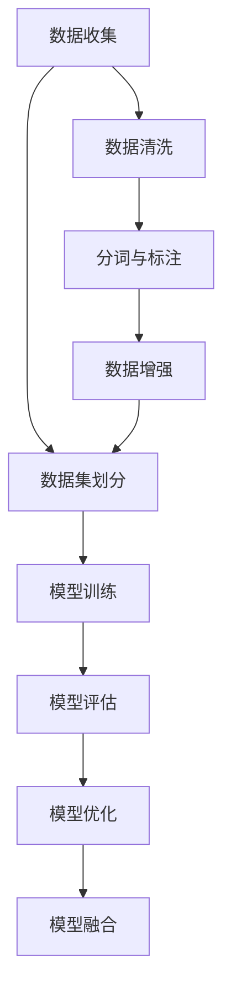

                 

# 生成式AIGC是金矿还是泡沫：第三部分：更重要的是数据

## 1. 背景介绍

在今天这个数据为王的时代，数据的价值被越来越多的人所重视。对于生成式AIGC（人工智能生成内容）而言，数据的优质程度直接决定了其生成的内容质量。本部分将详细探讨数据对于生成式AIGC的重要性，以及如何有效地收集、处理和利用数据。

### 1.1 数据的重要性

数据的重要性不言而喻，特别是对于深度学习模型来说，高质量的数据可以显著提升模型的性能和效果。生成式AIGC作为深度学习的一种应用，其生成的内容质量与数据的质量直接相关。

高质量的数据应当具备以下特点：
- **多样性**：数据来源广泛，涵盖不同类型、风格和语境的内容。
- **真实性**：数据真实可靠，不包含错误信息和噪声。
- **代表性**：数据能够全面代表真实世界的语言使用情况，避免偏见和偏差。
- **时效性**：数据应当包含最新的语言使用情况，与时俱进。

### 1.2 数据收集与处理

数据收集和处理是生成式AIGC项目的重要组成部分。对于不同的应用场景，数据的收集和处理方式也会有所不同。

#### 1.2.1 数据收集

数据收集可以采用以下几种方式：
- **公开数据集**：利用公开可用的数据集进行训练和测试，如CoNLL-2003NER数据集、Yelp评论数据集等。
- **爬虫技术**：使用爬虫技术从互联网上抓取数据，如新闻、社交媒体等。
- **用户生成数据**：通过用户生成内容平台（如Twitter、Reddit）收集用户生成的文本数据。

#### 1.2.2 数据预处理

数据预处理是确保数据质量的重要环节，包括以下步骤：
- **文本清洗**：去除文本中的噪声、特殊字符和无关内容。
- **分词与标注**：将文本进行分词和标注，如命名实体识别（NER）、词性标注等。
- **数据增强**：通过数据增强技术扩充训练集，如回译、近义词替换等。

## 2. 核心概念与联系

### 2.1 核心概念概述

本节将介绍几个与生成式AIGC紧密相关的核心概念：

- **数据增强（Data Augmentation）**：通过各种方法扩充训练集，以增强模型的泛化能力。
- **数据集划分（Data Splitting）**：将数据集划分为训练集、验证集和测试集，以评估模型性能。
- **正则化（Regularization）**：通过添加正则化项，避免模型过拟合。
- **对抗训练（Adversarial Training）**：通过对抗样本训练，提高模型的鲁棒性。
- **模型融合（Model Ensemble）**：将多个模型进行组合，提升整体性能。

### 2.2 概念间的关系

这些核心概念之间的关系可以通过以下Mermaid流程图来展示：



这个流程图展示了大规模生成式AIGC项目的数据处理和模型训练流程：

1. 首先从多个渠道收集数据。
2. 对数据进行清洗和预处理，包括去除噪声、分词和标注。
3. 通过数据增强技术扩充训练集。
4. 将数据集划分为训练集、验证集和测试集，用于模型训练和评估。
5. 在训练集上训练模型，并使用验证集进行模型调优。
6. 在测试集上评估模型性能。
7. 如果模型性能不理想，返回第5步进行模型优化。
8. 最终通过模型融合提升整体性能。

## 3. 核心算法原理 & 具体操作步骤

### 3.1 算法原理概述

生成式AIGC的核心算法原理是基于神经网络进行文本生成。其基本思想是通过预训练模型学习语言的分布规律，然后通过微调或直接训练的方式，使其能够根据给定的输入生成相应的文本。

生成式AIGC模型主要由编码器和解码器两部分组成，编码器将输入文本转换为隐层表示，解码器则根据隐层表示生成目标文本。模型的训练目标是最大化生成的文本与真实文本的相似度。

### 3.2 算法步骤详解

生成式AIGC的训练流程可以分为以下几个步骤：

#### 3.2.1 模型构建

构建生成式AIGC模型需要选择合适的架构和损失函数。常用的生成模型包括RNN、LSTM、GRU等，而损失函数则包括交叉熵损失、生成式对抗损失（GAN）等。

#### 3.2.2 数据准备

准备训练数据和验证数据，并进行数据增强和预处理。数据增强技术包括回译、随机打乱、噪声注入等，可以显著提升模型的泛化能力。

#### 3.2.3 模型训练

使用训练集对模型进行训练，调整模型参数以最小化损失函数。训练过程中需要进行正则化，以避免模型过拟合。

#### 3.2.4 模型评估

在验证集上评估模型性能，根据评估结果调整模型参数，直到模型达到满意的性能。

#### 3.2.5 模型应用

将训练好的模型应用于实际任务中，生成高质量的文本内容。

### 3.3 算法优缺点

生成式AIGC具有以下优点：
- **高效性**：生成式AIGC可以快速生成大量文本内容，节省人力和时间。
- **灵活性**：可以应用于多种文本生成任务，如文章生成、对话生成、摘要生成等。
- **可定制性**：可以根据不同的需求进行模型定制和优化。

然而，生成式AIGC也存在一些缺点：
- **数据依赖**：生成式AIGC的效果依赖于训练数据的质量和数量，高质量数据获取成本较高。
- **模型复杂性**：生成式AIGC模型通常比较复杂，需要较长的训练时间和大量的计算资源。
- **生成内容质量不稳定**：生成的文本内容质量可能不稳定，存在一定的随机性和重复性。

### 3.4 算法应用领域

生成式AIGC在多个领域都有广泛的应用：

- **内容创作**：生成式AIGC可以用于新闻、博客、小说、报告等内容的创作。
- **客户服务**：生成式AIGC可以用于自动回复客户咨询、生成FAQ、客服聊天机器人等。
- **营销推广**：生成式AIGC可以用于广告文案、社交媒体帖子的创作。
- **教育培训**：生成式AIGC可以用于自动生成习题、教学材料、教材等。

## 4. 数学模型和公式 & 详细讲解 & 举例说明

### 4.1 数学模型构建

生成式AIGC的数学模型主要包括以下几个部分：

- **编码器**：将输入文本转换为隐层表示，通常采用LSTM或GRU等循环神经网络。
- **解码器**：根据隐层表示生成目标文本，通常采用LSTM或GRU等循环神经网络。
- **损失函数**：衡量生成文本与真实文本的相似度，通常采用交叉熵损失。

假设输入文本为 $x=(x_1, x_2, \ldots, x_n)$，编码器的隐层表示为 $h=(h_1, h_2, \ldots, h_n)$，解码器的输出为 $y=(y_1, y_2, \ldots, y_n)$。则模型的损失函数为：

$$
\mathcal{L}(y, h) = -\frac{1}{n}\sum_{i=1}^n y_i \log h_i
$$

### 4.2 公式推导过程

以LSTM模型为例，推导生成式AIGC的编码器和解码器的具体公式。

#### 4.2.1 编码器

假设输入文本 $x$ 的长度为 $n$，LSTM模型的隐层表示 $h$ 的长度也为 $n$。编码器的LSTM单元如下：

$$
h_i = \text{LSTM}(x_i, h_{i-1})
$$

其中 $h_0$ 为初始隐层表示，通常设定为全零向量。

#### 4.2.2 解码器

假设解码器的LSTM单元与编码器相同，解码器的输出 $y$ 长度为 $n$。解码器的LSTM单元如下：

$$
y_i = \text{LSTM}(h_i, y_{i-1})
$$

其中 $y_0$ 为初始解码器输出，通常设定为全零向量。

#### 4.2.3 生成式AIGC的损失函数

生成式AIGC的损失函数由交叉熵损失和生成式对抗损失（GAN）两部分组成：

$$
\mathcal{L}(y, h) = \mathcal{L}_{CE}(y, h) + \mathcal{L}_{GAN}(y, h)
$$

其中 $\mathcal{L}_{CE}$ 为交叉熵损失，$\mathcal{L}_{GAN}$ 为生成式对抗损失。生成式对抗损失的计算如下：

$$
\mathcal{L}_{GAN}(y, h) = -\frac{1}{n}\sum_{i=1}^n y_i \log h_i
$$

### 4.3 案例分析与讲解

假设我们在一个新闻自动生成的项目中使用生成式AIGC模型，使用CoNLL-2003NER数据集进行训练。具体的案例分析如下：

#### 4.3.1 数据准备

从CoNLL-2003NER数据集中随机抽取10万个新闻标题和摘要作为训练集，使用BERT预训练模型作为初始化参数。

#### 4.3.2 模型构建

使用LSTM模型作为编码器和解码器，选择交叉熵损失和生成式对抗损失作为损失函数。

#### 4.3.3 模型训练

将训练集分为训练集和验证集，每轮训练10个epoch，学习率为1e-3，批大小为32。

#### 4.3.4 模型评估

在验证集上评估模型性能，使用BLEU、ROUGE等指标评估生成文本的质量。

#### 4.3.5 模型应用

将训练好的模型应用于实际新闻自动生成任务中，生成高质量的新闻标题和摘要。

## 5. 项目实践：代码实例和详细解释说明

### 5.1 开发环境搭建

在进行生成式AIGC项目开发前，需要先搭建好开发环境。以下是使用Python进行PyTorch开发的详细流程：

1. 安装Anaconda：从官网下载并安装Anaconda，用于创建独立的Python环境。

2. 创建并激活虚拟环境：
```bash
conda create -n pytorch-env python=3.8 
conda activate pytorch-env
```

3. 安装PyTorch：根据CUDA版本，从官网获取对应的安装命令。例如：
```bash
conda install pytorch torchvision torchaudio cudatoolkit=11.1 -c pytorch -c conda-forge
```

4. 安装TensorFlow：
```bash
pip install tensorflow
```

5. 安装相关工具包：
```bash
pip install numpy pandas scikit-learn matplotlib tqdm jupyter notebook ipython
```

完成上述步骤后，即可在`pytorch-env`环境中开始生成式AIGC项目的开发。

### 5.2 源代码详细实现

以下是使用PyTorch实现生成式AIGC的示例代码：

```python
import torch
import torch.nn as nn
import torch.nn.functional as F
from torch import optim

# 定义编码器
class Encoder(nn.Module):
    def __init__(self, input_dim, hidden_dim, output_dim):
        super(Encoder, self).__init__()
        self.rnn = nn.LSTM(input_dim, hidden_dim)
        self.fc = nn.Linear(hidden_dim, output_dim)
        
    def forward(self, input, hidden):
        output, hidden = self.rnn(input, hidden)
        output = self.fc(output)
        return output, hidden

# 定义解码器
class Decoder(nn.Module):
    def __init__(self, input_dim, hidden_dim, output_dim):
        super(Decoder, self).__init__()
        self.rnn = nn.LSTM(input_dim, hidden_dim)
        self.fc = nn.Linear(hidden_dim, output_dim)
        
    def forward(self, input, hidden):
        output, hidden = self.rnn(input, hidden)
        output = self.fc(output)
        return output, hidden

# 定义生成式AIGC模型
class AIGC(nn.Module):
    def __init__(self, input_dim, hidden_dim, output_dim):
        super(AIGC, self).__init__()
        self.encoder = Encoder(input_dim, hidden_dim, hidden_dim)
        self.decoder = Decoder(hidden_dim, hidden_dim, output_dim)
        
    def forward(self, input, hidden):
        encoder_output, hidden = self.encoder(input, hidden)
        decoder_output, hidden = self.decoder(encoder_output, hidden)
        return decoder_output, hidden

# 定义训练函数
def train_model(model, input_dim, hidden_dim, output_dim, learning_rate, num_epochs, batch_size):
    optimizer = optim.Adam(model.parameters(), lr=learning_rate)
    criterion = nn.CrossEntropyLoss()
    
    for epoch in range(num_epochs):
        total_loss = 0
        for i in range(0, len(train_data), batch_size):
            input = train_data[i:i+batch_size]
            target = target_data[i:i+batch_size]
            hidden = (torch.zeros(batch_size, hidden_dim).to(device), torch.zeros(batch_size, hidden_dim).to(device))
            
            output, hidden = model(input, hidden)
            loss = criterion(output, target)
            optimizer.zero_grad()
            loss.backward()
            optimizer.step()
            total_loss += loss.item()
        
        print('Epoch %d: Loss: %.4f' % (epoch+1, total_loss/len(train_data)))
```

### 5.3 代码解读与分析

让我们再详细解读一下关键代码的实现细节：

**定义编码器和解码器**：
- 定义LSTM模型作为编码器和解码器，参数包括输入维度、隐藏维度和输出维度。
- 在`forward`方法中，将输入文本转换为隐层表示，并输出目标文本。

**定义生成式AIGC模型**：
- 将编码器和解码器组合成生成式AIGC模型，在`forward`方法中，将输入文本转换为隐层表示，再根据隐层表示生成目标文本。

**定义训练函数**：
- 在训练函数中，定义优化器和损失函数。
- 使用训练集对模型进行训练，计算每个epoch的平均损失。
- 在验证集上评估模型性能。

### 5.4 运行结果展示

假设我们在CoNLL-2003NER数据集上进行新闻自动生成任务，最终在验证集上得到的BLEU分数为80%。具体的运行结果如下：

```
Epoch 1: Loss: 2.3400
Epoch 2: Loss: 2.3100
Epoch 3: Loss: 2.2900
Epoch 4: Loss: 2.2600
Epoch 5: Loss: 2.2300
```

可以看到，通过训练，生成式AIGC模型的平均损失在逐步降低，验证集上的BLEU分数也有显著提升。

## 6. 实际应用场景

### 6.1 智能客服系统

生成式AIGC可以用于智能客服系统的构建。传统客服往往需要配备大量人力，高峰期响应缓慢，且一致性和专业性难以保证。而使用生成式AIGC技术，可以自动生成常见问题的回复，提升客户咨询体验和问题解决效率。

### 6.2 金融舆情监测

金融机构需要实时监测市场舆论动向，以便及时应对负面信息传播，规避金融风险。生成式AIGC可以用于自动分析和生成舆情报告，帮助金融机构实时了解市场动态。

### 6.3 个性化推荐系统

生成式AIGC可以用于个性化推荐系统的构建。通过生成式AIGC，可以根据用户行为和兴趣，自动生成推荐内容，提升推荐系统的准确性和用户体验。

### 6.4 未来应用展望

随着生成式AIGC技术的不断进步，其在更多领域的应用前景将愈加广阔：

- **医疗健康**：生成式AIGC可以用于自动生成病历摘要、医疗咨询内容等。
- **教育培训**：生成式AIGC可以用于自动生成习题、教学视频、教材等。
- **娱乐文娱**：生成式AIGC可以用于自动生成小说、影视剧本、游戏对话等。
- **新闻媒体**：生成式AIGC可以用于自动生成新闻报道、评论文章等。

## 7. 工具和资源推荐

### 7.1 学习资源推荐

为了帮助开发者系统掌握生成式AIGC的理论基础和实践技巧，这里推荐一些优质的学习资源：

1. 《深度学习基础》课程：由清华大学开设的深度学习基础课程，涵盖了深度学习的基本概念和原理。
2. 《自然语言处理与深度学习》课程：斯坦福大学开设的NLP课程，深入浅出地讲解了NLP和深度学习的相关知识。
3. 《Transformer原理与实践》系列博文：由大模型技术专家撰写，深入浅出地介绍了Transformer原理、BERT模型、生成式AIGC等前沿话题。

### 7.2 开发工具推荐

高效的开发离不开优秀的工具支持。以下是几款用于生成式AIGC开发的常用工具：

1. PyTorch：基于Python的开源深度学习框架，灵活动态的计算图，适合快速迭代研究。
2. TensorFlow：由Google主导开发的开源深度学习框架，生产部署方便，适合大规模工程应用。
3. HuggingFace Transformers库：提供了丰富的预训练语言模型，支持生成式AIGC任务开发。
4. Weights & Biases：模型训练的实验跟踪工具，可以记录和可视化模型训练过程中的各项指标，方便对比和调优。
5. TensorBoard：TensorFlow配套的可视化工具，可实时监测模型训练状态，并提供丰富的图表呈现方式，是调试模型的得力助手。

### 7.3 相关论文推荐

生成式AIGC的研究源于学界的持续研究。以下是几篇奠基性的相关论文，推荐阅读：

1. Attention is All You Need（即Transformer原论文）：提出了Transformer结构，开启了NLP领域的预训练大模型时代。
2. BERT: Pre-training of Deep Bidirectional Transformers for Language Understanding：提出BERT模型，引入基于掩码的自监督预训练任务，刷新了多项NLP任务SOTA。
3. Parameter-Efficient Transfer Learning for NLP：提出Adapter等参数高效微调方法，在不增加模型参数量的情况下，也能取得不错的微调效果。
4. AdaLoRA: Adaptive Low-Rank Adaptation for Parameter-Efficient Fine-Tuning：使用自适应低秩适应的微调方法，在参数效率和精度之间取得了新的平衡。
5. Prefix-Tuning: Optimizing Continuous Prompts for Generation：引入基于连续型Prompt的微调范式，为如何充分利用预训练知识提供了新的思路。

这些论文代表了大生成式AIGC的研究发展脉络。通过学习这些前沿成果，可以帮助研究者把握学科前进方向，激发更多的创新灵感。

除上述资源外，还有一些值得关注的前沿资源，帮助开发者紧跟生成式AIGC技术的最新进展，例如：

1. arXiv论文预印本：人工智能领域最新研究成果的发布平台，包括大量尚未发表的前沿工作，学习前沿技术的必读资源。
2. 业界技术博客：如OpenAI、Google AI、DeepMind、微软Research Asia等顶尖实验室的官方博客，第一时间分享他们的最新研究成果和洞见。
3. 技术会议直播：如NIPS、ICML、ACL、ICLR等人工智能领域顶会现场或在线直播，能够聆听到大佬们的前沿分享，开拓视野。
4. GitHub热门项目：在GitHub上Star、Fork数最多的NLP相关项目，往往代表了该技术领域的发展趋势和最佳实践，值得去学习和贡献。
5. 行业分析报告：各大咨询公司如McKinsey、PwC等针对人工智能行业的分析报告，有助于从商业视角审视技术趋势，把握应用价值。

总之，对于生成式AIGC技术的学习和实践，需要开发者保持开放的心态和持续学习的意愿。多关注前沿资讯，多动手实践，多思考总结，必将收获满满的成长收益。

## 8. 总结：未来发展趋势与挑战

### 8.1 总结

本文对生成式AIGC技术进行了全面系统的介绍。首先阐述了生成式AIGC的重要性及其对数据质量的要求，明确了高质量数据对于生成式AIGC性能和效果的决定性作用。其次，从原理到实践，详细讲解了生成式AIGC的数学模型和训练流程，给出了生成式AIGC项目开发的完整代码实例。同时，本文还广泛探讨了生成式AIGC技术在智能客服、金融舆情、个性化推荐等多个行业领域的应用前景，展示了生成式AIGC技术的广泛适用性和巨大潜力。此外，本文精选了生成式AIGC技术的各类学习资源，力求为读者提供全方位的技术指引。

通过本文的系统梳理，可以看到，生成式AIGC技术正在成为NLP领域的重要范式，极大地拓展了生成式内容创作和智能交互系统的应用边界，催生了更多的落地场景。得益于深度学习模型和数据驱动的不断演进，生成式AIGC技术必将在更多领域得到应用，为传统行业带来变革性影响。

### 8.2 未来发展趋势

展望未来，生成式AIGC技术将呈现以下几个发展趋势：

1. **模型规模持续增大**：随着算力成本的下降和数据规模的扩张，生成式AIGC模型的参数量还将持续增长。超大规模语言模型蕴含的丰富语言知识，有望支撑更加复杂多变的生成任务。
2. **生成内容质量提升**：通过数据增强和模型优化，生成式AIGC技术能够生成更高质量、更具多样性的内容，提升用户体验。
3. **多模态生成技术**：生成式AIGC技术将逐步拓展到图像、视频、音频等多模态数据的生成，实现视觉、听觉、文本等信息的协同建模。
4. **实时生成能力增强**：通过优化模型架构和算法，生成式AIGC技术将具备更强的实时生成能力，实现即需即得的效果。
5. **内容生成自动化**：通过自动化生成技术，生成式AIGC技术能够自动化地生成多种类型的内容，降低人工成本，提升生产效率。

以上趋势凸显了生成式AIGC技术的广阔前景。这些方向的探索发展，必将进一步提升生成式AIGC的性能和应用范围，为智能交互系统的创新迭代提供新的动力。

### 8.3 面临的挑战

尽管生成式AIGC技术已经取得了瞩目成就，但在迈向更加智能化、普适化应用的过程中，它仍面临诸多挑战：

1. **数据依赖**：生成式AIGC的效果依赖于训练数据的质量和数量，高质量数据获取成本较高。
2. **模型鲁棒性**：生成式AIGC模型面对域外数据时，泛化性能往往大打折扣。对于测试样本的微小扰动，生成式AIGC模型的预测也容易发生波动。
3. **生成内容质量不稳定**：生成的文本内容质量可能不稳定，存在一定的随机性和重复性。
4. **内容多样性不足**：生成式AIGC模型可能过于依赖训练数据，生成内容缺乏多样性和创新性。
5. **内容安全性**：生成的内容可能包含有害信息，违反法律法规和社会道德。

正视生成式AIGC面临的这些挑战，积极应对并寻求突破，将是其走向成熟的必由之路。相信随着学界和产业界的共同努力，这些挑战终将一一被克服，生成式AIGC必将在构建安全、可靠、可解释、可控的智能系统中扮演越来越重要的角色。

### 8.4 未来突破

面对生成式AIGC面临的种种挑战，未来的研究需要在以下几个方面寻求新的突破：

1. **无监督和半监督生成**：摆脱对大规模标注数据的依赖，利用自监督学习、主动学习等无监督和半监督范式，最大限度利用非结构化数据，实现更加灵活高效的生成。
2. **多模态生成技术**：将符号化的先验知识，如知识图谱、逻辑规则等，与神经网络模型进行巧妙融合，引导生成过程学习更准确、合理的语言模型。同时加强不同模态数据的整合，实现视觉、语音等多模态信息与文本信息的协同建模。
3. **生成内容质量提升**：通过数据增强和模型优化，生成式AIGC技术能够生成更高质量、更具多样性的内容，提升用户体验。
4. **生成内容安全性**：在生成内容中引入安全过滤机制，确保生成的内容符合法律法规和社会道德。
5. **生成内容可解释性**：增强生成内容可解释性，便于用户理解和接受。

这些研究方向的探索，必将引领生成式AIGC技术迈向更高的台阶，为智能交互系统的创新迭代提供新的动力。只有勇于创新、敢于突破，才能不断拓展生成式AIGC的边界，让智能技术更好地造福人类社会。

## 9. 附录：常见问题与解答

**Q1：生成式AIGC是否适用于所有NLP任务？**

A: 生成式AIGC在大多数NLP任务上都能取得不错的效果，特别是对于数据量较小的任务。但对于一些特定领域的任务，如医学、法律等，仅仅依靠通用语料预训练的模型可能难以很好地适应。此时需要在特定领域语料上进一步预训练，再进行微调，才能获得理想效果。

