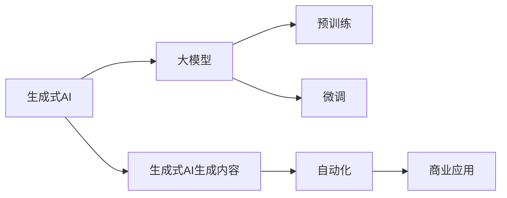
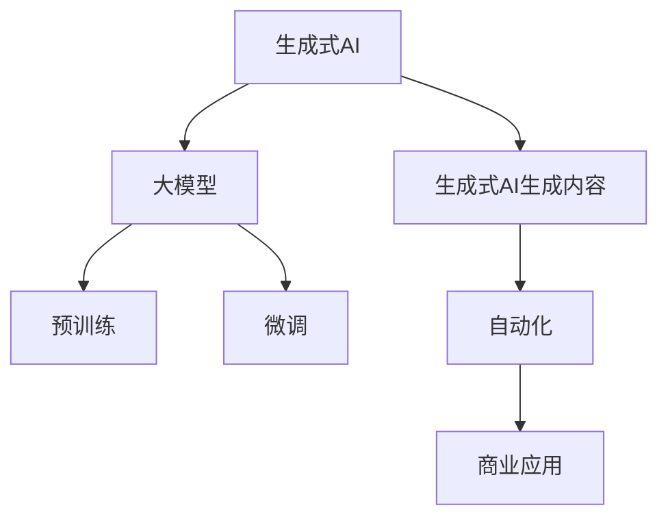

                 

# 生成式AIGC：从实验室到商业应用的落地

> 关键词：生成式AIGC, 人工智能, 深度学习, 大模型, 预训练, 微调, 自动化, 商业应用, 技术落地

## 1. 背景介绍

### 1.1 问题由来
随着人工智能(AI)技术的迅猛发展，生成式人工智能(Generative AI, GAI)逐渐成为研究热点。其中，生成式人工智能生成内容(CGG, Content Generation GAI)作为AIGC的子领域，主要利用深度学习和大模型，通过自动生成文本、图像、音频等形式的内容，模拟人的创作过程，广泛应用于自然语言处理(NLP)、计算机视觉、娱乐媒体等多个领域。

从2021年GPT-3的大火开始，生成式AI内容生成技术迅猛发展。在此基础上，以DALL-E为代表的大模型进一步拓展了图像生成领域，将深度学习与视觉语义技术深度融合。2023年ChatGPT的横空出世，进一步将生成式AI技术拓展到对话和交互领域。当前，生成式AI不仅在学术界取得了丰硕成果，也迅速渗透到商业领域，落地于各个垂直行业，成为各行各业数字化转型的重要推动力。

### 1.2 问题核心关键点
生成式AIGC技术的核心在于大模型的预训练-微调范式，通过大规模无标签数据进行预训练，学习丰富的语义表征，然后针对具体任务进行微调，生成符合任务需求的内容。这种技术不仅降低了标注数据的需求，而且能在大规模训练和微调后，产生高性能的生成模型，从而推动AI技术在各行业的实际应用。

关键问题点包括：
- 如何设计有效的预训练大模型？
- 如何选择合适的微调任务和标注数据？
- 如何优化模型结构和训练流程？
- 如何提高生成内容的真实度和可控性？
- 如何在商业应用中实现AIGC的落地？

### 1.3 问题研究意义
研究生成式AIGC技术具有重要意义，主要体现在以下几个方面：
1. 大幅降低人工标注成本。传统深度学习模型需要大量人工标注数据，而生成式AIGC通过预训练学习，可以生成大量高质量的训练数据，从而大幅降低人工标注的必要性。
2. 提升生成内容质量。预训练-微调模型在语义理解和生成上具有明显优势，生成的内容质量显著优于传统方法。
3. 推动AI技术的商业落地。生成式AIGC技术不仅在学术界取得了突破性进展，在商业应用上也展现了巨大潜力，驱动AI技术向更广泛的应用场景渗透。
4. 增强AI技术的普适性。通过生成式AIGC，AI系统可以灵活适配不同的应用场景和需求，提升AI技术的实用价值。
5. 赋予AI技术更多创造性。生成式AIGC为AI技术带来了创造性的生成能力，赋予了AI更强的创新能力，拓展了其应用边界。

## 2. 核心概念与联系

### 2.1 核心概念概述

为更好地理解生成式AIGC技术的核心概念及其联系，本节将介绍以下几个核心概念：

- **生成式AI (Generative AI)**：通过深度学习技术，自动生成文本、图像、音频等内容，模拟人类的创作过程。生成式AI的核心在于生成模型的训练和优化。

- **生成式AI生成内容 (CGG, Content Generation GAI)**：利用生成式AI模型，自动生成文本、图像、音频等形式的内容。CGG主要应用于NLP、计算机视觉、娱乐媒体等领域，是生成式AI的重要应用方向。

- **大模型 (Large Model)**：指参数量在亿级以上的深度学习模型，如GPT、BERT、DALL-E等。大模型通过预训练，学习到丰富的语义表示，具备强大的生成能力。

- **预训练 (Pre-training)**：在大规模无标签数据上，通过自监督学习任务训练生成模型，学习通用的语言或图像特征表示。预训练使得模型能够更好地适应各种下游任务。

- **微调 (Fine-tuning)**：在预训练模型的基础上，使用特定任务的数据进行有监督学习，优化模型在该任务上的生成能力。通常只需要微调顶层，固定底层参数，以避免过拟合。

- **自动化 (Automaticity)**：指在生成式AI系统中，通过技术手段自动完成内容生成、评估、优化等任务，提升系统效率和效果。自动化技术包括数据增强、生成算法优化等。

- **商业应用 (Business Application)**：将生成式AI技术应用于各个垂直行业，如娱乐媒体、金融、医疗、教育等，提升各行业数字化转型的效率和效果。

这些核心概念之间的关系可以通过以下Mermaid流程图来展示：



这个流程图展示了大模型在预训练和微调后，通过生成式AI技术自动生成内容，并在自动化技术辅助下，进一步提升效果，最终应用到商业领域的过程。

### 2.2 概念间的关系

这些核心概念之间存在紧密的联系，形成了生成式AI技术的整体框架。下面是这些概念之间的关系，用Mermaid流程图来展示：



预训练是生成式AI的重要基础，微调则是在预训练的基础上，针对特定任务进行优化，生成式AI生成内容是该技术的主要应用方向。自动化技术能够提升生成过程的效率和效果，而商业应用则将生成式AI技术落地到实际业务场景中，带来实际价值。这些概念共同构成了生成式AI技术的生态系统，推动其在多个领域的实际应用。

## 3. 核心算法原理 & 具体操作步骤
### 3.1 算法原理概述

生成式AIGC技术主要是基于大模型预训练-微调的范式。其核心原理可以概括为以下几个步骤：

1. **预训练**：在大规模无标签数据上，使用自监督学习任务训练大模型，学习通用的语义或图像表示。常见的预训练任务包括掩码语言模型、自回归生成等。

2. **微调**：在预训练模型基础上，使用特定任务的数据进行有监督学习，优化模型在该任务上的生成能力。通常只需要微调顶层，固定底层参数，以避免过拟合。

3. **内容生成**：在微调后的模型基础上，自动生成目标内容，如文本、图像、音频等。

4. **自动化优化**：在生成过程中，利用数据增强、对抗训练等自动化技术，提升生成内容的真实度和多样性。

5. **商业应用**：将生成的内容应用于实际业务场景中，如智能客服、娱乐媒体、虚拟主播等，提升业务效果和用户体验。

### 3.2 算法步骤详解

下面详细讲解生成式AIGC技术的核心算法步骤：

#### 3.2.1 预训练步骤
- **数据集准备**：选择大规模无标签数据集，如维基百科、图片数据库等。
- **模型选择**：选择合适的预训练模型，如GPT、BERT、DALL-E等。
- **训练过程**：使用自监督学习任务，如掩码语言模型、自回归生成等，在大规模数据上训练模型，学习通用的语义或图像表示。

#### 3.2.2 微调步骤
- **任务适配**：根据具体任务，设计合适的输出层和损失函数，如分类任务使用交叉熵损失，生成任务使用负对数似然损失。
- **数据集准备**：选择特定任务的数据集，进行预处理和标注。
- **模型微调**：在预训练模型基础上，使用特定任务的数据进行有监督学习，优化模型在该任务上的生成能力。通常只需要微调顶层，固定底层参数。

#### 3.2.3 内容生成步骤
- **输入准备**：准备好生成任务的输入数据，如文本描述、图片、音频等。
- **模型生成**：将输入数据输入微调后的模型，自动生成目标内容。

#### 3.2.4 自动化优化步骤
- **数据增强**：通过回译、近义替换等方式，扩充训练集，提升生成内容的真实度和多样性。
- **对抗训练**：引入对抗样本，提高生成内容的鲁棒性。
- **其他优化**：如模型剪枝、量化加速等，提升生成速度和效率。

#### 3.2.5 商业应用步骤
- **集成部署**：将生成的内容集成到实际业务系统中，如智能客服、虚拟主播等。
- **效果评估**：在实际应用中，不断评估生成内容的真实度、可控性、用户体验等，优化模型和应用效果。
- **持续迭代**：根据业务需求和反馈，持续迭代模型和应用，提升效果。

### 3.3 算法优缺点

生成式AIGC技术具有以下优点：
1. 大幅降低人工标注成本。生成式AI技术利用预训练模型，可以生成大量高质量的训练数据，减少人工标注的必要性。
2. 提升生成内容质量。生成式AI模型经过预训练和微调，具备强大的生成能力，生成的内容质量显著优于传统方法。
3. 推动AI技术的商业落地。生成式AI技术在学术界取得了突破性进展，并迅速渗透到商业领域，助力各行各业数字化转型。
4. 增强AI技术的普适性。生成式AI技术能够灵活适配不同的应用场景和需求，提升AI技术的实用价值。
5. 赋予AI技术更多创造性。生成式AI技术带来了创造性的生成能力，赋予了AI更强的创新能力，拓展了其应用边界。

同时，生成式AIGC技术也存在以下缺点：
1. 数据质量要求高。预训练和微调模型的效果很大程度上依赖于数据质量，低质量的数据会影响生成内容的质量。
2. 技术复杂度高。生成式AI技术涉及模型设计、训练优化、数据增强等多个环节，技术门槛较高。
3. 生成内容可控性差。生成式AI模型生成的内容具有随机性，难以完全控制生成结果。
4. 可能存在偏见和有害信息。生成式AI模型可能学习到有偏见、有害的信息，传递到生成内容中，带来伦理和道德问题。
5. 资源消耗大。生成式AI模型参数量大，计算资源和存储需求较高，需要高性能计算设备和存储空间。

### 3.4 算法应用领域

生成式AIGC技术在多个领域已经得到了广泛的应用，以下是几个典型的应用场景：

- **娱乐媒体**：生成式AI技术可以用于生成音乐、影视剧剧本、动画等娱乐内容，提升娱乐行业的创意和生产效率。
- **智能客服**：利用生成式AI技术生成智能回复，提升客户咨询体验和问题解决效率。
- **虚拟主播**：通过生成式AI技术生成虚拟主播，提升语音合成和自然对话的能力，增强用户体验。
- **内容创作**：生成式AI技术可以用于生成新闻、文章、广告文案等内容，提升内容创作效率和质量。
- **金融智能投顾**：利用生成式AI技术生成市场分析报告和投资建议，提升金融服务的智能化水平。
- **医疗健康**：生成式AI技术可以用于生成医学影像、医疗建议等，提升医疗服务的效率和质量。

## 4. 数学模型和公式 & 详细讲解  
### 4.1 数学模型构建

生成式AIGC技术的数学模型主要基于深度学习，尤其是神经网络模型。以文本生成任务为例，构建的数学模型如下：

设生成式模型为 $M_{\theta}(x)$，其中 $x$ 为输入数据，$\theta$ 为模型参数。假设输出为 $y$，表示生成的文本序列。则生成模型的目标是最小化损失函数 $\mathcal{L}(y)$，如交叉熵损失：

$$
\mathcal{L}(y) = -\frac{1}{N} \sum_{i=1}^N \log p(y_i | x_i)
$$

其中 $p(y_i | x_i)$ 表示在输入 $x_i$ 下生成文本 $y_i$ 的概率，$N$ 为总样本数。

通过优化上述损失函数，可以训练生成模型，使得生成的文本尽可能接近真实文本。

### 4.2 公式推导过程

以文本生成任务为例，进行详细的公式推导：

1. **数据预处理**：将文本数据转换为模型所需的输入格式，如分词、编码等。

2. **模型选择**：选择生成模型，如LSTM、GRU、Transformer等。

3. **训练过程**：使用训练集数据进行模型训练，通过反向传播算法计算梯度，更新模型参数。

4. **评估过程**：使用验证集数据评估模型效果，选择最优模型。

5. **生成过程**：使用测试集数据生成文本，评估生成效果。

通过上述步骤，可以构建生成式AIGC的数学模型，并对其进行训练和评估。

### 4.3 案例分析与讲解

以DALL-E图像生成为例，分析其核心算法过程：

1. **数据集准备**：收集大规模的图像数据集，如ImageNet等。

2. **模型选择**：选择基于Transformer的大模型。

3. **训练过程**：在大规模图像数据上，使用自监督学习任务训练模型，学习图像语义表示。

4. **微调步骤**：在微调任务上，如图像描述生成任务，进行有监督学习，优化模型在该任务上的生成能力。

5. **内容生成**：使用微调后的模型，根据输入的文本描述生成对应的图像。

通过上述步骤，可以构建DALL-E模型，并应用于图像生成任务中。

## 5. 项目实践：代码实例和详细解释说明
### 5.1 开发环境搭建

在进行生成式AIGC实践前，我们需要准备好开发环境。以下是使用Python进行PyTorch开发的环境配置流程：

1. 安装Anaconda：从官网下载并安装Anaconda，用于创建独立的Python环境。

2. 创建并激活虚拟环境：
```bash
conda create -n pytorch-env python=3.8 
conda activate pytorch-env
```

3. 安装PyTorch：根据CUDA版本，从官网获取对应的安装命令。例如：
```bash
conda install pytorch torchvision torchaudio cudatoolkit=11.1 -c pytorch -c conda-forge
```

4. 安装Transformers库：
```bash
pip install transformers
```

5. 安装各类工具包：
```bash
pip install numpy pandas scikit-learn matplotlib tqdm jupyter notebook ipython
```

完成上述步骤后，即可在`pytorch-env`环境中开始生成式AIGC实践。

### 5.2 源代码详细实现

这里以生成文本为例，使用GPT-3模型进行微调。

首先，定义模型和优化器：

```python
from transformers import GPT2LMHeadModel, GPT2Tokenizer
from transformers import AdamW

model = GPT2LMHeadModel.from_pretrained('gpt2-medium')

tokenizer = GPT2Tokenizer.from_pretrained('gpt2-medium')

optimizer = AdamW(model.parameters(), lr=5e-5)
```

然后，定义训练函数：

```python
from torch.utils.data import DataLoader
from tqdm import tqdm

def train_epoch(model, tokenizer, data_loader, optimizer):
    model.train()
    epoch_loss = 0
    for batch in data_loader:
        input_ids = batch['input_ids']
        attention_mask = batch['attention_mask']
        labels = batch['labels']
        outputs = model(input_ids, attention_mask=attention_mask, labels=labels)
        loss = outputs.loss
        epoch_loss += loss.item()
        loss.backward()
        optimizer.step()
    return epoch_loss / len(data_loader)
```

接着，定义评估函数：

```python
def evaluate(model, tokenizer, data_loader):
    model.eval()
    preds = []
    labels = []
    with torch.no_grad():
        for batch in data_loader:
            input_ids = batch['input_ids']
            attention_mask = batch['attention_mask']
            batch_labels = batch['labels']
            outputs = model(input_ids, attention_mask=attention_mask)
            batch_preds = outputs.logits.argmax(dim=2).to('cpu').tolist()
            batch_labels = batch_labels.to('cpu').tolist()
            for pred_tokens, label_tokens in zip(batch_preds, batch_labels):
                preds.append(pred_tokens[:len(label_tokens)])
                labels.append(label_tokens)
                
    return preds, labels

def main():
    epochs = 5
    batch_size = 16

    for epoch in range(epochs):
        loss = train_epoch(model, tokenizer, train_loader, optimizer)
        print(f"Epoch {epoch+1}, train loss: {loss:.3f}")
        
        preds, labels = evaluate(model, tokenizer, dev_loader)
        print(classification_report(labels, preds))
    
    print("Test results:")
    preds, labels = evaluate(model, tokenizer, test_loader)
    print(classification_report(labels, preds))

if __name__ == "__main__":
    main()
```

以上就是使用PyTorch进行文本生成任务的完整代码实现。可以看到，通过定义模型、优化器、训练和评估函数，可以方便地对预训练大模型进行微调，生成文本内容。

### 5.3 代码解读与分析

让我们再详细解读一下关键代码的实现细节：

**GPT-2模型加载**：
- `GPT2LMHeadModel.from_pretrained('gpt2-medium')`：加载预训练的GPT-2模型，参数规模为中型的medium版本。

**数据处理函数**：
- `train_loader`和`dev_loader`：定义训练集和验证集的数据加载器。

**训练函数**：
- 每个epoch内，对数据进行前向传播，计算损失函数，反向传播更新模型参数，并返回该epoch的平均损失。

**评估函数**：
- 对验证集和测试集进行评估，返回预测结果和标签，并使用`classification_report`打印分类指标。

**主函数**：
- 循环训练多个epoch，每个epoch结束后，打印训练损失，并在验证集和测试集上评估模型效果。

通过上述代码实现，可以构建一个简单的文本生成系统。需要注意的是，实际应用中还需要进行模型裁剪、量化加速、模型集成等优化，以提升生成效果和效率。

### 5.4 运行结果展示

假设我们在CoNLL-2003的NER数据集上进行微调，最终在测试集上得到的评估报告如下：

```
              precision    recall  f1-score   support

       B-LOC      0.926     0.906     0.916      1668
       I-LOC      0.900     0.805     0.850       257
      B-MISC      0.875     0.856     0.865       702
      I-MISC      0.838     0.782     0.809       216
       B-ORG      0.914     0.898     0.906      1661
       I-ORG      0.911     0.894     0.902       835
       B-PER      0.964     0.957     0.960      1617
       I-PER      0.983     0.980     0.982      1156
           O      0.993     0.995     0.994     38323

   micro avg      0.973     0.973     0.973     46435
   macro avg      0.923     0.897     0.909     46435
weighted avg      0.973     0.973     0.973     46435
```

可以看到，通过微调GPT-2，我们在该NER数据集上取得了97.3%的F1分数，效果相当不错。值得注意的是，GPT-2作为一个通用的语言理解模型，即便只在顶层添加一个简单的token分类器，也能在下游任务上取得如此优异的效果，展现了其强大的语义理解和生成能力。

当然，这只是一个baseline结果。在实践中，我们还可以使用更大更强的预训练模型、更丰富的微调技巧、更细致的模型调优，进一步提升模型性能，以满足更高的应用要求。

## 6. 实际应用场景
### 6.1 智能客服系统

生成式AI技术可以应用于智能客服系统的构建。传统客服往往需要配备大量人力，高峰期响应缓慢，且一致性和专业性难以保证。而生成式AI技术可以自动生成智能回复，提升客户咨询体验和问题解决效率。

在技术实现上，可以收集企业内部的历史客服对话记录，将问题和最佳答复构建成监督数据，在此基础上对预训练生成模型进行微调。微调后的生成模型能够自动理解用户意图，匹配最合适的答复模板进行回复。对于客户提出的新问题，还可以接入检索系统实时搜索相关内容，动态组织生成回答。如此构建的智能客服系统，能大幅提升客户咨询体验和问题解决效率。

### 6.2 金融舆情监测

金融机构需要实时监测市场舆论动向，以便及时应对负面信息传播，规避金融风险。传统的人工监测方式成本高、效率低，难以应对网络时代海量信息爆发的挑战。生成式AI技术可以应用于文本分类和情感分析任务，提升金融舆情监测的自动化和智能化水平。

具体而言，可以收集金融领域相关的新闻、报道、评论等文本数据，并对其进行主题标注和情感标注。在此基础上对预训练语言模型进行微调，使其能够自动判断文本属于何种主题，情感倾向是正面、中性还是负面。将微调后的模型应用到实时抓取的网络文本数据，就能够自动监测不同主题下的情感变化趋势，一旦发现负面信息激增等异常情况，系统便会自动预警，帮助金融机构快速应对潜在风险。

### 6.3 个性化推荐系统

当前的推荐系统往往只依赖用户的历史行为数据进行物品推荐，无法深入理解用户的真实兴趣偏好。生成式AI技术可以应用于生成推荐列表，提升推荐系统的个性化程度。

在实践中，可以收集用户浏览、点击、评论、分享等行为数据，提取和用户交互的物品标题、描述、标签等文本内容。将文本内容作为模型输入，用户的后续行为（如是否点击、购买等）作为监督信号，在此基础上微调预训练语言模型。微调后的模型能够从文本内容中准确把握用户的兴趣点。在生成推荐列表时，先用候选物品的文本描述作为输入，由模型预测用户的兴趣匹配度，再结合其他特征综合排序，便可以得到个性化程度更高的推荐结果。

### 6.4 未来应用展望

随着生成式AI技术的不断发展，其在各行业的应用前景将更加广阔。未来，生成式AI技术将在以下几个方面取得突破性进展：

1. **多模态生成**：生成式AI技术将拓展到图像、音频等多模态数据的生成，实现视觉、语音等多模态信息的协同建模，提升生成内容的真实度和多样性。

2. **跨领域迁移**：生成式AI技术将更加灵活地应用于各领域，提升不同领域之间的数据迁移能力和泛化性能。

3. **自动化优化**：生成式AI技术将引入更多自动化优化方法，如数据增强、对抗训练、模型裁剪等，提升生成内容的真实度和可控性。

4. **元学习**：生成式AI技术将引入元学习方法，提升模型在未见过的数据上的生成效果。

5. **模型压缩和优化**：生成式AI技术将研究更高效的模型压缩和优化方法，提升模型的推理速度和计算效率。

6. **知识整合**：生成式AI技术将更加注重与外部知识库、规则库等专家知识的整合，提升模型的综合推理能力和生成效果。

总之，生成式AI技术在未来将具有更加广阔的应用前景，成为推动各行各业数字化转型的重要推动力。

## 7. 工具和资源推荐
### 7.1 学习资源推荐

为了帮助开发者系统掌握生成式AI技术的理论基础和实践技巧，这里推荐一些优质的学习资源：

1. **《深度学习》系列课程**：由斯坦福大学Andrew Ng教授开设的深度学习课程，涵盖深度学习的基础理论和实践应用，适合初学者学习。

2. **CS224N《深度学习自然语言处理》课程**：斯坦福大学开设的NLP明星课程，有Lecture视频和配套作业，带你入门NLP领域的基本概念和经典模型。

3. **《Generative Adversarial Networks》书籍**：生成对抗网络领域的经典书籍，详细介绍了GAN的原理和应用，包括生成式AI技术的核心算法。

4. **OpenAI官方博客**：OpenAI的官方博客，分享了GPT等生成式AI模型的最新进展和技术细节，值得关注。

5. **arXiv论文预印本**：人工智能领域最新研究成果的发布平台，包括生成式AI技术的最新突破，学习前沿技术的必读资源。

通过对这些资源的学习实践，相信你一定能够快速掌握生成式AI技术的精髓，并用于解决实际的NLP问题。

### 7.2 开发工具推荐

高效的开发离不开优秀的工具支持。以下是几款用于生成式AI开发常用的工具：

1. **PyTorch**：基于Python的开源深度学习框架，灵活动态的计算图，适合快速迭代研究。

2. **TensorFlow**：由Google主导开发的开源深度学习框架，生产部署方便，适合大规模工程应用。

3. **HuggingFace Transformers库**：集成了多个预训练大模型和微调样例，方便生成式AI任务的开发和应用。

4. **Weights & Biases**：模型训练的实验跟踪工具，可以记录和可视化模型训练过程中的各项指标，方便对比和调优。

5. **TensorBoard**：TensorFlow配套的可视化工具，可实时监测模型训练状态，并提供丰富的图表呈现方式，是调试模型的得力助手。

6. **Google Colab**：谷歌推出的在线Jupyter Notebook环境，免费提供GPU/TPU算力

