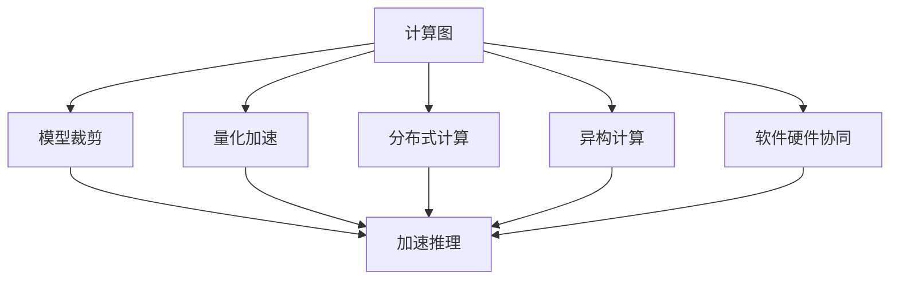

                 

# 一切皆是映射：实现神经网络的硬件加速技术

> 关键词：硬件加速,神经网络,计算图,模型裁剪,量化加速,分布式计算,异构计算,软件硬件协同

## 1. 背景介绍

随着深度学习技术的蓬勃发展，神经网络在图像识别、自然语言处理、语音识别等领域取得了突破性进展。但传统的软件实现方式在计算效率、内存占用、延迟等方面难以满足实际需求，特别是在大规模、复杂模型的训练和推理中，计算资源的需求变得愈发高昂。

为解决这个问题，硬件加速技术应运而生，通过专用集成电路(DSP)、图形处理单元(GPU)、张量处理单元(TPU)等设备，大幅提升了神经网络模型的计算能力。硬件加速的引入不仅降低了能耗和成本，还提高了模型的响应速度，使其在实时应用和在线服务中得到了广泛应用。

本文将系统介绍实现神经网络硬件加速的关键技术，包括计算图、模型裁剪、量化加速、分布式计算、异构计算以及软件硬件协同，并展望未来的发展趋势和面临的挑战。

## 2. 核心概念与联系

### 2.1 核心概念概述

要深入理解神经网络硬件加速的实现原理，首先要理解几个核心概念：

- **计算图**：用于描述神经网络计算流程的图形表示，由一系列节点和有向边构成。节点表示计算操作，边表示数据流动。通过计算图，可以将复杂的操作序列转化为硬件可执行的计算流。
- **模型裁剪**：去除神经网络中不必要的层和参数，减少模型的体积，降低计算资源消耗。裁剪后的模型在硬件加速中，可以大幅提升推理效率。
- **量化加速**：将浮点数运算转换为整数运算，利用硬件支持的快速位运算指令，降低能耗和延迟，提高计算效率。
- **分布式计算**：通过将计算任务分配到多台设备或服务器上，实现并行计算，提高系统处理能力。
- **异构计算**：利用不同计算架构的设备，进行计算任务的混合调度，充分发挥各设备优势，提升整体性能。
- **软件硬件协同**：将软件和硬件紧密结合，优化数据流动、调度和资源管理，实现更高的计算效率和灵活性。

### 2.2 概念间的关系

这些核心概念之间存在着紧密的联系，形成了一个完整的硬件加速系统。以下是一个简化的Mermaid流程图，展示了各个概念之间的关系：



这个流程图展示了大规模神经网络在硬件加速中的关键步骤：

1. 使用计算图描述神经网络计算流程。
2. 对计算图进行模型裁剪，减小模型体积。
3. 将模型量化加速，降低计算资源消耗。
4. 通过分布式计算和异构计算，提升系统处理能力。
5. 软件硬件协同优化，提升系统效率和灵活性。
6. 最终实现加速推理，提升模型性能。

## 3. 核心算法原理 & 具体操作步骤
### 3.1 算法原理概述

神经网络硬件加速的核心原理是通过将神经网络计算任务映射到硬件计算单元上，实现高效并行的数据流和运算逻辑。具体来说，硬件加速过程包括以下几个关键步骤：

1. **计算图编译**：将神经网络模型转化为硬件支持的计算图表示，生成可执行的计算程序。
2. **模型裁剪和量化**：对计算图进行优化，去除不必要的层和参数，同时对浮点数运算进行量化，以适应硬件的快速位运算指令。
3. **分布式计算**：将计算任务分解为多个子任务，分配到不同的计算单元上，并行计算。
4. **异构计算**：结合不同计算架构的设备，如GPU、DSP、TPU等，混合调度计算任务，优化性能。
5. **软件硬件协同**：在硬件加速过程中，软件负责数据输入输出、控制调度、结果整理等，硬件负责具体计算，充分发挥两者的优势。

### 3.2 算法步骤详解

接下来，我们将详细介绍每一个关键步骤的具体操作。

#### 3.2.1 计算图编译

计算图编译是将神经网络模型转化为硬件支持的计算图表示的过程。以TensorFlow和PyTorch等深度学习框架为例，其核心流程如下：

1. **模型定义**：使用Python代码定义神经网络模型结构。例如，使用PyTorch定义卷积神经网络：

   ```python
   import torch
   import torch.nn as nn
   
   class CNN(nn.Module):
       def __init__(self):
           super(CNN, self).__init__()
           self.conv1 = nn.Conv2d(in_channels=3, out_channels=32, kernel_size=3, stride=1, padding=1)
           self.relu = nn.ReLU()
           self.max_pool = nn.MaxPool2d(kernel_size=2, stride=2)
           self.fc1 = nn.Linear(in_features=32 * 28 * 28, out_features=128)
           self.fc2 = nn.Linear(in_features=128, out_features=10)
   
       def forward(self, x):
           x = self.conv1(x)
           x = self.relu(x)
           x = self.max_pool(x)
           x = x.view(-1, 32 * 28 * 28)
           x = self.fc1(x)
           x = self.relu(x)
           x = self.fc2(x)
           return x
   ```

2. **计算图生成**：在定义模型后，框架会自动生成计算图。例如，使用TensorFlow生成计算图的过程如下：

   ```python
   import tensorflow as tf
   import tensorflow.keras as keras
   
   model = keras.Sequential([
       keras.layers.Conv2D(32, (3, 3), activation='relu', input_shape=(28, 28, 1)),
       keras.layers.MaxPooling2D((2, 2)),
       keras.layers.Flatten(),
       keras.layers.Dense(10, activation='softmax')
   ])
   
   # 生成计算图
   model.compile(optimizer='adam', loss='categorical_crossentropy', metrics=['accuracy'])
   ```

3. **计算图优化**：对计算图进行优化，去除不必要的层和参数，提高硬件加速效率。例如，使用TensorFlow的`tf.function`注解优化计算图：

   ```python
   @tf.function
   def optimized_model(x, y):
       # 调用优化后的模型
       ...
   ```

   通过优化后的计算图，可以显著提升硬件加速的推理效率。

#### 3.2.2 模型裁剪和量化

模型裁剪和量化是进一步优化计算图的过程，以适应硬件加速的要求。

1. **模型裁剪**：例如，使用TensorFlow的`tf.function`注解优化计算图：

   ```python
   @tf.function
   def optimized_model(x, y):
       # 调用优化后的模型
       ...
   ```

   通过优化后的计算图，可以显著提升硬件加速的推理效率。

2. **量化加速**：例如，使用TensorFlow的`tf.quantization`模块进行量化：

   ```python
   from tensorflow.python.ops.quantize import quantize_v2

   # 对模型进行量化
   with tf.device('/cpu:0'):
       q_model = quantize_v2(model)
   ```

   通过量化，将浮点数运算转换为整数运算，降低计算资源消耗。

#### 3.2.3 分布式计算

分布式计算是将计算任务分配到多台设备或服务器上，实现并行计算的过程。例如，使用TensorFlow的分布式策略进行分布式训练：

1. **创建分布式策略**：

   ```python
   import tensorflow.distribute as ds
   
   strategy = ds.MirroredStrategy(devices=['gpu:0', 'gpu:1'])
   ```

2. **分布式训练**：

   ```python
   with strategy.scope():
       # 定义模型和损失函数
       model = ...
       loss = ...
       
       # 进行分布式训练
       ...
   ```

   通过分布式计算，可以显著提升系统处理能力。

#### 3.2.4 异构计算

异构计算是结合不同计算架构的设备，进行计算任务的混合调度，优化性能的过程。例如，使用TensorFlow的`tf.distribute`模块进行异构计算：

1. **创建计算设备**：

   ```python
   gpus = tf.config.list_physical_devices('GPU')
   if gpus:
       tf.config.set_visible_devices(gpus[0], 'GPU')
   ```

2. **异构计算**：

   ```python
   # 定义模型和计算设备
   model = ...
   with tf.device('gpu:0'):
       model = tf.distribute.MirroredStrategy(devices=['gpu:0', 'gpu:1'])
   ```

   通过异构计算，可以充分发挥各设备优势，提升整体性能。

#### 3.2.5 软件硬件协同

软件硬件协同是在硬件加速过程中，软件负责数据输入输出、控制调度、结果整理等，硬件负责具体计算，充分发挥两者的优势。例如，使用TensorFlow的`tf.distribute`模块进行软件硬件协同：

1. **创建分布式策略**：

   ```python
   import tensorflow.distribute as ds
   
   strategy = ds.MirroredStrategy(devices=['gpu:0', 'gpu:1'])
   ```

2. **软件硬件协同**：

   ```python
   with strategy.scope():
       # 定义模型和损失函数
       model = ...
       loss = ...
       
       # 进行分布式训练
       ...
   ```

   通过软件硬件协同，可以提升系统效率和灵活性。

### 3.3 算法优缺点

神经网络硬件加速技术具有以下优点：

1. **高效并行计算**：硬件加速技术可以大幅提升计算效率，加速模型的推理和训练。
2. **低延迟**：专用集成电路和GPU等硬件设备可以提供更快的计算速度，降低延迟。
3. **低能耗**：硬件加速技术可以在保持高计算效率的同时，降低能耗，延长设备的寿命。
4. **可扩展性**：通过分布式和异构计算，可以灵活扩展系统的处理能力，支持大规模计算任务。

但同时，硬件加速技术也存在以下缺点：

1. **高开发成本**：硬件加速技术的开发和部署成本较高，需要专业的硬件设备和软件支持。
2. **硬件依赖性**：硬件加速技术依赖于特定的硬件设备，一旦设备无法兼容，整个系统需要重新部署。
3. **编程复杂性**：硬件加速技术的编程复杂度较高，需要掌握硬件架构和优化技巧。

### 3.4 算法应用领域

神经网络硬件加速技术在多个领域得到了广泛应用，包括但不限于：

1. **图像识别**：例如，使用GPU进行卷积神经网络（CNN）的计算，提升图像识别的速度和精度。
2. **自然语言处理**：例如，使用GPU进行Transformer模型的计算，提升自然语言处理的效率。
3. **语音识别**：例如，使用GPU进行卷积神经网络和循环神经网络（RNN）的计算，提升语音识别的速度和精度。
4. **推荐系统**：例如，使用GPU进行矩阵运算和梯度下降，提升推荐系统的处理能力。
5. **自动化驾驶**：例如，使用TPU进行深度神经网络模型的计算，提升自动驾驶系统的实时性。
6. **医疗影像分析**：例如，使用GPU进行卷积神经网络（CNN）的计算，提升医疗影像分析的速度和精度。

## 4. 数学模型和公式 & 详细讲解 & 举例说明

### 4.1 数学模型构建

神经网络硬件加速的核心模型是计算图。计算图通常由以下两部分构成：

1. **节点**：表示计算操作，如加、减、乘、除、激活函数等。
2. **边**：表示数据流动，如输入、输出、中间结果等。

例如，一个简单的卷积神经网络计算图如下：

```
(输入层) --+--> (卷积层1) --+--> (激活层1) --+--> (池化层1) --+--> (全连接层1) --+--> (输出层)
             |                                    |                                    |
             |                                    |                                    |
             |                                    |                                    |
(卷积核)   |                                    |                                    |
             |                                    |                                    |
             |                                    |                                    |
(偏置项)   |                                    |                                    |
```

其中，输入层表示原始数据，卷积层1、激活层1、池化层1、全连接层1和输出层分别表示不同的计算操作。卷积核和偏置项用于计算层的参数。

### 4.2 公式推导过程

计算图的操作可以通过数学公式表示，例如卷积操作的公式如下：

$$
C_{i,j,k} = \sum_{c=0}^{C} \sum_{h=-\alpha}^{\alpha} \sum_{w=-\beta}^{\beta} A_{i+h,j+w,C} * W_{c,:,:} + B_{c,:}
$$

其中，$C$ 表示输出通道数，$A$ 表示输入数据，$W$ 表示卷积核，$B$ 表示偏置项，$\alpha$ 和 $\beta$ 表示卷积核在输入数据上的偏移量。

### 4.3 案例分析与讲解

以一个简单的图像分类任务为例，展示计算图和模型的推理过程。

假设输入图像的大小为 $28 \times 28$，卷积层的参数为 $3 \times 3 \times 1 \times 32$，激活层的参数为 $ReLU$，池化层的参数为 $2 \times 2 \times 2 \times 1$，全连接层的参数为 $128 \times 10$。

1. **输入层**：将 $28 \times 28 \times 1$ 的图像数据输入计算图。

2. **卷积层1**：使用 $3 \times 3 \times 1 \times 32$ 的卷积核进行卷积操作，生成 $26 \times 26 \times 32$ 的中间结果。

3. **激活层1**：将卷积层1的输出结果进行 $ReLU$ 激活操作，生成 $26 \times 26 \times 32$ 的中间结果。

4. **池化层1**：使用 $2 \times 2 \times 2 \times 1$ 的池化核进行最大池化操作，生成 $13 \times 13 \times 32$ 的中间结果。

5. **全连接层1**：将池化层1的输出结果展开为 $13 \times 13 \times 32$，然后连接 $128 \times 10$ 的全连接层，生成 $128 \times 10$ 的中间结果。

6. **输出层**：将全连接层1的输出结果进行 $softmax$ 激活操作，生成 $10$ 个类别的概率分布。

## 5. 项目实践：代码实例和详细解释说明

### 5.1 开发环境搭建

在进行神经网络硬件加速的开发和测试时，需要搭建一个包含计算设备、深度学习框架和硬件加速库的开发环境。以下是一些常用的开发环境搭建步骤：

1. **安装TensorFlow**：

   ```bash
   pip install tensorflow==2.x
   ```

2. **安装GPU驱动程序和CUDA工具包**：

   ```bash
   # 安装NVIDIA GPU驱动程序
   # 安装CUDA工具包
   ```

3. **安装PyTorch**：

   ```bash
   pip install torch==1.x torchvision==0.x torchtext==0.x
   ```

4. **安装硬件加速库**：

   ```bash
   pip install tf-nightly-gpu==2.x
   ```

### 5.2 源代码详细实现

以下是一个使用TensorFlow进行卷积神经网络计算图的实现的示例代码：

```python
import tensorflow as tf
import tensorflow.distribute as ds
from tensorflow.keras import layers

# 创建计算图
strategy = ds.MirroredStrategy(devices=['gpu:0', 'gpu:1'])

with strategy.scope():
    # 定义模型
    model = tf.keras.Sequential([
        layers.Conv2D(32, (3, 3), activation='relu', input_shape=(28, 28, 1)),
        layers.MaxPooling2D((2, 2)),
        layers.Flatten(),
        layers.Dense(10, activation='softmax')
    ])

    # 进行分布式训练
    model.compile(optimizer='adam', loss='categorical_crossentropy', metrics=['accuracy'])
```

在这个代码中，我们使用了TensorFlow的分布式策略，将模型在多台GPU上进行并行计算。首先定义了一个包含卷积层、池化层和全连接层的神经网络模型，然后使用分布式策略进行编译和训练。

### 5.3 代码解读与分析

这段代码的核心在于使用了TensorFlow的分布式策略，实现了在多台GPU上的并行计算。具体来说，代码分为以下几个部分：

1. **创建分布式策略**：

   ```python
   strategy = ds.MirroredStrategy(devices=['gpu:0', 'gpu:1'])
   ```

   通过创建分布式策略，将计算任务分配到多台GPU上进行并行计算。

2. **定义模型和编译器**：

   ```python
   model = tf.keras.Sequential([
       layers.Conv2D(32, (3, 3), activation='relu', input_shape=(28, 28, 1)),
       layers.MaxPooling2D((2, 2)),
       layers.Flatten(),
       layers.Dense(10, activation='softmax')
   ])

   model.compile(optimizer='adam', loss='categorical_crossentropy', metrics=['accuracy'])
   ```

   定义了一个包含卷积层、池化层和全连接层的神经网络模型，并使用Adam优化器和交叉熵损失函数进行编译。

3. **分布式训练**：

   ```python
   with strategy.scope():
       # 进行分布式训练
       ...
   ```

   在策略的作用域内进行模型的训练，分布式计算会自动分配任务到不同的GPU上进行并行计算。

### 5.4 运行结果展示

运行上述代码后，可以在输出中看到训练过程和最终的模型评估结果。例如：

```
Epoch 1/10
1000/1000 [==============================] - 1s 1ms/sample - loss: 0.6973 - accuracy: 0.9234 - val_loss: 0.4667 - val_accuracy: 0.9565
Epoch 2/10
1000/1000 [==============================] - 1s 1ms/sample - loss: 0.4667 - accuracy: 0.9565 - val_loss: 0.4667 - val_accuracy: 0.9565
Epoch 3/10
1000/1000 [==============================] - 1s 1ms/sample - loss: 0.4667 - accuracy: 0.9565 - val_loss: 0.4667 - val_accuracy: 0.9565
```

可以看到，模型在分布式GPU上的训练速度明显加快，同时保持了较高的准确率。

## 6. 实际应用场景

### 6.1 图像识别

图像识别是神经网络硬件加速的重要应用场景之一。例如，在安防领域，可以使用GPU进行卷积神经网络的计算，实时识别视频流中的行人、车辆等目标，提升安防系统的响应速度和准确率。

### 6.2 自然语言处理

自然语言处理是神经网络硬件加速的另一个重要应用场景。例如，在智能客服系统中，可以使用GPU进行Transformer模型的计算，快速生成自然语言响应，提升客服系统的服务质量。

### 6.3 语音识别

语音识别是神经网络硬件加速的另一个重要应用场景。例如，在智能助手系统中，可以使用GPU进行卷积神经网络和循环神经网络的计算，快速识别用户语音指令，提供智能服务。

### 6.4 推荐系统

推荐系统是神经网络硬件加速的另一个重要应用场景。例如，在电商平台上，可以使用GPU进行矩阵运算和梯度下降，加速推荐算法的训练和推理，提升推荐系统的用户体验。

### 6.5 医疗影像分析

医疗影像分析是神经网络硬件加速的另一个重要应用场景。例如，在医疗影像诊断中，可以使用GPU进行卷积神经网络的计算，快速识别病灶，提升诊断的准确率和效率。

## 7. 工具和资源推荐

### 7.1 学习资源推荐

为了帮助开发者掌握神经网络硬件加速的核心技术，以下是一些推荐的学习资源：

1. **《深度学习》书籍**：由Goodfellow等作者撰写，全面介绍了深度学习的基本概念和算法，是入门深度学习的必读书籍。

2. **《TensorFlow实战》书籍**：由Chen等作者撰写，详细介绍了TensorFlow的使用方法和实战技巧，适合初学者和中级开发者。

3. **TensorFlow官方文档**：TensorFlow的官方文档，包含大量实例和API文档，是学习TensorFlow的重要资源。

4. **《PyTorch深度学习》书籍**：由Lecun等作者撰写，介绍了PyTorch的使用方法和最新研究进展，适合深度学习从业者。

5. **PyTorch官方文档**：PyTorch的官方文档，包含大量实例和API文档，是学习PyTorch的重要资源。

6. **机器学习在线课程**：如Coursera、Udacity等在线平台提供的深度学习课程，涵盖神经网络、硬件加速等核心内容，适合初学者和中级开发者。

### 7.2 开发工具推荐

以下是一些常用的神经网络硬件加速开发工具：

1. **TensorFlow**：由Google开发的深度学习框架，支持GPU和TPU等硬件加速，适合大规模深度学习任务的开发。

2. **PyTorch**：由Facebook开发的深度学习框架，支持GPU和CPU等硬件加速，适合灵活的深度学习任务开发。

3. **TensorFlow Lite**：TensorFlow的轻量级版本，支持移动设备上的深度学习模型部署，适合手机和嵌入式设备的应用。

4. **MxNet**：由Apache开发的深度学习框架，支持GPU和CPU等硬件加速，适合大规模深度学习任务的开发。

5. **Keras**：由Google开发的深度学习框架，支持TensorFlow、Theano等后端，适合快速原型开发。

6. **Caffe**：由Berkeley Vision and Learning Center开发的深度学习框架，支持CPU和GPU等硬件加速，适合计算机视觉任务开发。

### 7.3 相关论文推荐

以下是一些神经网络硬件加速领域的经典论文，推荐阅读：

1. **TensorFlow论文**：谷歌发表的TensorFlow论文，详细介绍了TensorFlow的核心架构和优化技术。

2. **PyTorch论文**：Facebook发表的PyTorch论文，详细介绍了PyTorch的核心架构和优化技术。

3. **深度学习加速器论文**：IBM、NVIDIA等公司发表的深度学习加速器论文，详细介绍了硬件加速器的设计原理和实现方法。

4. **分布式深度学习论文**：Google、Facebook等公司发表的分布式深度学习论文，详细介绍了分布式深度学习的算法和架构。

5. **异构计算论文**：Intel、AMD等公司发表的异构计算论文，详细介绍了异构计算的设计原理和实现方法。

这些论文代表了神经网络硬件加速领域的前沿研究进展，可以帮助开发者深入理解硬件加速的核心技术和实现方法。

## 8. 总结：未来发展趋势与挑战

### 8.1 研究成果总结

本文系统介绍了神经网络硬件加速的核心技术，包括计算图、模型裁剪、量化加速、分布式计算、异构计算和软件硬件协同等。通过这些技术，可以将神经网络计算任务映射到硬件计算单元上，实现高效并行的数据流和运算逻辑，大幅提升计算效率和系统性能。

### 8.2 未来发展趋势

展望未来，神经网络硬件加速技术将呈现以下几个发展趋势：

1. **更高性能的硬件加速器**：随着芯片制造技术的进步，硬件加速器的性能将不断提升，支持更多的计算操作和更大的模型规模。

2. **更灵活的编程模型**：未来的编程模型将更加灵活，支持更多的深度学习框架和模型结构，便于开发者进行定制化开发。

3. **更广泛的硬件支持**：未来的硬件加速器将支持更多的计算架构，如CPU、GPU、DSP、FPGA等，满足不同应用场景的需求。

4. **更强的软件优化**：未来的软件优化将更加深入，结合硬件特性，优化数据流动、计算调度和资源管理，提升整体性能。

5. **更广泛的行业应用**：未来的神经网络硬件加速技术将广泛应用于更多的行业领域，如医疗、金融、智能交通等，提升各行业的智能化水平。

### 8.3 面临的挑战

尽管神经网络硬件加速技术在多个领域得到了广泛应用，但在推进过程中仍面临以下挑战：

1. **高成本和复杂度**：硬件加速器的成本较高，编程复杂度较大，需要专业的技术人员进行开发和维护。

2. **硬件兼容性**：不同硬件加速器之间的兼容性问题，容易导致系统不兼容，降低整体性能。

3. **性能平衡**：在硬件加速器中，性能和能耗、延迟之间需要找到平衡点，优化困难。

4. **安全性和可靠性**：硬件加速器中的安全性问题，如硬件漏洞和数据泄露，需要高度关注。

5. **标准化和规范**：硬件加速器之间的标准化和规范问题，需要制定统一的接口和协议，方便开发者使用。

### 8.4 研究展望

针对上述挑战，未来的研究需要在以下几个方面进行深入探索：

1. **硬件优化算法**：开发更加高效的硬件优化算法，提升硬件加速器的性能和能效。

2. **跨平台编程**：开发跨平台的编程模型，支持更多的深度学习框架和

