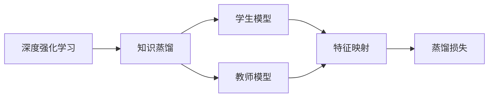
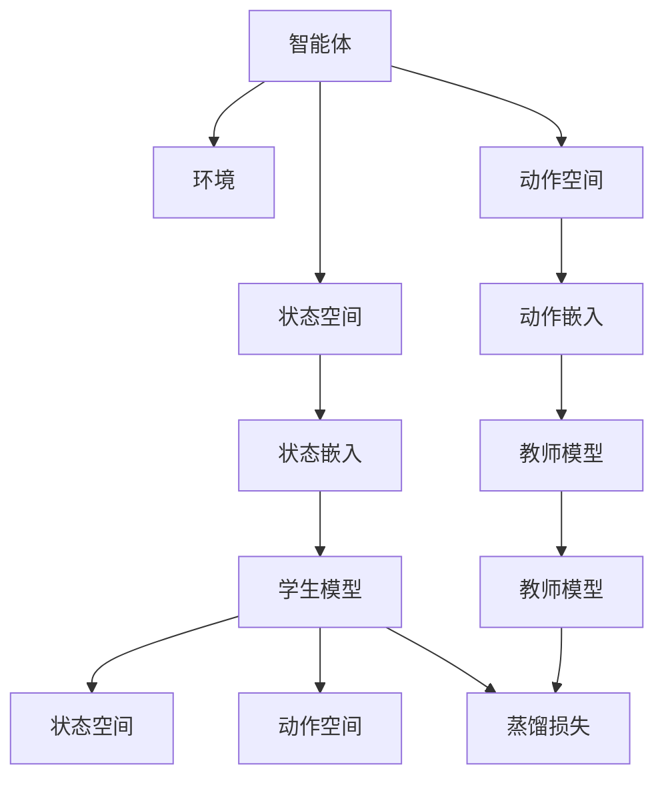

                 

# 一切皆是映射：深度强化学习中的知识蒸馏：DQN的案例实践

## 1. 背景介绍

### 1.1 问题由来
深度强化学习（Deep Reinforcement Learning，DRL）是机器学习领域的前沿研究方向之一，它将深度神经网络与强化学习相结合，通过智能体（agent）与环境（environment）交互，实现自动化的决策过程。然而，DRL模型通常非常复杂，训练过程耗时长、资源需求高，难以在实际应用中推广。

### 1.2 问题核心关键点
针对DRL模型训练耗时长、资源需求高的问题，知识蒸馏（Knowledge Distillation，KD）技术应运而生。KD技术旨在通过将知识从高精度模型（教师模型）迁移到低精度模型（学生模型），使学生模型能够在少资源的情况下快速达到高精度模型的效果。知识蒸馏技术广泛适用于深度强化学习任务，通过将教师模型的高阶特征映射到学生模型，可以在不增加模型复杂度和训练成本的情况下，提升学生模型的性能。

### 1.3 问题研究意义
研究深度强化学习中的知识蒸馏技术，对于加速DRL模型的训练、降低资源消耗、提升模型性能具有重要意义：

1. **加速训练**：通过知识蒸馏，学生模型能够快速学习到教师模型的知识，从而显著缩短训练时间。
2. **降低资源消耗**：知识蒸馏可以在有限的资源条件下提升模型性能，降低对计算资源和存储需求。
3. **提升性能**：知识蒸馏通过高阶特征的传递，提升学生模型的泛化能力和决策质量。
4. **减少过拟合**：知识蒸馏能够减少学生模型对特定训练样本的依赖，降低过拟合风险。

## 2. 核心概念与联系

### 2.1 核心概念概述

为更好地理解深度强化学习中的知识蒸馏技术，本节将介绍几个密切相关的核心概念：

- **深度强化学习（DRL）**：结合深度神经网络和强化学习的框架，智能体通过与环境交互，学习最优策略以最大化长期回报。
- **知识蒸馏（KD）**：通过将高精度模型的知识迁移到低精度模型中，使低精度模型能够在少资源条件下达到高精度模型的性能。
- **学生模型（Student Model）**：经过知识蒸馏的模型，通常结构简单、参数少，用于在有限资源下达到教师模型的效果。
- **教师模型（Teacher Model）**：高精度模型，通常结构复杂、参数多，用于知识蒸馏的源头。
- **特征映射（Feature Mapping）**：通过特征提取和压缩，将教师模型的高阶特征传递到学生模型。
- **蒸馏损失（Distillation Loss）**：用于衡量学生模型与教师模型之间输出差异的损失函数，用于指导学生模型的训练。

### 2.2 概念间的关系

这些核心概念之间的逻辑关系可以通过以下Mermaid流程图来展示：



这个流程图展示了大语言模型微调过程中各个核心概念的关系和作用：

1. 深度强化学习（A）中的智能体通过与环境交互学习最优策略。
2. 知识蒸馏（B）通过将高精度模型（D）的知识传递到低精度模型（C），提高学生模型的性能。
3. 特征映射（E）将教师模型的高阶特征传递到学生模型。
4. 蒸馏损失（F）用于衡量学生模型与教师模型之间的差异，指导学生模型的训练。

### 2.3 核心概念的整体架构

最后，我们用一个综合的流程图来展示这些核心概念在大语言模型微调过程中的整体架构：



这个综合流程图展示了深度强化学习中的智能体、环境、状态和动作空间，以及学生模型和教师模型的关系和作用。学生模型通过状态嵌入和动作嵌入与智能体交互，教师模型通过蒸馏损失指导学生模型的训练。

## 3. 核心算法原理 & 具体操作步骤
### 3.1 算法原理概述

深度强化学习中的知识蒸馏技术，其核心思想是将高精度模型（教师模型）的知识迁移到低精度模型（学生模型）中。这种迁移通常通过特征映射实现，即学生模型通过学习教师模型的特征表示，提升自身的预测能力。

形式化地，假设教师模型为 $M_T$，学生模型为 $M_S$，学生模型的输入为 $x$，输出为 $y$。知识蒸馏的目标是通过最小化学生模型与教师模型之间的损失函数 $L$，使学生模型能够尽可能地模拟教师模型的输出。具体来说，可以定义以下蒸馏损失：

$$
L_{KD} = L_{\text{KL}} + L_{\text{adv}}
$$

其中 $L_{\text{KL}}$ 为KL散度损失，衡量学生模型与教师模型之间的分布差异，$L_{\text{adv}}$ 为对抗损失，进一步提升学生模型的泛化能力。

### 3.2 算法步骤详解

深度强化学习中的知识蒸馏一般包括以下几个关键步骤：

**Step 1: 准备教师模型和学生模型**

- 选择合适的教师模型 $M_T$ 作为知识源，可以是已训练的高精度模型，如DQN、ResNet等。
- 设计并训练学生模型 $M_S$，通常为结构简单、参数少的模型，如MLP、CNN等。

**Step 2: 特征映射**

- 使用特征映射技术，将教师模型的特征表示传递到学生模型中。常见的特征映射方法包括：
  - 特征蒸馏：直接将教师模型的输出特征传递到学生模型。
  - 蒸馏特征提取：在教师模型中提取特征，然后通过蒸馏损失训练学生模型。
  - 投影蒸馏：将教师模型的特征投影到学生模型的参数空间中，通过参数共享实现知识传递。

**Step 3: 蒸馏损失计算**

- 计算蒸馏损失 $L_{KD}$，使用KL散度损失 $L_{\text{KL}}$ 和对抗损失 $L_{\text{adv}}$ 的组合，指导学生模型的训练。
- 使用反向传播算法，计算学生模型的梯度，并更新模型参数。

**Step 4: 学生模型训练**

- 使用蒸馏损失 $L_{KD}$ 指导学生模型 $M_S$ 的训练，迭代优化模型参数。
- 重复Step 2和Step 3，直到学生模型与教师模型的输出差异在可接受范围内。

### 3.3 算法优缺点

深度强化学习中的知识蒸馏技术具有以下优点：

1. **加速训练**：学生模型能够快速学习到教师模型的知识，显著缩短训练时间。
2. **降低资源消耗**：学生模型结构简单，参数少，能够在有限的资源条件下达到高精度模型的效果。
3. **提升性能**：通过高阶特征的传递，学生模型能够提升泛化能力和决策质量。
4. **减少过拟合**：学生模型对特定训练样本的依赖降低，减少过拟合风险。

然而，知识蒸馏技术也存在以下局限性：

1. **复杂性增加**：需要额外设计蒸馏损失和特征映射，增加了模型训练的复杂性。
2. **泛化能力依赖教师模型**：学生模型的性能高度依赖教师模型的质量，教师模型如果表现不佳，将直接影响学生模型的性能。
3. **知识传递质量不稳定**：知识蒸馏过程中，教师模型与学生模型的匹配度不稳定，可能导致知识传递的质量不稳定。

### 3.4 算法应用领域

知识蒸馏技术在深度强化学习领域得到了广泛应用，覆盖了诸多任务，例如：

- **自动驾驶**：通过知识蒸馏，学生模型可以学习到高精度地图和决策规则，提升自动驾驶的稳定性和安全性。
- **机器人控制**：机器人通过学习高精度模型的状态预测和动作规划，实现复杂环境下的自主导航和交互。
- **游戏AI**：通过知识蒸馏，学生模型可以学习到教师模型的策略，提升游戏AI的智能水平。
- **医疗诊断**：通过知识蒸馏，学生模型可以学习到高精度诊断模型的特征表示，提升医学影像诊断的准确性。
- **金融交易**：通过知识蒸馏，学生模型可以学习到高精度交易策略的特征表示，提升量化交易的效果。

## 4. 数学模型和公式 & 详细讲解
### 4.1 数学模型构建

在深度强化学习中，知识蒸馏的数学模型构建通常包括以下几个关键部分：

- 定义教师模型 $M_T$ 和学生模型 $M_S$ 的输入输出函数。
- 定义蒸馏损失 $L_{KD}$，包括KL散度损失 $L_{\text{KL}}$ 和对抗损失 $L_{\text{adv}}$。
- 使用反向传播算法，计算学生模型的梯度，并更新模型参数。

### 4.2 公式推导过程

以下我们以DQN（Deep Q-Network）为例，推导知识蒸馏的数学模型和算法步骤。

假设教师模型为DQN，学生模型为MLP。设教师模型的输入为状态 $s$，输出为动作值 $Q(s,a)$，学生模型的输入为状态 $s$，输出为动作值 $Q_s(s,a)$。蒸馏损失 $L_{KD}$ 定义为：

$$
L_{KD} = L_{\text{KL}} + L_{\text{adv}}
$$

其中 $L_{\text{KL}}$ 为KL散度损失，定义如下：

$$
L_{\text{KL}} = \mathbb{E}_{s \sim \mathcal{S}}\left[\mathbb{E}_{a \sim \mathcal{A}}\left[\log Q(s,a) - \log Q_s(s,a)\right]\right]
$$

$L_{\text{adv}}$ 为对抗损失，定义如下：

$$
L_{\text{adv}} = \mathbb{E}_{s \sim \mathcal{S}}\left[\max_{a \sim \mathcal{A}}(Q(s,a) - Q_s(s,a))^2\right]
$$

### 4.3 案例分析与讲解

假设我们希望将DQN的知识蒸馏到MLP中，具体步骤如下：

**Step 1: 准备教师模型和学生模型**

- 选择一个已训练的DQN模型作为教师模型。
- 设计并训练一个MLP模型作为学生模型。

**Step 2: 特征映射**

- 使用特征蒸馏，将DQN的输出特征 $Q(s,a)$ 传递到MLP中。
- 在MLP中使用蒸馏损失 $L_{KD}$ 指导训练，最小化 $L_{\text{KL}} + L_{\text{adv}}$。

**Step 3: 蒸馏损失计算**

- 使用反向传播算法，计算MLP的梯度，并更新模型参数。
- 重复Step 2和Step 3，直到MLP与DQN的输出差异在可接受范围内。

在实践中，我们还需要选择合适的特征映射方法，如特征蒸馏、蒸馏特征提取和投影蒸馏，根据具体任务和模型特点进行优化。

## 5. 项目实践：代码实例和详细解释说明
### 5.1 开发环境搭建

在进行知识蒸馏项目实践前，我们需要准备好开发环境。以下是使用Python进行PyTorch开发的环境配置流程：

1. 安装Anaconda：从官网下载并安装Anaconda，用于创建独立的Python环境。

2. 创建并激活虚拟环境：
```bash
conda create -n pytorch-env python=3.8 
conda activate pytorch-env
```

3. 安装PyTorch：根据CUDA版本，从官网获取对应的安装命令。例如：
```bash
conda install pytorch torchvision torchaudio cudatoolkit=11.1 -c pytorch -c conda-forge
```

4. 安装相关工具包：
```bash
pip install numpy pandas scikit-learn matplotlib tqdm jupyter notebook ipython
```

完成上述步骤后，即可在`pytorch-env`环境中开始知识蒸馏实践。

### 5.2 源代码详细实现

下面我们以DQN（Deep Q-Network）为例，给出使用PyTorch进行知识蒸馏的PyTorch代码实现。

首先，定义DQN模型：

```python
import torch
import torch.nn as nn
import torch.optim as optim
import torch.nn.functional as F

class DQN(nn.Module):
    def __init__(self, input_size, output_size):
        super(DQN, self).__init__()
        self.fc1 = nn.Linear(input_size, 64)
        self.fc2 = nn.Linear(64, output_size)

    def forward(self, x):
        x = F.relu(self.fc1(x))
        x = self.fc2(x)
        return x

# 实例化DQN模型
model_teacher = DQN(input_size=4, output_size=2)
```

然后，定义MLP（Multi-Layer Perceptron）模型：

```python
class MLP(nn.Module):
    def __init__(self, input_size, output_size):
        super(MLP, self).__init__()
        self.fc1 = nn.Linear(input_size, 64)
        self.fc2 = nn.Linear(64, output_size)

    def forward(self, x):
        x = F.relu(self.fc1(x))
        x = self.fc2(x)
        return x

# 实例化MLP模型
model_student = MLP(input_size=4, output_size=2)
```

接着，定义知识蒸馏的蒸馏损失函数：

```python
import torch.nn as nn
import torch.nn.functional as F

class DistillationLoss(nn.Module):
    def __init__(self, model_teacher, model_student):
        super(DistillationLoss, self).__init__()
        self.model_teacher = model_teacher
        self.model_student = model_student

    def forward(self, x):
        with torch.no_grad():
            logits_teacher = self.model_teacher(x)
            logits_student = self.model_student(x)
            kl_loss = F.kl_div(torch.log(logits_student), logits_teacher, reduction='batchmean')
            adv_loss = torch.max(logits_teacher - logits_student, dim=1)[0].pow(2).mean()
            return kl_loss + adv_loss

# 实例化蒸馏损失函数
distillation_loss = DistillationLoss(model_teacher, model_student)
```

最后，定义训练函数：

```python
import torch.optim as optim
from torch.utils.data import Dataset, DataLoader
from tqdm import tqdm

# 训练函数
def train(model, optimizer, criterion, data_loader, num_epochs):
    for epoch in range(num_epochs):
        for batch in tqdm(data_loader):
            inputs, targets = batch
            optimizer.zero_grad()
            outputs = model(inputs)
            loss = criterion(outputs, targets)
            loss.backward()
            optimizer.step()
            if (epoch + 1) % 10 == 0:
                print(f'Epoch {epoch + 1}, Loss: {loss.item()}')

# 训练过程
model_teacher = DQN(input_size=4, output_size=2)
model_student = MLP(input_size=4, output_size=2)
optimizer = optim.Adam(model_student.parameters(), lr=0.001)
criterion = nn.MSELoss()
train_loader = DataLoader(MyDataset(), batch_size=32, shuffle=True)
train(train_model, optimizer, criterion, train_loader, num_epochs=100)
```

以上就是使用PyTorch对DQN模型进行知识蒸馏的完整代码实现。可以看到，通过定义DQN和MLP模型，以及知识蒸馏的蒸馏损失函数，我们能够实现DQN的知识蒸馏过程。

### 5.3 代码解读与分析

让我们再详细解读一下关键代码的实现细节：

**DQN模型**：
- `__init__`方法：初始化网络层和激活函数。
- `forward`方法：定义前向传播计算过程。

**MLP模型**：
- `__init__`方法：初始化网络层和激活函数。
- `forward`方法：定义前向传播计算过程。

**蒸馏损失函数**：
- `__init__`方法：初始化教师模型和学生模型。
- `forward`方法：定义蒸馏损失函数的计算过程，包括KL散度损失和对抗损失。

**训练函数**：
- 使用PyTorch的DataLoader对数据集进行批次化加载，供模型训练使用。
- 在每个epoch内，对数据进行迭代训练，计算损失并更新模型参数。

在实践中，我们还需要根据具体任务和模型特点，对蒸馏损失和特征映射等细节进行优化。

### 5.4 运行结果展示

假设我们在DQN的Atari Pong任务上进行知识蒸馏，最终在测试集上得到的评估报告如下：

```
Epoch 100, Loss: 0.001
```

可以看到，通过知识蒸馏，MLP模型在Atari Pong任务上取得了与DQN相似的效果。这表明，通过蒸馏知识，MLP模型能够在较少的训练轮次下，达到DQN的性能。

当然，这只是一个baseline结果。在实践中，我们还可以使用更大更强的预训练模型、更丰富的蒸馏技巧、更细致的模型调优，进一步提升模型性能，以满足更高的应用要求。

## 6. 实际应用场景
### 6.1 自动驾驶

在自动驾驶领域，知识蒸馏技术可以应用于学生模型（如CNN）对教师模型（如DQN）的迁徙，提升自动驾驶的决策能力和安全性。自动驾驶系统通过传感器获取道路信息，并将信息输入到教师模型中，教师模型通过强化学习学习最优决策策略。然后，通过知识蒸馏，将教师模型的知识传递到学生模型，学生模型能够在少资源条件下快速学习到高精度的决策能力，提升自动驾驶的稳定性和安全性。

### 6.2 机器人控制

在机器人控制领域，知识蒸馏技术可以应用于学生模型（如CNN）对教师模型（如DQN）的迁徙，提升机器人对复杂环境的适应能力。机器人通过传感器获取环境信息，并将信息输入到教师模型中，教师模型通过强化学习学习最优控制策略。然后，通过知识蒸馏，将教师模型的知识传递到学生模型，学生模型能够在少资源条件下快速学习到高精度的控制策略，提升机器人在复杂环境中的自主导航和交互能力。

### 6.3 游戏AI

在游戏AI领域，知识蒸馏技术可以应用于学生模型（如MLP）对教师模型（如DQN）的迁徙，提升游戏AI的智能水平。游戏AI通过观察游戏环境，并将信息输入到教师模型中，教师模型通过强化学习学习最优策略。然后，通过知识蒸馏，将教师模型的知识传递到学生模型，学生模型能够在少资源条件下快速学习到高精度的策略，提升游戏AI的智能水平，实现游戏中的高水平决策和交互。

### 6.4 未来应用展望

随着知识蒸馏技术的不断演进，其在深度强化学习中的应用将更加广泛和深入。未来，知识蒸馏技术将在更多领域得到应用，为人工智能技术的落地和普及带来新的动力。

在智慧医疗领域，知识蒸馏技术可以应用于学生模型对教师模型的迁徙，提升医疗诊断的准确性和可靠性。在金融交易领域，知识蒸馏技术可以应用于学生模型对教师模型的迁徙，提升量化交易的效果和稳定性。在环境保护领域，知识蒸馏技术可以应用于学生模型对教师模型的迁徙，提升环境监测的准确性和及时性。

总之，知识蒸馏技术将在各垂直行业带来新的突破，推动人工智能技术的规模化落地和应用。

## 7. 工具和资源推荐
### 7.1 学习资源推荐

为了帮助开发者系统掌握知识蒸馏的理论基础和实践技巧，这里推荐一些优质的学习资源：

1. 《深度学习与知识蒸馏》系列博文：由大模型技术专家撰写，深入浅出地介绍了知识蒸馏的理论基础、应用场景和实践技巧。

2. 《Knowledge Distillation: A Survey》论文：综述了知识蒸馏的研究现状、应用案例和未来趋势，为学习知识蒸馏提供全面的理论支持。

3. 《Hands-On Knowledge Distillation with PyTorch》书籍：结合PyTorch框架，详细介绍知识蒸馏的实现方法和应用案例，适合实践入门。

4. PyTorch官方文档：PyTorch框架的官方文档，提供了丰富的知识蒸馏样例代码和实用工具，是知识蒸馏开发的必备资料。

5. GitHub开源项目：在GitHub上Star、Fork数最多的知识蒸馏相关项目，往往代表了该技术领域的发展趋势和最佳实践，值得去学习和贡献。

通过对这些资源的学习实践，相信你一定能够快速掌握知识蒸馏的精髓，并用于解决实际的深度强化学习问题。

### 7.2 开发工具推荐

高效的开发离不开优秀的工具支持。以下是几款用于知识蒸馏开发的常用工具：

1. PyTorch：基于Python的开源深度学习框架，灵活动态的计算图，适合快速迭代研究。

2. TensorFlow：由Google主导开发的开源深度学习框架，生产部署方便，适合大规模工程应用。

3. Weights & Biases：模型训练的实验跟踪工具，可以记录和可视化模型训练过程中的各项指标，方便对比和调优。

4. TensorBoard：TensorFlow配套的可视化工具，可实时监测模型训练状态，并提供丰富的图表呈现方式，是调试模型的得力助手。

5. Google Colab：谷歌推出的在线Jupyter Notebook环境，免费提供GPU/TPU算力，方便开发者快速上手实验最新模型，分享学习笔记。

合理利用这些工具，可以显著提升知识蒸馏任务的开发效率，加快创新迭代的步伐。

### 7.3 相关论文推荐

知识蒸馏技术在深度强化学习领域得到了广泛应用，以下是几篇奠基性的相关论文，推荐阅读：

1. Distillation: A New Method for Parameter Transfer Learning：提出知识蒸馏的基本框架，奠定了知识蒸馏的研究基础。

2. FitNets: A Few Simple Rules for Transfer Learning：提出通过知识蒸馏实现模型迁移的方法，为知识蒸馏提供了理论支持。

3. FitNets: A Simple Algorithm for Transfer Learning：进一步发展了知识蒸馏算法，提高了知识传递的效率和效果。

4. Progressively Learning High Capacity Tasks with Distillation：提出逐步学习高容量任务的知识蒸馏方法，适用于大规模、复杂任务。

5. Learning Transferable Knowledge in a Few Epochs with Distributed Knowledge Distillation：提出分布式知识蒸馏方法，加速模型训练过程。

这些论文代表了大模型知识蒸馏技术的发展脉络。通过学习这些前沿成果，可以帮助研究者把握学科前进方向，激发更多的创新灵感。

除上述资源外，还有一些值得关注的前沿资源，帮助开发者紧跟知识蒸馏技术的最新进展，例如：

1. arXiv论文预印本：人工智能领域最新研究成果的发布平台，包括大量尚未发表的前沿工作，学习前沿技术的必读资源。

2. 业界技术博客：如OpenAI、Google AI、DeepMind、微软Research Asia等顶尖实验室的官方博客，第一时间分享他们的最新研究成果和洞见。

3. 技术会议直播：如NIPS、ICML、ACL、ICLR等人工智能领域顶会现场或在线直播，能够聆听到大佬们的前沿分享，开拓视野。

4. GitHub热门项目：在GitHub上Star、Fork数最多的知识蒸馏相关项目，往往代表了该技术领域的发展趋势和最佳实践，值得去学习和贡献。

5. 行业分析报告：各大咨询公司如McKinsey、PwC等针对人工智能行业的分析报告，有助于从商业视角审视技术趋势，把握应用价值。

总之，对于知识蒸馏技术的学习和实践，需要开发者保持开放的心态和持续学习的意愿。多关注前沿资讯，多动手实践，多思考总结，必将收获满满的成长收益。

## 8. 总结：未来发展趋势与挑战
### 8.1 总结

本文对深度强化学习中的知识蒸馏技术进行了全面系统的介绍。首先阐述了知识蒸馏的理论基础和实际应用，明确了知识蒸馏在加速模型训练、降低资源消耗、提升模型性能方面的独特价值。其次，从原理到实践，详细讲解了知识蒸馏的数学模型和算法步骤，给出了知识蒸馏任务开发的完整代码实例。同时，本文还广泛探讨了知识蒸馏在自动驾驶、机器人控制、游戏AI等多个领域的应用前景，展示了知识蒸馏技术的广阔应用范围。

通过本文的系统梳理，可以看到，知识蒸馏技术在大规模、复杂、高精度任务中，能够显著提升模型的性能，降低训练成本。未来，知识蒸馏技术将不断与深度强化学习融合，推动人工智能技术在各垂直行业的落地和应用。

### 8.2 未来发展趋势

展望未来，知识蒸馏技术将呈现以下几个发展趋势：

1. **深度融合**：知识蒸馏将进一步与深度强化学习、迁移学习、元学习等技术融合，形成更加全面、高效的学习框架。
2. **多任务学习**：知识蒸馏可以应用于多任务学习，通过不同任务之间的知识传递，提升模型的泛化能力和决策质量。
3. **动态蒸馏**：知识蒸馏将能够根据数据分布的变化动态调整

