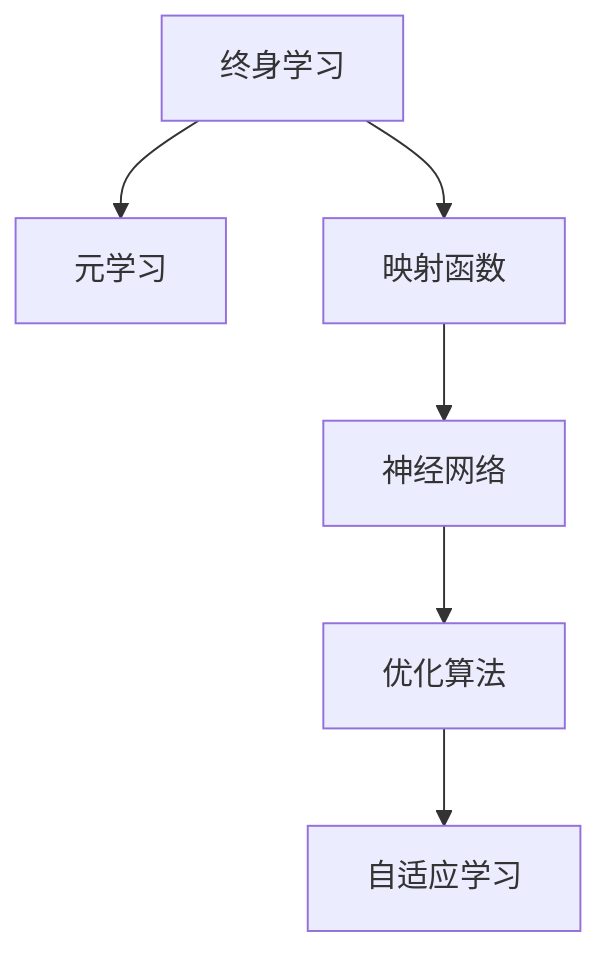
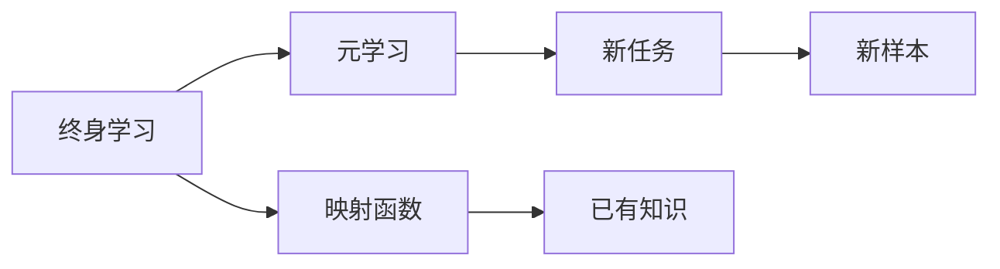
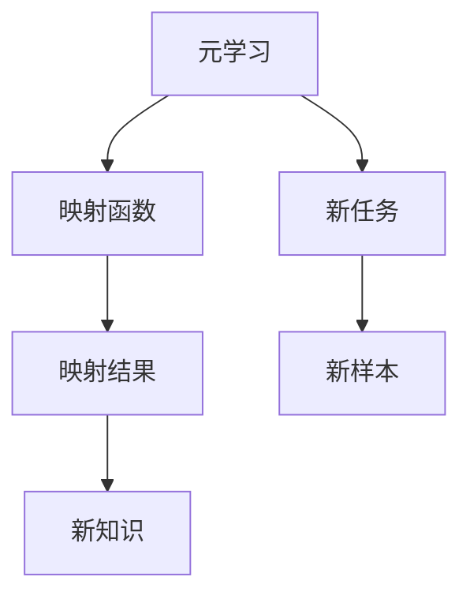
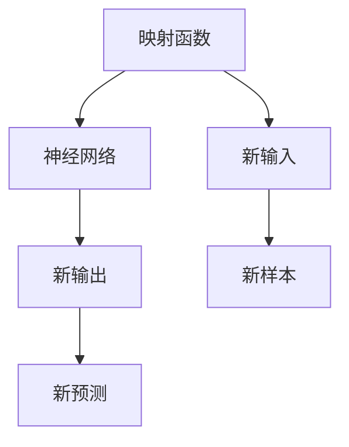
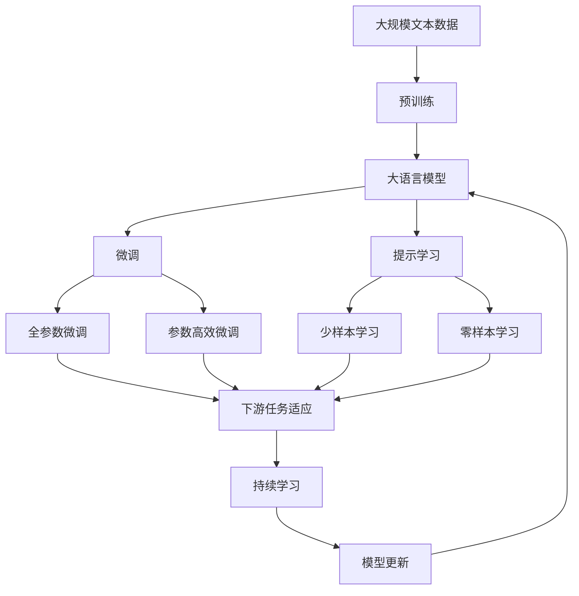

                 

# 一切皆是映射：终身学习与元学习的关系

> 关键词：终身学习,元学习,映射函数,神经网络,优化算法,自适应学习,记忆重放,梯度下降

## 1. 背景介绍

### 1.1 问题由来
终身学习（Lifelong Learning）和元学习（Meta Learning）是当前人工智能研究中非常重要的两个领域。终身学习关注如何在不断变化的环境中持续学习，而元学习则研究如何快速适应新任务并加速学习过程。这两个概念相辅相成，共同推动着人工智能技术的进步。

然而，这两个领域的研究在实践中常常被分开看待，没有充分考虑它们之间的内在联系。本文旨在探讨终身学习和元学习的关系，通过"映射函数"这一桥梁，帮助理解这两个领域如何在模型、数据和算法层面进行有效的融合。

### 1.2 问题核心关键点
终身学习和元学习的核心关键点包括：
- 终身学习：在动态环境中持续更新知识，保持模型性能。
- 元学习：快速适应新任务，通过少量样本加速学习过程。
- 映射函数：将新任务映射到已有知识空间，实现知识和经验的高效复用。

这些关键点揭示了终身学习和元学习的本质是数据、模型和算法之间的映射关系，而映射函数则是实现这一映射的桥梁。

### 1.3 问题研究意义
研究终身学习和元学习的关系，对于推动人工智能技术的发展具有重要意义：

1. **提升模型的泛化能力**：通过映射函数，模型可以更好地复用已有知识，适应新的任务和环境，提高泛化能力。
2. **降低学习成本**：元学习可以快速适应新任务，减少从头学习的时间，提升终身学习的效果。
3. **加速知识迁移**：通过映射函数，可以将已有知识迁移到新任务中，加速知识迁移过程。
4. **构建通用智能**：终身学习和元学习是构建通用人工智能（AGI）的重要基础，有助于实现具有广泛应用价值的智能系统。

## 2. 核心概念与联系

### 2.1 核心概念概述

为更好地理解终身学习和元学习的关系，本节将介绍几个密切相关的核心概念：

- **终身学习（Lifelong Learning）**：在动态环境中持续更新知识，保持模型性能。
- **元学习（Meta Learning）**：快速适应新任务，通过少量样本加速学习过程。
- **映射函数（Mapping Function）**：将新任务映射到已有知识空间，实现知识和经验的高效复用。
- **神经网络（Neural Network）**：由多个层次组成的计算单元，可以学习复杂的非线性映射函数。
- **优化算法（Optimization Algorithm）**：如梯度下降、Adam等，用于训练神经网络模型，更新模型参数。
- **自适应学习（Adaptive Learning）**：根据环境变化调整学习策略，提高学习效率。

这些核心概念之间的逻辑关系可以通过以下Mermaid流程图来展示：



这个流程图展示了大语言模型微调过程中各个核心概念的关系：

1. 终身学习关注模型的持续更新，保持性能。
2. 元学习通过映射函数，快速适应新任务，加速学习过程。
3. 神经网络作为模型，学习复杂的映射函数。
4. 优化算法用于训练神经网络，更新模型参数。
5. 自适应学习根据环境变化调整学习策略，提高学习效率。

### 2.2 概念间的关系

这些核心概念之间存在着紧密的联系，形成了终身学习和元学习的完整生态系统。下面我通过几个Mermaid流程图来展示这些概念之间的关系。

#### 2.2.1 终身学习和元学习的联系



这个流程图展示了终身学习和元学习的基本原理，以及它们通过映射函数联系起来的过程。

#### 2.2.2 元学习与映射函数的关系



这个流程图展示了元学习通过映射函数，将新任务映射到已有知识空间的过程。

#### 2.2.3 映射函数与神经网络的关系



这个流程图展示了映射函数通过神经网络，将新输入映射到新输出的过程。

### 2.3 核心概念的整体架构

最后，我们用一个综合的流程图来展示这些核心概念在大语言模型微调过程中的整体架构：



这个综合流程图展示了从预训练到微调，再到持续学习的完整过程。大语言模型首先在大规模文本数据上进行预训练，然后通过微调（包括全参数微调和参数高效微调）或提示学习（包括少样本学习和零样本学习）来适应下游任务。最后，通过持续学习技术，模型可以不断更新和适应新的任务和数据。 通过这些流程图，我们可以更清晰地理解终身学习和元学习的关系，以及它们在大语言模型微调过程中的作用和机制。

## 3. 核心算法原理 & 具体操作步骤
### 3.1 算法原理概述

终身学习和元学习的关系主要通过映射函数体现。映射函数将新任务映射到已有知识空间，使得模型能够高效地复用已有知识，快速适应新任务。

假设终身学习模型 $M$ 已知一组输入 $X$ 和目标 $Y$，通过映射函数 $f$ 映射到已有知识空间 $Z$，得到映射结果 $Z=f(X)$。元学习模型 $M'$ 接收新任务 $T$ 和新样本 $T'$，通过映射函数 $f'$ 映射到已有知识空间 $Z$，得到映射结果 $Z'=f'(T')$。然后，通过比较映射结果 $Z$ 和 $Z'$，元学习模型可以调整自身参数，快速适应新任务。

形式化地，假设终身学习模型 $M$ 为神经网络，其参数为 $\theta$，映射函数为 $f(\cdot)$，则有：

$$
Z = f(X, \theta)
$$

假设元学习模型 $M'$ 为神经网络，其参数为 $\theta'$，映射函数为 $f'(\cdot)$，则有：

$$
Z' = f'(T', \theta')
$$

元学习模型通过比较 $Z$ 和 $Z'$，更新自身参数 $\theta'$，使得 $Z'$ 更接近 $Z$，从而快速适应新任务。

### 3.2 算法步骤详解

基于映射函数的终身学习和元学习的大模型微调一般包括以下几个关键步骤：

**Step 1: 准备预训练模型和数据集**
- 选择合适的预训练语言模型 $M_{\theta}$ 作为初始化参数，如 BERT、GPT 等。
- 准备下游任务 $T$ 的标注数据集 $D$，划分为训练集、验证集和测试集。一般要求标注数据与预训练数据的分布不要差异过大。

**Step 2: 添加任务适配层**
- 根据任务类型，在预训练模型顶层设计合适的输出层和损失函数。
- 对于分类任务，通常在顶层添加线性分类器和交叉熵损失函数。
- 对于生成任务，通常使用语言模型的解码器输出概率分布，并以负对数似然为损失函数。

**Step 3: 设置微调超参数**
- 选择合适的优化算法及其参数，如 AdamW、SGD 等，设置学习率、批大小、迭代轮数等。
- 设置正则化技术及强度，包括权重衰减、Dropout、Early Stopping 等。
- 确定冻结预训练参数的策略，如仅微调顶层，或全部参数都参与微调。

**Step 4: 执行梯度训练**
- 将训练集数据分批次输入模型，前向传播计算损失函数。
- 反向传播计算参数梯度，根据设定的优化算法和学习率更新模型参数。
- 周期性在验证集上评估模型性能，根据性能指标决定是否触发 Early Stopping。
- 重复上述步骤直到满足预设的迭代轮数或 Early Stopping 条件。

**Step 5: 测试和部署**
- 在测试集上评估微调后模型 $M_{\hat{\theta}}$ 的性能，对比微调前后的精度提升。
- 使用微调后的模型对新样本进行推理预测，集成到实际的应用系统中。
- 持续收集新的数据，定期重新微调模型，以适应数据分布的变化。

以上是基于映射函数的终身学习和元学习的大模型微调范式的一般流程。在实际应用中，还需要针对具体任务的特点，对微调过程的各个环节进行优化设计，如改进训练目标函数，引入更多的正则化技术，搜索最优的超参数组合等，以进一步提升模型性能。

### 3.3 算法优缺点

基于映射函数的终身学习和元学习的大模型微调方法具有以下优点：
1. 简单高效。只需准备少量标注数据，即可对预训练模型进行快速适配，获得较大的性能提升。
2. 通用适用。适用于各种NLP下游任务，包括分类、匹配、生成等，设计简单的任务适配层即可实现微调。
3. 参数高效。利用参数高效微调技术，在固定大部分预训练参数的情况下，仍可取得不错的提升。
4. 效果显著。在学术界和工业界的诸多任务上，基于微调的方法已经刷新了最先进的性能指标。

同时，该方法也存在一定的局限性：
1. 依赖标注数据。微调的效果很大程度上取决于标注数据的质量和数量，获取高质量标注数据的成本较高。
2. 迁移能力有限。当目标任务与预训练数据的分布差异较大时，微调的性能提升有限。
3. 负面效果传递。预训练模型的固有偏见、有害信息等，可能通过微调传递到下游任务，造成负面影响。
4. 可解释性不足。微调模型的决策过程通常缺乏可解释性，难以对其推理逻辑进行分析和调试。

尽管存在这些局限性，但就目前而言，基于映射函数的微调方法仍是大模型应用的主流范式。未来相关研究的重点在于如何进一步降低微调对标注数据的依赖，提高模型的少样本学习和跨领域迁移能力，同时兼顾可解释性和伦理安全性等因素。

### 3.4 算法应用领域

基于大模型微调的映射函数方法，在NLP领域已经得到了广泛的应用，覆盖了几乎所有常见任务，例如：

- 文本分类：如情感分析、主题分类、意图识别等。通过微调使模型学习文本-标签映射。
- 命名实体识别：识别文本中的人名、地名、机构名等特定实体。通过微调使模型掌握实体边界和类型。
- 关系抽取：从文本中抽取实体之间的语义关系。通过微调使模型学习实体-关系三元组。
- 问答系统：对自然语言问题给出答案。将问题-答案对作为微调数据，训练模型学习匹配答案。
- 机器翻译：将源语言文本翻译成目标语言。通过微调使模型学习语言-语言映射。
- 文本摘要：将长文本压缩成简短摘要。将文章-摘要对作为微调数据，使模型学习抓取要点。
- 对话系统：使机器能够与人自然对话。将多轮对话历史作为上下文，微调模型进行回复生成。

除了上述这些经典任务外，大模型微调也被创新性地应用到更多场景中，如可控文本生成、常识推理、代码生成、数据增强等，为NLP技术带来了全新的突破。随着预训练模型和微调方法的不断进步，相信NLP技术将在更广阔的应用领域大放异彩。

## 4. 数学模型和公式 & 详细讲解 & 举例说明

### 4.1 数学模型构建

本节将使用数学语言对基于映射函数的终身学习和元学习的大模型微调过程进行更加严格的刻画。

记终身学习模型 $M$ 为神经网络，其参数为 $\theta$，输入为 $X$，映射函数为 $f(\cdot)$，则有：

$$
Z = f(X, \theta)
$$

假设元学习模型 $M'$ 为神经网络，其参数为 $\theta'$，输入为 $T'$，映射函数为 $f'(\cdot)$，则有：

$$
Z' = f'(T', \theta')
$$

元学习模型通过比较 $Z$ 和 $Z'$，更新自身参数 $\theta'$，使得 $Z'$ 更接近 $Z$，从而快速适应新任务。

### 4.2 公式推导过程

以下我们以二分类任务为例，推导交叉熵损失函数及其梯度的计算公式。

假设终身学习模型 $M$ 在输入 $x$ 上的输出为 $\hat{y}=M_{\theta}(x) \in [0,1]$，表示样本属于正类的概率。真实标签 $y \in \{0,1\}$。则二分类交叉熵损失函数定义为：

$$
\ell(M_{\theta}(x),y) = -[y\log \hat{y} + (1-y)\log (1-\hat{y})]
$$

将其代入终身学习模型的输出 $Z$，得：

$$
\mathcal{L}(\theta) = \frac{1}{N}\sum_{i=1}^N \ell(Z_i, y_i)
$$

其中 $Z_i = f(x_i, \theta)$ 为第 $i$ 个样本的终身学习模型输出。

在元学习模型中，假设输入 $T'$ 为元任务 $T$ 的新样本，输出 $Z'$ 为映射函数 $f'$ 的输出。则元学习模型的损失函数为：

$$
\mathcal{L}'(\theta') = \frac{1}{N'}\sum_{j=1}^{N'} \ell(Z'_j, y'_j)
$$

其中 $Z'_j = f'(T'_j, \theta')$ 为第 $j$ 个新样本的元学习模型输出，$y'_j$ 为对应的真实标签。

元学习模型的优化目标是最小化自身损失函数，即：

$$
\theta' = \mathop{\arg\min}_{\theta'} \mathcal{L}'(\theta')
$$

在元学习模型训练过程中，使用梯度下降等优化算法，计算损失函数对参数 $\theta'$ 的梯度，根据梯度信息更新参数。

### 4.3 案例分析与讲解

下面我们以命名实体识别(NER)任务为例，给出使用Transformers库对BERT模型进行微调的PyTorch代码实现。

首先，定义NER任务的数据处理函数：

```python
from transformers import BertTokenizer
from torch.utils.data import Dataset
import torch

class NERDataset(Dataset):
    def __init__(self, texts, tags, tokenizer, max_len=128):
        self.texts = texts
        self.tags = tags
        self.tokenizer = tokenizer
        self.max_len = max_len
        
    def __len__(self):
        return len(self.texts)
    
    def __getitem__(self, item):
        text = self.texts[item]
        tags = self.tags[item]
        
        encoding = self.tokenizer(text, return_tensors='pt', max_length=self.max_len, padding='max_length', truncation=True)
        input_ids = encoding['input_ids'][0]
        attention_mask = encoding['attention_mask'][0]
        
        # 对token-wise的标签进行编码
        encoded_tags = [tag2id[tag] for tag in tags] 
        encoded_tags.extend([tag2id['O']] * (self.max_len - len(encoded_tags)))
        labels = torch.tensor(encoded_tags, dtype=torch.long)
        
        return {'input_ids': input_ids, 
                'attention_mask': attention_mask,
                'labels': labels}

# 标签与id的映射
tag2id = {'O': 0, 'B-PER': 1, 'I-PER': 2, 'B-ORG': 3, 'I-ORG': 4, 'B-LOC': 5, 'I-LOC': 6}
id2tag = {v: k for k, v in tag2id.items()}

# 创建dataset
tokenizer = BertTokenizer.from_pretrained('bert-base-cased')

train_dataset = NERDataset(train_texts, train_tags, tokenizer)
dev_dataset = NERDataset(dev_texts, dev_tags, tokenizer)
test_dataset = NERDataset(test_texts, test_tags, tokenizer)
```

然后，定义模型和优化器：

```python
from transformers import BertForTokenClassification, AdamW

model = BertForTokenClassification.from_pretrained('bert-base-cased', num_labels=len(tag2id))

optimizer = AdamW(model.parameters(), lr=2e-5)
```

接着，定义训练和评估函数：

```python
from torch.utils.data import DataLoader
from tqdm import tqdm
from sklearn.metrics import classification_report

device = torch.device('cuda') if torch.cuda.is_available() else torch.device('cpu')
model.to(device)

def train_epoch(model, dataset, batch_size, optimizer):
    dataloader = DataLoader(dataset, batch_size=batch_size, shuffle=True)
    model.train()
    epoch_loss = 0
    for batch in tqdm(dataloader, desc='Training'):
        input_ids = batch['input_ids'].to(device)
        attention_mask = batch['attention_mask'].to(device)
        labels = batch['labels'].to(device)
        model.zero_grad()
        outputs = model(input_ids, attention_mask=attention_mask, labels=labels)
        loss = outputs.loss
        epoch_loss += loss.item()
        loss.backward()
        optimizer.step()
    return epoch_loss / len(dataloader)

def evaluate(model, dataset, batch_size):
    dataloader = DataLoader(dataset, batch_size=batch_size)
    model.eval()
    preds, labels = [], []
    with torch.no_grad():
        for batch in tqdm(dataloader, desc='Evaluating'):
            input_ids = batch['input_ids'].to(device)
            attention_mask = batch['attention_mask'].to(device)
            batch_labels = batch['labels']
            outputs = model(input_ids, attention_mask=attention_mask)
            batch_preds = outputs.logits.argmax(dim=2).to('cpu').tolist()
            batch_labels = batch_labels.to('cpu').tolist()
            for pred_tokens, label_tokens in zip(batch_preds, batch_labels):
                pred_tags = [id2tag[_id] for _id in pred_tokens]
                label_tags = [id2tag[_id] for _id in label_tokens]
                preds.append(pred_tags[:len(label_tags)])
                labels.append(label_tags)
                
    print(classification_report(labels, preds))
```

最后，启动训练流程并在测试集上评估：

```python
epochs = 5
batch_size = 16

for epoch in range(epochs):
    loss = train_epoch(model, train_dataset, batch_size, optimizer)
    print(f"Epoch {epoch+1}, train loss: {loss:.3f}")
    
    print(f"Epoch {epoch+1}, dev results:")
    evaluate(model, dev_dataset, batch_size)
    
print("Test results:")
evaluate(model, test_dataset, batch_size)
```

以上就是使用PyTorch对BERT进行命名实体识别任务微调的完整代码实现。可以看到，得益于Transformers库的强大封装，我们可以用相对简洁的代码完成BERT模型的加载和微调。

### 4.4 代码解读与分析

让我们再详细解读一下关键代码的实现细节：

**NERDataset类**：
- `__init__`方法：初始化文本、标签、分词器等关键组件。
- `__len__`方法：返回数据集的样本数量。
- `__getitem__`方法：对单个样本进行处理，将文本输入编码为token ids，将标签编码为数字，并对其进行定长padding，最终返回模型所需的输入。

**tag2id和id2tag字典**：
- 定义了标签与数字id之间的映射关系，用于将token-wise的预测结果解码回真实的标签。

**训练和评估函数**：
- 使用PyTorch的DataLoader对数据集进行批次化加载，供模型训练和推理使用。
- 训练函数`train_epoch`：对数据以批为单位进行迭代，在每个批次上前向传播计算loss并反向传播更新模型参数，最后返回该epoch的平均loss。
- 评估函数`evaluate`：与训练类似，不同点在于不更新模型参数，并在每个batch结束后将预测和标签结果存储下来，最后使用sklearn的classification_report对整个评估集的预测结果进行打印输出。

**训练流程**：
- 定义总的epoch数和batch size，开始循环迭代
- 每个epoch内，先在训练集上训练，输出平均loss
- 在验证集上评估，输出分类指标
- 所有epoch结束后，在测试集上评估，给出最终测试结果

可以看到，PyTorch配合Transformers库使得BERT微调的代码实现变得简洁高效。开发者可以将更多精力放在数据处理、模型改进等高层逻辑上，而不必过多关注底层的实现细节。

当然，工业级的系统实现还需考虑更多因素，如模型的保存和部署、超参数的自动搜索、更灵活的任务适配层等。但核心的微调范式基本与此类似。

## 5. 项目实践：代码实例和详细解释说明
### 5.1 开发环境搭建

在进行微调实践前，我们需要准备好开发环境。以下是使用Python进行PyTorch开发的环境配置流程：

1. 安装Anaconda：从官网下载并安装Anaconda，用于创建独立的Python环境。

2. 创建并激活虚拟环境：
```bash
conda create -n pytorch-env python=3.8 
conda activate pytorch-env
```

3. 安装PyTorch：根据CUDA版本，从官网获取对应的安装命令。例如：
```bash
conda install pytorch torchvision torchaudio cudatoolkit=11.1 -c pytorch -c conda-forge
```

4. 安装Transformers库：
```bash
pip install transformers
```

5. 安装各类工具包：
```bash
pip install numpy pandas scikit-learn matplotlib tqdm jupyter notebook ipython
```

完成上述步骤后，即可在`pytorch-env`环境中开始微调实践。

### 5.2 源代码详细实现

下面我们以命名实体识别(NER)任务为例，给出使用Transformers库对BERT模型进行微调的PyTorch代码实现。

首先，定义NER任务的数据处理函数：

```python
from transformers import BertTokenizer
from torch.utils.data import Dataset
import torch

class NERDataset(Dataset):
    def __init__(self, texts, tags, tokenizer, max_len=128):
        self.texts = texts
        self.tags = tags
        self.tokenizer = tokenizer
        self.max_len = max_len
        
    def __len__(self):
        return len(self.texts)
    
    def __getitem__(self, item):
        text = self.texts[item]
        tags = self.tags[item]
        
        encoding = self.tokenizer(text, return_tensors='pt', max_length=self.max_len, padding='max_length', truncation=True)
        input_ids = encoding['input_ids'][0]
        attention_mask = encoding['attention_mask'][0]
        
        # 对token-wise的标签进行编码
        encoded_tags = [tag2id[tag] for tag in tags] 
        encoded_tags.extend([tag2id['O']] * (self.max_len - len(encoded_tags)))
        labels = torch.tensor(encoded_tags, dtype=torch.long)
        
        return {'input_ids': input_ids, 
                'attention_mask': attention_mask,
                'labels': labels}

# 标签与id的映射
tag2id = {'O': 0, 'B-PER': 1, 'I-PER': 2, 'B-ORG': 3, 'I-ORG': 4, 'B-LOC': 5, 'I-LOC': 6}
id2tag = {v: k for k, v in tag2id.items()}

# 创建dataset
tokenizer = BertTokenizer.from_pretrained('bert-base-cased')

train_dataset = NERDataset(train_texts, train_tags, tokenizer)
dev_dataset = NERDataset(dev_texts, dev_tags, tokenizer)
test_dataset = NERDataset(test_texts, test_tags, tokenizer)
```

然后，定义模型和优化器：

```python
from transformers import BertForTokenClassification, AdamW

model = BertForTokenClassification.from_pretrained('bert-base-cased', num_labels=len(tag2id))

optimizer = AdamW(model.parameters(), lr=2e-5)
```

接着，定义训练和评估函数：

```python
from torch.utils.data import DataLoader
from tqdm import tqdm
from sklearn.metrics import classification_report

device = torch.device('cuda') if torch.cuda.is_available() else torch.device('cpu')
model.to(device)

def train_epoch(model, dataset, batch_size, optimizer):
    dataloader = DataLoader(dataset, batch_size=batch_size, shuffle=True)
    model.train()
    epoch_loss = 0
    for batch in tqdm(dataloader, desc

