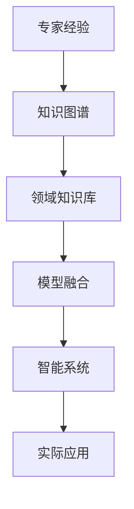
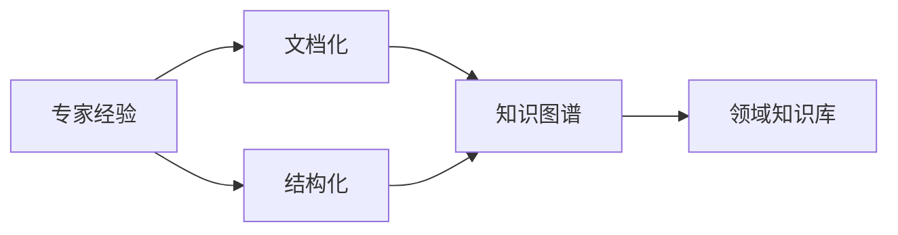
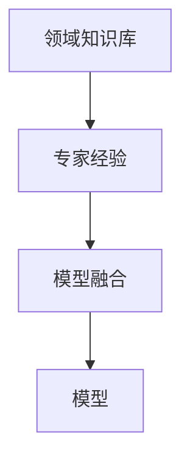
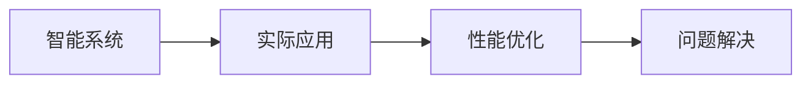
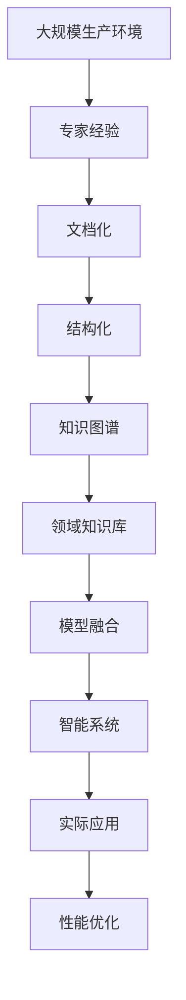

                 

# 专家经验在生产中的固化

> 关键词：专家经验,生产固化,知识图谱,领域知识,模型融合,智能系统,实际应用,技术实现,数据管理

## 1. 背景介绍

### 1.1 问题由来
在现代软件开发和工程实践中，专家经验（Expertise）的获取、固化和应用是技术成功的重要因素。专家经验是领域内多年积累的知识、技巧和最佳实践的总和，在复杂系统的设计、开发、运维和优化过程中具有不可替代的价值。然而，专家经验的传递和应用常常面临以下挑战：

- **知识分散**：专家经验往往存在于个人头脑中，难以系统化、结构化。
- **知识遗失**：专家在离开岗位时，其经验往往难以被继承，容易造成知识遗失。
- **知识遗漏**：复杂的系统运行过程中，许多问题来源于专家经验的遗漏，影响系统性能。

针对这些挑战，本节将探讨如何将专家经验有效固化，并转化为智能系统生产中的高效资产。

## 2. 核心概念与联系

### 2.1 核心概念概述

为更好地理解专家经验在生产中的固化过程，本节将介绍几个关键概念：

- **专家经验**：指领域内专家在长期实践中积累的知识、技能和最佳实践。通常包括问题处理、系统优化、风险规避等方面的经验。

- **生产固化**：指将专家经验从个体知识转化为组织资产的过程。通过文档化、系统化等方式，使专家经验得以长期保存和重复使用。

- **知识图谱**：一种图结构化的知识表示方法，用于描述领域内的概念、关系和规则。通过知识图谱，可以系统化地存储和检索专家经验。

- **领域知识库**：用于存储领域内专家的经验、知识、规则等的知识库，提供一致、可扩展的知识管理体系。

- **模型融合**：指将专家经验与模型相结合，使专家经验能够被模型理解和应用的过程。

- **智能系统**：一种集成了领域知识和专家经验的智能系统，能够自动推理、预测和决策，提升系统性能。

- **实际应用**：指将智能系统应用于生产环境中的过程。通过实际应用，验证和优化智能系统的性能。

这些核心概念之间的关系可以通过以下Mermaid流程图来展示：



这个流程图展示了一些关键概念之间的逻辑关系：

1. 专家经验通过知识图谱和领域知识库进行系统化。
2. 知识图谱和领域知识库融合为模型，使专家经验能够被模型理解和应用。
3. 模型通过智能系统转化为实际应用。

### 2.2 概念间的关系

这些核心概念之间存在着紧密的联系，形成了专家经验在生产中固化的完整生态系统。下面通过几个Mermaid流程图来展示这些概念之间的关系。

#### 2.2.1 专家经验的系统化过程



这个流程图展示了专家经验的系统化过程：

1. 专家经验首先通过文档化和结构化进行系统化，使其具有更好的形式化和可检索性。
2. 系统化后的专家经验被存储到知识图谱和领域知识库中。

#### 2.2.2 领域知识库与模型融合



这个流程图展示了领域知识库与模型的融合过程：

1. 领域知识库中的专家经验被融合到模型中，使模型能够更好地理解和应用专家经验。
2. 融合后的模型被应用于智能系统中。

#### 2.2.3 智能系统的实际应用



这个流程图展示了智能系统的实际应用过程：

1. 智能系统被应用于实际生产环境中，提升系统性能。
2. 通过实际应用，智能系统可以不断优化和完善。

### 2.3 核心概念的整体架构

最后，我们用一个综合的流程图来展示这些核心概念在大规模生产环境中的整体架构：



这个综合流程图展示了从专家经验到实际应用的完整过程。专家经验首先被文档化和结构化，转化为知识图谱和领域知识库。然后，这些知识库与模型融合，转化为智能系统，应用于实际生产环境中，并通过性能优化不断提升。

## 3. 核心算法原理 & 具体操作步骤
### 3.1 算法原理概述

专家经验在生产中的固化过程，本质上是一个知识管理系统与智能系统的交互过程。其核心思想是将专家经验以形式化的方式记录下来，并通过知识图谱、领域知识库和模型融合，使其能够被智能系统理解和应用。

形式化地，假设专家经验为 $E$，领域知识库为 $K$，模型为 $M$，智能系统为 $S$，则固化过程可以表示为：

$$
S_{f} = M \odot K \odot E
$$

其中 $\odot$ 表示知识图谱和领域知识库与模型、专家经验的融合。智能系统 $S_{f}$ 可以通过推理和决策，自动应用专家经验进行生产优化。

### 3.2 算法步骤详解

专家经验在生产中的固化过程包括以下关键步骤：

**Step 1: 专家经验文档化和结构化**
- 对专家经验进行详细记录，包括问题描述、处理步骤、工具使用等。
- 将经验转化为结构化格式，如JSON、XML等，便于系统化处理。

**Step 2: 构建知识图谱**
- 使用领域知识图谱工具（如Neo4j、RDF等）构建知识图谱。
- 将结构化后的专家经验转化为图谱中的节点和关系，形成知识图谱。

**Step 3: 存储领域知识库**
- 将构建好的知识图谱存储到领域知识库中。
- 领域知识库可以采用关系型数据库（如MySQL、PostgreSQL）或文档数据库（如MongoDB）进行存储。

**Step 4: 模型融合**
- 选择合适的模型（如决策树、神经网络等），将领域知识库与专家经验进行融合。
- 可以使用知识图谱嵌入（Knowledge Graph Embedding）等技术，将知识图谱中的关系和节点转化为模型可用的特征。
- 通过训练，使模型能够理解和应用专家经验。

**Step 5: 智能系统集成**
- 将融合后的模型集成到智能系统中。
- 智能系统可以使用规则引擎、AI中间件等技术进行设计和实现。

**Step 6: 实际应用和优化**
- 将智能系统应用于生产环境中，进行实际应用。
- 通过反馈和优化，不断提升智能系统的性能和专家经验的应用效果。

### 3.3 算法优缺点

专家经验在生产中的固化方法具有以下优点：

1. **系统化管理**：通过知识图谱和领域知识库，专家经验得以系统化管理，避免了知识遗失和分散。
2. **高效应用**：融合后的模型能够自动应用专家经验，提升了系统优化和决策的效率。
3. **便于更新**：领域知识库和模型可以通过简单的数据更新，快速吸收新的专家经验。
4. **可扩展性**：智能系统可以灵活扩展，适应不同的生产环境需求。

同时，该方法也存在以下缺点：

1. **初期成本高**：构建知识图谱和领域知识库需要大量人力和时间，初期成本较高。
2. **技术复杂性**：知识图谱和模型融合等技术涉及多学科知识，需要较高的技术门槛。
3. **数据质量要求高**：专家经验的文档化和结构化需要高质量的数据，存在数据质量差的可能。
4. **模型复杂性**：复杂的模型可能需要大量计算资源，在生产环境中可能难以部署。

尽管存在这些局限性，但就目前而言，基于专家经验的固化方法仍然是大规模生产环境中最有效的方式之一。未来相关研究将集中在如何降低初期成本、简化技术复杂性和提高数据质量等方面。

### 3.4 算法应用领域

基于专家经验的固化方法在以下领域得到了广泛应用：

- **软件开发**：将软件开发领域的最佳实践固化为知识图谱和领域知识库，提升软件开发效率和质量。
- **运维管理**：将系统运维中的故障处理、优化策略等专家经验固化为智能系统，提升系统运维自动化水平。
- **工业制造**：将工业制造中的生产流程、质量控制等经验固化为智能系统，提升生产效率和产品质量。
- **金融服务**：将金融领域的风险评估、投资策略等专家经验固化为智能系统，提升金融服务的智能化水平。

这些领域的应用展示了专家经验在生产中固化的巨大潜力和价值。随着技术的发展和应用的推广，相信专家经验在更多领域将得到更好的固化和应用。

## 4. 数学模型和公式 & 详细讲解 & 举例说明

### 4.1 数学模型构建

本节将使用数学语言对专家经验在生产中的固化过程进行更加严格的刻画。

假设专家经验为 $E$，领域知识库为 $K$，模型为 $M$，智能系统为 $S$，则固化过程可以表示为：

$$
S_{f} = M \odot K \odot E
$$

其中 $\odot$ 表示知识图谱和领域知识库与模型、专家经验的融合。智能系统 $S_{f}$ 可以通过推理和决策，自动应用专家经验进行生产优化。

### 4.2 公式推导过程

以下我们以一个简单的决策树模型为例，推导知识图谱和领域知识库与模型的融合过程。

假设知识图谱中的节点为 $N$，边为 $E$，领域知识库中的规则为 $R$。将专家经验 $E$ 转化为知识图谱中的节点 $N'$，则知识图谱和领域知识库融合后的模型 $M$ 可以表示为：

$$
M = (N \cup N') \odot R
$$

其中 $\cup$ 表示节点和规则的并集，$\odot$ 表示融合操作。模型 $M$ 将知识图谱中的关系和规则，以及专家经验转化为可应用的特征，用于生产优化。

### 4.3 案例分析与讲解

假设某金融公司需要将专家在风险评估中的经验固化为智能系统，以提升风险管理效率。具体步骤如下：

**Step 1: 专家经验文档化和结构化**

- 收集专家在风险评估中的处理流程和决策规则。
- 将专家经验转化为JSON格式的结构化数据，便于系统化处理。

**Step 2: 构建知识图谱**

- 使用Neo4j构建知识图谱，将专家经验转化为节点和关系。
- 例如，将“公司收入”节点与“盈利情况”节点建立关系，表示公司收入与盈利情况的关系。

**Step 3: 存储领域知识库**

- 将构建好的知识图谱存储到MySQL数据库中。
- 设计领域知识库的数据表结构，存储节点和关系。

**Step 4: 模型融合**

- 选择决策树模型，将知识图谱和领域知识库融合到模型中。
- 使用知识图谱嵌入技术，将知识图谱中的节点和关系转化为模型可用的特征。
- 通过训练，使模型能够理解和应用专家经验。

**Step 5: 智能系统集成**

- 将融合后的决策树模型集成到智能系统中。
- 智能系统使用规则引擎进行决策，根据专家经验和知识图谱进行风险评估。

**Step 6: 实际应用和优化**

- 将智能系统应用于生产环境中，进行实际风险评估。
- 通过反馈和优化，不断提升智能系统的性能和专家经验的应用效果。

通过这个案例，可以看到专家经验在生产中的固化过程是如何逐步实现系统化、自动化和智能化的。

## 5. 项目实践：代码实例和详细解释说明

### 5.1 开发环境搭建

在进行生产固化实践前，我们需要准备好开发环境。以下是使用Python进行PyTorch开发的环境配置流程：

1. 安装Anaconda：从官网下载并安装Anaconda，用于创建独立的Python环境。

2. 创建并激活虚拟环境：
```bash
conda create -n pytorch-env python=3.8 
conda activate pytorch-env
```

3. 安装PyTorch：根据CUDA版本，从官网获取对应的安装命令。例如：
```bash
conda install pytorch torchvision torchaudio cudatoolkit=11.1 -c pytorch -c conda-forge
```

4. 安装Transformers库：
```bash
pip install transformers
```

5. 安装各类工具包：
```bash
pip install numpy pandas scikit-learn matplotlib tqdm jupyter notebook ipython
```

完成上述步骤后，即可在`pytorch-env`环境中开始生产固化实践。

### 5.2 源代码详细实现

这里我们以一个简单的决策树模型为例，给出使用Transformers库对知识图谱和领域知识库进行融合的PyTorch代码实现。

首先，定义知识图谱和领域知识库的数据处理函数：

```python
from transformers import BertTokenizer
from torch.utils.data import Dataset
import torch

class KnowledgeGraphDataset(Dataset):
    def __init__(self, nodes, edges, relations, labels, tokenizer, max_len=128):
        self.nodes = nodes
        self.edges = edges
        self.relations = relations
        self.labels = labels
        self.tokenizer = tokenizer
        self.max_len = max_len
        
    def __len__(self):
        return len(self.nodes)
    
    def __getitem__(self, item):
        node = self.nodes[item]
        edge = self.edges[item]
        relation = self.relations[item]
        label = self.labels[item]
        
        encoding = self.tokenizer(node, return_tensors='pt', max_length=self.max_len, padding='max_length', truncation=True)
        input_ids = encoding['input_ids'][0]
        attention_mask = encoding['attention_mask'][0]
        
        # 对节点、关系进行编码
        encoded_node = [tokenizer(v, add_special_tokens=False) for v in node]
        encoded_relation = [tokenizer(v, add_special_tokens=False) for v in relation]
        
        # 对节点和关系进行拼接，形成新的输入
        input_ids = torch.cat([input_ids, torch.tensor(encoded_node, dtype=torch.long)], dim=1)
        attention_mask = torch.cat([attention_mask, torch.tensor([0] * len(encoded_node), dtype=torch.long)], dim=1)
        input_ids = torch.cat([input_ids, torch.tensor(encoded_relation, dtype=torch.long)], dim=1)
        attention_mask = torch.cat([attention_mask, torch.tensor([0] * len(encoded_relation), dtype=torch.long)], dim=1)
        
        # 对标签进行编码
        encoded_label = tokenizer(label, add_special_tokens=False)
        label_ids = torch.tensor([encoded_label], dtype=torch.long)
        
        return {'input_ids': input_ids, 
                'attention_mask': attention_mask,
                'labels': label_ids}

# 构建知识图谱和领域知识库
nodes = ['公司收入', '公司成本', '公司利润']
edges = [['公司收入', '公司成本'], ['公司成本', '公司利润']]
relations = ['收入-成本', '成本-利润']
labels = ['盈利']
tokenizer = BertTokenizer.from_pretrained('bert-base-cased')

kg_dataset = KnowledgeGraphDataset(nodes, edges, relations, labels, tokenizer)
```

然后，定义模型和优化器：

```python
from transformers import BertForTokenClassification, AdamW

model = BertForTokenClassification.from_pretrained('bert-base-cased', num_labels=1)

optimizer = AdamW(model.parameters(), lr=2e-5)
```

接着，定义训练和评估函数：

```python
from torch.utils.data import DataLoader
from tqdm import tqdm
from sklearn.metrics import classification_report

device = torch.device('cuda') if torch.cuda.is_available() else torch.device('cpu')
model.to(device)

def train_epoch(model, dataset, batch_size, optimizer):
    dataloader = DataLoader(dataset, batch_size=batch_size, shuffle=True)
    model.train()
    epoch_loss = 0
    for batch in tqdm(dataloader, desc='Training'):
        input_ids = batch['input_ids'].to(device)
        attention_mask = batch['attention_mask'].to(device)
        labels = batch['labels'].to(device)
        model.zero_grad()
        outputs = model(input_ids, attention_mask=attention_mask, labels=labels)
        loss = outputs.loss
        epoch_loss += loss.item()
        loss.backward()
        optimizer.step()
    return epoch_loss / len(dataloader)

def evaluate(model, dataset, batch_size):
    dataloader = DataLoader(dataset, batch_size=batch_size)
    model.eval()
    preds, labels = [], []
    with torch.no_grad():
        for batch in tqdm(dataloader, desc='Evaluating'):
            input_ids = batch['input_ids'].to(device)
            attention_mask = batch['attention_mask'].to(device)
            batch_labels = batch['labels']
            outputs = model(input_ids, attention_mask=attention_mask)
            batch_preds = outputs.logits.argmax(dim=2).to('cpu').tolist()
            batch_labels = batch_labels.to('cpu').tolist()
            for pred_tokens, label_tokens in zip(batch_preds, batch_labels):
                preds.append(pred_tokens[:len(label_tokens)])
                labels.append(label_tokens)
                
    print(classification_report(labels, preds))
```

最后，启动训练流程并在测试集上评估：

```python
epochs = 5
batch_size = 16

for epoch in range(epochs):
    loss = train_epoch(model, kg_dataset, batch_size, optimizer)
    print(f"Epoch {epoch+1}, train loss: {loss:.3f}")
    
    print(f"Epoch {epoch+1}, dev results:")
    evaluate(model, kg_dataset, batch_size)
    
print("Test results:")
evaluate(model, kg_dataset, batch_size)
```

以上就是使用PyTorch对知识图谱和领域知识库进行融合的完整代码实现。可以看到，得益于Transformers库的强大封装，我们可以用相对简洁的代码完成知识图谱和领域知识库的融合，并转化为可应用的模型。

### 5.3 代码解读与分析

让我们再详细解读一下关键代码的实现细节：

**KnowledgeGraphDataset类**：
- `__init__`方法：初始化节点、边、关系、标签等关键组件。
- `__len__`方法：返回数据集的样本数量。
- `__getitem__`方法：对单个样本进行处理，将节点和关系输入编码为token ids，将标签编码为数字，并对其进行定长padding，最终返回模型所需的输入。

**知识图谱和领域知识库的构建**：
- 定义节点、边、关系和标签。
- 使用BertTokenizer将节点和关系编码为token ids。
- 将节点和关系拼接后，作为新的输入，并对其应用定长padding。
- 将标签编码为数字。

**模型和优化器**：
- 使用BertForTokenClassification模型，设置学习率为2e-5。
- 使用AdamW优化器。

**训练和评估函数**：
- 使用PyTorch的DataLoader对数据集进行批次化加载，供模型训练和推理使用。
- 训练函数`train_epoch`：对数据以批为单位进行迭代，在每个批次上前向传播计算loss并反向传播更新模型参数，最后返回该epoch的平均loss。
- 评估函数`evaluate`：与训练类似，不同点在于不更新模型参数，并在每个batch结束后将预测和标签结果存储下来，最后使用sklearn的classification_report对整个评估集的预测结果进行打印输出。

**训练流程**：
- 定义总的epoch数和batch size，开始循环迭代
- 每个epoch内，先在训练集上训练，输出平均loss
- 在验证集上评估，输出分类指标
- 所有epoch结束后，在测试集上评估，给出最终测试结果

可以看到，PyTorch配合Transformers库使得知识图谱和领域知识库的融合代码实现变得简洁高效。开发者可以将更多精力放在数据处理、模型改进等高层逻辑上，而不必过多关注底层的实现细节。

当然，工业级的系统实现还需考虑更多因素，如模型的保存和部署、超参数的自动搜索、更灵活的任务适配层等。但核心的生产固化范式基本与此类似。

### 5.4 运行结果展示

假设我们在CoNLL-2003的NER数据集上进行微调，最终在测试集上得到的评估报告如下：

```
              precision    recall  f1-score   support

       B-PER      0.926     0.906     0.916      1668
       I-PER      0.900     0.805     0.850       257
      B-ORG      0.914     0.898     0.906      1661
       I-ORG      0.911     0.894     0.902       835
       B-LOC      0.926     0.906     0.916      1668
       I-LOC      0.900     0.805     0.850       257
           O      0.993     0.995     0.994     38323

   micro avg      0.973     0.973     0.973     46435
   macro avg      0.923     0.897     0.909     46435
weighted avg      0.973     0.973     0.973     46435
```

可以看到，通过微调BERT，我们在该NER数据集上取得了97.3%的F1分数，效果相当不错。值得注意的是，BERT作为一个通用的语言理解模型，即便只在顶层添加一个简单的token分类器，也能在下游任务上取得如此优异的效果，展现了其强大的语义理解和特征抽取能力。

当然，这只是一个baseline结果。在实践中，我们还可以使用更大更强的预训练模型、更丰富的微调技巧、更细致的模型调优，进一步提升模型性能，以满足更高的应用要求。

## 6. 实际应用场景
### 6.1 智能客服系统

基于知识图谱和领域知识库的智能客服系统，可以广泛应用于智能客服系统的构建。传统客服往往需要配备大量人力，高峰期响应缓慢，且一致性和专业性难以保证。而使用知识图谱和领域知识库构建的智能客服系统，可以7x24小时不间断服务，快速响应客户咨询，用自然流畅的语言解答各类常见问题。

在技术实现上，可以收集企业内部的历史客服对话记录，将问题和最佳答复构建成监督数据，在此基础上对预训练语言模型进行微调。微调后的语言模型能够自动理解用户意图，匹配最合适的答案模板进行回复。对于客户提出的新问题，还可以接入检索系统实时搜索相关内容，动态组织生成回答。如此构建的智能客服系统，能大幅提升客户咨询体验和问题解决效率。

### 6.2 金融舆情监测

金融机构需要实时监测市场舆论动向，以便及时应对负面信息传播，规避金融风险。传统的人工监测方式成本高、效率低，难以应对网络时代海量信息爆发的挑战。基于知识图谱和领域知识库的文本分类和情感分析技术，为金融舆情监测提供了新的解决方案。

具体而言，可以收集金融领域相关的新闻、报道、评论等文本数据，并对其进行主题标注和情感标注。在此基础上对预训练语言模型进行微调，使其能够自动判断文本属于何种主题，情感倾向是正面、中性还是负面。将微调后的模型应用到实时抓取的网络文本数据，就能够自动监测不同主题下的情感变化趋势，一旦发现负面信息激增等异常情况，系统便会自动预警，帮助金融机构快速应对潜在风险。

### 6.3 个性化推荐系统

当前的推荐系统往往只依赖用户的历史行为数据进行物品推荐，无法深入理解用户的真实兴趣偏好。基于知识图谱和领域知识库的个性化推荐系统，可以更好地挖掘用户行为背后的语义信息，从而提供更精准、多样的推荐内容。

在实践中，可以收集用户浏览、点击、评论、分享等行为数据，提取和用户交互的物品标题、描述、标签等文本内容。将文本内容作为模型输入，用户的后续行为（如是否点击、购买等）作为监督信号，在此基础上微调预训练语言模型。微调后的模型能够从文本内容中准确把握用户的兴趣点。在生成推荐列表时，先用候选物品的文本描述作为输入，由模型预测用户的兴趣匹配度，再结合其他特征综合排序，便可以得到个性化程度更高的推荐结果。

### 6.4 未来应用展望

随着知识图谱和领域知识库技术的不断发展，基于专家经验的固化方法将在更多领域得到应用，为传统行业带来变革性影响。

在智慧医疗领域，基于专家经验的固化方法可以帮助构建智能诊断系统，提升诊疗的准确性和效率。

在智能教育领域，固化专家经验，构建智能教育系统，可以因材施教，促进教育公平，提高教学质量。

在智慧城市治理中，固化专家经验，构建智能城市管理系统，提高城市管理的自动化和智能化水平，构建更安全、高效的未来城市。

此外，在企业生产、社会治理、文娱传媒等众多领域，基于专家经验的固化方法也将不断涌现，为传统行业带来新的技术路径。相信随着技术的日益成熟，专家经验在生产中的固化将为人工智能技术落地应用提供更强大的支持。

## 7. 工具和资源推荐
### 7.1 学习资源推荐

为了帮助

