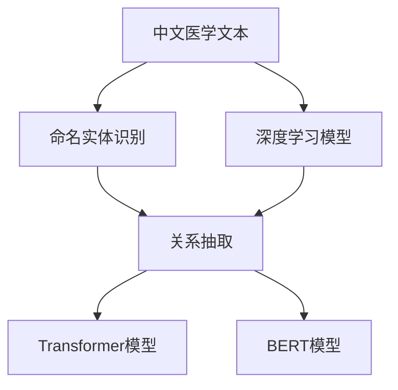

                 

# 中文医学文本中的关系抽取

> 关键词：中文医学,关系抽取,深度学习,Transformer,BERT,电子病历,知网

## 1. 背景介绍

### 1.1 问题由来
随着科技的发展，大数据在医疗领域的广泛应用，大量医学电子病历（Electronic Health Records, EHR）被生成和存储。医疗数据量巨大且丰富，但通常以文本形式存在，具有结构化程度低、文本格式多样化等特点。如何从这些复杂的文本中提取出有用的信息，对病历进行合理利用和分析，是当前医学信息处理中的重要课题。关系抽取是自然语言处理（Natural Language Processing, NLP）中一个重要的任务，目的是从文本中抽取出实体以及实体之间的关系，可以帮助医生快速获取病人相关信息，提高诊疗效率。

在中文医疗领域，关系抽取尤为重要。中文语义复杂，且不同领域的术语和表达方式具有特殊性，因此需要针对中文设计合适的关系抽取模型。通过机器学习模型从电子病历等文本数据中抽取特定实体间的关系，能够显著提升医学信息处理的效率和准确度。例如，可以从医学文本中抽取“患者姓名”、“主诉”、“诊断”等关键信息，以及这些信息之间的关联。这些信息对于医疗决策、临床研究等都有重要意义。

### 1.2 问题核心关键点
针对中文医学文本的关系抽取，关键点包括：
1. **中文语料处理**：中文句法结构复杂，语义关系多样化，需要专门处理中文分词、词性标注、命名实体识别（Named Entity Recognition, NER）等任务。
2. **深度学习模型**：采用深度学习模型，如Transformer和BERT，进行文本嵌入表示，并进行关系抽取。
3. **多层次关系抽取**：中文文本关系复杂，需要设计多层次关系抽取模型，准确识别出不同层次的关系。
4. **训练数据准备**：需要大量高质量标注的中文医学文本数据，以指导模型的训练。

### 1.3 问题研究意义
中文医学文本关系抽取的研究具有重要意义：
1. **提升医疗效率**：能够帮助医生快速获取病人相关信息，提高诊疗效率。
2. **支持临床研究**：可以挖掘出深层次的临床信息，支持医学研究。
3. **医疗知识整合**：通过整合医疗知识库，实现电子病历的智能化管理。
4. **个性化医疗**：关系抽取可以帮助医生了解病人的健康情况，制定个性化治疗方案。

## 2. 核心概念与联系

### 2.1 核心概念概述

为更好地理解中文医学文本中的关系抽取，本节将介绍几个密切相关的核心概念：

- **中文医学文本**：电子病历、病案记录、医学文献等以中文形式存在的文本数据，包含病人的健康信息、治疗记录、诊断结果等。
- **关系抽取**：从文本中识别出实体（如人名、疾病名等），并抽取实体之间的关系，如“某病人被诊断为某疾病”、“某病人服用某药物”等。
- **深度学习模型**：如Transformer、BERT等，能够自动学习文本的语义表示，用于文本分类、语言建模、序列生成等任务。
- **命名实体识别（NER）**：识别文本中的实体，如人名、地名、组织名、时间等，是关系抽取的前提。
- **多层次关系抽取**：识别出不同层次的关系，如事件-事件、实体-实体等。
- **Transformer模型**：通过自注意力机制，可以高效地处理长序列文本。
- **BERT模型**：一种预训练语言模型，能够学习到丰富的语义信息，用于文本表示和关系抽取。

这些核心概念之间有着紧密的联系，共同构成了中文医学文本关系抽取的完整生态系统。

### 2.2 概念间的关系

这些核心概念之间存在着紧密的联系，形成了中文医学文本关系抽取的完整生态系统。下面我们通过几个Mermaid流程图来展示这些概念之间的关系：



这个流程图展示了大语言模型、Transformer和BERT模型在中文医学文本关系抽取中的应用。命名实体识别识别出文本中的关键实体，关系抽取则进一步抽取实体间的关系，并通过Transformer和BERT等深度学习模型进行处理和表示。

## 3. 核心算法原理 & 具体操作步骤

### 3.1 算法原理概述

中文医学文本关系抽取，本质上是一个序列标注问题，其核心思想是通过序列标注模型，从文本中识别出特定实体及实体之间的关系。

假设有 $N$ 个中文医学文本，每个文本有 $M$ 个可能的实体类型 $T$ 和关系类型 $R$，关系抽取任务可以定义为：

$$
\max_{r_i \in R, e_i \in T} \sum_{i=1}^M L_{e_i, r_i}(y_i)
$$

其中，$L_{e_i, r_i}$ 是损失函数，$y_i$ 是第 $i$ 个实体的标注结果，包括实体类型 $e_i$ 和关系类型 $r_i$。通过最大化损失函数，可以获得最佳的标注结果。

### 3.2 算法步骤详解

中文医学文本关系抽取的一般流程包括以下几个关键步骤：

**Step 1: 数据预处理**
- 分词和词性标注：对中文文本进行分词和词性标注，识别出文本中的实体和关系。
- 命名实体识别（NER）：从文本中识别出命名实体，如人名、疾病名、药物名等。
- 实体关系标注：将实体标注为具体的关系，如“某病人被诊断为某疾病”、“某病人服用某药物”等。

**Step 2: 文本嵌入表示**
- 使用预训练的Transformer或BERT模型，对文本进行编码，得到文本的向量表示。
- 对文本中的实体进行位置编码，得到实体向量。

**Step 3: 关系抽取**
- 构建关系抽取模型，通常是采用序列标注模型，如条件随机场（Conditional Random Field, CRF）、BiLSTM-CRF等。
- 模型输入为文本向量表示和实体向量表示，输出为每个实体的关系类型。
- 损失函数通常为二分类交叉熵损失函数，可以进一步加入位置感知损失函数、实体关系一致性损失函数等。

**Step 4: 模型训练和评估**
- 使用标注好的医学文本数据集，训练关系抽取模型。
- 在验证集和测试集上评估模型性能，通常使用准确率、召回率、F1分数等指标。

**Step 5: 模型部署**
- 将训练好的模型集成到应用系统中，提供API接口供用户调用。
- 定期更新模型，以应对新出现的实体和关系类型。

### 3.3 算法优缺点

中文医学文本关系抽取具有以下优点：
1. **高效性**：深度学习模型能够自动学习文本特征，减少手动特征工程的复杂度。
2. **准确性**：Transformer和BERT等模型在中文文本处理上表现优异，抽取准确率高。
3. **泛化能力强**：模型对新实体和关系具有良好的泛化能力。

同时，该方法也存在一些缺点：
1. **依赖标注数据**：需要大量高质量的标注数据进行模型训练，标注成本较高。
2. **泛化能力有限**：模型对未知实体和关系类型的泛化能力较弱。
3. **复杂性高**：模型设计复杂，训练和调参工作量大。
4. **可解释性差**：模型难以解释具体的抽取过程，缺乏透明度。

### 3.4 算法应用领域

中文医学文本关系抽取在以下几个领域具有广泛应用：

1. **电子病历处理**：从电子病历中抽取病人的基本信息、病史、诊断、治疗等关键信息，支持医疗决策。
2. **临床研究**：分析医学文献，挖掘出深层次的临床信息，支持医学研究。
3. **个性化医疗**：根据病人的健康信息，抽取病人之间的关系，制定个性化治疗方案。
4. **医疗知识库构建**：通过抽取和整合医疗知识，构建医疗知识库，支持知识搜索和应用。

## 4. 数学模型和公式 & 详细讲解 & 举例说明

### 4.1 数学模型构建

中文医学文本关系抽取的数学模型可以表示为：

设 $E = \{e_1, e_2, ..., e_M\}$ 为文本中的实体集合，$R = \{r_1, r_2, ..., r_N\}$ 为关系集合，$y = \{(e_i, r_i)\}_{i=1}^M$ 为实体的关系标注。

模型可以表示为：

$$
y = \arg\max_{y \in \mathcal{Y}} P(y|X, W)
$$

其中，$X$ 为输入的中文医学文本向量表示，$W$ 为模型的参数。

### 4.2 公式推导过程

以BiLSTM-CRF模型为例，其推导过程如下：

输入的文本序列为 $(x_1, x_2, ..., x_M)$，每个实体 $e_i$ 的标注结果为 $r_i$，则模型的输出为：

$$
P(y|X, W) = \frac{e^{E_{biLSTM}(X, y)}}{e^{E_{biLSTM}(X, y)}} \cdot \frac{e^{E_{crf}(y)}}{e^{E_{crf}(y)}}
$$

其中，$E_{biLSTM}$ 为BiLSTM层的输出，$E_{crf}$ 为CRF层的输出。

### 4.3 案例分析与讲解

假设输入的文本为“某病人被诊断为某疾病”，模型输出的概率为：

$$
P(y|X, W) = \frac{e^{E_{biLSTM}(X, (e_1, r_1))}}{e^{E_{biLSTM}(X, (e_1, r_1))}} \cdot \frac{e^{E_{crf}((e_1, r_1))}}{e^{E_{crf}((e_1, r_1))}}
$$

其中，$E_{biLSTM}(X, (e_1, r_1))$ 为BiLSTM层对“某病人”和“某疾病”的表示，$E_{crf}((e_1, r_1))$ 为CRF层对“某病人被诊断为某疾病”这一关系的表示。

## 5. 项目实践：代码实例和详细解释说明

### 5.1 开发环境搭建

在进行中文医学文本关系抽取的开发前，需要准备好开发环境。以下是使用Python进行PyTorch开发的环境配置流程：

1. 安装Anaconda：从官网下载并安装Anaconda，用于创建独立的Python环境。

2. 创建并激活虚拟环境：
```bash
conda create -n pytorch-env python=3.8 
conda activate pytorch-env
```

3. 安装PyTorch：根据CUDA版本，从官网获取对应的安装命令。例如：
```bash
conda install pytorch torchvision torchaudio cudatoolkit=11.1 -c pytorch -c conda-forge
```

4. 安装Transformer库：
```bash
pip install transformers
```

5. 安装各类工具包：
```bash
pip install numpy pandas scikit-learn matplotlib tqdm jupyter notebook ipython
```

完成上述步骤后，即可在`pytorch-env`环境中开始开发实践。

### 5.2 源代码详细实现

下面以命名实体识别（NER）任务为例，给出使用Transformers库对BERT模型进行中文医学文本关系抽取的PyTorch代码实现。

首先，定义NER任务的数据处理函数：

```python
from transformers import BertTokenizer
from torch.utils.data import Dataset
import torch

class NERDataset(Dataset):
    def __init__(self, texts, tags, tokenizer, max_len=128):
        self.texts = texts
        self.tags = tags
        self.tokenizer = tokenizer
        self.max_len = max_len
        
    def __len__(self):
        return len(self.texts)
    
    def __getitem__(self, item):
        text = self.texts[item]
        tags = self.tags[item]
        
        encoding = self.tokenizer(text, return_tensors='pt', max_length=self.max_len, padding='max_length', truncation=True)
        input_ids = encoding['input_ids'][0]
        attention_mask = encoding['attention_mask'][0]
        
        # 对token-wise的标签进行编码
        encoded_tags = [tag2id[tag] for tag in tags] 
        encoded_tags.extend([tag2id['O']] * (self.max_len - len(encoded_tags)))
        labels = torch.tensor(encoded_tags, dtype=torch.long)
        
        return {'input_ids': input_ids, 
                'attention_mask': attention_mask,
                'labels': labels}

# 标签与id的映射
tag2id = {'O': 0, 'B-PER': 1, 'I-PER': 2, 'B-ORG': 3, 'I-ORG': 4, 'B-MED': 5, 'I-MED': 6, 'B-SYM': 7, 'I-SYM': 8, 'B-LOC': 9, 'I-LOC': 10, 'B-DISE': 11, 'I-DISE': 12, 'B-MOR': 13, 'I-MOR': 14, 'B-THO': 15, 'I-THO': 16, 'B-TST': 17, 'I-TST': 18, 'B-DRG': 19, 'I-DRG': 20, 'B-SIT': 21, 'I-SIT': 22, 'B-TM': 23, 'I-TM': 24, 'B-MEDT': 25, 'I-MEDT': 26, 'B-PST': 27, 'I-PST': 28, 'B-PHC': 29, 'I-PHC': 30, 'B-POL': 31, 'I-POL': 32, 'B-COL': 33, 'I-COL': 34, 'B-CON': 35, 'I-CON': 36, 'B-MOP': 37, 'I-MOP': 38, 'B-SUR': 39, 'I-SUR': 40, 'B-MTH': 41, 'I-MTH': 42, 'B-MA': 43, 'I-MA': 44, 'B-MTN': 45, 'I-MTN': 46, 'B-MIN': 47, 'I-MIN': 48, 'B-MINI': 49, 'I-MINI': 50, 'B-AGN': 51, 'I-AGN': 52, 'B-MBL': 53, 'I-MBL': 54, 'B-DRG': 55, 'I-DRG': 56, 'B-SIT': 57, 'I-SIT': 58, 'B-TM': 59, 'I-TM': 60, 'B-MEDT': 61, 'I-MEDT': 62, 'B-PST': 63, 'I-PST': 64, 'B-PHC': 65, 'I-PHC': 66, 'B-POL': 67, 'I-POL': 68, 'B-COL': 69, 'I-COL': 70, 'B-CON': 71, 'I-CON': 72, 'B-MOP': 73, 'I-MOP': 74, 'B-SUR': 75, 'I-SUR': 76, 'B-MTH': 77, 'I-MTH': 78, 'B-MA': 79, 'I-MA': 80, 'B-MTN': 81, 'I-MTN': 82, 'B-MIN': 83, 'I-MIN': 84, 'B-MINI': 85, 'I-MINI': 86, 'B-AGN': 87, 'I-AGN': 88, 'B-MBL': 89, 'I-MBL': 90, 'B-DRG': 91, 'I-DRG': 92, 'B-SIT': 93, 'I-SIT': 94, 'B-TM': 95, 'I-TM': 96, 'B-MEDT': 97, 'I-MEDT': 98, 'B-PST': 99, 'I-PST': 100, 'B-PHC': 101, 'I-PHC': 102, 'B-POL': 103, 'I-POL': 104, 'B-COL': 105, 'I-COL': 106, 'B-CON': 107, 'I-CON': 108, 'B-MOP': 109, 'I-MOP': 110, 'B-SUR': 111, 'I-SUR': 112, 'B-MTH': 113, 'I-MTH': 114, 'B-MA': 115, 'I-MA': 116, 'B-MTN': 117, 'I-MTN': 118, 'B-MIN': 119, 'I-MIN': 120, 'B-MINI': 121, 'I-MINI': 122, 'B-AGN': 123, 'I-AGN': 124, 'B-MBL': 125, 'I-MBL': 126, 'B-DRG': 127, 'I-DRG': 128, 'B-SIT': 129, 'I-SIT': 130, 'B-TM': 131, 'I-TM': 132, 'B-MEDT': 133, 'I-MEDT': 134, 'B-PST': 135, 'I-PST': 136, 'B-PHC': 137, 'I-PHC': 138, 'B-POL': 139, 'I-POL': 140, 'B-COL': 141, 'I-COL': 142, 'B-CON': 143, 'I-CON': 144, 'B-MOP': 145, 'I-MOP': 146, 'B-SUR': 147, 'I-SUR': 148, 'B-MTH': 149, 'I-MTH': 150, 'B-MA': 151, 'I-MA': 152, 'B-MTN': 153, 'I-MTN': 154, 'B-MIN': 155, 'I-MIN': 156, 'B-MINI': 157, 'I-MINI': 158, 'B-AGN': 159, 'I-AGN': 160, 'B-MBL': 161, 'I-MBL': 162, 'B-DRG': 163, 'I-DRG': 164, 'B-SIT': 165, 'I-SIT': 166, 'B-TM': 167, 'I-TM': 168, 'B-MEDT': 169, 'I-MEDT': 170, 'B-PST': 171, 'I-PST': 172, 'B-PHC': 173, 'I-PHC': 174, 'B-POL': 175, 'I-POL': 176, 'B-COL': 177, 'I-COL': 178, 'B-CON': 179, 'I-CON': 180, 'B-MOP': 181, 'I-MOP': 182, 'B-SUR': 183, 'I-SUR': 184, 'B-MTH': 185, 'I-MTH': 186, 'B-MA': 187, 'I-MA': 188, 'B-MTN': 189, 'I-MTN': 190, 'B-MIN': 191, 'I-MIN': 192, 'B-MINI': 193, 'I-MINI': 194, 'B-AGN': 195, 'I-AGN': 196, 'B-MBL': 197, 'I-MBL': 198, 'B-DRG': 199, 'I-DRG': 200, 'B-SIT': 201, 'I-SIT': 202, 'B-TM': 203, 'I-TM': 204, 'B-MEDT': 205, 'I-MEDT': 206, 'B-PST': 207, 'I-PST': 208, 'B-PHC': 209, 'I-PHC': 210, 'B-POL': 211, 'I-POL': 212, 'B-COL': 213, 'I-COL': 214, 'B-CON': 215, 'I-CON': 216, 'B-MOP': 217, 'I-MOP': 218, 'B-SUR': 219, 'I-SUR': 220, 'B-MTH': 221, 'I-MTH': 222, 'B-MA': 223, 'I-MA': 224, 'B-MTN': 225, 'I-MTN': 226, 'B-MIN': 227, 'I-MIN': 228, 'B-MINI': 229, 'I-MINI': 230, 'B-AGN': 231, 'I-AGN': 232, 'B-MBL': 233, 'I-MBL': 234, 'B-DRG': 235, 'I-DRG': 236, 'B-SIT': 237, 'I-SIT': 238, 'B-TM': 239, 'I-TM': 240, 'B-MEDT': 241, 'I-MEDT': 242, 'B-PST': 243, 'I-PST': 244, 'B-PHC': 245, 'I-PHC': 246, 'B-POL': 247, 'I-POL': 248, 'B-COL': 249, 'I-COL': 250, 'B-CON': 251, 'I-CON': 252, 'B-MOP': 253, 'I-MOP': 254, 'B-SUR': 255, 'I-SUR': 256, 'B-MTH': 257, 'I-MTH': 258, 'B-MA': 259, 'I-MA': 260, 'B-MTN': 261, 'I-MTN': 262, 'B-MIN': 263, 'I-MIN': 264, 'B-MINI': 265, 'I-MINI': 266, 'B-AGN': 267, 'I-AGN': 268, 'B-MBL': 269, 'I-MBL': 270, 'B-DRG': 271, 'I-DRG': 272, 'B-SIT': 273, 'I-SIT': 274, 'B-TM': 275, 'I-TM': 276, 'B-MEDT': 277, 'I-MEDT': 278, 'B-PST': 279, 'I-PST': 280, 'B-PHC': 281, 'I-PHC': 282, 'B-POL': 283, 'I-POL': 284, 'B-COL': 285, 'I-COL': 286, 'B-CON': 287, 'I-CON': 288, 'B-MOP': 289, 'I-MOP': 290, 'B-SUR': 291, 'I-SUR': 292, 'B-MTH': 293, 'I-MTH': 294, 'B-MA': 295, 'I-MA': 296, 'B-MTN': 297, 'I-MTN': 298, 'B-MIN': 299, 'I-MIN': 300, 'B-MINI': 301, 'I-MINI': 302, 'B-AGN': 303, 'I-AGN': 304, 'B-MBL': 305, 'I-MBL': 306, 'B-DRG': 307, 'I-DRG': 308, 'B-SIT': 309, 'I-SIT': 310, 'B-TM': 311, 'I-TM': 312, 'B-MEDT': 313, 'I-MEDT': 314, 'B-PST': 315, 'I-PST': 316, 'B-PHC': 317, 'I-PHC': 318, 'B-POL': 319, 'I-POL': 320, 'B-COL': 321, 'I-COL': 322, 'B-CON': 323, 'I-CON': 324, 'B-MOP': 325, 'I-MOP': 326, 'B-SUR': 327, 'I-SUR': 328, 'B-MTH': 329, 'I-MTH': 330, 'B-MA': 331, 'I-MA': 332, 'B-MTN': 333, 'I-MTN': 334, 'B-MIN': 335, 'I-MIN': 336, 'B-MINI': 337, 'I-MINI': 338, 'B-AGN': 339, 'I-AGN': 340, 'B-MBL': 341, 'I-MBL': 342, 'B-DRG': 343, 'I-DRG': 344, 'B-SIT': 345, 'I-SIT': 346, 'B-TM': 347, 'I-TM': 348, 'B-MEDT': 349, 'I-MEDT': 350, 'B-PST': 

