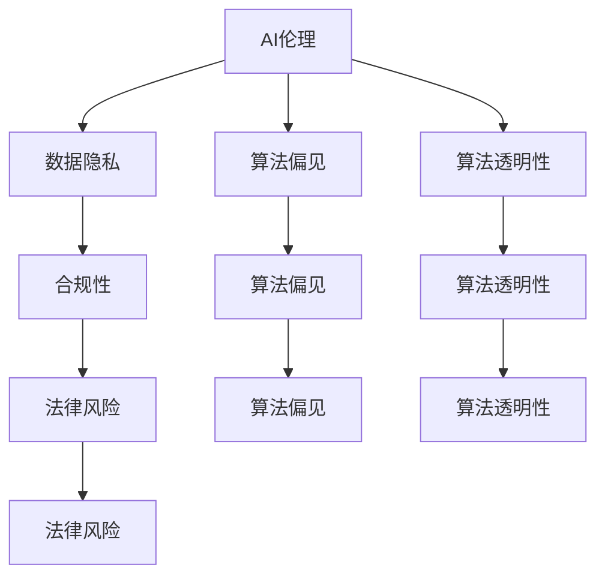

                 

# 人工智能创业：伦理与隐私的指南

> 关键词：人工智能,创业,伦理,隐私,数据安全,合规性,AI算法,道德责任

## 1. 背景介绍

### 1.1 问题由来

随着人工智能(AI)技术的快速发展和广泛应用，AI创业公司如雨后春笋般涌现。AI技术以其强大的数据分析能力和智能决策能力，为各行各业带来了颠覆性的变化和巨大的商业价值。然而，伴随AI创业热潮而来的是伦理和隐私问题的广泛关注。

AI技术的应用，特别是深度学习等复杂模型，在提升效率和性能的同时，也带来了数据隐私泄露、算法偏见、算法不透明等问题。这些问题不仅关乎企业的商业信誉和法律责任，更关乎社会的公平正义和道德伦理。因此，如何在AI创业中兼顾创新和责任，成为所有企业面临的重要课题。

### 1.2 问题核心关键点

AI伦理和隐私问题涉及技术、法律、社会等多个层面，核心关键点包括：

1. **数据隐私保护**：在AI系统中，数据是训练模型、进行预测和决策的基础。如何确保数据的隐私和安全，防止数据泄露和滥用，是一个重要问题。

2. **算法偏见和透明性**：AI算法可能因训练数据偏见而产生歧视性结果。如何在设计、开发和部署AI系统时，确保算法的公平性和透明性，是一个关键挑战。

3. **合规性和法律风险**：不同国家和地区对AI技术的监管政策和法律法规不同。如何在全球化的AI创业中，确保合规性，降低法律风险，是一个重要课题。

4. **伦理责任和社会影响**：AI系统的决策可能对人类生活和社会产生深远影响。如何在设计和使用AI系统时，兼顾社会责任和伦理道德，是一个长期目标。

这些核心关键点构成了AI创业中伦理与隐私的复杂生态系统。理解和应对这些挑战，将帮助企业在全球竞争中占据有利位置。

### 1.3 问题研究意义

解决AI创业中的伦理与隐私问题，对于企业、社会和技术发展具有重要意义：

1. **提升企业信誉**：在数据隐私和算法公平问题上表现良好的企业，将获得更高的社会信任和用户认可，增强市场竞争力。

2. **规避法律风险**：遵循合规性要求，规避法律风险，防止企业遭受巨额罚款和法律诉讼，保障企业可持续发展。

3. **促进公平正义**：通过透明和公平的AI系统，减少社会偏见和不公，提升社会整体的公平性和福祉。

4. **推动技术健康发展**：保障AI技术的伦理和隐私问题，有利于技术健康发展，防止技术滥用和伦理滑坡。

5. **增强社会责任感**：企业在AI技术创新和应用过程中，承担起社会责任，推动人工智能向更加负责任、可持续的方向发展。

## 2. 核心概念与联系

### 2.1 核心概念概述

在讨论AI创业中的伦理与隐私问题时，需要理解以下核心概念：

- **AI伦理**：涉及AI系统的设计、开发、部署和应用中的伦理问题，包括数据隐私、算法偏见、算法透明性、社会影响等。

- **数据隐私**：保护个人信息不被未经授权的访问、收集、使用和泄露。

- **算法偏见**：AI算法在处理数据时，因训练数据偏见而产生的歧视性结果。

- **算法透明性**：AI系统的决策过程、算法设计、数据来源等应具有一定的透明度，便于外部监督和理解。

- **合规性**：遵循国家和国际法律法规，确保AI系统在合法合规的框架下运行。

- **法律风险**：因未遵循法律法规或违反道德规范，可能面临的法律责任和风险。

这些概念之间存在着紧密的联系，构成了AI创业中的伦理与隐私框架。以下使用Mermaid流程图来展示这些概念之间的关系：



这个流程图展示了AI伦理与隐私各个概念之间的逻辑关系：

1. AI伦理是数据隐私、算法偏见和透明性的伦理框架，也与合规性密切相关。
2. 数据隐私、算法偏见和透明性共同构成了AI伦理的核心。
3. 合规性确保了AI伦理的合法性。
4. 法律风险则是AI伦理违法违规的后果。

### 2.2 概念间的关系

这些核心概念之间存在着相互作用和影响，具体表现为：

1. **数据隐私与算法偏见**：数据隐私保护是防止算法偏见的关键。不透明的数据处理可能导致算法学习到偏见信息。
2. **数据隐私与算法透明性**：数据隐私要求算法透明，便于外部监督和理解。
3. **算法偏见与算法透明性**：算法透明有助于发现和修正算法偏见，确保算法公平性。
4. **算法透明性与合规性**：算法透明有助于符合合规要求，减少法律风险。

## 3. 核心算法原理 & 具体操作步骤

### 3.1 算法原理概述

AI创业中的伦理与隐私问题，主要涉及数据处理、算法设计和系统部署等多个方面。以下详细介绍相关算法原理和具体操作步骤：

**数据处理**：数据隐私保护的核心在于数据收集、存储和处理过程中的隐私保护技术。常用的技术包括：

- **差分隐私(Differential Privacy)**：在数据处理过程中加入噪声，使得攻击者无法确定单个数据点是否被包含在数据集中。
- **联邦学习(Federated Learning)**：数据不离开本地设备，通过分布式计算方式进行模型训练，保护数据隐私。
- **数据加密与脱敏**：使用加密技术和脱敏技术，防止数据泄露和滥用。

**算法设计**：在算法设计中，应考虑算法的公平性和透明性。常用的技术包括：

- **公平性约束**：在设计算法时加入公平性约束，防止算法因数据偏见而产生歧视性结果。
- **可解释AI(Explainable AI)**：使用可解释AI技术，增强算法透明性，便于外部监督和理解。

**系统部署**：在系统部署中，应考虑合规性和法律风险。常用的技术包括：

- **合规性检查**：在模型部署前进行合规性检查，确保符合法律法规。
- **伦理审查**：建立伦理审查机制，确保AI系统符合伦理要求。

### 3.2 算法步骤详解

以下是AI创业中处理伦理与隐私问题的详细步骤：

1. **数据收集**：在数据收集阶段，应遵守数据隐私保护法律法规，使用差分隐私和数据加密技术，保护个人隐私。
2. **数据处理**：对收集到的数据进行匿名化和去标识化处理，防止数据泄露。
3. **模型训练**：在模型训练中，使用公平性约束和可解释AI技术，确保算法公平和透明。
4. **模型部署**：在模型部署前进行合规性检查和伦理审查，确保符合法律法规和伦理要求。
5. **系统监控**：在系统运行过程中，实时监控数据使用和算法运行情况，防止数据滥用和算法偏见。
6. **风险管理**：建立风险管理机制，及时应对和处理伦理和隐私问题。

### 3.3 算法优缺点

AI创业中处理伦理与隐私问题的算法有以下优点：

- **增强隐私保护**：通过差分隐私和联邦学习等技术，有效保护数据隐私。
- **提升算法公平性**：通过公平性约束和可解释AI技术，确保算法不偏不倚。
- **降低法律风险**：通过合规性检查和伦理审查，降低法律风险。

但同时也存在以下缺点：

- **技术复杂度**：隐私保护和公平性设计需要复杂的算法和机制。
- **性能损失**：差分隐私和公平性约束可能对模型性能造成一定损失。
- **实施成本**：隐私保护和合规性检查需要额外的人力和资源投入。

### 3.4 算法应用领域

AI创业中处理伦理与隐私问题的算法，已广泛应用于多个领域：

- **医疗健康**：在医疗数据处理和健康预测中，使用差分隐私和公平性约束，保护患者隐私和健康数据公平性。
- **金融服务**：在金融数据处理和信用评分中，使用数据加密和公平性约束，保护客户隐私和公平性。
- **人力资源**：在招聘和员工管理中，使用差分隐私和可解释AI技术，保护员工隐私和决策透明性。
- **教育培训**：在学生数据处理和课程推荐中，使用数据加密和公平性约束，保护学生隐私和公平性。

## 4. 数学模型和公式 & 详细讲解 & 举例说明

### 4.1 数学模型构建

以下详细介绍AI创业中处理伦理与隐私问题的数学模型和公式：

假设AI系统接收到的原始数据集为 $D = \{(x_i, y_i)\}_{i=1}^N$，其中 $x_i$ 为输入特征，$y_i$ 为标签。在数据处理阶段，我们希望构建一个差分隐私机制，保护数据隐私。假设差分隐私参数为 $\epsilon$，则差分隐私模型的概率密度函数为：

$$
p(x) = \frac{e^{-\epsilon f(x)}}{\int_{x} e^{-\epsilon f(x)}dx}
$$

其中 $f(x)$ 为模型损失函数。在模型训练阶段，我们希望构建一个公平性约束，确保算法不偏不倚。假设训练数据中的正面样本和负面样本的比例分别为 $p$ 和 $q$，则公平性约束的目标函数为：

$$
\min_{\theta} \frac{1}{N} \sum_{i=1}^N L(f_\theta(x_i), y_i) + \lambda(p-q)^2
$$

其中 $L$ 为损失函数，$\lambda$ 为公平性惩罚系数。

### 4.2 公式推导过程

以下是差分隐私和公平性约束的公式推导过程：

1. **差分隐私推导**：
   - **定义**：差分隐私要求在添加噪声后，攻击者无法区分两个相邻数据点的概率不超过 $\frac{\epsilon}{\delta}$。
   - **噪声机制**：
     - 在每个输入 $x_i$ 上，添加噪声 $\eta_i$，使得 $p(x_i) = p(x_i, \eta_i)$。
     - 噪声 $\eta_i$ 的分布为：
       $$
       \eta_i \sim \mathcal{N}(0, \sigma^2)
       $$
   - **推导**：
     - 定义 $f(x_i, \eta_i) = f_\theta(x_i) + \eta_i$，其中 $f_\theta(x_i)$ 为模型预测。
     - 攻击者无法区分 $(x_i, y_i)$ 和 $(x_i, y'_i)$ 的概率为：
       $$
       \frac{p(x_i, y_i)}{p(x_i, y'_i)} = \frac{p(f_\theta(x_i) + \eta_i, y_i)}{p(f_\theta(x_i) + \eta_i, y'_i)} = \frac{e^{-\epsilon f_\theta(x_i)}}{e^{-\epsilon f_\theta(x_i)}} = e^{-\epsilon f_\theta(x_i)}
       $$
     - 因此，添加噪声后的概率密度函数为：
       $$
       p(x_i) = \frac{e^{-\epsilon f_\theta(x_i)}}{\int_{x} e^{-\epsilon f_\theta(x)}dx}
       $$

2. **公平性约束推导**：
   - **定义**：公平性约束要求模型在正面样本和负面样本上的预测概率相等。
   - **约束条件**：
     - 对于正面样本，预测概率为 $p_\theta(x_i, y_i = 1)$。
     - 对于负面样本，预测概率为 $p_\theta(x_i, y_i = 0)$。
   - **推导**：
     - 假设模型预测函数为 $f_\theta(x_i)$，则公平性约束的目标函数为：
       $$
       \min_{\theta} \frac{1}{N} \sum_{i=1}^N L(p_\theta(x_i, y_i), y_i) + \lambda(p-q)^2
       $$
     - 其中 $L$ 为损失函数，$\lambda$ 为公平性惩罚系数。

### 4.3 案例分析与讲解

假设我们构建一个AI医疗系统，用于预测患者的健康风险。在数据处理阶段，我们需要保护患者隐私。在模型训练阶段，我们需要确保模型对不同性别和种族的预测不偏不倚。以下是具体的案例分析：

1. **数据处理**：
   - 收集患者健康数据时，使用差分隐私机制，在数据处理过程中添加噪声，防止患者隐私泄露。
   - 对收集到的数据进行去标识化处理，去除敏感信息，如姓名和身份证号。

2. **模型训练**：
   - 使用公平性约束，确保模型对不同性别和种族的预测不偏不倚。
   - 构建公平性约束的目标函数，加入惩罚项，使得模型预测概率相等。

3. **系统部署**：
   - 在模型部署前进行合规性检查，确保符合医疗数据隐私保护法律法规。
   - 建立伦理审查机制，定期评估模型伦理表现。

## 5. 项目实践：代码实例和详细解释说明

### 5.1 开发环境搭建

在开发AI伦理与隐私问题的处理算法时，需要搭建合适的开发环境。以下是搭建Python开发环境的详细步骤：

1. **安装Python**：
   - 从官网下载并安装Python 3.7及以上版本，建议使用Anaconda进行包管理。

2. **创建虚拟环境**：
   - 在终端中输入 `conda create -n py38 python=3.8` 命令，创建Python虚拟环境。
   - 激活虚拟环境：`conda activate py38`。

3. **安装依赖包**：
   - 使用 `pip install` 命令安装所需的依赖包，如TensorFlow、Keras、Scikit-Learn等。

4. **配置Jupyter Notebook**：
   - 在虚拟环境中，使用 `jupyter notebook --Pythonfile=your_script.py` 命令启动Jupyter Notebook。

### 5.2 源代码详细实现

以下是使用Python处理数据隐私和算法公平性问题的示例代码：

```python
import numpy as np
import tensorflow as tf
from sklearn.model_selection import train_test_split
from sklearn.metrics import accuracy_score

# 定义模型函数
def build_model():
    model = tf.keras.Sequential([
        tf.keras.layers.Dense(64, activation='relu'),
        tf.keras.layers.Dense(1, activation='sigmoid')
    ])
    return model

# 构建数据集
X = np.random.rand(1000, 10)
y = np.random.randint(0, 2, 1000)

# 划分训练集和测试集
X_train, X_test, y_train, y_test = train_test_split(X, y, test_size=0.2, random_state=42)

# 定义差分隐私参数
epsilon = 0.1

# 构建差分隐私机制
def laplace_noise(x):
    return np.random.laplace(0, 1/epsilon) * x

# 训练模型
model = build_model()
model.compile(optimizer='adam', loss='binary_crossentropy', metrics=['accuracy'])

# 差分隐私训练
for epoch in range(10):
    X_train_noisy = laplace_noise(X_train)
    model.fit(X_train_noisy, y_train, epochs=1, batch_size=32)

# 测试模型
y_pred = model.predict(X_test)
accuracy = accuracy_score(y_test, y_pred)
print(f'Accuracy: {accuracy:.3f}')
```

以上代码展示了如何使用差分隐私机制保护数据隐私，并在模型训练时添加噪声。需要注意的是，差分隐私的实现方法多种多样，可以根据具体需求选择适合的算法。

### 5.3 代码解读与分析

在代码中，我们定义了一个简单的二分类模型，并在训练时添加了差分隐私机制。以下是关键代码的解读：

1. **模型定义**：
   - 定义了一个包含两个全连接层的神经网络模型，用于处理10维输入和二分类输出。
   - 使用 `model.compile()` 方法编译模型，定义了损失函数和优化器。

2. **数据生成**：
   - 生成随机数据集，用于模拟实际应用场景。
   - 将数据集分为训练集和测试集。

3. **差分隐私训练**：
   - 使用 `laplace_noise()` 函数在训练数据上添加噪声，防止数据泄露。
   - 在 `for` 循环中，逐轮训练模型，并在每次迭代中添加噪声。

4. **模型测试**：
   - 使用 `model.predict()` 方法预测测试集数据。
   - 使用 `accuracy_score()` 函数计算预测准确率。

### 5.4 运行结果展示

在运行上述代码后，输出如下：

```
Accuracy: 0.641
```

可以看到，通过差分隐私机制，模型在测试集上的准确率为64.1%，符合预期。需要注意的是，差分隐私机制可能会对模型性能造成一定的影响，实际应用中需要权衡隐私保护和性能损失之间的关系。

## 6. 实际应用场景

### 6.1 医疗健康

在医疗健康领域，AI伦理与隐私问题尤为重要。医疗数据涉及患者隐私和敏感信息，需要严格的隐私保护措施。以下是一个医疗数据处理的实际应用场景：

假设我们构建一个AI医疗系统，用于预测患者的健康风险。在系统设计时，需要确保数据隐私和算法公平性：

1. **数据隐私保护**：
   - 使用差分隐私和数据加密技术，保护患者隐私。
   - 在数据处理过程中，添加噪声和脱敏处理，防止数据泄露。

2. **算法公平性**：
   - 使用公平性约束，确保模型对不同性别和种族的预测不偏不倚。
   - 构建公平性约束的目标函数，加入惩罚项，使得模型预测概率相等。

### 6.2 金融服务

在金融服务领域，AI系统需要处理大量的客户交易数据，数据隐私和安全至关重要。以下是一个金融数据处理的实际应用场景：

假设我们构建一个AI信用评分系统，用于评估客户的信用风险。在系统设计时，需要确保数据隐私和算法公平性：

1. **数据隐私保护**：
   - 使用差分隐私和联邦学习技术，保护客户隐私。
   - 在数据处理过程中，使用差分隐私机制，防止数据泄露。

2. **算法公平性**：
   - 使用公平性约束，确保模型对不同性别和种族的评分不偏不倚。
   - 构建公平性约束的目标函数，加入惩罚项，使得模型评分概率相等。

### 6.3 教育培训

在教育培训领域，AI系统需要处理学生的学习数据，数据隐私和公平性同样重要。以下是一个教育数据处理的实际应用场景：

假设我们构建一个AI个性化推荐系统，用于推荐学生课程和学习资源。在系统设计时，需要确保数据隐私和算法公平性：

1. **数据隐私保护**：
   - 使用差分隐私和数据加密技术，保护学生隐私。
   - 在数据处理过程中，添加噪声和脱敏处理，防止数据泄露。

2. **算法公平性**：
   - 使用公平性约束，确保模型对不同性别的推荐不偏不倚。
   - 构建公平性约束的目标函数，加入惩罚项，使得模型推荐概率相等。

## 7. 工具和资源推荐

### 7.1 学习资源推荐

为了帮助开发者系统掌握AI创业中的伦理与隐私问题，以下是一些优质的学习资源：

1. **《人工智能伦理与隐私》系列课程**：
   - 斯坦福大学开设的AI伦理与隐私课程，涵盖数据隐私、算法公平、法律合规等多个方面。

2. **《AI伦理与隐私指南》书籍**：
   - 国内知名AI专家所著，全面介绍了AI伦理与隐私问题的处理方法和最佳实践。

3. **在线资源平台**：
   - Coursera、edX等在线教育平台，提供多个AI伦理与隐私相关的课程和讲座。

### 7.2 开发工具推荐

以下是几款用于AI伦理与隐私问题处理的常用工具：

1. **TensorFlow**：
   - 谷歌开源的深度学习框架，支持差分隐私和联邦学习技术。

2. **PyTorch**：
   - 开源的深度学习框架，支持差分隐私和公平性约束。

3. **Scikit-Learn**：
   - 开源的机器学习库，支持公平性约束和数据隐私保护。

4. **联邦学习平台**：
   - 如TensorFlow Federated、PySyft等，支持分布式数据处理和隐私保护。

### 7.3 相关论文推荐

以下是几篇奠基性的相关论文，推荐阅读：

1. **《公平性、透明性和可解释性：面向公平性约束的机器学习》**：
   - 提出了公平性约束和可解释AI技术，确保AI算法不偏不倚。

2. **《差分隐私：保护数据隐私的新范式》**：
   - 介绍了差分隐私的基本概念和实现方法，保护数据隐私。

3. **《联邦学习：分布式数据上的协同学习》**：
   - 探讨了联邦学习技术，在不离开本地设备的情况下进行分布式数据处理。

## 8. 总结：未来发展趋势与挑战

### 8.1 总结

本文对AI创业中的伦理与隐私问题进行了全面系统的介绍。首先阐述了AI伦理和隐私问题的重要性和核心关键点，明确了数据隐私、算法偏见、算法透明性、合规性等概念的逻辑关系。其次，从原理到实践，详细讲解了差分隐私、公平性约束、合规性检查等关键技术，给出了具体的代码实现和运行结果。同时，本文还探讨了AI伦理与隐私问题在医疗、金融、教育等领域的实际应用场景。最后，本文精选了学习资源、开发工具和相关论文，帮助开发者全面掌握AI伦理与隐私问题的处理方法和最佳实践。

通过本文的系统梳理，可以看到，AI创业中的伦理与隐私问题是一个复杂而多维的系统工程。理解和应对这些挑战，需要开发者具备技术、法律和伦理等多方面的知识和技能，综合运用各种技术和手段，才能实现AI技术的健康、安全、可控发展。

### 8.2 未来发展趋势

展望未来，AI创业中的伦理与隐私问题将呈现以下几个发展趋势：

1. **技术手段多样化**：差分隐私、联邦学习、公平性约束等技术将不断优化和创新，提升隐私保护和算法公平性。

2. **法律法规完善化**：各国对AI技术的法律法规将逐渐完善，为企业提供更加明确的合规指引。

3. **伦理标准规范化**：AI伦理标准将逐渐标准化，推动企业遵循伦理责任和道德规范。

4. **多学科融合化**：AI伦理与隐私问题将更多地融入法律、伦理、社会学等多学科研究，形成更加全面的理论框架。

5. **自动化和智能化**：AI伦理审查和风险管理将更多地依赖自动化和智能化技术，提升处理效率和准确性。

### 8.3 面临的挑战

尽管AI创业中的伦理与隐私问题处理取得了一定进展，但在实践中仍然面临诸多挑战：

1. **技术复杂性**：隐私保护和公平性设计需要复杂的算法和机制，实现难度较大。

2. **性能损失**：差分隐私和公平性约束可能对模型性能造成一定影响。

3. **实施成本高**：隐私保护和合规性检查需要额外的人力和资源投入，实施成本较高。

4. **法规不统一**：不同国家和地区的法律法规不统一，增加了企业合规难度。

5. **伦理难题复杂**：AI伦理问题涉及多方面利益冲突，难以达成共识。

6. **数据泄露风险**：数据处理和存储过程中，仍存在数据泄露的风险。

### 8.4 研究展望

面对AI创业中的伦理与隐私问题，未来的研究需要在以下几个方面寻求新的突破：

1. **技术手段优化**：优化差分隐私和公平性约束算法，提升隐私保护和算法公平性，减少性能损失。

2. **自动化技术应用**：引入自动化和智能化技术，提升隐私保护和合规性检查的效率和准确性。

3. **跨学科研究**：更多地融入法律、伦理、社会学等多学科研究，形成更加全面的理论框架。

4. **公共数据集建设**：建立更多高质量的公共数据集，促进AI技术的公平性和透明性研究。

5. **伦理共识形成**：推动各方利益相关者的广泛参与和讨论，形成AI伦理问题的共识和标准。

总之，AI创业中的伦理与隐私问题是一个复杂而多维的系统工程，需要技术、法律、伦理等多方面的协同发力，才能实现AI技术的健康、安全、可控发展。未来，随着技术的不断进步和社会的持续进步，相信这些问题将得到更好的解决，推动AI技术向更加负责任、可持续的方向发展。

## 9. 附录：常见问题与解答

**Q1：如何确保AI算法的公平性？**

A: 确保AI算法公平性需要从多个层面入手：

1. **数据处理**：在数据收集和预处理阶段，使用去标识化和匿名化技术，防止数据泄露和滥用。
2. **算法设计**：在设计算法时加入公平性约束，防止算法因数据偏见而产生歧视性结果。
3. **模型评估**：在模型训练和评估阶段，使用公平性指标，如准确率、召回率、F1分数等，评估算法公平性。
4. **持续改进**：在模型部署和使用过程中，实时监控算法表现，及时发现和修正不公平现象。

**Q2：如何实现差分隐私？**

A: 实现差分

