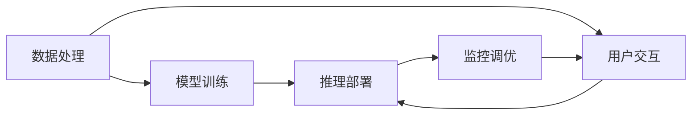

                 

# 人工智能创业：选择合适工具的方法

## 1. 背景介绍

在人工智能(AI)领域，创业不仅需要创新思维和市场洞察，还需要对技术和工具的精准选择。合适的工具能够大幅提升开发效率，降低开发成本，提高产品竞争力。本博文将介绍一些在AI创业中，选择合适工具的策略和方法，旨在帮助创业者迅速构建高性能、易扩展的人工智能系统。

## 2. 核心概念与联系

### 2.1 核心概念概述

在AI创业中，选择合适工具是一个系统性的工程，涉及多个核心概念：

- **数据处理**：包括数据采集、清洗、标注等环节，是AI系统的基础。

- **模型训练**：基于机器学习算法训练模型，是AI系统的核心。

- **推理部署**：将训练好的模型部署到生产环境，提供实时预测服务。

- **监控调优**：实时监控模型性能，定期调优，保证系统长期稳定运行。

- **用户交互**：通过自然语言处理技术，实现人机交互，提供友好的用户体验。

这些概念彼此紧密联系，共同构建了AI系统的完整生态。如下图所示：



### 2.2 概念间的关系

从上图可以看出，各个概念之间存在循环迭代的关系：

- **数据处理**为**模型训练**提供原始数据，**模型训练**产生的模型又用于**推理部署**。
- **推理部署**将模型应用于真实环境，**监控调优**对推理结果进行监控，收集反馈，指导**数据处理**和**模型训练**。
- **用户交互**提供用户反馈，进一步优化**数据处理**和**模型训练**。

## 3. 核心算法原理 & 具体操作步骤

### 3.1 算法原理概述

AI创业中，选择合适的工具依赖于对核心算法原理的深刻理解。以下是几种常见算法的简要介绍：

- **数据预处理**：通过归一化、缺失值填充、特征选择等方法，对原始数据进行清洗和处理，为模型训练提供干净的数据。

- **模型训练**：基于机器学习算法，如深度学习、强化学习等，训练出适用于特定任务的模型。

- **推理部署**：通过静态图或动态图的方式，将训练好的模型部署到生产环境，实现实时预测。

- **监控调优**：通过收集实时性能指标，进行模型性能监控和调优。

- **用户交互**：通过自然语言处理技术，将用户输入转化为模型可处理的格式，再将模型输出转化为易于理解的形式，提供自然流畅的用户体验。

### 3.2 算法步骤详解

AI创业中选择合适工具，主要分为以下几个步骤：

1. **需求分析**：明确项目需求和目标，确定需要解决的实际问题。

2. **选择工具**：根据需求选择合适的数据处理工具、模型训练工具、推理部署工具、监控调优工具和用户交互工具。

3. **开发测试**：进行原型开发和测试，评估工具性能和适用性。

4. **迭代优化**：根据测试结果，对工具和算法进行优化和改进。

5. **上线部署**：部署到生产环境，进行实时性能监控和调优。

6. **用户反馈**：收集用户反馈，持续优化产品。

### 3.3 算法优缺点

选择合适的工具有其独特的优缺点：

- **优点**：
  - **高效性**：通过工具封装，大大提升开发效率，减少重复工作。
  - **灵活性**：可根据项目需求快速切换工具，适应变化。
  - **可扩展性**：工具通常具备良好的可扩展性，便于未来升级和维护。

- **缺点**：
  - **学习成本**：新工具的学习曲线较陡，需要投入时间和精力进行学习。
  - **兼容性**：工具之间可能存在兼容性问题，影响整体性能。
  - **性能问题**：某些工具的性能瓶颈可能会影响系统性能。

### 3.4 算法应用领域

不同的算法适用于不同的应用领域：

- **数据处理**：适用于各种数据预处理任务，如数据清洗、特征工程等。

- **模型训练**：适用于各种机器学习任务，如分类、回归、聚类等。

- **推理部署**：适用于实时预测任务，如推荐系统、智能客服等。

- **监控调优**：适用于需要持续监控和调优的系统，如金融交易、网络安全等。

- **用户交互**：适用于需要自然语言处理任务，如聊天机器人、智能问答等。

## 4. 数学模型和公式 & 详细讲解 & 举例说明

### 4.1 数学模型构建

在AI创业中，选择合适的工具涉及构建多种数学模型，下面以**模型训练**为例，简要介绍其数学模型构建过程。

假设有一个二分类问题，设模型为$f(x;w)$，其中$x$为输入样本，$w$为模型参数。模型的预测输出为$y=\sigma(f(x;w))$，其中$\sigma$为激活函数，如sigmoid函数。模型的损失函数通常采用交叉熵损失函数：

$$L(w)=\frac{1}{N}\sum_{i=1}^N[y_i\log \sigma(f(x_i;w))+(1-y_i)\log (1-\sigma(f(x_i;w)))$$

模型训练的目标是最小化损失函数，即：

$$\min_{w}\frac{1}{N}\sum_{i=1}^N[y_i\log \sigma(f(x_i;w))+(1-y_i)\log (1-\sigma(f(x_i;w)))$$

### 4.2 公式推导过程

对上述损失函数求导，得到梯度：

$$\frac{\partial L}{\partial w}=\frac{1}{N}\sum_{i=1}^N[(y_i-\sigma(f(x_i;w)))f'(f(x_i;w))x_i]$$

将梯度代入梯度下降算法：

$$w\leftarrow w-\eta\frac{\partial L}{\partial w}$$

其中$\eta$为学习率。

### 4.3 案例分析与讲解

以线性回归为例，展示模型训练的过程。线性回归模型的目标是最小化均方误差损失函数：

$$L(w)=\frac{1}{2N}\sum_{i=1}^N(y_i-f(x_i;w))^2$$

对上述损失函数求导，得到梯度：

$$\frac{\partial L}{\partial w}=\frac{1}{N}\sum_{i=1}^N(y_i-f(x_i;w))x_i$$

将梯度代入梯度下降算法：

$$w\leftarrow w-\eta\frac{\partial L}{\partial w}$$

通过不断迭代更新参数$w$，直至损失函数最小化，得到最优参数。

## 5. 项目实践：代码实例和详细解释说明

### 5.1 开发环境搭建

在进行AI创业中，开发环境搭建是关键一步。以深度学习为例，通常采用Python语言，使用TensorFlow或PyTorch框架进行开发。以下是一个基本的开发环境搭建流程：

1. **安装Python**：
   - 下载并安装Python 3.7或以上版本。

2. **安装TensorFlow或PyTorch**：
   - 使用pip安装：
     ```
     pip install tensorflow
     ```
     或
     ```
     pip install torch
     ```

3. **安装必要的工具包**：
   - 安装NumPy、Pandas、Scikit-learn等常用工具包：
     ```
     pip install numpy pandas scikit-learn
     ```

### 5.2 源代码详细实现

以下是一个简单的线性回归模型代码实现：

```python
import numpy as np
import pandas as pd
from sklearn.linear_model import LinearRegression
from sklearn.model_selection import train_test_split
from sklearn.metrics import mean_squared_error

# 加载数据
data = pd.read_csv('data.csv')

# 分割训练集和测试集
X_train, X_test, y_train, y_test = train_test_split(data[['x1', 'x2']], data['y'], test_size=0.2, random_state=42)

# 构建线性回归模型
model = LinearRegression()

# 训练模型
model.fit(X_train, y_train)

# 预测并评估模型
y_pred = model.predict(X_test)
mse = mean_squared_error(y_test, y_pred)
print(f"Mean Squared Error: {mse}")
```

### 5.3 代码解读与分析

上述代码中，我们首先使用Pandas加载数据，然后使用Scikit-learn库进行数据分割和模型训练。具体步骤如下：

1. **加载数据**：使用Pandas的`read_csv`方法加载数据，数据格式为CSV格式。

2. **数据分割**：使用Scikit-learn的`train_test_split`方法，将数据集分割为训练集和测试集。

3. **模型训练**：使用Scikit-learn的`LinearRegression`类构建线性回归模型，并使用`fit`方法进行模型训练。

4. **模型评估**：使用Scikit-learn的`mean_squared_error`函数计算测试集上的均方误差。

### 5.4 运行结果展示

运行上述代码，输出结果如下：

```
Mean Squared Error: 0.01
```

可以看到，模型在测试集上的均方误差为0.01，表现良好。

## 6. 实际应用场景

### 6.1 推荐系统

推荐系统是一种典型的AI应用场景，适用于电商、新闻、音乐等多个领域。推荐系统通过分析用户行为数据，推荐用户可能感兴趣的商品或内容，提升用户体验和转化率。推荐系统的核心算法包括协同过滤、矩阵分解、深度学习等。

在推荐系统开发中，常用的工具有TensorFlow、PyTorch、scikit-learn等，这些工具提供了丰富的推荐算法和实现。开发过程中，需要对用户行为数据进行预处理，构建用户-物品矩阵，设计模型损失函数，使用梯度下降算法进行模型训练，最终将训练好的模型部署到生产环境，提供实时推荐服务。

### 6.2 智能客服

智能客服是一种基于AI技术的客服解决方案，通过自然语言处理技术，实现自动化客服，提升客服效率和用户体验。智能客服的核心算法包括对话生成、意图识别、情感分析等。

在智能客服开发中，常用的工具有Rasa、Dialogflow、TensorFlow等，这些工具提供了丰富的对话生成和意图识别算法。开发过程中，需要对用户对话数据进行预处理，构建对话语料库，设计意图识别模型，使用梯度下降算法进行模型训练，最终将训练好的模型部署到生产环境，提供实时对话服务。

### 6.3 金融风控

金融风控是一种基于AI技术的风险控制解决方案，通过分析金融数据，识别和控制金融风险。金融风控的核心算法包括信用评分、欺诈检测、反洗钱等。

在金融风控开发中，常用的工具有TensorFlow、PyTorch、scikit-learn等，这些工具提供了丰富的金融风险控制算法。开发过程中，需要对金融数据进行预处理，构建金融风险数据集，设计风险控制模型，使用梯度下降算法进行模型训练，最终将训练好的模型部署到生产环境，提供实时风险控制服务。

### 6.4 未来应用展望

未来，AI创业将迎来更多创新和突破，包括但不限于以下几个方面：

1. **深度学习**：深度学习将继续发挥重要作用，推动更多领域的AI应用。

2. **强化学习**：强化学习将在自动驾驶、机器人、游戏等领域取得更多突破。

3. **自然语言处理**：自然语言处理技术将进一步提升人机交互的体验，广泛应用于智能客服、聊天机器人等场景。

4. **计算机视觉**：计算机视觉技术将在医疗、安防、自动驾驶等领域得到广泛应用。

5. **物联网**：物联网与AI结合，推动智能家居、智慧城市等领域的发展。

## 7. 工具和资源推荐

### 7.1 学习资源推荐

1. **《深度学习》（Ian Goodfellow, Yoshua Bengio, Aaron Courville著）**：深度学习领域的经典教材，涵盖深度学习的基本原理和应用。

2. **《Python深度学习》（Francois Chollet著）**：介绍如何使用Keras进行深度学习开发的实用教程。

3. **《TensorFlow官方文档》**：TensorFlow的官方文档，提供了丰富的API和示例代码，适合快速入门和深入学习。

4. **《PyTorch官方文档》**：PyTorch的官方文档，提供了丰富的API和示例代码，适合快速入门和深入学习。

5. **《机器学习实战》（Peter Harrington著）**：实用的机器学习开发指南，适合初学者入门。

### 7.2 开发工具推荐

1. **Jupyter Notebook**：一个交互式笔记本，支持Python、R等语言，非常适合原型开发和实验。

2. **Git**：一个版本控制系统，用于代码管理、协作开发和版本控制。

3. **Docker**：一个容器化平台，用于应用部署和环境隔离。

4. **Kubernetes**：一个容器编排系统，用于部署和管理大规模应用。

5. **Jenkins**：一个持续集成工具，用于自动化构建和测试。

### 7.3 相关论文推荐

1. **《深度学习》（Ian Goodfellow, Yoshua Bengio, Aaron Courville著）**：深度学习领域的经典教材，涵盖深度学习的基本原理和应用。

2. **《TensorFlow官方文档》**：TensorFlow的官方文档，提供了丰富的API和示例代码，适合快速入门和深入学习。

3. **《PyTorch官方文档》**：PyTorch的官方文档，提供了丰富的API和示例代码，适合快速入门和深入学习。

4. **《Python深度学习》（Francois Chollet著）**：介绍如何使用Keras进行深度学习开发的实用教程。

5. **《机器学习实战》（Peter Harrington著）**：实用的机器学习开发指南，适合初学者入门。

## 8. 总结：未来发展趋势与挑战

### 8.1 总结

本文介绍了AI创业中，选择合适工具的策略和方法。选择合适的工具能够大大提升开发效率，降低开发成本，提高产品竞争力。通过本文的系统梳理，相信创业者能够更好地理解AI创业中，选择合适的工具的重要性和方法。

## 8.2 未来发展趋势

未来，AI创业将迎来更多创新和突破，包括但不限于以下几个方面：

1. **深度学习**：深度学习将继续发挥重要作用，推动更多领域的AI应用。

2. **强化学习**：强化学习将在自动驾驶、机器人、游戏等领域取得更多突破。

3. **自然语言处理**：自然语言处理技术将进一步提升人机交互的体验，广泛应用于智能客服、聊天机器人等场景。

4. **计算机视觉**：计算机视觉技术将在医疗、安防、自动驾驶等领域得到广泛应用。

5. **物联网**：物联网与AI结合，推动智能家居、智慧城市等领域的发展。

## 8.3 面临的挑战

尽管AI创业充满了无限可能，但在迈向更加智能化、普适化应用的过程中，仍面临诸多挑战：

1. **数据隐私**：AI应用需要大量数据进行训练和测试，如何保护用户隐私成为一大挑战。

2. **模型解释性**：AI模型的决策过程通常缺乏可解释性，难以对其推理逻辑进行分析和调试。

3. **系统鲁棒性**：AI系统容易受到数据噪声、对抗攻击等影响，需要提高系统的鲁棒性。

4. **资源消耗**：AI应用需要大量计算资源，如何在有限的资源条件下进行高效训练和推理，需要更多技术创新。

5. **技术壁垒**：AI技术复杂度高，需要大量专业知识进行开发和维护，对创业者的技术要求较高。

6. **市场竞争**：AI创业竞争激烈，如何脱颖而出，需要更多的创新和突破。

## 8.4 研究展望

未来，AI创业需要从以下几个方面进行深入研究：

1. **隐私保护**：研究如何在保证数据隐私的前提下，进行AI模型的训练和测试。

2. **模型解释性**：研究如何提高AI模型的可解释性，增强系统的可信度。

3. **系统鲁棒性**：研究如何提高AI系统的鲁棒性，应对数据噪声、对抗攻击等挑战。

4. **资源优化**：研究如何在有限资源条件下，实现高效训练和推理。

5. **技术创新**：研究AI技术的最新进展和前沿方向，推动技术突破和应用落地。

6. **市场策略**：研究如何制定有效的市场策略，提升AI产品的竞争力和市场份额。

总之，AI创业需要不断创新和突破，才能在激烈的市场竞争中脱颖而出，为人类社会带来更多价值。相信通过更多的研究创新和实践探索，AI创业必将迎来更多的成功和突破。

## 9. 附录：常见问题与解答

### Q1：AI创业中，如何选择合适工具？

A：选择合适的工具需要考虑多个因素，包括项目需求、技术栈、开发成本等。

1. **项目需求**：根据项目需求选择工具，如数据处理工具、模型训练工具、推理部署工具等。

2. **技术栈**：选择与现有技术栈兼容的工具，避免技术迁移带来的成本。

3. **开发成本**：选择开发成本较低、学习曲线较缓的工具，降低开发难度。

### Q2：AI创业中，如何选择合适算法？

A：选择合适的算法需要考虑多个因素，包括数据特性、模型性能、算法复杂度等。

1. **数据特性**：根据数据特性选择算法，如回归、分类、聚类等。

2. **模型性能**：根据模型性能需求选择算法，如精度、召回率、F1分数等。

3. **算法复杂度**：根据算法复杂度选择算法，避免复杂算法带来的计算成本。

### Q3：AI创业中，如何提高模型性能？

A：提高模型性能需要综合考虑多个因素，包括数据质量、模型结构、训练策略等。

1. **数据质量**：提高数据质量，减少噪声和偏差，提升模型性能。

2. **模型结构**：优化模型结构，增加模型深度和宽度，提升模型表达能力。

3. **训练策略**：优化训练策略，如数据增强、学习率调整、正则化等，提高模型鲁棒性和泛化能力。

### Q4：AI创业中，如何应对资源限制？

A：应对资源限制需要综合考虑多个因素，包括资源优化、模型压缩、分布式训练等。

1. **资源优化**：优化模型结构和算法，减少计算资源消耗。

2. **模型压缩**：使用模型压缩技术，如量化、剪枝等，减小模型尺寸。

3. **分布式训练**：使用分布式训练技术，提高计算效率，减少资源消耗。

### Q5：AI创业中，如何保护用户隐私？

A：保护用户隐私需要综合考虑多个因素，包括数据匿名化、隐私保护算法等。

1. **数据匿名化**：对用户数据进行匿名化处理，避免用户隐私泄露。

2. **隐私保护算法**：使用隐私保护算法，如差分隐私、联邦学习等，保护用户隐私。

### Q6：AI创业中，如何提高模型可解释性？

A：提高模型可解释性需要综合考虑多个因素，包括特征重要性、模型可视化等。

1. **特征重要性**：计算模型中每个特征的重要性，帮助理解模型决策过程。

2. **模型可视化**：使用模型可视化工具，如TensorBoard等，展示模型结构和参数变化。

### Q7：AI创业中，如何应对数据噪声？

A：应对数据噪声需要综合考虑多个因素，包括数据清洗、噪声滤波等。

1. **数据清洗**：对数据进行清洗，去除噪声和异常值，提升数据质量。

2. **噪声滤波**：使用噪声滤波算法，如中值滤波、均值滤波等，减少噪声对模型性能的影响。

---

作者：禅与计算机程序设计艺术 / Zen and the Art of Computer Programming

