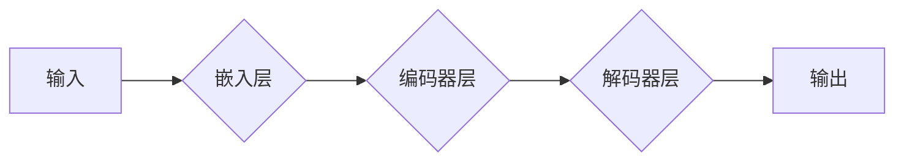

# 大模型的技术发展与市场匹配

> 关键词：大模型，技术发展，市场匹配，人工智能，深度学习，应用场景，商业模式，挑战

## 1. 背景介绍

随着深度学习技术的飞速发展，大模型（Large Models）已经成为人工智能领域的热点。大模型通过在海量数据上进行训练，能够学习到复杂的模式，并在各种任务上取得令人瞩目的成果。然而，大模型的技术发展与市场匹配是一个复杂的挑战，需要我们深入探讨。

### 1.1 大模型的兴起

近年来，大模型在图像识别、自然语言处理、语音识别等领域取得了显著的进展。例如，Google的BERT模型在NLP任务上取得了突破性的成果，OpenAI的GPT系列模型在文本生成任务上展现了惊人的能力。这些大模型的成功，不仅推动了人工智能技术的发展，也为市场带来了巨大的机遇。

### 1.2 大模型面临的挑战

尽管大模型在技术层面取得了巨大进步，但在市场匹配方面却面临着诸多挑战。这些挑战包括：

- **计算资源需求**：大模型需要大量的计算资源进行训练和推理，这对于资源有限的企业和机构来说是一个巨大的门槛。
- **数据隐私**：大模型的训练需要海量数据，而这些数据往往涉及用户隐私，如何确保数据安全和合规，是一个重要的问题。
- **算法偏见**：大模型在训练过程中可能会学习到数据中的偏见，如何避免算法偏见，是一个伦理问题。
- **可解释性**：大模型的决策过程往往缺乏可解释性，如何提高模型的透明度和可信度，是一个重要的研究方向。

## 2. 核心概念与联系

### 2.1 大模型原理和架构

大模型通常基于深度神经网络，通过多层非线性变换来学习数据的复杂模式。其基本架构包括：



其中，嵌入层将输入数据转换为低维向量，编码器层和解码器层通过多层变换学习数据的隐藏表示，最终输出结果。

### 2.2 大模型与市场的联系

大模型的市场匹配涉及以下几个方面：

- **应用场景**：大模型需要与具体的应用场景相结合，才能发挥其价值。
- **商业模式**：大模型的商业化需要建立合理的商业模式，才能实现可持续发展。
- **技术匹配**：大模型的技术特性需要与市场需求相匹配，才能获得市场认可。

## 3. 核心算法原理 & 具体操作步骤

### 3.1 算法原理概述

大模型的算法原理主要基于深度神经网络，包括以下步骤：

1. **数据预处理**：对输入数据进行清洗、格式化等预处理操作。
2. **嵌入层**：将输入数据转换为低维向量表示。
3. **编码器层**：通过多层变换学习数据的隐藏表示。
4. **解码器层**：根据隐藏表示生成输出结果。
5. **损失函数**：使用损失函数评估模型的输出结果与真实值之间的差异，并指导模型进行优化。

### 3.2 算法步骤详解

1. **数据预处理**：对输入数据进行清洗、去噪、填充等操作，确保数据质量。
2. **模型选择**：选择合适的深度神经网络模型，如卷积神经网络（CNN）、循环神经网络（RNN）或Transformer等。
3. **模型训练**：使用训练数据进行模型训练，通过优化算法（如梯度下降）调整模型参数。
4. **模型评估**：使用验证数据评估模型性能，调整模型参数或模型结构。
5. **模型部署**：将训练好的模型部署到实际应用中，如网站、移动应用或云端服务等。

### 3.3 算法优缺点

**优点**：

- **强大的学习能力**：大模型能够学习到复杂的模式，并在各种任务上取得优异的性能。
- **泛化能力**：大模型在训练过程中学习到的知识可以应用于不同的任务和领域。

**缺点**：

- **计算资源需求**：大模型需要大量的计算资源进行训练和推理。
- **数据隐私**：大模型的训练需要海量数据，如何确保数据安全和合规是一个重要的问题。
- **算法偏见**：大模型在训练过程中可能会学习到数据中的偏见。

### 3.4 算法应用领域

大模型的应用领域广泛，包括：

- **图像识别**：例如，人脸识别、物体识别、场景识别等。
- **自然语言处理**：例如，文本分类、机器翻译、情感分析等。
- **语音识别**：例如，语音合成、语音识别、语音转换等。

## 4. 数学模型和公式 & 详细讲解 & 举例说明

### 4.1 数学模型构建

大模型的数学模型主要基于深度神经网络，包括以下公式：

$$
y = f(W \cdot x + b)
$$

其中，$y$ 是模型的输出，$x$ 是模型的输入，$W$ 是模型的权重，$b$ 是模型的偏置。

### 4.2 公式推导过程

以卷积神经网络（CNN）为例，其数学模型如下：

$$
h^{[l]} = \sigma(W^{[l]} \cdot h^{[l-1]} + b^{[l]})
$$

其中，$h^{[l]}$ 是第 $l$ 层的输出，$h^{[l-1]}$ 是第 $l-1$ 层的输出，$W^{[l]}$ 是第 $l$ 层的权重，$b^{[l]}$ 是第 $l$ 层的偏置，$\sigma$ 是激活函数。

### 4.3 案例分析与讲解

以BERT模型为例，其数学模型如下：

$$
\text{context} = \text{BERT\_model}(\text{input\_ids}, \text{token\_type\_ids}, \text{attention\_mask})
$$

其中，$\text{input\_ids}$ 是输入文本的token ids，$\text{token\_type\_ids}$ 是token类型id，$\text{attention\_mask}$ 是注意力掩码，$\text{BERT\_model}$ 是BERT模型。

## 5. 项目实践：代码实例和详细解释说明

### 5.1 开发环境搭建

以Python为例，搭建大模型开发环境需要以下步骤：

1. 安装Python和pip。
2. 安装TensorFlow或PyTorch等深度学习框架。
3. 安装必要的库，如NumPy、Pandas等。

### 5.2 源代码详细实现

以下是一个简单的CNN模型实现示例：

```python
import tensorflow as tf

def create_cnn_model(input_shape):
  model = tf.keras.Sequential([
      tf.keras.layers.Conv2D(32, kernel_size=(3, 3), activation='relu', input_shape=input_shape),
      tf.keras.layers.MaxPooling2D(pool_size=(2, 2)),
      tf.keras.layers.Flatten(),
      tf.keras.layers.Dense(128, activation='relu'),
      tf.keras.layers.Dense(10, activation='softmax')
  ])
  return model
```

### 5.3 代码解读与分析

上述代码定义了一个简单的卷积神经网络模型，包括一个卷积层、一个池化层、一个全连接层和一个输出层。

- 卷积层：使用3x3的卷积核，激活函数为ReLU。
- 池化层：使用2x2的最大池化层。
- 全连接层：使用128个神经元，激活函数为ReLU。
- 输出层：使用10个神经元，表示10个类别，激活函数为softmax。

### 5.4 运行结果展示

以下是一个使用TensorFlow训练和评估CNN模型的示例：

```python
model = create_cnn_model(input_shape=(28, 28, 1))
model.compile(optimizer='adam', loss='categorical_crossentropy', metrics=['accuracy'])

# 训练模型
model.fit(x_train, y_train, epochs=5, batch_size=64, validation_data=(x_val, y_val))

# 评估模型
test_loss, test_acc = model.evaluate(x_test, y_test)
print('Test accuracy:', test_acc)
```

## 6. 实际应用场景

大模型在各个领域都有广泛的应用，以下是一些常见的应用场景：

- **医疗**：例如，疾病诊断、药物研发、临床试验等。
- **金融**：例如，风险控制、欺诈检测、投资策略等。
- **教育**：例如，个性化推荐、自动批改作业、智能辅导等。
- **交通**：例如，自动驾驶、交通流量预测、交通事故预警等。

## 7. 工具和资源推荐

### 7.1 学习资源推荐

- 《深度学习》（Ian Goodfellow等著）
- 《Python深度学习》（François Chollet等著）
- 《动手学深度学习》（Alec Radford等著）

### 7.2 开发工具推荐

- TensorFlow：一个开源的深度学习框架。
- PyTorch：一个开源的深度学习框架。
- Keras：一个高级神经网络API。

### 7.3 相关论文推荐

- "Generative Adversarial Nets"（Ian Goodfellow等，2014）
- "Deep Learning for Natural Language Processing"（Stanford University，2018）
- "Attention Is All You Need"（Ashish Vaswani等，2017）

## 8. 总结：未来发展趋势与挑战

### 8.1 研究成果总结

大模型在技术层面取得了显著的进展，并在各个领域都取得了应用。然而，大模型的市场匹配仍然面临诸多挑战，需要我们继续努力。

### 8.2 未来发展趋势

未来，大模型将朝着以下方向发展：

- **更强大的模型**：随着计算资源的提升，大模型的规模和复杂度将进一步提高。
- **更有效的训练方法**：开发更有效的训练方法，降低训练成本，提高训练效率。
- **更广泛的领域应用**：大模型将在更多领域得到应用，推动相关产业的发展。

### 8.3 面临的挑战

大模型面临的挑战包括：

- **计算资源需求**：大模型需要大量的计算资源进行训练和推理。
- **数据隐私**：大模型的训练需要海量数据，如何确保数据安全和合规，是一个重要的问题。
- **算法偏见**：大模型在训练过程中可能会学习到数据中的偏见，如何避免算法偏见，是一个重要的研究方向。
- **可解释性**：大模型的决策过程往往缺乏可解释性，如何提高模型的透明度和可信度，是一个重要的研究方向。

### 8.4 研究展望

未来，大模型的研究将朝着以下方向展开：

- **可解释性**：研究如何提高大模型的透明度和可信度。
- **可解释性**：研究如何提高大模型的透明度和可信度。
- **公平性**：研究如何避免大模型在训练过程中学习到数据中的偏见。
- **鲁棒性**：研究如何提高大模型的鲁棒性和泛化能力。

## 9. 附录：常见问题与解答

**Q1：大模型的优势是什么？**

A：大模型具有以下优势：

- **强大的学习能力**：大模型能够学习到复杂的模式，并在各种任务上取得优异的性能。
- **泛化能力**：大模型在训练过程中学习到的知识可以应用于不同的任务和领域。

**Q2：大模型的局限性是什么？**

A：大模型具有以下局限性：

- **计算资源需求**：大模型需要大量的计算资源进行训练和推理。
- **数据隐私**：大模型的训练需要海量数据，如何确保数据安全和合规，是一个重要的问题。
- **算法偏见**：大模型在训练过程中可能会学习到数据中的偏见。
- **可解释性**：大模型的决策过程往往缺乏可解释性，如何提高模型的透明度和可信度，是一个重要的研究方向。

**Q3：如何选择合适的大模型？**

A：选择合适的大模型需要考虑以下因素：

- **任务类型**：不同的任务需要不同类型的大模型。
- **数据规模**：数据规模较小的任务可能需要使用较小的大模型。
- **计算资源**：大模型的训练和推理需要大量的计算资源。

**Q4：大模型如何与市场匹配？**

A：大模型与市场的匹配需要考虑以下因素：

- **应用场景**：大模型需要与具体的应用场景相结合，才能发挥其价值。
- **商业模式**：大模型的商业化需要建立合理的商业模式，才能实现可持续发展。
- **技术匹配**：大模型的技术特性需要与市场需求相匹配，才能获得市场认可。