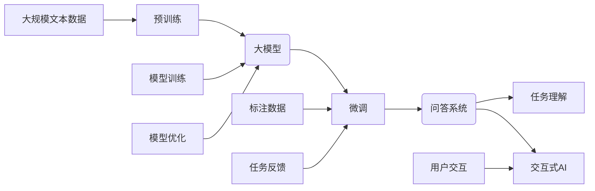

# 大模型问答机器人的任务完成能力

> 关键词：大模型，问答机器人，自然语言处理，预训练，微调，NLP，BERT，任务理解，交互式AI

## 1. 背景介绍

随着人工智能技术的飞速发展，自然语言处理（NLP）领域取得了显著的进步。问答系统作为NLP的一个重要分支，旨在让机器能够理解和回答人类提出的问题。近年来，基于大模型的问答机器人逐渐成为研究热点，它们在理解复杂问题、生成高质量答案方面展现出惊人的能力。本文将探讨大模型问答机器人的任务完成能力，分析其原理、技术实现及未来发展趋势。

### 1.1 问答系统的演变

问答系统经历了从基于规则、基于模板到基于机器学习，再到如今的基于大模型的演变过程。早期问答系统主要依赖于人工编写的规则和模板，难以应对复杂多变的自然语言问题。随着机器学习技术的兴起，基于统计的问答系统逐渐出现，能够处理一些开放域的问答任务。然而，这些系统在理解复杂问题、生成高质量答案方面仍存在局限性。

### 1.2 大模型问答系统的崛起

近年来，随着预训练语言模型（如BERT、GPT-3）的兴起，大模型问答系统逐渐成为研究热点。这些模型在大量无标签文本数据上进行预训练，学习到丰富的语言知识和常识，能够更好地理解复杂问题，并生成高质量答案。大模型问答系统在问答比赛（如Stanford Question Answering Dataset, SQuAD）中取得了显著的成果，展现出强大的任务完成能力。

## 2. 核心概念与联系

大模型问答系统涉及多个核心概念，包括预训练、微调、任务理解、交互式AI等。以下将使用Mermaid流程图展示这些概念之间的联系。



### 2.1 预训练

预训练是指在大规模无标签文本数据上对语言模型进行训练，使其学习到丰富的语言知识和常识。预训练模型通常采用自监督学习任务，如语言模型、掩码语言模型等。

### 2.2 微调

微调是指在预训练模型的基础上，使用下游任务的标注数据对其进行进一步训练，以适应特定任务的需求。微调过程通常只更新模型的顶层参数，以保持预训练得到的底层特征。

### 2.3 任务理解

任务理解是指问答系统对用户提出的问题进行解析，理解问题的意图、类型、领域等信息，从而生成合适的答案。

### 2.4 交互式AI

交互式AI是指能够与用户进行自然语言交互的人工智能系统。问答机器人作为交互式AI的一种，需要具备良好的用户交互体验。

## 3. 核心算法原理 & 具体操作步骤

### 3.1 算法原理概述

大模型问答系统主要基于预训练语言模型和微调技术。预训练模型学习到丰富的语言知识和常识，微调过程则使模型适应特定任务的需求。

### 3.2 算法步骤详解

1. 预训练：使用大规模无标签文本数据对语言模型进行预训练，使其学习到丰富的语言知识和常识。
2. 数据预处理：对标注数据进行清洗、去重、分词等预处理操作，并将其转换为模型可接受的输入格式。
3. 微调：在预训练模型的基础上，使用标注数据进行微调，以适应特定任务的需求。
4. 任务理解：对用户提出的问题进行解析，理解问题的意图、类型、领域等信息。
5. 答案生成：根据任务理解的结果，从知识库或网络中检索相关信息，生成合适的答案。
6. 用户交互：将生成的答案呈现给用户，并接收用户的反馈。

### 3.3 算法优缺点

### 3.3.1 优点

1. 理解能力更强：预训练模型学习到丰富的语言知识和常识，能够更好地理解复杂问题。
2. 生成质量更高：大模型问答系统能够生成高质量、符合人类语言习惯的答案。
3. 交互体验更佳：交互式AI设计使得问答机器人能够与用户进行自然语言交互。

### 3.3.2 缺点

1. 训练成本高：大模型的训练需要大量的计算资源和时间。
2. 知识获取困难：知识库的构建和维护需要大量人力和财力。
3. 可解释性差：大模型问答系统的决策过程难以解释，缺乏可追溯性。

### 3.4 算法应用领域

大模型问答系统在多个领域得到广泛应用，包括：

1. 智能客服：为用户提供7x24小时的智能咨询服务。
2. 智能助手：为用户提供个性化服务，如日程管理、信息检索等。
3. 智能教育：辅助教师进行教学，提供个性化学习建议。
4. 智能医疗：辅助医生进行诊断和治疗，提高医疗效率。

## 4. 数学模型和公式 & 详细讲解 & 举例说明

### 4.1 数学模型构建

大模型问答系统通常采用如下数学模型：

$$
P(y|x) = \frac{e^{f(x,y)}}{\sum_{y' \in Y} e^{f(x,y')}} 
$$

其中，$f(x,y)$ 为模型对输入 $x$ 和标签 $y$ 的预测概率，$Y$ 为所有可能的标签集合。

### 4.2 公式推导过程

公式推导过程如下：

1. 首先，根据输入 $x$ 和标签 $y$ 的特征向量 $x$ 和 $y$，计算它们的内积：
   $$ f(x,y) = \langle x, y \rangle 
$$

2. 然后，将内积结果代入指数函数：
   $$ e^{f(x,y)} = e^{\langle x, y \rangle} 
$$

3. 接着，计算所有可能的标签 $y'$ 的指数和：
   $$ \sum_{y' \in Y} e^{f(x,y')} = \sum_{y' \in Y} e^{\langle x, y' \rangle} 
$$

4. 最后，计算预测概率：
   $$ P(y|x) = \frac{e^{f(x,y)}}{\sum_{y' \in Y} e^{f(x,y')}} 
$$

### 4.3 案例分析与讲解

以SQuAD问答任务为例，我们可以使用BERT模型进行微调。首先，将SQuAD数据集中的问题、答案和文章转换为BERT模型可接受的输入格式。然后，在BERT模型的基础上，添加一个分类器，用于判断答案是否正确。最后，使用SQuAD数据集对模型进行微调，并评估模型在测试集上的性能。

## 5. 项目实践：代码实例和详细解释说明

### 5.1 开发环境搭建

1. 安装Anaconda：
   ```bash
   conda create -n questbot python=3.8
   conda activate questbot
   ```

2. 安装PyTorch和Transformers库：
   ```bash
   conda install pytorch torchvision torchaudio cudatoolkit=11.1 -c pytorch -c conda-forge
   pip install transformers
   ```

### 5.2 源代码详细实现

```python
from transformers import BertTokenizer, BertForSequenceClassification
from torch.utils.data import DataLoader
from torch.optim import AdamW
from tqdm import tqdm

# 加载预训练模型和分词器
tokenizer = BertTokenizer.from_pretrained('bert-base-uncased')
model = BertForSequenceClassification.from_pretrained('bert-base-uncased')

# 加载数据
def load_data(file_path):
    with open(file_path, 'r', encoding='utf-8') as f:
        lines = f.readlines()
    questions, answers = [], []
    for line in lines:
        question, answer = line.strip().split('\t')
        questions.append(question)
        answers.append(answer)
    return questions, answers

train_questions, train_answers = load_data('train.txt')
dev_questions, dev_answers = load_data('dev.txt')
test_questions, test_answers = load_data('test.txt')

# 编码数据
def encode_data(questions, answers, tokenizer, max_len=128):
    encodings = tokenizer(questions, answers, truncation=True, padding=True, max_length=max_len)
    return encodings

train_encodings = encode_data(train_questions, train_answers, tokenizer)
dev_encodings = encode_data(dev_questions, dev_answers, tokenizer)
test_encodings = encode_data(test_questions, test_answers, tokenizer)

# 创建数据加载器
def create_data_loader(encodings, batch_size=16):
    input_ids = torch.tensor(encodings['input_ids'])
    attention_mask = torch.tensor(encodings['attention_mask'])
    labels = torch.tensor([1 if ans == 'Yes' else 0 for ans in train_answers])
    dataset = TensorDataset(input_ids, attention_mask, labels)
    return DataLoader(dataset, batch_size=batch_size, shuffle=True)

train_loader = create_data_loader(train_encodings)
dev_loader = create_data_loader(dev_encodings)
test_loader = create_data_loader(test_encodings)

# 训练模型
device = torch.device('cuda' if torch.cuda.is_available() else 'cpu')
model.to(device)

optimizer = AdamW(model.parameters(), lr=5e-5)
model.train()

for epoch in range(3):
    for batch in tqdm(train_loader):
        input_ids, attention_mask, labels = batch
        input_ids, attention_mask, labels = input_ids.to(device), attention_mask.to(device), labels.to(device)
        optimizer.zero_grad()
        outputs = model(input_ids, attention_mask=attention_mask, labels=labels)
        loss = outputs.loss
        loss.backward()
        optimizer.step()
```

### 5.3 代码解读与分析

1. 加载预训练模型和分词器。
2. 加载数据：从文本文件中读取问题和答案。
3. 编码数据：将问题和答案转换为BERT模型可接受的输入格式。
4. 创建数据加载器：将数据集划分为训练集、验证集和测试集。
5. 训练模型：在GPU上训练BERT模型，使用AdamW优化器和交叉熵损失函数。

### 5.4 运行结果展示

```python
model.eval()
with torch.no_grad():
    total_correct = 0
    for batch in test_loader:
        input_ids, attention_mask, labels = batch
        input_ids, attention_mask, labels = input_ids.to(device), attention_mask.to(device), labels.to(device)
        outputs = model(input_ids, attention_mask=attention_mask)
        total_correct += (outputs.logits.argmax(dim=1) == labels).sum().item()

print(f"Test accuracy: {total_correct / len(test_loader.dataset)}")
```

运行结果输出测试集上的准确率。

## 6. 实际应用场景

### 6.1 智能客服

大模型问答机器人可以应用于智能客服领域，为用户提供7x24小时的在线咨询服务。用户可以通过文字或语音的方式提出问题，机器人会自动理解问题并给出相应的答案。

### 6.2 智能助手

大模型问答机器人可以作为智能助手，帮助用户完成各种任务，如日程管理、信息检索、语音翻译等。

### 6.3 智能教育

大模型问答机器人可以应用于智能教育领域，为用户提供个性化的学习建议，辅助教师进行教学。

### 6.4 智能医疗

大模型问答机器人可以应用于智能医疗领域，为用户提供医疗健康咨询，辅助医生进行诊断和治疗。

## 7. 工具和资源推荐

### 7.1 学习资源推荐

1. 《Natural Language Processing with Transformers》：全面介绍了Transformers库的使用方法，包括预训练、微调等。
2. 《Bert: Pre-training of Deep Bidirectional Transformers for Language Understanding》：BERT模型的经典论文，介绍了BERT模型的原理和实现。

### 7.2 开发工具推荐

1. PyTorch：开源深度学习框架，支持多种NLP任务开发。
2. Transformers库：Hugging Face开发的NLP工具库，集成了多种预训练语言模型和微调工具。

### 7.3 相关论文推荐

1. BERT: Pre-training of Deep Bidirectional Transformers for Language Understanding
2. Generative Pre-trained Transformer
3. Attention is All You Need

## 8. 总结：未来发展趋势与挑战

### 8.1 研究成果总结

大模型问答系统在理解复杂问题、生成高质量答案方面展现出强大的能力。随着预训练语言模型和微调技术的不断发展，大模型问答系统在多个领域得到广泛应用。

### 8.2 未来发展趋势

1. 模型规模持续增大：随着算力的提升和数据规模的扩大，预训练语言模型的规模将不断增大，进一步提升模型的理解能力和生成质量。
2. 任务理解能力提升：通过引入更多的知识库、领域知识等，提升模型对复杂问题的理解能力。
3. 多模态融合：将文本信息与其他模态信息（如图像、语音）进行融合，提升模型对真实世界的理解能力。

### 8.3 面临的挑战

1. 计算资源消耗：大模型问答系统的训练和推理需要大量的计算资源，如何降低资源消耗是重要的挑战。
2. 数据标注成本：大模型问答系统需要大量的标注数据，数据标注成本较高。
3. 可解释性：大模型问答系统的决策过程难以解释，如何提升模型的可解释性是一个重要挑战。

### 8.4 研究展望

未来，大模型问答系统将在多个领域得到广泛应用，并与其他人工智能技术（如图像识别、语音识别）进行融合，构建更加智能化的交互式AI系统。

## 9. 附录：常见问题与解答

### 9.1 常见问题

**Q1：大模型问答系统的训练数据来源有哪些？**

A1：大模型问答系统的训练数据主要来自以下来源：

1. 大规模互联网文本数据：如维基百科、新闻、博客等。
2. 问答竞赛数据集：如SQuAD、TriviaQA等。
3. 人工标注数据：针对特定领域或任务，人工标注数据。

**Q2：如何评估大模型问答系统的性能？**

A2：评估大模型问答系统的性能通常采用以下指标：

1. 准确率（Accuracy）：正确回答问题的比例。
2. 召回率（Recall）：实际正确答案被正确回答的比例。
3. F1值（F1 Score）：准确率和召回率的调和平均值。

**Q3：如何提升大模型问答系统的性能？**

A3：提升大模型问答系统性能的方法包括：

1. 使用更大规模的预训练语言模型。
2. 使用更高质量的标注数据。
3. 优化微调策略，如数据增强、正则化等。
4. 融合更多领域知识，提高模型对特定领域的理解能力。

**Q4：如何解决大模型问答系统的可解释性问题？**

A4：解决大模型问答系统可解释性的方法包括：

1. 引入注意力机制，可视化模型对输入文本的注意力分布。
2. 使用可解释性增强的预训练语言模型。
3. 构建可解释性可视化工具，帮助用户理解模型的决策过程。

### 9.2 解答

大模型问答系统在理解复杂问题、生成高质量答案方面展现出强大的能力。随着预训练语言模型和微调技术的不断发展，大模型问答系统在多个领域得到广泛应用。未来，大模型问答系统将在多个领域得到广泛应用，并与其他人工智能技术进行融合，构建更加智能化的交互式AI系统。

作者：禅与计算机程序设计艺术 / Zen and the Art of Computer Programming