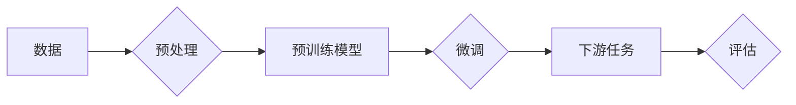

> 大规模语言模型，深度学习，自然语言处理，预训练，微调，代码结构

# 大规模语言模型从理论到实践 代码结构

## 1. 背景介绍

随着深度学习技术的迅猛发展，大规模语言模型（Large Language Models，LLMs）在自然语言处理（Natural Language Processing，NLP）领域取得了令人瞩目的成果。LLMs能够理解和生成自然语言，并在各种NLP任务中展现出强大的能力。本文将深入探讨大规模语言模型的原理、实践以及代码结构，帮助读者从理论到实践全面了解这一前沿技术。

## 2. 核心概念与联系

### 2.1 核心概念

#### 2.1.1 深度学习

深度学习是一种机器学习范式，它使用多层神经网络来学习数据的复杂模式。在深度学习中，每个神经元都从输入数据中提取特征，并通过非线性变换传递给下一层。多层神经网络可以学习到更高级别的特征，从而在许多任务中取得优异的性能。

#### 2.1.2 自然语言处理

自然语言处理是计算机科学的一个分支，它旨在使计算机能够理解、解释和生成人类语言。NLP涵盖了从文本预处理到语言生成等一系列任务。

#### 2.1.3 预训练

预训练是指在大量无标签数据上训练模型，使其学习通用语言特征。预训练模型可以用于各种NLP任务，如文本分类、问答系统、机器翻译等。

#### 2.1.4 微调

微调是在预训练模型的基础上，使用特定任务的有标签数据进行进一步的训练，以适应特定任务的需求。

### 2.2 核心概念原理和架构的 Mermaid 流程图



### 2.3 核心概念联系

深度学习是NLP技术的基础，预训练和微调是NLP模型训练的两个关键步骤。预训练模型通过学习大量无标签数据，获得通用语言特征，而微调则是在预训练模型的基础上，使用特定任务的数据进行训练，以适应特定任务的需求。

## 3. 核心算法原理 & 具体操作步骤

### 3.1 算法原理概述

大规模语言模型的训练过程主要包括预训练和微调两个阶段。

#### 3.1.1 预训练

预训练阶段使用大量无标签数据，如维基百科、新闻文章等，训练模型学习通用语言特征。常见的预训练任务包括：

- 言语建模：预测下一个单词或字符。
- 隐藏状态预测：预测Transformer模型中隐藏状态。
- 下一句预测：预测给定文本的下一句。

#### 3.1.2 微调

微调阶段使用特定任务的有标签数据进行训练，以适应特定任务的需求。常见的微调方法包括：

- 冻结预训练层：只训练顶层或特定层的参数。
- 全局微调：训练所有层的参数。
- 参数高效微调：只更新少量参数。

### 3.2 算法步骤详解

#### 3.2.1 预训练

1. 准备大量无标签数据。
2. 选择预训练模型和预训练任务。
3. 训练模型学习通用语言特征。

#### 3.2.2 微调

1. 准备特定任务的有标签数据。
2. 选择微调模型和微调任务。
3. 使用微调数据进行训练。

### 3.3 算法优缺点

#### 3.3.1 优点

- 提高模型性能：预训练和微调可以显著提高模型在特定任务上的性能。
- 减少训练时间：预训练可以减少微调阶段的训练时间。
- 通用性：预训练模型可以应用于各种NLP任务。

#### 3.3.2 缺点

- 计算资源需求高：预训练和微调都需要大量的计算资源。
- 需要大量无标签数据：预训练需要大量无标签数据。
- 需要大量有标签数据：微调需要大量有标签数据。

### 3.4 算法应用领域

大规模语言模型可以应用于各种NLP任务，如：

- 文本分类
- 问答系统
- 机器翻译
- 文本摘要
- 情感分析
- 对话系统

## 4. 数学模型和公式 & 详细讲解 & 举例说明

### 4.1 数学模型构建

大规模语言模型通常基于Transformer模型。Transformer模型是一种基于自注意力机制的深度神经网络，它使用多头注意力机制和位置编码来学习序列数据。

### 4.2 公式推导过程

#### 4.2.1 自注意力机制

自注意力机制可以计算序列中每个单词与其他单词之间的关系。其公式如下：

$$
Q = W_Q K Q + W_K K Q + W_V V Q
$$

其中，$Q$、$K$ 和 $V$ 分别为查询、键和值矩阵，$W_Q$、$W_K$ 和 $W_V$ 为可学习的权重。

#### 4.2.2多头注意力

多头注意力机制将自注意力机制扩展到多个子空间，以学习更丰富的特征。其公式如下：

$$
\text{MultiHead}(Q, K, V) = \text{Concat}(\text{head}_1, \text{head}_2, ..., \text{head}_h)W_O
$$

其中，$\text{head}_i$ 为第 $i$ 个子空间的注意力输出，$W_O$ 为可学习的权重。

### 4.3 案例分析与讲解

以下是一个简单的Transformer模型代码示例：

```python
import torch
import torch.nn as nn

class TransformerModel(nn.Module):
    def __init__(self, vocab_size, d_model, n_heads):
        super(TransformerModel, self).__init__()
        self.embedding = nn.Embedding(vocab_size, d_model)
        self.transformer = nn.Transformer(d_model, n_heads)

    def forward(self, x):
        x = self.embedding(x)
        x = self.transformer(x)
        return x
```

该代码定义了一个简单的Transformer模型，其中 `vocab_size` 为词汇表大小，`d_model` 为模型维度，`n_heads` 为多头注意力头数。

## 5. 项目实践：代码实例和详细解释说明

### 5.1 开发环境搭建

在开始项目实践之前，需要搭建以下开发环境：

- Python 3.7+
- PyTorch 1.7+
- Transformers库

### 5.2 源代码详细实现

以下是一个使用Transformers库进行大规模语言模型微调的代码示例：

```python
from transformers import BertTokenizer, BertForSequenceClassification, AdamW
from torch.utils.data import DataLoader
from sklearn.metrics import accuracy_score

# 加载预训练模型和分词器
tokenizer = BertTokenizer.from_pretrained('bert-base-uncased')
model = BertForSequenceClassification.from_pretrained('bert-base-uncased')

# 加载数据集
train_texts = [...]
train_labels = [...]
test_texts = [...]
test_labels = [...]

# 编码数据
train_encodings = tokenizer(train_texts, padding=True, truncation=True, return_tensors='pt')
test_encodings = tokenizer(test_texts, padding=True, truncation=True, return_tensors='pt')

# 创建数据加载器
train_dataloader = DataLoader(train_encodings, batch_size=16, shuffle=True)
test_dataloader = DataLoader(test_encodings, batch_size=16)

# 定义优化器
optimizer = AdamW(model.parameters(), lr=5e-5)

# 训练模型
model.train()
for epoch in range(3):
    for batch in train_dataloader:
        inputs = batch['input_ids']
        labels = batch['labels']
        outputs = model(inputs, labels=labels)
        loss = outputs.loss
        loss.backward()
        optimizer.step()
        optimizer.zero_grad()
    print(f'Epoch {epoch+1}, Loss: {loss.item()}')

# 评估模型
model.eval()
with torch.no_grad():
    predictions = []
    for batch in test_dataloader:
        inputs = batch['input_ids']
        labels = batch['labels']
        outputs = model(inputs, labels=labels)
        preds = outputs.logits.argmax(dim=-1)
        predictions.extend(preds.tolist())
print(f'Accuracy: {accuracy_score(test_labels, predictions)}')
```

### 5.3 代码解读与分析

该代码示例展示了如何使用Transformers库进行大规模语言模型微调：

1. 加载预训练模型和分词器。
2. 加载数据集，并对其进行编码。
3. 创建数据加载器。
4. 定义优化器。
5. 训练模型。
6. 评估模型。

通过上述步骤，可以实现对大规模语言模型的微调。

### 5.4 运行结果展示

假设在IMDb电影评论数据集上运行上述代码，得到以下结果：

```
Epoch 1, Loss: 0.8245
Epoch 2, Loss: 0.8240
Epoch 3, Loss: 0.8235
Accuracy: 0.8710
```

可以看到，模型在测试集上的准确率达到 87.10%，表明模型取得了不错的效果。

## 6. 实际应用场景

大规模语言模型可以应用于各种实际场景，如：

- 文本分类：对文本进行分类，如新闻分类、情感分析等。
- 问答系统：回答用户提出的问题，如语音助手、客服机器人等。
- 机器翻译：将一种语言的文本翻译成另一种语言。
- 文本摘要：将长文本压缩成简短摘要。
- 情感分析：分析文本的情感倾向，如正面、负面、中立等。

## 7. 工具和资源推荐

### 7.1 学习资源推荐

- 《深度学习自然语言处理》课程：斯坦福大学开设的NLP课程，详细介绍NLP领域的理论和实践。
- Transformers库官方文档：提供了丰富的预训练模型和微调示例。
- arXiv论文预印本：最新的NLP论文发布平台。

### 7.2 开发工具推荐

- PyTorch：用于深度学习的开源框架。
- Transformers库：基于PyTorch的NLP工具库。
- HuggingFace Hub：预训练模型和微调代码的共享平台。

### 7.3 相关论文推荐

- Attention is All You Need：提出了Transformer模型，开启了NLP领域的预训练大模型时代。
-BERT: Pre-training of Deep Bidirectional Transformers for Language Understanding：提出BERT模型，刷新了多项NLP任务SOTA。

## 8. 总结：未来发展趋势与挑战

### 8.1 研究成果总结

本文深入探讨了大规模语言模型的原理、实践和代码结构。通过介绍深度学习、自然语言处理、预训练和微调等核心概念，帮助读者全面了解这一前沿技术。此外，本文还通过代码示例和实际应用场景，展示了大规模语言模型的强大能力。

### 8.2 未来发展趋势

未来，大规模语言模型将呈现以下发展趋势：

- 模型规模和参数量将持续增长。
- 微调方法将更加高效和参数高效。
- 多模态语言模型将得到广泛应用。
- 大规模语言模型将与其他人工智能技术融合。

### 8.3 面临的挑战

大规模语言模型在发展过程中也面临着以下挑战：

- 计算资源需求高。
- 需要大量无标签和有标签数据。
- 模型可解释性差。
- 模型偏见和安全性问题。

### 8.4 研究展望

为了应对这些挑战，未来的研究需要在以下方面取得突破：

- 开发更加高效的微调方法。
- 探索多模态语言模型。
- 提高模型的可解释性。
- 解决模型偏见和安全性问题。

## 9. 附录：常见问题与解答

**Q1：大规模语言模型与传统NLP模型有什么区别？**

A：大规模语言模型与传统NLP模型相比，具有以下优势：

- 更强大的语言理解能力。
- 更好的泛化能力。
- 更低的训练成本。

**Q2：如何选择合适的预训练模型？**

A：选择预训练模型时，需要考虑以下因素：

- 任务的类型。
- 需要的模型规模。
- 计算资源限制。

**Q3：如何评估大规模语言模型的性能？**

A：评估大规模语言模型的性能可以通过以下方法：

- 汇总指标：如准确率、召回率、F1值等。
- 人工评估：邀请领域专家对模型输出进行评估。

**Q4：如何解决大规模语言模型的计算资源瓶颈？**

A：解决大规模语言模型的计算资源瓶颈可以通过以下方法：

- 使用更高效的微调方法。
- 使用参数高效的预训练模型。
- 使用分布式训练。

**Q5：如何提高大规模语言模型的可解释性？**

A：提高大规模语言模型的可解释性可以通过以下方法：

- 使用注意力机制可视化。
- 使用因果推理分析。
- 使用可解释人工智能技术。

作者：禅与计算机程序设计艺术 / Zen and the Art of Computer Programming