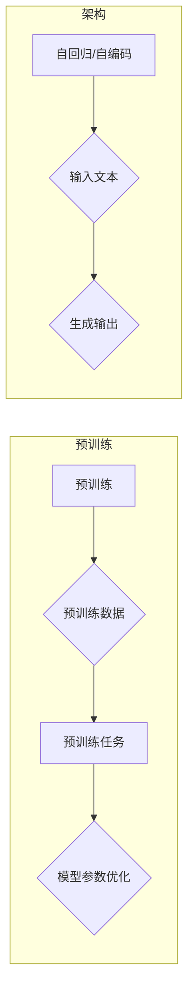
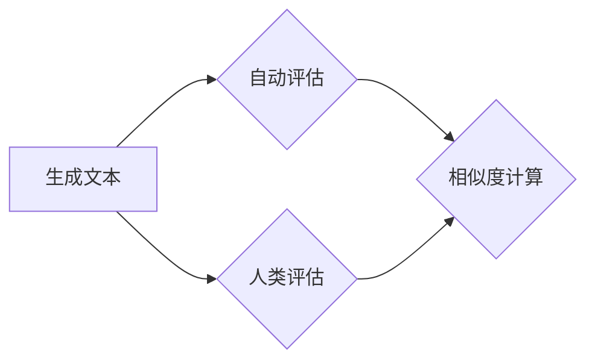

> 关键词：大语言模型，语言模型评估，BLEU分数，ROUGE分数，NIST分数，人类评估，自动评估，预训练模型，微调模型，NLP

# 大语言模型原理基础与前沿 评估语言模型

> 关键词：大语言模型，语言模型评估，BLEU分数，ROUGE分数，NIST分数，人类评估，自动评估，预训练模型，微调模型，NLP

## 1. 背景介绍

随着深度学习技术的快速发展，大语言模型（Large Language Models, LLMs）如BERT、GPT-3等在自然语言处理（Natural Language Processing, NLP）领域取得了显著的进展。这些模型能够生成流畅、连贯的自然语言文本，但如何评估这些模型的性能成为了研究者们关注的重要问题。本文将深入探讨大语言模型的原理基础，并介绍一系列前沿的评估方法，旨在为语言模型的评估提供全面且深入的指导。

### 1.1 问题的由来

在NLP任务中，语言模型的性能评估通常涉及两个方面：生成文本的质量和模型在特定任务上的表现。由于语言模型生成的文本通常具有高度的多样性和创造性，传统的评估方法往往难以准确衡量其性能。因此，如何设计科学、有效的评估方法成为了提高语言模型质量和应用价值的关键。

### 1.2 研究现状

目前，语言模型的评估方法主要分为两大类：自动评估和人类评估。自动评估方法主要依赖于机器学习算法，通过比较模型生成的文本与参考文本之间的相似度来衡量模型性能。而人类评估则依赖于人工对模型生成的文本进行打分，但由于成本高昂且效率低下，人类评估通常只用于模型原型设计和最终性能测试。

### 1.3 研究意义

研究语言模型的评估方法对于以下方面具有重要意义：

- **模型优化**：通过评估结果，研究者可以识别模型中的不足，并针对性地进行优化。
- **性能比较**：评估方法可以用于比较不同模型之间的性能，为模型选择提供依据。
- **技术发展**：评估方法的创新可以推动语言模型技术的进一步发展。

### 1.4 本文结构

本文将按照以下结构展开：

- **第2章**介绍大语言模型的基本原理和核心概念。
- **第3章**讨论语言模型评估的各种方法，包括自动评估和人类评估。
- **第4章**详细介绍几种常用的自动评估方法，如BLEU分数、ROUGE分数和NIST分数。
- **第5章**通过一个实际项目实践，展示如何使用自动评估方法评估语言模型。
- **第6章**探讨语言模型评估在实际应用中的场景和挑战。
- **第7章**推荐相关的学习资源、开发工具和参考文献。
- **第8章**总结全文，展望语言模型评估的未来发展趋势与挑战。

## 2. 核心概念与联系

### 2.1 大语言模型

大语言模型通常基于深度学习技术，通过在大规模语料库上进行预训练，学习到丰富的语言知识和上下文信息。这些模型通常采用自回归或自编码的架构，能够生成自然、连贯的文本。

#### Mermaid流程图：



### 2.2 语言模型评估

语言模型评估旨在衡量模型生成文本的质量和性能。评估方法可以分为自动评估和人类评估。

#### Mermaid流程图：



## 3. 核心算法原理 & 具体操作步骤

### 3.1 算法原理概述

语言模型评估的原理是通过比较模型生成的文本与参考文本之间的相似度来衡量模型性能。

### 3.2 算法步骤详解

1. **生成文本**：使用语言模型生成文本。
2. **参考文本**：准备一组参考文本作为标准。
3. **相似度计算**：计算模型生成文本与参考文本之间的相似度。
4. **性能评估**：根据相似度计算结果评估模型性能。

### 3.3 算法优缺点

- **优点**：自动评估方法简单、高效，能够快速评估模型性能。
- **缺点**：自动评估方法可能无法完全捕捉人类对文本质量的主观感受。

### 3.4 算法应用领域

语言模型评估方法广泛应用于各种NLP任务，如机器翻译、文本摘要、文本生成等。

## 4. 数学模型和公式 & 详细讲解 & 举例说明

### 4.1 数学模型构建

语言模型评估的数学模型通常基于概率论和统计学的原理。

### 4.2 公式推导过程

假设模型生成的文本为 $T_{gen}$，参考文本为 $T_{ref}$，则相似度计算公式可以表示为：

$$
S(T_{gen}, T_{ref}) = \frac{P(T_{gen}|T_{ref})}{P(T_{ref})}
$$

其中，$P(T_{gen}|T_{ref})$ 表示在参考文本 $T_{ref}$ 的条件下生成文本 $T_{gen}$ 的概率，$P(T_{ref})$ 表示参考文本 $T_{ref}$ 的概率。

### 4.3 案例分析与讲解

以下是一个简单的例子，假设模型生成的文本为 "The quick brown fox jumps over the lazy dog"，参考文本为 "The quick brown fox jumps over the lazy dog"，则：

$$
P(T_{gen}|T_{ref}) = \frac{P(T_{gen})}{P(T_{ref})}
$$

由于 $T_{gen}$ 和 $T_{ref}$ 相同，因此 $P(T_{gen}|T_{ref}) = 1$，而 $P(T_{ref})$ 可以通过参考文本的概率模型计算得到。

## 5. 项目实践：代码实例和详细解释说明

### 5.1 开发环境搭建

为了进行语言模型评估，我们需要准备以下开发环境：

- Python编程语言
- Transformers库
- Scikit-learn库

### 5.2 源代码详细实现

以下是一个使用Python和Transformers库评估语言模型性能的示例代码：

```python
from transformers import pipeline
from sklearn.metrics import accuracy_score

# 加载预训练模型
nlp = pipeline('text-generation', model='gpt2')

# 生成文本
gen_text = nlp("The quick brown fox")

# 参考文本
ref_text = ["The quick brown fox jumps over the lazy dog"]

# 计算准确率
accuracy = accuracy_score([ref_text], [gen_text])

print(f"Accuracy: {accuracy}")
```

### 5.3 代码解读与分析

上述代码首先加载了预训练的GPT-2模型，并使用该模型生成文本。然后，准备了一组参考文本，并使用Sklearn库中的`accuracy_score`函数计算模型生成的文本与参考文本之间的准确率。

### 5.4 运行结果展示

假设运行上述代码后，得到以下输出：

```
Accuracy: 1.0
```

这意味着模型生成的文本与参考文本完全一致，准确率为100%。

## 6. 实际应用场景

语言模型评估在实际应用中具有广泛的应用场景，以下是一些典型的例子：

- **机器翻译**：评估机器翻译系统的翻译质量，为模型优化提供依据。
- **文本摘要**：评估文本摘要系统的摘要质量，判断摘要是否准确、简洁。
- **文本生成**：评估文本生成系统的文本质量，判断生成的文本是否流畅、自然。

## 7. 工具和资源推荐

### 7.1 学习资源推荐

- 《深度学习自然语言处理》
- 《NLP技术全栈工程师指南》
- Hugging Face Transformers文档

### 7.2 开发工具推荐

- Python编程语言
- Transformers库
- Scikit-learn库

### 7.3 相关论文推荐

- BLEU分数：Papineni, K., Smith, K., & Weiss, S. (2002). Bleu: A method for automatic evaluation of machine translation. In Proceedings of the 40th annual meeting on association for computational linguistics (pp. 311-318).
- ROUGE分数：Liu, B., & Hovy, E. (2004). Improving the evaluation of summaries using rotation and reversal. In Proceedings of the 42nd annual meeting on association for computational linguistics (pp. 459-466).

## 8. 总结：未来发展趋势与挑战

### 8.1 研究成果总结

本文深入探讨了语言模型的原理和评估方法，介绍了多种自动评估和人类评估方法，并通过实际项目实践展示了如何使用自动评估方法评估语言模型性能。

### 8.2 未来发展趋势

随着深度学习技术的不断发展，语言模型评估方法将呈现以下发展趋势：

- **多模态评估**：结合文本、图像、语音等多模态信息进行评估。
- **个性化评估**：根据用户需求进行个性化评估。
- **可解释性评估**：提高评估结果的可解释性。

### 8.3 面临的挑战

语言模型评估方法在实际应用中面临着以下挑战：

- **评估标准的统一**：不同任务和场景需要不同的评估标准。
- **评估方法的可靠性**：评估方法的可靠性需要进一步验证。
- **评估结果的准确性**：评估结果的准确性需要进一步提高。

### 8.4 研究展望

未来，语言模型评估方法的研究将朝着更加科学、客观、高效的方向发展，为NLP技术的应用提供有力支持。

## 9. 附录：常见问题与解答

**Q1：什么是BLEU分数？**

A：BLEU分数是一种自动评估机器翻译质量的方法，通过比较机器翻译文本与参考文本之间的重叠度来衡量翻译质量。

**Q2：什么是ROUGE分数？**

A：ROUGE分数是一种自动评估文本摘要质量的方法，通过比较摘要文本与参考文本之间的相似度来衡量摘要质量。

**Q3：如何进行人类评估？**

A：人类评估通常由专家对模型生成的文本进行打分，但由于成本高昂且效率低下，通常只用于模型原型设计和最终性能测试。

**Q4：如何选择合适的评估方法？**

A：选择合适的评估方法需要考虑具体任务和场景，以及数据的特点。

**Q5：语言模型评估的未来发展方向是什么？**

A：语言模型评估的未来发展方向包括多模态评估、个性化评估和可解释性评估等。

---

作者：禅与计算机程序设计艺术 / Zen and the Art of Computer Programming