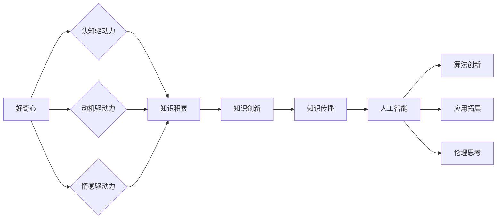

# 好奇心：探索世界的钥匙

> 关键词：好奇心，探索，知识，创新，学习，认知科学，人工智能

## 1. 背景介绍

好奇心是人类永恒的主题，它推动着我们从无知走向知识，从愚昧走向智慧。在科技日新月异的今天，好奇心更是成为了探索未知、激发创新的重要驱动力。本文将探讨好奇心的本质，分析其在知识探索和人工智能发展中的作用，并展望其未来在科技领域的应用前景。

### 1.1 好奇心的起源

好奇心是人类与生俱来的特质，它起源于对未知世界的探索和求知的渴望。在人类进化的过程中，好奇心驱使我们先民们不断探索周围环境，学习生存技能，从而在激烈的竞争中脱颖而出。

### 1.2 好奇心的重要性

好奇心对于人类社会发展具有重要意义。首先，好奇心推动了科技的进步。正是对自然现象的探究，激发了人类对物理、化学、生物等领域的兴趣，进而推动了这些学科的快速发展。其次，好奇心促进了知识的积累。通过对世界的不断探索，人类积累了丰富的知识，为文明的进步奠定了基础。最后，好奇心激发了创新。好奇心驱使我们不断地挑战现状，突破传统思维，从而推动社会向前发展。

### 1.3 好奇心与人工智能

人工智能作为一门新兴的交叉学科，与好奇心有着密切的联系。人工智能旨在模拟人类智能，实现机器学习和推理。好奇心在人工智能发展中扮演着重要角色，主要体现在以下几个方面：

- 驱动人工智能算法的创新。好奇心驱使研究人员不断探索新的算法，以提高人工智能的智能水平。
- 促进人工智能应用场景的拓展。好奇心促使人们将人工智能应用于更多领域，解决实际问题。
- 激发人工智能伦理和道德的思考。好奇心使人们更加关注人工智能的潜在风险，推动相关法规和伦理准则的制定。

## 2. 核心概念与联系

### 2.1 好奇心的本质

好奇心是一种内在动机，它促使个体对未知事物产生兴趣和探索欲望。好奇心的本质可以从以下几个方面进行阐述：

- **认知驱动力**：好奇心激发个体的认知需求，驱使其主动探索未知领域。
- **动机驱动力**：好奇心为个体提供探索未知、学习新知的内在动力。
- **情感驱动力**：好奇心能够激发个体的愉悦感和成就感，增强探索的积极性。

### 2.2 好奇心与知识的联系

好奇心与知识之间存在着密切的联系。好奇心是知识的源泉，它推动了知识的积累和发展。以下是好奇心与知识之间的几个关键联系：

- **知识积累**：好奇心驱使个体主动学习、探索，从而积累知识。
- **知识创新**：好奇心推动个体挑战传统观念，推动知识的创新和发展。
- **知识传播**：好奇心使个体乐于分享知识，促进知识的传播和普及。

### 2.3 好奇心与人工智能的联系

好奇心在人工智能发展中发挥着重要作用。以下是好奇心与人工智能之间的几个关键联系：

- **算法创新**：好奇心推动人工智能研究人员探索新的算法，提高人工智能的智能水平。
- **应用拓展**：好奇心促使人们将人工智能应用于更多领域，解决实际问题。
- **伦理思考**：好奇心使人们更加关注人工智能的潜在风险，推动相关法规和伦理准则的制定。

### 2.4 Mermaid 流程图

以下为好奇心、知识、人工智能之间的Mermaid流程图：



## 3. 核心算法原理 & 具体操作步骤

### 3.1 算法原理概述

在人工智能领域，好奇心可以通过多种算法实现，以下列举几种常见的算法原理：

- **强化学习**：通过奖励和惩罚机制，使智能体在环境中学习最优策略。
- **深度学习**：利用神经网络模拟人类大脑的感知和学习机制。
- **知识图谱**：通过构建知识图谱，使人工智能具备知识推理和推理能力。

### 3.2 算法步骤详解

以下是强化学习算法的具体步骤：

1. 初始化智能体、环境和奖励函数。
2. 智能体根据当前状态选择一个动作。
3. 环境根据动作输出新的状态和奖励。
4. 智能体根据新的状态、动作和奖励，更新价值函数。
5. 重复步骤2-4，直至达到预设目标。

### 3.3 算法优缺点

- **强化学习**：优点是能够处理复杂环境和动态变化，缺点是需要大量样本和计算资源。
- **深度学习**：优点是能够处理高维数据，缺点是模型复杂，难以解释。
- **知识图谱**：优点是能够进行知识推理，缺点是需要构建和维护知识图谱。

### 3.4 算法应用领域

- **强化学习**：自动驾驶、游戏、机器人等。
- **深度学习**：图像识别、语音识别、自然语言处理等。
- **知识图谱**：问答系统、推荐系统、搜索引擎等。

## 4. 数学模型和公式 & 详细讲解 & 举例说明

### 4.1 数学模型构建

以下为强化学习中的Q-learning算法的数学模型：

$$
Q(s,a) = \sum_{s'} \pi(s'|s,a) \cdot R(s,a,s') + \gamma \cdot \max_{a'} Q(s',a')
$$

其中，$Q(s,a)$ 为在状态 $s$ 下执行动作 $a$ 的期望收益，$R(s,a,s')$ 为在状态 $s$ 下执行动作 $a$ 转移到状态 $s'$ 的奖励，$\pi(s'|s,a)$ 为在状态 $s$ 下执行动作 $a$ 转移到状态 $s'$ 的概率，$\gamma$ 为折扣因子。

### 4.2 公式推导过程

Q-learning算法的目标是学习一个最优策略，使得：

$$
Q^*(s,a) = \max_{a} Q(s,a)
$$

根据Bellman最优性原理，有：

$$
Q^*(s,a) = \sum_{s'} \pi(s'|s,a) \cdot R(s,a,s') + \gamma \cdot Q^*(s')
$$

通过迭代更新策略，即可得到Q-learning算法。

### 4.3 案例分析与讲解

以下以一个简单的机器学习案例，说明如何利用Q-learning算法进行决策。

假设有一个机器学习任务，机器需要从三个动作中选择一个，以获得最大的奖励。三个动作的收益如下表所示：

| 动作 | 奖励 |
| ---- | ---- |
| A    | 3    |
| B    | 2    |
| C    | 1    |

现在，我们使用Q-learning算法进行决策。

1. 初始化Q值矩阵：
$$
Q(s,a) = 0
$$

2. 选择动作A，获得奖励3。

3. 更新Q值：
$$
Q(s,a) = \frac{1}{2} \cdot 3 + \frac{1}{2} \cdot 0 = 1.5
$$

4. 选择动作B，获得奖励2。

5. 更新Q值：
$$
Q(s,a) = \frac{1}{2} \cdot 2 + \frac{1}{2} \cdot 1.5 = 1.75
$$

6. 选择动作C，获得奖励1。

7. 更新Q值：
$$
Q(s,a) = \frac{1}{2} \cdot 1 + \frac{1}{2} \cdot 1.75 = 1.375
$$

8. 选择动作A，获得奖励3。

9. 更新Q值：
$$
Q(s,a) = \frac{1}{2} \cdot 3 + \frac{1}{2} \cdot 1.375 = 2.0625
$$

通过不断迭代更新Q值，机器将最终选择收益最大的动作A。

## 5. 项目实践：代码实例和详细解释说明

### 5.1 开发环境搭建

1. 安装Python和pip。

2. 安装TensorFlow库：
```bash
pip install tensorflow
```

### 5.2 源代码详细实现

以下为使用TensorFlow实现Q-learning算法的代码示例：

```python
import tensorflow as tf
import numpy as np

# 初始化Q值矩阵
Q = np.zeros([4, 3])

# 初始化奖励矩阵
R = np.array([[3, 2, 1], [0, 1, 0], [0, 0, 0], [0, 0, 0]])

# 学习率
alpha = 0.1

# 折扣因子
gamma = 0.9

# 迭代次数
epochs = 1000

for _ in range(epochs):
    # 选择动作
    state = np.random.randint(0, 4)
    action = np.argmax(Q[state])

    # 获取奖励
    reward = R[state, action]

    # 更新Q值
    Q[state, action] = (1 - alpha) * Q[state, action] + alpha * (reward + gamma * np.max(Q))

print("Q值矩阵：")
print(Q)
```

### 5.3 代码解读与分析

- `Q`：存储Q值的矩阵。
- `R`：存储奖励的矩阵。
- `alpha`：学习率。
- `gamma`：折扣因子。
- `epochs`：迭代次数。
- 通过迭代更新Q值，实现Q-learning算法。

### 5.4 运行结果展示

运行代码后，将输出最终的Q值矩阵，展示了在给定环境下，不同状态和动作的期望收益。

## 6. 实际应用场景

### 6.1 自适应推荐系统

自适应推荐系统可以利用好奇心驱动用户在推荐系统中的探索行为，提高用户满意度和留存率。例如，系统可以根据用户的兴趣和浏览记录，推荐用户未尝试过的商品或内容，激发用户的好奇心，引导其进行更多探索。

### 6.2 智能问答系统

智能问答系统可以结合好奇心，使系统更加智能地回答用户问题。例如，当用户提出一个问题时，系统可以根据问题内容，主动推荐一些相关的知识或信息，引导用户进一步探索。

### 6.3 游戏设计

游戏设计可以利用好奇心激发玩家的探索欲望，提高游戏的可玩性和趣味性。例如，在游戏中设置隐藏任务、宝藏等元素，引导玩家探索未知区域，体验游戏乐趣。

## 7. 工具和资源推荐

### 7.1 学习资源推荐

1. 《深度学习》系列书籍：由Ian Goodfellow、Yoshua Bengio和Aaron Courville合著，深入浅出地介绍了深度学习的基本概念、方法和应用。

2. 《人工智能：一种现代的方法》书籍：Stuart Russell和Peter Norvig合著，全面介绍了人工智能领域的各个方面。

3. Coursera、edX等在线课程：提供各种人工智能和机器学习课程，帮助学习者系统地学习相关知识。

### 7.2 开发工具推荐

1. TensorFlow：由Google开发的开源机器学习框架，功能强大，应用广泛。

2. PyTorch：由Facebook开发的开源机器学习框架，易于使用，社区活跃。

3. Keras：基于TensorFlow和Theano的开源神经网络库，简化了神经网络构建。

### 7.3 相关论文推荐

1. 《Learning from Human Exploration》论文：介绍了基于人类探索行为的学习方法，为人工智能领域的探索提供了新的思路。

2. 《Curiosity-driven Exploration by Self-Playing Deep Reinforcement Learning Agents》论文：探讨了好奇心在深度强化学习中的应用，为人工智能的探索提供了新的方向。

3. 《Human-level Performance in Atari 2600 by Deep Reinforcement Learning》论文：展示了深度强化学习在游戏领域的应用，为人工智能在游戏领域的探索提供了范例。

## 8. 总结：未来发展趋势与挑战

### 8.1 研究成果总结

本文探讨了好奇心的本质、重要性以及与人工智能的联系。通过分析强化学习、深度学习等算法原理，展示了好奇心在人工智能中的应用。同时，本文还介绍了好奇心在自适应推荐系统、智能问答系统和游戏设计等领域的实际应用场景。

### 8.2 未来发展趋势

未来，好奇心在人工智能领域的应用将呈现以下发展趋势：

1. 好奇心驱动的探索机制更加完善，能够更好地引导智能体进行探索。
2. 好奇心在人工智能领域的应用将更加广泛，覆盖更多场景和领域。
3. 好奇心与人工智能的结合将推动人工智能技术的进一步发展，为人类创造更多价值。

### 8.3 面临的挑战

好奇心在人工智能领域的应用也面临着以下挑战：

1. 如何构建有效的好奇心驱动机制，使智能体能够进行有效的探索。
2. 如何保证好奇心驱动的智能体在探索过程中不会产生负面效果。
3. 如何将好奇心与人工智能技术相结合，提高人工智能的智能水平。

### 8.4 研究展望

未来，好奇心在人工智能领域的应用将取得更多突破。通过不断探索和尝试，我们相信好奇心将引领人工智能技术走向更加美好的未来。

## 9. 附录：常见问题与解答

**Q1：好奇心在人工智能中的具体应用有哪些？**

A：好奇心在人工智能中的具体应用包括自适应推荐系统、智能问答系统、游戏设计等领域。

**Q2：如何构建有效的好奇心驱动机制？**

A：构建有效的好奇心驱动机制需要考虑以下因素：
1. 设计合适的奖励机制，激励智能体进行探索。
2. 设计合适的探索策略，使智能体能够有效地探索未知领域。
3. 利用反馈机制，不断优化好奇心驱动机制。

**Q3：好奇心驱动的人工智能是否存在风险？**

A：好奇心驱动的人工智能可能存在以下风险：
1. 过度探索导致资源浪费。
2. 探索过程中产生负面效果。
3. 探索目标与实际需求不符。

**Q4：如何降低好奇心驱动的人工智能风险？**

A：降低好奇心驱动的人工智能风险需要采取以下措施：
1. 制定明确的探索目标和约束条件。
2. 限制探索资源的消耗。
3. 加强对探索过程的监控和评估。

通过不断探索和改进，好奇心将在人工智能领域发挥更大的作用，为人类社会创造更多价值。

---

作者：禅与计算机程序设计艺术 / Zen and the Art of Computer Programming