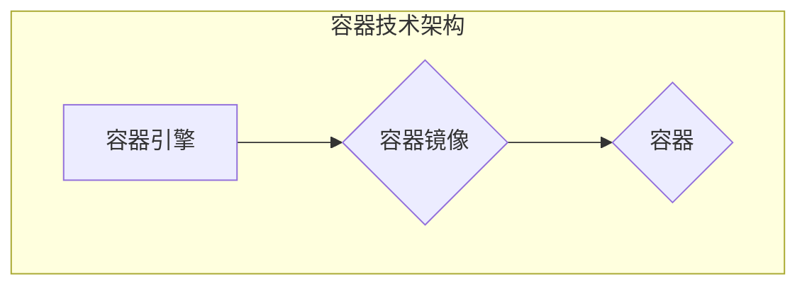

# 容器 原理与代码实例讲解

> 关键词：容器技术，Docker，Kubernetes，轻量级虚拟化，微服务架构，持续集成/持续部署（CI/CD），DevOps

## 1. 背景介绍

### 1.1 问题的由来

随着互联网和云计算的快速发展，软件应用逐渐从单体架构向微服务架构转型。微服务架构通过将大型应用程序拆分为多个小型、独立的服务，提高了系统的可扩展性、可维护性和可部署性。然而，这种架构也带来了新的挑战，如服务的实例化和管理、服务之间的通信、环境的标准化等。

为了解决这些问题，容器技术应运而生。容器提供了一种轻量级的虚拟化技术，使得应用程序可以在隔离的环境中运行，同时共享宿主机的操作系统内核。Docker是最流行的容器技术之一，而Kubernetes则成为容器编排的领导者。

### 1.2 研究现状

容器技术已经成为了现代软件开发和运维的核心技术之一。Docker提供了容器化的基础，而Kubernetes则实现了容器的自动化部署、扩展和管理。随着容器技术的不断发展，越来越多的组织开始将其应用到生产环境中，以实现更高效、可靠的软件交付。

### 1.3 研究意义

研究容器技术及其应用，对于提高软件开发和运维的效率、降低成本、提升系统可靠性具有重要意义。以下是容器技术的主要研究意义：

- **提高开发效率**：容器化简化了应用程序的打包、部署和管理，使得开发人员可以更快地将代码部署到生产环境。
- **降低运维成本**：容器技术使得应用程序的部署和扩展更加自动化，减少了运维人员的劳动强度。
- **提升系统可靠性**：容器化可以提高应用程序的隔离性和稳定性，减少系统故障的风险。
- **促进DevOps文化**：容器技术是DevOps文化的重要组成部分，有助于实现开发、测试和运维的协同工作。

### 1.4 本文结构

本文将系统地介绍容器技术的原理与应用，包括以下内容：

- **第2部分**：介绍容器的核心概念与联系，包括容器技术的基本原理、Docker和Kubernetes的架构。
- **第3部分**：讲解容器技术的核心算法原理和具体操作步骤。
- **第4部分**：介绍容器技术的数学模型和公式，并结合实例进行讲解。
- **第5部分**：提供容器技术的代码实例和详细解释说明。
- **第6部分**：探讨容器技术在实际应用场景中的应用，并展望未来发展趋势。
- **第7部分**：推荐容器技术相关的学习资源、开发工具和参考文献。
- **第8部分**：总结容器技术的研究成果、未来发展趋势和挑战。
- **第9部分**：提供容器技术常见问题的解答。

## 2. 核心概念与联系

### 2.1 容器技术的基本原理

容器技术是一种轻量级的虚拟化技术，它允许应用程序在隔离的环境中运行，同时共享宿主机的操作系统内核。与传统的虚拟化技术相比，容器具有以下特点：

- **资源共享**：容器与宿主机共享操作系统内核，不依赖额外的操作系统。
- **启动速度快**：容器启动速度快，通常在秒级。
- **资源占用少**：容器占用宿主机的资源比虚拟机少。
- **隔离性强**：容器提供了一定程度的隔离性，保护应用程序免受其他容器的影响。

### 2.2 容器技术的架构

容器技术的架构主要包括以下组件：

- **容器引擎**：负责创建、运行和管理容器。常见的容器引擎有Docker、Rkt、LXC等。
- **容器镜像**：容器镜像是一个包含应用程序及其运行环境的文件系统。Docker镜像由一个或多个层组成，每层包含一组指令和相应的文件。
- **容器**：容器是运行中的应用程序实例，它包含应用程序及其运行环境。

### 2.3 Mermaid 流程图

以下是一个简单的Mermaid流程图，展示容器技术的架构：



## 3. 核心算法原理 & 具体操作步骤

### 3.1 算法原理概述

容器技术的核心算法原理主要包括：

- **容器引擎**：容器引擎通过修改Linux内核的命名空间和cgroups机制，实现对应用程序的资源隔离和限制。
- **容器镜像**：容器镜像通过分层存储和差分机制，实现快速构建和共享。
- **容器**：容器通过挂载文件系统和网络接口，实现对应用程序的隔离和访问控制。

### 3.2 算法步骤详解

以下是容器技术的具体操作步骤：

1. **创建容器镜像**：使用Dockerfile定义应用程序及其运行环境，构建容器镜像。
2. **运行容器**：使用Docker命令运行容器镜像，创建容器实例。
3. **管理容器**：使用Docker命令管理容器，包括启动、停止、重启、删除等操作。
4. **容器编排**：使用Kubernetes等容器编排工具，自动化部署、扩展和管理容器。

### 3.3 算法优缺点

容器技术的优点包括：

- **轻量级**：容器不需要额外的操作系统，资源占用少。
- **隔离性**：容器提供了一定程度的隔离性，保护应用程序免受其他容器的影响。
- **可移植性**：容器可以在不同的环境中运行，具有较好的可移植性。

容器技术的缺点包括：

- **安全性**：容器安全性不如虚拟机。
- **复杂性**：容器技术相对复杂，需要一定的学习成本。

### 3.4 算法应用领域

容器技术广泛应用于以下领域：

- **Web应用**：Web应用可以通过容器化实现快速部署和扩展。
- **微服务架构**：微服务架构可以通过容器化实现服务的独立部署和扩展。
- **持续集成/持续部署（CI/CD）**：容器化可以简化CI/CD流程，提高软件交付效率。

## 4. 数学模型和公式 & 详细讲解 & 举例说明

### 4.1 数学模型构建

容器技术主要涉及以下数学模型：

- **资源分配模型**：用于描述容器引擎如何将CPU、内存等资源分配给容器。
- **调度模型**：用于描述容器引擎如何选择合适的容器运行在宿主机上。
- **性能模型**：用于描述容器在不同场景下的性能表现。

### 4.2 公式推导过程

以下是资源分配模型的简单推导过程：

假设宿主机拥有 $N$ 个CPU核心，每个核心的频率为 $f$，内存大小为 $M$。容器 $i$ 需要的CPU核数为 $c_i$，内存大小为 $m_i$。则资源分配模型可以表示为：

$$
c_i \leq N, \quad m_i \leq M
$$

### 4.3 案例分析与讲解

假设我们有一个拥有4个CPU核心和8GB内存的宿主机，需要运行两个容器。容器A需要2个CPU核心和3GB内存，容器B需要1个CPU核心和2GB内存。我们可以通过以下方式分配资源：

- 容器A运行在宿主机的CPU核心0和CPU核心1，内存使用3GB。
- 容器B运行在宿主机的CPU核心2，内存使用2GB。

这样，两个容器都可以正常运行，且宿主机的资源得到充分利用。

## 5. 项目实践：代码实例和详细解释说明

### 5.1 开发环境搭建

为了进行容器技术的项目实践，我们需要搭建以下开发环境：

- 安装Docker：Docker是一个开源的应用容器引擎，用于打包、发布和运行应用。
- 安装Kubernetes：Kubernetes是一个开源的容器编排平台，用于自动化部署、扩展和管理容器。
- 安装Kubectl：Kubectl是Kubernetes的命令行工具，用于与Kubernetes集群交互。

### 5.2 源代码详细实现

以下是一个简单的Dockerfile示例，用于构建一个简单的Web应用：

```Dockerfile
# 指定基础镜像
FROM python:3.8-slim

# 设置工作目录
WORKDIR /app

# 安装Python依赖
COPY requirements.txt .
RUN pip install --no-cache-dir -r requirements.txt

# 复制应用程序代码
COPY . .

# 运行应用程序
CMD ["python", "app.py"]
```

### 5.3 代码解读与分析

这个Dockerfile定义了一个基于Python 3.8 Slim的基础镜像，并在工作目录中安装了应用程序的依赖。然后，它复制了应用程序代码到容器中，并指定了应用程序的启动命令。

### 5.4 运行结果展示

以下是一个简单的Kubernetes部署文件示例，用于部署上面的Web应用：

```yaml
apiVersion: apps/v1
kind: Deployment
metadata:
  name: webapp
spec:
  replicas: 2
  selector:
    matchLabels:
      app: webapp
  template:
    metadata:
      labels:
        app: webapp
    spec:
      containers:
      - name: webapp
        image: webapp:latest
        ports:
        - containerPort: 80
```

这个部署文件定义了一个名为`webapp`的部署，它包含2个副本。容器使用上面构建的`webapp`镜像，并映射了80端口。

## 6. 实际应用场景

### 6.1 Web应用

容器技术可以用于部署Web应用，实现快速部署和扩展。例如，可以使用Docker容器部署一个基于Python Flask的Web应用。

### 6.2 微服务架构

微服务架构可以通过容器化实现服务的独立部署和扩展。例如，可以使用Docker容器部署一个微服务架构的电商系统。

### 6.3 持续集成/持续部署（CI/CD）

容器技术可以简化CI/CD流程，提高软件交付效率。例如，可以使用Docker容器自动化构建、测试和部署应用程序。

### 6.4 未来应用展望

随着容器技术的不断发展，未来将会有更多创新的应用场景。例如：

- **多租户容器平台**：允许多个用户或组织在同一个宿主机上运行容器，共享资源。
- **服务网格**：用于管理容器之间的通信，提高系统的可扩展性和可靠性。
- **边缘计算**：将容器技术应用于边缘计算，实现更快速的数据处理和响应。

## 7. 工具和资源推荐

### 7.1 学习资源推荐

- 《Docker教程》
- 《Kubernetes权威指南》
- 《容器化与持续交付》

### 7.2 开发工具推荐

- Docker：容器引擎
- Kubernetes：容器编排平台
- Jenkins：持续集成/持续部署工具

### 7.3 相关论文推荐

- 《Docker: Lightweight Containers for Lightweight Development》
- 《Kubernetes: System Design》
- 《A Container Orchestration Engine for a Large-Scale Distributed System》

## 8. 总结：未来发展趋势与挑战

### 8.1 研究成果总结

本文系统地介绍了容器技术的原理与应用，包括核心概念、架构、算法原理、操作步骤、数学模型、项目实践和实际应用场景等。

### 8.2 未来发展趋势

容器技术将继续发展，并呈现以下趋势：

- **容器化将成为标准**：容器技术将成为软件交付的标准方式。
- **容器编排将更加智能化**：容器编排工具将更加智能化，实现自动化部署、扩展和管理。
- **容器与云计算深度融合**：容器技术将与云计算平台深度融合，提供更丰富的服务。

### 8.3 面临的挑战

容器技术面临着以下挑战：

- **安全性**：容器安全性需要进一步加强。
- **兼容性**：容器技术需要更好地兼容不同的操作系统和硬件平台。
- **复杂性**：容器技术相对复杂，需要更多的学习和实践。

### 8.4 研究展望

未来，容器技术的研究将主要集中在以下方面：

- **安全性**：研究更安全的容器技术，防止容器逃逸和恶意攻击。
- **性能优化**：优化容器性能，提高资源利用率。
- **跨平台支持**：实现跨平台容器技术，提高兼容性。

## 9. 附录：常见问题与解答

**Q1：什么是容器技术？**

A：容器技术是一种轻量级的虚拟化技术，它允许应用程序在隔离的环境中运行，同时共享宿主机的操作系统内核。

**Q2：什么是Docker？**

A：Docker是一个开源的应用容器引擎，用于打包、发布和运行应用。

**Q3：什么是Kubernetes？**

A：Kubernetes是一个开源的容器编排平台，用于自动化部署、扩展和管理容器。

**Q4：容器技术与虚拟机技术有什么区别？**

A：容器技术与虚拟机技术的主要区别在于：

- **资源占用**：容器技术比虚拟机技术占用更少的资源。
- **启动速度**：容器技术比虚拟机技术启动速度更快。
- **隔离性**：容器技术的隔离性不如虚拟机技术。

**Q5：容器技术有哪些应用场景？**

A：容器技术可以应用于以下场景：

- **Web应用**：Web应用可以通过容器化实现快速部署和扩展。
- **微服务架构**：微服务架构可以通过容器化实现服务的独立部署和扩展。
- **持续集成/持续部署（CI/CD）**：容器化可以简化CI/CD流程，提高软件交付效率。

---

作者：禅与计算机程序设计艺术 / Zen and the Art of Computer Programming