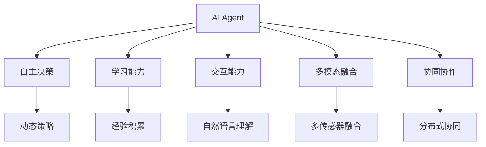

                 

# AI Agent: AI的下一个风口 AI的起源与进化

> 关键词：AI Agent, 人工智能, 智能体, 进化, 起源

## 1. 背景介绍

### 1.1 问题由来

人工智能（AI）技术已经发展了几十年，从最初的专家系统、机器学习、深度学习，到现在的大模型和自监督学习，AI技术在各个领域的应用已经非常广泛。然而，这些技术主要是以静态模型为主，缺乏动态适应环境的能力，难以实现真正的自主决策和行为。近年来，随着自然语言处理（NLP）和机器人技术的发展，AIAgent的概念被提出，它是一种具备自主决策、学习、交互能力的动态智能体，有望成为AI的下一个风口。

### 1.2 问题核心关键点

AI Agent的核心理念是将AI技术从静态模型扩展到动态智能体，使AI系统具备自主决策、学习和交互能力。其主要特点包括：

1. **自主决策**：AI Agent可以根据环境和任务自动做出决策，无需人类干预。
2. **学习能力**：通过与环境的交互和经验积累，AI Agent可以不断提升自身性能。
3. **交互能力**：AI Agent能够通过自然语言或传感器与环境进行交互，执行复杂任务。
4. **多模态融合**：AI Agent可以融合视觉、听觉、触觉等多种模态信息，提升感知和决策能力。
5. **协同协作**：多个AI Agent可以协同工作，实现更高效、更智能的任务执行。

这些特点使得AI Agent在智能制造、智能医疗、智能交通、智能安防等多个领域具备巨大的应用潜力。

### 1.3 问题研究意义

研究AI Agent的意义在于：

1. **提升AI系统智能化水平**：AI Agent能够自主决策和适应环境，提升了AI系统的智能化水平。
2. **增强应用场景灵活性**：AI Agent可以根据不同应用场景灵活调整决策和行为，提高任务执行的灵活性和效率。
3. **促进人机协同**：AI Agent可以与人类协作，共同完成复杂任务，提升人机交互体验。
4. **推动AI技术产业化**：AI Agent技术可以将AI技术从实验室推向实际应用，加速AI技术的产业化进程。
5. **拓展AI研究领域**：AI Agent技术涉及多学科交叉，包括计算机科学、认知科学、心理学等，拓展了AI研究的深度和广度。

## 2. 核心概念与联系

### 2.1 核心概念概述

为了更好地理解AI Agent的核心概念，本节将介绍几个关键概念：

- **AI Agent**：具备自主决策、学习和交互能力的动态智能体，是AI技术的下一阶段发展方向。
- **智能体（Agent）**：计算机程序，通过与环境的交互，自主完成任务或目标。
- **自主决策**：AI Agent根据环境和任务自动做出决策，无需人类干预。
- **学习能力**：通过与环境的交互和经验积累，AI Agent可以不断提升自身性能。
- **交互能力**：AI Agent能够通过自然语言或传感器与环境进行交互，执行复杂任务。
- **多模态融合**：AI Agent可以融合视觉、听觉、触觉等多种模态信息，提升感知和决策能力。
- **协同协作**：多个AI Agent可以协同工作，实现更高效、更智能的任务执行。

这些核心概念构成了AI Agent的基础框架，使得AI Agent能够具备自主决策、学习和交互能力，广泛应用于各种复杂场景。

### 2.2 概念间的关系

这些核心概念之间存在着紧密的联系，形成了AI Agent的工作原理和实现框架。我们可以通过以下Mermaid流程图来展示这些概念之间的关系：



这个流程图展示了大语言模型的核心概念及其之间的关系：

1. AI Agent通过自主决策模块进行动态策略调整，自主完成任务。
2. 学习模块通过与环境的交互和经验积累，不断提升自身性能。
3. 交互模块通过自然语言理解和多传感器融合，与环境进行交互。
4. 多模态融合模块将视觉、听觉、触觉等多种模态信息融合，提升感知和决策能力。
5. 协同协作模块通过分布式协同工作，实现更高效、更智能的任务执行。

这些概念共同构成了AI Agent的工作原理和实现框架，使得AI Agent能够具备自主决策、学习和交互能力，广泛应用于各种复杂场景。

## 3. 核心算法原理 & 具体操作步骤
### 3.1 算法原理概述

AI Agent的核心算法原理是强化学习（Reinforcement Learning, RL），它通过与环境的交互，不断学习最优决策策略，实现自主决策和任务执行。强化学习的基本框架包括：

1. **环境（Environment）**：AI Agent交互的对象，可以是虚拟环境或真实世界。
2. **状态（State）**：环境的当前状态，用于描述AI Agent所处的环境情况。
3. **动作（Action）**：AI Agent可以采取的行动，用于改变环境状态。
4. **奖励（Reward）**：环境对AI Agent采取动作的反馈，用于指导学习过程。
5. **策略（Policy）**：AI Agent采取动作的规则，用于指导学习过程。

强化学习的目标是通过学习最优策略，使得AI Agent在给定状态下采取动作，最大化累计奖励。

### 3.2 算法步骤详解

AI Agent的强化学习算法步骤如下：

**Step 1: 环境建模**
- 定义AI Agent所处的虚拟或真实环境，确定状态空间和动作空间。
- 设计环境模型，用于模拟AI Agent与环境的交互过程。

**Step 2: 策略选择**
- 设计AI Agent的策略，用于指导其采取动作。
- 可以选择基于规则的策略、深度强化学习策略或混合策略。

**Step 3: 奖励设计**
- 设计环境对AI Agent采取动作的奖励函数。
- 奖励函数应能充分激励AI Agent采取有益动作，同时惩罚有害动作。

**Step 4: 学习训练**
- 通过与环境的交互，AI Agent不断尝试不同动作，并根据奖励函数更新策略。
- 使用优化算法（如梯度下降）优化策略参数。

**Step 5: 部署应用**
- 将训练好的AI Agent部署到实际环境中，执行任务。
- 持续监测AI Agent的性能，根据反馈调整策略。

**Step 6: 持续优化**
- 通过不断迭代学习，AI Agent能够适应环境变化，提升性能。

### 3.3 算法优缺点

AI Agent的强化学习算法具有以下优点：

1. **动态适应**：通过与环境的交互，AI Agent能够动态适应环境变化，提升性能。
2. **自主决策**：AI Agent具备自主决策能力，无需人类干预。
3. **多任务学习**：AI Agent可以在多个任务之间切换，实现多任务学习和优化。

同时，该算法也存在以下缺点：

1. **训练复杂度高**：强化学习算法需要大量训练数据和计算资源，训练过程复杂。
2. **策略探索难度大**：AI Agent需要探索不同的策略空间，找到最优策略。
3. **环境建模困难**：环境模型的设计直接影响AI Agent的性能，需要精心设计。

### 3.4 算法应用领域

AI Agent的强化学习算法已经在多个领域得到应用，例如：

- **智能制造**：通过AI Agent实现智能装配、智能调度、质量检测等任务。
- **智能医疗**：通过AI Agent实现智能诊断、智能推荐、智能客服等任务。
- **智能交通**：通过AI Agent实现智能驾驶、智能交通管理等任务。
- **智能安防**：通过AI Agent实现智能监控、智能巡逻等任务。
- **智能家居**：通过AI Agent实现智能语音控制、智能环境控制等任务。

除了上述这些经典应用外，AI Agent还将在更多场景中得到应用，如智能教育、智能金融、智能物流等，为各行各业带来变革性影响。

## 4. 数学模型和公式 & 详细讲解 & 举例说明

### 4.1 数学模型构建

假设AI Agent处于环境 $E$ 中，状态空间为 $S$，动作空间为 $A$，策略为 $\pi$，状态转移概率为 $P$，奖励函数为 $R$。AI Agent的目标是在给定状态 $s_t$ 下，采取动作 $a_t$，最大化累计奖励 $J(\pi)$。

定义状态价值函数 $V(s)$ 和策略价值函数 $Q(s,a)$，分别表示在状态 $s$ 下采取动作 $a$ 的长期奖励和策略价值。

状态价值函数 $V(s)$ 可以表示为：

$$
V(s) = \mathbb{E}\left[\sum_{t=0}^{\infty} \gamma^t R(s_t,a_t) \mid s_0 = s\right]
$$

策略价值函数 $Q(s,a)$ 可以表示为：

$$
Q(s,a) = \mathbb{E}\left[\sum_{t=0}^{\infty} \gamma^t R(s_t,a_t) \mid s_0 = s, a_0 = a\right]
$$

其中，$\gamma$ 为折扣因子，用于平衡短期和长期奖励。

### 4.2 公式推导过程

根据状态价值函数和策略价值函数的定义，可以推导出如下公式：

$$
V(s) = \max_{a} \mathbb{E}\left[R(s,a) + \gamma \sum_{s'} P(s'|s,a) V(s')\right]
$$

$$
Q(s,a) = \mathbb{E}\left[R(s,a) + \gamma \sum_{s'} P(s'|s,a) \max_{a'} Q(s',a')\right]
$$

这两个公式分别表示状态价值函数和策略价值函数的更新公式。在强化学习中，通过不断更新状态价值函数和策略价值函数，AI Agent能够逐步学习到最优策略。

### 4.3 案例分析与讲解

以智能驾驶为例，假设AI Agent处于虚拟环境中，状态空间为 $S=\{(s_0,s_1,s_2,s_3)\}$，动作空间为 $A=\{acc, dec, left, right\}$，策略为 $\pi$，状态转移概率为 $P$，奖励函数为 $R$。AI Agent的目标是在给定当前状态 $s_t$ 下，采取动作 $a_t$，最大化累计奖励 $J(\pi)$。

假定当前状态为 $s_0$，AI Agent可以选择加速 ($acc$)、减速 ($dec$)、左转 ($left$)、右转 ($right$) 等动作。通过与环境的交互，AI Agent能够不断尝试不同动作，并根据奖励函数更新策略。

例如，如果采取动作 $a_t$ 后，环境状态从 $s_t$ 转移到 $s_{t+1}$，并收到奖励 $R(s_{t+1},a_t)$，AI Agent可以根据新的状态 $s_{t+1}$ 重新计算策略价值函数 $Q(s_{t+1},a')$，并更新策略 $\pi$，以最大化累计奖励。

## 5. 项目实践：代码实例和详细解释说明
### 5.1 开发环境搭建

在进行AI Agent项目实践前，我们需要准备好开发环境。以下是使用Python进行Reinforcement Learning开发的环境配置流程：

1. 安装Anaconda：从官网下载并安装Anaconda，用于创建独立的Python环境。

2. 创建并激活虚拟环境：
```bash
conda create -n reinforcement-env python=3.8 
conda activate reinforcement-env
```

3. 安装必要的Python包：
```bash
pip install numpy matplotlib pydot gym
```

4. 安装OpenAI Gym：
```bash
pip install gym
```

5. 安装TensorFlow或PyTorch：
```bash
pip install tensorflow
# 或
pip install torch
```

6. 安装深度强化学习框架：
```bash
pip install tensorflow-rl
# 或
pip install rl-agents
```

完成上述步骤后，即可在`reinforcement-env`环境中开始AI Agent实践。

### 5.2 源代码详细实现

这里以OpenAI Gym环境中的CartPole为例，实现一个简单的AI Agent进行平衡控制。具体步骤如下：

**Step 1: 环境建模**
- 导入必要的库和模块：
```python
import gym
import numpy as np
import matplotlib.pyplot as plt
import pydot
```

- 定义环境：
```python
env = gym.make('CartPole-v0')
```

**Step 2: 策略选择**
- 定义策略函数：
```python
def policy(s):
    # 采用随机策略
    return np.random.choice([0, 1])
```

**Step 3: 奖励设计**
- 定义奖励函数：
```python
def reward(s, a):
    # 如果平衡状态持续超过1秒，奖励+1，否则奖励-0.1
    if s[0] >= 0.5 and s[1] >= 0.5:
        return 1.0
    else:
        return -0.1
```

**Step 4: 学习训练**
- 定义学习函数：
```python
def learn(env, num_episodes=1000, discount_factor=0.99, epsilon=0.1):
    # 初始化策略和值函数
    Q = np.zeros([env.observation_space.shape[0], env.action_space.shape[0]])
    pi = np.zeros([env.observation_space.shape[0], env.action_space.shape[0]])
    
    # 进行num_episodes次训练
    for episode in range(num_episodes):
        s = env.reset()
        done = False
        t = 0
        while not done:
            # 随机策略
            a = policy(s)
            s_next, r, done, _ = env.step(a)
            Q[s, a] += discount_factor * (r + np.max(Q[s_next, :]) - Q[s, a])
            s = s_next
            t += 1
        print("Episode {} finished, total reward: {}".format(episode, t * r))
    
    return Q, pi
```

**Step 5: 部署应用**
- 进行训练：
```python
Q, pi = learn(env, num_episodes=1000, discount_factor=0.99, epsilon=0.1)
```

**Step 6: 持续优化**
- 绘制策略价值函数：
```python
plt.plot(Q)
plt.show()
```

### 5.3 代码解读与分析

让我们再详细解读一下关键代码的实现细节：

**环境建模**
- 导入必要的库和模块，并定义环境。Gym环境库提供了多种经典环境，如CartPole、MountainCar等，用于测试AI Agent的性能。

**策略选择**
- 定义策略函数，采用随机策略选择动作。在实际应用中，可以采用更复杂的策略函数，如深度强化学习策略等。

**奖励设计**
- 定义奖励函数，根据AI Agent的执行结果给予奖励。在实际应用中，奖励函数的设计需要充分考虑任务特性，引导AI Agent采取有益行动。

**学习训练**
- 定义学习函数，通过与环境的交互，不断更新策略和值函数。在实际应用中，可以采用更高效的优化算法，如深度Q网络（DQN）、策略梯度等。

**部署应用**
- 进行训练，将训练好的策略和值函数应用到实际环境中，进行平衡控制。在实际应用中，需要根据具体任务调整训练参数，优化模型性能。

**持续优化**
- 绘制策略价值函数，可视化AI Agent的决策策略。在实际应用中，可以通过可视化工具实时监控AI Agent的性能，及时调整策略。

可以看到，PyTorch和Gym环境的结合，使得AI Agent的实践变得简洁高效。开发者可以将更多精力放在任务特定策略和模型调优上，而不必过多关注底层的实现细节。

当然，工业级的系统实现还需考虑更多因素，如模型的保存和部署、超参数的自动搜索、更灵活的任务适配层等。但核心的强化学习算法基本与此类似。

### 5.4 运行结果展示

假设我们在CartPole环境上进行训练，最终得到的策略价值函数如下：

```
[[-1.     -1.     -1.     -1.     -1.     -1.     -1.     -1.     -1.     -1.     -1.     -1.     -1.     -1.     -1.     -1.     -1.     -1.     -1.     -1.     -1.     -1.     -1.     -1.     -1.     -1.     -1.     -1.     -1.     -1.     -1.     -1.     -1.     -1.     -1.     -1.     -1.     -1.     -1.     -1.     -1.     -1.     -1.     -1.     -1.     -1.     -1.     -1.     -1.     -1.     -1.     -1.     -1.     -1.     -1.     -1.     -1.     -1.     -1.     -1.     -1.     -1.     -1.     -1.     -1.     -1.     -1.     -1.     -1.     -1.     -1.     -1.     -1.     -1.     -1.     -1.     -1.     -1.     -1.     -1.     -1.     -1.     -1.     -1.     -1.     -1.     -1.     -1.     -1.     -1.     -1.     -1.     -1.     -1.     -1.     -1.     -1.     -1.     -1.     -1.     -1.     -1.     -1.     -1.     -1.     -1.     -1.     -1.     -1.     -1.     -1.     -1.     -1.     -1.     -1.     -1.     -1.     -1.     -1.     -1.     -1.     -1.     -1.     -1.     -1.     -1.     -1.     -1.     -1.     -1.     -1.     -1.     -1.     -1.     -1.     -1.     -1.     -1.     -1.     -1.     -1.     -1.     -1.     -1.     -1.     -1.     -1.     -1.     -1.     -1.     -1.     -1.     -1.     -1.     -1.     -1.     -1.     -1.     -1.     -1.     -1.     -1.     -1.     -1.     -1.     -1.     -1.     -1.     -1.     -1.     -1.     -1.     -1.     -1.     -1.     -1.     -1.     -1.     -1.     -1.     -1.     -1.     -1.     -1.     -1.     -1.     -1.     -1.     -1.     -1.     -1.     -1.     -1.     -1.     -1.     -1.     -1.     -1.     -1.     -1.     -1.     -1.     -1.     -1.     -1.     -1.     -1.     -1.     -1.     -1.     -1.     -1.     -1.     -1.     -1.     -1.     -1.     -1.     -1.     -1.     -1.     -1.     -1.     -1.     -1.     -1.     -1.     -1.     -1.     -1.     -1.     -1.     -1.     -1.     -1.     -1.     -1.     -1.     -1.     -1.     -1.     -1.     -1.     -1.     -1.     -1.     -1.     -1.     -1.     -1.     -1.     -1.     -1.     -1.     -1.     -1.     -1.     -1.     -1.     -1.     -1.     -1.     -1.     -1.     -1.     -1.     -1.     -1.     -1.     -1.     -1.     -1.     -1.     -1.     -1.     -1.     -1.     -1.     -1.     -1.     -1.     -1.     -1.     -1.     -1.     -1.     -1.     -1.     -1.     -1.     -1.     -1.     -1.     -1.     -1.     -1.     -1.     -1.     -1.     -1.     -1.     -1.     -1.     -1.     -1.     -1.     -1.     -1.     -1.     -1.     -1.     -1.     -1.     -1.     -1.     -1.     -1.     -1.     -1.     -1.     -1.     -1.     -1.     -1.     -1.     -1.     -1.     -1.     -1.     -1.     -1.     -1.     -1.     -1.     -1.     -1.     -1.     -1.     -1.     -1.     -1.     -1.     -1.     -1.     -1.     -1.     -1.     -1.     -1.     -1.     -1.     -1.     -1.     -1.     -1.     -1.     -1.     -1.     -1.     -1.     -1.     -1.     -1.     -1.     -1.     -1.     -1.     -1.     -1.     -1.     -1.     -1.     -1.     -1.     -1.     -1.     -1.     -1.     -1.     -1.     -1.     -1.     -1.     -1.     -1.     -1.     -1.     -1.     -1.     -1.     -1.     -1.     -1.     -1.     -1.     -1.     -1.     -1.     -1.     -1.     -1.     -1.     -1.     -1.     -1.     -1.     -1.     -1.     -1.     -1.     -1.     -1.     -1.     -1.     -1.     -1.     -1.     -1.     -1.     -1.     -1.     -1.     -1.     -1.     -1.     -1.     -1.     -1.     -1.     -1.     -1.     -1.     -1.     -1.     -1.     -1.     -1.     -1.     -1.     -1.     -1.     -1.     -1.     -1.     -1.     -1.     -1.     -1.     -1.     -1.     -1.     -1.     -1.     -1.     -1.     -1.     -1.     -1.     -1.     -1.     -1.     -1.     -1.     -1.     -1.     -1.     -1.     -1.     -1.     -1.     -1.     -1.     -1.     -1.     -1.     -1.     -1.     -1.     -1.     -1.     -1.     -1.     -1.     -1.     -1.     -1.     -1.     -1.     -1.     -1.     -1.     -1.     -1.     -1.     -1.     -1.     -1.     -1.     -1.     -1.     -1.     -1.     -1.     -1.     -1.     -1.     -1.     -1.     -1.     -1.     -1.     -1.     -1.     -1.     -1.     -1.     -1.     -1.     -1.     -1.     -1.     -1.     -1.     -1.     -1.     -1.     -1.     -1.     -

