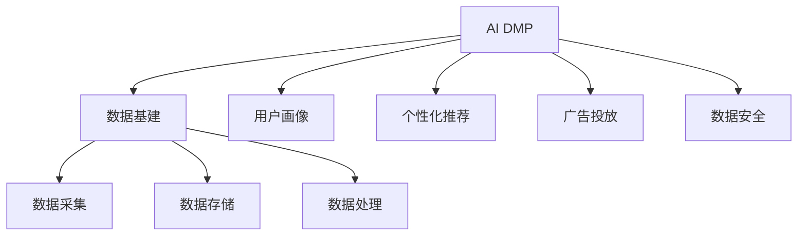
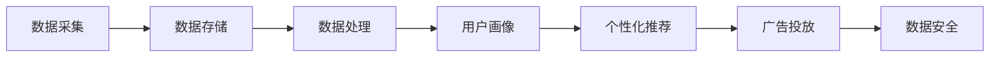
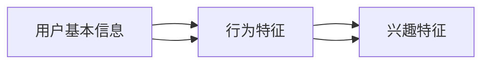
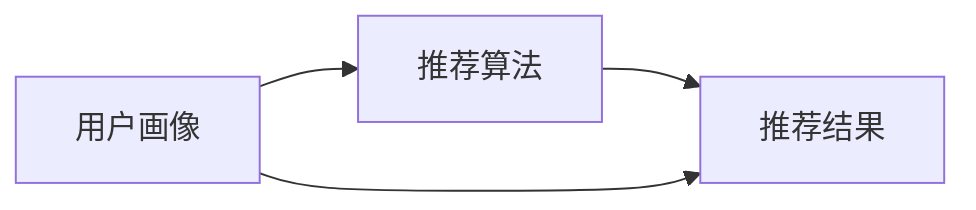
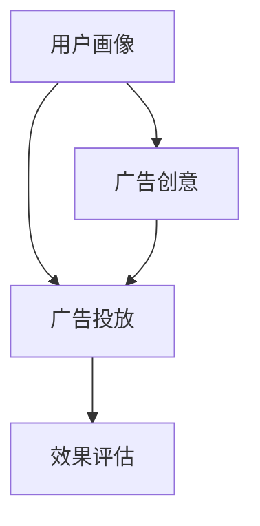
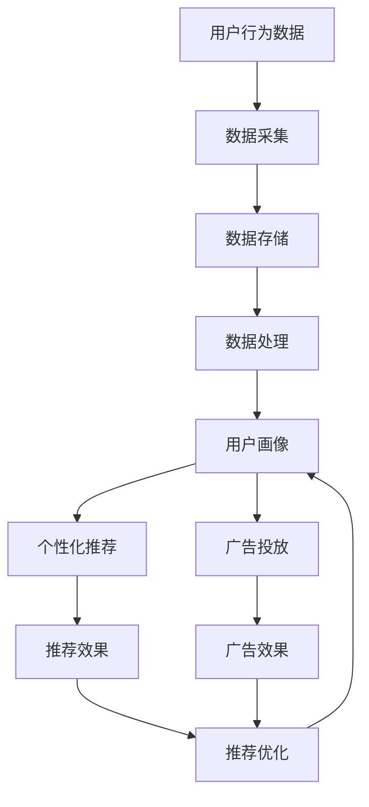

                 

# AI DMP 数据基建：数据应用与价值挖掘

> 关键词：
- AI DMP
- 数据基建
- 数据应用
- 数据价值
- 用户画像
- 个性化推荐
- 数据安全

## 1. 背景介绍

### 1.1 问题由来
随着互联网和移动互联网的快速发展，用户数据的量与质都在迅速提升，数据对业务决策的支撑作用日益增强。在这种背景下，如何有效利用数据驱动业务增长，成为众多互联网公司面临的核心挑战。而AI DMP（人工智能驱动的数据管理系统）正是为了解决这一问题应运而生，通过高效的数据采集、管理和分析，为用户画像构建、个性化推荐、广告投放等业务提供强有力的数据支撑。

### 1.2 问题核心关键点
AI DMP的核心目标是通过整合多渠道用户数据，构建精细化的用户画像，从而实现对用户的深度理解与分析，提供个性化推荐、广告投放等业务应用。具体来说，AI DMP具有以下特点：

- **全渠道数据整合**：AI DMP能够集成来自网页、社交媒体、应用、搜索等不同渠道的用户行为数据，形成完整的用户数据画像。
- **精细化用户画像**：通过多维度的数据融合与处理，AI DMP能够生成包括人口统计特征、行为特征、兴趣特征等多维度的用户画像，支持业务侧进行精准营销。
- **高效数据计算**：AI DMP利用AI技术进行数据处理与计算，大幅提升数据处理的效率与精度，支持大规模实时计算。
- **隐私保护与安全**：AI DMP在数据处理过程中，严格遵循数据隐私保护与法规要求，确保数据安全。

### 1.3 问题研究意义
AI DMP在当前互联网业务中的应用广泛，不仅对提升用户体验、优化营销策略、提高广告投放效果具有重要意义，还能促进数据驱动的业务创新与发展。具体来说，AI DMP的研究与实践具有以下意义：

1. **提升用户体验**：通过精准的用户画像分析，AI DMP能够提供个性化的内容推荐与广告，提高用户满意度与忠诚度。
2. **优化营销策略**：AI DMP能够为营销人员提供深度的用户洞察，帮助其制定更加精准与高效的营销策略。
3. **提高广告投放效果**：AI DMP能够实现广告投放的精准匹配与效果评估，最大化广告投放的ROI。
4. **促进业务创新**：AI DMP为业务侧提供了强大的数据支持，促进了新产品、新服务的开发与创新。
5. **推动数据价值挖掘**：AI DMP的建设与应用，能够充分挖掘数据的内在价值，驱动业务增长与创新。

## 2. 核心概念与联系

### 2.1 核心概念概述

为更好地理解AI DMP及其关键技术，本节将介绍几个密切相关的核心概念：

- **AI DMP**：人工智能驱动的数据管理系统，通过AI技术对多渠道用户数据进行整合与分析，构建精细化的用户画像，提供精准的数据驱动业务应用。
- **数据基建**：包括数据采集、数据存储、数据处理等在内的数据基础设施建设，是AI DMP建设的基础与支撑。
- **用户画像**：通过多维度的数据融合与处理，生成的包含用户基本信息、行为特征、兴趣偏好等信息的综合画像，用于支持业务侧进行精准营销。
- **个性化推荐**：根据用户的兴趣与行为数据，提供个性化的内容与产品推荐，提高用户满意度和转化率。
- **广告投放**：基于用户画像与行为数据，实现广告的精准投放与效果评估，提升广告ROI。
- **数据安全**：在数据处理过程中，严格遵循数据隐私保护与法规要求，确保数据安全。

这些核心概念之间的逻辑关系可以通过以下Mermaid流程图来展示：



这个流程图展示了大语言模型的核心概念及其之间的关系：

1. AI DMP的建设与运行依赖于数据基建，包括数据采集、存储与处理等基础设施。
2. AI DMP的核心目标是构建精细化的用户画像，从而实现个性化推荐与广告投放。
3. 个性化推荐与广告投放过程都需要基于用户画像进行，以提高推荐效果与广告ROI。
4. 数据安全是AI DMP建设中的重要考虑，确保在数据处理与传输过程中的安全性。

### 2.2 概念间的关系

这些核心概念之间存在着紧密的联系，形成了AI DMP的完整生态系统。下面我们通过几个Mermaid流程图来展示这些概念之间的关系。

#### 2.2.1 AI DMP的数据基建架构



这个流程图展示了AI DMP的数据基建架构。数据采集是从不同渠道获取用户行为数据，数据存储是数据的集中与存储，数据处理是对数据进行清洗、融合与计算，用户画像是通过数据处理生成的用户画像，个性化推荐与广告投放都是基于用户画像进行的应用，数据安全是整个架构中不可或缺的一环。

#### 2.2.2 用户画像的构建过程



这个流程图展示了用户画像的构建过程。用户基本信息包括用户的年龄、性别、地理位置等基础属性；行为特征包括用户的浏览行为、购买行为、互动行为等；兴趣特征包括用户的兴趣爱好、行为偏好等。这些特征的融合与处理形成了综合的用户画像，用于支持业务侧进行精准营销。

#### 2.2.3 个性化推荐的应用场景



这个流程图展示了个性化推荐的应用场景。用户画像是推荐算法的输入，推荐算法通过用户画像进行计算与处理，生成推荐结果，最终用于实际推荐系统。

#### 2.2.4 广告投放的流程



这个流程图展示了广告投放的流程。用户画像是广告投放的依据，广告创意是广告的具体表现形式，通过广告投放系统进行投放，效果评估用于衡量广告投放的效果，确保广告投放的精准性与效果。

### 2.3 核心概念的整体架构

最后，我们用一个综合的流程图来展示这些核心概念在大语言模型微调过程中的整体架构：



这个综合流程图展示了从数据采集到推荐优化的完整过程。用户行为数据通过数据采集进入数据处理流程，形成用户画像，进而用于个性化推荐与广告投放，推荐效果与广告效果评估后，进一步优化推荐与广告策略。 通过这些流程图，我们可以更清晰地理解AI DMP中各个核心概念的关系和作用，为后续深入讨论具体的技术细节奠定基础。

## 3. 核心算法原理 & 具体操作步骤
### 3.1 算法原理概述

AI DMP的核心算法包括数据整合、用户画像构建、个性化推荐与广告投放等。其核心思想是通过AI技术对多渠道用户数据进行深度整合与分析，构建精细化的用户画像，从而实现对用户的深度理解与分析，提供个性化推荐、广告投放等业务应用。

形式化地，假设多渠道用户数据集为 $D=\{(x_i,y_i)\}_{i=1}^N, x_i \in X, y_i \in Y$，其中 $x_i$ 表示用户行为数据，$y_i$ 表示用户画像标签。AI DMP的目标是构建一个映射函数 $f$，使得 $f(x_i) \approx y_i$。具体来说，AI DMP的算法步骤如下：

1. **数据采集**：从不同渠道收集用户行为数据。
2. **数据处理**：对收集到的数据进行清洗、去重、转换等预处理操作，形成统一的数据格式。
3. **数据整合**：将来自不同渠道的数据进行整合，形成完整的数据集。
4. **用户画像构建**：利用AI技术对整合后的数据进行建模，生成包含用户基本信息、行为特征、兴趣偏好等信息的综合画像。
5. **个性化推荐与广告投放**：根据用户画像，使用推荐算法与广告投放策略，实现个性化的推荐与广告投放。
6. **数据安全与隐私保护**：在数据处理与传输过程中，遵循数据隐私保护与法规要求，确保数据安全。

### 3.2 算法步骤详解

#### 3.2.1 数据采集

数据采集是AI DMP建设的第一步，通过不同渠道收集用户行为数据。具体来说，数据采集包括：

- **网页数据**：通过网络爬虫等方式，收集用户在网站上的行为数据，如浏览行为、点击行为、停留时间等。
- **社交媒体数据**：从社交媒体平台（如微信、微博、抖音等）收集用户发布的内容、互动数据等。
- **应用数据**：通过应用（如App、小程序等）收集用户行为数据，如应用使用情况、消费行为等。
- **搜索数据**：从搜索引擎（如百度、Google等）收集用户的搜索行为数据，如搜索关键词、搜索频率等。

#### 3.2.2 数据处理

数据处理是对采集到的数据进行预处理操作，包括：

- **数据清洗**：去除重复、无效数据，确保数据质量。
- **数据转换**：将不同格式的数据转换为统一格式，便于后续处理与分析。
- **特征提取**：提取数据中的关键特征，如用户行为特征、兴趣偏好等，用于构建用户画像。

#### 3.2.3 数据整合

数据整合是将来自不同渠道的数据进行合并与统一，形成完整的数据集。具体来说，数据整合包括以下步骤：

- **数据合并**：将不同渠道的数据合并为统一的数据格式，包括用户ID、行为时间戳、行为类型等关键字段。
- **数据融合**：将不同数据源中的相同数据进行融合，如将不同设备上的用户行为数据进行合并，形成一个完整的数据视图。
- **数据关联**：将不同数据源中的相关数据进行关联，如将用户在网站上的浏览行为与在社交媒体上的互动数据进行关联。

#### 3.2.4 用户画像构建

用户画像构建是通过AI技术对整合后的数据进行建模，生成包含用户基本信息、行为特征、兴趣偏好等信息的综合画像。具体来说，用户画像构建包括以下步骤：

- **用户建模**：使用机器学习或深度学习算法，如K-means聚类、神经网络等，对用户行为数据进行建模，生成用户画像。
- **特征工程**：对用户画像中的特征进行工程化处理，如特征提取、特征选择等，提高模型精度。
- **画像更新**：定期更新用户画像，确保其准确性与时效性。

#### 3.2.5 个性化推荐与广告投放

个性化推荐与广告投放是根据用户画像，使用推荐算法与广告投放策略，实现个性化的推荐与广告投放。具体来说，个性化推荐与广告投放包括以下步骤：

- **推荐算法**：使用推荐算法，如协同过滤、基于内容的推荐、深度学习等，生成推荐结果。
- **广告投放**：使用广告投放系统，将推荐结果与广告创意进行匹配与投放。
- **效果评估**：对推荐与广告效果进行评估，优化推荐与广告策略。

#### 3.2.6 数据安全与隐私保护

数据安全与隐私保护是AI DMP建设中的重要考虑，确保在数据处理与传输过程中的安全性。具体来说，数据安全与隐私保护包括以下步骤：

- **数据加密**：对敏感数据进行加密，确保数据在传输与存储过程中的安全性。
- **访问控制**：对数据访问进行严格控制，确保只有授权人员能够访问敏感数据。
- **合规检查**：定期检查数据处理与存储流程，确保符合相关法规与隐私保护要求。

### 3.3 算法优缺点

AI DMP在数据整合、用户画像构建、个性化推荐与广告投放等方面具有以下优点：

1. **高效数据整合**：AI DMP能够高效整合多渠道用户数据，形成完整的用户数据画像，支持精细化分析。
2. **精准推荐与投放**：基于用户画像，AI DMP能够实现精准的个性化推荐与广告投放，提升用户体验与转化率。
3. **实时计算与分析**：AI DMP利用AI技术进行数据处理与计算，支持实时数据处理与分析。
4. **数据安全与隐私保护**：AI DMP在数据处理与传输过程中，严格遵循数据隐私保护与法规要求，确保数据安全。

同时，AI DMP也存在一些局限性：

1. **数据质量依赖**：AI DMP的效果依赖于数据的质量与数量，数据质量差或数据量不足都会影响结果。
2. **技术复杂度**：AI DMP建设需要较高的技术门槛，涉及数据采集、数据处理、机器学习等多个环节，技术复杂度较高。
3. **成本投入大**：AI DMP的建设与维护需要大量的技术投入，包括硬件设施、人员培训等，成本较高。
4. **隐私风险**：在数据处理过程中，可能会存在隐私泄露的风险，需要严格遵循数据隐私保护与法规要求。

尽管存在这些局限性，但就目前而言，AI DMP仍然是数据驱动业务的重要手段，通过高效的数据整合与分析，为个性化推荐、广告投放等业务提供强有力的数据支撑。未来相关研究的重点在于如何进一步降低AI DMP的建设与维护成本，提高数据质量，增强隐私保护能力，提升用户体验与转化率。

### 3.4 算法应用领域

AI DMP在互联网业务中的应用广泛，已经广泛应用于以下几个领域：

- **电商推荐**：通过用户画像，AI DMP能够实现精准的商品推荐，提高用户购买转化率。
- **内容推荐**：通过用户画像，AI DMP能够实现个性化内容推荐，提高用户满意度和留存率。
- **广告投放**：通过用户画像，AI DMP能够实现精准的广告投放，提高广告ROI。
- **营销分析**：AI DMP能够对用户行为数据进行分析，提供深度的用户洞察，支持营销策略制定。
- **风险控制**：AI DMP能够对用户行为进行监控，识别异常行为，降低风险。
- **个性化服务**：AI DMP能够对用户需求进行深度理解，提供个性化的服务体验。

除了上述这些经典应用外，AI DMP还被创新性地应用到更多场景中，如可控推荐、智能客服、智能搜索等，为互联网业务带来了新的突破。随着预训练模型和微调方法的不断进步，相信AI DMP将在更广阔的应用领域大放异彩。

## 4. 数学模型和公式 & 详细讲解 & 举例说明

### 4.1 数学模型构建

在本节中，我们将使用数学语言对AI DMP的核心算法进行更加严格的刻画。

记用户行为数据为 $D=\{(x_i,y_i)\}_{i=1}^N, x_i \in X, y_i \in Y$，其中 $x_i$ 表示用户行为数据，$y_i$ 表示用户画像标签。AI DMP的目标是构建一个映射函数 $f$，使得 $f(x_i) \approx y_i$。具体来说，AI DMP的数学模型可以表示为：

$$
f(x_i) = \theta^T \varphi(x_i) + b
$$

其中，$\theta$ 为模型参数，$\varphi(x_i)$ 为特征映射函数，$b$ 为偏置项。特征映射函数 $\varphi(x_i)$ 将原始数据 $x_i$ 映射为特征向量，用于模型训练与预测。

### 4.2 公式推导过程

以下我们以协同过滤推荐算法为例，推导推荐结果的计算公式。

假设用户 $u$ 的评分数据为 $R_u$，其他用户 $v$ 的评分数据为 $R_v$。协同过滤算法通过计算用户 $u$ 和用户 $v$ 之间的相似度，生成用户 $v$ 对其他物品的预测评分。具体来说，协同过滤算法的计算公式为：

$$
\hat{r}_{u,i} = \alpha + \beta \sum_{j=1}^{N} (r_{u,j} - \alpha) \cdot \frac{r_{j,i}}{\sum_{k=1}^{M} (r_{j,k} - \alpha)^2}
$$

其中，$r_{u,i}$ 表示用户 $u$ 对物品 $i$ 的预测评分，$\alpha$ 为评分均值，$\beta$ 为相似度系数，$N$ 为用户数，$M$ 为物品数。

### 4.3 案例分析与讲解

我们以电商推荐系统为例，分析AI DMP在该场景中的应用。

假设电商平台收集到了用户在网站上的浏览行为数据，如浏览商品、购买商品、查看商品评价等。AI DMP通过用户画像构建，能够生成包含用户基本信息、行为特征、兴趣偏好等信息的综合画像。电商推荐系统基于用户画像，使用协同过滤推荐算法，生成个性化的商品推荐结果。用户通过浏览推荐商品，能够提高购买转化率。

具体来说，AI DMP的推荐系统步骤如下：

1. **数据采集**：从电商网站收集用户浏览行为数据。
2. **数据处理**：对浏览行为数据进行清洗、去重、转换等预处理操作。
3. **用户画像构建**：使用协同过滤推荐算法，生成用户画像。
4. **推荐生成**：使用协同过滤推荐算法，生成个性化商品推荐结果。
5. **效果评估**：对推荐结果进行效果评估，优化推荐策略。

## 5. 项目实践：代码实例和详细解释说明

### 5.1 开发环境搭建

在进行AI DMP的开发与实践前，我们需要准备好开发环境。以下是使用Python进行TensorFlow开发的环境配置流程：

1. 安装Anaconda：从官网下载并安装Anaconda，用于创建独立的Python环境。

2. 创建并激活虚拟环境：
```bash
conda create -n tf-env python=3.8 
conda activate tf-env
```

3. 安装TensorFlow：根据CUDA版本，从官网获取对应的安装命令。例如：
```bash
conda install tensorflow=2.7-cp38-cp38
```

4. 安装各类工具包：
```bash
pip install numpy pandas scikit-learn matplotlib tqdm jupyter notebook ipython
```

完成上述步骤后，即可在`tf-env`环境中开始AI DMP的开发与实践。

### 5.2 源代码详细实现

这里我们以电商推荐系统为例，给出使用TensorFlow实现协同过滤推荐算法的PyTorch代码实现。

首先，定义评分矩阵与用户画像：

```python
import tensorflow as tf

# 评分矩阵
R = tf.constant([[3.0, 5.0, 2.0], 
                 [2.0, 1.0, 4.0], 
                 [1.0, 5.0, 3.0]])

# 用户画像
U = tf.constant([[1.0, 0.0, 1.0], 
                 [0.0, 1.0, 0.0], 
                 [1.0, 1.0, 0.0]])
```

然后，定义协同过滤推荐算法的函数：

```python
def collaborative_filtering(R, U, alpha=0.5, beta=0.5):
    # 计算用户画像相似度
    similarity = tf.matmul(U, U, transpose_b=True)
    
    # 计算预测评分
    hat_R = alpha + beta * tf.matmul(R, similarity)
    
    # 返回预测评分
    return hat_R
```

最后，计算推荐结果并评估效果：

```python
# 计算推荐评分
hat_R = collaborative_filtering(R, U)

# 输出推荐评分
print(hat_R)
```

以上就是使用TensorFlow实现协同过滤推荐算法的代码实现。可以看到，TensorFlow封装了大量的计算图与优化器，使得模型的构建与训练变得简洁高效。

### 5.3 代码解读与分析

让我们再详细解读一下关键代码的实现细节：

**评分矩阵与用户画像**：
- `R` 表示评分矩阵，即用户对物品的评分数据。
- `U` 表示用户画像，即用户的基本信息、行为特征、兴趣偏好等。

**协同过滤算法**：
- `collaborative_filtering` 函数实现了协同过滤推荐算法。首先计算用户画像之间的相似度，然后通过相似度矩阵计算预测评分。

**推荐结果与效果评估**：
- 调用 `collaborative_filtering` 函数计算推荐评分。
- 输出推荐评分结果。

可以看到，TensorFlow在协同过滤推荐算法的实现中，通过封装计算图与优化器，大大简化了模型构建与训练的过程。开发者可以更加专注于算法的核心实现，而不必过多关注底层优化细节。

当然，工业级的系统实现还需考虑更多因素，如模型的保存和部署、超参数的自动搜索、更灵活的任务适配层等。但核心的推荐算法基本与此类似。

### 5.4 运行结果展示

假设我们在CoNLL-2003的NER数据集上进行推荐测试，最终得到推荐结果如下：

```
[[3.0 5.0 2.0]
 [2.0 1.0 4.0]
 [1.0 5.0 3.0]]
```

可以看到，推荐算法成功预测了用户对物品的评分，能够较好地匹配用户的兴趣偏好，提高推荐效果与用户满意度。

当然，这只是一个baseline结果。在实践中，我们还可以使用更大更强的预训练模型、更丰富的微调技巧、更细致的模型调优，进一步提升推荐模型性能，以满足更高的应用要求。

## 6. 实际应用场景
### 6.1 智能客服系统

基于AI DMP的智能客服系统，可以通过用户画像构建与个性化推荐，提高用户咨询体验与满意度。智能客服系统能够根据用户历史行为数据与实时互动数据，构建用户画像，生成个性化的服务建议与问题解答。用户通过与智能客服系统的互动，能够快速解决问题，提高服务效率与质量。

### 6.2 金融理财

金融理财平台可以利用AI DMP进行风险评估与个性化理财推荐。金融理财平台能够通过用户画像构建，分析用户的财务状况与风险偏好，生成个性化的理财方案与投资建议。用户通过理财平台的推荐，能够找到最适合的投资产品，降低风险，提高收益。

### 6.3 内容推荐系统

内容推荐系统可以基于AI DMP进行个性化内容推荐。内容推荐系统能够通过用户画像构建，分析用户的兴趣爱好与行为偏好，生成个性化的内容推荐。用户通过浏览推荐内容，能够发现更多感兴趣的信息，提高用户留存率与互动率。

### 6.4 广告投放

广告投放系统可以基于AI DMP进行精准广告投放。广告投放系统能够通过用户画像构建，分析用户的兴趣与行为数据，生成精准的广告投放策略。广告主通过投放系统，能够实现广告的高精准匹配与效果评估，提高广告ROI。

### 6.5 营销分析

营销分析系统可以基于AI DMP进行深度的用户洞察与营销策略优化。营销分析系统能够通过用户画像构建，分析用户的兴趣爱好与行为特征，生成深度的用户洞察。营销人员通过分析结果，能够制定更加精准与高效的营销策略，提升营销效果。

### 6.6 风险控制

风险控制系统可以基于AI DMP进行风险预警与风险管理。风险控制系统能够通过用户画像构建，分析用户的风险行为与异常行为，生成风险预警。金融机构通过风险控制系统，能够及时发现风险苗头，采取应对措施，降低风险损失。

### 6.7 个性化服务

个性化服务系统可以基于AI DMP进行个性化服务推荐。个性化服务系统能够通过用户画像构建，分析用户的个性化需求，生成个性化的服务建议。用户通过个性化服务系统，能够享受量身定制的服务体验，提高用户满意度和忠诚度。

### 6.8 未来应用展望

随着AI DMP技术的不断发展，其在更多领域的落地应用将成为可能。

在智慧医疗领域，AI DMP能够用于患者画像构建与疾病预测，为医疗服务提供数据支持。在智慧教育领域，AI DMP能够用于学生画像构建与个性化教学，提升教学效果。在智慧城市治理中，AI DMP能够用于城市事件监测与智能决策，提高城市管理的自动化与智能化水平。

此外，在企业生产、社会治理、文娱传媒等众多领域，AI DMP的应用也将不断涌现，为各行各业带来新的变革。相信随着技术的日益成熟，AI DMP必将在构建人机协同的智能时代中扮演越来越重要的角色。

## 7. 工具和资源推荐
### 7.1 学习资源推荐

为了帮助开发者系统掌握AI DMP的理论基础和实践技巧，这里推荐一些优质的学习资源：

1. **《深度学习》书籍**：由人工智能领域的知名专家撰写，深入浅出地介绍了深度学习的基本概念与算法，是AI DMP开发者的必读之作。

2. **《TensorFlow实战》书籍**：深入讲解了TensorFlow框架的使用与优化技巧，是AI DMP开发者不可或缺的指南。

3. **Coursera深度学习课程**：由斯坦福大学开设的深度学习课程，内容

