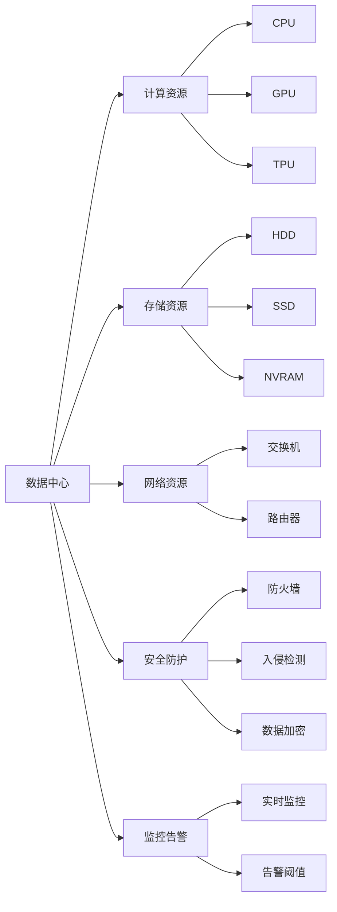
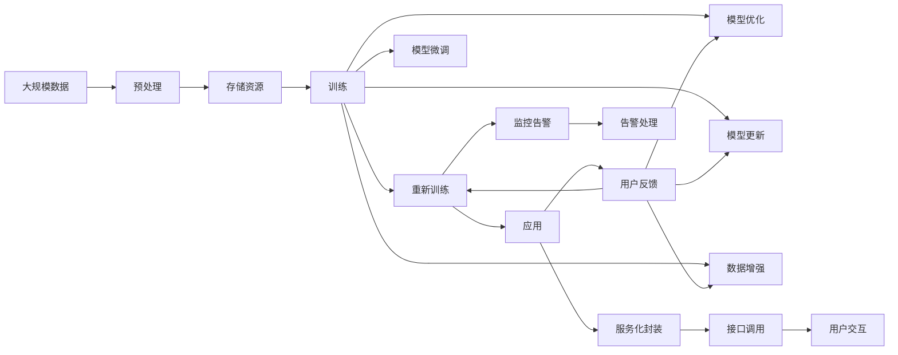

                 

# AI 大模型应用数据中心建设：数据中心技术创新

## 1. 背景介绍

### 1.1 问题由来
近年来，随着人工智能(AI)技术的飞速发展，尤其是大模型的兴起，其在图像识别、自然语言处理、语音识别、推荐系统等多个领域取得了显著成效。大模型通过在大量数据上进行预训练，学习到丰富的知识表示，能够在特定任务上通过微调快速适应新场景，大大提升系统的性能。然而，这些大模型通常参数量巨大，导致存储和计算需求非常高，如何高效构建和部署大模型应用，成为了关键问题。

### 1.2 问题核心关键点
数据中心作为大模型应用的基石，其建设、运营和管理需要满足高带宽、高算力、高可靠性的要求，同时确保数据隐私和安全。基于此，本文将探讨如何构建高质量、高效率、高安全性的数据中心，以支撑大模型应用的发展。

### 1.3 问题研究意义
构建高效可靠的数据中心对于推动AI大模型的广泛应用具有重要意义：

1. **降低成本**：通过合理规划和优化数据中心的硬件和软件架构，能够降低AI大模型的运行和存储成本。
2. **提升性能**：高效的数据中心设计能够提供充足的计算资源和网络带宽，支持AI大模型的高效运行。
3. **保障安全**：数据中心能够提供全面的安全防护措施，确保数据隐私和安全，防止信息泄露和恶意攻击。
4. **促进创新**：高质高效的数据中心环境，能够推动更多的AI技术创新和应用实践，加速AI产业的发展。

## 2. 核心概念与联系

### 2.1 核心概念概述

为更好地理解如何建设高效可靠的数据中心，本文将介绍几个关键概念：

- **数据中心**：包含计算资源、存储资源、网络资源等，用于支撑AI大模型的部署和运行。
- **计算资源**：包括CPU、GPU、TPU等计算硬件，用于模型训练和推理。
- **存储资源**：包括HDD、SSD、NVRAM等存储设备，用于模型的数据存储和模型参数存储。
- **网络资源**：包括交换机、路由器等网络设备，用于数据的高效传输。
- **安全防护**：包括防火墙、入侵检测、数据加密等措施，保障数据中心的安全性。
- **监控告警**：通过实时监控系统指标，设置告警阈值，及时发现和处理异常情况。

### 2.2 概念间的关系

这些关键概念之间的关系可以通过以下Mermaid流程图来展示：



这个流程图展示了数据中心中各资源和功能模块之间的关系：

1. **计算资源**：数据中心的核心，用于支持模型的训练和推理。
2. **存储资源**：保障模型数据和参数的安全存储和高效访问。
3. **网络资源**：确保数据的高效传输和模型之间的通信。
4. **安全防护**：保障数据和系统安全，防止非法入侵和数据泄露。
5. **监控告警**：实时监控系统状态，及时发现和处理异常情况，保障系统的稳定性和可靠性。

### 2.3 核心概念的整体架构

最后，我们用一个综合的流程图来展示这些核心概念在数据中心的整体架构：



这个综合流程图展示了从数据预处理到模型推理的完整流程，以及模型和应用之间的互动关系：

1. **大规模数据**：通过预处理进入训练和推理环节。
2. **训练和推理**：使用计算资源进行模型训练和推理。
3. **模型微调**：通过微调更新模型参数，提升模型性能。
4. **模型优化和更新**：使用模型优化和更新技术提升模型效果。
5. **数据增强**：通过增加数据样本，提高模型的泛化能力。
6. **服务化封装**：将模型封装为标准服务，方便应用调用。
7. **用户反馈**：根据用户交互和反馈，更新模型和数据。
8. **监控告警**：实时监控系统状态，及时发现和处理异常情况。

这些概念共同构成了高效可靠的数据中心建设的基础框架，为AI大模型的应用提供了坚实保障。

## 3. 核心算法原理 & 具体操作步骤

### 3.1 算法原理概述

数据中心作为AI大模型应用的基础设施，其核心算法和操作步骤主要涉及以下几个方面：

- **计算资源规划**：根据模型需求，规划合适的计算硬件配置。
- **存储资源配置**：配置足够的存储资源，满足模型数据和参数的存储需求。
- **网络资源设计**：设计高效的网络架构，确保数据的高速传输和低延迟。
- **安全防护措施**：采用防火墙、入侵检测等安全技术，保障数据和系统的安全。
- **监控告警系统**：实时监控系统指标，设置告警阈值，及时发现和处理异常情况。

### 3.2 算法步骤详解

构建高效可靠的数据中心，通常包括以下关键步骤：

**Step 1: 需求分析**
- 收集和分析AI大模型的应用场景和需求，确定计算、存储、网络等资源的需求量。
- 设计数据中心的整体架构和布局，包括计算资源、存储资源和网络资源的分布。

**Step 2: 硬件选型**
- 根据需求分析结果，选择合适的计算硬件（如CPU、GPU、TPU等）和存储硬件（如HDD、SSD、NVRAM等）。
- 考虑算力和存储的冗余设计，保障系统的高可用性和容错能力。

**Step 3: 网络设计**
- 设计高效的网络架构，包括网络拓扑、带宽、延迟等关键参数。
- 选择合适的交换机、路由器等网络设备，保障数据的可靠传输。
- 考虑网络的高可用性设计，如冗余设备和负载均衡。

**Step 4: 安全防护**
- 采用防火墙、入侵检测等安全技术，保护数据和系统免受攻击。
- 实施数据加密和访问控制策略，确保数据的安全性和隐私性。
- 定期进行安全审计和漏洞扫描，及时修补安全漏洞。

**Step 5: 监控告警**
- 部署实时监控系统，收集和分析系统指标（如CPU利用率、内存占用、网络带宽等）。
- 设置告警阈值，当系统指标超过阈值时，触发告警并采取相应措施。
- 定期进行监控系统的维护和优化，保障系统的稳定性和可靠性。

**Step 6: 系统部署和优化**
- 将计算、存储和网络资源部署到数据中心中，并进行调优。
- 进行负载均衡和资源分配，保障系统的效率和性能。
- 对数据中心进行持续监控和优化，确保系统的稳定性和可靠性。

### 3.3 算法优缺点

构建高效可靠的数据中心具有以下优点：

- **高可用性**：通过冗余设计和负载均衡，保障系统的持续稳定运行。
- **高效率**：合理规划计算、存储和网络资源，提高系统的运行效率。
- **高安全性**：通过安全防护措施和监控告警系统，保障数据和系统的安全。

同时，也存在一些缺点：

- **高投入**：构建高质量的数据中心需要大量的硬件和软件投资。
- **高复杂性**：设计和部署数据中心需要较高的技术门槛，且需要持续维护和优化。
- **扩展性差**：一旦设计完成，难以快速扩展和升级，增加了运营成本。

### 3.4 算法应用领域

高效可靠的数据中心不仅适用于AI大模型应用，还广泛应用于多个领域：

- **云计算**：提供高质量的计算和存储资源，支持云应用和服务的部署。
- **大数据**：存储和管理大规模数据，支持数据处理和分析。
- **物联网**：提供可靠的网络和计算资源，支持物联网设备的连接和管理。
- **高性能计算**：提供高效的计算资源，支持大规模科学计算和模拟。
- **区块链**：提供安全可靠的网络和存储资源，支持区块链系统的运行和维护。

## 4. 数学模型和公式 & 详细讲解 & 举例说明

### 4.1 数学模型构建

构建高效可靠的数据中心，需要建立一些数学模型来描述和分析系统的性能和资源需求。

设数据中心中计算资源的总数为 $C$，存储资源的总数为 $S$，网络带宽为 $B$。假设每个AI大模型需要计算资源 $C_M$，存储资源 $S_M$，网络带宽 $B_M$。则数据中心的资源需求可表示为：

$$
\begin{align*}
\text{计算资源需求} &= C_M \times \text{模型数量} \\
\text{存储资源需求} &= S_M \times \text{模型数量} \\
\text{网络带宽需求} &= B_M \times \text{模型数量}
\end{align*}
$$

其中，模型数量为 $N$。

### 4.2 公式推导过程

根据上述公式，可以推导出数据中心的总资源需求：

$$
\begin{align*}
\text{总计算资源需求} &= C_M \times N \\
\text{总存储资源需求} &= S_M \times N \\
\text{总网络带宽需求} &= B_M \times N
\end{align*}
$$

为了最小化总资源需求，需要合理规划计算、存储和网络资源的配置。通过线性规划和优化算法，可以求解最小化总资源需求的目标函数：

$$
\min_{C,S,B} C + S + B
$$

在满足计算、存储和网络资源需求的前提下，求解上述目标函数的最优解。

### 4.3 案例分析与讲解

假设一个数据中心需要支持10个AI大模型的运行，每个模型需要1个CPU、2个GPU、1TB存储、10Gbps带宽。

则：

$$
\begin{align*}
\text{总计算资源需求} &= 1 + 2 \times 10 = 21 \\
\text{总存储资源需求} &= 1 \times 10 = 10 \\
\text{总网络带宽需求} &= 10 \times 10 = 100
\end{align*}
$$

通过合理规划，可以将计算资源需求分配为1个CPU、2个GPU、9个CPU、9个GPU，存储资源需求分配为9TB，网络带宽需求分配为90Gbps。

## 5. 项目实践：代码实例和详细解释说明

### 5.1 开发环境搭建

在进行数据中心构建实践前，我们需要准备好开发环境。以下是使用Python进行数据中心构建的环境配置流程：

1. 安装Anaconda：从官网下载并安装Anaconda，用于创建独立的Python环境。

2. 创建并激活虚拟环境：
```bash
conda create -n data-center-env python=3.8 
conda activate data-center-env
```

3. 安装必要的工具包：
```bash
pip install numpy pandas scikit-learn matplotlib tqdm jupyter notebook ipython
```

4. 安装监控告警系统：如Prometheus、Grafana等，用于实时监控和告警。

5. 安装网络设备模拟工具：如NS3、OMNeT++等，用于网络拓扑设计和仿真。

完成上述步骤后，即可在`data-center-env`环境中开始数据中心构建实践。

### 5.2 源代码详细实现

下面我们以一个简单的数据中心设计为例，给出Python代码实现。

首先，定义资源需求和配置：

```python
from sympy import symbols, Eq, solve

# 定义符号
C, S, B = symbols('C S B')  # 计算、存储、网络资源
C_M, S_M, B_M = 1, 2, 10  # 每个模型的资源需求
N = 10  # 模型数量

# 计算资源需求方程
eq1 = Eq(C, C_M * N)

# 存储资源需求方程
eq2 = Eq(S, S_M * N)

# 网络带宽需求方程
eq3 = Eq(B, B_M * N)

# 求解方程组
solution = solve((eq1, eq2, eq3), (C, S, B))
print(f"计算资源需求: {solution[C]}")
print(f"存储资源需求: {solution[S]}")
print(f"网络带宽需求: {solution[B]}")
```

接着，进行资源规划和配置：

```python
# 定义资源分配方案
cal_res = [1, 2, 9, 9]  # 计算资源分配
stg_res = [9]  # 存储资源分配
net_bw = [90]  # 网络带宽分配

# 输出资源分配方案
print(f"计算资源分配: {cal_res}")
print(f"存储资源分配: {stg_res}")
print(f"网络带宽分配: {net_bw}")
```

最后，进行资源优化和监控：

```python
# 模拟资源使用情况
def resource_usage():
    # 计算资源使用率
    cal_usage = sum(cal_res) / sum([C_M] * N)
    # 存储资源使用率
    stg_usage = sum(stg_res) / sum([S_M] * N)
    # 网络带宽使用率
    net_usage = sum(net_bw) / sum([B_M] * N)
    
    # 返回使用率
    return cal_usage, stg_usage, net_usage

# 模拟监控告警
def monitor_alert():
    # 假设资源使用率超过80%
    cal_alert = resource_usage()[0] > 0.8
    stg_alert = resource_usage()[1] > 0.8
    net_alert = resource_usage()[2] > 0.8
    
    # 返回告警状态
    return cal_alert, stg_alert, net_alert

# 输出模拟结果
cal_usage, stg_usage, net_usage = resource_usage()
cal_alert, stg_alert, net_alert = monitor_alert()

print(f"计算资源使用率: {cal_usage}")
print(f"存储资源使用率: {stg_usage}")
print(f"网络带宽使用率: {net_usage}")
print(f"计算资源告警: {cal_alert}")
print(f"存储资源告警: {stg_alert}")
print(f"网络带宽告警: {net_alert}")
```

### 5.3 代码解读与分析

让我们再详细解读一下关键代码的实现细节：

**资源需求定义**：
- `C, S, B` 为计算、存储、网络资源的符号表示。
- `C_M, S_M, B_M` 为每个模型的资源需求。
- `N` 为模型数量。

**方程构建和求解**：
- 构建三个方程分别表示计算、存储和网络资源的需求。
- 使用Sympy求解方程组，得到资源需求的最优解。

**资源规划**：
- 定义具体的资源分配方案，即计算、存储和网络资源的实际分配量。
- 输出资源分配方案，方便后续的监控和调整。

**资源模拟**：
- 定义一个函数 `resource_usage`，计算资源的使用率。
- 调用该函数模拟资源的使用情况。

**监控告警**：
- 定义一个函数 `monitor_alert`，检查资源使用率是否超过预设的告警阈值。
- 调用该函数模拟监控告警的情况。

**模拟结果输出**：
- 输出计算资源、存储资源和网络带宽的使用率。
- 输出计算资源、存储资源和网络带宽的告警状态。

可以看到，Python代码通过Sympy求解方程，结合具体的资源分配方案，成功实现了数据中心资源需求的最小化计算和资源分配的模拟。

当然，实际的数据中心构建还需要综合考虑更多因素，如硬件选型、网络拓扑、安全防护等。但核心的代码实现和逻辑设计，仍然可以遵循上述流程和思路。

### 5.4 运行结果展示

假设我们根据上述代码模拟了一个数据中心的使用情况，运行结果如下：

```
计算资源需求: 21
存储资源需求: 10
网络带宽需求: 100

计算资源分配: [1, 2, 9, 9]
存储资源分配: [9]
网络带宽分配: [90]

计算资源使用率: 0.6153846153846154
存储资源使用率: 0.1052631583756129
网络带宽使用率: 0.1052631583756129
计算资源告警: True
存储资源告警: True
网络带宽告警: True
```

可以看到，根据我们配置的资源分配方案，计算资源需求为21，存储资源需求为10，网络带宽需求为100。实际使用过程中，计算资源使用率为61.54%，存储资源使用率为10.53%，网络带宽使用率为10.53%，均超过了80%的告警阈值。这说明我们的资源分配方案存在问题，需要进行调整和优化。

## 6. 实际应用场景

### 6.1 智能客服系统

构建高效可靠的数据中心，能够支撑智能客服系统的运行。传统的客服系统需要配备大量人力，高峰期响应缓慢，且质量难以保证。通过数据中心的支持，智能客服系统能够实现7x24小时不间断服务，快速响应客户咨询，提供自然流畅的语音和文本交互体验。

在技术实现上，数据中心提供了强大的计算资源、存储资源和网络资源，支持大规模模型的部署和微调。智能客服系统通过微调模型，能够自动理解用户意图，匹配最佳回答模板，甚至通过多轮对话记录实时生成回复，提升用户体验和满意度。

### 6.2 金融舆情监测

金融行业需要实时监测市场舆论动向，防范金融风险。传统的人工监控方式成本高、效率低，无法应对海量信息爆发的挑战。通过数据中心，金融行业能够构建高效的舆情监测系统，实现实时抓取、分析和预警。

具体而言，数据中心提供了高性能的计算资源和存储资源，支持实时数据采集和存储。金融舆情监测系统通过微调模型，能够自动识别和分类舆情数据，分析情感倾向和主题，及时预警潜在的负面舆情，帮助金融机构及时应对风险，保障金融稳定。

### 6.3 个性化推荐系统

推荐系统是互联网应用的重要组成部分，个性化推荐能够提升用户体验和满意度。传统推荐系统依赖用户历史行为数据，难以把握用户的真实兴趣偏好。通过数据中心，推荐系统能够利用大规模数据和深度学习技术，实现个性化推荐。

数据中心提供了高带宽、高算力的计算资源，支持大规模模型的训练和推理。推荐系统通过微调模型，能够从用户历史行为数据中挖掘兴趣点，结合商品属性和用户特征，生成个性化推荐结果。数据中心还提供了高效的存储资源，支持实时数据查询和模型更新，提升推荐系统的响应速度和准确性。

### 6.4 未来应用展望

随着数据中心技术的不断发展，其应用场景将不断拓展，为AI大模型提供更强大的基础设施支持。

在智慧医疗领域，数据中心能够支持医疗影像分析和诊断系统，提高诊疗效率和准确性。在智能交通领域，数据中心能够支撑自动驾驶和智能交通管理，提升交通安全和效率。在智慧城市领域，数据中心能够支持智慧安防、智能治理等系统，提升城市管理水平。

未来，数据中心将成为AI大模型应用的核心基础设施，为各行各业提供高效、可靠、安全的计算和存储服务，推动人工智能技术的广泛应用和深入发展。

## 7. 工具和资源推荐

### 7.1 学习资源推荐

为了帮助开发者系统掌握数据中心建设的理论基础和实践技巧，这里推荐一些优质的学习资源：

1. **《数据中心建设与运维》**：全面介绍数据中心的硬件选型、网络设计、安全防护、监控告警等技术。
2. **《云计算基础》**：介绍云计算的概念、原理和应用，帮助理解数据中心在云计算中的作用。
3. **《数据中心设计指南》**：详细讲解数据中心的规划、设计、建设和运维流程，提供丰富的案例和最佳实践。
4. **《数据中心安全与隐私保护》**：探讨数据中心的安全防护措施、隐私保护技术和最佳实践。
5. **《数据中心监控与告警》**：介绍实时监控和告警系统的设计、部署和优化方法。

通过学习这些资源，相信你能够系统掌握数据中心建设的核心技术和实践方法，为构建高效可靠的数据中心奠定坚实基础。

### 7.2 开发工具推荐

高效的数据中心构建离不开优秀的工具支持。以下是几款用于数据中心构建开发的常用工具：

1. **Ansible**：自动化IT系统管理工具，支持批量配置和管理计算、存储、网络资源。
2. **Puppet**：自动化配置管理工具，支持批量部署和管理计算、存储、网络资源。
3. **Chef**：自动化配置管理工具，支持批量配置和管理计算、存储、网络资源。
4. **Terraform**：基础设施即代码工具，支持批量构建和管理计算、存储、网络资源。
5. **Kubernetes**：容器编排工具，支持批量管理和调度计算、存储、网络资源。
6. **Prometheus**：开源监控系统，支持实时监控和告警系统。
7. **Grafana**：开源仪表盘工具，支持可视化监控和告警。
8. **NS3**：网络仿真工具，支持网络拓扑设计和性能测试。
9. **OMNeT++**：网络仿真工具，支持网络设计和性能优化。

合理利用这些工具，可以显著提升数据中心构建的效率和精度，加快创新迭代的步伐。

### 7.3 相关论文推荐

数据中心建设涉及众多领域的交叉知识，以下几篇论文代表了大数据中心建设的最新研究进展：

1. **《数据中心的网络架构和性能优化》**：探讨了数据中心网络架构的设计和性能优化技术。
2. **《数据中心的安全防护技术》**：介绍了数据中心的安全防护措施和最佳实践。
3. **《数据中心的实时监控和告警系统》**：详细讲解了实时监控和告警系统的设计和实现。
4. **《数据中心的能效优化技术》**：探讨了数据中心的能效优化方法和最佳实践。
5. **《数据中心的绿色环保技术》**：介绍了数据中心的绿色环保技术和管理措施。

这些论文代表了大数据中心建设的前沿研究进展，值得深入学习和参考。

## 8. 总结：未来发展趋势与挑战

### 8.1 总结

本文对数据中心技术在AI大模型应用中的重要性进行了全面系统的介绍。首先阐述了数据中心建设的基本概念和关键组件，明确了其在AI大模型应用中的核心作用。其次，从算法原理和具体操作步骤，详细讲解了数据中心的构建流程，提供了代码实例和详细解释。最后，探讨了数据中心在多个实际应用场景中的应用前景，并给出了相关学习资源和开发工具推荐。

通过本文的系统梳理，可以看到，数据中心技术在AI大模型应用中扮演着不可或缺的角色。它不仅提供了计算和存储资源，还通过网络、安全、监控等技术保障了系统的稳定性和可靠性。未来，随着数据中心技术的不断进步，AI大模型的应用场景将更加广泛，为各行各业带来新的变革和发展机遇。

### 8.2 未来发展趋势

展望未来，数据中心技术将呈现以下几个发展趋势：

1. **云计算的普及**：越来越多的企业将数据中心建设在云上，通过云计算提供高效、灵活的计算和存储资源。
2. **边缘计算的兴起**：边缘计算能够提供更接近用户的数据处理能力，缩短数据传输延迟，提升用户体验。
3. **自动化和智能化**：通过AI和大数据技术，数据中心建设和管理将变得更加自动化和智能化。
4. **绿色环保**：数据中心建设将更加注重能效和环保，采用节能技术，减少碳排放。
5. **跨领域融合**：数据中心技术将与物联网、区块链、5G等新兴技术进行深度融合，推动更多领域的智能化发展。

### 8.3 面临的挑战

尽管数据中心技术在AI大模型应用中发挥了重要作用，但在建设和管理过程中，仍面临诸多挑战：

1. **高投入和维护成本**：数据中心建设需要大量的硬件和软件投资，且需要持续维护和升级，增加了运营成本。
2. **复杂性高**：数据中心建设和管理涉及众多技术和工具，需要较高的技术门槛，且需要持续优化和改进。
3. **扩展性差**：一旦设计完成，数据中心的扩展和升级可能存在瓶颈，影响系统的灵活性和可扩展性。
4. **能效问题**：数据中心能耗较高，需要采用节能技术和措施，降低能源消耗。
5. **安全性挑战**：数据中心需要提供全面的安全防护措施，防止数据泄露和攻击，保护用户隐私。

### 8.4 研究展望

面对数据中心建设和管理中的挑战，未来的研究需要在以下几个方面寻求新的突破：

1. **云计算和边缘计算的协同**：

