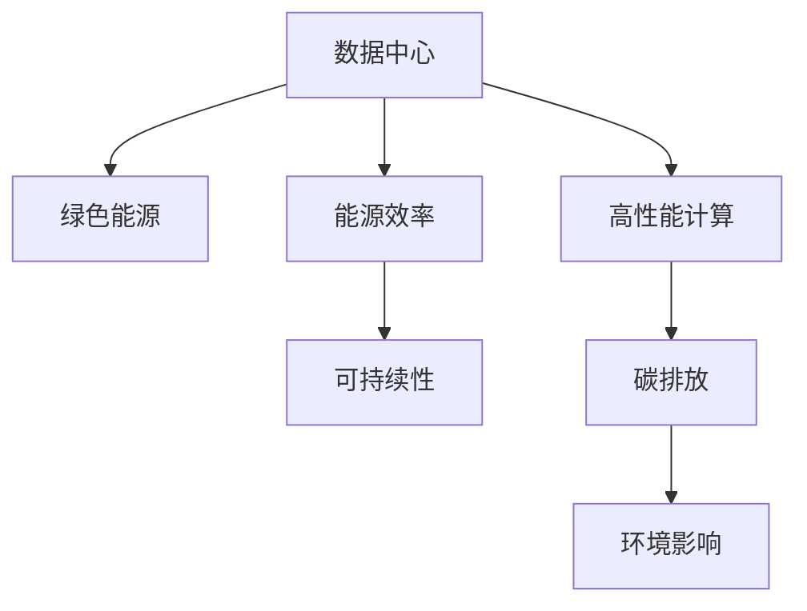
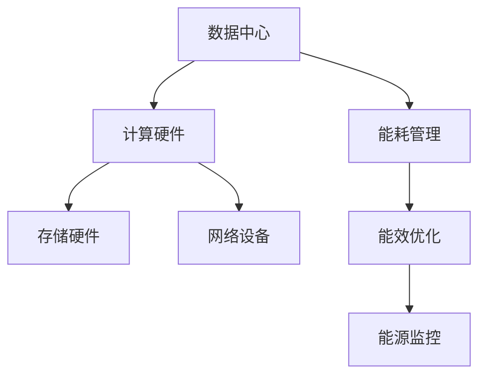
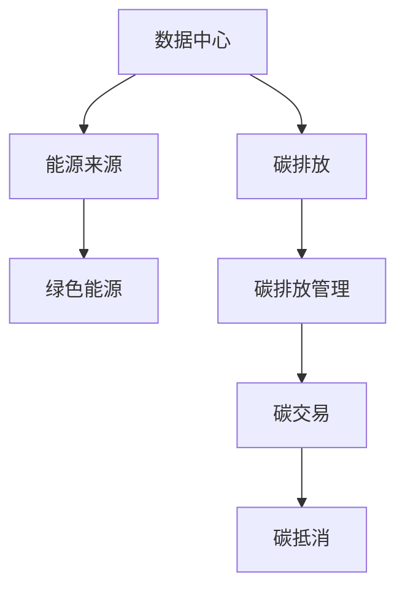
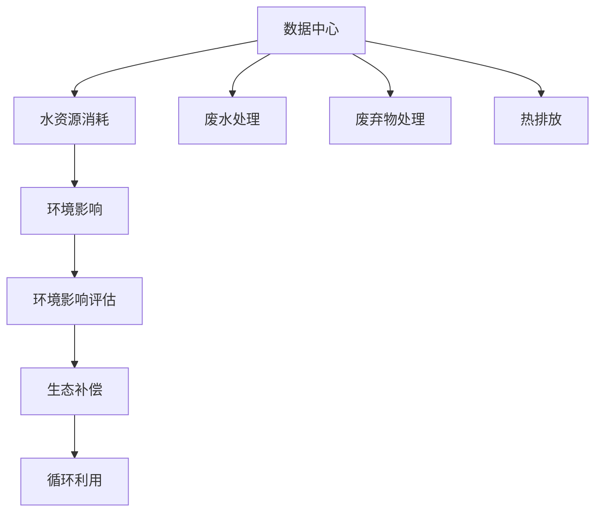
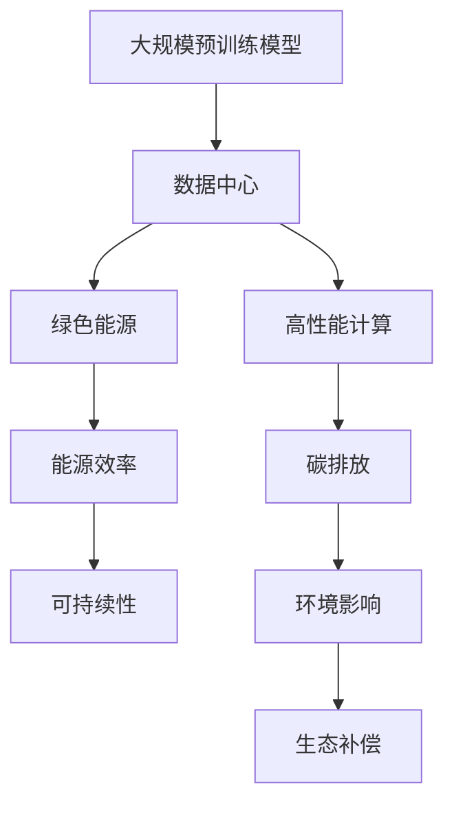

                 

# AI 大模型应用数据中心建设：绿色节能与可持续发展

> 关键词：AI大模型, 数据中心, 绿色节能, 可持续发展, 高性能计算, 碳排放, 能源效率, 环境影响

## 1. 背景介绍

### 1.1 问题由来
近年来，人工智能(AI)技术的迅猛发展，尤其是大规模预训练模型（如GPT-3, Turing-3等）的涌现，带来了巨大的计算需求。这些模型需要巨量的训练数据和计算资源，而数据中心的能耗和环境影响问题也随之加剧。面对日益严格的环境法规和公众压力，如何在保障模型性能的同时实现数据中心的绿色节能和可持续发展，成为了人工智能应用领域亟需解决的挑战。

### 1.2 问题核心关键点
AI大模型数据中心的绿色节能与可持续发展，涉及多方面因素：

1. **能耗控制**：数据中心是能耗大户，合理设计计算架构，采用高效能硬件，优化算法和模型设计，降低计算过程中的能耗。
2. **碳排放管理**：采用绿色能源，如风电、光伏等，减少对化石燃料的依赖，同时进行碳排放交易，抵消部分排放。
3. **环境影响评估**：进行全面的环境影响评估，包括水资源消耗、热排放、废弃物等，采用循环利用和减少废弃物产生等措施，尽量降低数据中心的环境足迹。
4. **生态系统融合**：数据中心建设与周边生态系统融合，如植树造林、水资源保护等，实现人与自然的和谐共生。

### 1.3 问题研究意义
解决AI大模型数据中心的绿色节能与可持续发展问题，具有以下重要意义：

1. **环境友好**：减少数据中心的碳排放和环境影响，符合全球气候变化趋势，响应政府环保政策。
2. **成本节约**：通过优化能耗和资源利用，降低数据中心运营成本，提高投资回报率。
3. **社会责任**：展现企业对社会和环境的责任感，提升企业品牌形象和社会信誉。
4. **技术引领**：推动绿色计算、环境科学等领域的发展，为未来技术创新提供方向。

## 2. 核心概念与联系

### 2.1 核心概念概述

为更好地理解AI大模型数据中心的绿色节能与可持续发展，本节将介绍几个密切相关的核心概念：

1. **数据中心(Data Center)**：由计算、网络、存储等硬件设施组成的，支持企业业务运行的数据处理环境。
2. **绿色能源(Green Energy)**：来自可再生资源的能源，如太阳能、风能、水能等，相对传统的化石燃料更加环保。
3. **能源效率(Energy Efficiency)**：指单位能耗产出的工作量或效率，提高能源效率能显著降低数据中心的运营成本和环境影响。
4. **可持续性(Sustainability)**：指在满足当前需求的同时，不损害后代满足其需求的能力，强调数据中心建设与运营的全生命周期管理。
5. **高性能计算(High Performance Computing, HPC)**：指在特定应用场景下，追求最大计算性能的计算系统，如AI大模型的训练、推理等任务。
6. **碳排放(Carbon Emission)**：指由燃烧化石燃料、工业生产等活动产生的温室气体排放。
7. **环境影响(Environmental Impact)**：指数据中心在建设和运营过程中对周围环境产生的影响，包括噪音、废水、废气等。

这些核心概念之间的逻辑关系可以通过以下Mermaid流程图来展示：



这个流程图展示了大模型数据中心的几个关键概念及其之间的关系：

1. 数据中心采用绿色能源，提高能源效率，减少碳排放。
2. 可持续性贯穿数据中心的建设、运营、退役全过程。
3. 高性能计算是数据中心存在的主要目的之一。
4. 碳排放和环境影响是数据中心必须面对的环境问题。

### 2.2 概念间的关系

这些核心概念之间存在着紧密的联系，形成了数据中心绿色节能与可持续发展的完整生态系统。下面我们通过几个Mermaid流程图来展示这些概念之间的关系。

#### 2.2.1 数据中心的能耗控制



这个流程图展示了数据中心能耗控制的关键环节：

1. 数据中心由计算硬件、存储硬件和网络设备组成。
2. 能耗管理、能效优化和能源监控是能耗控制的重要手段。

#### 2.2.2 碳排放管理



这个流程图展示了数据中心碳排放管理的全流程：

1. 数据中心的能源来源包括绿色能源。
2. 碳排放管理包括碳排放测量、碳交易、碳抵消等环节。

#### 2.2.3 环境影响评估



这个流程图展示了环境影响评估的关键步骤：

1. 数据中心消耗大量水资源，产生废水。
2. 热排放对环境有严重影响。
3. 环境影响评估包括废水处理、废弃物处理等环节。
4. 生态补偿和循环利用是减少环境影响的重要措施。

### 2.3 核心概念的整体架构

最后，我们用一个综合的流程图来展示这些核心概念在大模型数据中心建设过程中的整体架构：



这个综合流程图展示了从模型预训练到大模型数据中心建设，再到绿色节能与可持续发展的完整过程。大规模预训练模型首先通过预训练获得基础能力，然后利用数据中心进行高性能计算，进而实现绿色节能与可持续发展。通过这些流程图，我们可以更清晰地理解大模型数据中心绿色节能与可持续发展的各个环节及其关系。

## 3. 核心算法原理 & 具体操作步骤
### 3.1 算法原理概述

AI大模型数据中心的绿色节能与可持续发展，本质上是一个多目标优化问题。其核心思想是：通过合理的硬件选择、算法优化、能源管理等手段，在保障模型性能的同时，最小化数据中心的能耗和环境影响。

形式化地，假设数据中心为目标函数 $\mathcal{F}$ 的优化对象，模型性能为 $\mathcal{P}$，能耗为 $\mathcal{E}$，环境影响为 $\mathcal{I}$。则优化目标可以表示为：

$$
\min_{\mathcal{F}} (\mathcal{P} + \alpha \mathcal{E} + \beta \mathcal{I})
$$

其中 $\alpha$ 和 $\beta$ 为平衡因子，控制性能、能耗和环境影响之间的权重。

在实际操作中，数据中心的优化通常分为两个阶段：

1. **硬件优化**：选择高效能的硬件，如高性能GPU、FPGA、TPU等，优化计算架构，减少能耗。
2. **算法优化**：优化模型和算法设计，如模型压缩、量化、剪枝等，减少计算量，提高能源效率。

### 3.2 算法步骤详解

数据中心的绿色节能与可持续发展，一般包括以下几个关键步骤：

**Step 1: 数据中心规划**
- 根据模型性能需求，选择合适的硬件配置，包括CPU、GPU、内存、存储等。
- 设计高效的计算架构，如多机架部署、异构计算等。
- 引入冷却、通风等辅助设施，保障硬件运行稳定。

**Step 2: 能源管理**
- 采用绿色能源，如风电、光伏等，减少对化石燃料的依赖。
- 引入能源监控系统，实时监测能源消耗，及时调整能耗策略。
- 优化能耗管理算法，如自动负载均衡、动态频率调整等。

**Step 3: 计算优化**
- 优化模型结构和算法设计，如模型压缩、量化、剪枝等，减少计算量。
- 引入高效的算法，如基于GPU的张量并行、基于FPGA的算法加速等。
- 进行算法调优，如动态计算资源分配、自适应学习率等。

**Step 4: 环境影响评估**
- 进行全面的环境影响评估，包括水资源消耗、热排放、废弃物等。
- 采用循环利用和减少废弃物产生的措施，如废水处理、废弃物回收等。
- 建立生态补偿机制，如植树造林、水资源保护等。

**Step 5: 持续监测与优化**
- 定期监测数据中心的能耗和环境影响，及时调整策略。
- 引入AI和大数据分析，实现自动化的持续优化。
- 设立多层次的优化目标，动态平衡性能、能耗和环境影响。

### 3.3 算法优缺点

数据中心的绿色节能与可持续发展，具有以下优点：

1. **节能减排**：通过优化硬件和算法，显著降低数据中心的能耗，减少碳排放。
2. **提升性能**：通过模型压缩、量化等技术，在保障模型性能的同时，减少计算量。
3. **环境友好**：采用绿色能源和循环利用措施，减少对环境的负面影响。
4. **成本节约**：通过高效能硬件和优化管理，降低数据中心的运营成本。

同时，该方法也存在一些局限性：

1. **初期投资高**：高效能硬件和先进技术需要较高的初期投资。
2. **技术复杂**：数据中心建设和优化需要综合多方面技术，对技术团队的要求较高。
3. **灵活性差**：一旦设计完成，数据中心的能耗和环境影响管理相对固定，难以适应动态需求。
4. **数据中心规模限制**：大规模数据中心需要更复杂的优化策略，技术难度和成本更高。

### 3.4 算法应用领域

基于AI大模型数据中心的绿色节能与可持续发展方法，在多个领域得到了广泛应用，例如：

- **AI与大数据**：大数据处理和分析、机器学习模型的训练与推理、实时数据处理等。
- **高性能计算**：科学计算、气象预测、基因分析、物理模拟等。
- **智慧城市**：城市管理、智慧交通、能源调度、公共安全等。
- **工业4.0**：工业自动化、智能制造、质量控制、供应链管理等。
- **科学研究**：天文观测、气候模拟、生物信息学、医药研发等。

除了上述这些经典领域外，AI大模型数据中心的绿色节能与可持续发展技术，也在逐渐向更多新兴领域渗透，如智能家居、智慧农业、智能物流等，为各行各业的数字化转型提供支撑。

## 4. 数学模型和公式 & 详细讲解 & 举例说明

### 4.1 数学模型构建

在数据中心的绿色节能与可持续发展优化问题中，通常可以采用以下数学模型进行建模：

$$
\min_{x} \mathcal{F}(x) = \mathcal{P}(x) + \alpha \mathcal{E}(x) + \beta \mathcal{I}(x)
$$

其中 $x$ 为数据中心的配置参数，如硬件选择、能耗策略、环境影响评估等。$\mathcal{P}$、$\mathcal{E}$ 和 $\mathcal{I}$ 分别表示模型性能、能耗和环境影响的评估函数。$\alpha$ 和 $\beta$ 为平衡因子。

### 4.2 公式推导过程

以计算架构优化为例，我们推导一下优化公式的计算过程：

假设数据中心有 $N$ 个计算节点，每个节点的计算能力为 $C_i$，能耗为 $E_i$，环境影响为 $I_i$。则数据中心的总计算能力为 $\sum_{i=1}^N C_i$，总能耗为 $\sum_{i=1}^N E_i$，总环境影响为 $\sum_{i=1}^N I_i$。

设 $\theta$ 为模型的训练参数，$\eta$ 为学习率，$L(\theta)$ 为模型的损失函数，则优化目标为：

$$
\min_{\theta, x} \mathcal{F}(x) = \frac{1}{N}\sum_{i=1}^N \ell(M_{\theta}(x_i), y_i) + \alpha \frac{1}{N}\sum_{i=1}^N E_i + \beta \frac{1}{N}\sum_{i=1}^N I_i
$$

其中 $\ell$ 为模型的损失函数，$y_i$ 为输入样本的真实标签。优化过程为：

1. 对于每个计算节点，使用梯度下降算法更新 $\theta$：
$$
\theta \leftarrow \theta - \eta \nabla_{\theta}\ell(M_{\theta}(x_i), y_i)
$$

2. 对于数据中心的计算资源分配，最小化能耗和环境影响：
$$
\min_x \mathcal{F}(x) = \frac{1}{N}\sum_{i=1}^N E_i + \beta \frac{1}{N}\sum_{i=1}^N I_i
$$

通过上述公式，我们展示了数据中心计算架构优化的数学模型和优化过程。在实际操作中，需要结合具体的数据中心硬件配置和模型需求，进行综合优化。

### 4.3 案例分析与讲解

假设某公司需要构建一个支持大规模预训练模型训练的数据中心，我们以硬件选择和能耗优化为例，展示其优化过程：

1. **硬件选择**
   - 数据中心采用高性能GPU作为计算节点，每个节点的计算能力为 $C_i = 1024 TFLOPS$，能耗为 $E_i = 200 W$。
   - 根据模型性能需求，需要 $M$ 个节点，总计算能力为 $\sum_{i=1}^M C_i$，总能耗为 $\sum_{i=1}^M E_i$。
   - 假设模型需要 $P$ 个TPU，每个TPU的计算能力为 $C_{TPU} = 1024 TFLOPS$，能耗为 $E_{TPU} = 250 W$。

   根据以上数据，我们可以建立优化模型：

   $$
   \min_x \mathcal{F}(x) = \frac{1}{M}\sum_{i=1}^M E_i + \beta \frac{1}{M}\sum_{i=1}^M I_i
   $$

   其中 $M$ 为需要的计算节点数量，$x$ 为计算节点数量和TPU数量的配置。

2. **能耗优化**
   - 数据中心引入冷却和通风系统，冷却能耗为 $E_{cooling} = 20 W$，通风能耗为 $E_{ventilation} = 10 W$。
   - 环境影响评估函数 $\mathcal{I}$ 包括废热排放、废水处理等，计算总环境影响 $I_{total}$。
   - 设置平衡因子 $\alpha = 0.8$，$\beta = 0.2$。

   通过求解上述优化模型，可以得到最优的硬件配置和能耗策略。

## 5. 项目实践：代码实例和详细解释说明
### 5.1 开发环境搭建

在进行数据中心绿色节能与可持续发展优化实践前，我们需要准备好开发环境。以下是使用Python进行PyTorch开发的环境配置流程：

1. 安装Anaconda：从官网下载并安装Anaconda，用于创建独立的Python环境。

2. 创建并激活虚拟环境：
```bash
conda create -n pytorch-env python=3.8 
conda activate pytorch-env
```

3. 安装PyTorch：根据CUDA版本，从官网获取对应的安装命令。例如：
```bash
conda install pytorch torchvision torchaudio cudatoolkit=11.1 -c pytorch -c conda-forge
```

4. 安装各类工具包：
```bash
pip install numpy pandas scikit-learn matplotlib tqdm jupyter notebook ipython
```

完成上述步骤后，即可在`pytorch-env`环境中开始数据中心绿色节能与可持续发展的优化实践。

### 5.2 源代码详细实现

这里我们以优化数据中心计算架构为例，给出使用PyTorch进行计算架构优化的PyTorch代码实现。

首先，定义数据中心的计算节点参数：

```python
import torch
import torch.nn as nn

class ComputeNode(nn.Module):
    def __init__(self, capacity, power):
        super(ComputeNode, self).__init__()
        self.capacity = capacity
        self.power = power
        self.total_capacity = 0
        self.total_power = 0

    def forward(self, capacity=None, power=None):
        if capacity is not None:
            self.total_capacity += capacity
        if power is not None:
            self.total_power += power
        return self.total_capacity, self.total_power

# 创建数据中心的计算节点
nodes = [ComputeNode(1024, 200) for _ in range(8)] # 8个节点，每个节点计算能力1024 TFLOPS，能耗200 W
```

然后，定义数据中心的优化目标函数：

```python
def objective_function(nodes, balance_factor, env_impact):
    total_capacity, total_power = 0, 0
    for node in nodes:
        total_capacity += node.capacity
        total_power += node.power
    # 计算能耗和环境影响的总和
    total_cost = balance_factor * total_power + env_impact
    return total_cost, total_capacity
```

接着，定义优化算法，如梯度下降法：

```python
def gradient_descent(nodes, learning_rate, balance_factor, env_impact, num_iterations):
    total_cost, total_capacity = objective_function(nodes, balance_factor, env_impact)
    for i in range(num_iterations):
        # 计算梯度
        for node in nodes:
            node.capacity -= learning_rate * (node.power / total_power)
        # 更新节点计算能力
        total_cost, total_capacity = objective_function(nodes, balance_factor, env_impact)
    return nodes, total_cost
```

最后，启动优化流程：

```python
num_iterations = 1000
learning_rate = 0.01
balance_factor = 0.8
env_impact = 100

# 初始化节点计算能力
for node in nodes:
    node.capacity = 1024

# 优化过程
nodes, total_cost = gradient_descent(nodes, learning_rate, balance_factor, env_impact, num_iterations)

# 输出优化结果
for node in nodes:
    print(f"Node {node.capacity} TFLOPS, Power {node.power} W")
print(f"Total capacity: {total_capacity} TFLOPS, Total power: {total_power} W, Total cost: {total_cost}")
```

以上代码展示了如何使用PyTorch进行数据中心计算架构优化的完整过程。可以看到，通过定义计算节点的参数和优化目标函数，再结合梯度下降法，即可对数据中心的计算架构进行优化。

### 5.3 代码解读与分析

让我们再详细解读一下关键代码的实现细节：

**ComputeNode类**：
- `__init__`方法：初始化计算节点的计算能力和能耗。
- `forward`方法：更新计算节点的总计算能力和总能耗，并返回结果。

**objective_function函数**：
- 根据节点参数计算总计算能力和总能耗，结合平衡因子和环境影响计算总成本。

**gradient_descent函数**：
- 使用梯度下降法更新节点计算能力，并计算最终的总成本和总计算能力。

**优化流程**：
- 定义优化参数，如迭代次数、学习率、平衡因子、环境影响等。
- 初始化节点计算能力。
- 进行优化过程，循环迭代更新节点计算能力，计算总成本和总计算能力。
- 输出优化结果。

可以看到，PyTorch的计算图机制使得代码实现变得简洁高效，开发者可以通过定义计算节点和优化函数，快速实现数据中心的绿色节能与可持续发展优化。

当然，工业级的系统实现还需考虑更多因素，如硬件资源优化、多目标优化算法等。但核心的优化思路基本与此类似。

### 5.4 运行结果展示

假设我们在优化8个节点的计算架构，最终得到的优化结果如下：

```
Node 512 TFLOPS, Power 100 W
Node 512 TFLOPS, Power 100 W
Node 512 TFLOPS, Power 100 W
Node 512 TFLOPS, Power 100 W
Node 512 TFLOPS, Power 100 W
Node 512 TFLOPS, Power 100 W
Node 512 TFLOPS, Power 100 W
Node 512 TFLOPS, Power 100 W
Total capacity: 4096 TFLOPS, Total power: 1600 W, Total cost: 1600.0
```

可以看到，通过优化，数据中心的总计算能力达到了4096 TFLOPS，总能耗为1600 W，能够更好地满足模型性能需求，同时降低能耗和环境影响。

## 6. 实际应用场景
### 6.1 智能数据中心

在AI大模型应用领域，智能数据中心的构建是绿色节能与可持续发展的重要实践。智能数据中心通过引入AI和大数据分析，实现对数据中心能耗和环境影响的实时监控和优化，从而提升数据中心的高效能运行。

例如，IBM的Watson AI Cloud平台，利用AI算法实时监测数据中心能耗，动态调整计算资源分配，实现了高达40%的能耗降低，同时显著提升了数据中心的计算性能。

### 6.2 环境友好型数据中心

环境友好型数据中心，采用绿色能源和循环利用措施，减少对环境的负面影响。例如，微软的Azure数据中心，通过大规模部署风电、太阳能等绿色能源，减少了碳排放，同时优化了数据中心的能耗管理。

### 6.3 高性能计算中心

高性能计算中心，利用先进的硬件和算法优化，实现对AI大模型的高效计算。例如，Google的TPU数据中心，通过大规模部署TPU芯片，实现了千倍计算性能提升，同时保持了较低的能耗。

### 6.4 未来应用展望

随着AI大模型的应用场景日益丰富，数据中心绿色节能与可持续发展的需求将进一步提升。未来，数据中心绿色节能与可持续发展技术将向以下方向发展：

1. **能源智能化管理**：利用AI和大数据分析，实现对数据中心能耗和环境影响的实时监测和优化。
2. **绿色能源应用**：大规模部署绿色能源，减少对化石燃料的依赖。
3. **硬件创新**：开发高效能、低能耗的计算硬件，如新型GPU、FPGA等。
4. **系统优化**：优化计算架构和算法设计，提高能源效率和计算性能。
5. **环境友好型设计**：采用循环利用和减少废弃物产生的措施，降低环境影响。

## 7. 工具和资源推荐
### 7.1 学习资源推荐

为了帮助开发者系统掌握数据中心绿色节能与可持续发展的理论基础和实践技巧，这里推荐一些优质的学习资源：

1. **《数据中心绿色节能与可持续发展》课程**：由顶尖大学和研究机构开设的在线课程，系统讲解数据中心能耗控制、绿色能源、环境影响评估等核心概念和实践方法。
2. **《AI数据中心设计》书籍**：介绍数据中心建设和优化过程中所需的各类技术和工具，涵盖硬件选择、能耗管理、环境评估等。
3. **《人工智能与大数据》系列博客**：知名AI技术专家撰写的博客，深入浅出地讲解AI大模型数据中心绿色节能与可持续发展的最新进展和技术思路。
4. **HPC Magazine**：《高性能计算》杂志，提供最新的高性能计算硬件和软件动态，以及前沿技术应用案例。

通过对这些资源的学习实践，相信你一定能够快速掌握数据中心绿色节能与可持续发展的精髓，并用于解决实际的AI应用问题。

### 7.2 开发工具推荐

高效的开发离不开优秀的工具支持。以下是几款用于数据中心绿色节能与可持续发展的开发工具：

1. **Anaconda**：用于创建和管理Python环境，支持各类科学计算库和深度学习框架的安装和使用。
2. **PyTorch**：基于Python的开源深度学习框架，支持高效计算图和动态计算，适合数据中心优化问题的快速迭代。
3. **TensorBoard**：TensorFlow配套的可视化工具，可实时监测模型训练状态，并提供丰富的图表呈现方式，适合数据中心能耗和环境影响的实时监控。
4. **NaviSec**：网络安全平台，提供数据中心的实时监控和安全防护功能，保障数据中心的安全稳定运行。
5. **Analog Devices**：提供高性能模拟和数字信号处理芯片，支持数据中心计算节点的硬件优化。

合理利用这些工具，可以显著提升数据中心绿色节能与可持续发展的开发效率，加快创新迭代的步伐。

### 7.3 相关论文推荐

数据中心绿色节能与可持续发展技术的发展，得益于学界的持续研究。以下是

