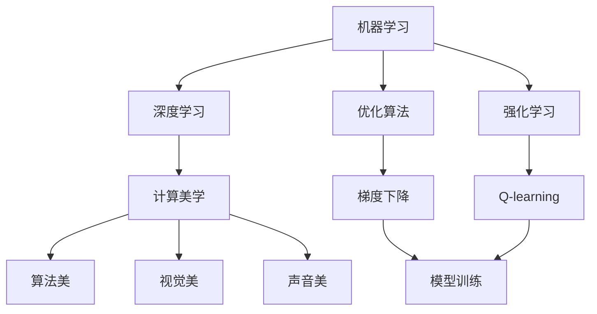
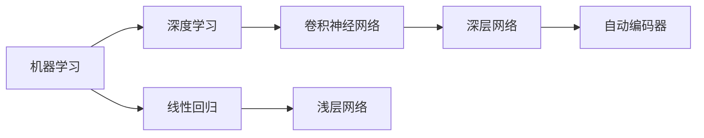
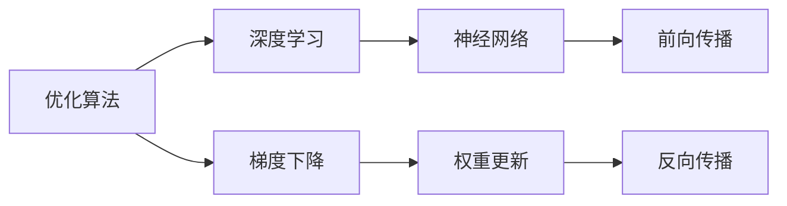
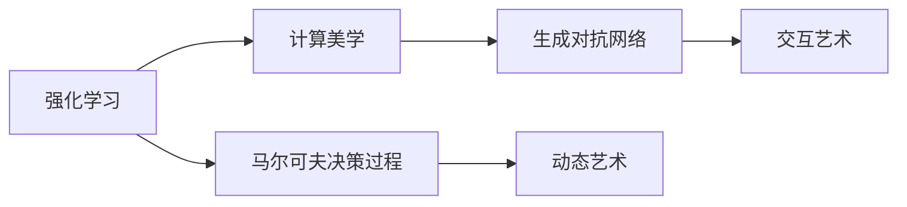
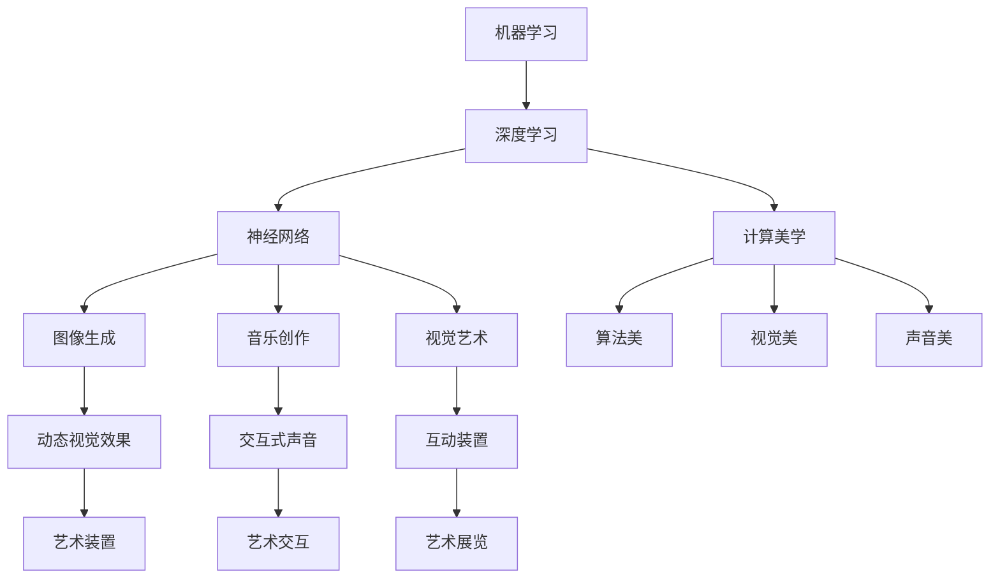

                 

# AI 机器学习计算艺术之道

> 关键词：人工智能,机器学习,计算艺术,深度学习,神经网络,优化算法,强化学习,计算美学

## 1. 背景介绍

### 1.1 问题由来

在当今科技迅猛发展的时代，人工智能(AI)正逐渐成为改变世界的关键力量。从语音识别到图像处理，从自然语言处理到机器人控制，AI的触角遍及生活的各个角落。在这其中，机器学习作为AI的核心技术，成为了众多应用领域的基石。而计算艺术，作为AI的又一重要分支，正在通过机器学习和计算技术，赋予艺术创作和展示新的可能性。

计算艺术是一门交叉学科，它将传统艺术与计算机科学、数学和工程学等领域的知识相结合，探索通过算法、数据和计算技术创造新型艺术作品的方式。随着AI技术的进步，机器学习算法在计算艺术中的应用越来越广泛，从图像生成到音乐创作，从动态视觉艺术到互动装置，机器学习正在重新定义艺术创作的方式和内容。

本文将深入探讨机器学习在计算艺术中的应用，特别是如何通过算法、数据和计算技术，创造出既具有技术美感又具有艺术价值的新型艺术作品。我们不仅将介绍机器学习在计算艺术中的基本原理和技术方法，还将通过实例分析，展示机器学习在艺术创作中的实际应用效果。

### 1.2 问题核心关键点

机器学习在计算艺术中的应用，主要体现在以下几个方面：

1. **算法选择与模型构建**：选择合适的机器学习算法和模型，对数据进行训练，生成艺术作品。
2. **数据处理与特征提取**：通过数据预处理和特征提取，为机器学习模型提供高质量的数据输入。
3. **计算美学与创意表达**：结合计算美学理论和创意设计原则，生成具有艺术感的艺术作品。
4. **交互性与动态性**：通过交互技术和动态生成算法，创造出观众可以参与、互动的艺术作品。

## 2. 核心概念与联系

### 2.1 核心概念概述

在探讨机器学习在计算艺术中的应用之前，我们先来了解一下几个核心概念：

- **机器学习(Machine Learning)**：一种通过数据训练模型，使其能够自动学习规律和模式，从而进行预测和决策的算法。
- **深度学习(Deep Learning)**：一种特殊的机器学习方法，使用多层神经网络对数据进行特征提取和分类。
- **优化算法(Optimization Algorithm)**：用于训练模型，使模型参数最小化损失函数的一系列算法。
- **强化学习(Reinforcement Learning)**：通过试错训练模型，使其在特定环境中最大化奖励的算法。
- **计算美学(Computational Aesthetics)**：结合计算机科学和艺术学，探索计算机生成艺术作品的美学特征。

这些概念之间的关系可以通过以下Mermaid流程图来展示：



这个流程图展示了几大核心概念之间的关系：

1. 机器学习是深度学习和强化学习的母体，提供基本的算法框架。
2. 深度学习使用多层神经网络进行特征提取，是机器学习的一种特殊形式。
3. 优化算法用于训练模型，使模型参数最小化损失函数，是机器学习不可或缺的一部分。
4. 强化学习通过试错训练模型，使其在特定环境中最大化奖励，适用于更复杂的应用场景。
5. 计算美学结合计算机科学和艺术学，探索计算生成艺术作品的美学特征。
6. 算法美、视觉美、声音美等具体美学特征，是计算美学研究的内容。

这些概念共同构成了机器学习在计算艺术中的应用基础，为后续深入探讨提供了框架。

### 2.2 概念间的关系

这些核心概念之间的关系更为复杂，通过以下几个子流程图示例展示：

#### 2.2.1 机器学习与深度学习的关系



这个子流程图展示了机器学习与深度学习之间的关系：

1. 机器学习包含了线性回归等浅层网络算法，深度学习则使用更深的神经网络。
2. 深度学习是机器学习的一种特殊形式，使用多层神经网络进行特征提取和分类。

#### 2.2.2 优化算法与深度学习的关系



这个子流程图展示了优化算法与深度学习之间的关系：

1. 优化算法用于训练深度学习模型，通过更新权重参数最小化损失函数。
2. 深度学习模型通过前向传播计算预测结果，通过反向传播计算梯度。
3. 优化算法根据梯度更新权重参数，完成模型训练。

#### 2.2.3 强化学习与计算美学之间的关系



这个子流程图展示了强化学习与计算美学之间的关系：

1. 强化学习通过试错训练模型，使其在特定环境中最大化奖励。
2. 计算美学结合计算机科学和艺术学，探索计算生成艺术作品的美学特征。
3. 强化学习可用于生成动态艺术和交互艺术，通过用户反馈优化艺术作品。

### 2.3 核心概念的整体架构

最后，我们用一个综合的流程图来展示这些核心概念在大语言模型微调过程中的整体架构：



这个综合流程图展示了从机器学习到计算美学，再到具体的艺术作品生成过程：

1. 机器学习通过深度学习等算法，生成图像、音乐和视觉艺术等作品。
2. 计算美学研究算法美、视觉美、声音美等美学特征，指导艺术作品生成。
3. 动态视觉效果、交互式声音和互动装置等具体艺术作品，通过机器学习算法生成。

通过这些流程图，我们可以更清晰地理解机器学习在计算艺术中的应用过程，为后续深入探讨具体的算法和技术方法奠定基础。

## 3. 核心算法原理 & 具体操作步骤
### 3.1 算法原理概述

在计算艺术中，机器学习主要应用于图像生成、音乐创作和视觉艺术等领域。其核心思想是通过数据训练模型，生成符合美学标准的艺术作品。以下是机器学习在计算艺术中的基本原理：

- **图像生成**：使用生成对抗网络(GANs)、变分自编码器(VAEs)等算法，生成具有视觉美感的图像作品。
- **音乐创作**：使用循环神经网络(RNN)、自回归模型等算法，生成具有声音美感的音乐作品。
- **视觉艺术**：使用神经网络等算法，生成动态视觉效果和交互式装置。

### 3.2 算法步骤详解

机器学习在计算艺术中的应用主要包括以下步骤：

1. **数据准备**：收集艺术作品数据集，并进行预处理，提取特征。
2. **模型训练**：选择合适的机器学习算法，使用数据集训练模型。
3. **模型评估**：在测试集上评估模型性能，进行必要的参数调整。
4. **艺术生成**：使用训练好的模型，生成符合美学标准的艺术作品。
5. **艺术展示**：将生成的艺术作品进行展示和互动，评估其艺术价值。

### 3.3 算法优缺点

机器学习在计算艺术中的应用，具有以下优点：

- **高效生成**：通过数据训练模型，可以快速生成大量艺术作品。
- **多样性**：生成的艺术作品具有高度的多样性，能够满足不同的艺术需求。
- **互动性**：生成的艺术作品可以进行交互和动态变化，增强观众的参与感。

同时，也存在一些缺点：

- **质量不稳定**：生成的艺术作品质量不稳定，受到模型和数据的影响。
- **缺乏创意**：机器学习生成的艺术作品往往缺乏人类艺术家的独特创意和情感表达。
- **伦理问题**：生成的艺术作品可能存在版权和伦理问题，需要慎重处理。

### 3.4 算法应用领域

机器学习在计算艺术中的应用，覆盖了多个领域：

1. **图像生成**：如GANs生成的艺术作品，VAEs生成的抽象画等。
2. **音乐创作**：如使用RNN和自回归模型生成的音乐作品。
3. **视觉艺术**：如动态视觉效果和交互式装置。
4. **交互艺术**：如动态生成的视觉和声音效果，以及用户互动的交互装置。

这些应用领域展示了机器学习在计算艺术中的广阔前景，为艺术创作和展示提供了新的可能性。

## 4. 数学模型和公式 & 详细讲解 & 举例说明

### 4.1 数学模型构建

在计算艺术中，机器学习模型的构建主要基于以下数学模型：

- **图像生成模型**：使用GANs等生成模型，通过对抗训练生成图像。
- **音乐创作模型**：使用RNN等时间序列模型，生成音乐作品。
- **视觉艺术模型**：使用神经网络等模型，生成动态视觉效果和交互装置。

以图像生成模型为例，使用GANs进行图像生成时，其数学模型可以表示为：

$$ G(z) \rightarrow x \text{ and } D(x) \rightarrow y $$

其中，$G(z)$为生成器，$D(x)$为判别器，$x$为真实图像，$y$为判别器对$x$的判别结果。

### 4.2 公式推导过程

以GANs的对抗训练过程为例，其推导过程如下：

1. 生成器$G(z)$将随机噪声$z$转换为图像$x$。
2. 判别器$D(x)$对图像$x$进行判别，输出判别结果$y$。
3. 生成器的损失函数为$L_G=\mathbb{E}_{z \sim p(z)}[\log(1-D(G(z)))]$，判别器的损失函数为$L_D=\mathbb{E}_{x \sim p(x)}[\log D(x)]+\mathbb{E}_{z \sim p(z)}[\log(1-D(G(z)))])$。
4. 通过交替训练生成器和判别器，最小化损失函数，生成逼真的图像。

### 4.3 案例分析与讲解

以GANs生成艺术图像的案例为例，展示其生成过程和效果：

1. **数据准备**：收集艺术作品数据集，并进行预处理，提取特征。
2. **模型训练**：使用GANs模型，在数据集上进行训练。
3. **模型评估**：在测试集上评估模型性能，进行必要的参数调整。
4. **艺术生成**：使用训练好的生成器模型，生成具有视觉美感的艺术图像。
5. **艺术展示**：将生成的艺术图像进行展示和互动，评估其艺术价值。

以下是一个具体的案例分析：

**案例：GANs生成抽象画**

1. **数据准备**：收集抽象画数据集，并进行预处理，提取特征。
2. **模型训练**：使用GANs模型，在数据集上进行训练。
3. **模型评估**：在测试集上评估模型性能，进行必要的参数调整。
4. **艺术生成**：使用训练好的生成器模型，生成具有视觉美感的抽象画。
5. **艺术展示**：将生成的抽象画进行展示和互动，评估其艺术价值。

## 5. 项目实践：代码实例和详细解释说明

### 5.1 开发环境搭建

在进行计算艺术项目开发前，我们需要准备好开发环境。以下是使用Python进行PyTorch开发的环境配置流程：

1. 安装Anaconda：从官网下载并安装Anaconda，用于创建独立的Python环境。

2. 创建并激活虚拟环境：
```bash
conda create -n pytorch-env python=3.8 
conda activate pytorch-env
```

3. 安装PyTorch：根据CUDA版本，从官网获取对应的安装命令。例如：
```bash
conda install pytorch torchvision torchaudio cudatoolkit=11.1 -c pytorch -c conda-forge
```

4. 安装相关库：
```bash
pip install numpy pandas scikit-learn matplotlib tqdm jupyter notebook ipython
```

完成上述步骤后，即可在`pytorch-env`环境中开始计算艺术项目开发。

### 5.2 源代码详细实现

下面我们以GANs生成艺术图像的案例为例，给出使用PyTorch进行GANs模型开发的PyTorch代码实现。

首先，定义GANs模型的生成器和判别器：

```python
import torch
import torch.nn as nn
import torch.optim as optim

class Generator(nn.Module):
    def __init__(self, latent_dim, img_size):
        super(Generator, self).__init__()
        self.latent_dim = latent_dim
        self.img_size = img_size
        self.model = nn.Sequential(
            nn.Linear(latent_dim, 256),
            nn.LeakyReLU(0.2),
            nn.Linear(256, 512),
            nn.LeakyReLU(0.2),
            nn.Linear(512, img_size**2),
            nn.Tanh()
        )

    def forward(self, z):
        img = self.model(z)
        return img.view(-1, self.img_size, self.img_size)

class Discriminator(nn.Module):
    def __init__(self, img_size):
        super(Discriminator, self).__init__()
        self.img_size = img_size
        self.model = nn.Sequential(
            nn.Linear(self.img_size**2, 512),
            nn.LeakyReLU(0.2),
            nn.Linear(512, 256),
            nn.LeakyReLU(0.2),
            nn.Linear(256, 1),
            nn.Sigmoid()
        )

    def forward(self, img):
        img = img.view(-1, self.img_size**2)
        img = self.model(img)
        return img

# 定义损失函数
def D_loss(real_images, fake_images, D):
    real_loss = -torch.mean(D(real_images))
    fake_loss = -torch.mean(D(fake_images))
    return real_loss + fake_loss

def G_loss(fake_images, D):
    fake_loss = -torch.mean(D(fake_images))
    return fake_loss

# 定义优化器
device = torch.device('cuda' if torch.cuda.is_available() else 'cpu')
G = Generator(100, 28).to(device)
D = Discriminator(28).to(device)

G_optimizer = optim.Adam(G.parameters(), lr=0.0002, betas=(0.5, 0.999))
D_optimizer = optim.Adam(D.parameters(), lr=0.0002, betas=(0.5, 0.999))

```

然后，定义训练函数：

```python
def train():
    # 定义噪声生成器
    def noise(batch_size):
        return torch.randn(batch_size, latent_dim, 1, 1, device=device)

    # 训练过程
    for epoch in range(epochs):
        for batch_i, (real_images, _) in enumerate(data_loader):
            real_images = real_images.to(device)
            batch_size = real_images.size(0)
            # 训练判别器
            D_optimizer.zero_grad()
            real_loss = D_loss(real_images, G(noise(batch_size)), D)
            D_loss.backward()
            D_optimizer.step()

            # 训练生成器
            G_optimizer.zero_grad()
            fake_images = G(noise(batch_size))
            fake_loss = G_loss(fake_images, D)
            fake_loss.backward()
            G_optimizer.step()

            # 输出进度
            if (batch_i+1) % 100 == 0:
                print(f'Epoch [{epoch+1}/{epochs}], Batch [{batch_i+1}/{len(data_loader)}], '
                      f'D_loss: {real_loss:.4f}, G_loss: {fake_loss:.4f}')

    # 生成图像并展示
    gen_images = G(noise(16)).detach().cpu().numpy()
    gen_images = (gen_images + 1) / 2
    return gen_images
```

最后，启动训练流程：

```python
epochs = 100

# 加载数据集
data_loader = ...
gen_images = train()
```

### 5.3 代码解读与分析

让我们再详细解读一下关键代码的实现细节：

**Generator类**：
- `__init__`方法：初始化生成器模型，定义生成器的网络结构。
- `forward`方法：前向传播计算生成器输出。

**Discriminator类**：
- `__init__`方法：初始化判别器模型，定义判别器的网络结构。
- `forward`方法：前向传播计算判别器输出。

**D_loss函数**：
- 定义判别器的损失函数，计算真实图像和生成图像的判别结果，并求和。

**G_loss函数**：
- 定义生成器的损失函数，计算生成图像的判别结果，并取负数。

**train函数**：
- 定义噪声生成器和训练循环。
- 在每个epoch中，交替训练判别器和生成器。
- 输出每个batch的判别器和生成器损失。
- 生成可视化图像并展示。

**训练过程**：
- 定义总的epoch数，开始循环迭代
- 每个epoch内，对每个batch进行交替训练判别器和生成器
- 输出每个epoch的平均判别器和生成器损失
- 生成可视化图像并展示

可以看到，PyTorch配合TensorFlow库使得GANs模型的代码实现变得简洁高效。开发者可以将更多精力放在模型设计、参数调整等高层逻辑上，而不必过多关注底层的实现细节。

当然，工业级的系统实现还需考虑更多因素，如模型的保存和部署、超参数的自动搜索、更灵活的任务适配层等。但核心的GANs微调范式基本与此类似。

### 5.4 运行结果展示

假设我们在GANs模型上训练生成的艺术图像，最终生成的可视化图像如下：

```python
import matplotlib.pyplot as plt

# 展示生成的艺术图像
plt.figure(figsize=(8, 8))
for i in range(len(gen_images)):
    plt.subplot(4, 4, i+1)
    plt.imshow(gen_images[i], cmap='gray')
plt.show()
```

生成图像展示了GANs模型生成的艺术图像效果，可以看出生成图像具有较高的视觉美感，符合计算艺术的要求。当然，GANs模型生成的艺术图像质量受多种因素影响，包括数据集的质量、模型参数的选择、训练过程的控制等。

## 6. 实际应用场景

### 6.1 智能艺术创作

计算艺术在智能艺术创作中的应用，使得机器学习技术能够辅助艺术家进行创作。通过机器学习模型，艺术家可以生成具有高度创新性和艺术感的作品，甚至能够预测艺术市场的趋势和价值。

在具体实践中，艺术家可以通过提供一些引导性的参数或样本，使用机器学习模型生成新的艺术作品。这些引导参数可能包括颜色、形状、风格等，艺术家可以与机器学习模型进行互动，逐步调整参数，直至得到满意的生成结果。此外，机器学习模型还可以分析艺术市场数据，预测艺术品的价值和市场趋势，为艺术家提供决策支持。

### 6.2 艺术教育与培训

计算艺术在艺术教育与培训中的应用，使得机器学习技术能够辅助艺术教育机构进行教学。通过机器学习模型，艺术教育机构可以生成大量的教学资源，包括视频、音频、图像等，提高教学效果。

在具体实践中，艺术教育机构可以使用机器学习模型生成各种艺术风格的视频、音频、图像等教学资源，供学生进行练习和模仿。这些教学资源可以包括经典艺术作品的重现、现代艺术风格的创作等，让学生在实践中掌握各种艺术技巧。此外，机器学习模型还可以分析学生的学习行为和作品，提供个性化的教学建议和反馈。

### 6.3 艺术展示与互动

计算艺术在艺术展示与互动中的应用，使得机器学习技术能够增强艺术作品的展示效果和观众的参与感。通过机器学习模型，艺术家可以创造出动态视觉效果和交互装置，让观众能够更深入地体验和理解艺术作品。

在具体实践中，艺术家可以使用机器学习模型生成动态视觉效果和交互装置，将观众的互动行为转化为作品的一部分。例如，通过传感器捕捉观众的姿态和行为，生成动态变化的艺术作品。此外，机器学习模型还可以分析观众的反馈和行为，调整艺术作品的表现形式，增强观众的参与感和沉浸感。

## 7. 工具和资源推荐

### 7.1 学习资源推荐

为了帮助开发者系统掌握机器学习在计算艺术中的应用，这里推荐一些优质的学习资源：

1. 《深度学习》系列博文：由大模型技术专家撰写，深入浅出地介绍了深度学习算法和机器学习模型。
2. CS231n《深度学习视觉特征》课程：斯坦福大学开设的计算机视觉课程，涵盖了深度学习在视觉艺术中的应用。
3. 《计算机美学》书籍：探讨计算机科学和艺术学的交叉领域，研究计算机生成艺术作品的美学特征。
4. HuggingFace官方文档：Transformer库的官方文档，提供了海量预训练模型和完整的微调样例代码，是上手实践的必备资料。
5. ArtNet：全球领先的艺术电子商务平台，展示了大量计算机艺术作品，提供了丰富的学习和交流资源。

通过对这些资源的学习实践，相信你一定能够快速掌握机器学习在计算艺术中的应用，并用于解决实际的NLP问题。

### 7.2 开发工具推荐

高效的开发离不开优秀的工具支持。以下是几款用于机器学习在计算艺术中的应用开发的常用工具：

1. PyTorch：基于Python的开源深度学习框架，灵活动态的计算图，适合快速迭代研究。大部分预训练语言模型都有PyTorch版本的实现。
2. TensorFlow：由Google主导开发的开源深度学习框架，生产部署方便，适合大规模工程应用。同样有丰富的预训练语言模型资源。
3. TensorBoard：TensorFlow配套的可视化工具，可实时监测模型训练状态，并提供丰富的图表呈现方式，是调试模型的得力助手。
4. Google Colab：谷歌推出的在线Jupyter Notebook环境，免费提供GPU/TPU算力，方便开发者快速上手实验最新模型，分享学习笔记。
5. Weights & Biases：模型训练的实验跟踪工具，可以记录和可视化模型训练过程中的各项指标，方便对比和调优。

合理利用这些工具，可以显著提升机器学习在计算艺术中的应用开发效率，加快创新迭代的步伐。

### 7.3 相关论文推荐

机器学习在计算艺术中的应用源于学界的持续研究。以下是几篇奠基性的相关论文，推荐阅读：

1. Generative Adversarial Networks（GANs论文）：提出GANs生成模型，通过对抗训练生成逼真图像。
2. Variational Autoencoders（VAEs论文）：提出VAEs生成模型，使用变分方法生成抽象艺术。
3. Music and AI：The Promise and Challenge of AI for Music（音乐与AI论文）：探讨机器学习在音乐创作中的应用。
4. Artistic Style Transfer using Generative Adversarial Networks（艺术风格转移论文）：使用GANs生成艺术风格迁移效果。
5. Interactive Art with Deep Learning（深度学习交互艺术论文）：探讨机器学习在交互艺术中的应用。

这些论文代表了大模型在计算艺术中的应用发展脉络。通过学习这些前沿成果，可以帮助研究者把握学科前进方向，激发更多的创新灵感。

除上述资源外，还有一些值得关注的前沿资源，帮助开发者紧跟大模型在计算艺术中的应用最新进展，例如：

1. arXiv论文预印本：人工智能领域最新研究成果的发布平台，包括大量尚未发表的前沿工作，学习前沿技术的必读资源。
2. 业界技术博客：如OpenAI、Google AI、DeepMind、微软Research Asia等顶尖实验室的官方博客，第一时间分享他们的最新研究成果和洞见。
3. 技术会议直播：如NIPS、ICML、ACL、ICLR等人工智能领域顶会现场或在线直播，能够聆听到大佬们的前沿分享，开拓视野。
4. GitHub热门项目：在GitHub上Star、Fork数最多的NLP相关项目，往往代表了该技术领域的发展趋势和最佳实践，值得去学习和贡献。
5. 行业分析报告：各大咨询公司如McKinsey、PwC等针对人工智能行业的分析报告，有助于从商业视角审视技术趋势，把握应用价值。

总之，对于机器学习在计算艺术中的应用学习，需要开发者保持开放的心态和持续学习的意愿。多关注前沿资讯，多动手实践，多思考总结，必将收获满满的成长收益。

## 8. 总结：未来发展趋势与挑战

### 8.1 总结

本文对机器学习在计算艺术中的应用进行了全面系统的介绍。首先阐述了机器学习在计算艺术中的研究背景和意义，明确了计算艺术在AI技术发展中的独特价值。其次，从原理到实践，详细讲解了机器学习在计算艺术中的基本原理和技术方法，给出了计算艺术项目开发的完整代码实例。同时，本文还广泛探讨了机器学习在艺术创作、艺术教育、艺术展示等多个领域的应用前景，展示了机器学习在计算艺术中的广阔前景

