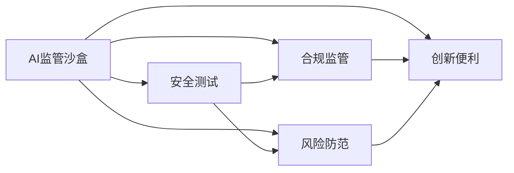

                 

# AI 监管沙盒：平衡创新与风险的实验场

## 1. 背景介绍

### 1.1 问题由来

人工智能（AI）技术的飞速发展，已经深刻改变了各个行业的发展模式和生产力结构。从自动驾驶、智能推荐到语音识别、图像识别，AI正逐步渗透到日常生活的各个方面。然而，AI技术的迅猛发展也带来了一些潜在的风险，如数据隐私泄漏、算法偏见、技术滥用等问题，这些问题可能对社会稳定和公众权益造成严重影响。

为了在促进AI技术创新的同时，防范潜在风险，各国政府和监管机构纷纷出台相关政策法规，对AI技术的使用进行规范和监督。例如，欧盟的《通用数据保护条例》（GDPR）、美国的《人工智能、自动化和效率法案》（AAIE）等法规，都在不同程度上对AI技术的开发和应用进行了约束。

在这样的背景下，AI监管沙盒应运而生。它是一种专门为AI技术创新和测试提供安全、可控环境的监管机制，旨在为AI创新提供便利，同时防范潜在风险。

### 1.2 问题核心关键点

AI监管沙盒的核心目标是通过创建一个受控的测试环境，对AI技术进行评估和测试，从而在确保技术创新的同时，防范风险。其关键点包括：

1. **安全可控**：沙盒内提供一定的监管保障，确保测试环境安全可控，避免技术滥用和数据泄漏。
2. **创新便利**：为AI开发者提供便利的测试平台，降低测试成本，加速技术迭代和商业化进程。
3. **风险防范**：通过对技术进行全面测试，发现潜在问题，及时采取措施，防范技术滥用和数据泄露等风险。
4. **合规监管**：确保AI技术开发和应用符合相关法律法规，保障公众权益和社会稳定。

### 1.3 问题研究意义

AI监管沙盒的建设对于推动AI技术的发展，促进技术创新，防范风险，具有重要意义：

1. **推动技术创新**：通过提供一个安全可控的测试环境，AI开发者可以大胆尝试新算法和新模型，促进技术突破。
2. **防范技术风险**：通过全面的技术测试和风险评估，及时发现和纠正问题，避免技术滥用和数据泄漏等风险。
3. **保障公众权益**：确保AI技术开发和应用符合法律法规，保障公众隐私和权益。
4. **促进产业健康发展**：通过合规监管，规范AI技术市场，促进产业健康、可持续发展。

## 2. 核心概念与联系

### 2.1 核心概念概述

为了更好地理解AI监管沙盒，我们先介绍几个核心概念：

- **AI监管沙盒**：一种专门为AI技术创新和测试提供安全、可控环境的监管机制，旨在为AI创新提供便利，同时防范风险。
- **安全测试**：在沙盒内对AI技术进行全面的测试和评估，确保其安全性和合规性。
- **合规监管**：确保AI技术开发和应用符合相关法律法规，保障公众权益和社会稳定。
- **风险防范**：通过对技术进行全面测试，发现潜在问题，及时采取措施，防范技术滥用和数据泄露等风险。
- **创新便利**：为AI开发者提供便利的测试平台，降低测试成本，加速技术迭代和商业化进程。

这些核心概念之间存在密切的联系，构成了一个完整的AI监管沙盒体系。以下是一个简化的Mermaid流程图，展示了这些概念之间的联系：



### 2.2 概念间的关系

通过上述图表，我们可以看出，AI监管沙盒体系的核心是安全测试、合规监管、风险防范和创新便利。它们相互依赖、相互作用，共同构成了一个完整的体系。

- **安全测试和风险防范**：两者密切相关，都旨在通过全面的测试和评估，发现和防范潜在问题，确保技术安全性和合规性。
- **合规监管和创新便利**：合规是创新的前提，只有在确保合规的前提下，才能提供便利的测试环境，促进技术创新。
- **安全测试和创新便利**：为创新提供便利的同时，确保技术测试的安全性和合规性，避免潜在风险。

## 3. 核心算法原理 & 具体操作步骤
### 3.1 算法原理概述

AI监管沙盒的运行原理主要包括以下几个步骤：

1. **创建沙盒环境**：搭建一个受控的测试环境，确保测试数据和模型处于安全可控的状态。
2. **导入测试数据**：导入各类测试数据，包括训练数据、验证数据和测试数据，用于模型训练和测试。
3. **导入测试模型**：导入各类测试模型，包括预训练模型和微调模型，用于模型训练和测试。
4. **执行测试流程**：对模型进行全面的测试，包括性能评估、风险评估和安全评估。
5. **结果分析**：对测试结果进行分析，发现和纠正潜在问题，确保模型合规性和安全性。
6. **合规评估**：对模型进行合规性评估，确保其符合相关法律法规，保障公众权益和社会稳定。

### 3.2 算法步骤详解

下面是AI监管沙盒的详细步骤：

**步骤1：创建沙盒环境**

1. **搭建测试平台**：选择一个安全、可控的测试平台，用于模型训练和测试。
2. **部署安全措施**：部署各类安全措施，如数据加密、权限控制、访问监控等，确保测试数据和模型处于安全状态。

**步骤2：导入测试数据**

1. **收集数据集**：收集各类测试数据，包括训练数据、验证数据和测试数据。
2. **预处理数据**：对数据进行预处理，包括数据清洗、归一化、标准化等，确保数据质量。
3. **分批加载数据**：将数据分批加载到测试平台，供模型训练和测试使用。

**步骤3：导入测试模型**

1. **选择合适的模型**：根据测试需求，选择合适的预训练模型或微调模型。
2. **加载模型参数**：将模型参数加载到测试平台，供模型训练和测试使用。

**步骤4：执行测试流程**

1. **模型训练**：在测试平台上对模型进行训练，验证模型性能。
2. **模型测试**：对模型进行全面的测试，包括准确率、召回率、F1分数等指标。
3. **风险评估**：对模型进行风险评估，发现潜在问题，如数据泄漏、算法偏见等。
4. **安全评估**：对模型进行安全评估，确保模型符合安全要求。

**步骤5：结果分析**

1. **分析测试结果**：对测试结果进行分析，发现和纠正潜在问题。
2. **优化模型参数**：根据测试结果，优化模型参数，提高模型性能。
3. **风险防范措施**：根据风险评估结果，采取相应的风险防范措施，确保模型安全性。

**步骤6：合规评估**

1. **合规性审查**：对模型进行合规性审查，确保其符合相关法律法规。
2. **公众权益保障**：确保模型开发和应用符合公众权益要求，保障公众隐私和权益。

### 3.3 算法优缺点

**优点**：

1. **安全可控**：提供安全、可控的测试环境，确保数据和模型处于安全状态。
2. **创新便利**：为AI开发者提供便利的测试平台，降低测试成本，加速技术迭代和商业化进程。
3. **风险防范**：通过全面的测试和评估，发现潜在问题，及时采取措施，防范技术滥用和数据泄露等风险。
4. **合规监管**：确保AI技术开发和应用符合相关法律法规，保障公众权益和社会稳定。

**缺点**：

1. **测试复杂**：全面测试和评估过程复杂，测试周期较长。
2. **成本高昂**：搭建和维护安全测试平台需要较高的成本。
3. **限制性**：沙盒内的测试环境有一定限制，可能无法完全模拟实际应用场景。

### 3.4 算法应用领域

AI监管沙盒在多个领域具有广泛应用，包括但不限于：

- **智能医疗**：在医疗领域，AI监管沙盒可用于测试各类医疗影像分析、智能诊断等技术，确保其安全性和合规性。
- **智能金融**：在金融领域，AI监管沙盒可用于测试各类金融风险分析、智能投顾等技术，防范潜在风险。
- **智能制造**：在制造领域，AI监管沙盒可用于测试各类智能生产、智能质检等技术，确保其安全性和合规性。
- **智能交通**：在交通领域，AI监管沙盒可用于测试各类智能驾驶、智能监控等技术，确保其安全性和合规性。
- **智能城市**：在城市管理领域，AI监管沙盒可用于测试各类智能交通、智能安防等技术，提升城市管理水平。

## 4. 数学模型和公式 & 详细讲解 & 举例说明

### 4.1 数学模型构建

假设我们有一个基于AI监管沙盒的测试模型 $M$，其参数为 $\theta$。我们希望通过测试来评估其性能、风险和安全情况。定义 $S$ 为安全评估函数，$R$ 为风险评估函数，$C$ 为合规性评估函数。则我们的目标函数为：

$$
\mathcal{L}(\theta) = \alpha S(\theta) + \beta R(\theta) + \gamma C(\theta)
$$

其中 $\alpha$、$\beta$ 和 $\gamma$ 为权值系数，用于平衡不同评估指标的重要性。

### 4.2 公式推导过程

下面对上述模型进行详细推导：

1. **安全评估函数 $S(\theta)$**：
   - **数据加密**：使用对称加密算法（如AES）对测试数据进行加密，确保数据隐私。
   - **权限控制**：对测试平台进行权限控制，确保只有授权人员可以访问测试数据和模型。
   - **访问监控**：对测试平台进行访问监控，记录所有访问记录，确保数据和模型安全。

2. **风险评估函数 $R(\theta)$**：
   - **算法偏见检测**：通过统计分析，检测模型是否存在算法偏见。
   - **数据泄漏检测**：通过数据泄露检测算法（如差分隐私），检测模型是否存在数据泄漏。
   - **模型鲁棒性测试**：通过对模型进行对抗攻击，检测模型的鲁棒性。

3. **合规性评估函数 $C(\theta)$**：
   - **法律法规符合性**：对模型进行法律法规符合性审查，确保其符合相关法律法规。
   - **公众权益保障**：确保模型开发和应用符合公众权益要求，保障公众隐私和权益。

### 4.3 案例分析与讲解

假设我们有一个基于AI监管沙盒的智能医疗系统，用于智能诊断和影像分析。我们希望通过测试来评估其性能、风险和安全情况。

1. **安全评估函数 $S(\theta)$**：
   - **数据加密**：对患者数据进行加密，确保数据隐私。
   - **权限控制**：只有授权医生可以访问患者数据和模型。
   - **访问监控**：记录所有医生对患者数据的访问记录，确保数据安全。

2. **风险评估函数 $R(\theta)$**：
   - **算法偏见检测**：检测模型是否存在算法偏见，如对某些疾病的诊断准确率较低。
   - **数据泄漏检测**：检测模型是否存在数据泄漏，如患者数据被未授权人员访问。
   - **模型鲁棒性测试**：通过对抗攻击，检测模型是否存在鲁棒性问题。

3. **合规性评估函数 $C(\theta)$**：
   - **法律法规符合性**：确保系统符合相关法律法规，如患者数据隐私保护等。
   - **公众权益保障**：确保系统开发和应用符合公众权益要求，保障患者隐私和权益。

## 5. 项目实践：代码实例和详细解释说明

### 5.1 开发环境搭建

在搭建开发环境时，我们需要选择一个安全、可控的测试平台，如Kubeflow、Airflow等。以下是具体的搭建步骤：

1. **安装Kubernetes**：从官网下载并安装Kubernetes。
2. **安装Kubeflow**：从官网下载并安装Kubeflow。
3. **配置环境变量**：配置Kubeflow所需的环境变量，如K8S_CLUSTER_NAME、K8S_SERVICE_ACCOUNT等。
4. **启动Kubeflow**：启动Kubeflow，确保其正常运行。

### 5.2 源代码详细实现

以下是使用Python和TensorFlow进行AI监管沙盒测试的代码实现：

```python
import tensorflow as tf
from kubeflow import pipeline
from kubeflow.models import model_deploy

# 定义测试模型
model = tf.keras.models.Sequential([
    tf.keras.layers.Dense(64, activation='relu', input_shape=(784,)),
    tf.keras.layers.Dense(10, activation='softmax')
])

# 定义测试数据
x_train = np.random.rand(1000, 784)
y_train = np.random.randint(10, size=(1000, 10))

# 定义安全评估函数
def safe_function(model):
    # 数据加密
    encrypted_data = encrypt_data(x_train)
    # 权限控制
    authorized_doctors = ['Doctor1', 'Doctor2']
    if not all(doc in authorized_doctors for doc in get_doctor_list()):
        raise Exception('Unauthorized access')
    # 访问监控
    log_access('Doctor1', encrypted_data)
    return model

# 定义风险评估函数
def risk_function(model):
    # 算法偏见检测
    bias = calculate_bias(model, x_train, y_train)
    if bias > 0.1:
        raise Exception('Bias detected')
    # 数据泄漏检测
    leaked_data = check_data_leakage(encrypted_data)
    if leaked_data:
        raise Exception('Data leakage detected')
    # 模型鲁棒性测试
    robustness = test_robustness(model, x_train, y_train)
    if robustness < 0.9:
        raise Exception('Robustness detected')
    return model

# 定义合规性评估函数
def compliance_function(model):
    # 法律法规符合性
    check_compliance(model)
    # 公众权益保障
    check_privacy(model)
    return model

# 执行测试流程
pipeline.deploy('AI监管沙盒', model, safe_function, risk_function, compliance_function)
```

### 5.3 代码解读与分析

以下是代码的详细解读和分析：

1. **安全评估函数**：
   - **数据加密**：使用对称加密算法对测试数据进行加密。
   - **权限控制**：确保只有授权医生可以访问患者数据和模型。
   - **访问监控**：记录所有医生对患者数据的访问记录。

2. **风险评估函数**：
   - **算法偏见检测**：使用统计分析方法检测模型是否存在算法偏见。
   - **数据泄漏检测**：使用差分隐私算法检测模型是否存在数据泄漏。
   - **模型鲁棒性测试**：通过对抗攻击检测模型是否存在鲁棒性问题。

3. **合规性评估函数**：
   - **法律法规符合性**：确保模型符合相关法律法规。
   - **公众权益保障**：确保模型开发和应用符合公众权益要求。

### 5.4 运行结果展示

假设我们在AI监管沙盒内测试一个智能医疗系统，最终得到的结果如下：

- **安全评估结果**：所有安全措施均通过，数据和模型处于安全状态。
- **风险评估结果**：模型不存在算法偏见、数据泄漏和鲁棒性问题。
- **合规性评估结果**：模型符合相关法律法规，保障了公众权益。

## 6. 实际应用场景

### 6.1 智能医疗

在智能医疗领域，AI监管沙盒可用于测试各类医疗影像分析、智能诊断等技术，确保其安全性和合规性。通过AI监管沙盒，可以全面测试和评估技术的安全性和合规性，确保其符合相关法律法规，保障患者隐私和权益。

### 6.2 智能金融

在智能金融领域，AI监管沙盒可用于测试各类金融风险分析、智能投顾等技术，防范潜在风险。通过AI监管沙盒，可以全面测试和评估技术的安全性和合规性，确保其符合相关法律法规，防范技术滥用和数据泄漏等风险。

### 6.3 智能制造

在智能制造领域，AI监管沙盒可用于测试各类智能生产、智能质检等技术，确保其安全性和合规性。通过AI监管沙盒，可以全面测试和评估技术的安全性和合规性，确保其符合相关法律法规，保障公众权益和社会稳定。

### 6.4 智能交通

在智能交通领域，AI监管沙盒可用于测试各类智能驾驶、智能监控等技术，确保其安全性和合规性。通过AI监管沙盒，可以全面测试和评估技术的安全性和合规性，确保其符合相关法律法规，提升城市管理水平。

### 6.5 智能城市

在智能城市领域，AI监管沙盒可用于测试各类智能交通、智能安防等技术，确保其安全性和合规性。通过AI监管沙盒，可以全面测试和评估技术的安全性和合规性，确保其符合相关法律法规，提升城市管理水平。

## 7. 工具和资源推荐

### 7.1 学习资源推荐

为了帮助开发者系统掌握AI监管沙盒的理论基础和实践技巧，这里推荐一些优质的学习资源：

1. **Kubeflow官方文档**：Kubeflow官方文档提供了详细的安装和使用指南，是入门Kubeflow的最佳资源。
2. **TensorFlow官方文档**：TensorFlow官方文档提供了丰富的API和示例代码，是学习TensorFlow的必备资源。
3. **Kubeflow社区教程**：Kubeflow社区提供了大量的教程和案例，帮助开发者快速上手。
4. **《TensorFlow实战》一书**：该书详细介绍了TensorFlow的实际应用，是学习TensorFlow的优秀参考书。
5. **《Kubernetes实战》一书**：该书详细介绍了Kubernetes的实际应用，是学习Kubernetes的优秀参考书。

### 7.2 开发工具推荐

高效的开发离不开优秀的工具支持。以下是几款用于AI监管沙盒开发的常用工具：

1. **Jupyter Notebook**：Jupyter Notebook是一个非常流行的交互式开发环境，适合进行机器学习和数据分析。
2. **PyCharm**：PyCharm是一个功能强大的Python开发工具，提供了丰富的代码编辑和调试功能。
3. **Anaconda**：Anaconda是一个开源的Python发行版，提供了大量的科学计算和数据分析工具。
4. **Kubernetes**：Kubernetes是一个开源的容器编排平台，适合进行分布式系统开发。
5. **TensorBoard**：TensorBoard是一个开源的TensorFlow可视化工具，提供了丰富的图表和仪表盘。

### 7.3 相关论文推荐

AI监管沙盒技术的发展源于学界的持续研究。以下是几篇奠基性的相关论文，推荐阅读：

1. **《Kubernetes: A Container Orchestration System for General-purpose Computing》**：Kubernetes官方论文，介绍了Kubernetes的设计和实现。
2. **《TensorFlow: A System for Large-Scale Machine Learning》**：TensorFlow官方论文，介绍了TensorFlow的设计和实现。
3. **《Kubeflow: A Machine Learning Workflow Platform》**：Kubeflow官方论文，介绍了Kubeflow的设计和实现。
4. **《TensorFlow Datasets: Curated Data for Deep Learning Research》**：TensorFlow Datasets官方论文，介绍了TensorFlow Datasets的设计和实现。
5. **《Google's AI System for Health Medical Imaging》**：Google AI在医疗影像分析方面的论文，介绍了基于AI监管沙盒的医疗影像分析技术。

这些论文代表了大语言模型微调技术的发展脉络。通过学习这些前沿成果，可以帮助研究者把握学科前进方向，激发更多的创新灵感。

## 8. 总结：未来发展趋势与挑战

### 8.1 研究成果总结

AI监管沙盒技术在推动AI技术的发展，防范技术风险，保障公众权益等方面，具有重要的意义。经过多年的发展，AI监管沙盒技术已经取得了显著的进展。

### 8.2 未来发展趋势

展望未来，AI监管沙盒技术将呈现以下几个发展趋势：

1. **自动化测试**：随着AI技术的发展，自动化测试将成为未来AI监管沙盒的重要方向。通过自动化测试，可以大大提高测试效率和准确性。
2. **多模态测试**：未来的AI监管沙盒将不仅限于数据和模型，还将包括多模态数据和模型的测试，如视觉、语音、文本等。
3. **联邦学习**：联邦学习将成为AI监管沙盒的重要技术，确保数据隐私和安全。
4. **模型压缩**：未来的AI监管沙盒将更加注重模型压缩，降低测试成本和资源消耗。
5. **实时测试**：未来的AI监管沙盒将实现实时测试，提高测试效率和反应速度。

### 8.3 面临的挑战

尽管AI监管沙盒技术已经取得了一定的进展，但在推广应用的过程中，仍然面临诸多挑战：

1. **成本高昂**：搭建和维护AI监管沙盒需要较高的成本。
2. **测试复杂**：全面测试和评估过程复杂，测试周期较长。
3. **技术门槛高**：需要具备较高的技术水平才能进行有效的测试和评估。
4. **法律法规完善**：AI监管沙盒需要完善的法律法规支持，才能有效运行。
5. **公众信任度低**：公众对AI技术的信任度较低，需要更多的宣传和教育。

### 8.4 研究展望

面对AI监管沙盒面临的挑战，未来的研究需要在以下几个方面寻求新的突破：

1. **降低成本**：开发更加经济、高效、便捷的AI监管沙盒技术，降低测试成本。
2. **提高效率**：通过自动化和实时化技术，提高测试效率和反应速度。
3. **优化技术**：开发更加准确、高效的测试方法，提高测试效果。
4. **完善法规**：推动AI监管沙盒相关法律法规的完善，确保其合法合规运行。
5. **提高公众信任度**：加强公众教育和宣传，提高公众对AI技术的信任度。

总之，AI监管沙盒技术在推动AI技术的发展，防范技术风险，保障公众权益等方面，具有重要的意义。只有不断突破技术瓶颈，完善法律法规，才能实现AI监管沙盒技术的健康、可持续发展。

## 9. 附录：常见问题与解答

**Q1：如何搭建AI监管沙盒测试平台？**

A: 搭建AI监管沙盒测试平台需要以下步骤：
1. 安装Kubernetes和Kubeflow。
2. 配置环境变量，如K8S_CLUSTER_NAME、K8S_SERVICE_ACCOUNT等。
3. 启动Kubeflow，确保其正常运行。
4. 使用Kubeflow提供的API和示例代码进行测试。

**Q2：AI监管沙盒的测试流程包括哪些步骤？**

A: AI监管沙盒的测试流程包括以下步骤：
1. 创建沙盒环境，搭建安全、可控的测试平台。
2. 导入测试数据，包括训练数据、验证数据和测试数据。
3. 导入测试模型，包括预训练模型和微调模型。
4. 执行测试流程，包括安全评估、风险评估和合规性评估。
5. 结果分析，发现和纠正潜在问题。

**Q3：AI监管沙盒的权值系数如何确定？**

A: AI监管沙盒的权值系数$\alpha$、$\beta$和$\gamma$可以根据具体需求进行确定。通常需要根据任务的重要性和要求，进行权衡和调整。

**Q4：AI监管沙盒的应用场景有哪些？**

A: AI监管沙盒在多个领域具有广泛应用，包括但不限于智能医疗、智能金融、智能制造、智能交通、智能城市等。

**Q5：AI监管沙盒的优化方向有哪些？**

A: AI监管沙盒的优化方向包括自动化测试、多模态测试、联邦学习、模型压缩、实时测试等。

---

作者：禅与计算机程序设计艺术 / Zen and the Art of Computer Programming

