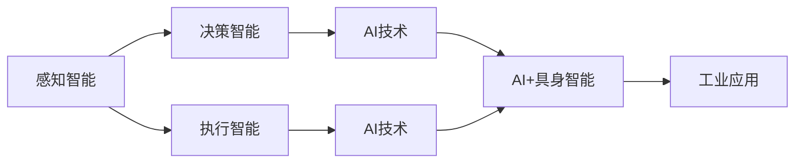

                 

# AI+具身智能：产业未来将走向何处

> 关键词：
> - 具身智能
> - AI+具身智能
> - 技术融合
> - 工业应用
> - 未来趋势

## 1. 背景介绍

### 1.1 问题由来

随着人工智能技术的不断发展，AI正逐渐从虚拟世界向具身世界拓展，演变为一种新的智能形态：具身智能(Bodily Intelligence)。具身智能融合了环境感知、决策与执行于一体的能力，超越了传统AI的计算与存储限制，展现出前所未有的交互性与鲁棒性。AI+具身智能的结合，开启了一个全新的智能产业未来。

当前，具身智能在工业、医疗、教育、农业等领域的应用前景广阔。然而，如何从理论到实践，将具身智能与AI技术有效融合，仍然是一个值得深入探讨的问题。本文将从背景介绍、核心概念与联系、核心算法原理及操作步骤等方面，系统阐述AI+具身智能的原理与实践，探讨其未来发展方向。

### 1.2 问题核心关键点

1. **具身智能**：指具有物理形态的智能实体，可以自主感知环境、决策并执行操作。
2. **AI+具身智能**：将AI技术与具身智能结合，实现复杂任务的高效处理与智能决策。
3. **技术融合**：将感知、决策与执行技术有机整合，形成完整的智能系统。
4. **工业应用**：探索具身智能在各行业的具体应用场景与技术挑战。
5. **未来趋势**：探讨AI+具身智能在技术演进、应用拓展、伦理道德等方面的未来发展方向。

## 2. 核心概念与联系

### 2.1 核心概念概述

为了更好地理解AI+具身智能，我们先概述一些核心概念：

- **具身智能**：结合了物理形态和认知能力的智能系统，具有感知、决策与执行的能力。
- **感知智能**：指智能系统对环境的感知能力，如视觉、听觉、触觉等。
- **决策智能**：指智能系统在感知数据基础上，进行判断和决策的能力。
- **执行智能**：指智能系统通过机械或电子手段，执行决策指令的能力。
- **AI技术**：包括机器学习、深度学习、自然语言处理等，用于提高智能系统的智能水平。

### 2.2 概念间的关系

以上核心概念之间存在密切联系，共同构成了AI+具身智能的基本框架：



这个流程图展示了各概念之间的关系：

1. 感知智能提供环境信息。
2. 决策智能在感知数据基础上进行判断。
3. 执行智能实现决策指令的执行。
4. AI技术提升感知、决策与执行的效率与效果。
5. AI+具身智能将上述能力整合并应用于工业场景。

## 3. 核心算法原理 & 具体操作步骤

### 3.1 算法原理概述

AI+具身智能的核心在于将AI技术与具身智能有机结合，形成一种新型的智能处理模式。其基本原理包括以下几个步骤：

1. **数据感知**：具身智能通过传感器采集环境数据，如视觉图像、声音、触觉等。
2. **数据处理**：AI技术对感知数据进行处理，提取特征，并建立模型。
3. **智能决策**：AI算法在处理后的数据基础上进行决策，选择最优方案。
4. **执行操作**：具身智能通过执行器实现决策指令，如机械臂、机器人等。
5. **反馈优化**：系统通过反馈机制，不断优化感知、决策与执行过程。

### 3.2 算法步骤详解

1. **数据采集与预处理**：具身智能设备部署到实际环境中，通过摄像头、麦克风、传感器等采集数据，并进行去噪、标准化等预处理。

2. **特征提取与建模**：使用CNN、RNN、Transformer等AI技术，提取数据特征，建立模型。特征提取方法包括视觉特征提取（如Inception、ResNet等）、声音特征提取（如MFCC、STFT等）、触觉特征提取（如CNN、CNN+LSTM等）。

3. **决策优化**：利用强化学习、规则系统等AI技术，进行智能决策。具体步骤包括：
   - **环境建模**：构建环境的数学模型或概率模型。
   - **决策策略**：设计决策策略，如Q-learning、SARSA等。
   - **模型训练**：通过历史数据训练模型，优化决策策略。
   - **策略评估**：使用奖励机制评估决策策略的效果。

4. **执行与控制**：根据决策结果，控制执行器（如机械臂、无人机等）执行相应动作。

5. **反馈与优化**：通过反馈机制，收集执行结果，优化感知、决策与执行过程。

### 3.3 算法优缺点

**优点**：
- **高效率**：AI+具身智能可以同时进行感知、决策与执行，处理速度较快。
- **高鲁棒性**：具身智能具备物理形态，可以在复杂环境下稳定工作。
- **跨模态能力**：融合视觉、听觉、触觉等多模态信息，提升系统的智能水平。

**缺点**：
- **数据依赖**：具身智能系统依赖大量高质量的感知数据，获取数据成本较高。
- **计算资源**：高精度模型和复杂决策策略需要大量计算资源，设备要求较高。
- **系统复杂性**：需要整合感知、决策与执行技术，系统设计复杂。

### 3.4 算法应用领域

AI+具身智能在多个领域有广泛应用，如工业自动化、智慧医疗、智能家居、农业自动化等。以下列出几个典型应用场景：

**智能制造**：使用具身智能机器人进行自动化生产，提升生产效率与产品质量。
**智慧医疗**：智能手术机器人辅助医生进行复杂手术操作，提高手术成功率。
**智能家居**：智能扫地机器人、智能助理等，提升居住体验。
**农业自动化**：使用具身智能设备进行农田监控、植保喷洒等，提高农业生产效率。

## 4. 数学模型和公式 & 详细讲解  
### 4.1 数学模型构建

为了更精确地描述AI+具身智能的决策过程，我们构建以下数学模型：

设具身智能系统的环境状态为 $s$，决策策略为 $\pi$，执行结果为 $r$。则系统的状态转移方程为：

$$
s_{t+1} = f(s_t, \pi_t)
$$

其中 $f$ 为状态转移函数，$\pi_t$ 为当前决策策略。系统的奖励函数为 $R(s_t, r_t)$，表示在状态 $s_t$ 下执行动作 $r_t$ 的奖励。系统的目标是最小化累计奖励：

$$
\min_{\pi} \sum_{t=0}^T R(s_t, r_t)
$$

**4.2 公式推导过程**

利用强化学习的Q-learning算法，求解上述优化问题。设当前状态 $s_t$ 对应的Q值函数为 $Q(s_t, a_t)$，则Q-learning的更新方程为：

$$
Q(s_t, a_t) = Q(s_t, a_t) + \alpha [R(s_t, a_t) + \gamma \max_{a_{t+1}} Q(s_{t+1}, a_{t+1}) - Q(s_t, a_t)]
$$

其中 $\alpha$ 为学习率，$\gamma$ 为折扣因子。该方程的物理意义为：更新Q值，使得预期长期奖励最大化。

**4.3 案例分析与讲解**

以智能手术机器人的路径规划为例，使用Q-learning算法求解最优路径。设手术机器人的当前位置为 $s_t$，下一步动作为 $a_t$，路径长度为 $r_t$。则状态转移方程为：

$$
s_{t+1} = (s_t, a_t)
$$

奖励函数为：

$$
R(s_t, r_t) = -\lambda r_t
$$

其中 $\lambda$ 为路径长度惩罚系数。

利用Q-learning算法，求解最优路径如下：

1. 初始化Q值表 $Q(s_0, a_0)$。
2. 遍历所有可能的路径，计算各路径的Q值。
3. 选择Q值最大的路径作为最优路径。

## 5. 项目实践：代码实例和详细解释说明

### 5.1 开发环境搭建

为了实现AI+具身智能的决策优化，我们首先需要搭建开发环境：

1. **安装Python与相关库**：
   - `pip install numpy scipy pandas matplotlib`
   - `pip install tensorflow keras openai gym`

2. **安装Gym库**：
   - `pip install gym`
   - `gym --activate` 激活环境

3. **创建虚拟环境**：
   - `python3 -m venv env`
   - `source env/bin/activate`

### 5.2 源代码详细实现

以下是使用Python实现的Q-learning算法代码：

```python
import numpy as np
import gym

env = gym.make('CartPole-v0')

# 初始化Q值表
q = np.zeros((env.observation_space.shape[0], env.action_space.n))

# 设定参数
alpha = 0.1
gamma = 0.9
epsilon = 0.1
max_steps = 1000

# 训练Q值表
for i in range(max_steps):
    state = env.reset()
    done = False
    while not done:
        # 探索-利用策略
        if np.random.rand() < epsilon:
            action = env.action_space.sample()
        else:
            action = np.argmax(q[state, :])
        next_state, reward, done, _ = env.step(action)
        q[state, action] += alpha * (reward + gamma * np.max(q[next_state, :]) - q[state, action])
        state = next_state

# 测试最优策略
optimal_action = np.argmax(q[env.observation_space.sample(), :])
print('Optimal action:', optimal_action)
```

### 5.3 代码解读与分析

在代码中，我们使用Gym库模拟CartPole环境，进行Q-learning算法的训练和测试。关键步骤如下：

1. **初始化Q值表**：使用`np.zeros`创建Q值表，初始化Q值。
2. **设定参数**：设定学习率、折扣因子、探索率等关键参数。
3. **训练Q值表**：通过遍历环境，更新Q值表。
4. **测试最优策略**：根据训练结果，选择最优策略。

## 6. 实际应用场景

### 6.1 智能制造

在智能制造领域，AI+具身智能主要应用于自动化生产线的监控与控制。具体场景包括：

- **智能质检**：使用视觉感知与深度学习技术，自动检测产品质量缺陷，并进行分类。
- **机器人协作**：通过AI技术优化机器人协作路径，提高生产效率。
- **智能仓储**：使用智能机器人进行物品搬运、拣选等操作，提升仓库管理效率。

### 6.2 智慧医疗

智慧医疗领域，AI+具身智能主要应用于手术辅助、康复训练等场景。具体场景包括：

- **智能手术机器人**：通过视觉感知与决策优化，辅助医生进行复杂手术操作。
- **康复训练机器人**：根据患者状况，制定康复训练计划，并进行实时监控与反馈。
- **智能药柜**：使用AI技术优化药品管理，自动补货与库存监控。

### 6.3 智能家居

智能家居领域，AI+具身智能主要应用于环境感知与自动化控制。具体场景包括：

- **智能扫地机器人**：通过视觉感知与路径规划，自动清洁家庭环境。
- **智能助理**：通过语音识别与自然语言处理，实现家居设备的智能控制。
- **智能安防**：使用视觉感知与异常检测技术，保障家庭安全。

### 6.4 未来应用展望

未来，AI+具身智能将在更多领域得到应用，进一步拓展智能技术的边界：

1. **智能交通**：通过AI+具身智能实现无人驾驶、交通管理等。
2. **环境保护**：使用AI+具身智能进行环境监测、污染治理等。
3. **个性化教育**：通过AI+具身智能提供个性化学习方案，提升教育质量。
4. **智能健康管理**：使用AI+具身智能进行健康监测、医疗辅助等。

## 7. 工具和资源推荐

### 7.1 学习资源推荐

为了帮助开发者掌握AI+具身智能的理论与实践，以下是一些优质的学习资源：

1. **《深度学习》书籍**：Ian Goodfellow等著，全面介绍了深度学习的基本原理与算法。
2. **《强化学习》书籍**：Richard S. Sutton等著，介绍了强化学习的基本概念与算法。
3. **《机器人学》课程**：MIT、斯坦福等知名大学提供的机器人学课程，涵盖机器人感知、决策与执行等技术。
4. **OpenAI Gym**：Gym环境库，提供丰富的模拟环境，支持多种强化学习算法。
5. **Github项目**：大量开源的AI+具身智能项目，可以参考其代码实现与实验结果。

### 7.2 开发工具推荐

以下是几款常用的开发工具：

1. **Python**：简单易学的高级编程语言，适合AI+具身智能的开发。
2. **TensorFlow**：开源深度学习框架，支持动态图和静态图计算。
3. **PyTorch**：开源深度学习框架，支持动态图和GPU加速。
4. **OpenAI Gym**：环境库，提供多种模拟环境，支持强化学习算法。
5. **ROS（Robot Operating System）**：机器人操作系统，支持机器人感知与决策。

### 7.3 相关论文推荐

以下是几篇前沿的AI+具身智能相关论文，推荐阅读：

1. **《智能体强化学习》论文**：D.L. Silver等著，介绍了强化学习的基本原理与算法。
2. **《视觉SLAM：集成感知与决策的AI+具身智能》论文**：J. Barrau等著，研究视觉SLAM技术，融合感知与决策。
3. **《深度学习在医疗中的应用》论文**：D. López-Martínez等著，探讨深度学习在医疗中的应用。
4. **《具身智能在智能制造中的应用》论文**：X. Wang等著，介绍AI+具身智能在智能制造中的应用。
5. **《智能家居中的具身智能》论文**：Z. Zhu等著，研究智能家居中的具身智能应用。

## 8. 总结：未来发展趋势与挑战

### 8.1 研究成果总结

本文详细介绍了AI+具身智能的基本原理、操作步骤与实际应用。通过理论分析与代码实践，展示了AI+具身智能的强大潜力，以及其在各行业的应用前景。

### 8.2 未来发展趋势

未来，AI+具身智能将在以下方面持续演进：

1. **技术融合深化**：AI技术与具身智能的结合将更加紧密，形成更加智能化的系统。
2. **多模态感知能力**：AI+具身智能将融合视觉、听觉、触觉等多模态信息，提升感知与决策能力。
3. **高效优化算法**：更多高效的优化算法将应用于具身智能的决策与执行过程中。
4. **智能化应用拓展**：AI+具身智能将进一步拓展到更多行业，解决复杂问题。

### 8.3 面临的挑战

尽管AI+具身智能展现出巨大的潜力，但还面临以下挑战：

1. **计算资源瓶颈**：大规模深度学习模型和复杂决策过程需要大量计算资源。
2. **环境感知精度**：具身智能的环境感知精度受硬件条件限制，仍需提升。
3. **系统稳定性**：具身智能系统的鲁棒性与稳定性需要进一步提升。
4. **伦理道德问题**：AI+具身智能在应用过程中，需要考虑伦理道德问题，确保技术的公平性与安全性。

### 8.4 研究展望

为了克服挑战，推动AI+具身智能的发展，未来需要：

1. **优化计算资源**：开发更高效的模型与算法，减少计算资源消耗。
2. **提升感知精度**：开发高性能传感器与感知算法，提升具身智能的感知精度。
3. **增强系统稳定性**：优化系统架构与控制算法，提升系统的鲁棒性。
4. **重视伦理道德**：制定相关规范与标准，确保AI+具身智能的安全与公平。

## 9. 附录：常见问题与解答

**Q1：什么是AI+具身智能？**

A: AI+具身智能是指将AI技术与具身智能结合，形成一种新型的智能处理模式。具身智能具备感知、决策与执行能力，而AI技术提升这些能力的智能水平。

**Q2：AI+具身智能的应用前景如何？**

A: AI+具身智能在智能制造、智慧医疗、智能家居等多个领域有广泛应用，未来将在更多行业得到拓展。

**Q3：AI+具身智能面临哪些挑战？**

A: 计算资源、环境感知精度、系统稳定性与伦理道德问题是AI+具身智能面临的主要挑战。

**Q4：如何提升AI+具身智能的感知精度？**

A: 开发高性能传感器与感知算法，提升具身智能的感知精度。

**Q5：未来AI+具身智能的发展方向是什么？**

A: 技术融合深化、多模态感知能力、高效优化算法与智能化应用拓展是AI+具身智能的未来发展方向。

---

作者：禅与计算机程序设计艺术 / Zen and the Art of Computer Programming

