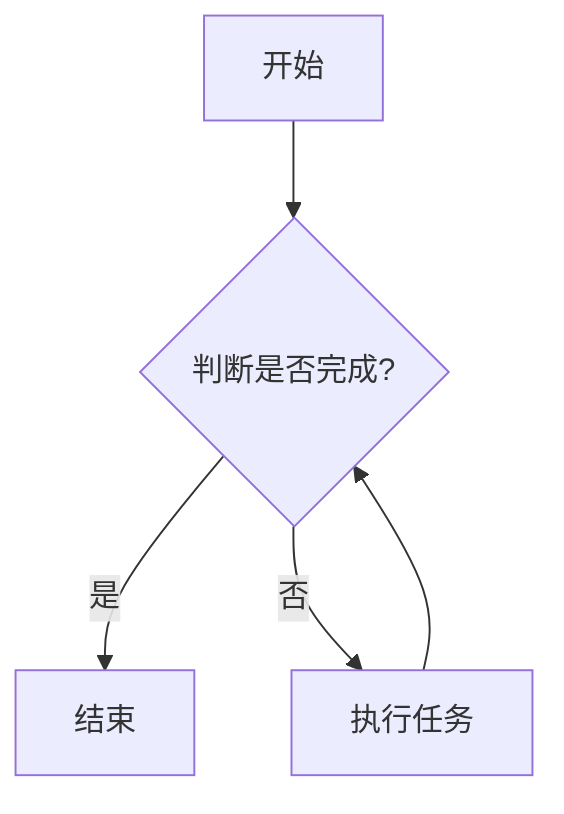

# 基于Python的智联招聘数据可视化分析

作者：禅与计算机程序设计艺术 / Zen and the Art of Computer Programming

## 1. 背景介绍
### 1.1 问题的由来

随着互联网的快速发展，招聘行业也逐渐从线下转向线上。智联招聘作为中国领先的招聘平台之一，积累了大量的招聘数据。这些数据包含了职位信息、公司信息、求职者信息等，对于分析行业趋势、优化招聘策略、预测就业市场等方面具有重要意义。

然而，面对海量数据，如何高效地进行分析和可视化展示，成为了招聘行业面临的一个挑战。本文将基于Python，利用数据可视化技术对智联招聘数据进行分析，探讨如何从数据中挖掘有价值的信息。

### 1.2 研究现状

目前，数据可视化技术在各个领域都有广泛的应用，例如商业分析、金融、医疗、教育等。Python作为一种功能强大的编程语言，在数据可视化领域也有着丰富的工具和库。常见的Python数据可视化库包括Matplotlib、Seaborn、Plotly等。

### 1.3 研究意义

通过对智联招聘数据的可视化分析，我们可以：

- 了解招聘市场的行业趋势和人才需求变化。
- 分析不同行业、地区、岗位的薪资水平、发展前景等。
- 发现求职者和企业的匹配度，优化招聘策略。
- 预测就业市场的发展趋势，为企业提供决策依据。

### 1.4 本文结构

本文将分为以下几个部分：

- 第2部分，介绍数据可视化相关的核心概念和Python工具。
- 第3部分，详细讲解智联招聘数据的获取和处理方法。
- 第4部分，展示如何利用Python进行数据可视化分析。
- 第5部分，探讨数据可视化在招聘行业中的应用场景。
- 第6部分，总结全文，展望数据可视化技术的未来发展趋势与挑战。

## 2. 核心概念与联系

### 2.1 数据可视化

数据可视化是指利用图形、图像等方式，将数据中的信息直观地呈现出来。它可以帮助我们快速理解数据，发现数据中的规律和趋势。

### 2.2 Python工具

Python在数据可视化领域有着丰富的工具和库，以下列举一些常用的Python数据可视化工具：

- Matplotlib：Python中最常用的数据可视化库，支持丰富的绘图函数和定制化选项。
- Seaborn：基于Matplotlib构建，提供更多高级绘图功能，能够生成更加美观的图表。
- Plotly：支持交互式图表，可以在线展示和分享图表。
- Pandas：Python的数据处理库，提供便捷的数据操作和清洗功能。
- NumPy：Python的数值计算库，提供高效的多维数组操作。

### 2.3 Mermaid流程图

Mermaid是一种基于文本的图表绘制工具，可以方便地创建流程图、时序图、状态图等。以下是一个Mermaid流程图的示例：



## 3. 核心算法原理 & 具体操作步骤
### 3.1 算法原理概述

数据可视化分析主要包括以下几个步骤：

1. 数据收集：从智联招聘平台或其他数据源获取招聘数据。
2. 数据清洗：去除无效、错误的数据，处理缺失值，确保数据质量。
3. 数据探索：对数据进行统计分析，了解数据的分布情况和特征。
4. 数据可视化：利用Python可视化工具，将数据转化为图表，直观展示数据特征。
5. 数据分析：根据可视化结果，分析数据中的规律和趋势，得出结论。

### 3.2 算法步骤详解

以下是对上述步骤的详细说明：

#### 步骤1：数据收集

智联招聘平台提供了API接口，可以方便地获取招聘数据。以下是一个使用Python调用API接口获取数据的示例：

```python
import requests

def get_job_data(keyword, page=1):
    url = f"https://www.zhaopin.com/api/v2/search?keyword={keyword}&page={page}"
    response = requests.get(url)
    return response.json()

# 示例：获取"Python"关键字的第一页数据
data = get_job_data("Python", 1)
```

#### 步骤2：数据清洗

数据清洗是数据可视化分析的重要环节，以下是一些常用的数据清洗方法：

- 删除无效数据：如职位描述为空、公司名称为空的记录。
- 处理缺失值：使用填充、删除等方法处理缺失值。
- 数据转换：将文本数据转换为数值型数据，方便进行统计分析。

#### 步骤3：数据探索

数据探索主要是通过统计分析了解数据的分布情况和特征。以下是一些常用的数据探索方法：

- 计算统计数据：如平均值、中位数、标准差等。
- 绘制直方图、箱线图等图表，直观展示数据的分布情况。
- 使用相关系数分析不同变量之间的关系。

#### 步骤4：数据可视化

使用Python可视化工具，将数据转化为图表，直观展示数据特征。以下是一个使用Matplotlib绘制直方图的示例：

```python
import matplotlib.pyplot as plt

# 示例：绘制薪资分布直方图
plt.hist(data["salary"], bins=50, alpha=0.5)
plt.xlabel("薪资")
plt.ylabel("频数")
plt.title("薪资分布")
plt.show()
```

#### 步骤5：数据分析

根据可视化结果，分析数据中的规律和趋势，得出结论。以下是一些常用的数据分析方法：

- 趋势分析：分析数据随时间的变化趋势。
- 相关性分析：分析不同变量之间的关系。
- 组合分析：分析不同变量组合对结果的影响。

## 4. 数学模型和公式 & 详细讲解 & 举例说明
### 4.1 数学模型构建

数据可视化分析中的数学模型主要包括：

- 描述性统计分析模型：如均值、方差、标准差等。
- 推断性统计分析模型：如t检验、方差分析等。
- 聚类分析模型：如K-means、层次聚类等。
- 关联规则挖掘模型：如Apriori算法等。

### 4.2 公式推导过程

以下是对一些常用公式的推导过程进行简要说明：

#### 4.2.1 均值

均值是描述性统计分析中最常用的指标，表示一组数据的平均水平。其公式为：

$$
\bar{x} = \frac{1}{n}\sum_{i=1}^{n}x_i
$$

其中，$x_i$ 表示第 $i$ 个数据点，$n$ 表示数据点的个数。

#### 4.2.2 方差

方差是描述性统计分析中衡量数据离散程度的指标。其公式为：

$$
s^2 = \frac{1}{n-1}\sum_{i=1}^{n}(x_i - \bar{x})^2
$$

其中，$\bar{x}$ 表示均值，$s^2$ 表示方差。

#### 4.2.3 t检验

t检验是一种假设检验方法，用于比较两个样本的均值是否存在显著差异。其公式为：

$$
t = \frac{\bar{x}_1 - \bar{x}_2}{\sqrt{\frac{s_1^2}{n_1} + \frac{s_2^2}{n_2}}}
$$

其中，$\bar{x}_1$ 和 $\bar{x}_2$ 分别表示两个样本的均值，$s_1^2$ 和 $s_2^2$ 分别表示两个样本的方差，$n_1$ 和 $n_2$ 分别表示两个样本的数据点个数。

### 4.3 案例分析与讲解

以下是一个使用Python进行数据分析的案例：

```python
import pandas as pd

# 加载数据
data = pd.read_csv("招聘数据.csv")

# 计算平均薪资
average_salary = data["salary"].mean()

# 绘制薪资分布直方图
plt.hist(data["salary"], bins=50, alpha=0.5)
plt.xlabel("薪资")
plt.ylabel("频数")
plt.title("薪资分布")
plt.show()
```

通过以上代码，我们可以得到智联招聘平台上某地区Python开发岗位的平均薪资和薪资分布情况。

### 4.4 常见问题解答

**Q1：如何处理缺失值？**

A：处理缺失值的方法有多种，以下是一些常用的方法：

- 删除缺失值：删除含有缺失值的记录。
- 填充缺失值：使用平均值、中位数、众数等方法填充缺失值。
- 随机插补：根据其他数据生成缺失值。

**Q2：如何进行相关性分析？**

A：进行相关性分析可以使用以下方法：

- 相关系数：计算两个变量之间的相关系数，如皮尔逊相关系数、斯皮尔曼等级相关系数等。
- 热力图：展示多个变量之间的相关性矩阵。

**Q3：如何进行聚类分析？**

A：进行聚类分析可以使用以下方法：

- K-means：将数据分为K个簇。
- 层次聚类：将数据分为多个簇，并构建聚类树。

## 5. 项目实践：代码实例和详细解释说明
### 5.1 开发环境搭建

在进行智联招聘数据可视化分析前，我们需要搭建以下开发环境：

1. 安装Python：从官网下载并安装Python。
2. 安装Pandas、Matplotlib、Seaborn等库：使用pip命令安装所需库。
3. 安装Jupyter Notebook：用于编写和运行Python代码。

### 5.2 源代码详细实现

以下是一个使用Python进行智联招聘数据可视化分析的示例代码：

```python
# 导入所需库
import pandas as pd
import matplotlib.pyplot as plt
import seaborn as sns

# 加载数据
data = pd.read_csv("招聘数据.csv")

# 数据预处理
# ...

# 数据探索
average_salary = data["salary"].mean()
print(f"平均薪资：{average_salary}元")

# 数据可视化
# 绘制薪资分布直方图
plt.hist(data["salary"], bins=50, alpha=0.5)
plt.xlabel("薪资")
plt.ylabel("频数")
plt.title("薪资分布")
plt.show()

# 绘制薪资分布箱线图
sns.boxplot(x=data["salary"])
plt.xlabel("薪资")
plt.show()

# ...

# 数据分析
# ...
```

### 5.3 代码解读与分析

以上代码展示了如何使用Python进行智联招聘数据可视化分析的基本流程。首先，使用Pandas库读取招聘数据，并进行数据预处理。然后，使用Matplotlib和Seaborn库绘制薪资分布直方图和箱线图，直观展示薪资分布情况。最后，根据可视化结果进行数据分析。

### 5.4 运行结果展示

运行以上代码后，可以得到如下可视化结果：

- 薪资分布直方图：展示不同薪资区间内岗位数量的分布情况。
- 薪资分布箱线图：展示薪资的分布范围、中位数、四分位数等信息。

通过这些可视化结果，我们可以直观地了解智联招聘平台上Python开发岗位的薪资水平。

## 6. 实际应用场景
### 6.1 招聘行业

数据可视化技术在招聘行业中有着广泛的应用，以下列举一些应用场景：

- 分析不同行业、地区、岗位的薪资水平、发展前景等，为企业提供决策依据。
- 分析不同学历、经验、技能要求的岗位分布情况，为企业招聘策略提供参考。
- 分析不同时间段的招聘趋势，预测就业市场的发展趋势。

### 6.2 行业分析

数据可视化技术在行业分析中也有着重要的应用，以下列举一些应用场景：

- 分析不同行业的发展趋势，预测行业前景。
- 分析不同地区的发展趋势，为企业选址提供参考。
- 分析不同企业的竞争力，为企业战略规划提供依据。

### 6.3 政府决策

数据可视化技术在政府决策中也有着重要的作用，以下列举一些应用场景：

- 分析就业市场的变化趋势，为制定就业政策提供依据。
- 分析人口流动趋势，为城市规划提供参考。
- 分析产业布局，为区域经济发展提供指导。

## 7. 工具和资源推荐
### 7.1 学习资源推荐

以下是一些学习数据可视化的资源推荐：

- 《数据可视化：设计思维与案例分析》
- 《Python数据分析与可视化实战》
- 《数据可视化最佳实践》
- 《Matplotlib官方文档》
- 《Seaborn官方文档》

### 7.2 开发工具推荐

以下是一些数据可视化开发工具推荐：

- Jupyter Notebook：用于编写和运行Python代码，支持多种编程语言。
- Tableau：商业智能和数据分析平台，提供丰富的可视化工具。
- Power BI：微软的数据可视化工具，支持多种数据源。
- D3.js：JavaScript库，用于创建高度交互式的数据可视化。

### 7.3 相关论文推荐

以下是一些数据可视化的相关论文推荐：

- "The Grammar of Graphics" by Leland Wilkinson
- "Visualization as a Communication Medium" by Edward Tufte
- "Data Visualization: A successful design process" by Robert Kosara

### 7.4 其他资源推荐

以下是一些其他数据可视化资源推荐：

- 数据可视化社区：http://www.datavizchina.com/
- 数据可视化博客：https://www.datavisor.com/
- 数据可视化案例库：https://www.datavizcatalog.com/

## 8. 总结：未来发展趋势与挑战
### 8.1 研究成果总结

本文介绍了数据可视化技术在智联招聘数据分析中的应用，探讨了如何利用Python进行数据可视化分析。通过分析智联招聘数据，我们可以了解招聘市场的行业趋势、人才需求变化等有价值的信息。

### 8.2 未来发展趋势

随着技术的不断发展，数据可视化技术将呈现以下发展趋势：

- 交互式可视化：用户可以通过交互式操作探索数据，发现更多有价值的信息。
- 个性化可视化：根据用户需求，提供定制化的可视化方案。
- 多模态可视化：将多种数据可视化技术融合，提供更加丰富的可视化体验。
- 智能化可视化：利用人工智能技术，自动分析数据并生成可视化图表。

### 8.3 面临的挑战

数据可视化技术在发展过程中也面临着一些挑战：

- 数据质量：数据质量是数据可视化分析的基础，需要保证数据的质量和准确性。
- 可视化设计：如何设计出美观、易读、易懂的可视化图表，是数据可视化技术的一个重要挑战。
- 可视化认知：如何帮助用户更好地理解数据可视化图表，是数据可视化技术需要解决的一个问题。

### 8.4 研究展望

未来，数据可视化技术将在以下几个方面取得突破：

- 开发更加高效、便捷的数据可视化工具，降低用户使用门槛。
- 提高数据可视化图表的视觉效果和用户体验。
- 将数据可视化与其他技术（如人工智能、大数据等）进行融合，拓展应用领域。

相信在不久的将来，数据可视化技术将为各行各业带来更多的价值，推动人类社会的发展。

## 9. 附录：常见问题与解答

**Q1：如何选择合适的可视化图表类型？**

A：选择合适的可视化图表类型取决于数据类型和分析目的。以下是一些常见的数据可视化图表类型及其适用场景：

- 条形图：用于比较不同类别或组的数据。
- 柱状图：用于比较不同类别或组的数据，与条形图类似。
- 饼图：用于表示整体中各部分所占比例。
- 折线图：用于展示数据随时间的变化趋势。
- 散点图：用于展示两个变量之间的关系。
- 箱线图：用于展示数据的分布情况，包括中位数、四分位数等。

**Q2：如何提高数据可视化图表的可读性？**

A：提高数据可视化图表的可读性可以从以下几个方面入手：

- 使用简洁明了的图表标题和标签。
- 选择合适的颜色和字体。
- 避免过多不必要的细节。
- 使用交互式操作，让用户可以自由探索数据。

**Q3：如何将数据可视化与其他技术（如人工智能、大数据等）进行融合？**

A：将数据可视化与其他技术融合可以采用以下方法：

- 使用人工智能技术对数据进行预处理和分析。
- 将可视化结果与大数据平台集成，实现实时数据展示。
- 利用人工智能技术生成个性化可视化图表。

总之，数据可视化技术在发展过程中需要与各种技术进行融合，以更好地满足用户需求，推动数据价值的最大化。