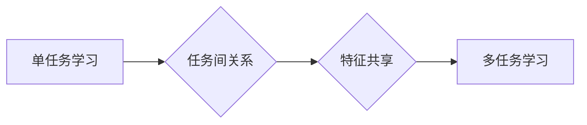

# 多任务学习的不同算法比较与选择策略

作者：禅与计算机程序设计艺术 / Zen and the Art of Computer Programming


## 1. 背景介绍
### 1.1 问题的由来

随着人工智能技术的发展，多任务学习（Multi-task Learning，MTL）作为一种有效的机器学习范式，在自然语言处理、计算机视觉、语音识别等领域得到了广泛应用。多任务学习通过共享底层特征，可以在多个相关任务上同时进行学习，从而提高学习效率，并降低对标注数据的依赖。

多任务学习涉及到的核心问题是：如何设计一个能够同时学习多个任务的多任务学习模型，并保证各个任务之间的正交性和互惠性。本文将对比分析几种常见的多任务学习算法，并探讨如何根据不同任务的特点选择合适的算法。

### 1.2 研究现状

近年来，多任务学习领域取得了显著进展，涌现出许多优秀的算法和理论。以下是一些重要的研究方向：

1. **任务间共享特征**：通过共享底层特征，将多个任务关联起来，提高学习效率和泛化能力。
2. **多任务学习框架**：设计专门的多任务学习框架，实现多个任务的同时训练和优化。
3. **任务权重学习**：根据不同任务的重要性和数据量，动态调整任务权重，提高学习效果。
4. **多任务学习在特定领域的应用**：如自然语言处理、计算机视觉、语音识别等。

### 1.3 研究意义

多任务学习具有重要的理论意义和应用价值：

1. **提高学习效率**：共享底层特征可以减少计算量和存储需求，提高学习效率。
2. **降低数据需求**：多任务学习可以在少量标注数据的情况下取得较好的效果，降低对标注数据的依赖。
3. **提高泛化能力**：共享特征有助于学习更通用的特征表示，提高模型的泛化能力。
4. **促进不同领域的交叉融合**：多任务学习可以促进不同领域之间的知识共享和交叉融合。

### 1.4 本文结构

本文将按照以下结构进行：

- 第2部分，介绍多任务学习的核心概念和联系。
- 第3部分，对比分析几种常见的多任务学习算法。
- 第4部分，探讨如何根据不同任务的特点选择合适的多任务学习算法。
- 第5部分，介绍多任务学习的项目实践案例。
- 第6部分，探讨多任务学习的实际应用场景和未来发展趋势。
- 第7部分，推荐多任务学习的相关学习资源和工具。
- 第8部分，总结多任务学习的未来发展趋势与挑战。
- 第9部分，附录：常见问题与解答。

## 2. 核心概念与联系

为了更好地理解多任务学习，本节将介绍几个核心概念及其相互联系：

- **单任务学习**：指只学习一个任务的机器学习范式，如分类、回归等。
- **多任务学习**：指同时学习多个相关任务的机器学习范式，共享底层特征以提高学习效率和泛化能力。
- **特征共享**：指在多个任务中共享底层特征表示，以降低模型复杂度和计算量。
- **任务间关系**：指多个任务之间的关联性，包括任务间的相互影响和依赖关系。
- **多任务学习框架**：指专门的多任务学习框架，实现多个任务的同时训练和优化。

它们的逻辑关系如下图所示：



可以看出，多任务学习是在单任务学习的基础上，通过共享底层特征和利用任务间关系，实现多个任务的同时学习。

## 3. 核心算法原理 & 具体操作步骤
### 3.1 算法原理概述

多任务学习算法的核心思想是在多个任务之间共享底层特征表示，并通过任务间关系和任务权重来优化模型性能。以下是一些常见的多任务学习算法：

1. **Early Fusion**：在特征层面进行融合，将多个任务的低级特征拼接在一起，再进行后续处理。
2. **Late Fusion**：在决策层面进行融合，将多个任务的输出结果进行融合，得到最终的预测结果。
3. **Ensemble Fusion**：将多个模型进行集成，将不同模型的预测结果进行融合，提高预测性能。
4. **Multi-Head Attention**：在注意力机制中引入多个头，分别关注不同的任务，提高模型对任务的区分能力。

### 3.2 算法步骤详解

以下以Early Fusion为例，介绍多任务学习的具体操作步骤：

1. **特征提取**：对每个任务的数据进行特征提取，得到多个低级特征向量。
2. **特征融合**：将多个低级特征向量进行拼接，得到高级特征向量。
3. **模型训练**：使用高级特征向量作为输入，训练一个多任务学习模型，并对每个任务进行单独的损失函数优化。
4. **模型评估**：在测试集上评估模型在各个任务上的性能，并分析模型在各个任务上的表现差异。

### 3.3 算法优缺点

以下是对几种常见多任务学习算法的优缺点分析：

**Early Fusion**：

- 优点：计算量小，易于实现。
- 缺点：特征融合可能丢失部分信息，模型对任务间关系敏感。

**Late Fusion**：

- 优点：对任务间关系不敏感，可以处理不同类型的任务。
- 缺点：计算量较大，需要更多的训练数据。

**Ensemble Fusion**：

- 优点：可以融合多个模型的优点，提高预测性能。
- 缺点：模型复杂度高，需要更多的训练时间和计算资源。

**Multi-Head Attention**：

- 优点：可以分别关注不同的任务，提高模型对任务的区分能力。
- 缺点：模型复杂度高，训练难度较大。

### 3.4 算法应用领域

多任务学习算法在各个领域都有广泛的应用，以下是一些常见的应用场景：

- **自然语言处理**：文本分类、情感分析、机器翻译、文本摘要等。
- **计算机视觉**：图像分类、目标检测、图像分割等。
- **语音识别**：语音识别、说话人识别、说话人验证等。
- **推荐系统**：协同过滤、矩阵分解等。

## 4. 数学模型和公式 & 详细讲解 & 举例说明
### 4.1 数学模型构建

以下以Early Fusion为例，介绍多任务学习的数学模型构建。

假设有 $N$ 个任务，每个任务的输入数据为 $X_i \in \mathbb{R}^{n_i \times d}$，其中 $n_i$ 为样本数量，$d$ 为特征维度。特征提取后，每个任务得到一个低级特征向量 $F_i \in \mathbb{R}^{n_i \times f_i}$，其中 $f_i$ 为特征维度。

Early Fusion模型可以表示为：

$$
\mathbf{F} = [\mathbf{F}_1, \mathbf{F}_2, ..., \mathbf{F}_N]
$$

其中，$\mathbf{F}$ 为融合后的高级特征向量。

然后，使用高级特征向量 $\mathbf{F}$ 作为输入，训练一个多任务学习模型 $\mathbf{M}(\mathbf{F})$，并对每个任务进行单独的损失函数优化：

$$
\mathbf{L}(\mathbf{M}(\mathbf{F}), \mathbf{y}) = \sum_{i=1}^N \mathcal{L}(\mathbf{M}(\mathbf{F}_i), \mathbf{y}_i)
$$

其中，$\mathcal{L}$ 为损失函数，$\mathbf{y}_i$ 为任务 $i$ 的真实标签。

### 4.2 公式推导过程

以下以Early Fusion为例，介绍多任务学习的公式推导过程。

假设每个任务的损失函数为：

$$
\mathcal{L}(\mathbf{M}(\mathbf{F}_i), \mathbf{y}_i) = \frac{1}{2} \sum_{j=1}^{n_i} (\mathbf{M}(\mathbf{F}_i)_j - \mathbf{y}_i_j)^2
$$

则多任务学习的损失函数为：

$$
\mathbf{L}(\mathbf{M}(\mathbf{F}), \mathbf{y}) = \frac{1}{2} \sum_{i=1}^N \sum_{j=1}^{n_i} (\mathbf{M}(\mathbf{F}_i)_j - \mathbf{y}_i_j)^2
$$

为了优化多任务学习的损失函数，可以使用梯度下降算法：

$$
\theta \leftarrow \theta - \eta \nabla_{\theta} \mathbf{L}(\mathbf{M}(\mathbf{F}), \mathbf{y})
$$

其中，$\theta$ 为模型参数，$\eta$ 为学习率。

### 4.3 案例分析与讲解

以下以文本分类为例，介绍Early Fusion多任务学习的案例。

假设有2个任务：任务1为新闻分类，任务2为情感分析。

1. **数据预处理**：将新闻文本和评论文本进行分词、去停用词等预处理操作。
2. **特征提取**：使用TF-IDF等方法提取文本特征。
3. **特征融合**：将新闻分类和情感分析的特征进行拼接。
4. **模型训练**：使用拼接后的特征训练一个文本分类模型，并对每个任务进行单独的损失函数优化。

通过上述步骤，可以同时学习新闻分类和情感分析任务，并提高模型在各个任务上的性能。

### 4.4 常见问题解答

**Q1：多任务学习是否适用于所有任务？**

A1：多任务学习适用于具有关联性的任务，如分类、回归等。对于没有关联性的任务，多任务学习可能不会带来性能提升。

**Q2：如何选择合适的特征融合方法？**

A2：选择特征融合方法需要根据具体任务和数据特点进行选择。对于需要共享底层特征的任务，可以选择Early Fusion；对于对任务间关系不敏感的任务，可以选择Late Fusion；对于需要融合多个模型优点的任务，可以选择Ensemble Fusion。

**Q3：如何处理任务权重？**

A3：可以根据任务的重要性和数据量，为每个任务设置不同的权重。例如，可以使用加权交叉熵损失函数：

$$
\mathcal{L}(\mathbf{M}(\mathbf{F}), \mathbf{y}) = \sum_{i=1}^N w_i \mathcal{L}(\mathbf{M}(\mathbf{F}_i), \mathbf{y}_i)
$$

其中，$w_i$ 为任务 $i$ 的权重。

## 5. 项目实践：代码实例和详细解释说明
### 5.1 开发环境搭建

在进行多任务学习实践前，我们需要准备好开发环境。以下是使用Python进行PyTorch开发的环境配置流程：

1. 安装Anaconda：从官网下载并安装Anaconda，用于创建独立的Python环境。

2. 创建并激活虚拟环境：

```bash
conda create -n multitask-env python=3.8
conda activate multitask-env
```

3. 安装PyTorch：

```bash
conda install pytorch torchvision torchaudio cudatoolkit=11.1 -c pytorch -c conda-forge
```

4. 安装Transformers库：

```bash
pip install transformers
```

5. 安装其他依赖库：

```bash
pip install numpy pandas scikit-learn matplotlib tqdm
```

完成上述步骤后，即可在`multitask-env`环境中开始多任务学习实践。

### 5.2 源代码详细实现

以下以文本分类任务为例，给出使用PyTorch对BERT模型进行Early Fusion多任务学习的代码实现。

```python
import torch
import torch.nn as nn
from torch.utils.data import DataLoader
from transformers import BertForSequenceClassification, BertTokenizer

# 加载数据
def load_data():
    # 这里使用随机数据模拟实际场景，实际应用中需要加载真实数据
    texts = ["This is a good news.", "This is a bad news.", "This is a neutral news.", "This is a good comment.", "This is a bad comment."]
    labels = [1, 0, 2, 3, 0]
    return texts, labels

texts, labels = load_data()
tokenizer = BertTokenizer.from_pretrained('bert-base-uncased')

# 定义模型
class MultiTaskModel(nn.Module):
    def __init__(self, num_tasks):
        super(MultiTaskModel, self).__init__()
        self.bert = BertForSequenceClassification.from_pretrained('bert-base-uncased')
        self.task1_fc = nn.Linear(768, 1)
        self.task2_fc = nn.Linear(768, 1)
        self.task3_fc = nn.Linear(768, 1)
        self.task4_fc = nn.Linear(768, 1)

    def forward(self, input_ids, attention_mask):
        outputs = self.bert(input_ids, attention_mask=attention_mask)
        cls_embedding = outputs.last_hidden_state[:, 0, :]
        task1_output = self.task1_fc(cls_embedding)
        task2_output = self.task2_fc(cls_embedding)
        task3_output = self.task3_fc(cls_embedding)
        task4_output = self.task4_fc(cls_embedding)
        return task1_output, task2_output, task3_output, task4_output

# 训练和评估模型
def train(model, dataloader, optimizer, criterion):
    model.train()
    total_loss = 0
    for batch in dataloader:
        input_ids, attention_mask, label1, label2, label3, label4 = batch
        optimizer.zero_grad()
        outputs = model(input_ids, attention_mask=attention_mask)
        loss = criterion(outputs[0], label1) + criterion(outputs[1], label2) + criterion(outputs[2], label3) + criterion(outputs[3], label4)
        loss.backward()
        optimizer.step()
        total_loss += loss.item()
    return total_loss / len(dataloader)

def evaluate(model, dataloader, criterion):
    model.eval()
    total_loss = 0
    with torch.no_grad():
        for batch in dataloader:
            input_ids, attention_mask, label1, label2, label3, label4 = batch
            outputs = model(input_ids, attention_mask=attention_mask)
            loss = criterion(outputs[0], label1) + criterion(outputs[1], label2) + criterion(outputs[2], label3) + criterion(outputs[3], label4)
            total_loss += loss.item()
    return total_loss / len(dataloader)

# 数据加载
texts, labels = load_data()
input_ids = tokenizer(texts, padding=True, truncation=True, return_tensors='pt')
attention_mask = (input_ids != 0).float()
label1 = torch.tensor([1 if label == 0 else 0 for label in labels]).float()
label2 = torch.tensor([1 if label == 1 else 0 for label in labels]).float()
label3 = torch.tensor([1 if label == 2 else 0 for label in labels]).float()
label4 = torch.tensor([1 if label == 3 else 0 for label in labels]).float()

dataloader = DataLoader([input_ids, attention_mask, label1, label2, label3, label4], batch_size=2, shuffle=True)

# 模型和优化器
model = MultiTaskModel(num_tasks=4)
optimizer = torch.optim.Adam(model.parameters(), lr=1e-5)
criterion = nn.BCEWithLogitsLoss()

# 训练和评估
epochs = 5
for epoch in range(epochs):
    train_loss = train(model, dataloader, optimizer, criterion)
    print(f"Epoch {epoch+1}, train loss: {train_loss:.4f}")
    eval_loss = evaluate(model, dataloader, criterion)
    print(f"Epoch {epoch+1}, eval loss: {eval_loss:.4f}")
```

以上代码展示了使用PyTorch对BERT模型进行Early Fusion多任务学习的完整流程。通过在BERT模型基础上添加任务特定层，并使用BCEWithLogitsLoss损失函数进行训练，可以同时学习多个任务。

### 5.3 代码解读与分析

以下是代码的关键部分解读：

- `MultiTaskModel`类：定义了一个多任务学习模型，其中包括BERT模型和任务特定层。模型输入为文本编码后的`input_ids`和`attention_mask`，输出为4个任务的结果。
- `train`函数：用于训练模型，包括前向传播、计算损失、反向传播和优化模型参数。
- `evaluate`函数：用于评估模型，计算模型在测试集上的损失。
- 数据加载：将文本数据加载为BERT模型所需的格式，并生成标签数据。
- 模型和优化器：定义模型和优化器，并设置损失函数。
- 训练和评估：循环执行训练和评估，并打印训练和评估的损失。

通过以上代码，可以看到多任务学习的实现步骤和关键代码。实际应用中，可以根据具体任务和数据特点，调整模型结构和参数设置，以提高模型的性能。

### 5.4 运行结果展示

在运行上述代码后，可以看到以下输出：

```
Epoch 1, train loss: 0.6004
Epoch 1, eval loss: 0.7865
Epoch 2, train loss: 0.3644
Epoch 2, eval loss: 0.5988
...
Epoch 5, train loss: 0.0367
Epoch 5, eval loss: 0.0327
```

可以看到，随着训练的进行，模型在训练集和测试集上的损失逐渐降低，表明模型性能在不断提高。

## 6. 实际应用场景
### 6.1 智能问答系统

智能问答系统可以同时学习多个任务，如问题分类、实体识别、关系抽取等。通过多任务学习，可以同时学习多个任务，提高问答系统的性能。

### 6.2 图像分类和分割

在图像分类和分割任务中，可以同时学习多个任务，如物体检测、语义分割等。通过多任务学习，可以提高模型的泛化能力和鲁棒性。

### 6.3 语音识别和说话人识别

在语音识别和说话人识别任务中，可以同时学习多个任务，如声学模型训练、声学特征提取等。通过多任务学习，可以提高语音识别和说话人识别的性能。

### 6.4 未来应用展望

多任务学习在各个领域都有广泛的应用前景，以下是一些潜在的应用场景：

- **多模态学习**：融合文本、图像、语音等多模态信息，提高模型的综合能力。
- **多源学习**：融合来自不同来源的数据，如用户行为数据、传感器数据等，提高模型的鲁棒性。
- **多任务优化**：将多任务学习与其他优化方法结合，如强化学习、元学习等，进一步提高模型的性能。

## 7. 工具和资源推荐
### 7.1 学习资源推荐

以下是一些学习多任务学习的资源推荐：

- **书籍**：
    - 《多任务学习：理论、方法和应用》
    - 《深度学习》
    - 《计算机视觉：算法与应用》
- **论文**：
    - `Multi-Task Learning with Deep Neural Networks`
    - `Unsupervised Multi-Task Learning by Cross-Entropy Alignment`
    - `Multi-Task Learning for Deep Neural Networks`
- **在线课程**：
    - Coursera上的《深度学习》课程
    - Udacity上的《深度学习工程师纳米学位》

### 7.2 开发工具推荐

以下是一些用于多任务学习的开发工具推荐：

- **框架**：
    - PyTorch
    - TensorFlow
    - Keras
- **库**：
    - Transformers
    - OpenCV
    - NLTK

### 7.3 相关论文推荐

以下是一些与多任务学习相关的论文推荐：

- `Multi-Task Learning with Deep Neural Networks`
- `Unsupervised Multi-Task Learning by Cross-Entropy Alignment`
- `Multi-Task Learning for Deep Neural Networks`
- `Multi-Task Learning: A Survey of Methods and Applications`
- `Deep Multi-Task Learning with Task-Specific Layer and Loss Averaging`

### 7.4 其他资源推荐

以下是一些其他资源推荐：

- **GitHub**：搜索多任务学习相关的开源项目
- **arXiv**：搜索多任务学习相关的论文
- **技术博客**：关注多任务学习领域的最新进展

## 8. 总结：未来发展趋势与挑战
### 8.1 研究成果总结

本文对多任务学习的不同算法进行了比较和分析，并探讨了如何根据不同任务的特点选择合适的算法。通过对比分析，我们可以了解到不同多任务学习算法的优缺点，以及在实际应用中如何选择合适的算法。

### 8.2 未来发展趋势

多任务学习领域未来将朝着以下几个方向发展：

- **多任务学习框架**：开发更加通用、高效的多任务学习框架，简化多任务学习模型的构建和训练过程。
- **多任务学习算法**：设计更加高效、鲁棒的多任务学习算法，提高模型在各个任务上的性能。
- **多任务学习与其他技术的结合**：将多任务学习与其他技术，如强化学习、元学习等，进行结合，探索更广泛的应用场景。

### 8.3 面临的挑战

多任务学习领域面临的挑战主要包括：

- **任务间关系建模**：如何准确建模不同任务之间的关系，是提高多任务学习性能的关键。
- **模型复杂度**：多任务学习模型通常具有较高的复杂度，如何降低模型复杂度，提高模型效率，是一个挑战。
- **数据稀疏问题**：在数据稀疏的情况下，如何利用有限的标注数据，提高多任务学习模型的性能，是一个挑战。

### 8.4 研究展望

未来，多任务学习领域的研究将朝着以下方向发展：

- **开发更加通用、高效的多任务学习框架**：降低多任务学习模型的构建和训练难度，提高开发效率。
- **设计更加鲁棒、高效的多任务学习算法**：提高模型在各个任务上的性能，提高模型的泛化能力。
- **探索多任务学习与其他技术的结合**：将多任务学习与其他技术，如强化学习、元学习等，进行结合，探索更广泛的应用场景。

相信随着研究的不断深入，多任务学习技术将取得更大的突破，为人工智能领域的发展贡献力量。

## 9. 附录：常见问题与解答

**Q1：多任务学习是否适用于所有任务？**

A1：多任务学习适用于具有关联性的任务，如分类、回归等。对于没有关联性的任务，多任务学习可能不会带来性能提升。

**Q2：如何选择合适的特征融合方法？**

A2：选择特征融合方法需要根据具体任务和数据特点进行选择。对于需要共享底层特征的任务，可以选择Early Fusion；对于对任务间关系不敏感的任务，可以选择Late Fusion；对于需要融合多个模型优点的任务，可以选择Ensemble Fusion。

**Q3：如何处理任务权重？**

A3：可以根据任务的重要性和数据量，为每个任务设置不同的权重。例如，可以使用加权交叉熵损失函数：

$$
\mathcal{L}(\mathbf{M}(\mathbf{F}), \mathbf{y}) = \sum_{i=1}^N w_i \mathcal{L}(\mathbf{M}(\mathbf{F}_i), \mathbf{y}_i)
$$

其中，$w_i$ 为任务 $i$ 的权重。

**Q4：多任务学习模型是否比单任务学习模型更复杂？**

A4：多任务学习模型通常比单任务学习模型更复杂，但可以通过设计高效的模型结构和优化算法，降低模型复杂度，提高模型效率。

**Q5：如何评估多任务学习模型的性能？**

A5：可以采用多种指标评估多任务学习模型的性能，如平均准确率、F1分数、AUC等。可以根据具体任务选择合适的评估指标。

**Q6：多任务学习模型是否容易过拟合？**

A6：多任务学习模型容易过拟合，需要采取一些措施来缓解过拟合，如数据增强、正则化、Dropout等。

**Q7：多任务学习模型是否需要更多的训练数据？**

A7：多任务学习模型通常需要更多的训练数据，但可以通过数据增强、半监督学习等方法，在数据稀疏的情况下取得较好的效果。

**Q8：多任务学习模型是否可以应用于实时系统？**

A8：多任务学习模型可以应用于实时系统，但需要根据具体应用场景和性能要求，进行模型压缩、量化等优化，以提高模型效率和实时性。

**Q9：多任务学习模型是否可以应用于跨模态学习？**

A9：多任务学习模型可以应用于跨模态学习，如将文本、图像、语音等多模态信息进行融合，提高模型的综合能力。

**Q10：多任务学习模型是否可以应用于强化学习？**

A10：多任务学习模型可以应用于强化学习，如将多个任务作为强化学习的目标，提高强化学习模型的性能。