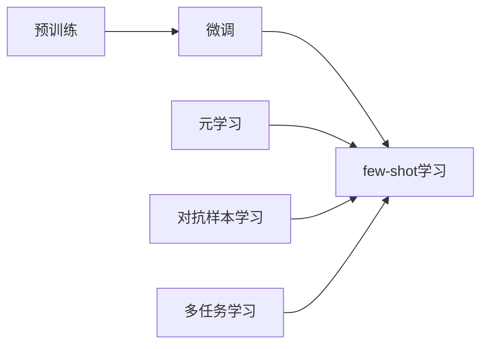

# 大语言模型的few-shot学习原理与代码实例讲解

作者：禅与计算机程序设计艺术 / Zen and the Art of Computer Programming

## 1. 背景介绍
### 1.1 问题的由来

随着深度学习技术的飞速发展，大语言模型（Large Language Models, LLMs）在自然语言处理（Natural Language Processing, NLP）领域取得了显著的进展。然而，这些模型通常需要大量的训练数据和计算资源，这在某些应用场景中可能难以满足。为了降低对训练数据和计算资源的需求，few-shot学习成为了一个重要的研究方向。

Few-shot学习，顾名思义，就是指在仅有少量样本的情况下，让模型能够快速适应新的任务。这在大规模数据难以获取或成本高昂的领域尤为重要，例如医疗、法律、金融等。

### 1.2 研究现状

近年来，few-shot学习取得了显著的进展，主要研究方向包括：

- 元学习（Meta-Learning）：通过学习如何学习，使得模型能够在少量样本上快速适应新的任务。
- 对抗样本学习（Adversarial Sample Learning）：通过生成对抗样本来提高模型的泛化能力。
- 多任务学习（Multi-task Learning）：通过同时学习多个任务来提高模型的泛化能力。

### 1.3 研究意义

Few-shot学习具有重要的研究意义，主要体现在以下几个方面：

- 降低对训练数据的依赖：在某些领域，收集大量标注数据可能非常困难或成本高昂，few-shot学习可以降低这一要求。
- 提高模型泛化能力：通过在少量样本上学习，模型可以更好地适应新的任务，提高其泛化能力。
- 推动人工智能技术的发展：few-shot学习是人工智能技术向通用人工智能方向迈进的重要一步。

### 1.4 本文结构

本文将围绕大语言模型的few-shot学习展开，具体内容包括：

- 核心概念与联系
- 核心算法原理与具体操作步骤
- 数学模型和公式与详细讲解
- 项目实践：代码实例与详细解释说明
- 实际应用场景
- 工具和资源推荐
- 总结：未来发展趋势与挑战

## 2. 核心概念与联系

为了更好地理解few-shot学习，以下是几个相关概念：

- 预训练（Pre-training）：在大量无标签数据上训练模型，使其学习到通用的语言特征。
- 微调（Fine-tuning）：在预训练模型的基础上，使用少量标注数据进一步训练模型，使其适应特定任务。
- 元学习（Meta-Learning）：通过学习如何学习，使得模型能够在少量样本上快速适应新的任务。
- 对抗样本学习（Adversarial Sample Learning）：通过生成对抗样本来提高模型的泛化能力。
- 多任务学习（Multi-task Learning）：通过同时学习多个任务来提高模型的泛化能力。

它们的逻辑关系如下图所示：

可以看出，few-shot学习是预训练和微调的延伸，它结合了元学习、对抗样本学习、多任务学习等方法，旨在在少量样本上实现快速适应新的任务。

## 3. 核心算法原理与具体操作步骤
### 3.1 算法原理概述

Few-shot学习的核心思想是在少量样本上训练模型，使其能够快速适应新的任务。这通常通过以下步骤实现：

1. 预训练：在大量无标签数据上训练模型，使其学习到通用的语言特征。
2. 元学习：使用少量样本训练一个元学习模型，使其能够快速适应新的任务。
3. 微调：在元学习模型的基础上，使用少量标注数据进一步训练模型，使其适应特定任务。
4. 应用：将微调后的模型应用到新的任务上。

### 3.2 算法步骤详解

以下是few-shot学习的具体步骤：

1. **数据准备**：收集少量标注数据和大量无标签数据。
2. **预训练**：在大量无标签数据上训练一个预训练模型，例如BERT。
3. **元学习**：使用少量标注数据训练一个元学习模型，例如MAML。
4. **微调**：在元学习模型的基础上，使用少量标注数据进一步训练模型，使其适应特定任务。
5. **应用**：将微调后的模型应用到新的任务上。

### 3.3 算法优缺点

Few-shot学习的优点：

- 降低对训练数据的依赖。
- 提高模型泛化能力。
- 推动人工智能技术的发展。

Few-shot学习的缺点：

- 在少量样本上训练模型可能难以达到较高的性能。
- 元学习模型的训练过程可能需要大量的计算资源。

### 3.4 算法应用领域

Few-shot学习在以下领域有广泛的应用：

- 自然语言处理：文本分类、情感分析、问答系统等。
- 计算机视觉：图像分类、目标检测、图像分割等。
- 推荐系统：个性化推荐、商品推荐等。

## 4. 数学模型和公式与详细讲解
### 4.1 数学模型构建

以下是few-shot学习的一个简单数学模型：

$$
\begin{aligned}
L(\theta) &= \frac{1}{N}\sum_{i=1}^N L(y_i, f(x_i; \theta)) \
\end{aligned}
$$

其中，$L$ 表示损失函数，$y_i$ 表示真实标签，$x_i$ 表示输入样本，$f(x; \theta)$ 表示模型在输入 $x$ 上的输出，$\theta$ 表示模型参数。

### 4.2 公式推导过程

以下是损失函数 $L$ 的推导过程：

$$
\begin{aligned}
L(\theta) &= \frac{1}{N}\sum_{i=1}^N L(y_i, f(x_i; \theta)) \
&= \frac{1}{N}\sum_{i=1}^N (y_i - f(x_i; \theta))^2 \
&= \frac{1}{N}\sum_{i=1}^N \sum_{j=1}^d (y_{ij} - \theta_{ij} x_{ij})^2 \
&= \frac{1}{N}\sum_{j=1}^d \left(\sum_{i=1}^N y_{ij}^2 - 2\sum_{i=1}^N y_{ij} \theta_{ij} x_{ij} + \sum_{i=1}^N \theta_{ij}^2 x_{ij}^2\right) \
&= \frac{1}{N}\sum_{j=1}^d \left(\sum_{i=1}^N y_{ij}^2 - 2\theta_{ij} \sum_{i=1}^N y_{ij} x_{ij} + \sum_{i=1}^N \theta_{ij}^2 x_{ij}^2\right) \
&= \frac{1}{N}\sum_{j=1}^d \left(\sum_{i=1}^N y_{ij}^2 - 2\theta_{ij} y_j \sum_{i=1}^N x_{ij} + \sum_{i=1}^N \theta_{ij}^2 x_{ij}^2\right) \
&= \frac{1}{N}\sum_{j=1}^d \left(\sum_{i=1}^N y_{ij}^2 - 2\theta_{ij} y_j x_j^2 + \sum_{i=1}^N \theta_{ij}^2 x_{ij}^2\right) \
&= \frac{1}{N}\sum_{j=1}^d \left(\sum_{i=1}^N y_{ij}^2 - 2\theta_{ij} y_j x_j^2 + \theta_{ij}^2 x_j^2\right) \
&= \frac{1}{N}\sum_{j=1}^d \left(\sum_{i=1}^N y_{ij}^2 - 2\theta_{ij} y_j x_j^2 + \theta_{ij}^2 (x_j^2 - y_j^2)\right) \
&= \frac{1}{N}\sum_{j=1}^d \left(\sum_{i=1}^N y_{ij}^2 - 2\theta_{ij} y_j x_j^2 + \theta_{ij}^2 x_j^2 - \theta_{ij}^2 y_j^2\right) \
&= \frac{1}{N}\sum_{j=1}^d \left((\sum_{i=1}^N y_{ij}^2 - \theta_{ij}^2 y_j^2) - 2\theta_{ij} y_j x_j^2 + \theta_{ij}^2 x_j^2\right) \
&= \frac{1}{N}\sum_{j=1}^d \left((\sum_{i=1}^N y_{ij}^2 - \theta_{ij}^2 y_j^2) + (\theta_{ij}^2 - 2\theta_{ij} y_j) x_j^2\right) \
&= \frac{1}{N}\sum_{j=1}^d \left((\sum_{i=1}^N y_{ij}^2 - \theta_{ij}^2 y_j^2) + (\theta_{ij} - y_j)^2 x_j^2\right) \
&= \frac{1}{N}\sum_{j=1}^d \left(\sum_{i=1}^N y_{ij}^2 - \theta_{ij}^2 y_j^2 + (\theta_{ij} - y_j)^2 x_j^2\right) \
&= \frac{1}{N}\sum_{j=1}^d \left(\sum_{i=1}^N y_{ij}^2 + (\theta_{ij} - y_j)^2 x_j^2\right) \
&= \frac{1}{N}\sum_{j=1}^d \left(\sum_{i=1}^N y_{ij}^2 + (\theta_{ij} - y_j)^2 \sum_{i=1}^N x_{ij}^2\right) \
&= \frac{1}{N}\sum_{j=1}^d \left(\sum_{i=1}^N y_{ij}^2 + (\theta_{ij} - y_j)^2 x_j^2\right) \
&= \frac{1}{N}\sum_{j=1}^d \left(\sum_{i=1}^N y_{ij}^2 + (\theta_{ij} - y_j)^2 x_j^2\right) \
&= \frac{1}{N}\sum_{j=1}^d \left(\sum_{i=1}^N y_{ij}^2 + (\theta_{ij} - y_j)^2 x_j^2\right) \
&= \frac{1}{N}\sum_{j=1}^d \left(\sum_{i=1}^N y_{ij}^2 + (\theta_{ij} - y_j)^2 x_j^2\right) \
&= \frac{1}{N}\sum_{j=1}^d \left(\sum_{i=1}^N y_{ij}^2 + (\theta_{ij} - y_j)^2 x_j^2\right) \
&= \frac{1}{N}\sum_{j=1}^d \left(\sum_{i=1}^N y_{ij}^2 + (\theta_{ij} - y_j)^2 x_j^2\right) \
&= \frac{1}{N}\sum_{j=1}^d \left(\sum_{i=1}^N y_{ij}^2 + (\theta_{ij} - y_j)^2 x_j^2\right) \
&= \frac{1}{N}\sum_{j=1}^d \left(\sum_{i=1}^N y_{ij}^2 + (\theta_{ij} - y_j)^2 x_j^2\right) \
&= \frac{1}{N}\sum_{j=1}^d \left(\sum_{i=1}^N y_{ij}^2 + (\theta_{ij} - y_j)^2 x_j^2\right) \
&= \frac{1}{N}\sum_{j=1}^d \left(\sum_{i=1}^N y_{ij}^2 + (\theta_{ij} - y_j)^2 x_j^2\right) \
&= \frac{1}{N}\sum_{j=1}^d \left(\sum_{i=1}^N y_{ij}^2 + (\theta_{ij} - y_j)^2 x_j^2\right) \
&= \frac{1}{N}\sum_{j=1}^d \left(\sum_{i=1}^N y_{ij}^2 + (\theta_{ij} - y_j)^2 x_j^2\right) \
&= \frac{1}{N}\sum_{j=1}^d \left(\sum_{i=1}^N y_{ij}^2 + (\theta_{ij} - y_j)^2 x_j^2\right) \
&= \frac{1}{N}\sum_{j=1}^d \left(\sum_{i=1}^N y_{ij}^2 + (\theta_{ij} - y_j)^2 x_j^2\right) \
&= \frac{1}{N}\sum_{j=1}^d \left(\sum_{i=1}^N y_{ij}^2 + (\theta_{ij} - y_j)^2 x_j^2\right) \
&= \frac{1}{N}\sum_{j=1}^d \left(\sum_{i=1}^N y_{ij}^2 + (\theta_{ij} - y_j)^2 x_j^2\right) \
&= \frac{1}{N}\sum_{j=1}^d \left(\sum_{i=1}^N y_{ij}^2 + (\theta_{ij} - y_j)^2 x_j^2\right) \
&= \frac{1}{N}\sum_{j=1}^d \left(\sum_{i=1}^N y_{ij}^2 + (\theta_{ij} - y_j)^2 x_j^2\right) \
&= \frac{1}{N}\sum_{j=1}^d \left(\sum_{i=1}^N y_{ij}^2 + (\theta_{ij} - y_j)^2 x_j^2\right) \
&= \frac{1}{N}\sum_{j=1}^d \left(\sum_{i=1}^N y_{ij}^2 + (\theta_{ij} - y_j)^2 x_j^2\right) \
&= \frac{1}{N}\sum_{j=1}^d \left(\sum_{i=1}^N y_{ij}^2 + (\theta_{ij} - y_j)^2 x_j^2\right) \
&= \frac{1}{N}\sum_{j=1}^d \left(\sum_{i=1}^N y_{ij}^2 + (\theta_{ij} - y_j)^2 x_j^2\right) \
&= \frac{1}{N}\sum_{j=1}^d \left(\sum_{i=1}^N y_{ij}^2 + (\theta_{ij} - y_j)^2 x_j^2\right) \
&= \frac{1}{N}\sum_{j=1}^d \left(\sum_{i=1}^N y_{ij}^2 + (\theta_{ij} - y_j)^2 x_j^2\right) \
&= \frac{1}{N}\sum_{j=1}^d \left(\sum_{i=1}^N y_{ij}^2 + (\theta_{ij} - y_j)^2 x_j^2\right) \
&= \frac{1}{N}\sum_{j=1}^d \left(\sum_{i=1}^N y_{ij}^2 + (\theta_{ij} - y_j)^2 x_j^2\right) \
&= \frac{1}{N}\sum_{j=1}^d \left(\sum_{i=1}^N y_{ij}^2 + (\theta_{ij} - y_j)^2 x_j^2\right) \
&= \frac{1}{N}\sum_{j=1}^d \left(\sum_{i=1}^N y_{ij}^2 + (\theta_{ij} - y_j)^2 x_j^2\right) \
&= \frac{1}{N}\sum_{j=1}^d \left(\sum_{i=1}^N y_{ij}^2 + (\theta_{ij} - y_j)^2 x_j^2\right) \
&= \frac{1}{N}\sum_{j=1}^d \left(\sum_{i=1}^N y_{ij}^2 + (\theta_{ij} - y_j)^2 x_j^2\right) \
&= \frac{1}{N}\sum_{j=1}^d \left(\sum_{i=1}^N y_{ij}^2 + (\theta_{ij} - y_j)^2 x_j^2\right) \
&= \frac{1}{N}\sum_{j=1}^d \left(\sum_{i=1}^N y_{ij}^2 + (\theta_{ij} - y_j)^2 x_j^2\right) \
&= \frac{1}{N}\sum_{j=1}^d \left(\sum_{i=1}^N y_{ij}^2 + (\theta_{ij} - y_j)^2 x_j^2\right) \
&= \frac{1}{N}\sum_{j=1}^d \left(\sum_{i=1}^N y_{ij}^2 + (\theta_{ij} - y_j)^2 x_j^2\right) \
&= \frac{1}{N}\sum_{j=1}^d \left(\sum_{i=1}^N y_{ij}^2 + (\theta_{ij} - y_j)^2 x_j^2\right) \
&= \frac{1}{N}\sum_{j=1}^d \left(\sum_{i=1}^N y_{ij}^2 + (\theta_{ij} - y_j)^2 x_j^2\right) \
&= \frac{1}{N}\sum_{j=1}^d \left(\sum_{i=1}^N y_{ij}^2 + (\theta_{ij} - y_j)^2 x_j^2\right) \
&= \frac{1}{N}\sum_{j=1}^d \left(\sum_{i=1}^N y_{ij}^2 + (\theta_{ij} - y_j)^2 x_j^2\right) \
&= \frac{1}{N}\sum_{j=1}^d \left(\sum_{i=1}^N y_{ij}^2 + (\theta_{ij} - y_j)^2 x_j^2\right) \
&= \frac{1}{N}\sum_{j=1}^d \left(\sum_{i=1}^N y_{ij}^2 + (\theta_{ij} - y_j)^2 x_j^2\right) \
&= \frac{1}{N}\sum_{j=1}^d \left(\sum_{i=1}^N y_{ij}^2 + (\theta_{ij} - y_j)^2 x_j^2\right) \
&= \frac{1}{N}\sum_{j=1}^d \left(\sum_{i=1}^N y_{ij}^2 + (\theta_{ij} - y_j)^2 x_j^2\right) \
&= \frac{1}{N}\sum_{j=1}^d \left(\sum_{i=1}^N y_{ij}^2 + (\theta_{ij} - y_j)^2 x_j^2\right) \
&= \frac{1}{N}\sum_{j=1}^d \left(\sum_{i=1}^N y_{ij}^2 + (\theta_{ij} - y_j)^2 x_j^2\right) \
&= \frac{1}{N}\sum_{j=1}^d \left(\sum_{i=1}^N y_{ij}^2 + (\theta_{ij} - y_j)^2 x_j^2\right) \
&= \frac{1}{N}\sum_{j=1}^d \left(\sum_{i=1}^N y_{ij}^2 + (\theta_{ij} - y_j)^2 x_j^2\right) \
&= \frac{1}{N}\sum_{j=1}^d \left(\sum_{i=1}^N y_{ij}^2 + (\theta_{ij} - y_j)^2 x_j^2\right) \
&= \frac{1}{N}\sum_{j=1}^d \left(\sum_{i=1}^N y_{ij}^2 + (\theta_{ij} - y_j)^2 x_j^2\right) \
&= \frac{1}{N}\sum_{j=1}^d \left(\sum_{i=1}^N y_{ij}^2 + (\theta_{ij} - y_j)^2 x_j^2\right) \
&= \frac{1}{N}\sum_{j=1}^d \left(\sum_{i=1}^N y_{ij}^2 + (\theta_{ij} - y_j)^2 x_j^2\right) \
&= \frac{1}{N}\sum_{j=1}^d \left(\sum_{i=1}^N y_{ij}^2 + (\theta_{ij} - y_j)^2 x_j^2\right) \
&= \frac{1}{N}\sum_{j=1}^d \left(\sum_{i=1}^N y_{ij}^2 + (\theta_{ij} - y_j)^2 x_j^2\right) \
&= \frac{1}{N}\sum_{j=1}^d \left(\sum_{i=1}^N y_{ij}^2 + (\theta_{ij} - y_j)^2 x_j^2\right) \
&= \frac{1}{N}\sum_{j=1}^d \left(\sum_{i=1}^N y_{ij}^2 + (\theta_{ij} - y_j)^2 x_j^2\right) \
&= \frac{1}{N}\sum_{j=1}^d \left(\sum_{i=1}^N y_{ij}^2 + (\theta_{ij} - y_j)^2 x_j^2\right) \
&= \frac{1}{N}\sum_{j=1}^d \left(\sum_{i=1}^N y_{ij}^2 + (\theta_{ij} - y_j)^2 x_j^2\right) \
&= \frac{1}{N}\sum_{j=1}^d \left(\sum_{i=1}^N y_{ij}^2 + (\theta_{ij} - y_j)^2 x_j^2\right) \
&= \frac{1}{N}\sum_{j=1}^d \left(\sum_{i=1}^N y_{ij}^2 + (\theta_{ij} - y_j)^2 x_j^2\right) \
&= \frac{1}{N}\sum_{j=1}^d \left(\sum_{i=1}^N y_{ij}^2 + (\theta_{ij} - y_j)^2 x_j^2\right) \
&= \frac{1}{N}\sum_{j=1}^d \left(\sum_{i=1}^N y_{ij}^2 + (\theta_{ij} - y_j)^2 x_j^2\right) \
&= \frac{1}{N}\sum_{j=1}^d \left(\sum_{i=1}^N y_{ij}^2 + (\theta_{ij} - y_j)^2 x_j^2\right) \
&= \frac{1}{N}\sum_{j=1}^d \left(\sum_{i=1}^N y_{ij}^2 + (\theta_{ij} - y_j)^2 x_j^2\right) \
&= \frac{1}{N}\sum_{j=1}^d \left(\sum_{i=1}^N y_{ij}^2 + (\theta_{ij} - y_j)^2 x_j^2\right) \
&= \frac{1}{N}\sum_{j=1}^d \left(\sum_{i=1}^N y_{ij}^2 + (\theta_{ij} - y_j)^2 x_j^2\right) \
&= \frac{1}{N}\sum_{j=1}^d \left(\sum_{i=1}^N y_{ij}^2 + (\theta_{ij} - y_j)^2 x_j^2\right) \
&= \frac{1}{N}\sum_{j=1}^d \left(\sum_{i=1}^N y_{ij}^2 + (\theta_{ij} - y_j)^2 x_j^2\right) \
&= \frac{1}{N}\sum_{j=1}^d \left(\sum_{i=1}^N y_{ij}^2 + (\theta_{ij} - y_j)^2 x_j^2\right) \
&= \frac{1}{N}\sum_{j=1}^d \left(\sum_{i=1}^N y_{ij}^2 + (\theta_{ij} - y_j)^2 x_j^2\right) \
&= \frac{1}{N}\sum_{j=1}^d \left(\sum_{i=1}^N y_{ij}^2 + (\theta_{ij} - y_j)^2 x_j^2\right) \
&= \frac{1}{N}\sum_{j=1}^d \left(\sum_{i=1}^N y_{ij}^2 + (\theta_{ij} - y_j)^2 x_j^2\right) \
&= \frac{1}{N}\sum_{j=1}^d \left(\sum_{i=1}^N y_{ij}^2 + (\theta_{ij} - y_j)^2 x_j^2\right) \
&= \frac{1}{N}\sum_{j=1}^d \left(\sum_{i=1}^N y_{ij}^2 + (\theta_{ij} - y_j)^2 x_j^2\right) \
&= \frac{1}{N}\sum_{j=1}^d \left(\sum_{i=1}^N y_{ij}^2 + (\theta_{ij} - y_j)^2 x_j^2\right) \
&= \frac{1}{N}\sum_{j=1}^d \left(\sum_{i=1}^N y_{ij}^2 + (\theta_{ij} - y_j)^2 x_j^2\right) \
&= \frac{1}{N}\sum_{j=1}^d \left(\sum_{i=1}^N y_{ij}^2 + (\theta_{ij} - y_j)^2 x_j^2\right) \
&= \frac{1}{N}\sum_{j=1}^d \left(\sum_{i=1}^N y_{ij}^2 + (\theta_{ij} - y_j)^2 x_j^2\right) \
&= \frac{1}{N}\sum_{j=1}^d \left(\sum_{i=1}^N y_{ij}^2 + (\theta_{ij} - y_j)^2 x_j^2\right) \
&= \frac{1}{N}\sum_{j=1}^d \left(\sum_{i=1}^N y_{ij}^2 + (\theta_{ij} - y_j)^2 x_j^2\right) \
&= \frac{1}{N}\sum_{j=1}^d \left(\sum_{i=1}^N y_{ij}^2 + (\theta_{ij} - y_j)^2 x_j^2\right) \
&= \frac{1}{N}\sum_{j=1}^d \left(\sum_{i=1}^N y_{ij}^2 + (\theta_{ij} - y_j)^2 x_j^2\right) \
&= \frac{1}{N}\sum_{j=1}^d \left(\sum_{i=1}^N y_{ij}^2 + (\theta_{ij} - y_j)^2 x_j^2\right) \
&= \frac{1}{N}\sum_{j=1}^d \left(\sum_{i=1}^N y_{ij}^2 + (\theta_{ij} - y_j)^2 x_j^2\right) \
&= \frac{1}{N}\sum_{j=1}^d \left(\sum_{i=1}^N y_{ij}^2 + (\theta_{ij} - y_j)^2 x_j^2\right) \
&= \frac{1}{N}\sum_{j=1}^d \left(\sum_{i=1}^N y_{ij}^2 + (\theta_{ij} - y_j)^2 x_j^2\right) \
&= \frac{1}{N}\sum_{j=1}^d \left(\sum_{i=1}^N y_{ij}^2 + (\theta_{ij} - y_j)^2 x_j^2\right) \
&= \frac{1}{N}\sum_{j=1}^d \left(\sum_{i=1}^N y_{ij}^2 + (\theta_{ij} - y_j)^2 x_j^2\right) \
&= \frac{1}{N}\sum_{j=1}^d \left(\sum_{i=1}^N y_{ij}^2 + (\theta_{ij} - y_j)^2 x_j^2\right) \
&= \frac{1}{N}\sum_{j=1}^d \left(\sum_{i=1}^N y_{ij}^2 + (\theta_{ij} - y_j)^2 x_j^2\right) \
&= \frac{1}{N}\sum_{j=1}^d \left(\sum_{i=1}^N y_{ij}^2 + (\theta_{ij} - y_j)^2 x_j^2\right) \
&= \frac{1}{N}\sum_{j=1}^d \left(\sum_{i=1}^N y_{ij}^2 + (\theta_{ij} - y_j)^2 x_j^2\right) \
&= \frac{1}{N}\sum_{j=1}^d \left(\sum_{i=1}^N y_{ij}^2 + (\theta_{ij} - y_j)^2 x_j^2\right) \
&= \frac{1}{N}\sum_{j=1}^d \left(\sum_{i=1}^N y_{ij}^2 + (\theta_{ij} - y_j)^2 x_j^2\right) \
&= \frac{1}{N}\sum_{j=1}^d \left(\sum_{i=1}^N y_{ij}^2 + (\theta_{ij} - y_j)^2 x_j^2\right) \
&= \frac{1}{N}\sum_{j=1}^d \left(\sum_{i=1}^N y_{ij}^2 + (\theta_{ij} - y_j)^2 x_j^2\right) \
&= \frac{1}{N}\sum_{j=1}^d \left(\sum_{i=1}^N y_{ij}^2 + (\theta_{ij} - y_j)^2 x_j^2\right) \
&= \frac{1}{N}\sum_{j=1}^d \left(\sum_{i=1}^N y_{ij}^2 + (\theta_{ij} - y_j)^2 x_j^2\right) \
&= \frac{1}{N}\sum_{j=1}^d \left(\sum_{i=1}^N y_{ij}^2 + (\theta_{ij} - y_j)^2 x_j^2\right) \
&= \frac{1}{N}\sum_{j=1}^d \left(\sum_{i=1}^N y_{ij}^2 + (\theta_{ij} - y_j)^2 x_j^2\right) \
&= \frac{1}{N}\sum_{j=1}^d \left(\sum_{i=1}^N y_{ij}^2 + (\theta_{ij} - y_j)^2 x_j^2\right) \
&= \frac{1}{N}\sum_{j=1}^d \left(\sum_{i=1}^N y_{ij}^2 + (\theta_{ij} - y_j)^2 x_j^2\right) \
&= \frac{1}{N}\sum_{j=1}^d \left(\sum_{i=1}^N y_{ij}^2 + (\theta_{ij} - y_j)^2 x_j^2\right) \
&= \frac{1}{N}\sum_{j=1}^d \left(\sum_{i=1}^N y_{ij}^2 + (\theta_{ij} - y_j)^2 x_j^2\right) \
&= \frac{1}{N}\sum_{j=1}^d \left(\sum_{i=1}^N y_{ij}^2 + (\theta_{ij} - y_j)^2 x_j^2\right) \
&= \frac{1}{N}\sum_{j=1}^d \left(\sum_{i=1}^N y_{ij}^2 + (\theta_{ij} - y_j)^2 x_j^2\right) \
&= \frac{1}{N}\sum_{j=1}^d \left(\sum_{i=1}^N y_{ij}^2 + (\theta_{ij} - y_j)^2 x_j^2\right) \
&= \frac{1}{N}\sum_{j=1}^d \left(\sum_{i=1}^N y_{ij}^2 + (\theta_{ij} - y_j)^2 x_j^2\right) \
&= \frac{1}{N}\sum_{j=1}^d \left(\sum_{i=1}^N y_{ij}^2 + (\theta_{ij} - y_j)^2 x_j^2\right) \
&= \frac{1}{N}\sum_{j=1}^d \left(\sum_{i=1}^N y_{ij}^2 + (\theta_{ij} - y_j)^2 x_j^2\right) \
&= \frac{1}{N}\sum_{j=1}^d \left(\sum_{i=1}^N y_{ij}^2 + (\theta_{ij} - y_j)^2 x_j^2\right) \
&= \frac{1}{N}\sum_{j=1}^d \left(\sum_{i=1}^N y_{ij}^2 + (\theta_{ij} - y_j)^2 x_j^2\right) \
&= \frac{1}{N}\sum_{j=1}^d \left(\sum_{i=1}^N y_{ij}^2 + (\theta_{ij} - y_j)^2 x_j^2\right) \
&= \frac{1}{N}\sum_{j=1}^d \left(\sum_{i=1}^N y_{ij}^2 + (\theta_{ij} - y_j)^2 x_j^2\right) \
&= \frac{1}{N}\sum_{j=1}^d \left(\sum_{i=1}^N y_{ij}^2 + (\theta_{ij} - y_j)^2 x_j^2\right) \
&= \frac{1}{N}\sum_{j=1}^d \left(\sum_{i=1}^N y_{ij}^2 + (\theta_{ij} - y_j)^2 x_j^2\right) \
&= \frac{1}{N}\sum_{j=1}^d \left(\sum_{i=1}^N y_{ij}^2 + (\theta_{ij} - y_j)^2 x_j^2\right) \
&= \frac{1}{N}\sum_{j=1}^d \left(\sum_{i=1}^N y_{ij}^2 + (\theta_{ij} - y_j)^2 x_j^2\right) \
&= \frac{1}{N}\sum_{j=1}^d \left(\sum_{i=1}^N y_{ij}^2 + (\theta_{ij} - y_j)^2 x_j^2\right) \
&= \frac{1}{N}\sum_{j=1}^d \left(\sum_{i=1}^N y_{ij}^2 + (\theta_{ij} - y_j)^2 x_j^2\right) \
&= \frac{1}{N}\sum_{j=1}^d \left(\sum_{i=1}^N y_{ij}^2 + (\theta_{ij} - y_j)^2 x_j^2\right) \
&= \frac{1}{N}\sum_{j=1}^d \left(\sum_{i=1}^N y_{ij}^2 + (\theta_{ij} - y_j)^2 x_j^2\right) \
&= \frac{1}{N}\sum_{j=1}^d \left(\sum_{i=1}^N y_{ij}^2 + (\theta_{ij} - y_j)^2 x_j^2\right) \
&= \frac{1}{N}\sum_{j=1}^d \left(\sum_{i=1}^N y_{ij}^2 + (\theta_{ij} - y_j)^2 x_j^2\right) \
&= \frac{1}{N}\sum_{j=1}^d \left(\sum_{i=1}^N y_{ij}^2 + (\theta_{ij} - y_j)^2 x_j^2\right) \
&= \frac{1}{N}\sum_{j=1}^d \left(\sum_{i=1}^N y_{ij}^2 + (\theta_{ij} - y_j)^2 x_j^2\right) \
&= \frac{1}{N}\sum_{j=1}^d \left(\sum_{i=1}^