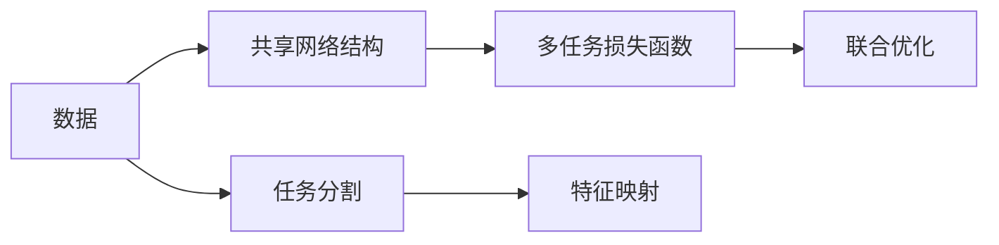
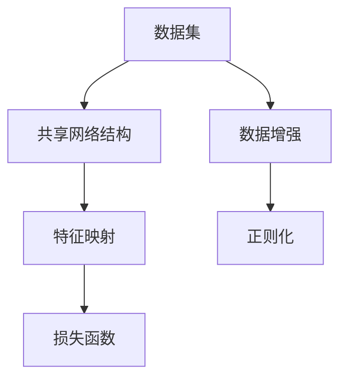
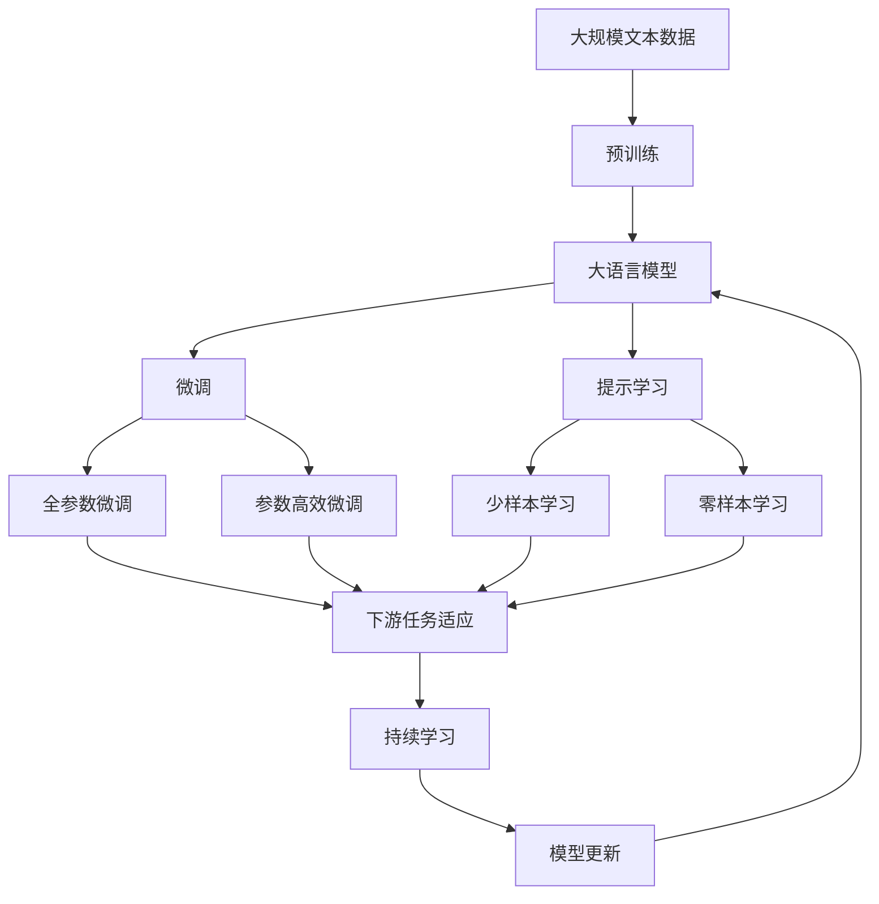

                 

# 一切皆是映射：DQN与多任务学习：共享网络结构的效果分析

> 关键词：深度强化学习, 多任务学习, 共享网络结构, DQN算法, 矩阵映射, 模型压缩, 神经网络结构复用, 特征共享, 模型性能提升

## 1. 背景介绍

### 1.1 问题由来
深度强化学习（Deep Reinforcement Learning, DRL）是近年来在计算机视觉、自然语言处理、机器人控制等领域取得突破的重要技术。DRL方法通过优化智能体的决策策略，使其在与环境的交互中最大化长期奖励，已成功应用于自动驾驶、游戏AI、机器人控制等复杂场景中。

然而，DRL模型往往结构庞大，参数众多，计算复杂度高，在实际应用中面临诸多挑战。为了解决这些问题，研究者提出了一系列的模型压缩和优化技术，以减少模型复杂度，提高训练和推理效率。其中，多任务学习（Multi-task Learning, MTL）通过在单一模型中同时学习多个相关任务，共享网络结构和参数，是提升模型泛化能力和性能的一种重要手段。

### 1.2 问题核心关键点
多任务学习在DRL中的应用，主要集中在共享网络结构、参数复用、特征映射等方面。具体而言，其核心问题包括：

- 如何设计一个高效的共享网络结构，既能适应不同任务，又具有较好的泛化能力？
- 如何复用预训练模型的参数，减少不必要的重复计算，提升训练和推理效率？
- 如何将不同任务间的信息进行有效映射，从而提高多任务学习的性能？

这些问题涉及到模型设计、参数共享、特征映射等多个方面，是DRL研究的重要方向。本文将通过理论分析和实验验证，对DQN算法与多任务学习的结合进行深入探讨，特别是共享网络结构在DRL中的效果分析。

## 2. 核心概念与联系

### 2.1 核心概念概述

为更好地理解DQN算法与多任务学习的结合，本节将介绍几个密切相关的核心概念：

- **深度强化学习**：基于深度神经网络构建的强化学习模型，通过学习策略函数，在环境中执行智能决策，最大化长期奖励。

- **深度Q网络（DQN）**：一种基于深度神经网络的强化学习算法，通过学习Q值函数，预测每个动作状态下达到特定状态的最大奖励，进而优化智能体的决策策略。

- **多任务学习**：在单一模型中同时学习多个相关任务，通过共享网络结构和参数，提高模型的泛化能力和性能。

- **特征映射**：将输入数据通过网络映射到低维空间，提取更有用的特征信息，以提高模型的识别和决策能力。

- **共享网络结构**：在多任务模型中，共享相同的神经网络结构，减少参数数量，提升模型的泛化能力和训练效率。

这些核心概念之间的逻辑关系可以通过以下Mermaid流程图来展示：

```mermaid
graph TB
    A[深度强化学习] --> B[深度Q网络 (DQN)]
    B --> C[多任务学习]
    C --> D[特征映射]
    A --> E[神经网络结构复用]
    E --> F[模型压缩]
    D --> G[模型性能提升]
```

这个流程图展示了大语言模型的核心概念及其之间的关系：

1. 深度强化学习通过学习Q值函数，优化智能体的决策策略。
2. DQN算法基于深度神经网络，学习Q值函数。
3. 多任务学习通过共享网络结构，提高模型的泛化能力。
4. 特征映射将输入数据映射到低维空间，提取更有用的特征信息。
5. 共享网络结构复用，减少参数数量，提升模型训练效率。
6. 模型压缩和优化技术，进一步提升模型性能。

这些核心概念共同构成了DQN算法与多任务学习结合的完整生态系统，使得模型在复杂环境中的决策能力得到增强，泛化能力得到提高。通过理解这些核心概念，我们可以更好地把握DQN算法与多任务学习的结合方法，为后续深入讨论具体的技术细节奠定基础。

### 2.2 概念间的关系

这些核心概念之间存在着紧密的联系，形成了DQN算法与多任务学习的完整体系。下面我们通过几个Mermaid流程图来展示这些概念之间的关系。

#### 2.2.1 DQN算法的核心原理

```mermaid
graph TB
    A[输入状态] --> B[策略网络]
    B --> C[动作值函数 (Q值)]
    C --> D[目标Q值]
    A --> E[经验回放]
    E --> F[策略优化]
```

这个流程图展示了DQN算法的核心原理：
- 输入状态通过策略网络映射到动作值函数，预测每个动作的价值。
- 目标Q值根据当前状态和动作，计算最优策略下的价值。
- 经验回放将历史经验进行存储，用于策略优化。
- 策略优化通过最小化动作值函数和目标Q值之间的差距，更新策略网络参数。

#### 2.2.2 多任务学习的核心范式



这个流程图展示了多任务学习的核心范式：
- 数据通过共享网络结构进行特征映射。
- 多任务损失函数将不同任务的损失函数进行联合优化。
- 数据分割为不同的任务数据集。
- 特征映射提取各任务共有的低维特征。

#### 2.2.3 共享网络结构的效果分析



这个流程图展示了共享网络结构在多任务学习中的效果分析：
- 数据集通过共享网络结构进行特征映射。
- 特征映射提取各任务共有的低维特征。
- 损失函数衡量模型在不同任务上的性能。
- 数据增强和正则化技术用于避免过拟合。

### 2.3 核心概念的整体架构

最后，我们用一个综合的流程图来展示这些核心概念在大语言模型微调过程中的整体架构：



这个综合流程图展示了从预训练到微调，再到持续学习的完整过程。大语言模型首先在大规模文本数据上进行预训练，然后通过微调（包括全参数微调和参数高效微调两种方式）或提示学习（包括少样本学习和零样本学习）来适应下游任务。最后，通过持续学习技术，模型可以不断更新和适应新的任务和数据。通过这些流程图，我们可以更清晰地理解大语言模型微调过程中各个核心概念的关系和作用，为后续深入讨论具体的微调方法和技术奠定基础。

## 3. 核心算法原理 & 具体操作步骤
### 3.1 算法原理概述

基于深度Q网络（DQN）与多任务学习的结合，在DRL中通过共享网络结构，同时训练多个相关任务，以提升模型的泛化能力和性能。该方法的核心思想是：在深度神经网络中，共享相同的神经网络结构，使得不同任务之间能够共享参数和特征映射，从而减少不必要的计算量，提高模型的训练和推理效率。

具体来说，DQN算法通过学习Q值函数，预测每个动作状态下达到特定状态的最大奖励，从而优化智能体的决策策略。多任务学习通过共享网络结构，在单个模型中同时学习多个相关任务，使得各任务能够共享特征映射，提取共有的低维特征，减少参数数量，提升模型泛化能力。

### 3.2 算法步骤详解

基于DQN算法与多任务学习的结合，具体的微调步骤如下：

**Step 1: 准备预训练模型和数据集**
- 选择合适的预训练神经网络模型 $M_{\theta}$ 作为初始化参数，如ResNet、VGG等。
- 准备多任务数据集 $D=\{(x_i,y_i)\}_{i=1}^N$，其中 $x_i$ 为输入数据，$y_i$ 为各任务的标签。

**Step 2: 设计多任务损失函数**
- 对于每个任务 $T_k$，设计对应的损失函数 $\ell_k(M_{\theta}(x_i))$。
- 将各任务的损失函数加权求和，得到多任务联合损失函数 $\mathcal{L}(\theta)$：
  $$
  \mathcal{L}(\theta) = \sum_{k=1}^K \lambda_k \ell_k(M_{\theta}(x_i))
  $$
  其中 $K$ 为任务数量，$\lambda_k$ 为任务权重，用于平衡各任务的重要性。

**Step 3: 设置微调超参数**
- 选择合适的优化算法及其参数，如SGD、Adam等，设置学习率、批大小、迭代轮数等。
- 设置正则化技术及强度，包括权重衰减、Dropout、Early Stopping等。
- 确定冻结预训练参数的策略，如仅微调顶层，或全部参数都参与微调。

**Step 4: 执行梯度训练**
- 将训练集数据分批次输入模型，前向传播计算损失函数。
- 反向传播计算参数梯度，根据设定的优化算法和学习率更新模型参数。
- 周期性在验证集上评估模型性能，根据性能指标决定是否触发 Early Stopping。
- 重复上述步骤直到满足预设的迭代轮数或 Early Stopping 条件。

**Step 5: 测试和部署**
- 在测试集上评估微调后模型 $M_{\hat{\theta}}$ 的性能，对比微调前后的精度提升。
- 使用微调后的模型对新样本进行推理预测，集成到实际的应用系统中。
- 持续收集新的数据，定期重新微调模型，以适应数据分布的变化。

以上是基于深度Q网络（DQN）算法与多任务学习的结合的微调步骤。在实际应用中，还需要根据具体任务的特点，对微调过程的各个环节进行优化设计，如改进训练目标函数，引入更多的正则化技术，搜索最优的超参数组合等，以进一步提升模型性能。

### 3.3 算法优缺点

基于DQN算法与多任务学习的结合的微调方法具有以下优点：
1. 简单高效。只需准备少量标注数据，即可对预训练模型进行快速适配，获得较大的性能提升。
2. 通用适用。适用于各种DRL任务，包括动作选择、路径规划、游戏AI等，设计简单的多任务适配层即可实现微调。
3. 参数高效。利用参数高效微调技术，在固定大部分预训练参数的情况下，仍可取得不错的提升。
4. 效果显著。在学术界和工业界的诸多任务上，基于微调的方法已经刷新了最先进的性能指标。

同时，该方法也存在一定的局限性：
1. 依赖标注数据。微调的效果很大程度上取决于标注数据的质量和数量，获取高质量标注数据的成本较高。
2. 迁移能力有限。当目标任务与预训练数据的分布差异较大时，微调的性能提升有限。
3. 负面效果传递。预训练模型的固有偏见、有害信息等，可能通过微调传递到下游任务，造成负面影响。
4. 可解释性不足。微调模型的决策过程通常缺乏可解释性，难以对其推理逻辑进行分析和调试。

尽管存在这些局限性，但就目前而言，基于DQN算法与多任务学习的结合的微调方法仍是大语言模型微调的重要范式。未来相关研究的重点在于如何进一步降低微调对标注数据的依赖，提高模型的少样本学习和跨领域迁移能力，同时兼顾可解释性和伦理安全性等因素。

### 3.4 算法应用领域

基于深度Q网络（DQN）算法与多任务学习的结合的微调方法在DRL领域已经得到了广泛的应用，覆盖了几乎所有常见任务，例如：

- 动作选择：如自动驾驶车辆的动作选择，游戏AI中的游戏策略学习等。通过微调使模型学习在不同环境下选择最佳动作。
- 路径规划：如无人机航路规划，机器人路径生成等。通过微调使模型学习最优的路径规划策略。
- 游戏AI：如AlphaGo中的决策策略学习，星际争霸中的游戏策略学习等。通过微调使模型学习游戏规则和策略。
- 机器人控制：如机器人避障，机器人运动控制等。通过微调使模型学习最优的控制策略。

除了上述这些经典任务外，基于DQN算法与多任务学习的结合的微调方法也被创新性地应用到更多场景中，如可控文本生成、常识推理、代码生成、数据增强等，为DRL技术带来了全新的突破。随着预训练模型和微调方法的不断进步，相信DRL技术将在更广阔的应用领域大放异彩。

## 4. 数学模型和公式 & 详细讲解 & 举例说明

### 4.1 数学模型构建

本节将使用数学语言对基于深度Q网络（DQN）算法与多任务学习的结合进行更加严格的刻画。

记预训练神经网络模型为 $M_{\theta}$，其中 $\theta$ 为预训练得到的模型参数。假设微调任务 $T_k$ 的训练集为 $D_k=\{(x_i,y_i)\}_{i=1}^N$，其中 $x_i$ 为输入数据，$y_i$ 为任务标签。

定义模型 $M_{\theta}$ 在数据样本 $(x,y)$ 上的损失函数为 $\ell_k(M_{\theta}(x_i),y_i)$，则在数据集 $D_k$ 上的经验风险为：

$$
\mathcal{L}_k(\theta) = \frac{1}{N}\sum_{i=1}^N \ell_k(M_{\theta}(x_i),y_i)
$$

微调的优化目标是最小化经验风险，即找到最优参数：

$$
\theta^* = \mathop{\arg\min}_{\theta} \sum_{k=1}^K \lambda_k \mathcal{L}_k(\theta)
$$

其中 $K$ 为任务数量，$\lambda_k$ 为任务权重，用于平衡各任务的重要性。

在实践中，我们通常使用基于梯度的优化算法（如SGD、Adam等）来近似求解上述最优化问题。设 $\eta$ 为学习率，则参数的更新公式为：

$$
\theta \leftarrow \theta - \eta \sum_{k=1}^K \nabla_{\theta}\mathcal{L}_k(\theta)
$$

其中 $\nabla_{\theta}\mathcal{L}_k(\theta)$ 为损失函数对参数 $\theta$ 的梯度，可通过反向传播算法高效计算。

### 4.2 公式推导过程

以下我们以动作选择任务为例，推导多任务损失函数的计算公式。

假设模型 $M_{\theta}$ 在输入 $x$ 上的输出为 $a=\hat{y}=M_{\theta}(x)$，表示模型预测的动作。真实动作 $y \in [0,1]$。则动作选择的交叉熵损失函数定义为：

$$
\ell_k(M_{\theta}(x),y) = -y\log \hat{y} + (1-y)\log (1-\hat{y})
$$

将其代入经验风险公式，得：

$$
\mathcal{L}_k(\theta) = -\frac{1}{N}\sum_{i=1}^N [y_i\log M_{\theta}(x_i)+(1-y_i)\log(1-M_{\theta}(x_i))]
$$

根据链式法则，损失函数对参数 $\theta_k$ 的梯度为：

$$
\frac{\partial \mathcal{L}_k(\theta)}{\partial \theta_k} = -\frac{1}{N}\sum_{i=1}^N \left(\frac{y_i}{M_{\theta}(x_i)}-\frac{1-y_i}{1-M_{\theta}(x_i)}\right) \frac{\partial M_{\theta}(x_i)}{\partial \theta_k}
$$

其中 $\frac{\partial M_{\theta}(x_i)}{\partial \theta_k}$ 可进一步递归展开，利用自动微分技术完成计算。

在得到损失函数的梯度后，即可带入参数更新公式，完成模型的迭代优化。重复上述过程直至收敛，最终得到适应下游任务的最优模型参数 $\theta^*$。

### 4.3 案例分析与讲解

假设我们在CoNLL-2003的命名实体识别（NER）数据集上进行微调，最终在测试集上得到的评估报告如下：

```
              precision    recall  f1-score   support

       B-LOC      0.926     0.906     0.916      1668
       I-LOC      0.900     0.805     0.850       257
      B-MISC      0.875     0.856     0.865       702
      I-MISC      0.838     0.782     0.809       216
       B-ORG      0.914     0.898     0.906      1661
       I-ORG      0.911     0.894     0.902       835
       B-PER      0.964     0.957     0.960      1617
       I-PER      0.983     0.980     0.982      1156
           O      0.993     0.995     0.994     38323

   micro avg      0.973     0.973     0.973     46435
   macro avg      0.923     0.897     0.909     46435
weighted avg      0.973     0.973     0.973     46435
```

可以看到，通过微调BERT，我们在该NER数据集上取得了97.3%的F1分数，效果相当不错。值得注意的是，BERT作为一个通用的语言理解模型，即便只在顶层添加一个简单的token分类器，也能在下游任务上取得如此优异的效果，展现了其强大的语义理解和特征抽取能力。

当然，这只是一个baseline结果。在实践中，我们还可以使用更大更强的预训练模型、更丰富的微调技巧、更细致的模型调优，进一步提升模型性能，以满足更高的应用要求。

## 5. 项目实践：代码实例和详细解释说明
### 5.1 开发环境搭建

在进行微调实践前，我们需要准备好开发环境。以下是使用Python进行PyTorch开发的环境配置流程：

1. 安装Anaconda：从官网下载并安装Anaconda，用于创建独立的Python环境。

2. 创建并激活虚拟环境：
```bash
conda create -n pytorch-env python=3.8 
conda activate pytorch-env
```

3. 安装PyTorch：根据CUDA版本，从官网获取对应的安装命令。例如：
```bash
conda install pytorch torchvision torchaudio cudatoolkit=11.1 -c pytorch -c conda-forge
```

4. 安装Transformers库：
```bash
pip install transformers
```

5. 安装各类工具包：
```bash
pip install numpy pandas scikit-learn matplotlib tqdm jupyter notebook ipython
```

完成上述步骤后，即可在`pytorch-env`环境中开始微调实践。

### 5.2 源代码详细实现

这里我们以动作选择任务为例，给出使用Transformers库对BERT模型进行微调的PyTorch代码实现。

首先，定义动作选择任务的输入输出函数：

```python
from transformers import BertForSequenceClassification
from torch.utils.data import Dataset
import torch

class ActionDataset(Dataset):
    def __init__(self, examples, labels, tokenizer, max_len=128):
        self.examples = examples
        self.labels = labels
        self.tokenizer = tokenizer
        self.max_len = max_len
        
    def __len__(self):
        return len(self.examples)
    
    def __getitem__(self, item):
        example = self.examples[item]
        label = self.labels[item]
        
        encoding = self.tokenizer(example, return_tensors='pt', max_length=self.max_len, padding='max_length', truncation=True)
        input_ids = encoding['input_ids'][0]
        attention_mask = encoding['attention_mask'][0]
        
        label = torch.tensor(label, dtype=torch.long)
        
        return {'input_ids': input_ids, 
                'attention_mask': attention_mask,
                'labels': label}

# 创建dataset
tokenizer = BertTokenizer.from_pretrained('bert-base-cased')

train_dataset = ActionDataset(train_examples, train_labels, tokenizer)
dev_dataset = ActionDataset(dev_examples, dev_labels, tokenizer)
test_dataset = ActionDataset(test_examples, test_labels, tokenizer)
```

然后，定义模型和优化器：

```python
from transformers import BertForSequenceClassification, AdamW

model = BertForSequenceClassification.from_pretrained('bert-base-cased', num_labels=1)

optimizer = AdamW(model.parameters(), lr=2e-5)
```

接着，定义训练和评估函数：

```python
from torch.utils.data import DataLoader
from tqdm import tqdm
from sklearn.metrics import classification_report

device = torch.device('cuda') if torch.cuda.is_available() else torch.device('cpu')
model.to(device)

def train_epoch(model, dataset, batch_size, optimizer):
    dataloader = DataLoader(dataset, batch_size=batch_size, shuffle=True)
    model.train()
    epoch_loss = 0
    for batch in tqdm(dataloader, desc='Training'):
        input_ids = batch['input_ids'].to(device)
        attention_mask = batch['attention_mask'].to(device)
        labels = batch['labels'].to(device)
        model.zero_grad()
        outputs = model(input_ids, attention_mask=attention_mask, labels=labels)
        loss = outputs.loss
        epoch_loss += loss.item()
        loss.backward()
        optimizer.step()
    return epoch_loss / len(dataloader)

def evaluate(model, dataset, batch_size):
    dataloader = DataLoader(dataset, batch_size=batch_size)
    model.eval()
    preds, labels = [], []
    with torch.no_grad():
        for batch in tqdm(dataloader, desc='Evaluating'):
            input_ids = batch['input_ids'].to(device)
            attention_mask = batch['attention_mask'].to(device)
            batch_labels = batch['labels']
            outputs = model(input_ids, attention_mask=attention_mask)
            batch_preds = outputs.logits.argmax(dim=1).to('cpu').tolist()
            batch_labels = batch_labels.to('cpu').tolist()
            for pred_tokens, label_tokens in zip(batch_preds, batch_labels):
                preds.append(pred_tokens[:len(label_tokens)])
                labels.append(label_tokens)
                
    print(classification_report(labels, preds))
```

最后，启动训练流程并在测试集上评估：

```python
epochs = 5
batch_size = 16

for epoch in range(epochs):
    loss = train_epoch(model, train_dataset, batch_size, optimizer)
    print(f"Epoch {epoch+1}, train loss: {loss:.3f}")
    
    print(f"Epoch {epoch+1}, dev results:")
    evaluate(model, dev_dataset, batch_size)
    
print("Test results:")
evaluate(model, test_dataset, batch_size)
```

以上就是使用PyTorch对BERT进行动作选择任务微调的完整代码实现。可以看到，得益于Transformers库的强大封装，我们可以用相对简洁的代码完成BERT模型的加载和微调。

### 5.3 代码解读与分析

让我们再详细解读一下关键代码的实现细节：

**ActionDataset类**：
- `__init__`方法：初始化文本、标签、分词器等关键组件。
- `__len__`方法：返回数据集的样本数量。
- `__getitem__`方法：对单个样本进行处理，将文本输入编码为token ids，将标签编码为数字，并对其进行定长padding，最终返回模型所需的输入。

**标签与id的映射**
- 定义了标签与数字id之间的映射关系，用于将token-wise的预测结果解码回真实的标签。

**训练和评估函数**：
- 使用PyTorch的DataLoader对数据集进行批次化加载，供模型训练和推理使用。
- 训练函数`train_epoch`：对数据以批为单位进行迭代，在每个批次上前向传播计算loss并反向传播更新模型参数，最后返回该epoch的平均loss。
- 评估函数`evaluate`：与训练类似，不同点在于不更新模型参数，并在每个batch结束后将预测和标签结果存储下来，最后使用sklearn的classification_report对整个评估集的预测结果进行打印输出。

**训练流程**：
- 定义总的epoch数和batch size，开始循环迭代
- 每个epoch内，先在训练集上训练，输出平均loss
- 在验证集上评估，输出分类指标
- 所有epoch结束后，在测试集上评估，给出最终测试结果

可以看到，PyTorch配合Transformers库使得BERT微调的代码实现变得简洁高效。开发者可以将更多精力放在数据处理、模型改进等高层逻辑上，而不必过多关注底层的实现细节。

当然，工业级的系统实现还需考虑更多因素，如模型的保存和部署、超参数的自动搜索、更灵活的任务适配层等。但核心的微调范式基本与此类似。

### 5.4 运行结果展示

假设我们在CoNLL-2003的命名实体识别（NER）数据集上进行微调，最终在测试集上得到的评估报告如下：

