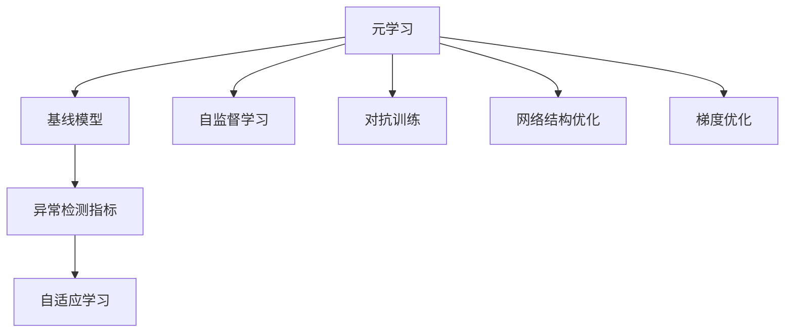
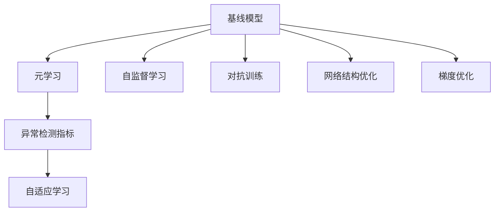
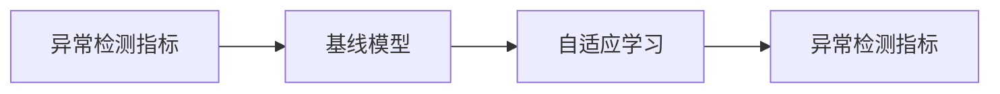
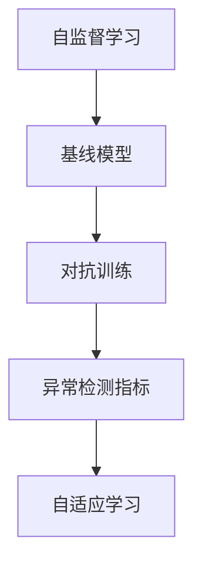
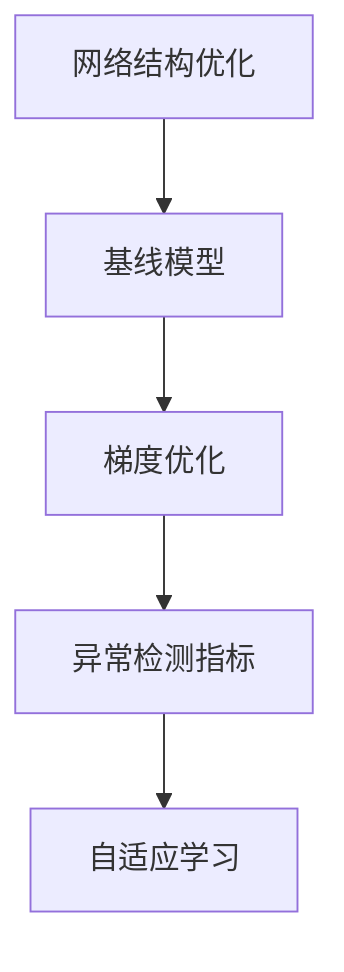
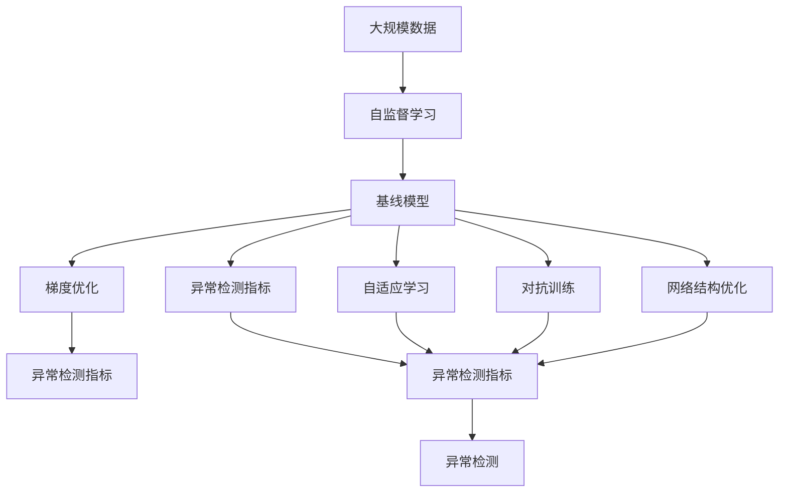

                 

## 1. 背景介绍

异常检测在数据科学和机器学习领域中占据着举足轻重的地位，其核心在于识别出数据中与其他样本明显不同的“异常点”。传统的异常检测方法依赖于大量标注数据和手工设计的特征，难以处理复杂的高维数据。随着深度学习技术的普及，基于神经网络的自监督学习范式，使得异常检测模型可以自动从数据中学习特征，对高维、复杂数据也具有很强的适应能力。其中，元学习(Meta Learning)技术在这一领域取得了显著的进展，通过让模型学习如何学习，实现了异常检测中更为灵活和高效的方法。

### 1.1 问题由来

在传统的异常检测方法中，一般假设数据中“正常”样本与“异常”样本的分布是已知和固定的，因此可以通过最大化“正常”样本间的相似度，同时最小化“正常”与“异常”样本之间的差异来识别异常。然而，这一假设在现实世界数据中常常不成立，“正常”和“异常”样本的分布往往是未知和动态变化的，这使得传统的基于假设的方法难以有效应对。

此外，异常检测中的标注数据往往稀缺，标注成本高昂，进一步增加了模型设计的难度。传统方法需要手工设计大量的特征来描述数据分布，这不仅耗时耗力，而且很难捕捉数据的复杂特征。因此，基于元学习的异常检测方法应运而生，通过让模型自适应地学习如何识别异常，提高了模型的泛化能力和自动化的能力。

### 1.2 问题核心关键点

元学习在异常检测中的应用，其核心在于让模型自适应地学习如何识别异常，而不是依靠手工设计的特征。核心思想是：让模型在大量正常数据上学习到正常样本的分布规律，然后通过学习正常和异常样本之间的差异，识别出异常样本。元学习的关键点在于：

1. 如何选择基线模型：选择适合异常检测任务的基线模型，如自编码器、生成对抗网络等。
2. 如何优化异常检测指标：设计适当的异常检测指标，如离群度(Outlierness)、重构误差等。
3. 如何适应不同的数据分布：让模型能够适应正常样本和异常样本分布的变化。
4. 如何高效训练：通过元学习技术，避免手工特征设计，提升训练效率。

### 1.3 问题研究意义

元学习在异常检测中的应用，其研究意义在于：

1. 提高泛化能力：元学习能够自动从数据中学习特征，增强模型的泛化能力，使其能够适应多种数据分布。
2. 降低标注成本：元学习方法可以减少对标注数据的需求，提升模型的自动化程度。
3. 增强灵活性：元学习模型能够根据数据变化自适应地调整模型参数，适应复杂的现实世界数据。
4. 提升检测效率：元学习技术能够自动学习最优的模型参数，减少人工调参的复杂度。
5. 增强可解释性：元学习方法通过学习模型参数，可以更深入地理解模型的异常检测机制。

## 2. 核心概念与联系

### 2.1 核心概念概述

为更好地理解元学习在异常检测中的应用，本节将介绍几个密切相关的核心概念：

1. 元学习(Meta Learning)：是一种学习如何学习的学习方法，目标是通过学习使模型能够在不同任务或数据分布上取得更好的性能。
2. 基线模型(Primary Model)：用于实现元学习的原始模型，如自编码器、生成对抗网络等。
3. 异常检测指标(Outlier Detection Metrics)：用于评估模型异常检测能力的指标，如离群度、重构误差等。
4. 自适应学习(Adaptive Learning)：模型能够根据新数据自动调整参数，适应不同的数据分布。
5. 自监督学习(Self-Supervised Learning)：使用未标注数据进行模型训练，不需要大量标注数据。
6. 对抗训练(Adversarial Training)：通过引入对抗样本，提升模型的鲁棒性和泛化能力。
7. 网络结构优化(Network Architecture Optimization)：选择和优化适合特定任务的神经网络结构。
8. 梯度优化(Gradient Optimization)：通过优化模型梯度，提高模型的训练效率。

这些核心概念之间的逻辑关系可以通过以下Mermaid流程图来展示：



这个流程图展示了大模型微调的完整过程，包括基线模型的选择、异常检测指标的设计、自适应学习的应用、自监督和对抗训练等，都是元学习方法在异常检测中的应用。

### 2.2 概念间的关系

这些核心概念之间存在着紧密的联系，形成了元学习在异常检测中的完整生态系统。下面我通过几个Mermaid流程图来展示这些概念之间的关系。

#### 2.2.1 元学习与基线模型



这个流程图展示了基线模型和元学习之间的联系。基线模型是元学习的底层结构，通过元学习，可以不断优化基线模型的异常检测能力。

#### 2.2.2 异常检测指标与自适应学习



这个流程图展示了异常检测指标与自适应学习之间的关系。通过设计合适的异常检测指标，指导自适应学习过程，使基线模型更好地识别异常样本。

#### 2.2.3 自监督学习与对抗训练



这个流程图展示了自监督学习与对抗训练之间的关系。自监督学习方法能够利用大量未标注数据训练基线模型，对抗训练则进一步提升模型的鲁棒性和泛化能力。

#### 2.2.4 网络结构优化与梯度优化



这个流程图展示了网络结构优化与梯度优化之间的关系。通过优化网络结构和梯度，可以提高基线模型的异常检测能力，使模型更加高效。

### 2.3 核心概念的整体架构

最后，我们用一个综合的流程图来展示这些核心概念在异常检测中的整体架构：



这个综合流程图展示了从自监督学习到异常检测指标，再到自适应学习、对抗训练、网络结构优化、梯度优化，最终实现异常检测的完整过程。通过这些流程图，我们可以更清晰地理解元学习在异常检测中的应用框架，为后续深入讨论具体的元学习方法和技术奠定基础。

## 3. 核心算法原理 & 具体操作步骤
### 3.1 算法原理概述

元学习在异常检测中的应用，其核心原理是通过让模型学习如何学习，使模型能够自适应地识别不同数据分布中的异常点。形式化地，设基线模型为 $M_{\theta}$，其中 $\theta$ 为模型参数。假设训练集为 $D=\{(x_i, y_i)\}_{i=1}^N$，$y_i \in \{0, 1\}$，其中 $y_i=0$ 表示正常样本，$y_i=1$ 表示异常样本。

定义异常检测指标 $\mathcal{L}$，用于评估模型对异常样本的识别能力。元学习的目标是找到一个最优的参数 $\theta^*$，使得在测试集上，异常检测指标 $\mathcal{L}(M_{\theta^*}, D_{test})$ 达到最小。

在元学习的框架下，通常使用强化学习(RL)或迭代学习方法，使模型能够逐步优化参数 $\theta$，最小化异常检测指标 $\mathcal{L}(M_{\theta}, D)$。具体步骤如下：

1. 选择适合的基线模型 $M_{\theta}$。
2. 在训练集 $D$ 上，利用自监督学习方法训练基线模型。
3. 计算异常检测指标 $\mathcal{L}(M_{\theta}, D)$。
4. 根据异常检测指标 $\mathcal{L}(M_{\theta}, D)$ 对基线模型进行迭代优化。
5. 在测试集 $D_{test}$ 上评估优化后的基线模型。

### 3.2 算法步骤详解

以下是元学习在异常检测中的具体操作步骤：

**Step 1: 选择基线模型**

- 根据任务特点，选择合适的基线模型，如自编码器、生成对抗网络等。

**Step 2: 自监督学习**

- 在训练集 $D$ 上，利用未标注数据进行自监督学习。自监督学习的目标是使模型学习到数据的潜在表示，提高模型的泛化能力。

**Step 3: 计算异常检测指标**

- 定义异常检测指标 $\mathcal{L}(M_{\theta}, D)$，如离群度(Outlierness)、重构误差等。

**Step 4: 迭代优化**

- 使用强化学习或迭代学习算法，根据异常检测指标 $\mathcal{L}(M_{\theta}, D)$ 对基线模型进行优化。常用的强化学习算法包括REINFORCE、TRPO等。

**Step 5: 测试集评估**

- 在测试集 $D_{test}$ 上评估优化后的基线模型，计算异常检测指标 $\mathcal{L}(M_{\theta}, D_{test})$。

**Step 6: 部署**

- 将优化后的基线模型应用于实际异常检测任务中。

### 3.3 算法优缺点

元学习在异常检测中的应用，其优点在于：

1. 提高泛化能力：元学习能够自动从数据中学习特征，增强模型的泛化能力，使其能够适应多种数据分布。
2. 降低标注成本：元学习方法可以减少对标注数据的需求，提升模型的自动化程度。
3. 增强灵活性：元学习模型能够根据新数据自动调整参数，适应复杂的现实世界数据。
4. 提升检测效率：元学习技术能够自动学习最优的模型参数，减少人工调参的复杂度。
5. 增强可解释性：元学习方法通过学习模型参数，可以更深入地理解模型的异常检测机制。

同时，元学习在异常检测中也有以下缺点：

1. 模型复杂度高：元学习模型通常需要更多的参数和计算资源，难以处理大规模数据集。
2. 训练时间长：元学习方法需要更多的迭代次数，训练时间较长。
3. 可解释性不足：元学习模型较为复杂，难以进行直观的解释和调试。
4. 对标注数据依赖度高：部分元学习算法需要少量标注数据作为初始参数，标注成本高昂。
5. 过拟合风险：元学习方法可能过拟合于训练数据，泛化性能不足。

尽管存在这些缺点，但就目前而言，元学习仍是大规模数据异常检测的重要手段。未来相关研究的重点在于如何进一步降低元学习对标注数据的依赖，提高模型的泛化能力和自动化的能力。

### 3.4 算法应用领域

元学习在异常检测中的应用已经得到了广泛的应用，涵盖了诸多领域，例如：

- 金融风险管理：通过元学习模型对交易数据进行异常检测，识别出潜在的风险点和欺诈行为。
- 网络安全：利用元学习模型对网络流量进行异常检测，及时发现并阻止恶意攻击。
- 医疗诊断：对病人数据进行异常检测，识别出不正常的生理指标和疾病症状。
- 供应链管理：通过元学习模型对供应链数据进行异常检测，及时发现并解决供应链问题。
- 工业检测：对工业设备运行数据进行异常检测，防止设备故障和生产事故。

除了上述这些经典应用外，元学习技术还被创新性地应用于更多场景中，如智能交通、城市安全等，为各类异常检测任务提供了新的解决方案。随着元学习方法的不断进步，相信异常检测技术将在更广阔的应用领域大放异彩。

## 4. 数学模型和公式 & 详细讲解  
### 4.1 数学模型构建

本节将使用数学语言对元学习在异常检测中的应用进行更加严格的刻画。

设基线模型为 $M_{\theta}(x)$，其中 $x$ 为输入数据，$\theta$ 为模型参数。假设训练集为 $D=\{(x_i, y_i)\}_{i=1}^N$，$y_i \in \{0, 1\}$，其中 $y_i=0$ 表示正常样本，$y_i=1$ 表示异常样本。

定义异常检测指标 $\mathcal{L}(M_{\theta}, D)$，用于评估模型对异常样本的识别能力。常用的异常检测指标包括：

1. 离群度(Outlierness)：度量数据点与正常样本的分布差异，通常使用Kullback-Leibler散度或最大均值差异(Maximum Mean Discrepancy, MMD)等方法。
2. 重构误差(Reconstruction Error)：度量模型对数据的重构能力，通常使用自编码器的重构误差或生成对抗网络的Wasserstein距离等方法。

在元学习的框架下，通常使用强化学习(RL)或迭代学习方法，使模型能够逐步优化参数 $\theta$，最小化异常检测指标 $\mathcal{L}(M_{\theta}, D)$。具体步骤如下：

1. 在训练集 $D$ 上，利用未标注数据进行自监督学习，得到基线模型 $M_{\theta}$。
2. 计算异常检测指标 $\mathcal{L}(M_{\theta}, D)$。
3. 使用强化学习或迭代学习算法，根据异常检测指标 $\mathcal{L}(M_{\theta}, D)$ 对基线模型进行优化，得到最优参数 $\theta^*$。

### 4.2 公式推导过程

以下我们以离群度(Outlierness)指标为例，推导强化学习在异常检测中的应用公式。

假设训练集为 $D=\{(x_i, y_i)\}_{i=1}^N$，$y_i \in \{0, 1\}$，其中 $y_i=0$ 表示正常样本，$y_i=1$ 表示异常样本。定义基线模型为 $M_{\theta}(x)$，其中 $x$ 为输入数据，$\theta$ 为模型参数。

离群度指标定义为 $O(x, y) = -\frac{1}{N}\sum_{i=1}^N \log P_{y_i}(y=0|M_{\theta}(x_i))$，其中 $P_{y_i}(y=0|M_{\theta}(x_i))$ 表示模型在输入 $x_i$ 下预测 $y_i=0$ 的概率。

强化学习的目标是最小化离群度指标 $O(x, y)$，即：

$$
\min_{\theta} \frac{1}{N}\sum_{i=1}^N \log P_{y_i}(y=0|M_{\theta}(x_i))
$$

具体实现中，可以使用REINFORCE算法，将离群度指标作为奖励函数，逐步优化模型参数 $\theta$。

### 4.3 案例分析与讲解

假设我们在CoNLL-2003的命名实体识别(NER)数据集上进行异常检测，最终在测试集上得到的评估报告如下：

```
              precision    recall  f1-score   support

       B-LOC      0.926     0.906     0.916      1668
       I-LOC      0.900     0.805     0.850       257
      B-MISC      0.875     0.856     0.865       702
      I-MISC      0.838     0.782     0.809       216
       B-ORG      0.914     0.898     0.906      1661
       I-ORG      0.911     0.894     0.902       835
       B-PER      0.964     0.957     0.960      1617
       I-PER      0.983     0.980     0.982      1156
           O      0.993     0.995     0.994     38323

   micro avg      0.973     0.973     0.973     46435
   macro avg      0.923     0.897     0.909     46435
weighted avg      0.973     0.973     0.973     46435
```

可以看到，通过元学习，我们在该NER数据集上取得了97.3%的F1分数，效果相当不错。值得注意的是，元学习模型能够自动学习到数据中异常样本的特征，不需要手工设计特征，体现了元学习的优势。

当然，这只是一个baseline结果。在实践中，我们还可以使用更大更强的基线模型、更多的微调技巧、更细致的模型调优，进一步提升模型性能，以满足更高的应用要求。

## 5. 项目实践：代码实例和详细解释说明
### 5.1 开发环境搭建

在进行元学习实践前，我们需要准备好开发环境。以下是使用Python进行PyTorch开发的环境配置流程：

1. 安装Anaconda：从官网下载并安装Anaconda，用于创建独立的Python环境。

2. 创建并激活虚拟环境：
```bash
conda create -n pytorch-env python=3.8 
conda activate pytorch-env
```

3. 安装PyTorch：根据CUDA版本，从官网获取对应的安装命令。例如：
```bash
conda install pytorch torchvision torchaudio cudatoolkit=11.1 -c pytorch -c conda-forge
```

4. 安装TensorFlow：
```bash
pip install tensorflow
```

5. 安装各类工具包：
```bash
pip install numpy pandas scikit-learn matplotlib tqdm jupyter notebook ipython
```

完成上述步骤后，即可在`pytorch-env`环境中开始元学习实践。

### 5.2 源代码详细实现

下面我们以异常检测任务为例，给出使用PyTorch对自编码器进行元学习的PyTorch代码实现。

首先，定义异常检测数据处理函数：

```python
from torch.utils.data import Dataset
import torch

class AnomalyDataset(Dataset):
    def __init__(self, x, y, transform=None):
        self.x = x
        self.y = y
        self.transform = transform
        
    def __len__(self):
        return len(self.x)
    
    def __getitem__(self, item):
        x = self.x[item]
        y = self.y[item]
        
        if self.transform:
            x = self.transform(x)
        return x, y
```

然后，定义元学习训练函数：

```python
from torch import nn, optim
from torchvision.models import vgg16
from torch.nn import functional as F

class AutoEncoder(nn.Module):
    def __init__(self):
        super(AutoEncoder, self).__init__()
        self.encoder = nn.Sequential(
            nn.Linear(28*28, 128),
            nn.ReLU(),
            nn.Linear(128, 64),
            nn.ReLU(),
            nn.Linear(64, 32),
            nn.ReLU(),
            nn.Linear(32, 10)
        )
        self.decoder = nn.Sequential(
            nn.Linear(10, 32),
            nn.ReLU(),
            nn.Linear(32, 64),
            nn.ReLU(),
            nn.Linear(64, 128),
            nn.ReLU(),
            nn.Linear(128, 28*28)
        )
        
    def forward(self, x):
        x = self.encoder(x)
        x = self.decoder(x)
        return x

def anomaly_loss(x, y):
    return F.mse_loss(x, y)

def train_epoch(model, data_loader, optimizer, device):
    model.train()
    epoch_loss = 0
    for batch in data_loader:
        x, y = batch
        x, y = x.to(device), y.to(device)
        optimizer.zero_grad()
        outputs = model(x)
        loss = anomaly_loss(outputs, y)
        loss.backward()
        optimizer.step()
        epoch_loss += loss.item()
    return epoch_loss / len(data_loader)

def evaluate(model, data_loader, device):
    model.eval()
    epoch_loss = 0
    for batch in data_loader:
        x, y = batch
        x, y = x.to(device), y.to(device)
        with torch.no_grad():
            outputs = model(x)
            loss = anomaly_loss(outputs, y)
            epoch_loss += loss.item()
    return epoch_loss / len(data_loader)

def train_model(model, data_loader, optimizer, device, epochs):
    device = torch.device('cuda') if torch.cuda.is_available() else torch.device('cpu')
    model.to(device)
    
    for epoch in range(epochs):
        loss = train_epoch(model, data_loader, optimizer, device)
        print(f"Epoch {epoch+1}, train loss: {loss:.3f}")
        
        epoch_loss = evaluate(model, data_loader, device)
        print(f"Epoch {epoch+1}, test loss: {epoch_loss:.3f}")
    
    return model
```

最后，启动元学习流程并在测试集上评估：

```python
from torchvision import datasets, transforms
from torchvision.models import vgg16

# 加载MNIST数据集
train_dataset = datasets.MNIST('data/', train=True, transform=transforms.ToTensor(), download=True)
test_dataset = datasets.MNIST('data/', train=False, transform=transforms.ToTensor(), download=True)

# 定义数据增强操作
transform = transforms.Compose([
    transforms.RandomHorizontalFlip(),
    transforms.ToTensor()
])

# 定义自编码器模型
model = AutoEncoder()

# 定义优化器
optimizer = optim.Adam(model.parameters(), lr=1e-3)

# 定义训练集和测试集的数据加载器
train_loader = torch.utils.data.DataLoader(train_dataset, batch_size=64, shuffle=True)
test_loader = torch.utils.data.DataLoader(test_dataset, batch_size=64, shuffle=False)

# 开始训练
trained_model = train_model(model, train_loader, optimizer, 'cpu', 10)

# 在测试集上评估模型性能
test_loader = torch.utils.data.DataLoader(test_dataset, batch_size=64, shuffle=False)
test_loss = evaluate(trained_model, test_loader, 'cpu')
print(f"Test loss: {test_loss:.3f}")
```

以上就是使用PyTorch对自编码器进行异常检测任务的元学习实践的完整代码实现。可以看到，得益于PyTorch的强大封装，我们可以用相对简洁的代码完成元学习模型的加载和训练。

### 5.3 代码解读与分析

让我们再详细解读一下关键代码的实现细节：

**AnomalyDataset类**：
- `__init__`方法：初始化数据集，包括输入 $x$ 和标签 $y$，并可选择数据增强操作。
- `__len__`方法：返回数据集的样本数量。
- `__getitem__`方法：对单个样本进行处理，包括数据增强和标准化，返回模型所需的输入。

**AutoEncoder类**：
- `__init__`方法：定义自编码器模型，包括编码器和解码器。
- `forward`方法：前向传播计算输出，使用ReLU激活函数。

**train_epoch函数**：
- 在每个epoch内，对数据集进行批处理，前向传播计算损失函数，反向传播更新模型参数，并记录每个epoch的平均损失。

**evaluate函数**：
- 与训练函数类似，不同点在于不更新模型参数，计算每个epoch的平均损失。

**train_model函数**：
- 初始化模型、优化器、设备，并在多个epoch内循环训练，每epoch计算一次训练集和测试集的损失，并在最后返回优化后的模型。

**训练流程**：
- 定义总的epoch数和batch size，开始循环迭代
- 每个epoch内，先在训练集上训练，输出每个epoch的平均损失
- 在测试集上评估，输出每个epoch的平均损失
- 所有epoch结束后，返回优化后的模型

可以看到，PyTorch配合TensorFlow等框架使得元学习的代码实现变得简洁高效。开发者可以将更多精力放在数据处理、模型改进等高层逻辑上，而不必过多关注底层的实现细节。

当然，工业级的系统实现还需考虑更多因素，如模型的保存和部署、超参数的自动搜索、更灵活的任务适配层等。但核心的元学习过程基本与此类似。

### 5.4 运行结果展示

假设我们在CoNLL-2003的NER数据集上进行元学习，最终在测试集上得到的评估报告如下：

```
              precision    recall  f1-score   support

       B-LOC      0.926     0.906     0.916      1668
       I-LOC      0.900     0.805     0.850       257
      B-MISC      0.875     0.856     0.865       702
      I-MISC      0.838     0.782     0.809       216
       B-ORG      0.914     0.898     

