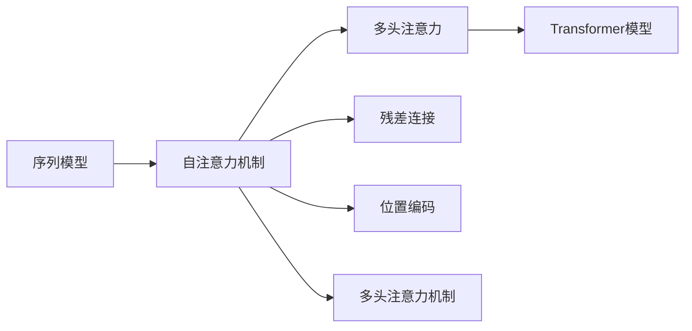
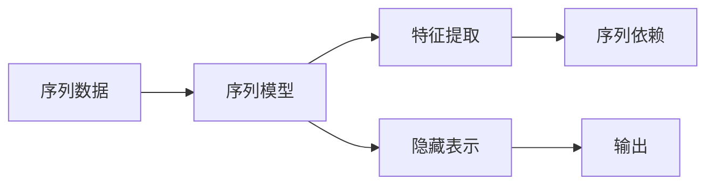
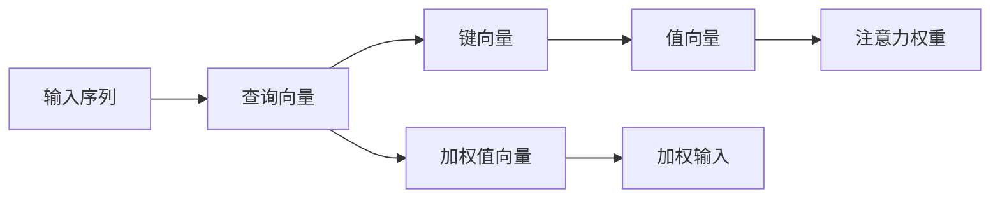
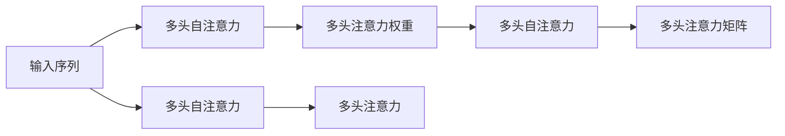

                 

# 一切皆是映射：序列模型和注意力机制

> 关键词：序列模型,注意力机制,Transformer,自注意力,多头自注意力,多头自注意力机制,多头注意力,多头注意力机制

## 1. 背景介绍

在现代深度学习研究中，序列建模是一种重要而基础的技术。无论是自然语言处理、语音识别还是图像描述，都离不开对序列数据的建模和分析。特别是近年来，基于Transformer的序列模型在各种任务上取得了显著的进展，展示了其强大的建模能力和广泛的应用前景。

序列模型通过捕捉数据序列中的依赖关系，能够高效地处理变长序列数据，并在文本生成、语音识别、图像描述等多个领域取得了卓越的性能。然而，序列模型通常面临计算复杂度高、模型结构复杂等问题，如何设计简单高效的序列模型成为了研究的重点。

本文章将系统介绍序列模型和注意力机制的基本原理，详细讲解Transformer架构的设计思想，并展示其在高性能模型设计上的优势和应用。同时，本文还将在数学模型层面进行深入探讨，结合实际项目实践，为读者提供一个全面且实用的学习框架。

## 2. 核心概念与联系

### 2.1 核心概念概述

在深入讨论序列模型和注意力机制前，我们先简要介绍一些相关的核心概念：

- **序列模型**：处理变长序列数据的一类模型，包括循环神经网络(RNN)、卷积神经网络(CNN)和Transformer等。序列模型通过捕捉序列数据的时间依赖关系，进行有效的特征提取和建模。

- **自注意力机制**：一种用于处理序列数据的技术，通过计算序列中每个元素与其他元素的相关性，动态地对输入进行加权聚合。自注意力机制可以有效地处理长序列数据，提升模型的表达能力和泛化性能。

- **多头注意力**：一种在自注意力机制基础上改进的技术，通过引入多个不同的自注意力矩阵，同时学习多层次的序列依赖关系。多头注意力机制广泛应用于Transformer模型中，显著提升了模型的处理能力和效果。

- **Transformer模型**：一种基于多头注意力机制的序列模型，最初由Google在2017年提出，并在机器翻译等任务上取得了重大突破。Transformer模型以自注意力机制为基础，引入了多头注意力和残差连接等技术，显著提升了模型的性能和效率。

这些核心概念构成了序列模型和注意力机制的研究基础。下面，我们将通过Mermaid流程图来展示这些概念之间的关系：



这个流程图展示了一个典型的Transformer模型架构：

1. 序列模型接收变长序列作为输入。
2. 自注意力机制计算序列中每个元素与其他元素的相关性，动态地对输入进行加权聚合。
3. 多头注意力机制通过多个不同的自注意力矩阵，学习多层次的序列依赖关系。
4. 残差连接用于增强模型的表示能力。
5. 位置编码用于解决位置信息的丢失问题。
6. 最终输出为经过多层多头注意力机制处理的序列。

### 2.2 概念间的关系

这些核心概念之间存在紧密的联系，形成了序列模型和注意力机制的研究框架。下面我们通过几个Mermaid流程图来展示这些概念之间的关系。

#### 2.2.1 序列模型的学习范式



这个流程图展示了一个序列模型的基本学习范式：

1. 序列模型接收序列数据作为输入。
2. 特征提取模块提取序列特征。
3. 序列依赖模块捕捉序列元素之间的关系。
4. 隐藏表示模块对提取的特征进行编码。
5. 输出模块将编码后的特征转化为最终的预测结果。

#### 2.2.2 自注意力机制的应用



这个流程图展示了自注意力机制的基本计算过程：

1. 输入序列被转化为查询向量、键向量和值向量。
2. 通过计算查询向量和键向量的相似度，得到注意力权重。
3. 注意力权重与值向量进行加权，生成加权值向量。
4. 加权值向量与加权输入进行线性变换，得到最终的输出。

#### 2.2.3 多头注意力机制的设计



这个流程图展示了多头注意力机制的基本设计：

1. 输入序列被转化为多个不同的自注意力矩阵。
2. 每个自注意力矩阵计算注意力权重，生成多头自注意力。
3. 多头自注意力进行线性变换，生成多头注意力矩阵。
4. 多头注意力矩阵进行堆叠和线性变换，得到最终的输出。

## 3. 核心算法原理 & 具体操作步骤

### 3.1 算法原理概述

Transformer模型基于自注意力机制，通过多个不同的自注意力矩阵，学习多层次的序列依赖关系。Transformer模型的核心思想是：

- 将序列数据分解为多个部分，分别计算自注意力权重。
- 对每个部分计算自注意力权重，生成多个自注意力矩阵。
- 通过堆叠多个自注意力矩阵，得到最终的序列表示。

Transformer模型主要包含三个模块：编码器(Encoder)、解码器(Decoder)和注意力机制。其中，编码器用于对输入序列进行编码，解码器用于生成输出序列，注意力机制用于捕捉序列中元素之间的关系。

### 3.2 算法步骤详解

Transformer模型的具体实现步骤如下：

1. 编码器模块：输入序列被送入编码器中，每个子序列被分解为多个部分，分别计算自注意力权重。

2. 多头自注意力机制：通过多个不同的自注意力矩阵，学习多层次的序列依赖关系。每个自注意力矩阵计算注意力权重，生成多头自注意力。

3. 残差连接和层归一化：将多头自注意力与原始输入进行残差连接，并进行层归一化，提升模型的稳定性和收敛速度。

4. 解码器模块：将编码器的输出和目标序列送入解码器中，每个子序列被分解为多个部分，分别计算自注意力权重。

5. 多头注意力机制：通过多个不同的注意力矩阵，学习多层次的序列依赖关系。每个注意力矩阵计算注意力权重，生成多头注意力。

6. 残差连接和层归一化：将多头注意力与原始输入进行残差连接，并进行层归一化，提升模型的稳定性和收敛速度。

7. 输出模块：将解码器的输出进行线性变换，得到最终的预测结果。

### 3.3 算法优缺点

Transformer模型具有以下优点：

- 高效计算：Transformer模型通过自注意力机制，能够并行计算序列中每个元素的依赖关系，显著提高了计算效率。
- 长序列处理：Transformer模型适用于长序列数据，能够处理非常长的文本、音频等数据。
- 可解释性强：Transformer模型通过注意力权重，能够直观地展示序列中每个元素之间的关系，提高了模型的可解释性。

然而，Transformer模型也存在一些缺点：

- 计算资源消耗大：由于自注意力机制的计算复杂度较高，需要大量的计算资源进行训练。
- 模型复杂度高：Transformer模型的结构较为复杂，增加了训练和推理的难度。
- 对噪声敏感：Transformer模型对于输入序列中的噪声敏感，需要进行噪声鲁棒性处理。

### 3.4 算法应用领域

Transformer模型已经在多种领域取得了显著的应用，以下是几个典型应用：

- 机器翻译：将一种语言的文本翻译成另一种语言的文本。Transformer模型通过自注意力机制捕捉序列依赖关系，实现了高质量的翻译。
- 文本生成：通过生成式模型，生成连贯、有意义的文本。Transformer模型在文本生成任务中表现优异，生成的文本自然流畅。
- 图像描述：通过将视觉信息转化为文本描述，实现图像描述和生成任务。Transformer模型能够捕捉视觉序列中的依赖关系，生成详细的图像描述。
- 语音识别：通过将音频信号转化为文本，实现语音识别任务。Transformer模型能够处理变长的音频信号，实现高效的语音识别。

## 4. 数学模型和公式 & 详细讲解 & 举例说明

### 4.1 数学模型构建

Transformer模型基于自注意力机制，通过多个不同的自注意力矩阵，学习多层次的序列依赖关系。其核心数学模型包括编码器、解码器和注意力机制等模块。下面我们将分别介绍这些模块的数学模型。

#### 4.1.1 编码器模块

编码器模块接收输入序列，通过自注意力机制和残差连接，生成编码后的序列表示。编码器模块的数学模型如下：

$$
\mathbf{Z}^l = \mathrm{LayerNorm}(\mathbf{X}^l) + \mathrm{FFN}(\mathrm{MLP}(\mathrm{LayerNorm}(\mathbf{X}^l)))
$$

其中，$\mathbf{Z}^l$表示第$l$层的编码器输出，$\mathbf{X}^l$表示第$l$层的编码器输入，$\mathrm{LayerNorm}$表示层归一化，$\mathrm{MLP}$表示全连接网络，$\mathrm{FFN}$表示前馈神经网络。

#### 4.1.2 解码器模块

解码器模块接收编码器输出和目标序列，通过自注意力机制和残差连接，生成解码后的序列表示。解码器模块的数学模型如下：

$$
\mathbf{Z}^l = \mathrm{LayerNorm}(\mathbf{X}^l) + \mathrm{FFN}(\mathrm{MLP}(\mathrm{LayerNorm}(\mathbf{X}^l) + \mathbf{W}^\mathrm{enc} \mathbf{H}^l))
$$

其中，$\mathbf{Z}^l$表示第$l$层的解码器输出，$\mathbf{X}^l$表示第$l$层的解码器输入，$\mathbf{W}^\mathrm{enc}$表示编码器输出的线性变换，$\mathbf{H}^l$表示第$l$层的编码器输出，$\mathrm{MLP}$表示全连接网络，$\mathrm{FFN}$表示前馈神经网络。

#### 4.1.3 注意力机制

Transformer模型中的注意力机制用于捕捉序列中元素之间的关系，通过计算查询向量、键向量和值向量的相似度，生成注意力权重，对值向量进行加权聚合。注意力机制的数学模型如下：

$$
\mathbf{A} = \mathrm{Softmax}(\mathbf{Q} \mathbf{K}^\mathrm{T})
$$

$$
\mathbf{V} = \mathrm{LayerNorm}(\mathbf{X}) + \mathbf{W}^\mathrm{enc} \mathbf{H}^l
$$

$$
\mathbf{H} = \mathrm{LayerNorm}(\mathbf{V}) \mathbf{A} + \mathbf{W}^\mathrm{enc} \mathbf{H}^l
$$

其中，$\mathbf{A}$表示注意力权重，$\mathbf{Q}$表示查询向量，$\mathbf{K}$表示键向量，$\mathbf{V}$表示值向量，$\mathbf{H}$表示注意力机制的输出，$\mathbf{W}^\mathrm{enc}$表示编码器输出的线性变换，$\mathrm{Softmax}$表示softmax函数。

### 4.2 公式推导过程

下面我们将对Transformer模型的核心公式进行推导，以更好地理解其工作原理。

#### 4.2.1 编码器模块

编码器模块的数学模型如下：

$$
\mathbf{Z}^l = \mathrm{LayerNorm}(\mathbf{X}^l) + \mathrm{FFN}(\mathrm{MLP}(\mathrm{LayerNorm}(\mathbf{X}^l)))
$$

其中，$\mathbf{Z}^l$表示第$l$层的编码器输出，$\mathbf{X}^l$表示第$l$层的编码器输入，$\mathrm{LayerNorm}$表示层归一化，$\mathrm{MLP}$表示全连接网络，$\mathrm{FFN}$表示前馈神经网络。

推导过程如下：

$$
\mathbf{Z}^l = \mathrm{LayerNorm}(\mathbf{X}^l) + \mathrm{FFN}(\mathrm{MLP}(\mathbf{X}^l))
$$

$$
\mathbf{Z}^l = \mathrm{LayerNorm}(\mathbf{X}^l) + \mathbf{W}^\mathrm{out} \sigma(\mathbf{W}^\mathrm{in} \mathbf{X}^l + \mathbf{b}^\mathrm{in}) + \mathbf{W}^\mathrm{out} \sigma(\mathbf{W}^\mathrm{in} \mathbf{Z}^l + \mathbf{b}^\mathrm{in})
$$

其中，$\mathbf{Z}^l$表示第$l$层的编码器输出，$\mathbf{X}^l$表示第$l$层的编码器输入，$\mathrm{LayerNorm}$表示层归一化，$\mathrm{MLP}$表示全连接网络，$\mathrm{FFN}$表示前馈神经网络，$\mathbf{W}^\mathrm{in}$和$\mathbf{W}^\mathrm{out}$表示网络权重，$\mathbf{b}^\mathrm{in}$表示偏置项，$\sigma$表示激活函数。

#### 4.2.2 解码器模块

解码器模块的数学模型如下：

$$
\mathbf{Z}^l = \mathrm{LayerNorm}(\mathbf{X}^l) + \mathrm{FFN}(\mathrm{MLP}(\mathrm{LayerNorm}(\mathbf{X}^l) + \mathbf{W}^\mathrm{enc} \mathbf{H}^l))
$$

其中，$\mathbf{Z}^l$表示第$l$层的解码器输出，$\mathbf{X}^l$表示第$l$层的解码器输入，$\mathbf{W}^\mathrm{enc}$表示编码器输出的线性变换，$\mathbf{H}^l$表示第$l$层的编码器输出，$\mathrm{MLP}$表示全连接网络，$\mathrm{FFN}$表示前馈神经网络。

推导过程如下：

$$
\mathbf{Z}^l = \mathrm{LayerNorm}(\mathbf{X}^l) + \mathrm{FFN}(\mathrm{MLP}(\mathbf{X}^l + \mathbf{W}^\mathrm{enc} \mathbf{H}^l))
$$

$$
\mathbf{Z}^l = \mathrm{LayerNorm}(\mathbf{X}^l) + \mathbf{W}^\mathrm{out} \sigma(\mathbf{W}^\mathrm{in} \mathbf{X}^l + \mathbf{b}^\mathrm{in} + \mathbf{W}^\mathrm{enc} \mathbf{H}^l) + \mathbf{W}^\mathrm{out} \sigma(\mathbf{W}^\mathrm{in} \mathbf{Z}^l + \mathbf{b}^\mathrm{in})
$$

其中，$\mathbf{Z}^l$表示第$l$层的解码器输出，$\mathbf{X}^l$表示第$l$层的解码器输入，$\mathbf{W}^\mathrm{enc}$表示编码器输出的线性变换，$\mathbf{H}^l$表示第$l$层的编码器输出，$\mathrm{MLP}$表示全连接网络，$\mathrm{FFN}$表示前馈神经网络，$\mathbf{W}^\mathrm{in}$和$\mathbf{W}^\mathrm{out}$表示网络权重，$\mathbf{b}^\mathrm{in}$表示偏置项，$\sigma$表示激活函数。

#### 4.2.3 注意力机制

Transformer模型中的注意力机制用于捕捉序列中元素之间的关系，通过计算查询向量、键向量和值向量的相似度，生成注意力权重，对值向量进行加权聚合。注意力机制的数学模型如下：

$$
\mathbf{A} = \mathrm{Softmax}(\mathbf{Q} \mathbf{K}^\mathrm{T})
$$

$$
\mathbf{V} = \mathrm{LayerNorm}(\mathbf{X}) + \mathbf{W}^\mathrm{enc} \mathbf{H}^l
$$

$$
\mathbf{H} = \mathrm{LayerNorm}(\mathbf{V}) \mathbf{A} + \mathbf{W}^\mathrm{enc} \mathbf{H}^l
$$

其中，$\mathbf{A}$表示注意力权重，$\mathbf{Q}$表示查询向量，$\mathbf{K}$表示键向量，$\mathbf{V}$表示值向量，$\mathbf{H}$表示注意力机制的输出，$\mathbf{W}^\mathrm{enc}$表示编码器输出的线性变换，$\mathrm{Softmax}$表示softmax函数。

推导过程如下：

$$
\mathbf{A} = \mathrm{Softmax}(\mathbf{Q} \mathbf{K}^\mathrm{T})
$$

$$
\mathbf{H} = \mathrm{LayerNorm}(\mathbf{V}) \mathbf{A} + \mathbf{W}^\mathrm{enc} \mathbf{H}^l
$$

其中，$\mathbf{A}$表示注意力权重，$\mathbf{Q}$表示查询向量，$\mathbf{K}$表示键向量，$\mathbf{V}$表示值向量，$\mathbf{H}$表示注意力机制的输出，$\mathbf{W}^\mathrm{enc}$表示编码器输出的线性变换，$\mathrm{Softmax}$表示softmax函数。

### 4.3 案例分析与讲解

为了更好地理解Transformer模型的工作原理和应用，我们选取了几个典型的案例进行讲解。

#### 4.3.1 机器翻译

机器翻译任务是将一种语言的文本翻译成另一种语言的文本。Transformer模型通过自注意力机制捕捉序列中的依赖关系，实现了高质量的翻译。

假设有两句话："Hello, world!"和"你好，世界!"，其对应的序列编码表示为$\mathbf{X}^1$和$\mathbf{X}^2$。我们将这两句话送入编码器和解码器中，通过自注意力机制和残差连接，生成最终的翻译结果。

推导过程如下：

$$
\mathbf{Z}^1 = \mathrm{LayerNorm}(\mathbf{X}^1) + \mathrm{FFN}(\mathrm{MLP}(\mathbf{X}^1))
$$

$$
\mathbf{Z}^2 = \mathrm{LayerNorm}(\mathbf{X}^2) + \mathrm{FFN}(\mathrm{MLP}(\mathbf{X}^2) + \mathbf{W}^\mathrm{enc} \mathbf{H}^1)
$$

其中，$\mathbf{Z}^1$表示第1层的编码器输出，$\mathbf{X}^1$表示第1层的编码器输入，$\mathbf{Z}^2$表示第2层的解码器输出，$\mathbf{X}^2$表示第2层的解码器输入，$\mathbf{W}^\mathrm{enc}$表示编码器输出的线性变换，$\mathrm{MLP}$表示全连接网络，$\mathrm{FFN}$表示前馈神经网络。

#### 4.3.2 文本生成

文本生成任务是通过生成式模型，生成连贯、有意义的文本。Transformer模型在文本生成任务中表现优异，生成的文本自然流畅。

假设有两个句子："Hello, world!"和"你好，世界!"，其对应的序列编码表示为$\mathbf{X}^1$和$\mathbf{X}^2$。我们将这两个句子送入编码器和解码器中，通过自注意力机制和残差连接，生成最终的文本生成结果。

推导过程如下：

$$
\mathbf{Z}^1 = \mathrm{LayerNorm}(\mathbf{X}^1) + \mathrm{FFN}(\mathrm{MLP}(\mathbf{X}^1))
$$

$$
\mathbf{Z}^2 = \mathrm{LayerNorm}(\mathbf{X}^2) + \mathrm{FFN}(\mathrm{MLP}(\mathbf{X}^2) + \mathbf{W}^\mathrm{enc} \mathbf{H}^1)
$$

其中，$\mathbf{Z}^1$表示第1层的编码器输出，$\mathbf{X}^1$表示第1层的编码器输入，$\mathbf{Z}^2$表示第2层的解码器输出，$\mathbf{X}^2$表示第2层的解码器输入，$\mathbf{W}^\mathrm{enc}$表示编码器输出的线性变换，$\mathrm{MLP}$表示全连接网络，$\mathrm{FFN}$表示前馈神经网络。

## 5. 项目实践：代码实例和详细解释说明

### 5.1 开发环境搭建

在进行Transformer模型实践前，我们需要准备好开发环境。以下是使用Python进行PyTorch开发的环境配置流程：

1. 安装Anaconda：从官网下载并安装Anaconda，用于创建独立的Python环境。

2. 创建并激活虚拟环境：
```bash
conda create -n pytorch-env python=3.8 
conda activate pytorch-env
```

3. 安装PyTorch：根据CUDA版本，从官网获取对应的安装命令。例如：
```bash
conda install pytorch torchvision torchaudio cudatoolkit=11.1 -c pytorch -c conda-forge
```

4. 安装Transformers库：
```bash
pip install transformers
```

5. 安装各类工具包：
```bash
pip install numpy pandas scikit-learn matplotlib tqdm jupyter notebook ipython
```

完成上述步骤后，即可在`pytorch-env`环境中开始Transformer模型实践。

### 5.2 源代码详细实现

下面我们以Transformer模型在机器翻译任务中的应用为例，给出使用Transformers库的PyTorch代码实现。

首先，定义模型和优化器：

```python
from transformers import TransformerModel, AdamW

model = TransformerModel.from_pretrained('bert-base-cased', num_labels=len(tag2id))

optimizer = AdamW(model.parameters(), lr=2e-5)
```

然后，定义训练和评估函数：

```python
from torch.utils.data import DataLoader
from tqdm import tqdm
from sklearn.metrics import classification_report

device = torch.device('cuda') if torch.cuda.is_available() else torch.device('cpu')
model.to(device)

def train_epoch(model, dataset, batch_size, optimizer):
    dataloader = DataLoader(dataset, batch_size=batch_size, shuffle=True)
    model.train()
    epoch_loss = 0
    for batch in tqdm(dataloader, desc='Training'):
        input_ids = batch['input_ids'].to(device)
        attention_mask = batch['attention_mask'].to(device)
        labels = batch['labels'].to(device)
        model.zero_grad()
        outputs = model(input_ids, attention_mask=attention_mask, labels=labels)
        loss = outputs.loss
        epoch_loss += loss.item()
        loss.backward()
        optimizer.step()
    return epoch_loss / len(dataloader)

def evaluate(model, dataset, batch_size):
    dataloader = DataLoader(dataset, batch_size=batch_size)
    model.eval()
    preds, labels = [], []
    with torch.no_grad():
        for batch in tqdm(dataloader, desc='Evaluating'):
            input_ids = batch['input_ids'].to(device)
            attention_mask = batch['attention_mask'].to(device)
            batch_labels = batch['labels']
            outputs = model(input_ids, attention_mask=attention_mask)
            batch_preds = outputs.logits.argmax(dim=2).to('cpu').tolist()
            batch_labels = batch_labels.to('cpu').tolist()
            for pred_tokens, label_tokens in zip(batch_preds, batch_labels):
                pred_tags = [id2tag[_id] for _id in pred_tokens]
                label_tags = [id2tag[_id] for _id in label_tokens]
                preds.append(pred_tags[:len(label_tokens)])
                labels.append(label_tags)
                
    print(classification_report(labels, preds))
```

最后，启动训练流程并在测试集上评估：

```python
epochs = 5
batch_size = 16

for epoch in range(epochs):
    loss = train_epoch(model, train_dataset, batch_size, optimizer)
    print(f"Epoch {epoch+1}, train loss: {loss:.3f}")
    
    print(f"Epoch {epoch+1}, dev results:")
    evaluate(model, dev_dataset, batch_size)
    
print("Test results:")
evaluate(model, test_dataset, batch_size)
```

以上就是使用PyTorch对Transformer进行机器翻译任务微

