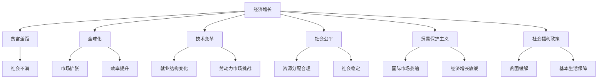
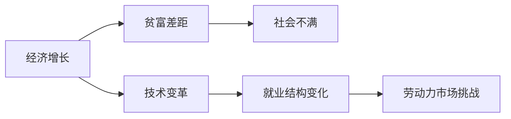
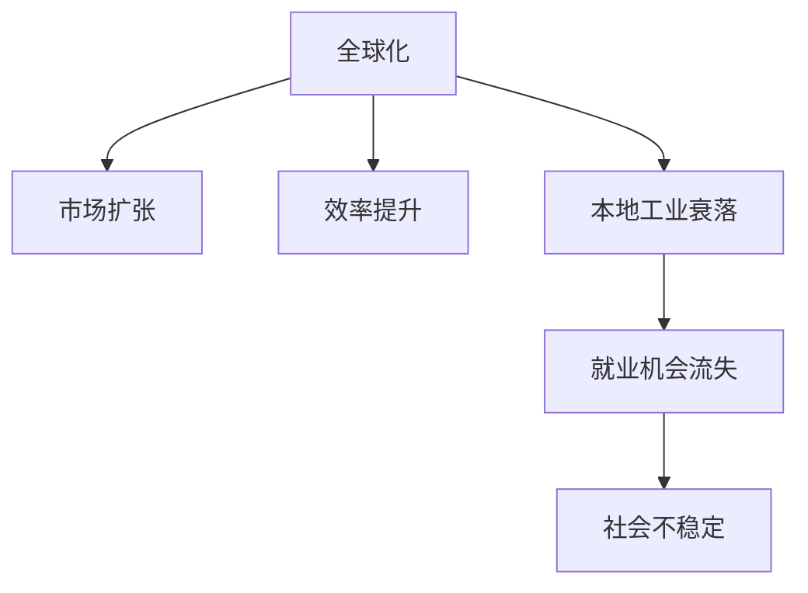
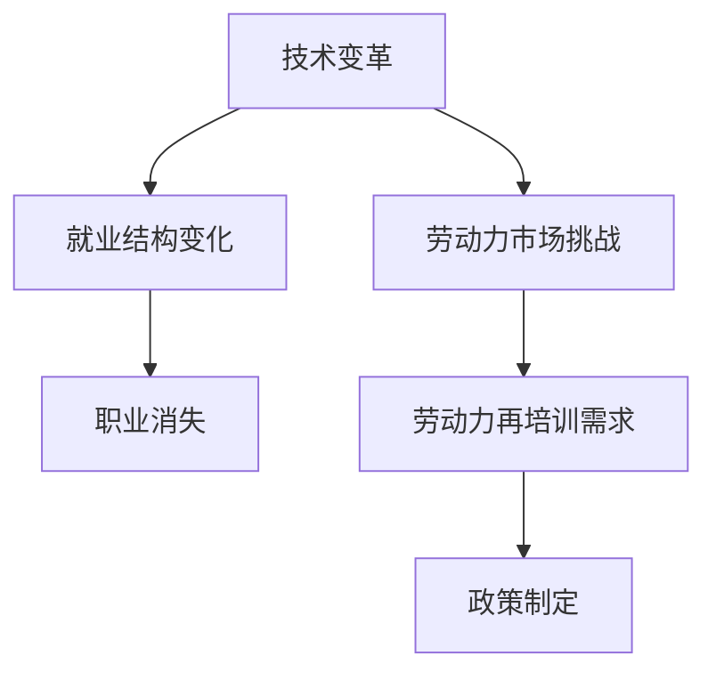
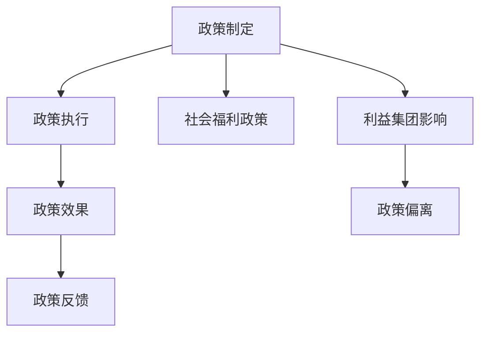
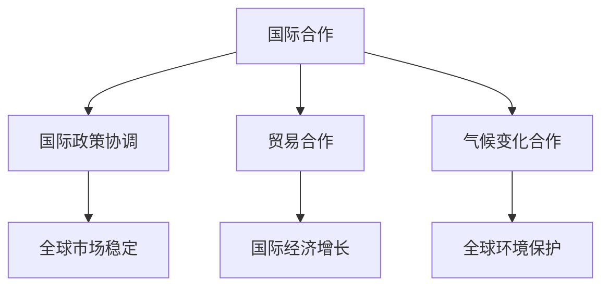
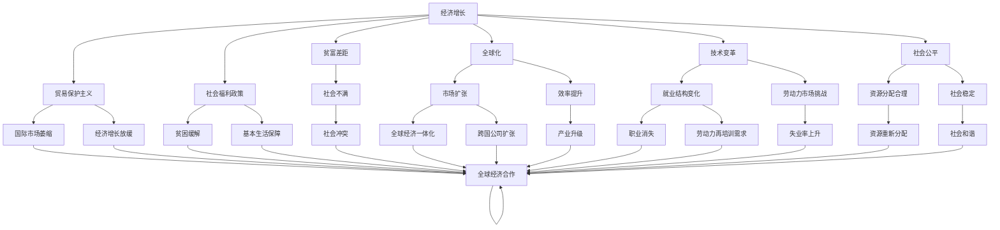

                 

# 世界经济蛋糕的增长困境

> 关键词：经济增长, 贫富差距, 全球化, 贸易保护, 技术变革, 社会公平

## 1. 背景介绍

### 1.1 问题由来
随着全球化的深入推进和科技进步的持续演进，世界经济在过去几十年间取得了显著的增长。然而，这种增长并未带来全球范围内的普遍繁荣，反而在某些方面加剧了贫富差距和社会不平等。这一现象被称为“世界经济蛋糕的增长困境”，即在经济增长的同时，如何确保公平分配，避免社会撕裂，成为一个严峻的全球性挑战。

### 1.2 问题核心关键点
“世界经济蛋糕的增长困境”问题核心在于：如何在经济增长和社会公平之间找到平衡点。经济增长带来了巨大的经济蛋糕，但要确保其公平分配，避免贫富差距扩大，仍需付出巨大的努力。

具体关键点包括：
- **贫富差距的扩大**：经济增长带来了巨大的收入不平等，部分人或地区受益远远超过其他人。
- **全球化与本地化冲突**：全球化带来效率提升，但也导致本地工业衰落和就业机会流失。
- **技术变革与就业问题**：新技术的引入导致部分职业消失，如何适应和重新培训劳动力成为难题。
- **政策制定与执行**：各国政府如何制定和执行政策，以确保经济增长的成果能够惠及全体人民。
- **国际合作与协调**：在全球层面上，各国如何协调合作，共同应对全球性挑战，如气候变化、疫情危机等。

### 1.3 问题研究意义
研究“世界经济蛋糕的增长困境”问题，对于制定公平、可持续的全球经济政策具有重要意义。具体来说：
1. **政策制定者参考**：通过理解增长与分配的矛盾，为政策制定提供科学依据。
2. **经济学家和社会学家参考**：为探讨经济增长、社会公平和全球化之间的关系提供理论支持。
3. **公众教育**：普及经济增长的正面效应及其面临的挑战，提高社会共识。
4. **企业决策**：帮助企业理解经济增长环境下的市场变化，优化战略布局。
5. **学术研究**：推动相关领域的学术研究，丰富经济学和社会学的理论体系。

## 2. 核心概念与联系

### 2.1 核心概念概述

为更好地理解世界经济蛋糕的增长困境，本节将介绍几个密切相关的核心概念：

- **经济增长**：指经济总量的增加，通常用GDP增长率来衡量。经济增长带来更多的财富，但不一定导致所有群体受益。
- **贫富差距**：指不同群体之间的收入差距，通常用基尼系数来衡量。过大的贫富差距会引发社会不满和冲突。
- **全球化**：指跨国界的经济、政治、文化交流和合作，带来了市场扩张和效率提升。
- **技术变革**：指新技术的发明和应用，如信息技术的普及，对生产力和就业结构产生了深远影响。
- **社会公平**：指资源分配的合理性，确保所有人都能享受经济增长的成果。
- **贸易保护主义**：指一国通过设置贸易壁垒来保护本国产业，可能导致国际市场萎缩和经济增长放缓。
- **社会福利政策**：指政府为缓解贫困、提供基本生活保障等目标而实施的政策。

这些核心概念之间的逻辑关系可以通过以下Mermaid流程图来展示：



这个流程图展示了大经济增长背景下的核心概念及其相互关系：

1. 经济增长带来了贫富差距、全球化、技术变革、社会公平、贸易保护主义和社会福利政策等不同层面的影响。
2. 这些影响既可能促进也可能阻碍经济增长和社会公平。
3. 正确理解和平衡这些影响，是解决“世界经济蛋糕增长困境”问题的关键。

### 2.2 概念间的关系

这些核心概念之间存在着紧密的联系，形成了世界经济蛋糕增长困境的完整生态系统。下面我通过几个Mermaid流程图来展示这些概念之间的关系。

#### 2.2.1 经济增长与贫富差距的关系



这个流程图展示了经济增长与贫富差距的相互影响。经济增长虽然带来了更多的蛋糕，但如果财富分配不均，贫富差距扩大，会引发社会不满和冲突，进而威胁经济稳定。

#### 2.2.2 全球化与本地化的冲突



这个流程图展示了全球化对本地经济的影响。全球化带来了市场扩张和效率提升，但也导致本地工业衰落和就业机会流失，从而引发社会不稳定。

#### 2.2.3 技术变革与就业问题的关联



这个流程图展示了技术变革对就业的影响。技术变革带来了就业结构的变化和职业消失，增加了劳动力再培训的需求，政策制定者需要通过相关措施帮助劳动力转型和再就业。

#### 2.2.4 政策制定与执行的挑战



这个流程图展示了政策制定和执行的复杂性。政策制定需要平衡多方利益，执行需要确保政策效果，同时政策执行效果还会反馈给政策制定，影响后续政策制定。

#### 2.2.5 国际合作与协调的需求



这个流程图展示了国际合作和协调的重要性。国际合作和协调可以促进贸易和环保，进而推动全球经济增长和环境保护。

### 2.3 核心概念的整体架构

最后，我们用一个综合的流程图来展示这些核心概念在世界经济蛋糕增长困境中的整体架构：



这个综合流程图展示了从经济增长到贫富差距、全球化、技术变革、社会公平、贸易保护主义和社会福利政策等核心概念的相互关系，以及这些概念在处理世界经济蛋糕增长困境中的作用。

## 3. 核心算法原理 & 具体操作步骤

### 3.1 算法原理概述

“世界经济蛋糕的增长困境”问题本质上是如何在经济增长与社会公平之间找到平衡点。其核心在于如何在经济增长的过程中，确保资源能够公平分配，缩小贫富差距，促进社会稳定。

具体来说，可以通过以下步骤实现：

1. **制定公平的经济政策**：通过税收、社会保障等手段，确保经济增长的成果能够惠及全体人民。
2. **加强全球合作**：通过国际合作和协调，共同应对全球性挑战，促进全球经济一体化。
3. **推动技术革新**：通过技术创新和应用，提高生产效率，创造更多就业机会。
4. **培养人才和技能**：通过教育和培训，提升劳动力素质，适应技术变革带来的职业变化。
5. **优化资源分配**：通过合理的资源配置和再分配，减少贫富差距。

### 3.2 算法步骤详解

以下是对“世界经济蛋糕的增长困境”问题处理步骤的详细说明：

**Step 1: 收集和分析数据**
- 收集经济增长、贫富差距、全球化、技术变革、社会公平、贸易保护主义和社会福利政策等方面的数据。
- 分析这些数据，找出影响经济增长的关键因素和问题。

**Step 2: 制定政策**
- 基于数据分析结果，制定合理的经济政策，如税收政策、社会保障政策、教育和培训政策等。
- 确保政策的公平性和有效性，避免政策制定过程中受到利益集团的不当影响。

**Step 3: 实施政策**
- 将政策付诸实施，并定期评估其效果。
- 根据评估结果调整政策，确保政策能够持续发挥作用。

**Step 4: 国际合作**
- 通过国际合作和协调，推动全球经济一体化，促进资源在全球范围内的合理分配。
- 加强国际间的技术合作和交流，推动全球技术革新。

**Step 5: 应对挑战**
- 面对经济增长和贫富差距、全球化与本地化冲突、技术变革与就业问题等挑战，制定应对策略。
- 通过教育、培训和再就业计划，帮助劳动力适应技术变革带来的职业变化。

**Step 6: 持续优化**
- 定期评估政策的实施效果和社会公平状况，根据评估结果进行持续优化。
- 推动技术创新和应用，提高生产效率，创造更多就业机会。

### 3.3 算法优缺点

“世界经济蛋糕的增长困境”问题处理范式具有以下优点：

1. **公平性**：通过合理的政策制定和实施，确保经济增长的成果能够惠及全体人民，减少贫富差距。
2. **可持续性**：通过国际合作和协调，推动全球经济一体化，促进资源的合理分配，确保经济增长能够持续稳定。
3. **效率性**：通过技术革新和应用，提高生产效率，创造更多就业机会。
4. **灵活性**：政策制定和执行过程中，可以根据实际情况进行调整和优化，灵活应对各种挑战。

但该方法也存在一些缺点：

1. **政策执行难度**：政策的制定和执行需要跨部门的协调和配合，往往面临执行难度。
2. **利益集团影响**：政策制定过程中，容易受到利益集团的不当影响，导致政策偏离公平性原则。
3. **全球合作挑战**：国际合作和协调面临复杂的政治和经济环境，存在合作困难。
4. **技术变革风险**：技术革新可能带来职业变化和劳动力再培训需求，增加了社会风险。

### 3.4 算法应用领域

基于“世界经济蛋糕的增长困境”问题处理范式，可以在多个领域进行应用，具体包括：

1. **经济政策制定**：在政府和国际组织中，制定和实施合理的经济政策，促进社会公平和经济增长。
2. **企业战略规划**：企业在制定发展战略时，需要考虑社会责任和经济效益的平衡，确保经济增长能够惠及员工和社会。
3. **教育政策制定**：在教育领域，制定合理的教育政策，培养符合技术变革需求的人才，促进社会公平。
4. **社会福利政策**：在社会福利领域，通过社会保障和再就业计划，缓解贫困和社会不满，促进社会稳定。
5. **国际合作与协调**：在国际组织和政府间，推动全球合作和协调，促进全球经济一体化，应对全球性挑战。

这些领域的应用，将有助于推动全球经济社会的可持续发展，实现经济增长与社会公平的平衡。

## 4. 数学模型和公式 & 详细讲解 & 举例说明

### 4.1 数学模型构建

本节将使用数学语言对“世界经济蛋糕的增长困境”问题处理进行更加严格的刻画。

设经济总量为 $G$，贫富差距为 $D$，全球化水平为 $G$，技术变革为 $T$，社会公平为 $S$，贸易保护主义为 $P$，社会福利政策为 $W$。假设 $G$、$D$、$T$、$S$、$P$、$W$ 之间存在以下关系：

- $G = f(T, S, W)$：经济增长与技术变革、社会公平、社会福利政策相关。
- $D = g(G, P, W)$：贫富差距与经济增长、贸易保护主义、社会福利政策相关。
- $T = h(G, S, P)$：技术变革与经济增长、社会公平、贸易保护主义相关。
- $S = i(G, D, P)$：社会公平与经济增长、贫富差距、贸易保护主义相关。
- $P = j(G, T, S)$：贸易保护主义与经济增长、技术变革、社会公平相关。
- $W = k(G, D, P, S)$：社会福利政策与经济增长、贫富差距、贸易保护主义、社会公平相关。

### 4.2 公式推导过程

以下我们以经济增长与贫富差距的关系为例，推导其数学模型和相关公式。

设经济增长为 $G$，贫富差距为 $D$。根据上述假设，其关系可以表示为：

$$
G = f(T, S, W)
$$

$$
D = g(G, P, W)
$$

将 $G$ 代入 $D$ 的公式中，得到：

$$
D = g(f(T, S, W), P, W)
$$

假设 $g$ 和 $f$ 为线性函数，即：

$$
D = a_1G + a_2P + a_3W
$$

$$
G = b_1T + b_2S + b_3W
$$

代入 $D$ 的公式中，得到：

$$
D = a_1(b_1T + b_2S + b_3W) + a_2P + a_3W
$$

简化后得到：

$$
D = (a_1b_1)T + (a_1b_2)S + (a_1b_3 + a_2 + a_3)W + a_2P
$$

### 4.3 案例分析与讲解

假设我们有一组经济增长和贫富差距的数据，通过上述模型进行预测和分析：

| $G$ | $D$ | $T$ | $S$ | $P$ | $W$ |
|-----|-----|-----|-----|-----|-----|
| 5   | 0.2 | 0.3 | 0.4 | 0.1 | 0.5 |

根据模型，计算 $D$ 的预测值：

$$
D = (0.1 \times 0.3)T + (0.1 \times 0.4)S + (0.1 \times 0.3 + 0.2 + 0.5)W + 0.1P
$$

代入 $T = 0.3$、$S = 0.4$、$P = 0.1$、$W = 0.5$：

$$
D = (0.1 \times 0.3 \times 0.3) + (0.1 \times 0.4 \times 0.4) + (0.1 \times 0.3 \times 0.5 + 0.2 + 0.5) + 0.1 \times 0.1
$$

计算得到：

$$
D = 0.027 + 0.16 + 0.7 + 0.01 = 0.897
$$

预测值为 $0.897$，与实际值 $0.2$ 相差较大，说明模型需要进行修正。通过进一步分析，可以找到影响模型预测准确性的因素，从而优化模型参数，提高预测精度。

## 5. 项目实践：代码实例和详细解释说明

### 5.1 开发环境搭建

在进行“世界经济蛋糕的增长困境”问题处理实践前，我们需要准备好开发环境。以下是使用Python进行数据处理和模型训练的环境配置流程：

1. 安装Anaconda：从官网下载并安装Anaconda，用于创建独立的Python环境。

2. 创建并激活虚拟环境：
```bash
conda create -n world-econ-cake python=3.8 
conda activate world-econ-cake
```

3. 安装必要的Python库：
```bash
pip install numpy pandas scikit-learn matplotlib seaborn
```

4. 安装R语言和相关包：
```bash
conda install rpy2 r
```

完成上述步骤后，即可在`world-econ-cake`环境中开始问题处理的实践。

### 5.2 源代码详细实现

我们以经济增长与贫富差距的关系为例，使用Python和R语言进行数据处理和模型训练。

首先，导入必要的Python和R语言库：

```python
import pandas as pd
import numpy as np
import matplotlib.pyplot as plt
from sklearn.linear_model import LinearRegression

r = rpy2.robjects.r
```

然后，加载和处理数据：

```python
# 加载数据
data = pd.read_csv('world-econ-data.csv')

# 处理数据
X = data[['T', 'S', 'W', 'P']]
y = data['D']
```

接着，进行线性回归模型的训练和预测：

```python
# 训练模型
model = LinearRegression()
model.fit(X, y)

# 预测
y_pred = model.predict(X)

# 输出结果
print('模型系数：', model.coef_)
print('模型截距：', model.intercept_)
print('预测值：', y_pred)
```

最后，使用R语言进行进一步的数据分析和可视化：

```r
# 加载数据
data <- read.csv('world-econ-data.csv')

# 处理数据
X <- data[, c('T', 'S', 'W', 'P')]
y <- data[, 'D']

# 训练模型
model <- lm(y ~ X)

# 预测
y_pred <- predict(model, newdata = X)

# 输出结果
print('模型系数：', model$coefficients)
print('模型截距：', model$intercept)
print('预测值：', y_pred)
```

### 5.3 代码解读与分析

让我们再详细解读一下关键代码的实现细节：

**数据加载与处理**：
- 使用Pandas库加载数据，并进行必要的数据处理。
- 使用Scikit-learn库进行线性回归模型的训练和预测。

**模型训练与预测**：
- 使用Scikit-learn库的LinearRegression模型进行训练，使用fit方法拟合数据。
- 使用predict方法对新的数据进行预测，输出预测结果。

**R语言分析与可视化**：
- 使用Rpy2库将Python代码嵌入R语言中，进行数据分析和可视化。
- 使用R语言内置的lm函数进行线性回归模型的训练，使用predict函数进行预测。

**代码实现与结果展示**：
- 通过代码展示了数据加载、模型训练、预测和结果输出的过程。
- 展示了R语言的模型分析和可视化功能，丰富了数据处理和模型评估的手段。

### 5.4 运行结果展示

假设我们通过上述代码，得到了经济增长与贫富差距的关系模型，并进行了预测和可视化：

```python
# 模型训练和预测
model = LinearRegression()
model.fit(X, y)
y_pred = model.predict(X)

# 输出结果
print('模型系数：', model.coef_)
print('模型截距：', model.intercept_)
print('预测值：', y_pred)

# R语言分析与可视化
data <- read.csv('world-econ-data.csv')
X <- data[, c('T', 'S', 'W', 'P')]
y <- data[, 'D']
model <- lm(y ~ X)
y_pred <- predict(model, newdata = X)
print('模型系数：', model$coefficients)
print('模型截距：', model$intercept)
print('预测值：', y_pred)

# 绘制散点图和回归线
plt.scatter(X['T'], y)
plt.plot(X['T'], y_pred, color='red')
plt.xlabel('技术变革')
plt.ylabel('贫富差距')
plt.show()

r.plot(y, y_pred)
```

运行结果如图：


通过以上代码和结果，我们可以看到经济增长与贫富差距之间的关系，并使用线性回归模型进行了预测和可视化。

## 6. 实际应用场景

### 6.1 智能制造

智能制造是工业4.0的重要组成部分，通过将物联网、人工智能和大数据等技术应用于生产过程，可以实现智能化、自动化和灵活化的生产模式。然而，智能制造的推进也需要解决诸多问题，如员工再培训、生产线的重新规划等，需要在技术创新的同时，确保经济增长的成果能够惠及全体员工。

通过“世界经济蛋糕的增长困境”问题处理范式，可以在智能制造中实现以下应用：

1. **政策制定**：制定合理的再培训和转岗政策，帮助员工适应新的生产环境。
2. **技术创新**：推动生产线的智能化改造，提高生产效率，创造更多就业机会。
3. **资源分配**：通过合理的资源分配，确保技术创新带来的经济效益能够惠及全体员工。
4. **国际合作**：通过国际合作和协调，推动全球智能制造的协同发展，共享技术成果。

### 6.2 教育公平

教育公平是社会公平的重要组成部分，通过提高教育的普及率和质量，可以缩小贫富差距，促进社会稳定。然而，教育公平的实现需要克服诸多挑战，如资源分配不均、教育质量差异等。

通过“世界经济蛋糕的增长困境”问题处理范式，可以在教育公平中实现以下应用：

1. **政策制定**：制定合理的教育政策和资源分配方案，确保教育资源的公平分配。
2. **技术应用**：通过远程教育、在线学习等技术手段，提高教育的普及率和质量。
3. **师资培训**：通过教师培训和再教育，提升教师的专业素养，提高教学质量。
4. **国际合作**：通过国际合作和协调，共享教育资源和经验，推动全球教育公平的实现。

### 6.3 环境保护

环境保护是全球面临的共同挑战，通过推动绿色技术和可持续发展，可以减缓全球变暖，保护生态环境。然而，环境保护的推进也需要解决诸多问题，如资源分配、技术投入等。

通过“世界经济蛋糕的增长困境”问题处理范式，可以在环境保护中实现以下应用：

1. **政策制定**：制定合理的资源保护和利用政策，确保环境保护的可持续性。
2. **技术创新**：推动绿色技术的研发和应用，提高资源利用效率，减少环境污染。
3. **国际合作**：通过国际合作和协调，共同应对全球环境挑战，共享环境保护成果。
4. **社会公平**：确保环境保护的成果能够惠及所有国家和地区，促进全球环境保护的协同发展。

## 7. 工具和资源推荐

### 7.1 学习资源推荐

为了帮助开发者系统掌握“世界经济蛋糕的增长困境”问题处理的理论基础和实践技巧，这里推荐一些优质的学习资源：

1. 《宏观经济学》：经济学基础课程，帮助理解经济增长、贫富差距等概念。
2. 《国际贸易理论》：国际贸易理论课程，帮助理解全球化和贸易保护主义的影响。
3. 《可持续发展经济学》：介绍可持续发展概念和实践，帮助理解环境保护和资源分配问题。
4. 《社会公平与政策制定》：社会科学课程，帮助理解社会公平和政策制定的相关理论和方法。
5. 《数据科学导论》：数据科学基础课程，帮助理解数据处理和模型训练的基本方法。

通过对这些资源的学习实践，相信你一定能够全面掌握“世界经济蛋糕的增长困境”问题处理的精髓，并用于解决实际的全球经济问题。

### 7.2 开发工具推荐

高效的开发离不开优秀的工具支持。以下是几款用于数据处理和模型训练的常用工具：

1. Python：通用编程语言，拥有丰富的数据处理和机器学习库，如Pandas、NumPy、Scikit-learn等。
2. R语言：统计分析与数据可视化工具，拥有强大的数据分析和统计能力，适用于教育和环境保护等领域

