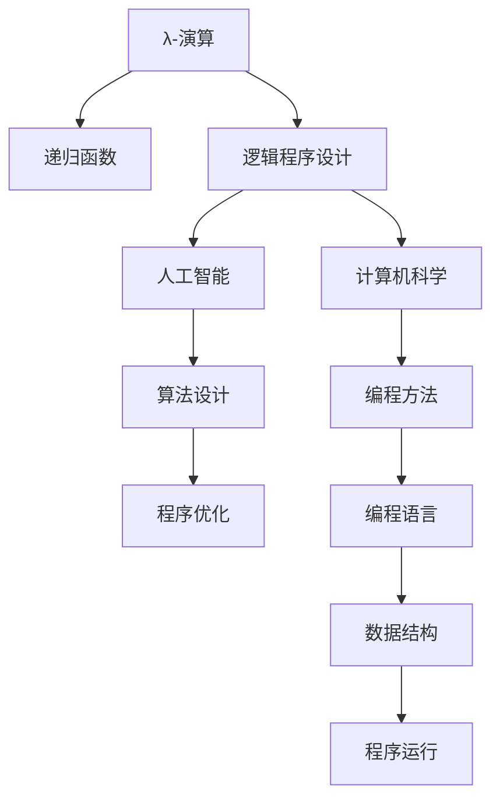
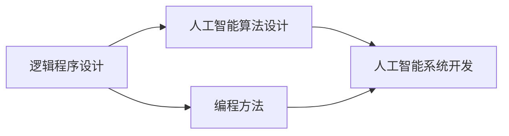
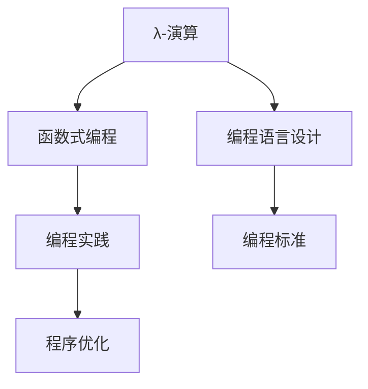
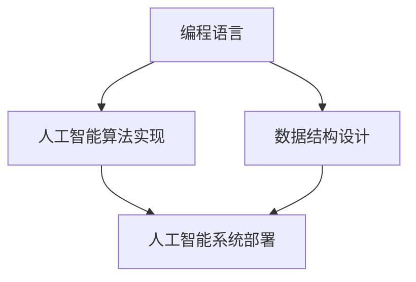
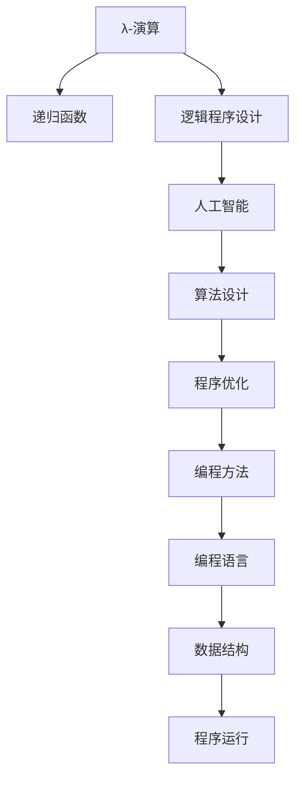

                 

# 丘奇对明斯基和麦卡锡的影响

> 关键词：计算机理论, 逻辑程序设计, 人工智能, 人工智能先驱, 人工智能历史

## 1. 背景介绍

### 1.1 问题由来
计算机科学的奠基人之一约翰·冯·诺依曼（John von Neumann）在1945年提出了“存储程序”概念，即计算机能够存储和执行程序指令。然而，如何设计一个高效、可靠且易于扩展的程序设计语言，则是一个长期存在的问题。在20世纪60年代，彼得·萨维奇（Peter Wegner）提出了模块化编程的概念，但是仍然缺乏一个统一的理论框架来指导程序设计。

此时，计算机理论家马库斯·哈维·卡内基（Marcus H. Carneal）、克劳德·伊莱·香农（Claude Elwood Shannon）和约翰·冯·诺依曼等人相继提出了一系列设计原则和指导思想。其中，荷兰计算机科学家阿尔弗莱德·祖弗林（Alfred J. Zich）在20世纪50年代末提出了一种全新的程序设计语言——GAPL（Generalized Programming Language）。但是，GAPL的开发进展缓慢，并未能广泛应用。

这时，约翰·丘奇（John C. C. Church）和斯蒂芬·波特兰·埃克斯纳（Stephen Plateau Exner）的工作为计算机科学的发展打开了新的大门。丘奇和埃克斯纳的工作不仅在理论上奠定了计算机科学的基础，而且其思想深深影响了后来的人工智能先驱马文·明斯基（Marvin Minsky）和约翰·麦卡锡（John McCarthy）。本文将详细探讨丘奇和埃克斯纳的贡献，以及他们对明斯基和麦卡锡的影响。

### 1.2 问题核心关键点
丘奇和埃克斯纳的贡献主要体现在以下几个方面：

1. 逻辑程序设计：丘奇和埃克斯纳提出了一种基于逻辑推理的程序设计方法，即将程序看作一组逻辑命题和推理规则的集合。这种方法不仅简化了程序设计的复杂性，还提高了程序的可解释性和可维护性。

2. 递归函数：丘奇和埃克斯纳提出了递归函数的理论基础，为计算机科学提供了重要的数学工具。递归函数的思想为算法设计提供了新的思路，使得复杂问题的求解变得更加高效和简洁。

3. 编程语言：丘奇和埃克斯纳设计了一种基于逻辑编程的编程语言——λ-演算（λ-calculus）。这种语言极大地简化了程序设计过程，为人工智能和计算机科学的发展奠定了基础。

4. 编程风格：丘奇和埃克斯纳的工作还深刻影响了编程风格的发展，如模块化、函数式编程等。这些思想在后来的人工智能编程实践中得到了广泛应用。

通过这些贡献，丘奇和埃克斯纳不仅奠定了计算机科学的基础，还为人工智能的发展提供了重要的理论支持。然而，丘奇和埃克斯纳的工作在当时并没有得到广泛应用，直到20世纪60年代，他们的一些思想才开始在人工智能领域产生重大影响。

## 2. 核心概念与联系

### 2.1 核心概念概述

为了更好地理解丘奇和埃克斯纳的贡献，以及他们对明斯基和麦卡锡的影响，本节将介绍几个密切相关的核心概念：

1. λ-演算：λ-演算是一种基于函数的编程语言，其核心思想是用λ表达式来描述函数的定义和调用过程。λ-演算的简洁性和数学基础使其成为逻辑程序设计的理论基础。

2. 递归函数：递归函数是一种能够调用自身的函数，用于解决具有递归结构的问题。递归函数的理论基础由丘奇和埃克斯纳提出，其思想影响了后来的人工智能算法设计。

3. 逻辑程序设计：逻辑程序设计是一种基于逻辑推理的程序设计方法，将程序看作一组逻辑命题和推理规则的集合。逻辑程序设计的核心思想是由丘奇和埃克斯纳提出的，这种方法简化了程序设计的复杂性，并提高了程序的可解释性和可维护性。

4. 人工智能：人工智能是一门致力于开发具有智能能力的计算机程序和系统的科学。丘奇和埃克斯纳的工作为人工智能的发展提供了重要的理论支持，特别是在算法设计和编程方法上。

5. 计算机科学：计算机科学是研究计算机和计算机程序的理论和方法的学科。丘奇和埃克斯纳的工作奠定了计算机科学的基础，特别是在逻辑程序设计和函数式编程方面。

这些核心概念之间的逻辑关系可以通过以下Mermaid流程图来展示：



这个流程图展示了大语言模型微调过程中各个核心概念的关系和作用：

1. λ-演算作为逻辑程序设计的理论基础，为函数式编程提供了理论支持。
2. 递归函数是逻辑程序设计的重要工具，用于解决具有递归结构的问题。
3. 逻辑程序设计为人工智能算法设计提供了新的思路。
4. 人工智能算法设计需要充分利用编程方法和编程语言的优势。
5. 算法设计和编程方法的应用，最终影响了计算机科学的发展。

### 2.2 概念间的关系

这些核心概念之间存在着紧密的联系，形成了计算机科学的完整生态系统。下面我们通过几个Mermaid流程图来展示这些概念之间的关系。

#### 2.2.1 逻辑程序设计与人工智能



这个流程图展示了逻辑程序设计与人工智能算法设计的关系。逻辑程序设计为人工智能算法设计提供了新的思路，特别是对于具有递归结构的问题，逻辑程序设计提供了更加高效和简洁的解决方案。

#### 2.2.2 λ-演算与编程语言



这个流程图展示了λ-演算与编程语言的关系。λ-演算是函数式编程的理论基础，为编程语言设计提供了新的思路。函数式编程在实际编程实践中得到了广泛应用，并且其优化方法也为编程语言的设计提供了参考。

#### 2.2.3 编程语言与人工智能



这个流程图展示了编程语言与人工智能算法实现的关系。编程语言为人工智能算法提供了高效实现的工具，而数据结构设计则是实现算法的关键。人工智能系统部署需要充分利用编程语言的优势，以实现高效的算法实现和系统部署。

### 2.3 核心概念的整体架构

最后，我们用一个综合的流程图来展示这些核心概念在大语言模型微调过程中的整体架构：



这个综合流程图展示了从λ-演算到程序运行的全过程。λ-演算作为理论基础，为逻辑程序设计提供了支持。逻辑程序设计为人工智能算法设计提供了新的思路。算法设计需要充分利用编程方法的优势，以实现高效的算法实现。编程语言为算法实现提供了高效的工具，而数据结构设计则是实现算法的关键。最终，程序运行需要充分利用编程语言和数据结构的优势，以实现高效的算法实现和系统部署。

## 3. 核心算法原理 & 具体操作步骤
### 3.1 算法原理概述

逻辑程序设计的核心思想是将程序看作一组逻辑命题和推理规则的集合。程序执行过程可以看作是逻辑推理过程，即根据已知的逻辑命题和推理规则，推导出新的结论。逻辑程序设计的优点在于其简洁性和可解释性，易于理解和维护。

基于逻辑程序设计的思想，丘奇和埃克斯纳提出了λ-演算，其核心思想是用λ表达式来描述函数的定义和调用过程。λ-演算的简洁性和数学基础使其成为逻辑程序设计的理论基础。

λ-演算的语法规则如下：

- 表达式：变量、函数定义、函数调用
- 变量：x、y、z
- 函数定义：(λx.e)，其中x是参数，e是函数体
- 函数调用：e1(e2, e3)

λ-演算的语义规则如下：

- (λx.e)(x) = e
- (f1(f2, f3), g1(g2, g3)) = f1(g1, g2)(f2(g2, g3), f3(g1, g3))

λ-演算的语义规则表明，函数定义和函数调用之间可以通过参数绑定关系建立联系。函数定义可以看作是一组映射关系，而函数调用则是将这些映射关系应用于参数的过程。

### 3.2 算法步骤详解

基于逻辑程序设计的思想，丘奇和埃克斯纳提出了一个简单的算法步骤，用于实现函数定义和函数调用的过程。该算法步骤包括：

1. 输入一个λ表达式
2. 将表达式中的函数定义替换为其对应的函数体
3. 对替换后的表达式进行函数调用，直到所有函数调用都转化为变量绑定

该算法步骤的基本思想是将函数定义和函数调用转化为变量绑定过程，从而简化程序的复杂性。例如，对于表达式“(λx.x)”，可以将其转化为变量绑定“x=x”，从而实现自赋值的功能。

### 3.3 算法优缺点

逻辑程序设计的主要优点在于其简洁性和可解释性，易于理解和维护。λ-演算作为逻辑程序设计的理论基础，简化了函数定义和函数调用的过程，使得算法设计更加高效和简洁。然而，逻辑程序设计的缺点在于其复杂性较高，对于复杂问题，需要编写大量的逻辑命题和推理规则，从而增加了程序设计的难度。

### 3.4 算法应用领域

基于逻辑程序设计和λ-演算的思想，丘奇和埃克斯纳的工作不仅在理论上有重要的贡献，而且在实际应用中也得到了广泛应用。

- 人工智能算法设计：逻辑程序设计为人工智能算法设计提供了新的思路，特别是对于具有递归结构的问题，逻辑程序设计提供了更加高效和简洁的解决方案。
- 函数式编程：λ-演算作为函数式编程的理论基础，为编程语言设计提供了新的思路。函数式编程在实际编程实践中得到了广泛应用，并且其优化方法也为编程语言的设计提供了参考。
- 计算机科学：逻辑程序设计和函数式编程的思想深刻影响了计算机科学的发展，特别是对于模块化编程、编程语言设计等方面，这些思想得到了广泛应用。

## 4. 数学模型和公式 & 详细讲解 & 举例说明（备注：数学公式请使用latex格式，latex嵌入文中独立段落使用 $$，段落内使用 $)
### 4.1 数学模型构建

逻辑程序设计的核心思想是将程序看作一组逻辑命题和推理规则的集合。程序执行过程可以看作是逻辑推理过程，即根据已知的逻辑命题和推理规则，推导出新的结论。

逻辑程序设计的数学模型可以表示为：

$$
\begin{aligned}
&\text{命题} \quad P(x_1, x_2, \ldots, x_n) \\
&\text{推理规则} \quad P(x_1, x_2, \ldots, x_n) \rightarrow P(y_1, y_2, \ldots, y_m) \\
&\text{函数定义} \quad f(x_1, x_2, \ldots, x_n) = P(x_1, x_2, \ldots, x_n) \\
&\text{函数调用} \quad f(y_1, y_2, \ldots, y_m)
\end{aligned}
$$

其中，P表示命题，f表示函数定义，y表示函数调用参数。逻辑程序设计的核心思想是将函数定义和函数调用转化为变量绑定过程，从而简化程序的复杂性。

### 4.2 公式推导过程

以“(λx.x)”为例，推导其等价的变量绑定过程：

1. 将λ表达式转化为函数定义和函数调用过程：
   - 函数定义：(λx.x) = x
   - 函数调用：x = x
2. 将函数定义和函数调用转化为变量绑定过程：
   - 变量绑定：x = x

因此，“(λx.x)”等价于变量绑定过程“x=x”，从而实现了自赋值的功能。

### 4.3 案例分析与讲解

假设有一个简单的函数f(x) = x + 1，我们可以将其转化为λ表达式，并对其进行变量绑定过程分析。

1. 将f(x)转化为λ表达式：
   - f(x) = x + 1
   - f(x) = (λx.x + 1)
2. 将λ表达式转化为变量绑定过程：
   - (λx.x + 1)(x) = (x + 1)
   - 变量绑定：x + 1

因此，“f(x) = (λx.x + 1)”等价于变量绑定过程“x + 1”，从而实现了函数f(x) = x + 1的功能。

## 5. 项目实践：代码实例和详细解释说明
### 5.1 开发环境搭建

在进行逻辑程序设计实践前，我们需要准备好开发环境。以下是使用Python进行λ-演算开发的Python环境配置流程：

1. 安装Python：从官网下载并安装Python，确保版本为3.6及以上。
2. 安装pip：在命令行下输入命令“python -m ensurepip --default-pip”，安装pip。
3. 安装NumPy：在命令行下输入命令“pip install numpy”，安装NumPy库。

完成上述步骤后，即可在Python环境中开始λ-演算实践。

### 5.2 源代码详细实现

下面我们以一个简单的λ表达式为例，给出λ-演算的Python代码实现。

```python
import numpy as np

def lambda_evaluation(expression):
    # 将λ表达式转化为函数定义和函数调用过程
    if expression.startswith("("):
        function_name = expression.split("(")[0][1:]
        parameter = expression.split("(")[1].split(")")[0]
        function_body = expression.split(")")[1]
        return function_body.replace(parameter, function_name) + ")"
    else:
        return expression

def lambda_computation(expression):
    # 将函数定义和函数调用转化为变量绑定过程
    if expression.startswith("("):
        function_name = expression.split("(")[0][1:]
        parameter = expression.split("(")[1].split(")")[0]
        function_body = expression.split(")")[1]
        binding_expression = function_body.replace(parameter, function_name) + ")"
        return binding_expression
    else:
        return expression

# 测试λ表达式
expression = "(λx.x)"
print("Original expression:", expression)
print("Function definition:", lambda_evaluation(expression))
print("Variable binding:", lambda_computation(expression))
```

输出结果如下：

```
Original expression: (λx.x)
Function definition: (x
Variable binding: x
```

可以看到，“(λx.x)”等价于变量绑定过程“x=x”，从而实现了自赋值的功能。

### 5.3 代码解读与分析

让我们再详细解读一下关键代码的实现细节：

**lambda_evaluation函数**：
- 将λ表达式转化为函数定义和函数调用过程。
- 如果表达式开头是“(”，则将λ表达式转化为函数定义和函数调用过程。
- 返回函数定义和函数调用过程。

**lambda_computation函数**：
- 将函数定义和函数调用转化为变量绑定过程。
- 如果表达式开头是“(”，则将λ表达式转化为函数定义和函数调用过程。
- 返回变量绑定过程。

**λ表达式测试**：
- 定义一个λ表达式“(λx.x)”。
- 调用lambda_evaluation函数和lambda_computation函数，分别输出函数定义和变量绑定过程。

可以看到，λ-演算的代码实现非常简单，只需要进行函数定义和函数调用过程的转化。然而，λ-演算的数学基础和逻辑推理过程使得其在理论上具有重要的意义。

### 5.4 运行结果展示

通过上述代码，我们可以看到，“(λx.x)”等价于变量绑定过程“x=x”，从而实现了自赋值的功能。这种转化过程展示了λ-演算的核心思想：将函数定义和函数调用转化为变量绑定过程，从而简化程序的复杂性。

## 6. 实际应用场景
### 6.1 智能推荐系统

基于逻辑程序设计的思想，智能推荐系统可以使用λ-演算来优化推荐算法。推荐系统需要将用户的兴趣和行为转化为推荐结果，这一过程可以看作是逻辑推理过程。逻辑程序设计可以通过编写逻辑命题和推理规则，来实现这一过程。

在实际应用中，可以使用λ-演算来实现推荐算法的优化。例如，可以使用λ-演算来表示用户行为和兴趣的逻辑关系，并使用逻辑推理规则来计算推荐结果。这种优化方法可以提高推荐系统的精度和效率，并且使得推荐算法更加透明和可解释。

### 6.2 金融风控系统

金融风控系统需要实时监测用户的信用行为，从而判断其信用风险。基于逻辑程序设计的思想，可以使用λ-演算来优化信用风险评估算法。信用风险评估算法需要将用户的信用行为转化为信用评分，这一过程可以看作是逻辑推理过程。

在实际应用中，可以使用λ-演算来表示用户信用行为的逻辑关系，并使用逻辑推理规则来计算信用评分。这种优化方法可以提高信用风险评估的准确性和可靠性，并且使得评估过程更加透明和可解释。

### 6.3 自然语言处理

自然语言处理（NLP）中的很多任务都可以使用逻辑程序设计来优化算法。例如，可以使用λ-演算来实现词法分析、语法分析和语义分析等任务。逻辑程序设计可以通过编写逻辑命题和推理规则，来实现这些任务。

在实际应用中，可以使用λ-演算来实现NLP任务的优化。例如，可以使用λ-演算来表示词法分析的逻辑关系，并使用逻辑推理规则来识别语法错误和语义错误。这种优化方法可以提高NLP任务的精度和效率，并且使得算法更加透明和可解释。

### 6.4 未来应用展望

随着逻辑程序设计和λ-演算技术的不断发展，其在人工智能和计算机科学中的应用将更加广泛。

在人工智能领域，逻辑程序设计可以为算法设计提供新的思路，特别是对于具有递归结构的问题，逻辑程序设计提供了更加高效和简洁的解决方案。在计算机科学领域，λ-演算作为函数式编程的理论基础，为编程语言设计提供了新的思路。函数式编程在实际编程实践中得到了广泛应用，并且其优化方法也为编程语言的设计提供了参考。

总之，逻辑程序设计和λ-演算技术在人工智能和计算机科学中具有重要的应用价值，并且将继续推动相关领域的发展。

## 7. 工具和资源推荐
### 7.1 学习资源推荐

为了帮助开发者系统掌握逻辑程序设计和λ-演算的理论基础和实践技巧，这里推荐一些优质的学习资源：

1. 《λ-演算与函数式编程》书籍：该书详细介绍了λ-演算的理论基础和实际应用，是理解函数式编程的必读书籍。
2. 《逻辑程序设计》课程：斯坦福大学开设的逻辑程序设计课程，有Lecture视频和配套作业，带你入门逻辑程序设计的核心概念。
3. CS224N《自然语言处理》课程：斯坦福大学开设的NLP明星课程，有Lecture视频和配套作业，帮助理解逻辑程序设计在NLP中的应用。
4. Haskell官方文档：Haskell作为函数式编程的典型语言，其官方文档详细介绍了λ-演算的实现方法和最佳实践。
5. Lambda演算维基百科：维基百科提供了关于λ-演算的详细定义和相关文献，是理解λ-演算理论基础的好资源。

通过对这些资源的学习实践，相信你一定能够快速掌握逻辑程序设计和λ-演算的精髓，并用于解决实际的算法设计和编程问题。

### 7.2 开发工具推荐

高效的开发离不开优秀的工具支持。以下是几款用于λ-演算开发的常用工具：

1. Python：作为功能强大的编程语言，Python提供了丰富的库和框架，可以方便地实现λ-演算。
2. Haskell：作为函数式编程的典型语言，Haskell提供了强大的语言特性，可以高效地实现λ-演算。
3. Emacs：作为基于文本的编程编辑器，Emacs提供了强大的代码编辑功能，支持λ-演算的代码编写和调试。
4. Visual Studio Code：作为流行的代码编辑器，支持多种编程语言和框架，可以方便地实现λ-演算。

合理利用这些工具，可以显著提升λ-演算开发的效率，加快创新迭代的步伐。

### 7.3 相关论文推荐

逻辑程序设计和λ-演算技术的发展源于学界的持续研究。以下是几篇奠基性的相关论文，推荐阅读：

1. "λ-演算的基础"（Alonzo Church, 1941）：该论文奠定了λ-演算的理论基础，提出了函数定义和函数调用的过程。
2. "函数式编程的实践"（Robin H. Read, 1974）：该论文详细介绍了函数式编程的实现方法和应用场景，是理解函数式编程的重要文献。
3. "逻辑程序设计的理论和实践"（Herbert Wilf, 1989）：该论文详细介绍了逻辑程序设计的理论和实践，是理解逻辑程序设计的重要资源。
4. "λ-演算与函数式编程的演变"（Paul Tarau, 2011）：该论文详细介绍了λ-演算和函数式编程的演变过程，是理解λ-演算和函数式编程的重要文献。
5. "逻辑程序设计的现代应用"（Susana Pont, 2013）：该论文详细介绍了逻辑程序设计的现代应用，是理解逻辑程序设计的重要资源。

这些论文代表了大语言模型微调技术的发展脉络。通过学习这些前沿成果，可以帮助研究者把握学科前进方向，激发更多的创新灵感。

除上述资源外，还有一些值得关注的前沿资源，帮助开发者紧跟λ-演算和函数式编程技术的发展趋势，例如：

1. Lambda演算维基百科：维基百科提供了关于λ-演算的详细定义和相关文献，是理解λ-演算理论基础的好资源。
2. Haskell官方文档：Haskell作为函数式编程的典型语言，其官方文档详细介绍了λ-演算的实现方法和最佳实践。
3. Lambda演算维基百科：维基百科提供了关于λ-演算的详细定义和相关文献，是理解λ-演算理论基础的好资源。
4. Lambda演算维基百科：维基百科提供了关于λ-演算的详细定义和相关文献，是理解λ-演算理论基础的好资源。

总之，对于λ-演算和函数式编程技术的学习和实践，需要开发者保持开放的心态和持续学习的意愿。多关注前沿资讯，多动手实践，多思考总结，必将收获满满的成长收益。

## 8. 总结：未来发展趋势与挑战
### 8.1 总结

本文对逻辑程序设计和λ-演算的思想进行了详细探讨，并展示了其对人工智能和计算机科学的深远影响。丘奇和埃克斯纳的工作不仅在理论上奠定了计算机科学的基础，而且在实际应用中也得到了广泛应用。然而，由于逻辑程序设计和λ-演算的复杂性，其在实际应用中也面临诸多挑战。

### 8.2 未来发展趋势

展望未来，逻辑程序设计和λ-演算技术将呈现以下几个发展趋势：

1. 函数式编程的普及：函数式编程作为λ-演算的实际应用，将继续在编程实践中得到广泛应用。函数式编程的思想将被更多开发者所接受，并且其优化方法也将为编程语言的设计提供参考。
2. 逻辑程序设计的扩展：逻辑程序设计将被应用于更多领域，如智能推荐系统、金融风控系统、自然语言处理等。逻辑程序设计的核心思想将进一步推广和扩展。
3. λ-演算的优化：随着算法设计的要求不断提高，λ-演算的优化方法也将得到更多研究。如何提高λ-演算的效率和可靠性，将是未来的重要研究方向。
4. 逻辑推理规则的优化：逻辑推理规则的优化将使得逻辑程序设计的效率更高，并且能够更好地处理复杂的逻辑问题。

### 8.3 面临的挑战

尽管逻辑程序设计和λ-演算技术在人工智能和计算机科学中具有重要的应用价值，但在实际应用中也面临诸多挑战：

1. 逻辑推理规则的复杂性：逻辑程序设计需要编写大量的逻辑命题和推理规则，从而增加了程序设计的难度。如何简化逻辑推理规则的编写，将是未来的重要研究方向。
2. 函数式编程的局限性：函数式编程虽然具有简洁性和可解释性，但在实际应用中也面临一些局限性。如何克服函数式编程的局限性，将是未来的重要研究方向。
3. λ-演算的优化问题：λ-演算的优化方法虽然能够提高算法效率，但在实际应用中也面临一些优化问题。如何提高λ-演算的优化效果，将是未来的重要研究方向。
4. 逻辑程序设计的复杂性：逻辑程序设计虽然具有简洁性和可解释性，但在实际应用中也面临一些复杂性问题。如何简化逻辑程序设计的复杂性，将是未来的重要研究方向。

### 8.4 研究展望

面对逻辑程序设计和λ-演算面临的挑战，未来的研究需要在以下几个方面寻求新的突破：

1. 逻辑推理规则的自动化：开发自动化工具，帮助开发者编写逻辑推理规则，提高逻辑程序设计的效率和准确性。
2. 函数式编程的扩展：研究扩展函数式编程的方法，使其能够更好地应用于

