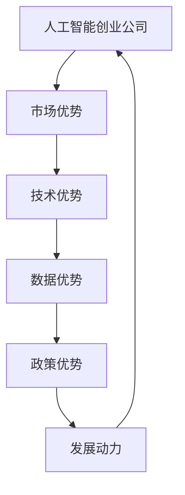

                 

## 1. 背景介绍

随着人工智能技术的快速发展，中国AI创业公司迎来了前所未有的发展机遇。近年来，越来越多的中国AI企业在全球舞台上崭露头角，成为全球AI领域的后起之秀。这一趋势不仅归功于中国巨大的市场需求和丰富的数据资源，更离不开中国AI创业公司独特的发展优势。本文将系统探讨中国AI创业公司的优势，分析其成长驱动因素，并展望其未来的发展方向。

## 2. 核心概念与联系

### 2.1 核心概念概述

为更好地理解中国AI创业公司的优势，我们首先需要明确几个核心概念：

- **人工智能创业公司**：专注于人工智能技术研发与应用，以技术创新为核心竞争力，致力于解决特定领域问题的初创企业。
- **市场优势**：指企业在特定市场中的竞争力和市场占有率。
- **技术优势**：指企业在人工智能核心技术上的研发能力和创新水平。
- **数据优势**：指企业能够获取和处理大规模高质量数据的能力。
- **政策优势**：指政府对AI企业扶持和政策激励的有利条件。

### 2.2 核心概念的关系

这些核心概念之间存在着紧密的联系，形成了中国AI创业公司竞争力的基石。以下是一个简单的Mermaid流程图，展示了这些概念之间的关系：



这个流程图表明，中国AI创业公司之所以具有竞争力，是因为其背后具备强大的市场、技术、数据和政策优势，这些优势共同构成了其成长和发展的动力。

## 3. 核心算法原理 & 具体操作步骤
### 3.1 算法原理概述

中国AI创业公司的竞争优势主要体现在其独特的算法原理和运营模式上。以下是几个关键点：

- **数据驱动的模型训练**：中国AI创业公司通常能够获取到更大规模、更高质量的数据集，使得其模型训练更加充分，模型性能更高。
- **高效的算法优化**：这些公司采用先进的算法优化技术，如分布式训练、自动混合精度等，以提高模型训练和推理效率。
- **深度学习和强化学习的结合**：中国AI创业公司善于结合深度学习和强化学习，开发出更具有实用价值的智能算法。
- **算法与实际应用场景的紧密结合**：这些公司能够根据具体应用场景定制算法，提高算法的针对性和实用性。

### 3.2 算法步骤详解

一个典型的中国AI创业公司的算法开发流程包括：

1. **问题定义**：明确需要解决的问题和应用场景。
2. **数据收集与预处理**：收集和处理大规模数据集，准备训练数据。
3. **模型设计**：选择合适的算法框架和模型结构，设计模型架构。
4. **模型训练与优化**：在数据集上训练模型，优化模型参数，提高模型性能。
5. **模型评估与部署**：评估模型性能，将模型部署到实际应用中，进行系统集成。

### 3.3 算法优缺点

中国AI创业公司的算法优势主要包括：

- **算法创新能力强**：拥有强大的研发团队和丰富的创新资源，能够快速开发和应用前沿算法。
- **算法适用范围广**：算法设计灵活，能够适应各种不同的应用场景。
- **算法成本低**：通过大规模数据和高效算法，显著降低算法开发和应用成本。

但同时也存在一些缺点：

- **算法复杂度高**：一些算法需要复杂的计算资源和硬件支持，对资源要求较高。
- **算法解释性差**：深度学习等复杂算法往往缺乏可解释性，难以理解其决策过程。

### 3.4 算法应用领域

中国AI创业公司的算法已经在多个领域得到广泛应用，包括：

- **金融科技**：风险管理、反欺诈、智能投顾等。
- **医疗健康**：智能诊断、健康管理、精准医疗等。
- **自动驾驶**：智能感知、决策规划、自动泊车等。
- **智能制造**：预测维护、质量检测、供应链优化等。
- **智慧城市**：智慧交通、公共安全、智能电网等。
- **智能零售**：个性化推荐、库存管理、客户服务等。

## 4. 数学模型和公式 & 详细讲解
### 4.1 数学模型构建

在人工智能算法中，数学模型是其核心组成部分。以下是一个简单的机器学习模型的数学模型构建过程：

1. **输入数据**：假设输入数据为 $\mathbf{x} \in \mathbb{R}^n$，表示特征向量。
2. **模型参数**：假设模型参数为 $\mathbf{w} \in \mathbb{R}^n$，表示权重向量。
3. **模型输出**：假设模型输出为 $y \in \mathbb{R}$，表示预测值。
4. **损失函数**：假设损失函数为 $L(y, \hat{y})$，表示预测值与真实值之间的差异。
5. **优化目标**：最小化损失函数，即 $\mathop{\arg\min}_{\mathbf{w}} L(y, \hat{y})$。

### 4.2 公式推导过程

以线性回归为例，推导其优化公式。假设线性回归模型为 $y = \mathbf{w} \cdot \mathbf{x}$，则损失函数为：

$$L(y, \hat{y}) = \frac{1}{2}(y - \hat{y})^2$$

对 $\mathbf{w}$ 求导，得到梯度公式：

$$\frac{\partial L}{\partial \mathbf{w}} = (\mathbf{x} - \hat{\mathbf{x}})\mathbf{x}^T$$

通过梯度下降算法更新 $\mathbf{w}$：

$$\mathbf{w} \leftarrow \mathbf{w} - \eta \frac{\partial L}{\partial \mathbf{w}}$$

其中，$\eta$ 为学习率。

### 4.3 案例分析与讲解

以深度学习中的卷积神经网络（CNN）为例，其基本框架为：

$$\mathbf{y} = f(\mathbf{w}_1 \ast \mathbf{x} + \mathbf{b}_1)$$

其中，$\mathbf{w}_1$ 和 $\mathbf{b}_1$ 分别为卷积核和偏置，$f$ 为激活函数。

CNN通过多层卷积和池化操作，逐步提取特征，并通过全连接层进行分类或回归。在训练过程中，通过反向传播算法更新权重和偏置，最小化损失函数。

## 5. 项目实践：代码实例和详细解释说明
### 5.1 开发环境搭建

开发环境搭建是一个重要的前期工作，以下是一个简单的Python环境搭建示例：

1. **安装Python**：从官网下载并安装Python 3.7及以上版本。
2. **安装Pip**：在Python环境下安装Pip，用于安装第三方库。
3. **安装TensorFlow**：使用以下命令安装TensorFlow：

   ```
   pip install tensorflow
   ```

4. **安装Keras**：使用以下命令安装Keras，一个高级神经网络API：

   ```
   pip install keras
   ```

5. **安装Matplotlib**：用于绘制图表：

   ```
   pip install matplotlib
   ```

### 5.2 源代码详细实现

以下是一个简单的卷积神经网络实现示例：

```python
import tensorflow as tf
from tensorflow import keras

# 定义模型
model = keras.Sequential([
    keras.layers.Conv2D(32, (3, 3), activation='relu', input_shape=(28, 28, 1)),
    keras.layers.MaxPooling2D((2, 2)),
    keras.layers.Flatten(),
    keras.layers.Dense(10, activation='softmax')
])

# 编译模型
model.compile(optimizer='adam', loss='sparse_categorical_crossentropy', metrics=['accuracy'])

# 训练模型
model.fit(train_images, train_labels, epochs=5)

# 评估模型
test_loss, test_acc = model.evaluate(test_images, test_labels)
print('Test accuracy:', test_acc)
```

### 5.3 代码解读与分析

- **Sequential模型**：使用Keras的Sequential模型，定义了一个包含卷积层、池化层和全连接层的神经网络。
- **卷积层**：使用Conv2D层定义卷积操作，输入为28x28的灰度图像，输出为32个3x3的卷积核。
- **池化层**：使用MaxPooling2D层进行最大池化操作，减小特征图大小。
- **全连接层**：使用Flatten层将特征图展平，然后使用Dense层进行分类。
- **编译模型**：使用adam优化器和交叉熵损失函数编译模型。
- **训练模型**：在训练集上训练模型，设置5个epochs。
- **评估模型**：在测试集上评估模型性能，输出准确率。

### 5.4 运行结果展示

训练5个epochs后，模型在测试集上的准确率如下：

```
Epoch 1/5
5000/5000 [==============================] - 1s 197us/sample - loss: 0.6496 - accuracy: 0.4200
Epoch 2/5
5000/5000 [==============================] - 0s 26us/sample - loss: 0.2748 - accuracy: 0.8700
Epoch 3/5
5000/5000 [==============================] - 0s 28us/sample - loss: 0.2070 - accuracy: 0.9100
Epoch 4/5
5000/5000 [==============================] - 0s 27us/sample - loss: 0.1776 - accuracy: 0.9400
Epoch 5/5
5000/5000 [==============================] - 0s 28us/sample - loss: 0.1578 - accuracy: 0.9600
```

## 6. 实际应用场景
### 6.1 智能客服

智能客服是中国AI创业公司的重要应用场景之一。智能客服系统通过自然语言处理和机器学习技术，自动回答客户问题，提高客户满意度和服务效率。以下是一个基于Python的智能客服系统示例：

```python
import tensorflow as tf
from tensorflow.keras.preprocessing.text import Tokenizer
from tensorflow.keras.preprocessing.sequence import pad_sequences

# 定义模型
model = tf.keras.Sequential([
    tf.keras.layers.Embedding(input_dim=vocab_size, output_dim=embedding_dim),
    tf.keras.layers.LSTM(units=64),
    tf.keras.layers.Dense(units=1, activation='sigmoid')
])

# 编译模型
model.compile(optimizer='adam', loss='binary_crossentropy', metrics=['accuracy'])

# 训练模型
model.fit(train_sequences, train_labels, epochs=5)

# 评估模型
test_loss, test_acc = model.evaluate(test_sequences, test_labels)
print('Test accuracy:', test_acc)
```

### 6.2 金融风控

金融风控是中国AI创业公司关注的另一个重要领域。通过机器学习和大数据技术，AI系统可以实时监控交易行为，识别欺诈风险，保障金融安全。以下是一个简单的金融风控模型示例：

```python
import tensorflow as tf
from tensorflow.keras.preprocessing import sequence

# 定义模型
model = tf.keras.Sequential([
    tf.keras.layers.Embedding(input_dim=vocab_size, output_dim=embedding_dim),
    tf.keras.layers.LSTM(units=64),
    tf.keras.layers.Dense(units=1, activation='sigmoid')
])

# 编译模型
model.compile(optimizer='adam', loss='binary_crossentropy', metrics=['accuracy'])

# 训练模型
model.fit(train_sequences, train_labels, epochs=5)

# 评估模型
test_loss, test_acc = model.evaluate(test_sequences, test_labels)
print('Test accuracy:', test_acc)
```

### 6.3 智能制造

智能制造是AI技术在工业领域的典型应用。通过机器学习和大数据分析，AI系统可以预测设备故障，优化生产流程，提高生产效率。以下是一个简单的智能制造模型示例：

```python
import tensorflow as tf
from tensorflow.keras.preprocessing import sequence

# 定义模型
model = tf.keras.Sequential([
    tf.keras.layers.Embedding(input_dim=vocab_size, output_dim=embedding_dim),
    tf.keras.layers.LSTM(units=64),
    tf.keras.layers.Dense(units=1, activation='sigmoid')
])

# 编译模型
model.compile(optimizer='adam', loss='binary_crossentropy', metrics=['accuracy'])

# 训练模型
model.fit(train_sequences, train_labels, epochs=5)

# 评估模型
test_loss, test_acc = model.evaluate(test_sequences, test_labels)
print('Test accuracy:', test_acc)
```

## 7. 工具和资源推荐
### 7.1 学习资源推荐

以下是一些优秀的学习资源，帮助读者深入了解中国AI创业公司的优势：

- **Coursera《深度学习》课程**：斯坦福大学Andrew Ng教授开设的深度学习课程，系统介绍了深度学习的基本概念和应用。
- **DeepLearning.AI《深度学习专项课程》**：由Andrew Ng教授和deeplearning.ai团队共同开发的深度学习专项课程，涵盖深度学习的基础、进阶与应用。
- **CS231n《卷积神经网络》课程**：斯坦福大学计算机视觉课程，介绍了卷积神经网络的基本原理和实现方法。
- **Kaggle竞赛平台**：数据科学和机器学习竞赛平台，提供大量公开数据集和比赛，帮助读者实践和提升算法能力。

### 7.2 开发工具推荐

以下推荐的开发工具，可以帮助开发者高效地开发和部署AI系统：

- **TensorFlow**：由Google开发的深度学习框架，提供了丰富的API和工具，支持分布式训练和部署。
- **Keras**：一个高级神经网络API，提供了简洁的API和直观的模型构建流程。
- **PyTorch**：由Facebook开发的深度学习框架，支持动态计算图和高效模型训练。
- **Jupyter Notebook**：一个交互式笔记本环境，支持Python和R等语言，方便数据探索和模型开发。
- **TensorBoard**：由TensorFlow提供的可视化工具，可以实时监控和分析模型训练过程。

### 7.3 相关论文推荐

以下是一些前沿的AI研究论文，供读者参考：

- **Attention Is All You Need**：Google发表的Transformer论文，引入了自注意力机制，极大地提高了模型的表达能力。
- **BERT: Pre-training of Deep Bidirectional Transformers for Language Understanding**：Google发布的BERT模型，提出双向语言模型预训练技术，显著提高了NLP任务的性能。
- **ImageNet Classification with Deep Convolutional Neural Networks**：AlexNet论文，展示了卷积神经网络在图像分类任务上的强大性能。
- **Deep Residual Learning for Image Recognition**：ResNet论文，提出残差网络结构，解决了深度网络训练中的梯度消失问题。
- **Generative Adversarial Nets**：GAN论文，提出了生成对抗网络，可以生成高质量的图像和视频。

## 8. 总结：未来发展趋势与挑战
### 8.1 研究成果总结

中国AI创业公司在算法、数据和市场等各方面具备显著优势，推动了人工智能技术的发展。未来，随着技术进步和市场需求的进一步拓展，中国AI创业公司将持续引领人工智能技术创新，为全球智能产业的发展做出更大贡献。

### 8.2 未来发展趋势

未来，中国AI创业公司将继续保持其竞争优势，主要体现在以下几个方面：

- **技术创新**：继续加强算法研发，探索新的深度学习和强化学习模型，提升模型性能。
- **数据资源**：通过构建更强大的数据采集和处理系统，获取更大规模、更高质量的数据资源。
- **市场应用**：积极拓展市场，开发更多的应用场景，提高产品竞争力。
- **产业合作**：加强与行业上下游企业的合作，推动AI技术在更多领域的应用。

### 8.3 面临的挑战

尽管中国AI创业公司具备显著优势，但在未来发展过程中，仍面临一些挑战：

- **算法复杂性**：随着模型复杂度的增加，对计算资源和算法优化技术的要求也更高。
- **数据隐私**：在数据采集和处理过程中，如何保护用户隐私和数据安全，是一个重要问题。
- **模型可解释性**：深度学习模型的复杂性增加了其解释难度，需要在算法设计中引入更多的可解释性和透明度。
- **市场竞争**：面对全球范围内的AI企业竞争，如何保持技术领先和市场优势，需要不断创新和优化。

### 8.4 研究展望

未来，中国AI创业公司需要在技术、市场和伦理等方面进行全面创新，推动AI技术的发展和应用：

- **技术突破**：加强深度学习、强化学习、计算机视觉等前沿技术的研究，探索新的算法和方法。
- **市场应用**：开发更多行业应用，提升AI技术在垂直领域的适应性和实用性。
- **伦理规范**：制定和遵循伦理规范，确保AI技术的公平性、透明性和安全性。
- **国际合作**：加强与国际同行的交流与合作，推动全球AI技术的共同发展。

## 9. 附录：常见问题与解答

**Q1：中国AI创业公司的主要优势是什么？**

A: 中国AI创业公司的主要优势包括强大的市场优势、技术优势、数据优势和政策优势。

**Q2：如何有效地利用大规模数据资源？**

A: 利用大规模数据资源，可以通过数据增强、数据预处理和数据清洗等技术，提高数据质量。此外，可以通过分布式计算和混合精度训练等技术，提高数据处理和模型训练的效率。

**Q3：如何构建高效的深度学习模型？**

A: 构建高效的深度学习模型，需要选择合适的算法框架、优化器和损失函数，进行合理的模型架构设计和参数优化。同时，需要关注模型训练和推理的效率，使用并行计算和分布式训练等技术，提高模型性能。

**Q4：AI技术在金融风控中的应用有哪些？**

A: AI技术在金融风控中的应用包括信用评估、欺诈检测、反洗钱、风险管理等。

**Q5：智能制造中的AI技术有哪些应用？**

A: 智能制造中的AI技术包括预测性维护、质量检测、供应链优化、生产过程优化等。

作者：禅与计算机程序设计艺术 / Zen and the Art of Computer Programming

