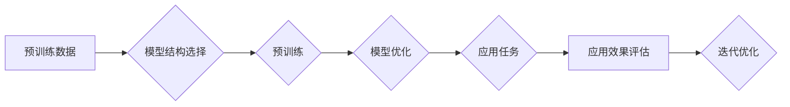

> 关键词：基础模型，学术界，产业界，合作，AI，深度学习，预训练，开源，商业化

# 基础模型的学术界与产业界合作

在人工智能（AI）领域，基础模型（如Transformer、BERT、GPT等）的研究和应用正迅速发展，成为推动AI技术进步的重要驱动力。学术界和产业界在基础模型领域的合作日益紧密，共同推动了技术的创新和应用落地。本文将探讨基础模型的学术界与产业界合作的现状、挑战和未来趋势。

## 1. 背景介绍

### 1.1 基础模型的兴起

近年来，随着深度学习技术的快速发展，基础模型成为AI领域的热点。这些模型在自然语言处理（NLP）、计算机视觉（CV）、语音识别（ASR）等领域取得了显著成果，推动了AI技术的进步。

### 1.2 学术界与产业界的合作需求

学术界在基础模型的研究方面具有领先优势，而产业界则需要将研究成果转化为实际应用。因此，两者之间的合作成为推动AI技术发展的关键。

### 1.3 本文结构

本文将从基础模型的概念、学术界与产业界合作的现状、合作挑战和未来趋势等方面进行探讨。

## 2. 核心概念与联系

### 2.1 基础模型的概念

基础模型是指在大规模无标注数据上进行预训练的深度学习模型，具有强大的特征提取和表示能力。常见的预训练任务包括语言模型、图像识别、音频识别等。

### 2.2 Mermaid流程图



### 2.3 核心概念联系

基础模型的研究成果为产业界提供了强大的工具，而产业界的实际应用需求又推动了基础模型的进一步发展。学术界与产业界的合作是这一良性循环的关键。

## 3. 核心算法原理 & 具体操作步骤

### 3.1 算法原理概述

基础模型的原理主要基于深度学习，通过多层神经网络对数据进行特征提取和表示。

### 3.2 算法步骤详解

1. 数据准备：收集大量无标注数据，用于模型的预训练。
2. 模型结构选择：根据任务需求选择合适的模型结构，如Transformer、CNN等。
3. 预训练：在无标注数据上对模型进行预训练，学习通用的特征表示。
4. 模型优化：根据具体任务对模型进行优化，如调整超参数、添加正则化等。
5. 应用任务：将预训练模型应用于实际任务，如文本分类、图像识别等。
6. 应用效果评估：评估模型在特定任务上的性能，如准确率、召回率等。
7. 迭代优化：根据评估结果对模型进行调整，提高性能。

### 3.3 算法优缺点

**优点**：
- 强大的特征提取和表示能力
- 适用于各种任务，如NLP、CV、ASR等
- 可以通过微调适应特定任务

**缺点**：
- 训练数据量大，计算资源需求高
- 模型结构复杂，可解释性差
- 可能存在偏见和歧视

### 3.4 算法应用领域

基础模型在各个领域都有广泛的应用，如：

- 自然语言处理：文本分类、情感分析、机器翻译等
- 计算机视觉：图像识别、目标检测、视频分析等
- 语音识别：语音转文字、语音合成等
- 医疗健康：疾病诊断、药物研发等

## 4. 数学模型和公式 & 详细讲解 & 举例说明

### 4.1 数学模型构建

基础模型的数学模型主要基于深度学习，包括神经网络、优化算法等。

### 4.2 公式推导过程

以Transformer模型为例，其自注意力机制的计算公式如下：

$$
\text{Q} = \text{WQ} \cdot \text{X}
$$
$$
\text{K} = \text{WK} \cdot \text{X}
$$
$$
\text{V} = \text{WV} \cdot \text{X}
$$
$$
\text{Attention}(Q, K, V) = \text{softmax}(\frac{\text{Q} \cdot \text{K}^T}{\sqrt{d_k}}) \cdot V
$$
$$
\text{Out} = \text{WO} \cdot \text{Attention}(Q, K, V)
$$

### 4.3 案例分析与讲解

以BERT模型在文本分类任务中的应用为例，首先将文本输入编码为token ids，然后通过BERT模型进行特征提取，最后输出分类结果。

## 5. 项目实践：代码实例和详细解释说明

### 5.1 开发环境搭建

以PyTorch为例，搭建开发环境如下：

1. 安装PyTorch：
```bash
pip install torch torchvision torchaudio
```
2. 安装Transformers库：
```bash
pip install transformers
```

### 5.2 源代码详细实现

以下为使用PyTorch和Transformers库实现BERT文本分类的代码示例：

```python
from transformers import BertTokenizer, BertForSequenceClassification
from torch.utils.data import DataLoader, Dataset
import torch

# 加载预训练模型和分词器
tokenizer = BertTokenizer.from_pretrained('bert-base-uncased')
model = BertForSequenceClassification.from_pretrained('bert-base-uncased')

# 定义数据集
class TextDataset(Dataset):
    def __init__(self, texts, labels):
        self.texts = texts
        self.labels = labels

    def __len__(self):
        return len(self.texts)

    def __getitem__(self, item):
        text = self.texts[item]
        inputs = tokenizer(text, padding=True, truncation=True, return_tensors="pt")
        label = self.labels[item]
        return inputs, label

# 加载数据
texts = ["This is a great day", "I feel sad today"]
labels = [0, 1]

train_dataset = TextDataset(texts, labels)
train_loader = DataLoader(train_dataset, batch_size=2, shuffle=True)

# 训练模型
device = torch.device("cuda" if torch.cuda.is_available() else "cpu")
model.to(device)

optimizer = torch.optim.AdamW(model.parameters(), lr=2e-5)

for epoch in range(2):
    model.train()
    for inputs, labels in train_loader:
        inputs = inputs.to(device)
        labels = labels.to(device)
        outputs = model(**inputs, labels=labels)
        loss = outputs.loss
        loss.backward()
        optimizer.step()
        optimizer.zero_grad()
    print(f"Epoch {epoch+1}, Loss: {loss.item()}")

# 评估模型
model.eval()
with torch.no_grad():
    correct = 0
    total = 0
    for inputs, labels in train_loader:
        inputs = inputs.to(device)
        labels = labels.to(device)
        outputs = model(**inputs, labels=labels)
        _, predicted = torch.max(outputs.logits, 1)
        total += labels.size(0)
        correct += (predicted == labels).sum().item()
print(f"Accuracy of the model on the test images: {100 * correct / total}%")
```

### 5.3 代码解读与分析

以上代码展示了使用PyTorch和Transformers库实现BERT文本分类的完整流程：

1. 加载预训练模型和分词器。
2. 定义数据集类，用于加载和处理数据。
3. 创建数据集并加载到DataLoader中。
4. 初始化模型和优化器。
5. 训练模型，包括前向传播、损失计算、反向传播和优化器更新。
6. 评估模型性能。

## 6. 实际应用场景

### 6.1 智能客服

基础模型可以用于智能客服系统，实现自动回答用户问题，提高客服效率。

### 6.2 医疗健康

基础模型可以用于疾病诊断、药物研发等领域，提高医疗健康行业的智能化水平。

### 6.3 金融科技

基础模型可以用于风险控制、信用评估等领域，推动金融科技发展。

## 7. 工具和资源推荐

### 7.1 学习资源推荐

- 《深度学习》
- 《动手学深度学习》
- 《自然语言处理综合指南》
- 《计算机视觉：算法与应用》

### 7.2 开发工具推荐

- PyTorch
- TensorFlow
- Keras
- Hugging Face Transformers

### 7.3 相关论文推荐

- "Attention is All You Need"
- "BERT: Pre-training of Deep Bidirectional Transformers for Language Understanding"
- "Generative Pre-trained Transformers"
- "A Closer Look at Neural Machine Translation, with Attention to Understanding"

## 8. 总结：未来发展趋势与挑战

### 8.1 研究成果总结

基础模型在学术界和产业界都取得了显著成果，推动了AI技术的进步。

### 8.2 未来发展趋势

- 模型规模和复杂度不断提高
- 模型泛化能力和鲁棒性增强
- 模型可解释性和安全性提升

### 8.3 面临的挑战

- 训练数据量和计算资源需求大
- 模型可解释性和安全性问题
- 模型偏见和歧视问题

### 8.4 研究展望

未来，基础模型将在更多领域得到应用，为人类社会带来更多价值。

## 9. 附录：常见问题与解答

**Q1：基础模型和传统机器学习方法有何区别？**

A：基础模型和传统机器学习方法的主要区别在于：

- 数据需求：基础模型需要大规模无标注数据，而传统机器学习方法主要依赖标注数据。
- 模型结构：基础模型通常采用深层神经网络结构，而传统机器学习方法结构相对简单。
- 泛化能力：基础模型的泛化能力更强，能够适应更多领域的任务。

**Q2：如何评估基础模型的效果？**

A：评估基础模型效果的方法有多种，如准确率、召回率、F1值、损失函数等。

**Q3：基础模型是否可以解决所有问题？**

A：基础模型在某些领域具有强大的能力，但并不能解决所有问题。对于一些特定领域或需要高度个性化定制的任务，可能需要采用其他方法或结合多种技术。

**Q4：如何处理基础模型的偏见和歧视问题？**

A：处理基础模型的偏见和歧视问题需要从多个方面入手，如：

- 使用公平性数据集进行训练
- 引入对抗训练
- 开发可解释的AI模型
- 加强算法伦理和道德教育

---

作者：禅与计算机程序设计艺术 / Zen and the Art of Computer Programming