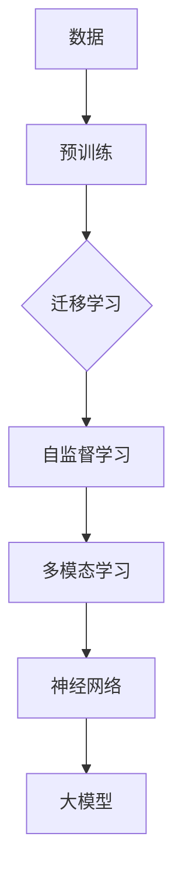

# 大模型：引领科技革命的核心力量

> 关键词：大模型，人工智能，机器学习，深度学习，预训练，迁移学习，自然语言处理，计算机视觉

## 1. 背景介绍

随着计算能力的提升和数据量的爆炸式增长，人工智能（AI）领域取得了前所未有的进展。其中，大模型（Large Models）作为一种革命性的技术，正在引领着科技革命的新浪潮。大模型通过学习海量数据，具备了强大的理解、推理和生成能力，正在深刻地改变着各个行业和我们的生活。

### 1.1 问题的由来

传统的机器学习模型通常需要大量的标注数据来训练，这对于数据量有限的领域是一个巨大的挑战。此外，不同的任务往往需要不同的模型，这导致了模型的可复用性差。大模型的兴起，正是为了解决这些问题。

### 1.2 研究现状

大模型的研究始于20世纪90年代的神经网络研究，但直到近年来，随着计算能力的提升和数据量的爆炸式增长，大模型才开始真正崭露头角。目前，大模型在自然语言处理（NLP）、计算机视觉（CV）等领域取得了显著的成果。

### 1.3 研究意义

大模型的研究意义在于：

- **提高模型性能**：大模型能够学习到更丰富的特征和模式，从而在各个领域实现更高的性能。
- **降低数据需求**：大模型可以通过迁移学习，在少量标注数据的情况下，仍然能够取得不错的效果。
- **提升模型泛化能力**：大模型能够在不同的任务和领域之间迁移知识，从而提高模型的泛化能力。

### 1.4 本文结构

本文将分为以下几个部分：

- 介绍大模型的核心概念与联系。
- 阐述大模型的核心算法原理和具体操作步骤。
- 讲解大模型的数学模型和公式，并举例说明。
- 展示大模型的项目实践，包括代码实例和详细解释。
- 探讨大模型的实际应用场景和未来应用展望。
- 推荐大模型相关的学习资源、开发工具和论文。
- 总结大模型的研究成果、未来发展趋势和面临的挑战。

## 2. 核心概念与联系

大模型涉及的核心概念包括：

- **神经网络**：大模型通常基于神经网络架构，特别是深度神经网络。
- **预训练**：大模型通过在大规模无标注数据上进行预训练，学习到通用的特征表示。
- **迁移学习**：大模型可以将预训练的知识迁移到不同的任务和领域。
- **自监督学习**：大模型可以通过自监督学习任务来提高模型的泛化能力。
- **多模态学习**：大模型可以同时处理多种类型的数据，如文本、图像和语音。

下面是大模型的核心概念原理和架构的 Mermaid 流程图：



## 3. 核心算法原理 & 具体操作步骤

### 3.1 算法原理概述

大模型的核心算法原理是神经网络，特别是深度神经网络。通过多层神经网络，大模型可以学习到更高级的特征和模式。

### 3.2 算法步骤详解

大模型的算法步骤包括：

1. **数据收集**：收集大规模无标注数据，用于预训练。
2. **预训练**：在大规模无标注数据上进行预训练，学习到通用的特征表示。
3. **迁移学习**：将预训练的知识迁移到不同的任务和领域。
4. **自监督学习**：通过自监督学习任务来提高模型的泛化能力。
5. **多模态学习**：同时处理多种类型的数据，如文本、图像和语音。

### 3.3 算法优缺点

大模型的优点包括：

- **性能高**：大模型能够学习到更丰富的特征和模式，从而在各个领域实现更高的性能。
- **泛化能力强**：大模型可以通过迁移学习，在新的任务和领域之间迁移知识，从而提高模型的泛化能力。

大模型的缺点包括：

- **数据需求大**：大模型需要大量的标注数据来训练。
- **计算成本高**：大模型的训练需要大量的计算资源。

### 3.4 算法应用领域

大模型的应用领域包括：

- **自然语言处理**：文本分类、机器翻译、问答系统等。
- **计算机视觉**：图像分类、目标检测、图像生成等。
- **语音识别**：语音识别、语音合成等。

## 4. 数学模型和公式 & 详细讲解 & 举例说明

### 4.1 数学模型构建

大模型的数学模型通常基于深度神经网络，包括多层感知器（MLP）、卷积神经网络（CNN）和循环神经网络（RNN）等。

### 4.2 公式推导过程

以下是一个简单的多层感知器（MLP）的数学模型：

$$
\begin{align*}
z_1 &= W_1 \cdot x + b_1 \\
a_1 &= \sigma(z_1) \\
z_2 &= W_2 \cdot a_1 + b_2 \\
a_2 &= \sigma(z_2) \\
\end{align*}
$$

其中，$W_1$ 和 $W_2$ 是权重矩阵，$b_1$ 和 $b_2$ 是偏置项，$x$ 是输入向量，$a_1$ 和 $a_2$ 是激活后的输出向量，$\sigma$ 是激活函数，通常使用Sigmoid或ReLU函数。

### 4.3 案例分析与讲解

以下是一个简单的文本分类任务的例子：

- **数据集**：包含10,000个样本，每个样本是一个句子和对应的标签。
- **模型**：使用一个简单的MLP模型进行分类。
- **任务**：将句子分类为两类，如正面和负面。

通过训练，模型可以学习到如何根据句子的特征来判断其情感倾向。

## 5. 项目实践：代码实例和详细解释说明

### 5.1 开发环境搭建

以下是使用PyTorch对文本分类任务进行大模型微调的代码实例。

```python
# 导入必要的库
import torch
import torch.nn as nn
import torch.optim as optim
from torch.utils.data import DataLoader, Dataset

# 定义数据集
class TextDataset(Dataset):
    def __init__(self, texts, labels):
        self.texts = texts
        self.labels = labels

    def __len__(self):
        return len(self.texts)

    def __getitem__(self, idx):
        return self.texts[idx], self.labels[idx]

# 定义模型
class TextClassifier(nn.Module):
    def __init__(self, vocab_size, embedding_dim, hidden_dim, output_dim):
        super(TextClassifier, self).__init__()
        self.embedding = nn.Embedding(vocab_size, embedding_dim)
        self.rnn = nn.LSTM(embedding_dim, hidden_dim)
        self.fc = nn.Linear(hidden_dim, output_dim)

    def forward(self, text):
        embedded = self.embedding(text)
        output, (hidden, cell) = self.rnn(embedded)
        return self.fc(hidden.squeeze(0))

# 加载数据
texts = [...]  # 文本数据
labels = [...]  # 标签数据
dataset = TextDataset(texts, labels)
dataloader = DataLoader(dataset, batch_size=32, shuffle=True)

# 初始化模型和优化器
model = TextClassifier(vocab_size=10000, embedding_dim=100, hidden_dim=128, output_dim=2)
optimizer = optim.Adam(model.parameters(), lr=0.001)

# 训练模型
for epoch in range(5):
    for texts, labels in dataloader:
        optimizer.zero_grad()
        output = model(texts)
        loss = nn.CrossEntropyLoss()(output, labels)
        loss.backward()
        optimizer.step()

    print(f'Epoch {epoch+1}, Loss: {loss.item()}')
```

### 5.2 源代码详细实现

上述代码实现了一个简单的文本分类模型，使用PyTorch框架进行训练。

### 5.3 代码解读与分析

- `TextDataset` 类用于定义数据集，包括文本和标签。
- `TextClassifier` 类定义了模型结构，包括嵌入层、RNN层和全连接层。
- 使用DataLoader来批量加载数据。
- 使用Adam优化器和交叉熵损失函数来训练模型。

### 5.4 运行结果展示

运行上述代码后，模型将在训练集上进行训练，并在每个epoch后打印出损失值。

## 6. 实际应用场景

大模型在以下实际应用场景中取得了显著成效：

- **自然语言处理**：机器翻译、问答系统、情感分析等。
- **计算机视觉**：图像分类、目标检测、图像生成等。
- **语音识别**：语音识别、语音合成等。
- **推荐系统**：个性化推荐、商品推荐等。
- **医疗健康**：疾病诊断、药物研发等。

## 7. 工具和资源推荐

### 7.1 学习资源推荐

- 《深度学习》
- 《Python深度学习》
- 《动手学深度学习》
- Hugging Face Transformers库文档
- PyTorch官方文档

### 7.2 开发工具推荐

- PyTorch
- TensorFlow
- Hugging Face Transformers库
- CUDA

### 7.3 相关论文推荐

- "A Neural Probabilistic Language Model" (2013) by Karpathy and Khosla
- "BERT: Pre-training of Deep Bidirectional Transformers for Language Understanding" (2018) by Devlin et al.
- "Generative Adversarial Nets" (2014) by Goodfellow et al.
- "Incorporating Language into Image Description" (2014) by Vinyals et al.

## 8. 总结：未来发展趋势与挑战

### 8.1 研究成果总结

大模型的研究取得了显著的成果，在各个领域都取得了突破性的进展。

### 8.2 未来发展趋势

未来，大模型将朝着以下方向发展：

- **更大规模**：模型的规模将越来越大，能够学习到更丰富的特征和模式。
- **更高效**：模型的训练和推理效率将得到提升，降低计算成本。
- **更智能**：模型将具备更强的智能能力，能够更好地理解人类语言和意图。

### 8.3 面临的挑战

大模型的研究也面临着以下挑战：

- **数据隐私**：如何保护用户数据隐私是一个重要的挑战。
- **模型可解释性**：如何提高模型的可解释性，使其决策过程更加透明。
- **伦理道德**：如何确保模型的应用符合伦理道德标准。

### 8.4 研究展望

未来，大模型的研究将不断深入，为人类社会带来更多福祉。

## 9. 附录：常见问题与解答

**Q1：大模型和传统模型有什么区别？**

A1：大模型与传统模型的主要区别在于规模和复杂性。大模型通常具有更大的规模和更复杂的结构，能够学习到更丰富的特征和模式。

**Q2：大模型的训练需要多少数据？**

A2：大模型的训练需要大量的数据，通常需要数百万到数十亿个样本。

**Q3：大模型的应用前景如何？**

A3：大模型的应用前景非常广阔，将在各个领域发挥重要作用。

**Q4：大模型的安全性如何保证？**

A4：大模型的安全性是一个重要的问题，需要采取多种措施来保证，如数据加密、访问控制等。

---

作者：禅与计算机程序设计艺术 / Zen and the Art of Computer Programming