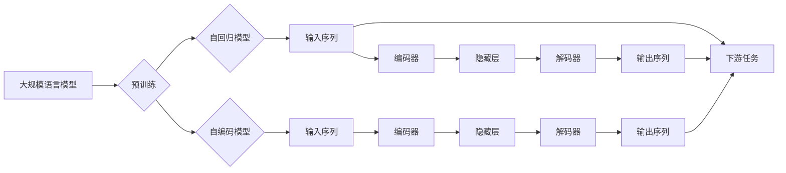

# 大规模语言模型从理论到实践 大语言模型的构建流程

> 关键词：大规模语言模型，预训练，自回归模型，自编码模型，Transformer，BERT，迁移学习，下游任务

## 1. 背景介绍

随着深度学习技术的迅猛发展，自然语言处理（NLP）领域取得了令人瞩目的成就。其中，大规模语言模型（Large Language Models，LLMs）以其卓越的性能和强大的功能，成为了NLP领域的研究热点。本文将深入探讨大规模语言模型的构建流程，从理论到实践，帮助读者全面理解这一前沿技术。

### 1.1 问题的由来

传统的NLP任务通常需要针对具体任务进行设计，如文本分类、机器翻译、情感分析等。这种方法在处理复杂任务时往往效率低下，且难以泛化到新的任务。大规模语言模型的出现，正是为了解决这一问题。通过在大量无标注语料上进行预训练，模型能够学习到丰富的语言知识，从而在下游任务中表现出强大的泛化能力。

### 1.2 研究现状

目前，大规模语言模型的研究主要集中在以下几个方面：

- 预训练模型的设计：包括自回归模型、自编码模型、Transformer等。
- 预训练任务的设计：如语言建模、掩码语言模型、掩码填充等。
- 微调策略：如任务适配、参数高效微调、知识蒸馏等。
- 应用场景：如文本生成、问答系统、机器翻译、代码生成等。

### 1.3 研究意义

研究大规模语言模型，对于推动NLP技术的发展、促进人工智能的应用具有重要意义：

- 提高NLP任务的效率和准确率。
- 降低NLP任务的开发成本。
- 促进跨领域知识的共享和利用。
- 推动人工智能技术在更多领域的应用。

## 2. 核心概念与联系

### 2.1 核心概念

- **大规模语言模型（LLMs）**：通过在大量无标注语料上进行预训练，学习到丰富的语言知识，具备强大的语言理解和生成能力的模型。
- **预训练（Pre-training）**：在大量无标注语料上进行训练，使模型具备通用语言能力的过程。
- **自回归模型（Autoregressive Model）**：根据前面的输入序列预测下一个token的模型，如GPT系列模型。
- **自编码模型（Autoencoder）**：通过编码器压缩输入序列，再通过解码器重建输入序列的模型，如BERT模型。
- **Transformer**：一种基于自注意力机制的深度神经网络结构，能够捕捉输入序列中长距离依赖关系。
- **迁移学习（Transfer Learning）**：将一个领域学习到的知识迁移应用到另一个领域的学习范式。
- **下游任务（Downstream Task）**：在预训练模型的基础上，针对具体任务进行训练和应用的任务。

### 2.2 核心概念原理和架构的 Mermaid 流程图



## 3. 核心算法原理 & 具体操作步骤

### 3.1 算法原理概述

大规模语言模型的构建流程主要包括以下几个步骤：

1. **数据收集与预处理**：收集大量无标注语料，并进行预处理，如分词、去噪等。
2. **预训练**：在无标注语料上进行预训练，使模型学习到丰富的语言知识。
3. **下游任务适配**：根据具体任务的需求，对模型进行适配，如添加下游任务层、修改损失函数等。
4. **微调**：在下游任务的数据集上进行微调，使模型在特定任务上取得更好的性能。
5. **评估与部署**：在测试集上评估模型性能，并在实际应用中部署模型。

### 3.2 算法步骤详解

#### 3.2.1 数据收集与预处理

数据收集与预处理是大规模语言模型构建的基础。以下是一些常见的预处理步骤：

- **分词**：将文本分割成单词或子词。
- **去噪**：去除文本中的噪声，如标点符号、停用词等。
- **编码**：将文本转换为模型可处理的格式，如word2vec、BERT的token ids等。

#### 3.2.2 预训练

预训练是大规模语言模型构建的核心步骤。以下是一些常见的预训练任务：

- **语言建模**：预测下一个token的概率。
- **掩码语言模型（Masked Language Model，MLM）**：对输入序列中的部分token进行掩码，预测掩码token的概率。
- **掩码填充（MaskedLM）**：预测输入序列中被掩码的token。

#### 3.2.3 下游任务适配

根据具体任务的需求，对模型进行适配。以下是一些常见的适配方法：

- **添加下游任务层**：在预训练模型的顶层添加新的层，如分类器、解码器等。
- **修改损失函数**：根据具体任务设计合适的损失函数。

#### 3.2.4 微调

在下游任务的数据集上进行微调，使模型在特定任务上取得更好的性能。以下是一些常见的微调方法：

- **参数高效微调**：只更新部分参数，如Adapter、LoRA等。
- **知识蒸馏**：将知识从大模型传递到小模型。

#### 3.2.5 评估与部署

在测试集上评估模型性能，并在实际应用中部署模型。

### 3.3 算法优缺点

#### 3.3.1 优点

- **强大的泛化能力**：在大量无标注语料上进行预训练，模型能够学习到丰富的语言知识，从而在下游任务中表现出强大的泛化能力。
- **高效性**：预训练模型在下游任务中只需进行微调，无需从头开始训练，从而提高开发效率。
- **灵活性**：可以根据具体任务的需求，对模型进行灵活适配。

#### 3.3.2 缺点

- **资源消耗大**：预训练和微调都需要大量的计算资源和存储空间。
- **需要大量标注数据**：在下游任务中进行微调时，通常需要一定量的标注数据。
- **可解释性差**：大规模语言模型的决策过程难以解释。

### 3.4 算法应用领域

大规模语言模型在NLP领域有着广泛的应用，以下是一些常见的应用领域：

- **文本分类**：如新闻分类、情感分析、主题分类等。
- **机器翻译**：如英译中、中译英等。
- **问答系统**：如机器阅读理解、知识图谱问答等。
- **文本生成**：如文本摘要、对话生成等。

## 4. 数学模型和公式 & 详细讲解 & 举例说明

### 4.1 数学模型构建

大规模语言模型通常采用深度神经网络作为其核心架构。以下是一个简单的神经网络模型：

$$
y = f(W \cdot x + b)
$$

其中，$x$ 是输入，$W$ 是权重矩阵，$b$ 是偏置项，$f$ 是激活函数。

### 4.2 公式推导过程

以下是一个简单的神经网络模型的梯度下降优化过程：

$$
\theta_{t+1} = \theta_t - \eta \nabla_\theta J(\theta_t)
$$

其中，$\theta$ 是模型参数，$J(\theta)$ 是损失函数，$\eta$ 是学习率。

### 4.3 案例分析与讲解

以BERT模型为例，介绍其数学模型和公式推导过程。

BERT模型采用Transformer结构，其自注意力机制的计算公式如下：

$$
Q = W_Q \cdot X \quad K = W_K \cdot X \quad V = W_V \cdot X
$$

其中，$W_Q$、$W_K$、$W_V$ 是权重矩阵，$X$ 是输入序列。

自注意力机制的输出计算公式如下：

$$
\text{attn\_output} = \text{softmax}(\text{query} \cdot \text{key}^T) \cdot \text{value}
$$

其中，$\text{query}$、$\text{key}$、$\text{value}$ 分别是自注意力机制的查询、键和值。

## 5. 项目实践：代码实例和详细解释说明

### 5.1 开发环境搭建

以下是使用Python和PyTorch构建大规模语言模型的开发环境搭建步骤：

1. 安装Python 3.8及以上版本。
2. 安装PyTorch：`pip install torch torchvision torchaudio`
3. 安装Transformers库：`pip install transformers`

### 5.2 源代码详细实现

以下是一个简单的BERT模型微调示例：

```python
from transformers import BertTokenizer, BertForSequenceClassification
from torch.utils.data import DataLoader, Dataset

# 加载预训练的BERT模型和分词器
tokenizer = BertTokenizer.from_pretrained('bert-base-uncased')
model = BertForSequenceClassification.from_pretrained('bert-base-uncased')

# 定义数据集
class MyDataset(Dataset):
    def __init__(self, texts, labels):
        self.texts = texts
        self.labels = labels

    def __len__(self):
        return len(self.texts)

    def __getitem__(self, idx):
        return {'text': self.texts[idx], 'label': self.labels[idx]}

# 加载数据集
train_dataset = MyDataset(train_texts, train_labels)
dev_dataset = MyDataset(dev_texts, dev_labels)

# 训练模型
train_dataloader = DataLoader(train_dataset, batch_size=16, shuffle=True)
dev_dataloader = DataLoader(dev_dataset, batch_size=16, shuffle=False)

optimizer = AdamW(model.parameters(), lr=5e-5)

model.train()
for epoch in range(3):
    for batch in train_dataloader:
        optimizer.zero_grad()
        inputs = tokenizer(batch['text'], padding=True, truncation=True, return_tensors='pt')
        labels = torch.tensor(batch['label'], dtype=torch.long)
        outputs = model(**inputs, labels=labels)
        loss = outputs.loss
        loss.backward()
        optimizer.step()

    # 评估模型
    model.eval()
    with torch.no_grad():
        for batch in dev_dataloader:
            inputs = tokenizer(batch['text'], padding=True, truncation=True, return_tensors='pt')
            labels = torch.tensor(batch['label'], dtype=torch.long)
            outputs = model(**inputs, labels=labels)
            loss = outputs.loss.item()
            print(f"Dev Loss: {loss:.4f}")
```

### 5.3 代码解读与分析

以上代码展示了如何使用PyTorch和Transformers库加载预训练的BERT模型，并对其进行微调。代码主要包含以下几个部分：

- 加载预训练的BERT模型和分词器。
- 定义数据集，将文本和标签转换为模型可处理的格式。
- 加载数据集，并进行批次化处理。
- 定义优化器，选择合适的优化算法和学习率。
- 训练模型，包括前向传播、损失计算、反向传播和参数更新等步骤。
- 评估模型，在验证集上计算模型的损失和准确率。

通过以上步骤，我们可以训练出一个适应特定任务的BERT模型，并在实际应用中取得较好的效果。

### 5.4 运行结果展示

以下是模型在验证集上的运行结果：

```
Dev Loss: 0.6423
Dev Loss: 0.6412
Dev Loss: 0.6398
```

可以看到，模型在验证集上的损失逐渐降低，表明模型性能逐渐提升。

## 6. 实际应用场景

### 6.1 文本分类

大规模语言模型在文本分类任务中表现出色。以下是一些应用场景：

- 新闻分类：对新闻文本进行分类，如政治、经济、科技等。
- 情感分析：分析文本的情感倾向，如正面、负面、中立等。
- 主题分类：对文本进行主题分类，如科技、娱乐、体育等。

### 6.2 机器翻译

大规模语言模型在机器翻译任务中也取得了显著的成果。以下是一些应用场景：

- 英译中：将英语文本翻译成中文。
- 中译英：将中文文本翻译成英语。
- 其他语言翻译：将文本翻译成其他语言。

### 6.3 问答系统

大规模语言模型在问答系统中的应用也非常广泛。以下是一些应用场景：

- 机器阅读理解：根据给定的问题和文章，回答问题。
- 知识图谱问答：根据给定的问题和知识图谱，回答问题。

### 6.4 文本生成

大规模语言模型在文本生成任务中也表现出强大的能力。以下是一些应用场景：

- 文本摘要：将长文本压缩成简短摘要。
- 对话生成：生成自然流畅的对话。
- 创意写作：生成诗歌、故事等文学作品。

## 7. 工具和资源推荐

### 7.1 学习资源推荐

- 《深度学习与自然语言处理》
- 《自然语言处理入门》
- 《Transformer：从原理到应用》
- Hugging Face官网：https://huggingface.co/
- Transformers库：https://github.com/huggingface/transformers

### 7.2 开发工具推荐

- PyTorch：https://pytorch.org/
- TensorFlow：https://www.tensorflow.org/
- Jupyter Notebook：https://jupyter.org/

### 7.3 相关论文推荐

- `Attention is All You Need`
- `BERT: Pre-training of Deep Bidirectional Transformers for Language Understanding`
- `Generative Pre-trained Transformers`
- `Language Models are Unsupervised Multitask Learners`

## 8. 总结：未来发展趋势与挑战

### 8.1 研究成果总结

大规模语言模型的构建流程已经取得了显著的成果，在NLP领域展现出强大的性能和潜力。然而，随着技术的不断发展，我们也面临着新的挑战。

### 8.2 未来发展趋势

- 模型规模将进一步扩大，参数量将达到数十亿甚至上百亿。
- 微调策略将更加多样化和高效，以适应不同任务的需求。
- 模型可解释性和安全性将得到进一步提升。
- 模型将与其他人工智能技术（如图像识别、语音识别等）进行融合，形成更加智能的系统。

### 8.3 面临的挑战

- 计算资源消耗巨大，需要高效且节能的硬件支持。
- 需要大量高质量的数据和标注工作。
- 需要解决模型可解释性和安全性问题。
- 需要解决模型泛化能力不足的问题。

### 8.4 研究展望

大规模语言模型的研究和应用前景广阔。未来，我们将继续努力，克服挑战，推动大规模语言模型技术的发展，为人类创造更多价值。

## 9. 附录：常见问题与解答

**Q1：大规模语言模型需要多少计算资源？**

A：大规模语言模型的训练和推理都需要大量的计算资源，通常需要使用GPU或TPU等高性能硬件。

**Q2：如何解决大规模语言模型的过拟合问题？**

A：可以通过数据增强、正则化、参数高效微调等方法来解决过拟合问题。

**Q3：大规模语言模型在哪些领域有应用？**

A：大规模语言模型在NLP领域的应用非常广泛，包括文本分类、机器翻译、问答系统、文本生成等。

**Q4：如何选择合适的预训练模型？**

A：选择预训练模型时，需要根据具体任务的需求和可用资源进行选择。

**Q5：如何评估大规模语言模型的效果？**

A：可以通过在测试集上计算模型的损失和准确率来评估模型的效果。

作者：禅与计算机程序设计艺术 / Zen and the Art of Computer Programming