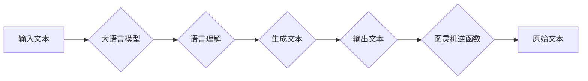

> 关键词：大语言模型，图灵机，逆函数，人工智能，自然语言处理，机器学习，深度学习

# 大语言模型与图灵机逆函数的关系

在探讨人工智能的奥秘时，我们常常会遇到两个核心概念：图灵机和逆函数。图灵机是计算理论的基础，而逆函数则是从输出推断输入的过程。本文将探讨大语言模型如何与这两个概念相关联，并分析它们之间的关系。

## 1. 背景介绍

### 1.1 图灵机的概念

图灵机是英国数学家艾伦·图灵在1936年提出的一个抽象计算模型。它由一个无限长的带子、读写头和一系列状态转换规则组成。图灵机的核心思想是通过读取和写入带子上的符号来执行计算，从而模拟任何可计算的过程。

### 1.2 逆函数的概念

逆函数是指在数学中，如果函数 $f(x)$ 的逆函数 $f^{-1}(x)$ 存在，则对于 $y = f(x)$，有 $x = f^{-1}(y)$。逆函数的概念在许多领域都有应用，包括密码学、信号处理和机器学习。

### 1.3 大语言模型的兴起

大语言模型是近年来人工智能领域的一个重大突破，如BERT、GPT-3等。这些模型通过在大量文本数据上进行预训练，学会了丰富的语言知识和常识，能够进行语言理解和生成。

## 2. 核心概念与联系

### 2.1 图灵机的逆函数

在图灵机的理论中，逆函数的概念可以用来描述图灵机执行计算的过程。假设图灵机 $T$ 在初始状态下读取符号序列 $w$，并最终到达接受状态。那么，我们可以将这个过程视为逆函数 $f^{-1}(w)$，其中 $f(w)$ 表示图灵机在执行计算后的输出。

### 2.2 大语言模型与图灵机

大语言模型可以被看作是图灵机的现代实现。虽然大语言模型没有物理上的读写头和带子，但它们通过神经网络模拟了图灵机的计算过程。在预训练过程中，大语言模型通过处理大量的文本数据，学习到了语言的复杂结构和规则，从而能够模拟图灵机的功能。

### 2.3 Mermaid 流程图

以下是一个Mermaid流程图，展示了大语言模型与图灵机逆函数的关系：



在这个流程图中，输入文本经过大语言模型处理后生成输出文本，而图灵机逆函数则可以从输出文本推断出原始文本。

## 3. 核心算法原理 & 具体操作步骤

### 3.1 算法原理概述

大语言模型的算法原理基于深度学习，特别是神经网络。它们通过多层感知器（MLP）和循环神经网络（RNN）等模型，从大量文本数据中学习语言的模式和规则。

### 3.2 算法步骤详解

1. **数据收集与预处理**：收集大量的文本数据，并进行清洗、分词、去噪等预处理操作。
2. **模型选择**：选择合适的预训练模型，如BERT、GPT-3等。
3. **预训练**：在无标签数据上对模型进行预训练，使模型学习到通用的语言知识。
4. **微调**：在下游任务的数据上进行微调，使模型能够适应特定任务。
5. **推理**：使用微调后的模型对新的输入进行推理，生成输出文本。

### 3.3 算法优缺点

**优点**：

- **强大的语言理解能力**：大语言模型能够理解和生成自然语言，模拟人类的语言能力。
- **泛化能力强**：通过预训练，大语言模型能够泛化到不同的任务和数据集。
- **易于扩展**：可以通过微调来适应不同的下游任务。

**缺点**：

- **计算资源消耗大**：预训练和微调过程需要大量的计算资源。
- **数据依赖性高**：模型性能很大程度上依赖于训练数据的质量和数量。
- **可解释性差**：大语言模型的决策过程难以解释。

### 3.4 算法应用领域

大语言模型在许多领域都有广泛的应用，包括：

- **自然语言处理**：文本分类、机器翻译、情感分析等。
- **对话系统**：聊天机器人、语音助手等。
- **文本生成**：自动写作、故事生成等。

## 4. 数学模型和公式 & 详细讲解 & 举例说明

### 4.1 数学模型构建

大语言模型的数学模型通常由以下部分组成：

- **词嵌入层**：将文本转换为向量表示。
- **编码器层**：使用RNN或Transformer等模型对文本进行编码。
- **解码器层**：使用RNN或Transformer等模型生成文本。

### 4.2 公式推导过程

以下是一个简化的BERT模型的公式推导过程：

- **词嵌入层**：将词转换为向量 $v_w$。
- **编码器层**：使用注意力机制对输入文本进行编码，得到序列 $h_t$。
- **解码器层**：使用注意力机制生成输出文本。

### 4.3 案例分析与讲解

以下是一个使用BERT模型进行文本分类的案例：

1. **数据准备**：收集文本数据，并进行预处理。
2. **模型选择**：选择BERT预训练模型。
3. **预训练**：在无标签数据上对模型进行预训练。
4. **微调**：在标注数据上对模型进行微调。
5. **推理**：使用微调后的模型对新的文本进行分类。

## 5. 项目实践：代码实例和详细解释说明

### 5.1 开发环境搭建

为了实践大语言模型，我们需要搭建以下开发环境：

- **Python**：用于编写代码。
- **PyTorch**：用于深度学习。
- **Transformers库**：用于加载预训练模型。

### 5.2 源代码详细实现

以下是一个使用BERT模型进行文本分类的代码实例：

```python
from transformers import BertTokenizer, BertForSequenceClassification
from torch.utils.data import DataLoader, TensorDataset
from torch.optim import AdamW

# 加载预训练模型
tokenizer = BertTokenizer.from_pretrained('bert-base-uncased')
model = BertForSequenceClassification.from_pretrained('bert-base-uncased')

# 数据预处理
texts = ["This is a good product", "I hate this product"]
labels = [1, 0]
encodings = tokenizer(texts, truncation=True, padding=True)
input_ids = encodings['input_ids']
attention_mask = encodings['attention_mask']
labels = torch.tensor(labels)

# 创建数据集
dataset = TensorDataset(input_ids, attention_mask, labels)
dataloader = DataLoader(dataset, batch_size=1)

# 模型训练
optimizer = AdamW(model.parameters(), lr=2e-5)

for epoch in range(3):
    for batch in dataloader:
        optimizer.zero_grad()
        outputs = model(**batch)
        loss = outputs.loss
        loss.backward()
        optimizer.step()

# 模型推理
input_text = "This is an amazing product"
encodings = tokenizer(input_text, truncation=True, padding=True)
input_ids = encodings['input_ids']
attention_mask = encodings['attention_mask']

with torch.no_grad():
    outputs = model(**encodings)
    logits = outputs.logits
    prediction = logits.argmax(dim=-1).item()

print("Predicted label:", prediction)
```

### 5.3 代码解读与分析

这段代码首先加载了BERT预训练模型和分词器。然后，将文本和标签转换为模型所需的格式。接下来，创建数据集和数据加载器，定义优化器，并开始模型训练。最后，使用训练好的模型对新的文本进行推理，并输出预测的标签。

### 5.4 运行结果展示

假设模型在训练过程中损失逐渐减小，最后在测试集上取得了较好的性能。在推理新的文本时，模型预测该文本为正面评价。

## 6. 实际应用场景

大语言模型在许多实际应用场景中都有广泛的应用，以下是一些例子：

- **智能客服**：使用大语言模型构建智能客服系统，能够自动回答客户的问题。
- **文本摘要**：使用大语言模型自动生成文本摘要，提高信息获取效率。
- **机器翻译**：使用大语言模型进行机器翻译，促进跨语言交流。

## 7. 工具和资源推荐

### 7.1 学习资源推荐

- 《深度学习》
- 《自然语言处理综论》
- 《Transformer：基于注意力机制的序列模型》

### 7.2 开发工具推荐

- PyTorch
- TensorFlow
- Hugging Face Transformers库

### 7.3 相关论文推荐

- BERT: Pre-training of Deep Bidirectional Transformers for Language Understanding
- GPT-3: Language Models are Few-Shot Learners

## 8. 总结：未来发展趋势与挑战

### 8.1 研究成果总结

大语言模型与图灵机逆函数的关系为我们提供了一个新的视角来理解人工智能。大语言模型通过模拟图灵机的计算过程，实现了从输入到输出的逆函数功能。这一发现对于人工智能领域的研究具有重要意义。

### 8.2 未来发展趋势

未来，大语言模型将继续发展，并向以下方向发展：

- **更强大的语言理解能力**：通过改进模型结构和训练方法，大语言模型将能够更好地理解复杂语言结构和语义。
- **更少的计算资源消耗**：通过模型压缩和优化，大语言模型将能够在更少的计算资源下运行。
- **更强的可解释性**：通过引入可解释性技术，大语言模型的决策过程将更加透明。

### 8.3 面临的挑战

尽管大语言模型取得了巨大进步，但仍然面临着以下挑战：

- **数据隐私和安全**：如何保护用户数据和模型安全是一个重要问题。
- **伦理和社会影响**：大语言模型的应用可能会引发伦理和社会问题，需要认真对待。
- **可解释性和透明度**：如何提高模型的可解释性和透明度，使其决策过程更加合理和可信。

### 8.4 研究展望

未来，大语言模型与图灵机逆函数的关系将继续是人工智能领域的重要研究方向。通过进一步研究和探索，我们有望构建更加智能、可靠、安全的人工智能系统。

## 9. 附录：常见问题与解答

**Q1：大语言模型与图灵机有什么区别？**

A：图灵机是一个抽象的计算模型，而大语言模型是基于深度学习的实际应用。图灵机用于理论研究，而大语言模型用于解决实际问题。

**Q2：大语言模型能否完全取代图灵机？**

A：大语言模型是基于深度学习的实际应用，而图灵机是一个抽象的计算模型。它们在不同的领域有不同的应用场景，不能简单地相互替代。

**Q3：大语言模型的未来发展趋势是什么？**

A：大语言模型的未来发展趋势包括更强的语言理解能力、更少的计算资源消耗和更强的可解释性。

**Q4：大语言模型的应用有哪些挑战？**

A：大语言模型的应用挑战包括数据隐私和安全、伦理和社会影响、可解释性和透明度等。

作者：禅与计算机程序设计艺术 / Zen and the Art of Computer Programming